# LLM Workflows vs. AI Agents: Choosing the Right Architecture for Your AI Application

As an AI engineer preparing to build your first real AI application, after narrowing down the problem you want to solve, one key decision is how to design your AI solution. Should it follow a predictable, step-by-step workflow, or does it demand a more autonomous approach, where the LLM makes self-directed decisions? This is one of the fundamental questions that will determine the success or failure of your project: How should you architect your AI system?

Choose the wrong path, and you might build an overly rigid system that breaks with new features, or an unpredictable agent that fails when it matters most. You could waste months rebuilding, burn through your budget with surprise costs, and end up with frustrated users.

In 2024 and 2025, we have seen billion-dollar AI startups succeed or fail based on this architectural decision. The most successful AI engineers know when to use workflows versus agents and, more importantly, how to combine both approaches effectively.

By the end of this lesson, we will provide you with a framework to confidently make this critical decision. You will understand the fundamental trade-offs, see real-world examples from leading AI companies, and learn how to design systems that leverage the best of both worlds.

## Understanding the Spectrum: From Workflows to Agents

Before choosing a path, you need to understand the two core methodologies. While the technical specifics can get complex, the core ideas are intuitive.

**LLM workflows** are sequences of tasks orchestrated by developer-written code. Think of a factory assembly line: each step is predefined, and the process is predictable. Your code calls the LLM, retrieves data, or executes an action in a specific order. This gives you explicit control over the entire process. In future lessons, we will explore common workflow patterns like chaining, routing, and the orchestrator-worker model.

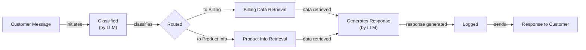
Image 1: A flowchart illustrating a simple LLM workflow for customer support.

**AI agents**, on the other hand, are systems where the LLM dynamically decides the sequence of steps to achieve a goal. Instead of following a script, the agent reasons about the task and chooses its own actions. Think of a skilled expert tackling an unfamiliar problem, adapting their approach as they learn more. This gives the system flexibility and autonomy. We will cover the building blocks of agents, such as tools, memory, and the ReAct pattern, in upcoming lessons.

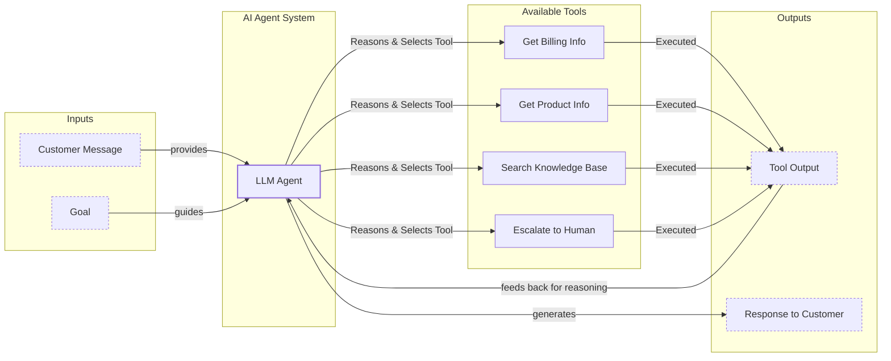
Image 2: A flowchart illustrating a simple AI agent system, showing the flow from customer input to response, including the LLM agent's reasoning, tool selection, execution, and feedback loop.

Both approaches require an orchestration layer. In workflows, this layer executes your predefined plan. In agents, it facilitates the LLM's dynamic planning and execution [[1]](https://www.anthropic.com/engineering/building-effective-agents), [[2]](https://cloud.google.com/discover/what-are-ai-agents).

## Choosing Your Path

The core difference between these two approaches comes down to a single question: who is in control? Is it your code or the LLM? Most real-world systems are not a binary choice but a spectrum between full developer control and full LLM autonomy.

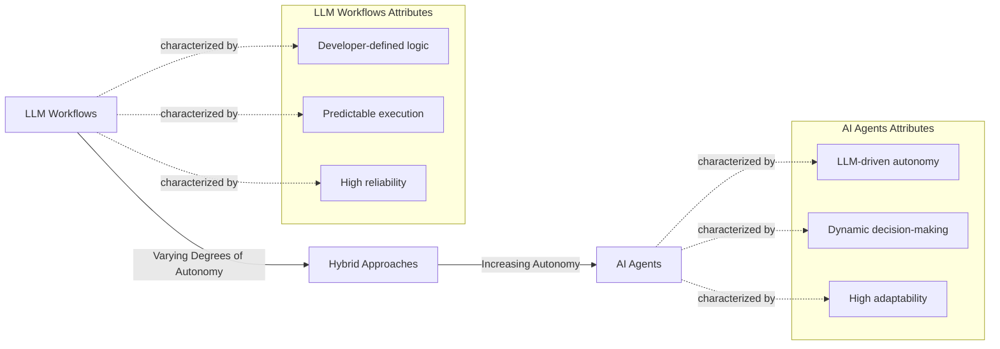
Image 3: A spectrum illustrating the transition from LLM Workflows to AI Agents, highlighting their defining characteristics and the increase in autonomy.

LLM workflows are best for structured, repeatable tasks like data extraction, report generation, or content repurposing. They offer predictability, reliability, and easier debugging, making them ideal for enterprise environments or regulated fields like finance and healthcare, where consistency is critical. While they may require more upfront development, their operational costs and latency are often lower and more predictable.

AI agents excel at open-ended, dynamic problems like complex research, code debugging, or interactive customer support. Their strength lies in adaptability and the ability to handle ambiguity. However, this flexibility comes at a cost. Agents can be unreliable, expensive, and difficult to debug. Their non-deterministic nature means performance, latency, and costs can vary with each run. There are even stories of agents deleting entire codebases, leading to jokes like, "Anyway, I wanted to start a new project."

In reality, most modern AI applications are hybrid systems. Andrej Karpathy introduced the concept of an "autonomy slider," where you decide how much control to give the LLM [[3]](https://singjupost.com/andrej-karpathy-software-is-changing-again/). For example, the coding assistant Cursor offers everything from simple tab-completion (low autonomy) to letting an agent rewrite an entire repository (high autonomy). Similarly, Perplexity provides a quick search (workflow-like) or a "deep research" mode that functions more like an agent [[3]](https://singjupost.com/andrej-karpathy-software-is-changing-again/). The goal is to speed up the loop between AI generation and human verification, which is often achieved through a combination of smart architecture and a well-designed user interface.

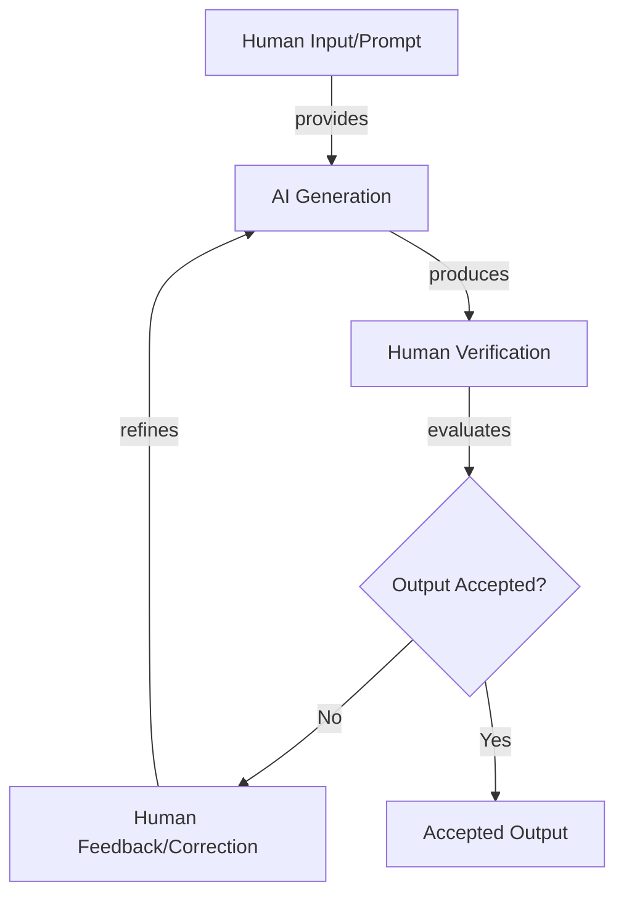
Image 4: A circular flow diagram illustrating the iterative "AI Generation and Human Verification Loop".

## Exploring Common Patterns

To build your intuition, let's look at the most common patterns used to construct both workflows and agents. We will cover these in much greater detail in future lessons, but for now, we will focus on the high-level concepts.

For LLM workflows, several patterns help structure interactions:
- **Chaining and routing** are the first steps toward automation. Chaining links multiple LLM calls together in a sequence, while routing directs a task to the most appropriate chain based on the input [[4]](https://mlpills.substack.com/p/issue-110-llm-workflow-patterns).

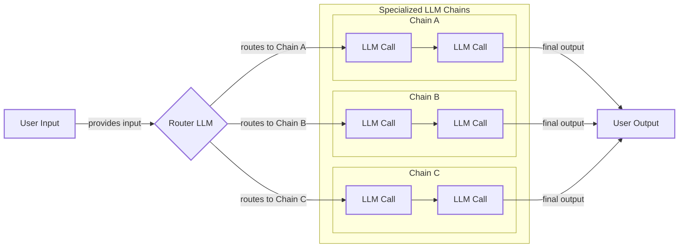
Image 5: A flowchart illustrating an LLM workflow combining chaining and routing.

- The **orchestrator-worker** pattern uses a central LLM to break down a task, delegate sub-tasks to specialized "worker" LLMs, and synthesize the final answer. This bridges the gap between predefined workflows and dynamic agents [[5]](https://platform.claude.com/cookbook/patterns-agents-orchestrator-workers).

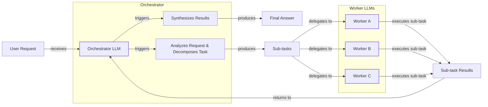
Image 6: A flowchart illustrating the Orchestrator-Worker pattern.

- The **evaluator-optimizer loop** improves output quality through automated feedback. One LLM generates a response, while another acts as a reviewer, providing corrections until the output meets a certain standard, much like a human writer refining a draft [[6]](https://platform.claude.com/cookbook/patterns-agents-evaluator-optimizer).

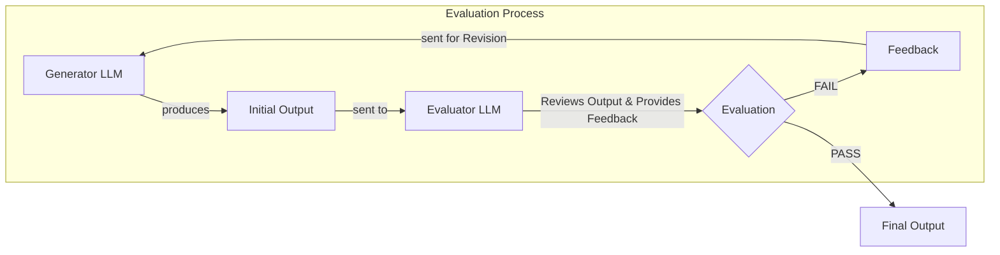
Image 7: A feedback loop diagram illustrating the Evaluator-Optimizer workflow.

For AI agents, the most common pattern is **ReAct (Reason and Act)**. This is the engine that drives most modern agents. The agent reasons about a task, decides on an action (like calling a tool), observes the result, and repeats the cycle until the task is complete. This loop is supported by core components like an LLM for reasoning, tools for taking actions, and memory to maintain context.

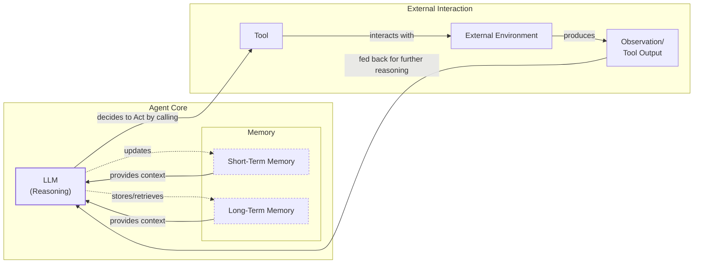
Image 8: A loop diagram illustrating the ReAct (Reason and Act) pattern for an AI agent, showing the interaction between the LLM, tools, external environment, observations, and memory.

## Zooming In on Our Favorite Examples

To make these concepts concrete, let's look at a few state-of-the-art examples, from a simple workflow to a complex hybrid system.

### Gemini Document Summarization (Workflow)

A common problem in team collaboration is finding the right information within large documents. Gemini's summarization feature in Google Workspace is a perfect example of a pure workflow [[7]](https://cloud.google.com/blog/products/ai-machine-learning/long-document-summarization-with-workflows-and-gemini-models). It follows a predefined sequence: the document is split into chunks, each chunk is summarized in parallel by an LLM, and then a final summary is generated from all the chunk summaries. This "map-reduce" approach is efficient and reliable, making it a classic workflow pattern.

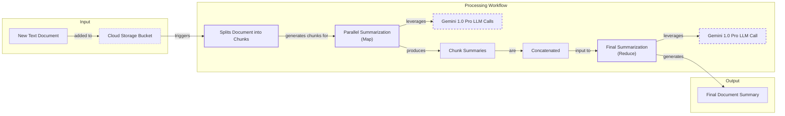
Image 9: A flowchart illustrating the Gemini document summarization and analysis workflow in Google Workspace.

### Gemini CLI (Agent)

Writing code is often a slow, manual process. The open-source Gemini CLI acts as a coding assistant, using a ReAct agent architecture to speed things up [[8]](https://developers.google.com/gemini-code-assist/docs/gemini-cli). It gathers context from your codebase, reasons about your request, forms an execution plan, and then uses tools to read files, search documentation, or generate code. It even validates the code it writes and can loop through this process until the task is complete, often with a human in the loop for validation [[9]](https://blog.google/technology/developers/introducing-gemini-cli-open-source-ai-agent/).

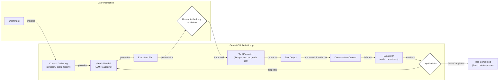
Image 10: Operational flow of the Gemini CLI coding assistant implementing a ReAct pattern.

### Perplexity Deep Research (Hybrid)

Researching a new topic can be daunting. Perplexity’s Deep Research feature is a hybrid system that combines workflows and agents to perform expert-level autonomous research [[10]](https://www.perplexity.ai/hub/blog/introducing-perplexity-deep-research). An orchestrator agent decomposes a research question into targeted sub-questions. Then, a workflow deploys multiple specialized agents in parallel, each tasked with gathering and summarizing information on a single sub-question. The orchestrator synthesizes these reports, identifies knowledge gaps, and iteratively repeats the process until a comprehensive answer is formed. This is a brilliant example of a structured workflow managing dynamic, autonomous agents.

```mermaid
flowchart LR
  %% User Input
  URQ["User Research Question"]

  %% Orchestration Layer
  subgraph "Orchestration"
    RPD["Research Planning & Decomposition"]
    IRGA["Iterative Refinement & Gap Analysis"]
    KG{"Knowledge Gaps?"}
    FRG["Final Report Generation"]
  end

  %% Agent Layer
  subgraph "Agent Operations"
    TSQ["Targeted Sub-questions"]
    SSA["Specialized Search Agents"]
    A["Agent A"]
    B["Agent B"]
    LT["Leverage Tools<br/>(web search, document retrieval)"]
    SRC["Sources"]
    AS_A["Analysis & Synthesis<br/>(Agent A)"]
    AS_B["Analysis & Synthesis<br/>(Agent B)"]
    SR_A["Summarized Reports<br/>(Agent A)"]
    SR_B["Summarized Reports<br/>(Agent B)"]
  end

  %% Final Output Component
  IC["Inline Citations"]

  %% Flow Definition
  URQ -- "initiates" --> RPD
  RPD -- "decomposes into" --> TSQ

  TSQ -- "assigned to" --> SSA
  SSA -- "activates" --> A
  SSA -- "activates" --> B

  A -- "leverages" --> LT
  B -- "leverages" --> LT
  LT -- "gathers" --> SRC

  SRC -- "processed by" --> AS_A
  SRC -- "processed by" --> AS_B

  AS_A -- "produces" --> SR_A
  AS_B -- "produces" --> SR_B

  SR_A -- "consolidated by" --> IRGA
  SR_B -- "consolidated by" --> IRGA

  IRGA -- "identifies" --> KG

  KG -- "Yes, repeat" --> RPD
  KG -- "No gaps or max steps reached" --> FRG

  FRG -- "contains" --> IC

  %% Visual Styling
  classDef process_step stroke-width:2px
  classDef data_artifact stroke-dasharray:3,3

  class RPD,IRGA,FRG process_step
  class TSQ,SRC,SR_A,SR_B,IC data_artifact
  class SSA,A,B,LT,AS_A,AS_B process_step
```
Image 11: A loop diagram illustrating the iterative multi-step process of Perplexity's Deep Research agent.

## Conclusion: The Challenges of Every AI Engineer

You now understand the spectrum from LLM workflows to AI agents. Every AI engineer, whether at a startup or a Fortune 500 company, faces these same architectural decisions. The choices you make will determine whether your AI application succeeds in production or fails spectacularly. Reliability issues, context limits, data integration challenges, the cost-performance trap, and security concerns are the daily battles of building with AI [[11]](https://arxiv.org/html/2510.25423v2).

The good news is that these challenges are solvable. In our next lesson, we will explore structured outputs, a key technique for making LLM interactions more reliable. Throughout this course, we will cover patterns for building robust products through evaluation and monitoring, strategies for designing effective hybrid systems, and ways to keep costs and latency under control. By the end, you will have the knowledge to architect AI systems that are powerful, efficient, and safe.

## References

- [1] Anthropic. (2024). Building effective agents. [https://www.anthropic.com/engineering/building-effective-agents](https://www.anthropic.com/engineering/building-effective-agents)
- [2] Google Cloud. (2026). What is an AI agent? [https://cloud.google.com/discover/what-are-ai-agents](https://cloud.google.com/discover/what-are-ai-agents)
- [3] Karpathy, A. (2025). Andrej Karpathy: Software Is Changing (Again). The Singju Post. [https://singjupost.com/andrej-karpathy-software-is-changing-again/](https://singjupost.com/andrej-karpathy-software-is-changing-again/)
- [4] ML Pills. (2024). Issue 110: LLM Workflow Patterns. [https://mlpills.substack.com/p/issue-110-llm-workflow-patterns](https://mlpills.substack.com/p/issue-110-llm-workflow-patterns)
- [5] Anthropic. (2024). Orchestrator-Workers Workflow. Claude Cookbook. [https://platform.claude.com/cookbook/patterns-agents-orchestrator-workers](https://platform.claude.com/cookbook/patterns-agents-orchestrator-workers)
- [6] Anthropic. (2024). Evaluator optimizer. Claude Cookbook. [https://platform.claude.com/cookbook/patterns-agents-evaluator-optimizer](https://platform.claude.com/cookbook/patterns-agents-evaluator-optimizer)
- [7] Laforge, G., & Spruyt, R. (2024). Long document summarization with Workflows and Gemini models. Google Cloud Blog. [https://cloud.google.com/blog/products/ai-machine-learning/long-document-summarization-with-workflows-and-gemini-models](https://cloud.google.com/blog/products/ai-machine-learning/long-document-summarization-with-workflows-and-gemini-models)
- [8] Google for Developers. (2024). Gemini CLI. [https://developers.google.com/gemini-code-assist/docs/gemini-cli](https://developers.google.com/gemini-code-assist/docs/gemini-cli)
- [9] Mullen, T., & Salva, R. J. (2025). Gemini CLI: your open-source AI agent. The Keyword. [https://blog.google/technology/developers/introducing-gemini-cli-open-source-ai-agent/](https://blog.google/technology/developers/introducing-gemini-cli-open-source-ai-agent/)
- [10] Perplexity Team. (2025). Introducing Perplexity Deep Research. Perplexity Blog. [https://www.perplexity.ai/hub/blog/introducing-perplexity-deep-research](https://www.perplexity.ai/hub/blog/introducing-perplexity-deep-research)
- [11] Asgari, A., Panichella, A., Derakhshanfar, P., & Olsthoorn, M. (2025). What Challenges Do Developers Face in AI Agent Systems? An Empirical Study on Stack Overflow & GitHub Issues. arXiv. [https://arxiv.org/html/2510.25423v2](https://arxiv.org/html/2510.25423v2)