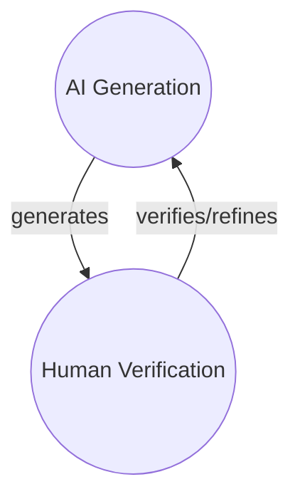
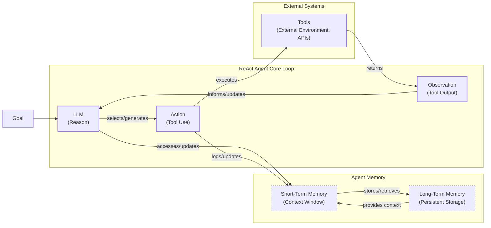
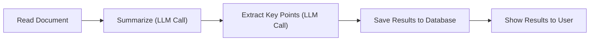
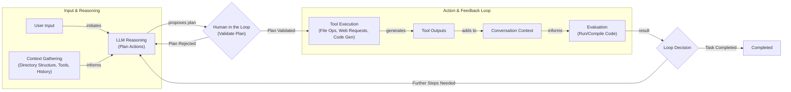
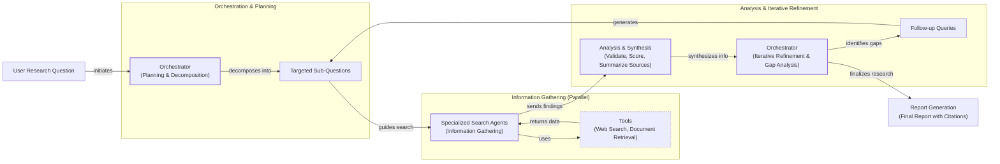

# Lesson 2: AI Agents vs. LLM Workflows

As an AI engineer preparing to build your first real AI application, after narrowing down the problem you want to solve, one key decision is how to design your AI solution. Should it follow a predictable, step-by-step workflow, or does it demand a more autonomous approach, where the LLM makes self-directed decisions along the way? Thus one of the fundamental questions that will determine the success or failure of your project is: How should you architect your AI system?

Choose the wrong approach, and you might end up with a rigid system that breaks when users deviate, an unpredictable agent that fails catastrophically, or months of wasted development time rebuilding the entire architecture. The most successful AI engineers know when to use workflows versus agents and, more importantly, how to combine both approaches effectively.

This lesson will provide you with a framework to make this critical decision confidently. You will learn the fundamental trade-offs between LLM workflows and AI agents, see real-world examples from leading AI companies, and understand how to design systems that leverage the best of both worlds.

## Understanding the Spectrum: From Workflows to Agents

To choose between workflows and agents, you need a clear understanding of what they are. While the terms are often used interchangeably, they represent two distinct architectural philosophies.

**LLM workflows** are sequences of tasks orchestrated by developer-written code. Think of them as a factory assembly line: each step is predefined, and the control flow is explicit. The developer, not the LLM, decides what happens next. This approach is predictable and reliable, making it ideal for tasks with a clear, repeatable structure. Workflows exist because standalone LLMs have inherent limitations; they lack long-term memory and cannot autonomously interact with external tools or dynamic environments. A workflow provides the structured scaffolding to overcome these constraints [[21]](https://arxiv.org/html/2510.09244v1). We will explore specific workflow patterns like chaining, routing, and the orchestrator-worker model in future lessons.
Image 1: A high-level comparison of a workflow's predefined path versus an agent's dynamic decision-making loop. (Source [Exploring the difference between agents and workflows](https://decodingml.substack.com/p/llmops-for-production-agentic-rag) [[13]](https://decodingml.substack.com/p/llmops-for-production-agentic-rag))

**AI agents**, on the other hand, are systems where the LLM dynamically plans the sequence of steps to achieve a goal. Instead of following a script, the agent reasons about the task, selects actions (which we will cover as "tools" in Lesson 6), and adapts its approach based on the outcomes. This is like a skilled human expert tackling an unfamiliar problem. The LLM is in the driver's seat, navigating ambiguity and making decisions on the fly. This autonomy is powered by core components like memory and reasoning patterns such as ReAct, which we will cover in detail later in the course.

Both architectures rely on an orchestration layer. In a workflow, the orchestrator executes a developer-defined plan. In an agent, it facilitates the LLM's dynamic planning and execution loop.

## Choosing Your Path

The core difference between these two approaches comes down to a single question: who is in control? Is it the developer-defined logic or the LLM-driven autonomy? The answer determines your system's trade-offs between reliability and flexibility.
Image 2: The spectrum from developer-controlled workflows to LLM-controlled agents. (Image by Hailey Quach from [A Developer’s Guide to Building Scalable AI: Workflows vs Agents](https://towardsdatascience.com/a-developers-guide-to-building-scalable-ai-workflows-vs-agents/) [[14]](https://towardsdatascience.com/a-developers-guide-to-building-scalable-ai-workflows-vs-agents/))

### When to use LLM workflows

Workflows are the backbone of most production-grade AI systems, especially in enterprise or regulated fields where predictability is non-negotiable. If you can map out the steps to solve a problem, a workflow is almost always the right choice.

-   **Strengths:** They are reliable, testable, and easier to debug. Costs and latency are predictable because the execution path is fixed. This makes them perfect for high-frequency, low-complexity tasks like data extraction, automated reporting, or content repurposing.
-   **Weaknesses:** Workflows can be rigid. They struggle with unexpected user inputs or tasks that require dynamic adaptation. Adding new features can become complex, as every new path must be explicitly coded.

### When to use AI agents

Agents are best suited for open-ended problems where the solution path is not known in advance.

-   **Strengths:** Their main advantage is flexibility. Agents can handle ambiguity, adapt to new information, and solve problems creatively. This makes them powerful for tasks like open-ended research, complex customer support, or code debugging.
-   **Weaknesses:** This autonomy comes at a cost. Agents are less reliable, harder to debug, and can have unpredictable costs and latency. Security is also a major concern; an agent with write-permissions could delete files or send incorrect emails if its reasoning goes astray.

### Hybrid Approaches

In reality, the choice is not a binary one. Most advanced AI systems exist on a spectrum, blending the reliability of workflows with the flexibility of agents. Andrej Karpathy describes this as an "autonomy slider," where the user or developer decides how much control to give the AI [[2]](https://singjupost.com/andrej-karpathy-software-is-changing-again/).

Coding assistants like Cursor and research tools like Perplexity are great examples. In Cursor, you can go from simple tab-completion (low autonomy) to letting an agent refactor your entire repository (high autonomy). Similarly, Perplexity offers a "quick search" (workflow-like) and a "deep research" mode (agentic) [[2]](https://singjupost.com/andrej-karpathy-software-is-changing-again/).

The goal is to design systems that speed up the loop between AI generation and human verification. A well-designed UI and a hybrid architecture allow you to leverage AI's speed while keeping a human in the loop for critical judgment.


Image 3: A circular flow diagram illustrating the AI generation and human verification loop.

## Exploring Common Patterns

To build an intuition for AI engineering, let's look at the common patterns used to build both workflows and agents. We will only touch on these briefly, as each will be covered in-depth in future lessons.

### LLM Workflows

-   **Chaining and Routing:** This is the simplest form of automation, where the output of one LLM call becomes the input for the next. Routers can be added to direct the workflow down different paths based on specific conditions, gluing together multiple LLM calls into a coherent process.
    ```mermaid
flowchart LR
  %% Workflow Start
  A["User Input"] --> B{"Router"}

  %% Routing to LLM Calls
  B -- "Route to LLM 1" --> C["LLM Call 1"]
  B -- "Route to LLM 2" --> D["LLM Call 2"]
  B -- "Route to LLM 3" --> E["LLM Call 3"]

  %% Chaining and Re-routing Logic
  C -- "Output for further routing" --> B
  C -- "Chain to LLM 2" --> D
  C -- "Direct Final Output" --> F["Final Output"]

  D -- "Output for further routing" --> B
  D -- "Chain to LLM 3" --> E
  D -- "Direct Final Output" --> F

  E -- "Output for further routing" --> B
  E -- "Final Result" --> F["Final Output"]
```
Image 4: A flowchart illustrating the "Chaining and Routing" pattern for LLM workflows.

-   **Orchestrator-Worker:** In this pattern, a central "orchestrator" LLM analyzes a task and delegates sub-tasks to specialized "worker" LLMs. This approach mirrors the microservices architecture, where a complex task is decomposed into specialized services. It parallels hierarchical control systems in robotics and allows for greater modularity, bridging the gap between rigid workflows and fully autonomous agents [[3]](https://platform.claude.com/cookbook/patterns-agents-orchestrator-workers), [[4]](https://mlpills.substack.com/p/diy-17-orchestrator-worker-llm-agent), [[22]](https://www.softwareseni.com/the-microservices-moment-for-artificial-intelligence-and-how-multi-agent-orchestration-changes-everything/), [[23]](https://yourgpt.ai/blog/general/multi-agent-systems-in-ai).
    ```mermaid
flowchart LR
  %% External Input
  UserRequest["User Request"]

  %% Orchestrator Component
  subgraph Orchestrator["Orchestrator"]
    OrchestratorLLM["Orchestrator LLM"]
  end

  %% Worker Components
  subgraph Workers["Worker LLMs"]
    WorkerLLM1["Worker LLM 1"]
    WorkerLLM2["Worker LLM 2"]
  end

  %% Data Flow
  Results["Results"]
  FinalAnswer["Final Answer"]

  %% Primary Flow
  UserRequest -- "receives" --> OrchestratorLLM
  OrchestratorLLM -- "dynamically decomposes task<br/>& delegates" --> WorkerLLM1
  OrchestratorLLM -- "dynamically decomposes task<br/>& delegates" --> WorkerLLM2

  WorkerLLM1 -- "performs specialized task" --> Results
  WorkerLLM2 -- "performs specialized task" --> Results

  Results -- "sent for synthesis" --> OrchestratorLLM
  OrchestratorLLM -- "synthesizes & produces" --> FinalAnswer

  %% Visual differentiation for LLMs
  classDef llm stroke-width:2px
  class OrchestratorLLM,WorkerLLM1,WorkerLLM2 llm
```
Image 5: A flowchart illustrating the Orchestrator-Worker pattern with dynamic task decomposition and delegation.

-   **Evaluator-Optimizer Loop:** This pattern improves output quality through self-correction. One LLM generates a response, while a second "evaluator" LLM critiques it based on a set of criteria. The feedback is passed back to the generator, which refines its output. This loop repeats until the desired quality is achieved, mimicking how a human writer refines a document based on an editor's feedback [[5]](https://docs.aws.amazon.com/prescriptive-guidance/latest/agentic-ai-patterns/evaluator-reflect-refine-loop-patterns.html).
    ```mermaid
flowchart LR
  %% LLM components
  subgraph "LLMs"
    GeneratorLLM["Generator LLM"]
    EvaluatorLLM["Evaluator LLM"]
  end

  %% Outputs, Feedback, and Decision
  InitialOutput["Initial Output"]
  Feedback["Feedback"]
  OutputCriteria{"Output Meets Criteria?"}
  FinalOutput["Final Output"]

  %% Flow
  GeneratorLLM -- "produces" --> InitialOutput
  InitialOutput -- "sent for evaluation" --> EvaluatorLLM
  EvaluatorLLM -- "reviews output & provides feedback" --> OutputCriteria
  OutputCriteria -- "No" --> Feedback
  Feedback -- "sent for revision" --> GeneratorLLM
  OutputCriteria -- "Yes" --> FinalOutput

  %% Visual grouping
  classDef llm stroke-width:2px
  class GeneratorLLM,EvaluatorLLM llm
```
Image 6: A feedback loop diagram illustrating the "Evaluator-Optimizer" pattern.

### AI Agents

Most modern agents are built using the **ReAct (Reason and Act)** pattern. This framework allows an agent to reason about a task, choose an action (tool) to perform, observe the outcome, and then repeat the cycle until the goal is complete [[6]](https://cloud.google.com/discover/what-are-ai-agents). This iterative loop of thought, action, and observation is what gives agents their dynamic problem-solving ability. A ReAct agent consists of a few core components: an LLM for reasoning, a set of tools for taking actions, and memory to maintain context. We will explore ReAct agents in detail in Lessons 7 and 8.


Image 7: A flowchart illustrating the high-level dynamics of a ReAct AI agent, showing the iterative loop of reasoning, acting, and observing, along with interactions with external tools and memory components.

## Zooming In on Our Favorite Examples

To anchor these concepts in the real world, let's analyze a few examples, from a simple workflow to a complex hybrid system.

### Document Summarization in Google Workspace: A Pure Workflow

**Problem:** Navigating large documents to find specific information is time-consuming. An embedded summary can quickly orient users and guide their search.

The "Summary by Gemini" feature in Google Workspace is a perfect example of a pure, multi-step workflow [[7]](https://masterconcept.ai/blog/new-google-workspace-gemini-feature-your-pdfs-now-write-their-own-summaries-and-suggest-next-steps/), [[8]](https://cloud.google.com/blog/products/ai-machine-learning/long-document-summarization-with-workflows-and-gemini-models). It follows a predefined "map-reduce" process: the document is split into chunks, each chunk is summarized in parallel by an LLM, and then a final LLM call synthesizes these smaller summaries into a single, coherent overview. Each step is hardcoded, making it a reliable and efficient workflow.


Image 8: A simple linear flowchart illustrating the "Document Summarization and Analysis Workflow by Gemini in Google Workspace".

### Gemini CLI: A Single-Agent System

**Problem:** Writing, debugging, and understanding code is a slow, manual process. A coding assistant can dramatically accelerate development.

The open-source Gemini CLI is a single-agent system that uses the ReAct pattern to help with coding tasks [[9]](https://blog.google/technology/developers/introducing-gemini-cli-open-source-ai-agent/), [[10]](https://developers.google.com/gemini-code-assist/docs/gemini-cli). It follows an operational loop:

1.  **Context Gathering:** It loads the directory structure, available tools, and conversation history.
2.  **LLM Reasoning:** The Gemini model plans the necessary actions to fulfill the user's request.
3.  **Human in the Loop:** It validates the execution plan with the user before proceeding.
4.  **Tool Execution:** It performs actions like reading files, searching the web for documentation, or generating code.
5.  **Evaluation:** It can run or compile the code to check for errors.
6.  **Loop Decision:** It determines if the task is complete or if more steps are needed, repeating the cycle.

This loop of reasoning, acting, and observing allows it to function as an autonomous assistant within a defined scope.


Image 9: Operational loop diagram for Gemini CLI coding assistant using the ReAct pattern.

### Perplexity Deep Research: A Hybrid System

**Problem:** Researching a new topic is often unstructured. You don't know where to start or what the best resources are. An automated research assistant can synthesize vast amounts of information into a comprehensive report.

Perplexity's Deep Research feature is a sophisticated hybrid system that combines structured workflows with dynamic, multi-agent reasoning [[11]](https://www.perplexity.ai/hub/blog/introducing-perplexity-deep-research). It performs dozens of searches across hundreds of sources to create expert-level reports in minutes. Here is a simplified view of how it might work:

1.  **Planning & Decomposition:** An orchestrator agent analyzes the research question and breaks it into targeted sub-questions.
2.  **Parallel Information Gathering:** Specialized search agents are deployed in parallel, each tackling a single sub-question using tools like web search.
3.  **Analysis & Synthesis:** Each agent validates its sources and summarizes the key findings.
4.  **Iterative Refinement:** The orchestrator synthesizes the results, identifies knowledge gaps, and generates follow-up queries, repeating the process until the research is complete.
5.  **Report Generation:** Finally, the orchestrator compiles all the information into a single, cited report.

This system uses a workflow to orchestrate multiple autonomous agents, demonstrating how structured control and dynamic reasoning can be combined to solve complex, open-ended problems. This architecture reflects an emerging best practice: using reliable components (workflows) for stable tasks like data gathering, while deploying autonomous agents for the dynamic work of reasoning and planning [[22]](https://www.softwareseni.com/the-microservices-moment-for-artificial-intelligence-and-how-multi-agent-orchestration-changes-everything/).


Image 10: A multi-step iterative process diagram illustrating Perplexity's Deep Research agent as a hybrid system.

## The Challenges of Every AI Engineer

Now that you understand the spectrum from workflows to agents, it is important to recognize that every AI engineer faces these same fundamental architectural decisions. This choice is a core challenge that determines whether an AI application succeeds in production or fails.

As you build more complex systems, you will encounter recurring issues [[12]](https://arxiv.org/html/2510.25423v2):

-   **Reliability:** Agents that work perfectly in demos often become unpredictable with real users, as small early mistakes can cascade into major downstream failures [[24]](https://dev.to/wassimchegham/why-your-ai-agent-demo-falls-apart-in-production-1320).
-   **Context Limits:** Systems struggle to maintain coherence across long conversations, losing track of their original purpose.
-   **Data Integration:** Building robust pipelines to feed high-quality data into your AI system is a constant battle.
-   **Cost-Performance Trap:** Sophisticated agents can deliver impressive results but at a cost that makes them economically unfeasible.
-   **Security:** Autonomous agents with powerful permissions introduce significant risks, such as data exfiltration through prompt or tool injection attacks [[25]](https://thenewstack.io/red-teaming-enterprise-ai-agents/).

These issues often stem from fundamental LLM limitations like reasoning degradation and an inability to reliably self-verify their own outputs [[26]](https://openreview.net/forum?id=BIRDGVrom8), [[27]](https://openreview.net/pdf?id=jK4dbpEEMo). These challenges are solvable. In our next lesson, we will explore context engineering, the art of feeding the right information to an LLM. Throughout this course, we will cover patterns for building reliable systems, strategies for creating hybrid architectures, and methods for keeping costs and latency under control. By the end, you will have the knowledge to architect AI systems that are not only powerful but also robust, efficient, and safe.

## References

- [1] Anthropic. (2024). _Building effective agents_. [https://www.anthropic.com/engineering/building-effective-agents](https://www.anthropic.com/engineering/building-effective-agents)
- [2] Karpathy, A. (2025, June 20). Andrej Karpathy: Software Is Changing (Again). _The Singju Post_. [https://singjupost.com/andrej-karpathy-software-is-changing-again/](https://singjupost.com/andrej-karpathy-software-is-changing-again/)
- [3] Claude. (2024). _Orchestrator-Workers_. [https://platform.claude.com/cookbook/patterns-agents-orchestrator-workers](https://platform.claude.com/cookbook/patterns-agents-orchestrator-workers)
- [4] ML Pills. (2024). _DIY #17: Orchestrator-Worker LLM Agent Pattern_. [https://mlpills.substack.com/p/diy-17-orchestrator-worker-llm-agent](https://mlpills.substack.com/p/diy-17-orchestrator-worker-llm-agent)
- [5] AWS Prescriptive Guidance. (n.d.). _Evaluator, reflect, and refine loop patterns_. [https://docs.aws.amazon.com/prescriptive-guidance/latest/agentic-ai-patterns/evaluator-reflect-refine-loop-patterns.html](https://docs.aws.amazon.com/prescriptive-guidance/latest/agentic-ai-patterns/evaluator-reflect-refine-loop-patterns.html)
- [6] Google Cloud. (2026, April 2). _What is an AI agent?_ [https://cloud.google.com/discover/what-are-ai-agents](https://cloud.google.com/discover/what-are-ai-agents)
- [7] Master Concept. (2024). _New Google Workspace Gemini Feature: Your PDFs Now Write Their Own Summaries and Suggest Next Steps_. [https://masterconcept.ai/blog/new-google-workspace-gemini-feature-your-pdfs-now-write-their-own-summaries-and-suggest-next-steps/](https://masterconcept.ai/blog/new-google-workspace-gemini-feature-your-pdfs-now-write-their-own-summaries-and-suggest-next-steps/)
- [8] Laforge, G., & Spruyt, R. (2024, April 30). _Long document summarization with Workflows and Gemini models_. Google Cloud Blog. [https://cloud.google.com/blog/products/ai-machine-learning/long-document-summarization-with-workflows-and-gemini-models](https://cloud.google.com/blog/products/ai-machine-learning/long-document-summarization-with-workflows-and-gemini-models)
- [9] Mullen, T., & Salva, R. J. (2025, June 25). _Gemini CLI: your open-source AI agent_. The Keyword. [https://blog.google/technology/developers/introducing-gemini-cli-open-source-ai-agent/](https://blog.google/technology/developers/introducing-gemini-cli-open-source-ai-agent/)
- [10] Google for Developers. (n.d.). _Gemini CLI_. [https://developers.google.com/gemini-code-assist/docs/gemini-cli](https://developers.google.com/gemini-code-assist/docs/gemini-cli)
- [11] Perplexity Team. (2025, February 14). _Introducing Perplexity Deep Research_. Perplexity Blog. [https://www.perplexity.ai/hub/blog/introducing-perplexity-deep-research](https://www.perplexity.ai/hub/blog/introducing-perplexity-deep-research)
- [12] Al-Obaidi, W., et al. (2025). _What Challenges Do Developers Face in AI Agent Systems? An Empirical Study on Stack Overflow & GitHub Issues_. arXiv. [https://arxiv.org/html/2510.25423v2](https://arxiv.org/html/2510.25423v2)
- [13] Decoding ML. (n.d.). _Exploring the difference between agents and workflows_. [https://decodingml.substack.com/p/llmops-for-production-agentic-rag](https://decodingml.substack.com/p/llmops-for-production-agentic-rag)
- [14] Quach, H. (2025, June 27). _A Developer’s Guide to Building Scalable AI: Workflows vs Agents_. Towards Data Science. [https://towardsdatascience.com/a-developers-guide-to-building-scalable-ai-workflows-vs-agents/](https://towardsdatascience.com/a-developers-guide-to-building-scalable-ai-workflows-vs-agents/)
- [15] Louis-Philippe. (2024, July 23). _Real Agents vs. Workflows: The Truth Behind AI 'Agents'_ [Video]. YouTube. [https://www.youtube.com/watch?v=kQxr-uOxw2o&t=1s](https://www.youtube.com/watch?v=kQxr-uOxw2o&t=1s)
- [16] Google Cloud. (2026, April 22). _1,302 real-world gen AI use cases from the world's leading organizations_. [https://cloud.google.com/transform/101-real-world-generative-ai-use-cases-from-industry-leaders](https://cloud.google.com/transform/101-real-world-generative-ai-use-cases-from-industry-leaders)
- [17] Iusztin, P. (n.d.). _Stop Building AI Agents: Here’s what you should build instead_. Decoding ML. [https://decodingml.substack.com/p/stop-building-ai-agents](https://decodingml.substack.com/p/stop-building-ai-agents)
- [18] Liu, J. (2024, October 9). _Building Production-Ready RAG Applications_ [Video]. YouTube. [https://www.youtube.com/watch?v=TRjq7t2Ms5I](https://www.youtube.com/watch?v=TRjq7t2Ms5I)
- [19] Google. (n.d.). _Gemini CLI_. GitHub. [https://github.com/google-gemini/gemini-cli/blob/main/README.md](https://github.com/google-gemini/gemini-cli/blob/main/README.md)
- [20] OpenAI. (2025, July 17). _Introducing ChatGPT agent: bridging research and action_. [https://openai.com/index/introducing-chatgpt-agent/](https://openai.com/index/introducing-chatgpt-agent/)
- [21] Arnon, A., et al. (2025). _From LLM to Agent: A Taxonomy of Agentic AI Systems_. arXiv. [https://arxiv.org/html/2510.09244v1](https://arxiv.org/html/2510.09244v1)
- [22] SoftwareSeni. (2026, February 16). _The Microservices Moment for Artificial Intelligence and How Multi-Agent Orchestration Changes Everything_. [https://www.softwareseni.com/the-microservices-moment-for-artificial-intelligence-and-how-multi-agent-orchestration-changes-everything/](https://www.softwareseni.com/the-microservices-moment-for-artificial-intelligence-and-how-multi-agent-orchestration-changes-everything/)
- [23] YourGPT. (n.d.). _Multi-Agent Systems in AI_. [https://yourgpt.ai/blog/general/multi-agent-systems-in-ai](https://yourgpt.ai/blog/general/multi-agent-systems-in-ai)
- [24] Chegham, W. (2025, March 11). _Why your AI Agent Demo falls apart in Production_. DEV Community. [https://dev.to/wassimchegham/why-your-ai-agent-demo-falls-apart-in-production-1320](https://dev.to/wassimchegham/why-your-ai-agent-demo-falls-apart-in-production-1320)
- [25] The New Stack. (2025, November 11). _Red Teaming Enterprise AI Agents_. [https://thenewstack.io/red-teaming-enterprise-ai-agents/](https://thenewstack.io/red-teaming-enterprise-ai-agents/)
- [26] Stechly, K., et al. (2025). _TIGHT: A Task-agnostic Information-Geometric Approach to Hallucination, Context, and Knowledge in LLMs_. OpenReview. [https://openreview.net/forum?id=BIRDGVrom8](https://openreview.net/forum?id=BIRDGVrom8)
- [27] Zhu, Y., et al. (2025). _MACI: A Multi-Agent Chat framework for multi-agent systems to solve complex problems_. OpenReview. [https://openreview.net/pdf?id=jK4dbpEEMo](https://openreview.net/pdf?id=jK4dbpEEMo)