# Workflows vs. Agents: The Critical Decision Every AI Engineer Faces

As an AI engineer preparing to build your first real AI application, after narrowing down the problem you want to solve, one key decision is how to design your AI solution. Should it follow a predictable, step-by-step workflow, or does it demand a more autonomous approach, where the LLM makes self-directed decisions along the way? Thus one of the fundamental questions that will determine the success or failure of your project is: How should you architect your AI system? Choose the wrong approach, and you might end up with a rigid system that breaks, an unpredictable agent that fails catastrophically, or months of wasted development time.

In 2024 and 2025, this decision separates successful AI startups from failures. The best teams know when to use workflows versus agents and how to combine them. This lesson provides a framework to make this choice. You will understand the trade-offs between predefined LLM workflows and dynamic AI agents, see real-world examples, and learn to design systems that use the best of both approaches.

## Understanding the Spectrum: From Workflows to Agents

To choose between workflows and agents, you need a clear understanding of what they are. We will focus on their properties and uses, not deep technical specifics.

### LLM Workflows

An LLM workflow is a sequence of tasks involving LLM calls and other operations, orchestrated by developer-written code [[21]](https://mlpills.substack.com/p/issue-110-llm-workflow-patterns), [[4]](https://www.anthropic.com/engineering/building-effective-agents). The steps are defined in advance, resulting in deterministic, rule-based paths with predictable execution. Think of it as a factory assembly line.

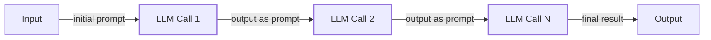

Image 1: A simple, predefined sequence of LLM calls forming a prompt-chaining workflow.

We will explore patterns like chaining and routing in future lessons.

### AI Agents

AI agents are systems where an LLM dynamically decides the sequence of steps, reasoning, and actions to achieve a goal [[2]](https://cloud.google.com/discover/what-are-ai-agents), [[4]](https://www.anthropic.com/engineering/building-effective-agents). Control moves from your code into the model, which plans its execution at runtime [[45]](https://redis.io/blog/agents-vs-workflows/). This is like a skilled human expert solving a new problem, adapting their approach as they learn. These systems are adaptive and capable of handling novelty.

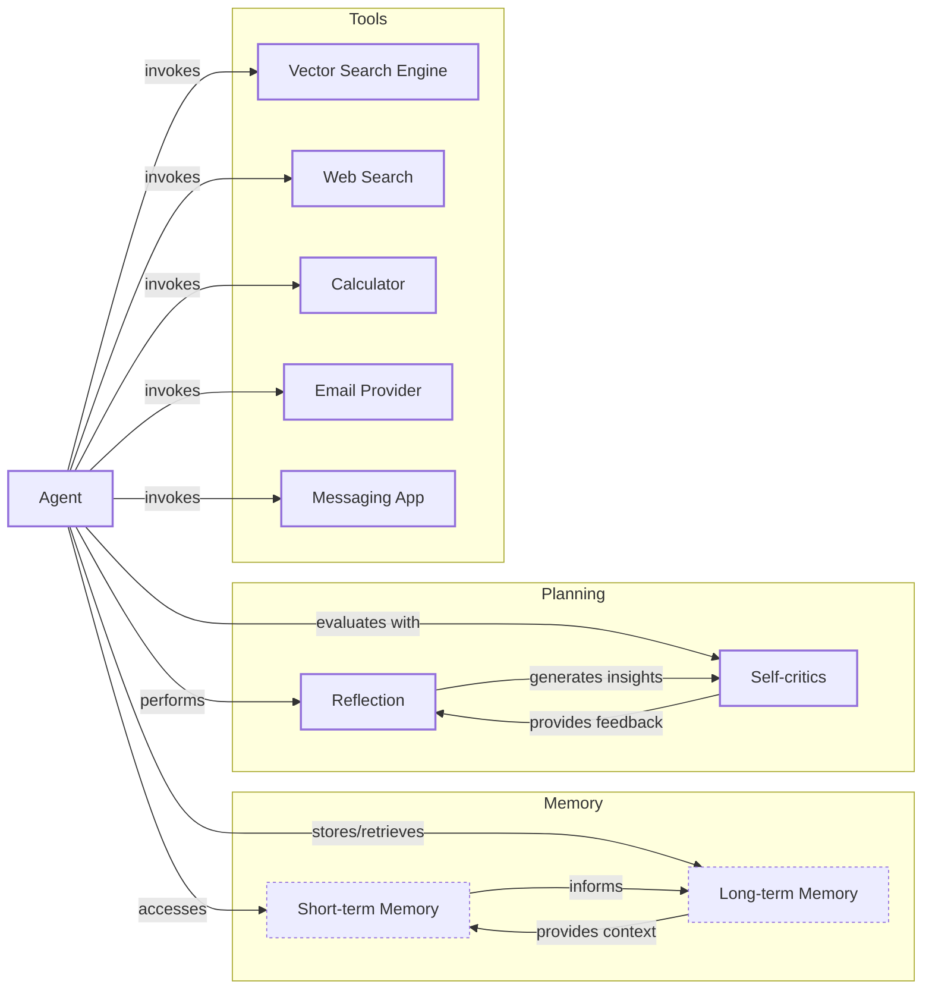

Image 2: A simple agentic system diagram illustrating an Agent interacting with Memory, Planning, and various Tools.

We will cover core components like tools, memory, and patterns like ReAct in upcoming lessons. Both workflows and agents use an orchestration layer; in workflows, it executes a defined plan, while in agents, it facilitates the LLM's dynamic planning.

## Choosing Your Path

The core difference is developer-defined logic versus LLM-driven autonomy. This creates a spectrum with a fundamental trade-off: as an agent’s control increases, application reliability tends to decrease [[1]](https://decodingml.substack.com/p/llmops-for-production-agentic-rag).

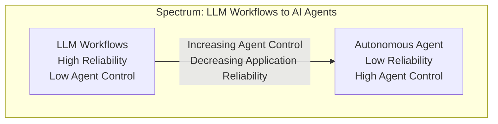

Image 3: A spectrum diagram illustrating the relationship between LLM workflows and AI agents, showing the inverse correlation between agent control and application reliability.

A practical test helps: can you draw a flowchart of the task before the LLM runs? If yes, use a workflow. If the flowchart depends on what the LLM discovers, you likely need an agent [[45]](https://redis.io/blog/agents-vs-workflows/).

### When to Use LLM Workflows

Workflows excel in structured scenarios. They are predictable, reliable, and easier to debug, with more predictable costs and latency [[4]](https://www.anthropic.com/engineering/building-effective-agents), [[21]](https://mlpills.substack.com/p/issue-110-llm-workflow-patterns). This makes them ideal for enterprise applications in regulated fields like finance and healthcare [[6]](https://towardsdatascience.com/a-developers-guide-to-building-scalable-ai-workflows-vs-agents/). Use cases include data extraction, report generation, and content repurposing. Their main weakness is rigidity.

### When to Use AI Agents

Agents are best for open-ended research, dynamic problem-solving, and interactive tasks [[4]](https://www.anthropic.com/engineering/building-effective-agents). Their strength is adaptability, but their weaknesses are significant: they are prone to errors, and their non-deterministic nature makes performance, latency, and costs vary with each call. This unreliability can be comical, as when developers joke about agents deleting their code with the punchline, "Anyway, I wanted to start a new project." Agents also require larger, more expensive models and can have security risks, especially with write operations. Ultimately, they are hard to debug and evaluate [[15]](https://arxiv.org/html/2510.25423v2), [[17]](https://medium.com/@ananya_95177/key-challenges-in-ai-agent-development-and-how-to-solve-them-460fceb0a6d5), [[19]](https://www.cyberark.com/resources/blog/the-agentic-ai-revolution-5-unexpected-security-challenges).

### Hybrid Approaches

Most real-world systems blend both. Andrej Karpathy’s "autonomy slider" illustrates this: you decide how much control to give the LLM [[14]](https://singjupost.com/andrej-karpathy-software-is-changing-again/). For instance, the coding assistant Cursor offers modes from simple completion to full agentic control, while Perplexity provides quick searches or "deep research" [[10]](https://medium.com/@ben_pouladian/andrej-karpathy-on-software-3-0-software-in-the-age-of-ai-b25533da93b6), [[11]](https://andrewships.substack.com/p/autonomy-sliders). The goal is to speed up the loop where the AI generates a solution and a human verifies it [[25]](https://www.youtube.com/watch?v=LCEmiRjPEtQ).

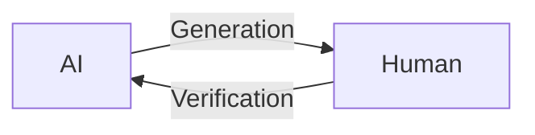

Image 4: A circular diagram illustrating the AI generation and human verification loop.

## Exploring Common Patterns

To build intuition, let's briefly introduce common patterns for both workflows and agents. We will cover these in depth in future lessons.

### LLM Workflows

**Chaining and routing** connects multiple LLM calls, allowing a system to break down a task and guide the process through different decision paths based on the input [[20]](https://mirascope.com/blog/llm-chaining), [[23]](https://www.geeksforgeeks.org/artificial-intelligence/llm-chains/).

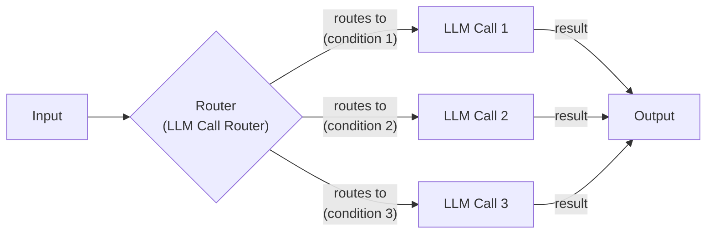

Image 5: The "Chaining and Routing" pattern, where a router directs the workflow to specialized LLM calls.

The **orchestrator-worker** pattern uses a primary LLM to analyze a task, break it into sub-tasks, and delegate them to specialized worker LLMs before a synthesizer combines the results [[26]](https://mlpills.substack.com/p/diy-17-orchestrator-worker-llm-agent), [[27]](https://online.stevens.edu/blog/building-self-healing-ai-orchestrator-reflexion-patterns/). This is a form of multi-agent architecture, a concept borrowed from fields like swarm robotics [[47]](https://medium.com/@siva.kolla.hemanth/llms-as-autonomous-agents-in-enterprise-workflows-94abd9df5195), [[50]](https://www.classicinformatics.com/blog/how-llms-and-multi-agent-systems-work-together-2025).

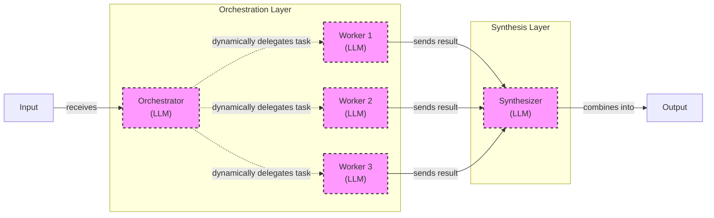

Image 6: The Orchestrator-Worker pattern with dynamic task delegation.

The **evaluator-optimizer loop** improves output quality by using a second LLM to provide feedback. One LLM generates a response, and another evaluates it, sending feedback for refinement until the output meets the criteria [[29]](https://docs.aws.amazon.com/prescriptive-guidance/latest/agentic-ai-patterns/evaluator-reflect-refine-loop-patterns.html), [[32]](https://platform.claude.com/cookbook/patterns-agents-evaluator-optimizer).

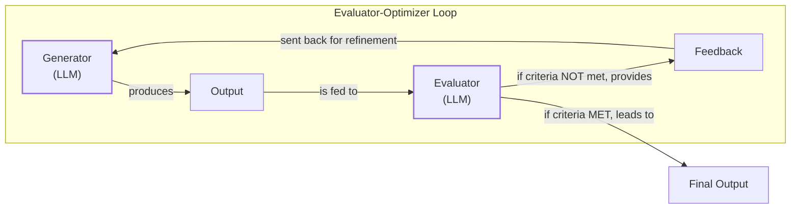

Image 7: The "Evaluator-Optimizer" loop, where one LLM refines its output based on feedback from another.

### Core Components of a ReAct AI Agent

The **ReAct (Reason and Act)** pattern is the foundation for most modern agents [[2]](https://cloud.google.com/discover/what-are-ai-agents). It enables an agent to reason about a task, decide on an action, execute it using a tool, observe the outcome, and repeat the cycle until the task is complete [[51]](https://www.ibm.com/think/topics/evolution-of-ai-agents). This loop is supported by memory, which you can compare to a computer's RAM (short-term) and hard drive (long-term). We will cover ReAct and memory in much more detail in Lessons 7, 8, and 9.

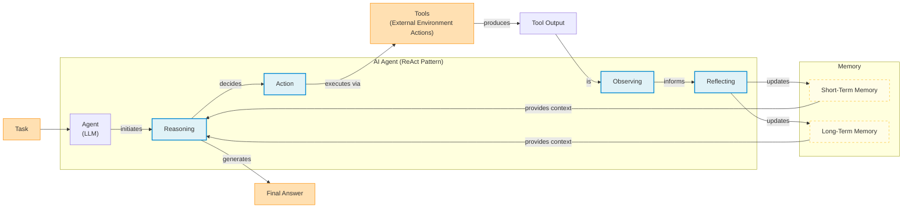

Image 8: The core components and dynamics of an AI agent following the ReAct (Reason and Act) pattern.

## Zooming In on Our Favorite Examples

To anchor these concepts, let's examine a few examples, from a simple workflow to an advanced hybrid system.

### Document Summarization in Google Workspace

**Problem:** Finding the right information in a large document is time-consuming. An embedded summarization feature can quickly guide users.

This is a pure workflow following a predefined chain of LLM calls: read, summarize, extract key points, and display the result. Google's implementation uses a map-reduce approach, summarizing chunks in parallel before creating a final summary, showcasing a structured, efficient process [[3]](https://cloud.google.com/blog/products/ai-machine-learning/long-document-summarization-with-workflows-and-gemini-models).

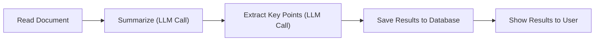

Image 9: A simple LLM workflow for document summarization and analysis in Google Workspace.

### Gemini CLI Coding Assistant

**Problem:** Writing code is slow, especially when learning a new language or codebase. A coding assistant can accelerate this process.

The open-source Gemini CLI is a single-agent system using the ReAct pattern [[5]](https://developers.google.com/gemini-code-assist/docs/gemini-cli), [[28]](https://blog.google/technology/developers/introducing-gemini-cli-open-source-ai-agent/). It autonomously gathers context, reasons about your request, validates its plan, and uses tools like file system access and web search to complete coding tasks [[34]](https://wietsevenema.eu/blog/2025/how-gemini-cli-builds-context/), [[38]](https://aipositive.substack.com/p/a-look-at-context-engineering-in). The agent loops through this process, evaluating its work until the task is done, demonstrating agentic behavior in a focused domain.

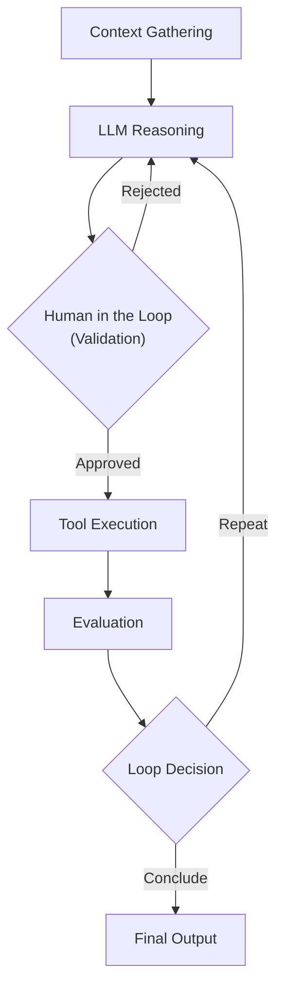

Image 10: The operational loop of the Gemini CLI coding assistant, based on the ReAct pattern.

### Perplexity Deep Research

**Problem:** Researching a new topic can be overwhelming. An assistant that synthesizes a comprehensive report from hundreds of sources is a powerful productivity tool.

Perplexity's Deep Research is a hybrid system combining workflow patterns with agentic reasoning [[8]](https://www.perplexity.ai/hub/blog/introducing-perplexity-deep-research). An orchestrator decomposes the research question and dispatches parallel search agents. It synthesizes findings, iteratively refines the research to fill knowledge gaps, and generates a final, cited report [[9]](https://www.digitalapplied.com/blog/perplexity-agent-api-platform-ai-search-developer-guide). This hybrid approach uses a structured workflow to coordinate multiple autonomous agents. This capability is part of a major trend from late 2024, with tech giants like Google, OpenAI, and Anthropic releasing similar deep research tools [[52]](https://www.mckinsey.com/~/media/mckinsey/business%20functions/mckinsey%20digital/our%20insights/the%20top%20trends%20in%20tech%202025/mckinsey-technology-trends-outlook-2025.pdf), [[53]](https://medium.com/data-science-collective/deep-research-in-ai-the-insight-gap-446118ebe76e).

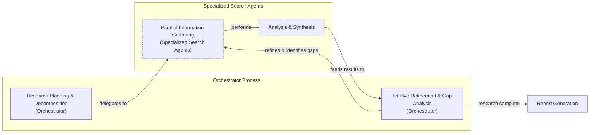

Image 11: Perplexity's Deep Research agent's iterative multi-step process.

## The Challenges of Every AI Engineer

Now that you understand the spectrum from workflows to agents, you can see the fundamental challenges every AI engineer faces. These architectural decisions determine if your application succeeds in production. Common issues include reliability problems, where an agent is unpredictable with real users, and context limits that cause systems to lose track of long conversations.

You will also face challenges with data integration, balancing cost and performance, and managing security risks with autonomous agents [[15]](https://arxiv.org/html/2510.25423v2), [[18]](https://unit42.paloaltonetworks.com/agentic-ai-threats/). These challenges are solvable. In our next lesson, we will explore structured outputs, a key technique for ensuring reliability. Later, we will cover patterns for building hybrid systems, evaluation and monitoring pipelines, and ways to keep costs and latency under control. By the end of this course, you will have the knowledge to architect AI systems that are powerful, robust, and efficient, knowing when to use a workflow, when to deploy an agent, and how to build effective hybrid systems that work in the real world.

## References

- [1] https://decodingml.substack.com/p/llmops-for-production-agentic-rag
- [2] https://cloud.google.com/discover/what-are-ai-agents
- [3] https://cloud.google.com/blog/products/ai-machine-learning/long-document-summarization-with-workflows-and-gemini-models
- [4] https://www.anthropic.com/engineering/building-effective-agents
- [5] https://developers.google.com/gemini-code-assist/docs/gemini-cli
- [6] https://towardsdatascience.com/a-developers-guide-to-building-scalable-ai-workflows-vs-agents/
- [7] https://www.youtube.com/watch?v=kQxr-uOxw2o&t=1s
- [8] https://www.perplexity.ai/hub/blog/introducing-perplexity-deep-research
- [9] https://www.digitalapplied.com/blog/perplexity-agent-api-platform-ai-search-developer-guide
- [10] https://medium.com/@ben_pouladian/andrej-karpathy-on-software-3-0-software-in-the-age-of-ai-b25533da93b6
- [11] https://andrewships.substack.com/p/autonomy-sliders
- [12] https://www.latent.space/p/s3
- [13] https://decodingml.substack.com/p/stop-building-ai-agents
- [14] https://singjupost.com/andrej-karpathy-software-is-changing-again/
- [15] https://arxiv.org/html/2510.25423v2
- [16] https://permiso.io/blog/8-critical-ai-security-challenges
- [17] https://medium.com/@ananya_95177/key-challenges-in-ai-agent-development-and-how-to-solve-them-460fceb0a6d5
- [18] https://unit42.paloaltonetworks.com/agentic-ai-threats/
- [19] https://www.cyberark.com/resources/blog/the-agentic-ai-revolution-5-unexpected-security-challenges
- [20] https://mirascope.com/blog/llm-chaining
- [21] https://mlpills.substack.com/p/issue-110-llm-workflow-patterns
- [22] https://orq.ai/blog/prompt-structure-chaining
- [23] https://www.geeksforgeeks.org/artificial-intelligence/llm-chains/
- [24] https://www.promptingguide.ai/techniques/prompt_chaining
- [25] https://www.youtube.com/watch?v=LCEmiRjPEtQ
- [26] https://online.stevens.edu/blog/building-self-healing-ai-orchestrator-reflexion-patterns/
- [27] https://mlpills.substack.com/p/diy-17-orchestrator-worker-llm-agent
- [28] https://blog.google/technology/developers/introducing-gemini-cli-open-source-ai-agent/
- [29] https://docs.aws.amazon.com/prescriptive-guidance/latest/agentic-ai-patterns/evaluator-reflect-refine-loop-patterns.html
- [30] https://dev.to/clayroach/building-self-correcting-llm-systems-the-evaluator-optimizer-pattern-169p
- [31] https://vadim.blog/the-research-on-llm-self-correction
- [32] https://platform.claude.com/cookbook/patterns-agents-evaluator-optimizer
- [33] https://sebgnotes.substack.com/p/evaluator-optimizer-llm-workflow
- [34] https://wietsevenema.eu/blog/2025/how-gemini-cli-builds-context/
- [35] https://milvus.io/ai-quick-reference/how-do-i-provide-context-files-to-gemini-cli
- [36] https://geminicli.com/docs/cli/gemini-md/
- [37] https://medium.com/google-cloud/gemini-cli-tutorial-series-part-9-understanding-context-memory-and-conversational-branching-095feb3e5a43
- [38] https://aipositive.substack.com/p/a-look-at-context-engineering-in
- [39] https://www.linkedin.com/posts/tracercloud_the-third-wave-of-data-engineering-activity-7417891798364168192-ZQJz
- [40] https://www.lumenova.ai/blog/machine-learning-monitoring-tools-ai-reliability/
- [41] https://cloud.google.com/transform/101-real-world-generative-ai-use-cases-from-industry-leaders
- [42] https://openai.com/index/introducing-chatgpt-agent/
- [43] https://www.youtube.com/watch?v=TRjq7t2Ms5I
- [44] https://github.com/google-gemini/gemini-cli/blob/main/README.md
- [45] https://redis.io/blog/agents-vs-workflows/
- [46] https://arxiv.org/html/2503.12687v1
- [47] https://medium.com/@siva.kolla.hemanth/llms-as-autonomous-agents-in-enterprise-workflows-94abd9df5195
- [48] https://medium.com/my-musings-with-llms/understanding-ai-agents-from-theory-to-production-7dcf63cd51a8
- [49] https://smythos.com/developers/agent-development/hybrid-agent-architectures/
- [50] https://www.classicinformatics.com/blog/how-llms-and-multi-agent-systems-work-together-2025
- [51] https://www.ibm.com/think/topics/evolution-of-ai-agents
- [52] https://www.mckinsey.com/~/media/mckinsey/business%20functions/mckinsey%20digital/our%20insights/the%20top%20trends%20in%20tech%202025/mckinsey-technology-trends-outlook-2025.pdf
- [53] https://medium.com/data-science-collective/deep-research-in-ai-the-insight-gap-446118ebe76e