# Workflows vs. Agents: The Critical Decision Every AI Engineer Faces

As an AI engineer preparing to build your first real AI application, after narrowing down the problem you want to solve, one key decision is how to design your AI solution. Should it follow a predictable, step-by-step workflow, or does it demand a more autonomous approach, where the LLM makes self-directed decisions along the way? Thus, one of the fundamental questions that will determine the success or failure of your project is: How should you architect your AI system?

Choose the wrong approach, and you might end up with a rigid system that breaks with new features, an unpredictable agent that fails when it matters most, or months of wasted development time. Frustrated users and executives follow. In 2024 and 2025, billion-dollar AI startups are succeeding or failing based on this architectural decision. The best teams know when to use workflows, when to use agents, and how to combine them effectively.

This lesson will provide a framework to help you make this critical decision. You will understand the fundamental trade-offs between predefined LLM workflows and dynamic AI agents, see real-world examples, and learn to design systems that leverage the best of both approaches.

## Understanding the Spectrum: From Workflows to Agents

To choose between workflows and agents, you need a clear understanding of what they are. Let's focus on their properties and uses, not deep technical specifics.

### LLM Workflows

An LLM workflow is a sequence of tasks involving LLM calls and other operations, orchestrated by developer-written code [[21]](https://mlpills.substack.com/p/issue-110-llm-workflow-patterns), [[4]](https://www.anthropic.com/engineering/building-effective-agents). The steps are defined in advance, resulting in deterministic, rule-based paths with predictable execution. Think of it as a factory assembly line: each station performs a specific, repeatable task in a set order.

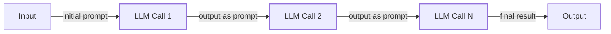

Image 1: A simple, predefined sequence of LLM calls forming a prompt-chaining workflow.

In future lessons, we will explore common workflow patterns like chaining, routing, and the orchestrator-worker model in detail.

### AI Agents

AI agents are systems where an LLM dynamically decides the sequence of steps, reasoning, and actions to achieve a goal [[2]](https://cloud.google.com/discover/what-are-ai-agents), [[4]](https://www.anthropic.com/engineering/building-effective-agents). The path is not predefined; control moves from your code into the model, which plans its execution at runtime [[45]](https://redis.io/blog/agents-vs-workflows/). This approach is rooted in the classic AI concept of a "rational agent," one that acts to achieve the best expected outcome [[46]](https://arxiv.org/html/2503.12687v1). This is like a skilled human expert tackling an unfamiliar problem, adapting their approach with each new piece of information. These systems are adaptive and capable of handling novelty through LLM-driven autonomy.

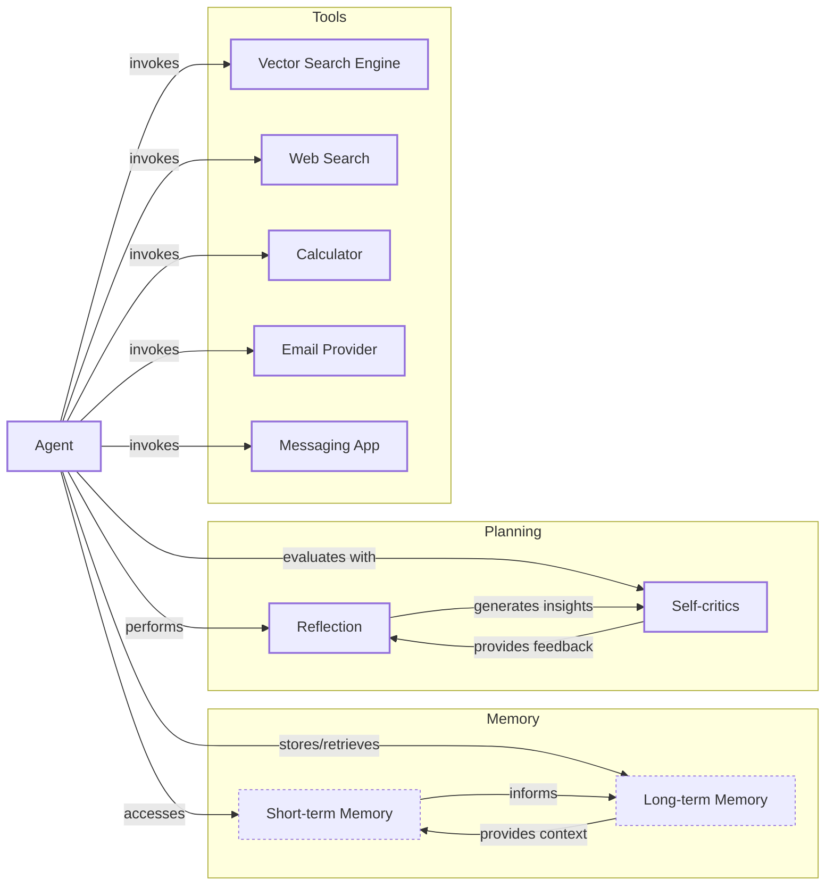

Image 2: A simple agentic system diagram illustrating an Agent interacting with Memory, Planning, and various Tools.

We will cover the core components of agents, including tools, memory, and patterns like ReAct, in upcoming lessons. Both workflows and agents use an orchestration layer, but in workflows, it executes a defined plan, while in agents, it facilitates the LLM's dynamic planning.

## Choosing Your Path

The core difference between these two approaches is developer-defined logic versus LLM-driven autonomy. This creates a spectrum of possibilities, with a fundamental trade-off: as an agent’s level of control increases, the application’s reliability tends to decrease [[1]](https://decodingml.substack.com/p/llmops-for-production-agentic-rag).

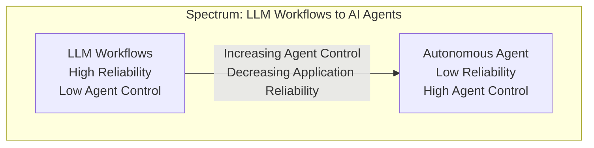

Image 3: A spectrum diagram illustrating the relationship between LLM workflows and AI agents, showing the inverse correlation between agent control and application reliability.

A practical test can help you decide: can you draw a flowchart of the task before the LLM runs? If so, a workflow is likely the right choice. If the flowchart depends on what the LLM discovers at runtime, you probably need an agent [[45]](https://redis.io/blog/agents-vs-workflows/).

### When to Use LLM Workflows

Workflows excel in scenarios with well-defined structures. They are predictable, reliable, and easier to debug, with more predictable costs and latency [[4]](https://www.anthropic.com/engineering/building-effective-agents), [[21]](https://mlpills.substack.com/p/issue-110-llm-workflow-patterns). This makes them ideal for enterprise applications in regulated fields like finance and healthcare, where consistency is critical [[3]](https://towardsdatascience.com/a-developers-guide-to-building-scalable-ai-workflows-vs-agents/). In these settings, even agentic systems operate with "bounded autonomy," where they work within defined constraints and escalate ambiguous decisions to humans [[47]](https://medium.com/@siva.kolla.hemanth/llms-as-autonomous-agents-in-enterprise-workflows-94abd9df5195). Use cases include data extraction pipelines, automated report generation, and content repurposing. However, they can be rigid and unable to handle unexpected user inputs.

### When to Use AI Agents

Agents are best for open-ended research, dynamic problem-solving like debugging code, and interactive tasks in unfamiliar environments [[4]](https://www.anthropic.com/engineering/building-effective-agents). Their strength is adaptability. However, this flexibility comes at a cost. Agents are less reliable, more expensive due to the need for powerful reasoning models, and harder to debug and evaluate [[15]](https://arxiv.org/html/2510.25423v2), [[17]](https://medium.com/@ananya_95177/key-challenges-in-ai-agent-development-and-how-to-solve-them-460fceb0a6d5), [[19]](https://www.cyberark.com/resources/blog/the-agentic-ai-revolution-5-unexpected-security-challenges). Each autonomous step introduces a chance for error, and these can compound, leading to catastrophic failures [[48]](https://medium.com/my-musings-with-llms/understanding-ai-agents-from-theory-to-production-7dcf63cd51a8). Some developers have even joked about agents deleting their entire codebase, a potent reminder of their unpredictability.

### Hybrid Approaches

Most real-world systems blend both approaches, operating on a spectrum of autonomy. Andrej Karpathy introduced the concept of an "autonomy slider," where you decide how much control to give the LLM versus the user [[14]](https://singjupost.com/andrej-karpathy-software-is-changing-again/). For example, the coding assistant Cursor lets users choose from simple tab-completion to a fully agentic mode that can modify an entire repository [[10]](https://medium.com/@ben_pouladian/andrej-karpathy-on-software-3-0-software-in-the-age-of-ai-b25533da93b6). Similarly, Perplexity offers everything from a quick search to a "deep research" mode that takes minutes to run [[11]](https://andrewships.substack.com/p/autonomy-sliders). This is similar to how autonomous vehicles use hybrid architectures: a reactive system handles immediate tasks like obstacle avoidance, while a deliberative system manages long-term route planning [[49]](https://smythos.com/developers/agent-development/hybrid-agent-architectures/).

The goal is to speed up the loop where the AI generates a solution and a human verifies it. This is often achieved through a combination of smart architecture and a well-designed user interface [[25]](https://www.youtube.com/watch?v=LCEmiRjPEtQ).

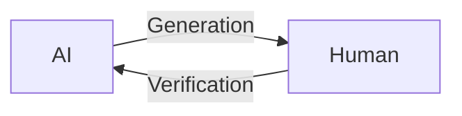

Image 4: A circular diagram illustrating the AI generation and human verification loop.

## Exploring Common Patterns

To build intuition, let's look at the common patterns used to construct both workflows and agents. We will only touch on them briefly here, as they will be covered in depth in future lessons.

### LLM Workflows

Simple workflows often use **chaining and routing** to connect multiple LLM calls. This allows a system to break down a task and guide the process through different decision paths based on the input [[20]](https://mirascope.com/blog/llm-chaining), [[23]](https://www.geeksforgeeks.org/artificial-intelligence/llm-chains/).

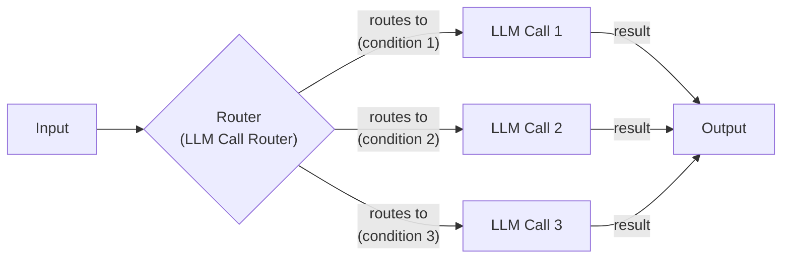

Image 5: The "Chaining and Routing" pattern, where a router directs the workflow to specialized LLM calls.

A more advanced pattern is the **orchestrator-worker** model. Here, a primary LLM, the orchestrator, analyzes a task, breaks it into sub-tasks, and delegates them to specialized worker LLMs. A synthesizer then combines the results [[25]](https://online.stevens.edu/blog/building-self-healing-ai-orchestrator-reflexion-patterns/), [[26]](https://mlpills.substack.com/p/diy-17-orchestrator-worker-llm-agent). This is a form of multi-agent architecture, a concept borrowed from fields like swarm robotics where multiple autonomous units collaborate on a complex task [[47]](https://medium.com/@siva.kolla.hemanth/llms-as-autonomous-agents-in-enterprise-workflows-94abd9df5195), [[50]](https://www.classicinformatics.com/blog/how-llms-and-multi-agent-systems-work-together-2025).

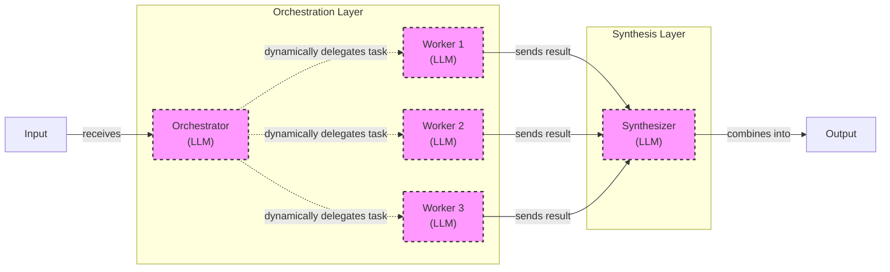

Image 6: The Orchestrator-Worker pattern with dynamic task delegation.

The **evaluator-optimizer loop** improves output quality by using a second LLM to provide feedback. One LLM generates a response, and another evaluates it. If the output doesn't meet the criteria, the feedback is sent back to the generator for refinement, similar to how a human writer revises a draft [[30]](https://docs.aws.amazon.com/prescriptive-guidance/latest/agentic-ai-patterns/evaluator-reflect-refine-loop-patterns.html), [[33]](https://platform.claude.com/cookbook/patterns-agents-evaluator-optimizer).

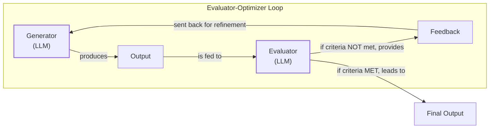

Image 7: The "Evaluator-Optimizer" loop, where one LLM refines its output based on feedback from another.

### Core Components of a ReAct AI Agent

The **ReAct (Reason and Act)** pattern is the foundation for most modern agents [[2]](https://cloud.google.com/discover/what-are-ai-agents). This pattern is inspired by the classic agentic loop from reinforcement learning—act, receive feedback, and adjust—and was made practical by technologies like function calling, which gave LLMs a structured way to interact with external systems [[51]](https://www.ibm.com/think/topics/evolution-of-ai-agents). It enables an agent to reason about a task, decide on an action, execute it using a tool, observe the outcome, and repeat the cycle until the task is complete. This loop is supported by memory, which we can compare to a computer's RAM (short-term) and hard drive (long-term). We will cover ReAct and memory in much more detail in Lessons 7, 8, and 9.

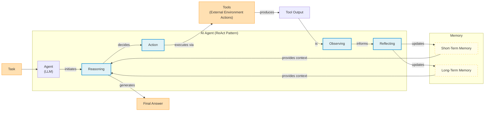

Image 8: The core components and dynamics of an AI agent following the ReAct (Reason and Act) pattern.

## Zooming In on Our Favorite Examples

To anchor these concepts, let's examine a few examples, from a simple workflow to an advanced hybrid system.

### Document Summarization in Google Workspace

**Problem:** Finding the right information in a large document is time-consuming. An embedded summarization feature can quickly guide users.

This is a pure workflow. It follows a simple, predefined chain of LLM calls: read the document, summarize it, extract key points, and display the result to the user. Google's implementation for long documents uses a map-reduce approach, where the document is split into chunks, each is summarized in parallel, and then a final summary of the summaries is created [[3]](https://cloud.google.com/blog/products/ai-machine-learning/long-document-summarization-with-workflows-and-gemini-models).

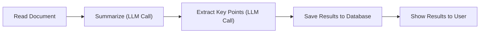

Image 9: A simple LLM workflow for document summarization and analysis in Google Workspace.

### Gemini CLI Coding Assistant

**Problem:** Writing code is slow, especially when learning a new language or codebase. A coding assistant can accelerate this process.

The open-source Gemini CLI is a single-agent system that uses the ReAct pattern [[5]](https://developers.google.com/gemini-code-assist/docs/gemini-cli), [[26]](https://blog.google/technology/developers/introducing-gemini-cli-open-source-ai-agent/). It gathers context from your codebase, reasons about your request, and uses tools like file system access, web search, and code execution to complete tasks [[40]](https://wietsevenema.eu/blog/2025/how-gemini-cli-builds-context/), [[44]](https://aipositive.substack.com/p/a-look-at-context-engineering-in). It often validates its plan with you before executing, loops to refine its work, and evaluates the code to ensure it runs correctly.

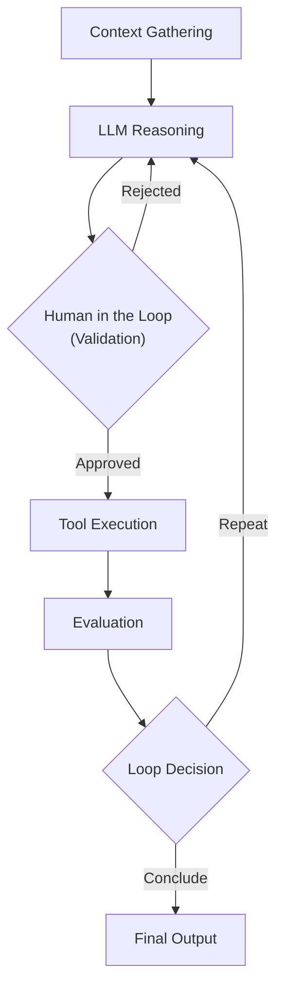

Image 10: The operational loop of the Gemini CLI coding assistant, based on the ReAct pattern.

### Perplexity Deep Research

**Problem:** Researching a new topic can be overwhelming. An assistant that scans hundreds of sources and synthesizes a comprehensive report can be a huge productivity boost.

This capability is part of a major trend that emerged in late 2024, with tech giants like Google, OpenAI, and Anthropic all releasing similar deep research tools, identified by firms like McKinsey as a key technology to watch [[52]](https://www.mckinsey.com/~/media/mckinsey/business%20functions/mckinsey%20digital/our%20insights/the%20top%20trends%20in%20tech%202025/mckinsey-technology-trends-outlook-2025.pdf), [[53]](https://medium.com/data-science-collective/deep-research-in-ai-the-insight-gap-446118ebe76e). Perplexity's Deep Research is a hybrid system that combines workflow patterns with agentic reasoning [[8]](https://www.perplexity.ai/hub/blog/introducing-perplexity-deep-research). It's not a single agent but a team of specialized agents coordinated by an orchestrator—a role Perplexity has embraced by tuning complex agent loops and even releasing an Agent API for developers [[54]](https://thenewstack.io/perplexity-agent-api/). This system decomposes a research question, dispatches parallel search agents to gather information, synthesizes the findings, and iteratively refines the research to fill knowledge gaps before generating a final, cited report [[9]](https://www.digitalapplied.com/blog/perplexity-agent-api-platform-ai-search-developer-guide).

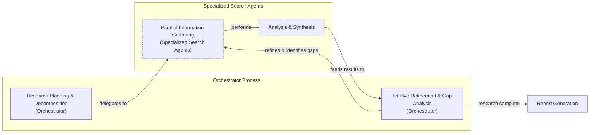

Image 11: Perplexity's Deep Research agent's iterative multi-step process.

## The Challenges of Every AI Engineer

Now that you understand the spectrum from workflows to agents, it's important to recognize that every AI engineer faces these same architectural decisions. This choice is fundamental to whether an AI application succeeds in production or fails.

You will constantly battle a reliability crisis. Your agent might work in demos but become unpredictable with real users. You will face context limits, where systems lose track of long conversations. Integrating data from various sources is a constant struggle, as is balancing performance with cost. And with autonomy comes security risks: an agent with write permissions could delete files or send wrong emails [[15]](https://arxiv.org/html/2510.25423v2), [[18]](https://unit42.paloaltonetworks.com/agentic-ai-threats/).

These challenges are solvable. In upcoming lessons, we will systematically tackle each of these issues. You will learn patterns for building reliable products with evaluation and monitoring pipelines, strategies for creating hybrid systems, and methods to control costs and latency. By the end of this course, you will have the knowledge to architect AI systems that are not only powerful but also robust, efficient, and safe. You will know when to use a workflow, when to deploy an agent, and how to build effective hybrid systems that work in the messy, unpredictable real world.

## References

- [1] Decoding ML. (n.d.). *Exploring the difference between agents and workflows*. [https://decodingml.substack.com/p/llmops-for-production-agentic-rag](https://decodingml.substack.com/p/llmops-for-production-agentic-rag)
- [2] Google Cloud. (2026, April 2). *What is an AI agent?*. [https://cloud.google.com/discover/what-are-ai-agents](https://cloud.google.com/discover/what-are-ai-agents)
- [3] Laforge, G., & Spruyt, R. (2024, April 30). *Long document summarization with Workflows and Gemini models*. Google Cloud Blog. [https://cloud.google.com/blog/products/ai-machine-learning/long-document-summarization-with-workflows-and-gemini-models](https://cloud.google.com/blog/products/ai-machine-learning/long-document-summarization-with-workflows-and-gemini-models)
- [4] Anthropic. (2024, December 19). *Building effective agents*. [https://www.anthropic.com/engineering/building-effective-agents](https://www.anthropic.com/engineering/building-effective-agents)
- [5] Google for Developers. (n.d.). *Gemini CLI*. Gemini Code Assist. [https://developers.google.com/gemini-code-assist/docs/gemini-cli](https://developers.google.com/gemini-code-assist/docs/gemini-cli)
- [6] Quach, H. (2025, June 27). *A Developer’s Guide to Building Scalable AI: Workflows vs Agents*. Towards Data Science. [https://towardsdatascience.com/a-developers-guide-to-building-scalable-ai-workflows-vs-agents/](https://towardsdatascience.com/a-developers-guide-to-building-scalable-ai-workflows-vs-agents/)
- [7] Bouchard, L. (2024, July 25). *Real Agents vs. Workflows: The Truth Behind AI 'Agents'*. [Video]. YouTube. [https://www.youtube.com/watch?v=kQxr-uOxw2o&t=1s](https://www.youtube.com/watch?v=kQxr-uOxw2o&t=1s)
- [8] Perplexity Team. (2025, February 14). *Introducing Perplexity Deep Research*. Perplexity Blog. [https://www.perplexity.ai/hub/blog/introducing-perplexity-deep-research](https://www.perplexity.ai/hub/blog/introducing-perplexity-deep-research)
- [9] Digital Applied. (n.d.). *Perplexity Agent API Platform: The Ultimate AI Search Developer Guide*. [https://www.digitalapplied.com/blog/perplexity-agent-api-platform-ai-search-developer-guide](https://www.digitalapplied.com/blog/perplexity-agent-api-platform-ai-search-developer-guide)
- [10] Pouladian, B. (2025, June 20). *Andrej Karpathy on Software 3.0: Software in the Age of AI*. Medium. [https://medium.com/@ben_pouladian/andrej-karpathy-on-software-3-0-software-in-the-age-of-ai-b25533da93b6](https://medium.com/@ben_pouladian/andrej-karpathy-on-software-3-0-software-in-the-age-of-ai-b25533da93b6)
- [11] Ships, A. (2025, June 24). *Autonomy Sliders*. [https://andrewships.substack.com/p/autonomy-sliders](https://andrewships.substack.com/p/autonomy-sliders)
- [12] Latent Space. (2025, June 20). *Software 3.0*. [https://www.latent.space/p/s3](https://www.latent.space/p/s3)
- [13] Iusztin, P. (2024, October 15). *Stop Building AI Agents: Here’s what you should build instead*. Decoding ML. [https://decodingml.substack.com/p/stop-building-ai-agents](https://decodingml.substack.com/p/stop-building-ai-agents)
- [14] Pangambam S. (2025, June 20). *Andrej Karpathy: Software Is Changing (Again)*. The Singju Post. [https://singjupost.com/andrej-karpathy-software-is-changing-again/](https://singjupost.com/andrej-karpathy-software-is-changing-again/)
- [15] Asgari, A., Panichella, A., Derakhshanfar, P., & Olsthoorn, M. (2025). *What Challenges Do Developers Face in AI Agent Systems? An Empirical Study on Stack Overflow & GitHub Issues*. arXiv. [https://arxiv.org/html/2510.25423v2](https://arxiv.org/html/2510.25423v2)
- [16] Permiso. (n.d.). *8 Critical AI Security Challenges*. [https://permiso.io/blog/8-critical-ai-security-challenges](https://permiso.io/blog/8-critical-ai-security-challenges)
- [17] Roy, A. (2024, May 22). *Key Challenges in AI Agent Development and How to Solve Them*. Medium. [https://medium.com/@ananya_95177/key-challenges-in-ai-agent-development-and-how-to-solve-them-460fceb0a6d5](https://medium.com/@ananya_95177/key-challenges-in-ai-agent-development-and-how-to-solve-them-460fceb0a6d5)
- [18] Unit 42. (2024, July 16). *Agentic AI Threats: A New Security Paradigm*. Palo Alto Networks. [https://unit42.paloaltonetworks.com/agentic-ai-threats/](https://unit42.paloaltonetworks.com/agentic-ai-threats/)
- [19] CyberArk. (2024, June 18). *The Agentic AI Revolution: 5 Unexpected Security Challenges*. [https://www.cyberark.com/resources/blog/the-agentic-ai-revolution-5-unexpected-security-challenges](https://www.cyberark.com/resources/blog/the-agentic-ai-revolution-5-unexpected-security-challenges)
- [20] Mirascope. (n.d.). *LLM Chaining: A Deep Dive into Sequential, Transformational, and Retrieval Chains*. [https://mirascope.com/blog/llm-chaining](https://mirascope.com/blog/llm-chaining)
- [21] Andrès, D. (2024, March 18). *Issue #110 - LLM Workflow Patterns*. ML Pills. [https://mlpills.substack.com/p/issue-110-llm-workflow-patterns](https://mlpills.substack.com/p/issue-110-llm-workflow-patterns)
- [22] orq.ai. (n.d.). *Prompt Structure & Chaining: A Guide to Advanced LLM Prompting*. [https://orq.ai/blog/prompt-structure-chaining](https://orq.ai/blog/prompt-structure-chaining)
- [23] GeeksforGeeks. (n.d.). *LLM Chains*. [https://www.geeksforgeeks.org/artificial-intelligence/llm-chains/](https://www.geeksforgeeks.org/artificial-intelligence/llm-chains/)
- [24] Prompting Guide. (n.d.). *Prompt Chaining*. [https://www.promptingguide.ai/techniques/prompt_chaining](https://www.promptingguide.ai/techniques/prompt_chaining)
- [25] Stevens Institute of Technology. (n.d.). *Building a Self-Healing AI Orchestrator with Reflexion Patterns*. [https://online.stevens.edu/blog/building-self-healing-ai-orchestrator-reflexion-patterns/](https://online.stevens.edu/blog/building-self-healing-ai-orchestrator-reflexion-patterns/)
- [26] Andrès, D. (2024, April 1). *DIY #17 - Orchestrator-Worker LLM Agent with LangChain*. ML Pills. [https://mlpills.substack.com/p/diy-17-orchestrator-worker-llm-agent](https://mlpills.substack.com/p/diy-17-orchestrator-worker-llm-agent)
- [27] Anthropic. (n.d.). *Orchestrator workers*. Claude Cookbook. [https://platform.claude.com/cookbook/patterns-agents-orchestrator-workers](https://platform.claude.com/cookbook/patterns-agents-orchestrator-workers)
- [28] GuruSup. (n.d.). *Agent Orchestration Patterns*. [https://gurusup.com/blog/agent-orchestration-patterns](https://gurusup.com/blog/agent-orchestration-patterns)
- [29] AWS Prescriptive Guidance. (n.d.). *Evaluator, reflect, and refine loop patterns*. [https://docs.aws.amazon.com/prescriptive-guidance/latest/agentic-ai-patterns/evaluator-reflect-refine-loop-patterns.html](https://docs.aws.amazon.com/prescriptive-guidance/latest/agentic-ai-patterns/evaluator-reflect-refine-loop-patterns.html)
- [30] Roach, C. (2024, March 18). *Building Self-Correcting LLM Systems: The Evaluator-Optimizer Pattern*. DEV Community. [https://dev.to/clayroach/building-self-correcting-llm-systems-the-evaluator-optimizer-pattern-169p](https://dev.to/clayroach/building-self-correcting-llm-systems-the-evaluator-optimizer-pattern-169p)
- [31] Skidanov, V. (2024, May 13). *The Research on LLM Self-Correction*. [https://vadim.blog/the-research-on-llm-self-correction](https://vadim.blog/the-research-on-llm-self-correction)
- [32] Anthropic. (n.d.). *Evaluator optimizer*. Claude Cookbook. [https://platform.claude.com/cookbook/patterns-agents-evaluator-optimizer](https://platform.claude.com/cookbook/patterns-agents-evaluator-optimizer)
- [33] Notes, S. (2024, April 1). *Evaluator-Optimizer LLM Workflow*. [https://sebgnotes.substack.com/p/evaluator-optimizer-llm-workflow](https://sebgnotes.substack.com/p/evaluator-optimizer-llm-workflow)
- [34] Wietse Venema. (2025, June 26). *How Gemini CLI builds context*. [https://wietsevenema.eu/blog/2025/how-gemini-cli-builds-context/](https://wietsevenema.eu/blog/2025/how-gemini-cli-builds-context/)
- [35] Milvus. (n.d.). *How do I provide context files to Gemini CLI?*. [https://milvus.io/ai-quick-reference/how-do-i-provide-context-files-to-gemini-cli](https://milvus.io/ai-quick-reference/how-do-i-provide-context-files-to-gemini-cli)
- [36] Gemini CLI. (n.d.). *GEMINI.md*. [https://geminicli.com/docs/cli/gemini-md/](https://geminicli.com/docs/cli/gemini-md/)
- [37] Mullen, T. (2025, June 25). *Gemini CLI Tutorial Series Part 9: Understanding Context, Memory, and Conversational Branching*. Medium. [https://medium.com/google-cloud/gemini-cli-tutorial-series-part-9-understanding-context-memory-and-conversational-branching-095feb3e5a43](https://medium.com/google-cloud/gemini-cli-tutorial-series-part-9-understanding-context-memory-and-conversational-branching-095feb3e5a43)
- [38] AI Positive. (2025, July 15). *A Look at Context Engineering in Gemini CLI*. [https://aipositive.substack.com/p/a-look-at-context-engineering-in](https://aipositive.substack.com/p/a-look-at-context-engineering-in)
- [39] Tracer. (2025, July 22). *The Third Wave of Data Engineering*. LinkedIn. [https://www.linkedin.com/posts/tracercloud_the-third-wave-of-data-engineering-activity-7417891798364168192-ZQJz](https://www.linkedin.com/posts/tracercloud_the-third-wave-of-data-engineering-activity-7417891798364168192-ZQJz)
- [40] Lumenova. (n.d.). *Machine Learning Monitoring Tools for AI Reliability*. [https://www.lumenova.ai/blog/machine-learning-monitoring-tools-ai-reliability/](https://www.lumenova.ai/blog/machine-learning-monitoring-tools-ai-reliability/)
- [41] Renner, M., & Chaban, M. A. V. (2026, April 22). *1,302 real-world gen AI use cases from the world's leading organizations*. Google Cloud Blog. [https://cloud.google.com/transform/101-real-world-generative-ai-use-cases-from-industry-leaders](https://cloud.google.com/transform/101-real-world-generative-ai-use-cases-from-industry-leaders)
- [42] OpenAI. (2025, July 17). *Introducing ChatGPT agent: bridging research and action*. [https://openai.com/index/introducing-chatgpt-agent/](https://openai.com/index/introducing-chatgpt-agent/)
- [43] Liu, J. (2023, October 26). *Building Production-Ready RAG Applications*. [Video]. YouTube. [https://www.youtube.com/watch?v=TRjq7t2Ms5I](https://www.youtube.com/watch?v=TRjq7t2Ms5I)
- [44] Google. (n.d.). *Gemini CLI*. GitHub. [https://github.com/google-gemini/gemini-cli/blob/main/README.md](https://github.com/google-gemini/gemini-cli/blob/main/README.md)
- [45] Redis. (n.d.). *Agents vs. workflows in GenAI*. [https://redis.io/blog/agents-vs-workflows/](https://redis.io/blog/agents-vs-workflows/)
- [46] arXiv. (2025, March 19). *A Survey of Large Language Model-based Agents*. [https://arxiv.org/html/2503.12687v1](https://arxiv.org/html/2503.12687v1)
- [47] Kolla, S. H. (2024, September 24). *LLMs as Autonomous Agents in Enterprise Workflows*. Medium. [https://medium.com/@siva.kolla.hemanth/llms-as-autonomous-agents-in-enterprise-workflows-94abd9df5195](https://medium.com/@siva.kolla.hemanth/llms-as-autonomous-agents-in-enterprise-workflows-94abd9df5195)
- [48] Saini, A. (2024, May 22). *Understanding AI Agents: From Theory to Production*. Medium. [https://medium.com/my-musings-with-llms/understanding-ai-agents-from-theory-to-production-7dcf63cd51a8](https://medium.com/my-musings-with-llms/understanding-ai-agents-from-theory-to-production-7dcf63cd51a8)
- [49] Smythos. (n.d.). *Hybrid Agent Architectures*. [https://smythos.com/developers/agent-development/hybrid-agent-architectures/](https://smythos.com/developers/agent-development/hybrid-agent-architectures/)
- [50] Classic Informatics. (2024, May 13). *How LLMs And Multi-Agent Systems Work Together (2025)*. [https://www.classicinformatics.com/blog/how-llms-and-multi-agent-systems-work-together-2025](https://www.classicinformatics.com/blog/how-llms-and-multi-agent-systems-work-together-2025)
- [51] IBM. (n.d.). *The evolution of AI agents*. [https://www.ibm.com/think/topics/evolution-of-ai-agents](https://www.ibm.com/think/topics/evolution-of-ai-agents)
- [52] McKinsey & Company. (2025). *McKinsey Technology Trends Outlook 2025*. [https://www.mckinsey.com/~/media/mckinsey/business%20functions/mckinsey%20digital/our%20insights/the%20top%20trends%20in%20tech%202025/mckinsey-technology-trends-outlook-2025.pdf](https://www.mckinsey.com/~/media/mckinsey/business%20functions/mckinsey%20digital/our%20insights/the%20top%20trends%20in%20tech%202025/mckinsey-technology-trends-outlook-2025.pdf)
- [53] Cole, B. (2025, June 20). *Deep Research in AI: The Insight Gap*. Data Science Collective. [https://medium.com/data-science-collective/deep-research-in-ai-the-insight-gap-446118ebe76e](https://medium.com/data-science-collective/deep-research-in-ai-the-insight-gap-446118ebe76e)
- [54] The New Stack. (n.d.). *Perplexity Launches Agent API to Simplify AI Development*. [https://thenewstack.io/perplexity-agent-api/](https://thenewstack.io/perplexity-agent-api/)