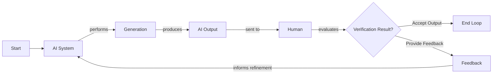
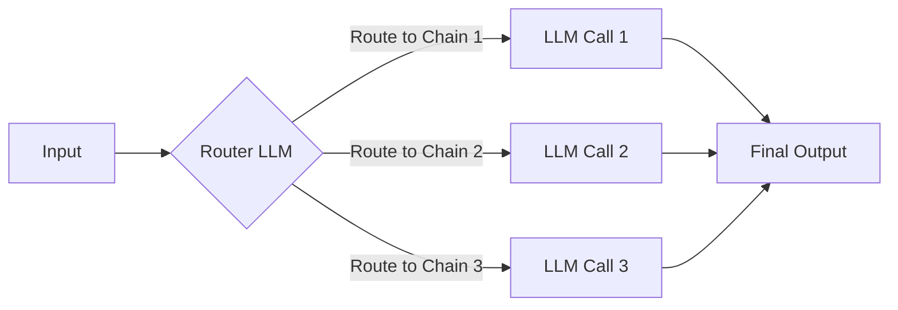
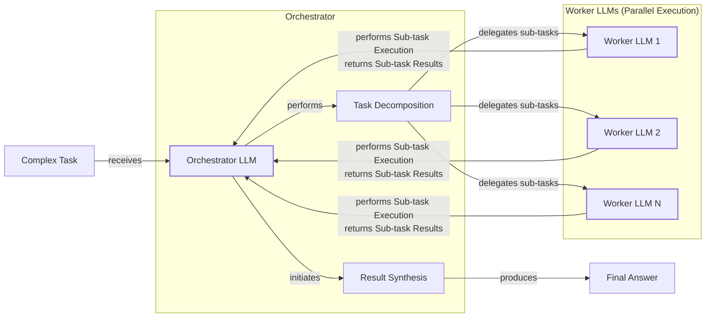
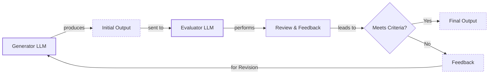
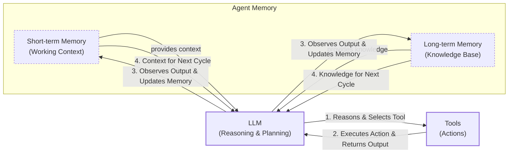
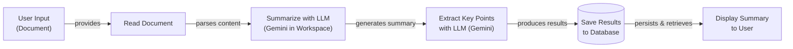
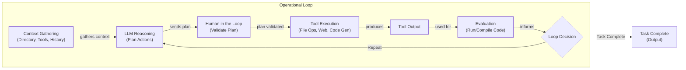
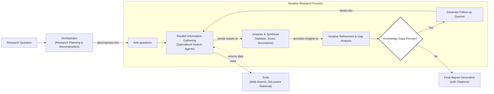

# Workflows vs. Agents: The Critical Decision Every AI Engineer Faces

As an AI engineer preparing to build your first real AI application, after narrowing down the problem you want to solve, one key decision is how to design your AI solution. Should it follow a predictable, step-by-step workflow, or does it demand a more autonomous approach, where the LLM makes self-directed decisions along the way? Thus one of the fundamental questions that will determine the success or failure of your project is: How should you architect your AI system?

Choosing the wrong path can lead to a rigid system that breaks under unexpected user behavior or an unreliable agent that fails when it matters most. In 2024 and 2025, we have seen billion-dollar AI startups succeed or fail based on this architectural decision. The most successful teams know when to use workflows, when to use agents, and how to combine them.

This lesson provides a framework to make that choice confidently. We will explore the trade-offs, examine real-world examples, and show you how to design systems that leverage the best of both worlds.

## Understanding the Spectrum: From Workflows to Agents

To choose between workflows and agents, it helps to see them not as a binary choice but as levels on a spectrum of autonomy [[1]](https://lumenalta.com/labs/from-llm-to-full-agency-understanding-the-levels-of-ai-autonomy). This section focuses on their core properties, not the technical specifics.

An **LLM workflow** is a sequence of tasks involving LLM calls or other operations, orchestrated by developer-written code. The steps are defined in advance, creating predictable, rule-based paths. This approach evolved from historical rule-based systems, which were effective for clear-cut instructions but struggled with ambiguity and scale [[2]](https://fetch.ai/blog/evolution-ai-agents-from-rule-based-systems-to-llms-agents). Think of a modern workflow as a factory assembly line, where each station performs a specific task [[3]](https://www.youtube.com/watch?v=kQxr-uOxw2o&t=1s), [[4]](https://mlpills.substack.com/p/issue-110-llm-workflow-patterns). In future lessons, we will explore patterns like chaining, routing, and orchestrator-worker patterns.

https://storage.googleapis.com/gweb-cloudblog-publish/images/map-reduce-summary.max-1900x1900.png
Image 1: A map-reduce approach to document summarization is a classic example of an LLM workflow with parallel steps. (Source [5](https://cloud.google.com/blog/products/ai-machine-learning/long-document-summarization-with-workflows-and-gemini-models))

**AI agents** represent a higher level of autonomy. Here, an LLM dynamically decides the sequence of steps, reasoning, and actions to achieve a goal. The path is not predefined but is planned based on the task and environment. This gives agents flexibility to handle ambiguity and complexity, much like a skilled expert solving a new problem [[6]](https://medium.com/@ananya_95177/key-challenges-in-ai-agent-development-and-how-to-solve-them-460fceb0a6d5). We will cover agent-specific concepts like tools, memory, and the ReAct architecture later.

https://unit42.paloaltonetworks.com/wp-content/uploads/2025/04/word-image-141040-140037-1.png
Image 2: A typical AI agent architecture, where the LLM acts as a reasoning engine to plan and execute actions using external tools. (Source [7](https://unit42.paloaltonetworks.com/agentic-ai-threats/))

Both require an orchestration layer. In workflows, this layer executes a defined plan. In agents, it facilitates the LLM's dynamic planning and execution.

## Choosing Your Path

The core difference between workflows and agents lies in who is in control: developer-defined logic versus LLM-driven autonomy.

https://substackcdn.com/image/fetch/f_auto,q_auto:good,fl_progressive:steep/https%3A%2F%2Fsubstack-post-media.s3.amazonaws.com%2Fpublic%2Fimages%2F5e64d5e0-7ef1-4e7f-b441-3bf1fef4ff9a_1276x818.png
Image 3: The trade-off between application reliability and an agent's level of control, illustrating the spectrum from workflows to autonomous agents. (Source [8](https://decodingml.substack.com/p/stop-building-ai-agents))

Most real-world systems exist on a spectrum. When building an application, you often have an "autonomy slider" to decide how much control to give the LLM [[9]](https://singjupost.com/andrej-karpathy-software-is-changing-again/). For example, the coding assistant Cursor offers a range of autonomy, from simple tab completion (Cmd+K) to changing an entire file (Cmd+L) or modifying the whole repository (Cmd+I). Similarly, Perplexity provides a quick search, a more involved research mode, and a deep research function that takes minutes to generate a comprehensive report [[10]](https://www.linkedin.com/posts/markbarbir_andrej-karpathys-latest-talk-describes-our-activity-7343449417426837505-oTFx).

The ultimate goal is to speed up the loop between AI generation and human verification. This is achieved through well-designed architecture and a user-friendly interface that makes it easy for humans to review and guide the AI's work.

Image 4: A flowchart illustrating the iterative loop between AI generation and human verification.

You should use an **LLM workflow** for well-defined tasks like data extraction or report generation. Workflows offer predictability, reliability, and easier debugging, with more predictable costs and latency. This makes them ideal for regulated fields like finance and healthcare, where AI-powered administrative systems already help coordinate patient care [[11]](https://pmc.ncbi.nlm.nih.gov/articles/PMC12360800/). Their main weakness is rigidity. You should use an **AI agent** for open-ended tasks like research or code debugging. Agents adapt to new situations but are less reliable, harder to debug, and pose security risks. This unreliability is a common pain point. Some developers have even joked about their code being deleted by agents, saying, "Anyway, I wanted to start a new project."

The choice also impacts how you measure success. For a workflow generating a financial report, you might use reference-free metrics that assess the correctness of financial takeaways and reasoning [[12]](https://arxiv.org/html/2504.14233v1). For an agent, you would focus on metrics like action completion, tool selection quality, and reasoning coherence [[13]](https://galileo.ai/blog/accuracy-metrics-ai-evaluation).

## Exploring Common Patterns

To build your intuition, let's look at the most common patterns for constructing both workflows and agents. We will cover these in detail in future lessons, but for now, the goal is to understand the high-level concepts.

**Chaining and routing** is a foundational workflow pattern that automates sequences of LLM calls. It links different steps together and uses a router to direct the flow based on specific conditions. This approach is highly predictable and ideal for tasks that can be broken down into a clear, linear sequence. It is the first step toward building more complex automations by gluing together multiple LLM calls and guiding the system through different decision paths [[4]](https://mlpills.substack.com/p/issue-110-llm-workflow-patterns).

Image 5: A flowchart illustrating the "Chaining and Routing" pattern for LLM workflows.

The **orchestrator-worker** pattern introduces more dynamic behavior. A central "orchestrator" LLM analyzes a task, breaks it down into sub-tasks, and delegates them to specialized "worker" LLMs. This separation of concerns allows for more adaptive problem-solving, as the orchestrator can dynamically decide which actions to take, creating a smooth transition from rigid workflows to more agent-like systems [[14]](https://online.stevens.edu/blog/building-self-healing-ai-orchestrator-reflexion-patterns/).

Image 6: A flowchart illustrating the Orchestrator-Worker pattern with an Orchestrator LLM delegating tasks to multiple Worker LLMs and synthesizing results.

The **evaluator-optimizer loop** is a pattern for self-correction. In this setup, one LLM generates a response, and another LLM acts as a reviewer, providing feedback. This feedback is then used by the first LLM to refine its output. This iterative process, much like a human writer working with an editor, allows the system to improve its responses until they meet a certain quality standard [[15]](https://docs.aws.amazon.com/prescriptive-guidance/latest/agentic-ai-patterns/evaluator-reflect-refine-loop-patterns.html).

Image 7: A flowchart illustrating the Evaluator-Optimizer Loop pattern.

The core of nearly all modern agents is the **ReAct (Reason and Act)** pattern. This pattern enables an agent to autonomously decide what action to take, interpret the output of that action, and repeat the cycle until a task is completed. It relies on an LLM for reasoning, a set of tools for taking actions, and both short-term (working) and long-term (knowledge) memory to maintain context [[16]](https://developers.google.com/gemini-code-assist/docs/gemini-cli). We will explore this foundational pattern in detail in future lessons.

Image 8: Flowchart illustrating the ReAct pattern in an AI agent, showing the cyclical interaction between the LLM, tools, and memory components.

## Zooming In on Our Favorite Examples

To make these concepts more concrete, let's analyze a few real-world examples, from a simple workflow to a more advanced hybrid system.

### Document Summarization in Google Workspace

**Problem:** Finding the right information in large documents is a time-consuming process. A quick, embedded summarization feature can guide users and improve their search strategies.

This is a perfect use case for a simple, multi-step LLM workflow [[5]](https://cloud.google.com/blog/products/ai-machine-learning/long-document-summarization-with-workflows-and-gemini-models), [[1]](https://support.google.com/docs/answer/15627020?hl=en). It is a pure workflow where a chain of LLM calls reads a document, summarizes it, extracts key points, and displays the result. Each step is predefined, making the process reliable and easy to implement.

Image 9: A flowchart illustrating a simple LLM workflow for document summarization and analysis using Gemini in Google Workspace.

### Gemini CLI Coding Assistant

**Problem:** Writing code can be a slow process, involving reading documentation and understanding new codebases. An AI coding assistant can greatly speed up development for both new and existing projects.

The open-source Gemini CLI is a single-agent system that uses a ReAct-like architecture to help developers write, debug, and understand code [[16]](https://developers.google.com/gemini-code-assist/docs/gemini-cli). It operates in a loop: it gathers context from the codebase, reasons about the user's request, validates its plan with the user, and then executes actions using tools like file access and code generation. It evaluates the generated code and repeats the cycle until the task is complete.

Image 10: A flowchart illustrating the operational loop of the Gemini CLI coding assistant.

### Perplexity's Deep Research

**Problem:** Researching a new topic can be daunting, as it is often difficult to know where to start. A research assistant that can quickly scan the internet and synthesize a report can provide a huge boost to the learning process.

Perplexity's Deep Research feature is a hybrid system that combines ReAct reasoning with workflow patterns to conduct expert-level autonomous research [[17]](https://www.perplexity.ai/hub/blog/introducing-perplexity-deep-research). An orchestrator agent decomposes a research question and delegates sub-questions to specialized search agents that run in parallel [[18]](https://zenvanriel.com/ai-engineer-blog/perplexity-computer-multi-model-agent-orchestration/). The system gathers information, synthesizes results, and iteratively refines its search to fill knowledge gaps before generating a final, cited report. This approach combines the structure of a workflow with the dynamic reasoning of agents.

Image 11: A flowchart illustrating Perplexity's Deep Research agent's iterative multi-step process.

## Conclusion: The Challenges of Every AI Engineer

Now that you understand the spectrum from LLM workflows to AI agents, it is important to recognize that every AI engineer faces these same fundamental challenges. The architectural decisions you make will determine whether your AI application succeeds in production or fails.

Every AI engineer battles daily challenges: reliability issues, context limits, data integration, the cost-performance trap, and major security risks [[19]](https://arxiv.org/html/2510.25423v2). In multi-agent systems, vulnerabilities like "capability bleed" can allow one agent to gain unintended access to another's tools, compromising the entire system [[20]](https://www.knostic.ai/blog/multi-agent-security).

These challenges are solvable. In our next lesson, we will cover **structured outputs**, a key technique for ensuring reliability. Throughout this course, you will learn patterns for building robust products, including chaining, routing, and using tools and memory. By the end, you will have the knowledge to architect AI systems that are powerful, efficient, and safe, knowing when to use a workflow, when to deploy a ReAct agent, and how to build effective hybrid systems.

## References

- [1] [From LLM to full agency: Understanding the levels of AI autonomy](https://lumenalta.com/labs/from-llm-to-full-agency-understanding-the-levels-of-ai-autonomy)
- [2] [The Evolution of AI Agents: From Rule-Based Systems to LLMs Agents](https://fetch.ai/blog/evolution-ai-agents-from-rule-based-systems-to-llms-agents)
- [3] [Real Agents vs. Workflows: The Truth Behind AI 'Agents'](https://www.youtube.com/watch?v=kQxr-uOxw2o&t=1s)
- [4] [How does chaining and routing work in LLM workflows?](https://mlpills.substack.com/p/issue-110-llm-workflow-patterns)
- [5] [Long document summarization with Workflows and Gemini models](https://cloud.google.com/blog/products/ai-machine-learning/long-document-summarization-with-workflows-and-gemini-models)
- [6] [What reliability context and security challenges face AI engineers building agents?](https://medium.com/@ananya_95177/key-challenges-in-ai-agent-development-and-how-to-solve-them-460fceb0a6d5)
- [7] [AI Agents Are Here. So Are the Threats.](https://unit42.paloaltonetworks.com/agentic-ai-threats/)
- [8] [Stop Building AI Agents: Here’s what you should build instead](https://decodingml.substack.com/p/stop-building-ai-agents)
- [9] [Andrej Karpathy: Software Is Changing (Again)](https://singjupost.com/andrej-karpathy-software-is-changing-again/)
- [10] [What autonomy slider examples use Cursor and Perplexity in Karpathy talk?](https://www.linkedin.com/posts/markbarbir_andrej-karpathys-latest-talk-describes-our-activity-7343449417426837505-oTFx)
- [11] [AI-Powered Health Care Administrative Workflow Systems](https://pmc.ncbi.nlm.nih.gov/articles/PMC12360800/)
- [12] [Making LLaMA SEE and HEAR: A Comprehensive Study of Modality Adapters in Large Vision-Language Models](https://arxiv.org/html/2504.14233v1)
- [13] [A Guide to Accuracy Metrics in AI Evaluation](https://galileo.ai/blog/accuracy-metrics-ai-evaluation)
- [14] [What is orchestrator-worker pattern for LLM to agent transition?](https://online.stevens.edu/blog/building-self-healing-ai-orchestrator-reflexion-patterns/)
- [15] [How does evaluator-optimizer loop auto-correct LLMs with reflection?](https://docs.aws.amazon.com/prescriptive-guidance/latest/agentic-ai-patterns/evaluator-reflect-refine-loop-patterns.html)
- [16] [What ReAct pattern does Gemini CLI coding assistant implement?](https://developers.google.com/gemini-code-assist/docs/gemini-cli)
- [17] [Introducing Perplexity Deep Research](https://www.perplexity.ai/hub/blog/introducing-perplexity-deep-research)
- [18] [How does Perplexity Deep Research hybrid agent orchestrate parallel research?](https://zenvanriel.com/ai-engineer-blog/perplexity-computer-multi-model-agent-orchestration/)
- [19] [What reliability context and security challenges face AI engineers building agents?](https://arxiv.org/html/2510.25423v2)
- [20] [How to Secure Multi-Agent AI Systems](https://www.knostic.ai/blog/multi-agent-security)
</article>