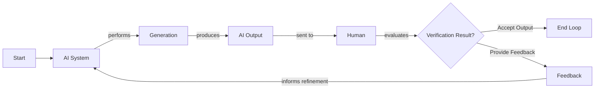
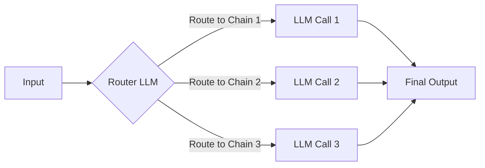
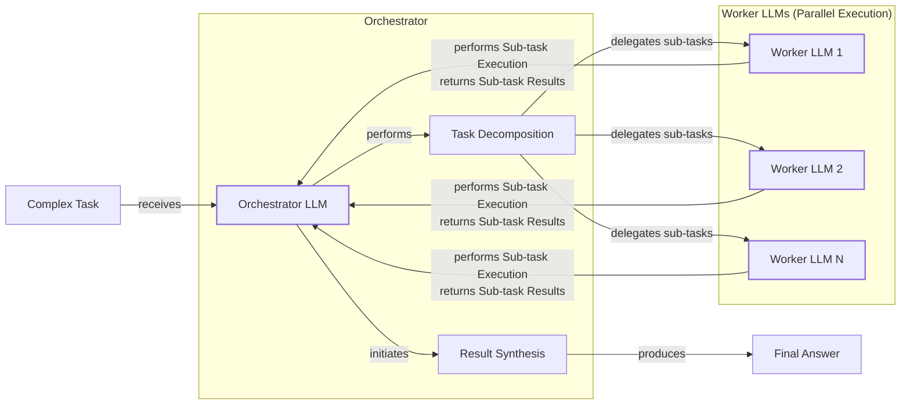
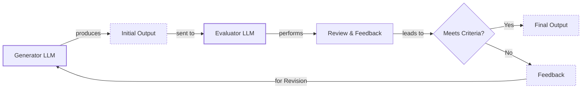
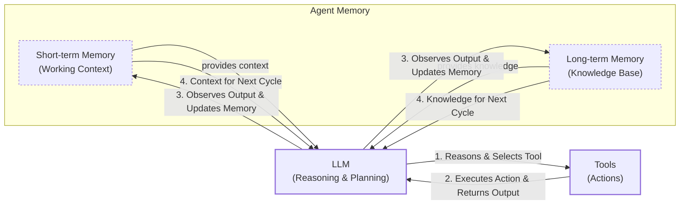
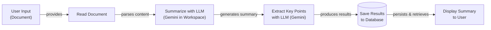
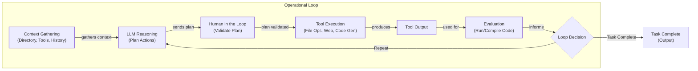
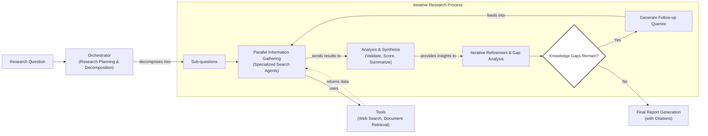

# Workflows vs. Agents: The Critical Decision Every AI Engineer Faces

As an AI engineer preparing to build your first real AI application, one of the first key decisions you will make is how to design your solution. Should it follow a predictable, step-by-step workflow, or does it demand a more autonomous approach, where the LLM makes self-directed decisions? This fundamental question will determine the success or failure of your project and will impact development time, costs, reliability, and user experience.

Choose the wrong approach, and you might end up with an overly rigid system that breaks when users deviate from expected patterns. Or, you could build an unpredictable agent that works brilliantly 80% of the time but fails catastrophically when it matters most. Months of development time can be wasted rebuilding the entire architecture, leading to frustrated users and executives who cannot afford to keep the system running.

In 2024 and 2025, we have seen billion-dollar AI startups succeed or fail based on this architectural decision. The most successful AI engineers and teams know when to use workflows versus agents and, more importantly, how to combine both approaches effectively.

This lesson will help you make this critical decision. We will explore the trade-offs between LLM workflows and agents, examine real-world examples, and show you how to design reliable systems that combine both approaches. By the end, you will know which path to choose for your AI applications.

## Understanding the Spectrum: From Workflows to Agents

Before choosing between workflows and agents, it helps to see them not as a binary choice but as levels on a spectrum of autonomy [[45]](https://lumenalta.com/labs/from-llm-to-full-agency-understanding-the-levels-of-ai-autonomy). We are not focused on the technical specifics yet, but on their core properties.

An **LLM workflow** is a sequence of tasks involving LLM calls or other operations, orchestrated by developer-written code. The steps are defined in advance, creating predictable, rule-based paths. This approach evolved from historical rule-based systems, which were effective for clear-cut instructions but struggled with ambiguity and scale [[46]](https://fetch.ai/blog/evolution-ai-agents-from-rule-based-systems-to-llms-agents). Think of a modern workflow as a factory assembly line, where each station performs a specific task [[2]](https://www.youtube.com/watch?v=kQxr-uOxw2o&t=1s), [[21]](https://mlpills.substack.com/p/issue-110-llm-workflow-patterns). In future lessons, we will explore patterns like chaining and routing.

https://storage.googleapis.com/gweb-cloudblog-publish/images/map-reduce-summary.max-1900x1900.png
Image 1: A map-reduce approach to document summarization is a classic example of an LLM workflow with parallel steps. (Source [3](https://cloud.google.com/blog/products/ai-machine-learning/long-document-summarization-with-workflows-and-gemini-models))

**AI agents** represent a higher level of autonomy. Here, an LLM dynamically decides the sequence of steps, reasoning, and actions to achieve a goal. The path is not predefined but is planned based on the task and environment. This gives agents flexibility to handle ambiguity and complexity, much like a skilled expert solving a new problem [[17]](https://medium.com/@ananya_95177/key-challenges-in-ai-agent-development-and-how-to-solve-them-460fceb0a6d5). We will cover agent-specific concepts like tools, memory, and the ReAct architecture later.

https://unit42.paloaltonetworks.com/wp-content/uploads/2025/04/word-image-141040-140037-1.png
Image 2: A typical AI agent architecture, where the LLM acts as a reasoning engine to plan and execute actions using external tools. (Source [18](https://unit42.paloaltonetworks.com/agentic-ai-threats/))

Both require an orchestration layer. In workflows, this layer executes a defined plan. In agents, it facilitates the LLM's dynamic planning and execution.

## Choosing Your Path

In the previous section, we defined LLM workflows and AI agents independently. Now, we will explore their core difference: developer-defined logic versus LLM-driven autonomy.

https://substackcdn.com/image/fetch/f_auto,q_auto:good,fl_progressive:steep/https%3A%2F%2Fsubstack-post-media.s3.amazonaws.com%2Fpublic%2Fimages%2F5e64d5e0-7ef1-4e7f-b441-3bf1fef4ff9a_1276x818.png
Image 3: The trade-off between application reliability and an agent's level of control, illustrating the spectrum from workflows to autonomous agents. (Source [40](https://decodingml.substack.com/p/stop-building-ai-agents))

Most real-world systems exist on a spectrum between rigid workflows and autonomous agents. When building, you have an "autonomy slider" to decide how much control the LLM has [[14]](https://singjupost.com/andrej-karpathy-software-is-changing-again/). For example, Cursor's coding assistance ranges from simple completion to rewriting a repository. Perplexity offers everything from a quick search to a deep research function that takes minutes to generate a report [[12]](https://www.linkedin.com/posts/markbarbir_andrej-karpathys-latest-talk-describes-our-activity-7343449417426837505-oTFx).

The ultimate goal is to speed up the loop between AI generation and human verification. This is often achieved through a well-designed architecture and a user-friendly interface that makes it easy for humans to review and guide the AI's work.

Image 4: A flowchart illustrating the iterative loop between AI generation and human verification.

You should use an **LLM workflow** for well-defined tasks like data extraction or report generation. Workflows offer predictability, reliability, and easier debugging, with more predictable costs and latency. This makes them ideal for regulated fields like finance and healthcare, where AI-powered administrative systems already help coordinate patient care [[47]](https://pmc.ncbi.nlm.nih.gov/articles/PMC12360800/). Their main weakness is rigidity. You should use an **AI agent** for open-ended tasks like research or code debugging. Agents adapt to new situations but are less reliable, harder to debug, and pose security risks.

The choice also impacts how you measure success. For a workflow generating a financial report, you might use reference-free metrics that assess the correctness of financial takeaways and reasoning [[48]](https://arxiv.org/html/2504.14233v1). For an agent, you would focus on metrics like action completion, tool selection quality, and reasoning coherence [[49]](https://galileo.ai/blog/accuracy-metrics-ai-evaluation).

## Exploring Common Patterns

To build your intuition, let's look at the most common patterns for constructing both workflows and agents. We will cover these in detail in future lessons, but for now, the goal is to understand the high-level concepts.

For LLM workflows, we often use patterns like:
*   **Chaining and routing**, which automates sequences of LLM calls and directs the flow based on specific conditions. This is a foundational step in building more complex automations [[21]](https://mlpills.substack.com/p/issue-110-llm-workflow-patterns).

Image 5: A flowchart illustrating the "Chaining and Routing" pattern for LLM workflows.

*   The **orchestrator-worker** pattern involves a central orchestrator that understands user intent, dynamically plans sub-tasks, and delegates them to specialized workers. This creates a smooth transition from rigid workflows to more dynamic, agent-like behavior [[25]](https://online.stevens.edu/blog/building-self-healing-ai-orchestrator-reflexion-patterns/).

Image 6: A flowchart illustrating the Orchestrator-Worker pattern with an Orchestrator LLM delegating tasks to multiple Worker LLMs and synthesizing results.

*   The **evaluator-optimizer loop** is used to auto-correct LLM outputs. One LLM generates a response, while another provides feedback to help the first LLM refine its answer, similar to a human writer-editor loop [[30]](https://docs.aws.amazon.com/prescriptive-guidance/latest/agentic-ai-patterns/evaluator-reflect-refine-loop-patterns.html).

Image 7: A flowchart illustrating the Evaluator-Optimizer Loop pattern.

The core of nearly all modern agents is the **ReAct (Reason and Act)** pattern. This pattern allows an agent to decide what action to take, interpret the output, and repeat the cycle until the task is complete. It uses an LLM for reasoning, tools for actions, and both short-term and long-term memory [[5]](https://developers.google.com/gemini-code-assist/docs/gemini-cli). We will explore this pattern in detail in future lessons.

Image 8: Flowchart illustrating the ReAct pattern in an AI agent, showing the cyclical interaction between the LLM, tools, and memory components.

## Zooming In on Our Favorite Examples

To make these concepts more concrete, let's analyze a few real-world examples, from a simple workflow to a more advanced hybrid system.

### Document Summarization in Google Workspace

Finding the right information in large documents is a common time-waster. An embedded summarization feature is a perfect use case for a simple, multi-step LLM workflow [[3]](https://cloud.google.com/blog/products/ai-machine-learning/long-document-summarization-with-workflows-and-gemini-models), [[1]](https://support.google.com/docs/answer/15627020?hl=en). This is a pure workflow where a chain of LLM calls reads a document, summarizes it, extracts key points, and displays the result. Each step is predefined, making the process reliable.

Image 9: A flowchart illustrating a simple LLM workflow for document summarization and analysis using Gemini in Google Workspace.

### Gemini CLI Coding Assistant

AI coding assistants can significantly speed up development. The open-source Gemini CLI is a single-agent system using a ReAct-like architecture to help developers write, debug, and understand code [[5]](https://developers.google.com/gemini-code-assist/docs/gemini-cli). It gathers context from the codebase, reasons about the user's request, validates its plan, and then executes actions using tools like file access and code generation. It evaluates the code and repeats the cycle until the task is complete.

Image 10: A flowchart illustrating the operational loop of the Gemini CLI coding assistant.

### Perplexity's Deep Research

Perplexity's Deep Research feature is a hybrid system that combines ReAct reasoning with workflow patterns to conduct expert-level autonomous research [[8]](https://www.perplexity.ai/hub/blog/introducing-perplexity-deep-research). An orchestrator agent decomposes a research question and delegates sub-questions to specialized search agents that run in parallel [[6]](https://zenvanriel.com/ai-engineer-blog/perplexity-computer-multi-model-agent-orchestration/). The system gathers information, synthesizes results, and iteratively refines its search to fill knowledge gaps before generating a final, cited report. This combines the structure of a workflow with the dynamic reasoning of agents.

Image 11: A flowchart illustrating Perplexity's Deep Research agent's iterative multi-step process.

## The Challenges of Every AI Engineer

Now that you understand the spectrum from LLM workflows to AI agents, it is important to recognize that every AI engineer faces these same fundamental challenges. The architectural decisions you make will determine whether your AI application succeeds in production or fails spectacularly.

Every AI engineer battles daily challenges: reliability issues where agents fail with real users, context limits that break long conversations, and the constant struggle of data integration. There is also the cost-performance trap of expensive agents and major security risks [[15]](https://arxiv.org/html/2510.25423v2). In multi-agent systems, vulnerabilities like "capability bleed" can allow one agent to gain unintended access to another's tools. This, or the rapid spread of contaminated data, can compromise the entire system [[53]](https://www.knostic.ai/blog/multi-agent-security).

These challenges are solvable. In our next lesson, we will cover **structured outputs**, a key technique for ensuring reliability. Throughout this course, we will explore patterns for building reliable products, including chaining, routing, and using tools and memory. You will learn to architect AI systems that are powerful, reliable, efficient, and safe, knowing when to use a workflow, when to deploy a ReAct agent, and how to build effective hybrid systems that work.

## References

- [1] [How does Gemini document summarization workflow operate in Google Workspace?](https://support.google.com/docs/answer/15627020?hl=en)
- [2] [Real Agents vs. Workflows: The Truth Behind AI 'Agents'](https://www.youtube.com/watch?v=kQxr-uOxw2o&t=1s)
- [3] [Long document summarization with Workflows and Gemini models](https://cloud.google.com/blog/products/ai-machine-learning/long-document-summarization-with-workflows-and-gemini-models)
- [4] [How does Gemini document summarization workflow operate in Google Workspace?](https://knowledge.workspace.google.com/admin/gemini/google-workspace-with-gemini)
- [5] [What ReAct pattern does Gemini CLI coding assistant implement?](https://developers.google.com/gemini-code-assist/docs/gemini-cli)
- [6] [How does Perplexity Deep Research hybrid agent orchestrate parallel research?](https://zenvanriel.com/ai-engineer-blog/perplexity-computer-multi-model-agent-orchestration/)
- [7] [How does Perplexity Deep Research hybrid agent orchestrate parallel research?](https://www.gend.co/blog/perplexity-computer-ai-agent-orchestration)
- [8] [Introducing Perplexity Deep Research](https://www.perplexity.ai/hub/blog/introducing-perplexity-deep-research)
- [9] [How does Perplexity Deep Research hybrid agent orchestrate parallel research?](https://www.digitalapplied.com/blog/perplexity-agent-api-platform-ai-search-developer-guide)
- [10] [What autonomy slider examples use Cursor and Perplexity in Karpathy talk?](https://medium.com/@ben_pouladian/andrej-karpathy-on-software-3-0-software-in-the-age-of-ai-b25533da93b6)
- [11] [What autonomy slider examples use Cursor and Perplexity in Karpathy talk?](https://andrewships.substack.com/p/autonomy-sliders)
- [12] [What autonomy slider examples use Cursor and Perplexity in Karpathy talk?](https://www.linkedin.com/posts/markbarbir_andrej-karpathys-latest-talk-describes-our-activity-7343449417426837505-oTFx)
- [13] [What autonomy slider examples use Cursor and Perplexity in Karpathy talk?](https://www.latent.space/p/s3)
- [14] [Andrej Karpathy: Software Is Changing (Again)](https://singjupost.com/andrej-karpathy-software-is-changing-again/)
- [15] [What reliability context and security challenges face AI engineers building agents?](https://arxiv.org/html/2510.25423v2)
- [16] [What reliability context and security challenges face AI engineers building agents?](https://permiso.io/blog/8-critical-ai-security-challenges)
- [17] [What reliability context and security challenges face AI engineers building agents?](https://medium.com/@ananya_95177/key-challenges-in-ai-agent-development-and-how-to-solve-them-460fceb0a6d5)
- [18] [AI Agents Are Here. So Are the Threats.](https://unit42.paloaltonetworks.com/agentic-ai-threats/)
- [19] [What reliability context and security challenges face AI engineers building agents?](https://www.cyberark.com/resources/blog/the-agentic-ai-revolution-5-unexpected-security-challenges)
- [20] [How does chaining and routing work in LLM workflows?](https://mirascope.com/blog/llm-chaining)
- [21] [How does chaining and routing work in LLM workflows?](https://mlpills.substack.com/p/issue-110-llm-workflow-patterns)
- [22] [How does chaining and routing work in LLM workflows?](https://orq.ai/blog/prompt-structure-chaining)
- [23] [How does chaining and routing work in LLM workflows?](https://www.geeksforgeeks.org/artificial-intelligence/llm-chains/)
- [24] [How does chaining and routing work in LLM workflows?](https://www.promptingguide.ai/techniques/prompt_chaining)
- [25] [What is orchestrator-worker pattern for LLM to agent transition?](https://online.stevens.edu/blog/building-self-healing-ai-orchestrator-reflexion-patterns/)
- [26] [What is orchestrator-worker pattern for LLM to agent transition?](https://mlpills.substack.com/p/diy-17-orchestrator-worker-llm-agent)
- [27] [What is orchestrator-worker pattern for LLM to agent transition?](https://www.linkedin.com/posts/seanf_the-orchestrator-worker-pattern-is-a-well-known-activity-7294775230353313792-_zFL)
- [28] [Orchestrator-Workers Workflow](https://platform.claude.com/cookbook/patterns-agents-orchestrator-workers)
- [29] [What is orchestrator-worker pattern for LLM to agent transition?](https://gurusup.com/blog/agent-orchestration-patterns)
- [30] [How does evaluator-optimizer loop auto-correct LLMs with reflection?](https://docs.aws.amazon.com/prescriptive-guidance/latest/agentic-ai-patterns/evaluator-reflect-refine-loop-patterns.html)
- [31] [How does evaluator-optimizer loop auto-correct LLMs with reflection?](https://dev.to/clayroach/building-self-correcting-llm-systems-the-evaluator-optimizer-pattern-169p)
- [32] [How does evaluator-optimizer loop auto-correct LLMs with reflection?](https://vadim.blog/the-research-on-llm-self-correction)
- [33] [How does evaluator-optimizer loop auto-correct LLMs with reflection?](https://platform.claude.com/cookbook/patterns-agents-evaluator-optimizer)
- [34] [How does evaluator-optimizer loop auto-correct LLMs with reflection?](https://sebgnotes.substack.com/p/evaluator-optimizer-llm-workflow)
- [35] [A Developer’s Guide to Building Scalable AI: Workflows vs Agents](https://towardsdatascience.com/a-developers-guide-to-building-scalable-ai-workflows-vs-agents/)
- [36] [Building effective agents](https://www.anthropic.com/engineering/building-effective-agents)
- [37] [Exploring the difference between agents and workflows](https://decodingml.substack.com/p/llmops-for-production-agentic-rag)
- [38] [What is an AI agent?](https://cloud.google.com/discover/what-are-ai-agents)
- [39] [601 real-world gen AI use cases from the world's leading organizations](https://cloud.google.com/transform/101-real-world-generative-ai-use-cases-from-industry-leaders)
- [40] [Stop Building AI Agents: Here’s what you should build instead](https://decodingml.substack.com/p/stop-building-ai-agents)
- [41] [Building Production-Ready RAG Applications: Jerry Liu](https://www.youtube.com/watch?v=TRjq7t2Ms5I)
- [42] [Gemini CLI: your open-source AI agent](https://blog.google/technology/developers/introducing-gemini-cli-open-source-ai-agent/)
- [43] [Gemini CLI](https://github.com/google-gemini/gemini-cli/blob/main/README.md)
- [44] [Introducing ChatGPT agent: bridging research and action](https://openai.com/index/introducing-chatgpt-agent/)
- [45] [From LLM to full agency: Understanding the levels of AI autonomy](https://lumenalta.com/labs/from-llm-to-full-agency-understanding-the-levels-of-ai-autonomy)
- [46] [The Evolution of AI Agents: From Rule-Based Systems to LLMs Agents](https://fetch.ai/blog/evolution-ai-agents-from-rule-based-systems-to-llms-agents)
- [47] [AI-Powered Health Care Administrative Workflow Systems](https://pmc.ncbi.nlm.nih.gov/articles/PMC12360800/)
- [48] [Making LLaMA SEE and HEAR: A Comprehensive Study of Modality Adapters in Large Vision-Language Models](https://arxiv.org/html/2504.14233v1)
- [49] [A Guide to Accuracy Metrics in AI Evaluation](https://galileo.ai/blog/accuracy-metrics-ai-evaluation)
- [50] [Memory as a System: A Survey of Computational Memory in AI](https://arxiv.org/html/2601.09913v1)
- [51] [Multi-Agent Systems for Robotic Autonomy with LLMs](https://openaccess.thecvf.com/content/CVPR2025W/MEIS/papers/Chen_Multi-Agent_Systems_for_Robotic_Autonomy_with_LLMs_CVPRW_2025_paper.pdf)
- [52] [Agent API Presets](https://docs.perplexity.ai/docs/agent-api/presets)
- [53] [How to Secure Multi-Agent AI Systems](https://www.knostic.ai/blog/multi-agent-security)