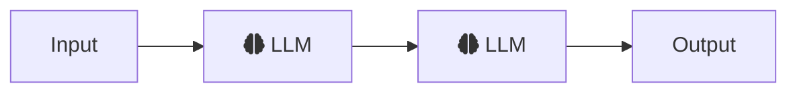
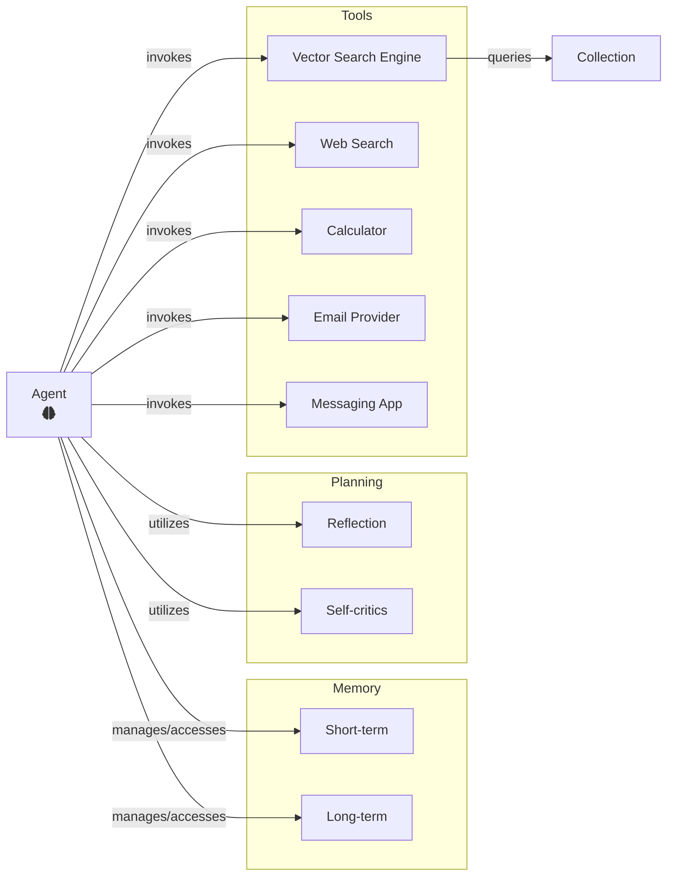
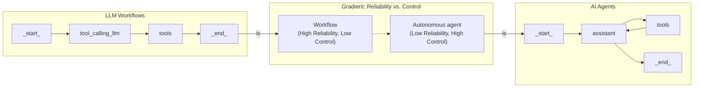
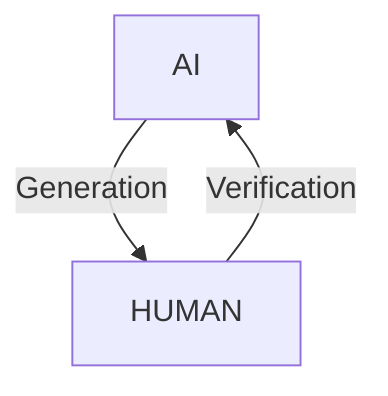
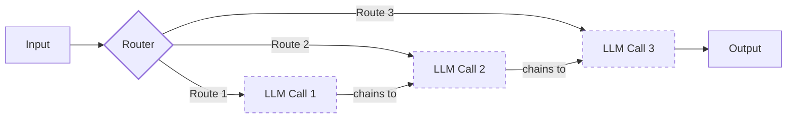
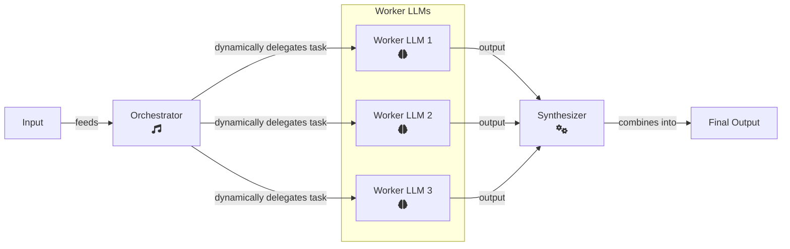
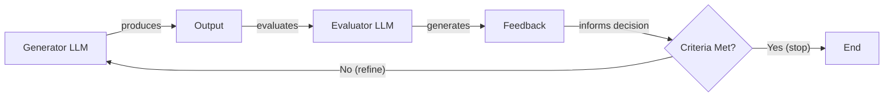
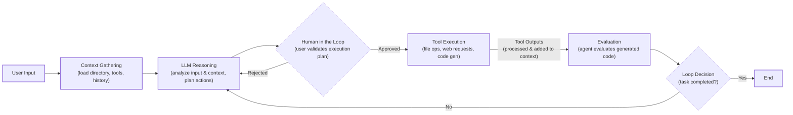
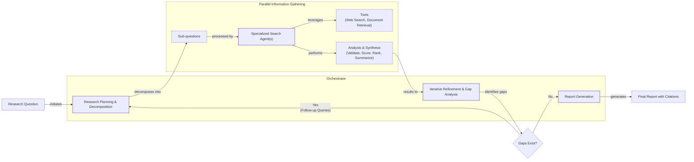

# The Critical Decision Every AI Engineer Faces

As an AI engineer preparing to build your first real AI application, after narrowing down the problem you want to solve, one key decision is how to design your AI solution. Should it follow a predictable, step-by-step workflow, or does it demand a more autonomous approach, where the LLM makes self-directed decisions along the way? Thus, one of the fundamental questions that will determine the success or failure of your project is: How should you architect your AI system?

When building AI applications, engineers face this critical architectural decision early in their development process. Should you create a predictable, step-by-step workflow where you control every action, or should you build an autonomous agent that can think and decide for itself? This is one of the key decisions that will impact everything from development time and costs to reliability and user experience.

Choose the wrong approach and you might end up with an overly rigid system that breaks when users deviate from expected patterns, or an unpredictable agent that works brilliantly 80% of the time but fails catastrophically when it matters most. Months of development time can be wasted rebuilding the entire architecture, leading to frustrated users who cannot rely on the application and executives who cannot afford to keep it running as costs skyrocket.

In 2024-2025, we are seeing billion-dollar AI startups succeed or fail based primarily on this architectural decision. The most successful teams and engineers know when to use workflows versus agents, and more importantly, how to combine both approaches effectively.

This lesson will provide you with a framework to make this critical decision with confidence. We will explore the two core methodologies of building AI applications: LLM workflows and AI agents. We will explain each, compare their pros and cons, and explore use cases where each approach is most effective. You will understand the fundamental trade-offs, see real-world examples from leading AI companies, and learn how to design systems that leverage the best of both worlds.

## Understanding the Spectrum: From Workflows to Agents

To choose between workflows and agents, you need a clear understanding of what they are. In this section, we will look at their properties and how they are used, without diving into the technical specifics just yet.

### LLM Workflows

An LLM workflow is a sequence of tasks involving LLM calls or other operations, such as reading from or writing to a database. It is largely predefined and orchestrated by developer-written code. The steps are defined in advance, resulting in deterministic or rule-based paths with predictable execution and explicit control flow. Think of it as a factory assembly line: each station has a specific job, and the product moves from one to the next in a set order.


Image 1: A simple LLM workflow showing a linear sequence of tasks with brain icons for LLM processing steps.

The beauty of workflows is their predictability. You can debug them like any other piece of software. If a step fails, you know exactly where to look. This control makes them reliable and cost-effective. In future lessons, we will explore common workflow patterns like chaining, routing, and orchestrator-worker designs in detail.

### AI Agents

AI agents are systems where an LLM plays a central role in dynamically planning the sequence of steps and actions required to achieve a goal. The steps are not defined in advance but are decided by the agent based on the task and the current state of its environment. This allows them to be adaptive and capable of handling new or unexpected situations. An agent is like a skilled human expert tackling an unfamiliar problem, adapting their approach with each new piece of information.


Image 2: A simple agentic system architecture diagram.

This autonomy is what makes agents powerful. They can reason, plan, and use a set of available actions (which we will cover as "tools" in Lesson 6) to interact with their environment. They can also use memory to learn from past interactions, a topic we will dive into in Lesson 9. Many modern agents use a pattern of reasoning and acting in a loop, which we will explore in depth when we discuss ReAct agents in future lessons.

Both workflows and agents require an orchestration layer to function. In a workflow, this layer simply executes a predefined plan. In an agent, it facilitates the LLM's dynamic planning and execution, giving the model the freedom to choose its own path.

## Choosing Your Path

Now that we have defined LLM workflows and AI agents, let's explore their core difference: developer-defined logic versus LLM-driven autonomy. This is not a binary choice but a spectrum. Most real-world systems are a hybrid, blending the stability of workflows with the flexibility of agents.


Image 3: A conceptual diagram illustrating the gradient between LLM workflows and AI agents, showing their respective process flows and their positions on a reliability vs. control gradient.

### When to Use LLM Workflows

Workflows are the best choice when the task is well-defined and requires predictable, reliable execution. Think of automating report generation, extracting data from documents, or handling repetitive tasks like sending emails or social media updates. Their strength lies in their stability and ease of debugging. Because the steps are fixed, costs and latency are more predictable, and you can often use smaller, specialized models for each sub-task, which reduces infrastructure overhead.

This predictability is why workflows are preferred in enterprise settings and regulated fields like finance and healthcare [[60]](https://towardsdatascience.com/a-developers-guide-to-building-scalable-ai-workflows-vs-agents/). When a financial advisor requests a report, it must be accurate every time. Similarly, AI tools in healthcare must perform with high accuracy because they directly impact people's lives. Workflows are also ideal for building Minimum Viable Products (MVPs) quickly, as you can hardcode the core features and get to market faster. They excel in high-frequency scenarios where cost per request is more important than sophisticated reasoning.

However, workflows can be rigid. They require more development time upfront since each step is manually engineered, and they cannot handle unexpected scenarios well. As the application grows, adding new features can become complex.

### When to Use AI Agents

AI agents are best suited for open-ended problems that require dynamic problem-solving and adaptation. Examples include complex research tasks, advanced customer support, or debugging code. Their strength is their ability to handle ambiguity and adapt to new information on the fly.

But this flexibility comes at a cost. Agents are non-deterministic, which means their performance, latency, and costs can vary with each run, making them less reliable. They often require more powerful—and therefore more expensive—LLMs to reason effectively. They also make multiple LLM calls to plan and execute actions, further increasing costs [[60]](https://towardsdatascience.com/a-developers-guide-to-building-scalable-ai-workflows-vs-agents/). Security is another major concern; an agent with write permissions could delete critical data or send inappropriate emails if not properly designed. Finally, agents are notoriously difficult to debug and evaluate.

The current state of agents is still experimental. We have seen stories of AI agents deleting a developer's code, with the developer joking, "Anyway, I wanted to start a new project." This highlights the risks of giving too much autonomy to systems that are not yet fully reliable.

### Hybrid Approaches and the Autonomy Slider

Most real-world systems are not purely one or the other. They are hybrids that exist on a spectrum between full human control and full AI autonomy. Andrej Karpathy introduced the concept of an "autonomy slider," where you, the developer, decide how much control to give the LLM versus the user [[13]](https://singjupost.com/andrej-karpathy-software-is-changing-again/), [[35]](https://www.youtube.com/watch?v=LCEmiRjPEtQ).

For example, the coding assistant Cursor offers different levels of autonomy. You can use simple tab-completion (low autonomy), ask the AI to edit a specific chunk of code, or give it a high-level goal and let it modify the entire repository (high autonomy) [[13]](https://singjupost.com/andrej-karpathy-software-is-changing-again/), [[35]](https://www.youtube.com/watch?v=LCEmiRjPEtQ). Similarly, Perplexity allows you to perform a quick search, a more involved "research" query, or a "deep research" task that takes several minutes to complete [[13]](https://singjupost.com/andrej-karpathy-software-is-changing-again/), [[35]](https://www.youtube.com/watch?v=LCEmiRjPEtQ).

The goal is to create a fast and efficient loop of AI generation and human verification. This is often achieved through a well-designed architecture and a user-friendly interface that allows the human to stay in control [[35]](https://www.youtube.com/watch?v=LCEmiRjPEtQ).


Image 4: A circular flow diagram illustrating the "AI generation and human verification loop".

## Exploring Common Patterns

To build an intuition for AI engineering, let's look at some of the most common patterns for building both workflows and agents. We will cover these in much greater detail in future lessons, but for now, we will keep the explanations high-level.

### LLM Workflow Patterns

These patterns help structure how LLMs are used in a predefined sequence.

**Chaining and Routing** is a foundational pattern for automating multiple LLM calls. It allows you to "glue" together different steps and add logic to decide which path to take based on the input. This is the first step toward building more complex automations, and we will explore it further in upcoming lessons.


Image 5: A flowchart illustrating LLM workflow patterns for chaining and routing.

The **Orchestrator-Worker** pattern introduces a "manager" LLM that analyzes a user's request, breaks it down into subtasks, and delegates them to specialized "worker" LLMs [[21]](https://mlpills.substack.com/p/issue-110-llm-workflow-patterns/), [[53]](https://platform.claude.com/cookbook/patterns-agents-orchestrator-workers). A final synthesizer LLM then combines the results. This pattern allows the system to dynamically decide which actions to take, marking a smooth transition from rigid workflows to more flexible, agent-like systems.


Image 6: A flowchart illustrating the Orchestrator-Worker pattern with input, orchestrator, parallel worker LLMs, a synthesizer, and final output.

The **Evaluator-Optimizer Loop** is designed to improve the quality of LLM outputs through automated feedback. In this pattern, one LLM generates a response, and another "evaluator" LLM critiques it based on a set of criteria. This feedback, sometimes called a reflection, is then passed back to the original LLM to refine its answer. The process repeats until the output meets the desired quality, much like a human writer revising a draft based on an editor's comments [[30]](https://docs.aws.amazon.com/prescriptive-guidance/latest/agentic-ai-patterns/evaluator-reflect-refine-loop-patterns.html), [[54]](https://platform.claude.com/cookbook/patterns-agents-evaluator-optimizer).


Image 7: A flowchart illustrating the Evaluator-Optimizer loop.

### Core Components of a ReAct AI Agent

The **ReAct (Reason and Act)** pattern is at the heart of most modern AI agents. It enables an agent to reason about a task, decide on an action, take that action using a tool, observe the outcome, and then repeat the cycle until the task is complete. This loop of thinking and doing is what gives agents their autonomy [[61]](https://cloud.google.com/discover/what-are-ai-agents).

A ReAct agent is typically composed of a few core components:
*   An **LLM** to reason about the task and decide which actions to take.
*   A set of **tools** (actions) that allow the agent to interact with its external environment. We will cover tools in detail in Lesson 6.
*   **Short-term memory** to keep track of the current conversation, similar to a computer's RAM.
*   **Long-term memory** to access factual knowledge and remember user preferences across sessions. We will explore memory in depth in Lesson 9.

Almost all state-of-the-art agents in the industry use the ReAct pattern because of its proven potential. We will dedicate Lessons 7 and 8 to explaining it in detail.

```mermaid
flowchart LR
  %% Agent Core
  subgraph "AI Agent (ReAct Pattern)"
    LLM["LLM<br/>(Reasoning/Planning)"]
  end

  %% Memory Components
  subgraph "Agent Memory"
    STM["Short-term Memory"]
    LTM["Long-term Memory"]
  end

  %% External Interaction
  subgraph "External Environment"
    Tools["Tools<br/>(Actions)"]
    Obs["Observations"]
  end

  %% Primary ReAct Cycle
  LLM -- "1. Reasons & Decides Action" --> Tools
  Tools -- "2. Executes & Produces Output" --> Obs
  Obs -- "3. Provides Observation" --> LLM

  %% Memory Interactions (LLM accesses memory)
  STM -- "provides context" --> LLM
  LTM -- "provides context" --> LLM

  %% Memory Interactions (LLM updates memory)
  LLM -- "updates" --> STM
  LLM -- "updates" --> LTM

  %% Visual grouping
  classDef core stroke-width:2px
  classDef memory stroke-dasharray:3,3
  class LLM core
  class STM,LTM memory
  class Tools,Obs
```
Image 8: A flowchart illustrating the high-level dynamics of an AI agent using the ReAct (Reason and Act) pattern.

## Zooming In on Our Favorite Examples

To anchor these concepts in the real world, let's look at a few examples, from a simple workflow to a more advanced hybrid system. We will keep these explanations high-level, as you only know what we have covered so far.

### Document Summarization in Google Workspace: A Simple Workflow

A common problem in team settings is finding the right information within large documents. A quick, embedded summary can save a lot of time. The document summarization feature in Google Workspace is a perfect example of a pure, multi-step workflow [[3]](https://cloud.google.com/blog/products/ai-machine-learning/long-document-summarization-with-workflows-and-gemini-models).

```mermaid
flowchart LR
  %% Input Document
  subgraph "Input"
    A["Long text document"]
  end

  %% Chunking Process
  subgraph "Chunking"
    B["Splitter"]
    C["Multiple Chunks<br/>(Chunk #1 to #n)"]
  end

  %% Individual Summarization
  subgraph "Individual Summarization"
    D["Gemini<br/>(Chunk Summarizer)"]
    E["Multiple Summaries<br/>(Summary #1 to #n)"]
  end

  %% Final Summarization
  subgraph "Final Summarization"
    F["Gemini<br/>(Final Combiner)"]
    G["Final summary"]
  end

  %% Data Flow
  A -- "is split into" --> B
  B -- "generates" --> C
  C -- "are processed by" --> D
  D -- "produces" --> E
  E -- "are combined by" --> F
  F -- "generates" --> G

  %% Visual Grouping
  classDef document stroke-dasharray: 5,5
  classDef process stroke-width:2px
  class A,C,E,G document
  class B,D,F process
```


Image 9: A flowchart illustrating the document summarization and analysis workflow by Gemini in Google Workspace.

This system follows a map-reduce approach. The long document is split into smaller chunks (the "map" step), each chunk is summarized in parallel by an LLM, and then a final LLM call combines these smaller summaries into one final summary (the "reduce" step) [[3]](https://cloud.google.com/blog/products/ai-machine-learning/long-document-summarization-with-workflows-and-gemini-models). It is a simple, effective chain of LLM calls with no dynamic decision-making.

### Gemini CLI: A Single-Agent System for Coding

Writing code is a time-consuming process. A coding assistant can dramatically speed up development, whether you are writing code from scratch, learning a new codebase, or writing documentation. The Gemini CLI is an open-source AI agent that brings the power of Gemini directly into your terminal [[36]](https://blog.google/technology/developers/introducing-gemini-cli-open-source-ai-agent/), [[37]](https://github.com/google-gemini/gemini-cli/blob/main/README.md).

It uses a ReAct-style architecture to function as a single-agent coding assistant [[5]](https://developers.google.com/gemini-code-assist/docs/gemini-cli). Here is a high-level overview of its operational loop:

1.  **Context Gathering:** The agent starts by loading the directory structure, available tools (actions), and conversation history into its working memory.
2.  **LLM Reasoning:** The Gemini model analyzes your request and the current context to plan the necessary actions.
3.  **Human in the Loop:** Before executing any file system changes, it asks for your approval.
4.  **Tool Execution:** It executes the planned actions, which can include reading files, searching the web for documentation, or generating code.
5.  **Evaluation:** The agent can dynamically evaluate the code it writes, for instance, by running it.
6.  **Loop Decision:** It assesses whether the task is complete or if it needs to continue the cycle of reasoning and acting.

This loop allows the Gemini CLI to handle complex coding tasks autonomously, making it a powerful assistant for developers.


Image 10: A flowchart illustrating the operational loop of the Gemini CLI coding assistant.

### Perplexity Deep Research: A Hybrid System

Researching a new topic can be daunting. Perplexity's Deep Research feature acts as a powerful research assistant, and it is a fascinating example of a hybrid system that combines workflows with multiple agents [[8]](https://www.perplexity.ai/hub/blog/introducing-perplexity-deep-research). While the exact implementation is closed-source, we can infer its architecture based on public information.

The system uses an orchestrator-worker pattern to manage multiple specialized agents. These agents work in parallel, performing dozens of searches across hundreds of sources to compile a comprehensive report in just a few minutes [[8]](https://www.perplexity.ai/hub/blog/introducing-perplexity-deep-research).

Here is a simplified view of how it might work:
1.  **Research Planning & Decomposition:** An orchestrator agent analyzes your research question and breaks it down into several sub-questions.
2.  **Parallel Information Gathering:** Specialized search agents are deployed in parallel, each tackling one sub-question. They use tools like web search and document retrieval to gather information.
3.  **Analysis & Synthesis:** Each agent validates its sources, scores them for relevance, and summarizes the top findings.
4.  **Iterative Refinement:** The orchestrator collects the results and identifies any knowledge gaps. If gaps exist, it generates follow-up queries and repeats the process.
5.  **Report Generation:** Once the research is complete, the orchestrator synthesizes all the information into a final, structured report with citations.


Image 11: Flowchart illustrating the iterative multi-step process of Perplexity's Deep Research agent.

Perplexity's Deep Research feature is a powerful hybrid. It uses a structured workflow to orchestrate and supervise multiple agents, combining the reliability of workflows with the dynamic reasoning of agents to achieve a result that would be difficult for a single agent to produce.

## The Challenges of Every AI Engineer

Now that you understand the spectrum from LLM workflows to AI agents, it is important to recognize that every AI engineer faces these same fundamental challenges when designing a new AI application. This architectural choice is one of the core decisions that determine whether your AI product succeeds in production or fails spectacularly.

As we move forward in this course, we will systematically tackle the daily challenges every AI engineer battles:
*   **Reliability Issues:** Your agent works perfectly in demos but becomes unpredictable with real users. LLM reasoning failures can compound through multi-step processes, leading to unexpected and costly outcomes [[15]](https://arxiv.org/html/2510.25423v2), [[58]](https://decodingml.substack.com/p/stop-building-ai-agents).
*   **Context Limits:** Systems struggle to maintain coherence across long conversations, gradually losing track of their purpose. Ensuring consistent output quality across different agent specializations presents a continuous challenge [[17]](https://medium.com/@ananya_95177/key-challenges-in-ai-agent-development-and-how-to-solve-them-460fceb0a6d5).
*   **Data Integration:** Building pipelines to pull information from various sources while ensuring only high-quality data is passed to your AI system is critical to avoid the "garbage-in, garbage-out" problem.
*   **Cost-Performance Trap:** Sophisticated agents can deliver impressive results but may cost a fortune per user interaction, making them economically unfeasible for many applications [[60]](https://towardsdatascience.com/a-developers-guide-to-building-scalable-ai-workflows-vs-agents/).
*   **Security Concerns:** Autonomous agents with powerful write permissions could send the wrong emails, delete critical files, or expose sensitive data if not properly secured [[16]](https://permiso.io/blog/8-critical-ai-security-challenges), [[19]](https://www.cyberark.com/resources/blog/the-agentic-ai-revolution-5-unexpected-security-challenges).

These challenges are solvable. In the upcoming lessons, we will cover patterns for building reliable products through specialized evaluation and monitoring pipelines. We will explore strategies for building hybrid systems and ways to keep costs and latency under control. In our next lesson, we will start with a foundational technique: getting structured outputs from LLMs. Later, we will dive into more advanced topics like actions, memory, and different agent architectures.

By the end of this course, you will have the knowledge to architect AI systems that are not only powerful but also robust, efficient, and safe. You will know when to use a workflow, when to deploy an agent, and how to build effective hybrid systems that work in the real world.

## References

- [1] How does Gemini document summarization workflow operate in Google Workspace? https://support.google.com/docs/answer/15627020?hl=en
- [2] New Google Workspace Gemini Feature: Your PDFs Now Write Their Own Summaries and Suggest Next Steps. https://masterconcept.ai/blog/new-google-workspace-gemini-feature-your-pdfs-now-write-their-own-summaries-and-suggest-next-steps/
- [3] Long document summarization with Workflows and Gemini models. https://cloud.google.com/blog/products/ai-machine-learning/long-document-summarization-with-workflows-and-gemini-models
- [4] Google Workspace with Gemini. https://knowledge.workspace.google.com/admin/gemini/google-workspace-with-gemini
- [5] Gemini CLI. https://developers.google.com/gemini-code-assist/docs/gemini-cli
- [6] Perplexity Computer: The Dawn of Multi-Model Agent Orchestration. https://zenvanriel.com/ai-engineer-blog/perplexity-computer-multi-model-agent-orchestration/
- [7] Perplexity Computer: The Future of AI Agent Orchestration. https://www.gend.co/blog/perplexity-computer-ai-agent-orchestration
- [8] Introducing Perplexity Deep Research. https://www.perplexity.ai/hub/blog/introducing-perplexity-deep-research
- [9] Perplexity Agent API Platform: The AI Search Developer Guide. https://www.digitalapplied.com/blog/perplexity-agent-api-platform-ai-search-developer-guide
- [10] Andrej Karpathy on Software 3.0: Software in the Age of AI. https://medium.com/@ben_pouladian/andrej-karpathy-on-software-3-0-software-in-the-age-of-ai-b25533da93b6
- [11] Autonomy Sliders. https://andrewships.substack.com/p/autonomy-sliders
- [12] Andrej Karpathy's latest talk describes our current state of AI. https://www.linkedin.com/posts/markbarbir_andrej-karpathys-latest-talk-describes-our-activity-7343449417426837505-oTFx
- [13] Andrej Karpathy: Software Is Changing (Again). https://singjupost.com/andrej-karpathy-software-is-changing-again/
- [14] Karpathy on Software 3.0. https://www.latent.space/p/s3
- [15] What Challenges Do Developers Face in AI Agent Systems? An Empirical Study on Stack Overflow & GitHub Issues. https://arxiv.org/html/2510.25423v2
- [16] 8 Critical AI Security Challenges That Demand Your Attention. https://permiso.io/blog/8-critical-ai-security-challenges
- [17] Key Challenges in AI Agent Development and How to Solve Them. https://medium.com/@ananya_95177/key-challenges-in-ai-agent-development-and-how-to-solve-them-460fceb0a6d5
- [18] Agentic AI Threats: Understanding the Security Risks of AI Agents. https://unit42.paloaltonetworks.com/agentic-ai-threats/
- [19] The Agentic AI Revolution: 5 Unexpected Security Challenges. https://www.cyberark.com/resources/blog/the-agentic-ai-revolution-5-unexpected-security-challenges
- [20] LLM Chaining: How it Works, Why it's Important, and How to Do it. https://mirascope.com/blog/llm-chaining
- [21] Issue #110 - LLM Workflow Patterns. https://mlpills.substack.com/p/issue-110-llm-workflow-patterns
- [22] Prompt Chaining: A Practical Guide. https://orq.ai/blog/prompt-structure-chaining
- [23] LLM Chains. https://www.geeksforgeeks.org/artificial-intelligence/llm-chains/
- [24] Prompt Chaining. https://www.promptingguide.ai/techniques/prompt_chaining
- [25] Building a Self-Healing AI Orchestrator with Reflexion Patterns. https://online.stevens.edu/blog/building-self-healing-ai-orchestrator-reflexion-patterns/
- [26] Orchestrator-Worker LLM Agent Pattern. https://mlpills.substack.com/p/diy-17-orchestrator-worker-llm-agent
- [27] The orchestrator-worker pattern is a well-known design pattern for structuring multi-agent systems. https://www.linkedin.com/posts/seanf_the-orchestrator-worker-pattern-is-a-well-known-activity-7294775230353313792-_zFL
- [28] Orchestrator workers. https://platform.claude.com/cookbook/patterns-agents-orchestrator-workers
- [29] Agent Orchestration Patterns. https://gurusup.com/blog/agent-orchestration-patterns
- [30] Evaluator, reflect, and refine loop patterns. https://docs.aws.amazon.com/prescriptive-guidance/latest/agentic-ai-patterns/evaluator-reflect-refine-loop-patterns.html
- [31] Building Self-Correcting LLM Systems: The Evaluator-Optimizer Pattern. https://dev.to/clayroach/building-self-correcting-llm-systems-the-evaluator-optimizer-pattern-169p
- [32] The research on LLM self-correction. https://vadim.blog/the-research-on-llm-self-correction
- [33] Evaluator optimizer. https://platform.claude.com/cookbook/patterns-agents-evaluator-optimizer
- [34] Evaluator-Optimizer LLM Workflow Pattern. https://sebgnotes.substack.com/p/evaluator-optimizer-llm-workflow
- [35] Andrej Karpathy: Software Is Changing (Again). https://www.youtube.com/watch?v=LCEmiRjPEtQ
- [36] Gemini CLI: your open-source AI agent. https://blog.google/technology/developers/introducing-gemini-cli-open-source-ai-agent/
- [37] Gemini CLI. https://github.com/google-gemini/gemini-cli/blob/main/README.md
- [38] Real Agents vs. Workflows: The Truth Behind AI 'Agents'. https://www.youtube.com/watch?v=kQxr-uOxw2o&t=1s
- [39] How Gemini CLI builds context. https://wietsevenema.eu/blog/2025/how-gemini-cli-builds-context/
- [40] How do I provide context files to Gemini CLI. https://milvus.io/ai-quick-reference/how-do-i-provide-context-files-to-gemini-cli
- [41] Gemini.md. https://geminicli.com/docs/cli/gemini-md/
- [42] Gemini CLI Tutorial Series Part 9: Understanding Context, Memory, and Conversational Branching. https://medium.com/google-cloud/gemini-cli-tutorial-series-part-9-understanding-context-memory-and-conversational-branching-095feb3e5a43
- [43] A Look at Context Engineering in Gemini CLI. https://aipositive.substack.com/p/a-look-at-context-engineering-in
- [44] The third wave of data engineering is here. https://www.linkedin.com/posts/tracercloud_the-third-wave-of-data-engineering-activity-7417891798364168192-ZQJz
- [45] Protecting AI data pipelines. https://www.commvault.com/use-cases/protecting-ai-data-pipelines
- [46] Machine Learning Monitoring Tools & AI Reliability. https://www.lumenova.ai/blog/machine-learning-monitoring-tools-ai-reliability/
- [47] 8 Best Data Pipeline Monitoring Tools. https://www.integrate.io/blog/data-pipeline-monitoring-tools/
- [48] 601 real-world gen AI use cases from the world's leading organizations. https://cloud.google.com/transform/101-real-world-generative-ai-use-cases-from-industry-leaders
- [49] Introducing ChatGPT agent: bridging research and action. https://openai.com/index/introducing-chatgpt-agent/
- [50] Building Production-Ready RAG Applications: Jerry Liu. https://www.youtube.com/watch?v=TRjq7t2Ms5I
- [51] Building effective agents. https://www.anthropic.com/engineering/building-effective-agents
- [52] What is an AI agent?. https://cloud.google.com/discover/what-are-ai-agents
- [53] Orchestrator workers. https://platform.claude.com/cookbook/patterns-agents-orchestrator-workers
- [54] Evaluator optimizer. https://platform.claude.com/cookbook/patterns-agents-evaluator-optimizer
- [55] Exploring the difference between agents and workflows. https://decodingml.substack.com/p/llmops-for-production-agentic-rag
- [56] Evaluator optimizer. https://platform.claude.com/cookbook/patterns-agents-evaluator-optimizer
- [57] Gemini CLI. https://developers.google.com/gemini-code-assist/docs/gemini-cli
- [58] Stop Building AI Agents: Here’s what you should build instead. https://decodingml.substack.com/p/stop-building-ai-agents
- [59] Gemini CLI. https://developers.google.com/gemini-code-assist/docs/gemini-cli
- [60] A Developer’s Guide to Building Scalable AI: Workflows vs Agents. https://towardsdatascience.com/a-developers-guide-to-building-scalable-ai-workflows-vs-agents/
- [61] What is an AI agent?. https://cloud.google.com/discover/what-are-ai-agents