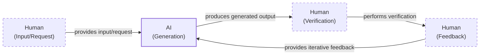
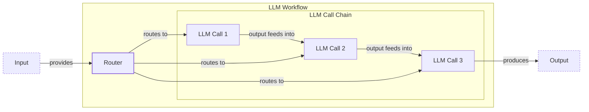
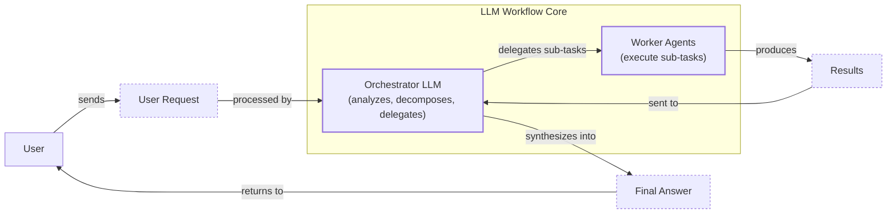
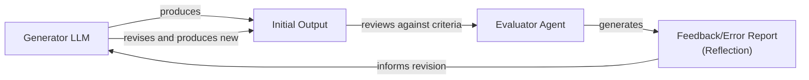
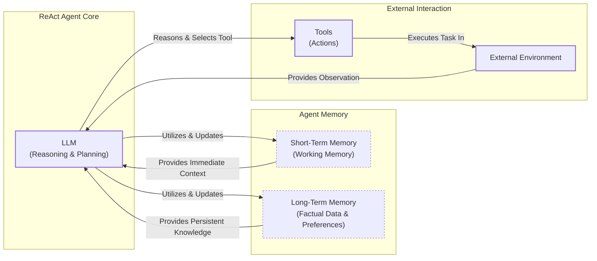
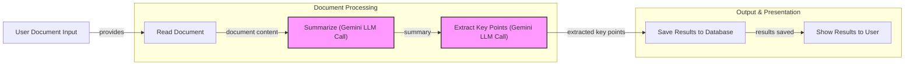
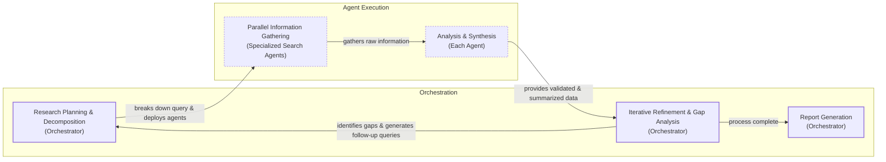

# Lesson 2: AI Agents vs. LLM Workflows

## Introduction: The Critical Decision Every AI Engineer Faces

As an AI engineer preparing to build your first real AI application, after narrowing down the problem you want to solve, one key decision is how to design your AI solution. Should it follow a predictable, step-by-step workflow, or does it demand a more autonomous approach, where the LLM makes self-directed decisions along the way? This fundamental question will determine the success or failure of your project: How should you architect your AI system?

When building AI applications, engineers face this critical architectural decision early in their development process. Should you create a predictable, step-by-step workflow where you control every action, or should you build an autonomous agent that can think and decide for itself? This is one of the key decisions that will impact everything from development time and costs to reliability and user experience.

Choose the wrong approach, and you might end up with an overly rigid system that breaks when users deviate from expected patterns or developers try to add new features. You could also build an unpredictable agent that works brilliantly 80% of the time but fails catastrophically when it matters most, leading to inconsistent results and a loss of user trust. This can lead to months of wasted development time rebuilding the entire architecture, frustrated users who cannot rely on the application, and executives who cannot afford to keep the system running due to spiraling costs [[1]](https://towardsdatascience.com/a-developers-guide-to-building-scalable-ai-workflows-vs-agents/).

In 2024-2025, billion-dollar AI startups succeed or fail based primarily on this architectural decision. The most successful teams and AI engineers know when to use workflows versus agents and, more importantly, how to combine both approaches effectively. They understand that the choice is not about picking the most advanced technology, but the right one for the job.

By the end of this lesson, we will provide you with a framework to choose the right architecture for your needs. You will understand the fundamental trade-offs between control and autonomy, see real-world examples from leading AI companies, and learn how to design systems that combine the strengths of both approaches.

## Understanding the Spectrum: From Workflows to Agents

To start, we will take a brief look at what LLM workflows and AI agents are. We will focus on their properties and how they are used, rather than their technical specifics.

An LLM workflow is a sequence of tasks involving LLM calls or other operations, such as reading or writing data. It is largely predefined and orchestrated by developer-written code. The steps are defined in advance, resulting in deterministic or rule-based paths with predictable execution and explicit control flow. Think of it as a factory assembly line, where each station performs a specific, repeatable task [[2]](https://decodingml.substack.com/p/llmops-for-production-agentic-rag), [[3]](https://www.anthropic.com/engineering/building-effective-agents). In future lessons, we will explore specific workflow patterns like chaining, routing, and the orchestrator-worker model.

https://storage.googleapis.com/gweb-cloudblog-publish/images/map-reduce-summary.max-1900x1900.png
Image 1: A map-reduce workflow for document summarization, where sections are processed in parallel and then combined. (Source [Google Cloud [[14]](https://cloud.google.com/blog/products/ai-machine-learning/long-document-summarization-with-workflows-and-gemini-models)])

On the other hand, AI agents are systems where an LLM plays a central role in dynamically deciding the sequence of steps, reasoning, and actions to achieve a goal [[5]](https://cloud.google.com/discover/what-are-ai-agents). The steps are not defined in advance but are planned based on the task and the current state of the environment. This makes them adaptive and capable of handling novelty, with the LLM driving autonomy in decision-making. You can think of an AI agent as a skilled human expert who is solving a problem without a predefined script, adapting on the fly after each new discovery. We will cover the core components of agents, such as tools, memory, and the ReAct pattern, in later lessons.

Both workflows and agents require an orchestration layer, but its nature differs. In workflows, this layer executes a defined plan. In agents, it facilitates the LLM's dynamic planning and execution. This distinction between developer-defined logic and LLM-driven autonomy is the core of the architectural choice you will face. While a simple workflow might involve a few LLM calls, an agent represents a more complex system with a reasoning loop, memory, and the ability to interact with its environment through tools [[4]](https://unit42.paloaltonetworks.com/agentic-ai-threats/).

https://unit42.paloaltonetworks.com/wp-content/uploads/2025/04/word-image-146340-140037-2.png
Image 2: An investment advisory assistant with three cooperating agents: orchestration, news, and stock. (Source [Unit 42 (Palo Alto Networks) [[4]](https://unit42.paloaltonetworks.com/agentic-ai-threats/)])

## Choosing Your Path

In the previous section, we defined LLM workflows and AI agents independently. Now, we will explore their core differences: developer-defined logic versus LLM-driven autonomy in reasoning and action selection.

Workflows are best suited for tasks where the structure is well-defined. This includes pipelines for data extraction and transformation, automated report or email generation, and repetitive daily tasks like sending emails or posting social media updates. Their primary strength lies in their predictability and reliability. Because the paths are fixed, they are easier to debug, and their operational costs and latency are more predictable. This makes them ideal for enterprise environments, regulated fields like finance and healthcare, and MVPs that require rapid deployment [[1]](https://towardsdatascience.com/a-developers-guide-to-building-scalable-ai-workflows-vs-agents/). However, they can be rigid and may require significant development time to handle new scenarios.

Agents, in contrast, excel at open-ended research, dynamic problem-solving like debugging code, and interactive task completion in unfamiliar environments. Their main advantage is their adaptability. They can handle ambiguity and complexity by making decisions on the fly. However, this non-determinism makes them more prone to errors, and their performance, latency, and costs can vary with each call. Research shows this is highly contingent on the task structure. For parallelizable tasks like financial analysis, multi-agent systems can improve performance by over 80%. However, for tasks requiring sequential reasoning, like in the game PlanCraft, every multi-agent variant tested degraded performance by 39% to 70% [[19]](https://arxiv.org/html/2512.08296v1).

Furthermore, there appears to be a "capability ceiling": once a single agent's performance on a task exceeds roughly 45% accuracy, adding more agents often yields diminishing or even negative returns as coordination costs outweigh the benefits [[19]](https://arxiv.org/html/2512.08296v1). Agents often require larger, more expensive models and more LLM calls to complete a task, which can increase costs. They also introduce security concerns and are harder to debug and evaluate [[4]](https://unit42.paloaltonetworks.com/agentic-ai-threats/), [[6]](https://arxiv.org/html/2510.25423v2). Since you hand over control to a reasoning loop, it is difficult to predict how many steps an agent will take, how many tools it will call, or how long it will "think" before returning an answer. Without real-time cost tracking and budget limits, you are just one prompt away from a very expensive mistake [[1]](https://towardsdatascience.com/a-developers-guide-to-building-scalable-ai-workflows-vs-agents/).

Most real-world systems, however, are not a binary choice but a blend of both. They exist on a spectrum, a gradient between workflows and agents, adopting the best of both worlds. This often involves partitioning workloads: using centralized workflows for complex computations and decentralized agents for real-time tasks like customer support [[20]](https://agenticaiguide.ai/ch_3/sec_3-2.html). When building an application, you often have an "autonomy slider," allowing you to decide how much control to give the LLM versus the user [[7]](https://www.youtube.com/watch?v=LCEmiRjPEtQ). For example, the coding assistant Cursor offers different levels of autonomy, from simple tab-completion (low autonomy) to letting the AI refactor an entire repository (high autonomy) [[8]](https://singjupost.com/andrej-karpathy-software-is-changing-again/). Similarly, Perplexity provides a slider from "search" to "deep research," giving the user control over the depth and autonomy of the research process [[8]](https://singjupost.com/andrej-karpathy-software-is-changing-again/).

https://i.ytimg.com/vi/LCEmiRjPEtQ/maxresdefault.jpg
Image 3: The Iron Man suit analogy illustrates the autonomy slider, from human-driven augmentation to a fully autonomous agent. (Source [Andrej Karpathy [[7]](https://www.youtube.com/watch?v=LCEmiRjPEtQ)])

The ultimate goal is to speed up the AI generation and human verification loop. This is often achieved through a well-designed architecture and a user-friendly interface that allows for human oversight. This is especially true in high-stakes domains like cancer research, where frameworks deliberately use human review checkpoints to prevent catastrophic errors like hallucinations [[21]](https://www.nature.com/articles/s41591-026-04357-y).

Image 4: A flowchart illustrating the iterative AI generation and human verification loop, emphasizing roles and efficiency.

## Exploring Common Patterns

To introduce you to the world of AI engineering, we will present the most common patterns used to build AI agents and LLM workflows. These are high-level concepts to build your intuition, and we will dive into the details in future lessons.

### LLM Workflows

LLM workflows are structured processes that use one or more LLM calls to complete a task. Here are a few common patterns:

**Chaining and routing** automate multiple LLM calls by linking them together. This pattern helps glue together different steps and allows the system to decide between multiple appropriate options based on the input. For example, a customer support workflow might first use an LLM to classify an incoming message and then route it to a specialized sub-workflow for billing, technical support, or general inquiries [[3]](https://www.anthropic.com/engineering/building-effective-agents), [[9]](https://mirascope.com/blog/llm-chaining). This approach is predictable and easy to debug, as each step has a defined role in a clear, linear sequence. It works well when tasks can be broken down into smaller, ordered sub-tasks, but it lacks the flexibility to handle conditional logic or adaptive sequencing [[27]](https://mlpills.substack.com/p/issue-110-llm-workflow-patterns).

Image 5: A flowchart illustrating the LLM workflow pattern of Chaining and Routing.

The **orchestrator-worker** pattern is used to understand user intent, dynamically plan and call multiple actions, and synthesize the results into a final answer [[10]](https://online.stevens.edu/blog/building-self-healing-ai-orchestrator-reflexion-patterns/). A central orchestrator LLM breaks down a complex task and delegates sub-tasks to specialized worker agents [[11]](https://mlpills.substack.com/p/diy-17-orchestrator-worker-llm-agent). This pattern is common in multi-agent systems, which can be designed with different communication topologies, such as centralized (hub-and-spoke), decentralized (peer-to-peer), or hybrid models [[19]](https://arxiv.org/html/2512.08296v1). For example, multi-agent frameworks in finance often assign roles like "analyst," "trader," and "risk manager" to different agents that collaborate to make decisions [[22]](https://arxiv.org/html/2510.23032v1). However, simply adding more agents is not always better. Research shows that multi-agent systems often experience diminishing returns, with performance plateauing around 4-8 agents, after which coordination overhead outweighs the benefits of adding more workers [[23]](https://arxiv.org/html/2602.03794v1). This allows the system to dynamically decide what actions to take, making it a smooth transition from rigid workflows to more flexible, agentic systems.

Image 6: A flowchart illustrating the Orchestrator-Worker pattern for LLM workflows.

The **evaluator-optimizer loop** is a pattern used to auto-correct the results from an LLM based on automated feedback [[12]](https://docs.aws.amazon.com/prescriptive-guidance/latest/agentic-ai-patterns/evaluator-reflect-refine-loop-patterns.html). LLM outputs can be drastically improved by providing feedback on what they did wrong. This pattern automates that process by having an "LLM reviewer" that analyzes the output from the generator LLM, creates an error report (also known as a reflection), and passes it back to the generator to auto-correct itself [[13]](https://sebgnotes.substack.com/p/evaluator-optimizer-llm-workflow). This is similar to how a human writer refines a document based on feedback from an editor. This iterative process continues until the output meets predefined criteria or a retry limit is reached, enabling self-assessment and refinement without human intervention [[12]](https://docs.aws.amazon.com/prescriptive-guidance/latest/agentic-ai-patterns/evaluator-reflect-refine-loop-patterns.html).

Image 7: A flowchart illustrating the Evaluator-Optimizer loop for LLM auto-correction.

### Core Components of a ReAct AI Agent

The ReAct (Reason and Act) pattern is fundamental to modern AI agents. It enables an agent to automatically decide what action to take, interpret the output of that action, and repeat the process until the given task is completed. This pattern is the core of how agents interact with their environment and achieve their goals.

A ReAct agent typically consists of a few key components. An LLM is used to take actions and interpret outputs from external tools. These tools are the actions the agent can perform within its environment, which we will cover in more detail in Lesson 6. When an LLM selects a tool, it engages in a behavior called function calling. This extends its capabilities beyond text generation, allowing it to interact with external resources like APIs, web browsers, or code interpreters to access real-time data or affect its environment [[24]](https://weaviate.io/blog/what-are-agentic-workflows). Short-term memory serves as the agent's working memory, similar to RAM in a computer, holding information for the current task. Long-term memory is used to access factual data about the external world and remember user preferences, a topic we will explore in Lesson 9. Almost all modern agents in the industry use the ReAct pattern, as it has shown the most potential for building capable and autonomous systems. We will explain this pattern in detail in Lessons 7 and 8.

Image 8: A high-level flowchart illustrating the core components and dynamics of a ReAct AI agent.

## Zooming In on Our Favorite Examples

To better anchor you in the world of LLM workflows and AI agents, we will now introduce some concrete examples, from a simple workflow to a single-agent system and a more advanced hybrid solution.

### Document Summarization and Analysis Workflow by Gemini in Google Workspace

When working in teams, finding the right document can be a time-consuming process. Many documents are large, making it hard to quickly understand which one contains the information you need. A quick, embedded summarization can guide your search and improve efficiency.

The document summarization feature in Google Workspace is a pure and simple workflow. It follows a chain of multiple LLM calls to process a document [[14]](https://cloud.google.com/blog/products/ai-machine-learning/long-document-summarization-with-workflows-and-gemini-models). First, the system reads the document. Then, it uses an LLM call to summarize it. Another LLM call extracts key points. Finally, the results are saved and shown to the user. This is a great example of a map-reduce approach, where a long document is split into smaller sections, each summarized in parallel, with a final summary created from all the smaller summaries [[14]](https://cloud.google.com/blog/products/ai-machine-learning/long-document-summarization-with-workflows-and-gemini-models). This parallel execution makes the process much faster than a sequential approach. The workflow is triggered when a new document is added to a Cloud Storage bucket, and it uses a subworkflow to make calls to the Gemini 1.0 Pro model.

Image 9: A flowchart illustrating a simple LLM workflow for document summarization and analysis using Gemini in Google Workspace.

### Gemini CLI Coding Assistant

Writing code is a time-consuming process that often involves reading boring documentation or outdated blogs. When working on new codebases, understanding them is a slow process. A coding assistant can help you write code faster on both existing and new codebases. The Gemini CLI is an open-source AI agent that brings the power of Gemini directly into your terminal [[15]](https://blog.google/technology/developers/introducing-gemini-cli-open-source-ai-agent/). It uses the ReAct agent architecture to implement a single-agent system for coding [[16]](https://developers.google.com/gemini-code-assist/docs/gemini-cli).

Based on our latest research from August 2025, the Gemini CLI works as follows. First, it gathers context by loading the directory structure, available tools, and conversation history. The Gemini model then analyzes the user input to plan the actions required to adapt the code. Before executing, it validates the plan with the user. The selected actions, or tools, are then executed. These can include file operations, web requests for documentation, or code generation. The results are added to the conversation context for future reference. The agent then evaluates the generated code by running or compiling it. Finally, it decides whether the task is complete or if it needs to repeat the process. This iterative loop of reasoning and acting allows the agent to handle complex coding tasks, from fixing bugs to creating new features, all within the developer's terminal [[16]](https://developers.google.com/gemini-code-assist/docs/gemini-cli). The tool is highly extensible, supporting custom integrations through the Model Context Protocol (MCP) and allowing for project-specific instructions via `GEMINI.md` files [[28]](https://geminicli.com/docs/cli/gemini-md/).

```mermaid
flowchart LR
  %% Gemini CLI Coding Assistant Operational Loop (ReAct Pattern)

  A["Context Gathering<br/>(Load directory, tools, history)"]
  B["LLM Reasoning<br/>(Analyze input, plan actions)"]
  C["Human in the Loop<br/>(Plan validation)"]
  D["Tool Execution<br/>(Perform selected actions)"]
  E["Evaluation<br/>(Run/compile code)"]
  F{"Loop Decision"}
  G["Completed"]

  %% Flow of operations
  A -- "provides state" --> B
  B -- "generates plan" --> C
  C -- "validated plan" --> D
  D -- "tool outputs" --> E
  E -- "evaluation results" --> F
  F -- "Task Completed" --> G
  F -- "Iterate" --> B

  %% Visual grouping
  classDef mainProcess stroke-width:2px
  classDef decisionNode stroke-dasharray:5,5
  classDef endNode stroke-width:3px
  class A,B,C,D,E mainProcess
  class F decisionNode
  class G endNode
```

Image 10: A flowchart illustrating the operational loop of the Gemini CLI coding assistant, which implements the ReAct pattern.

### Perplexity Deep Research

Researching a new topic can be daunting. Often, we do not know where to start. A research assistant that can quickly scan the internet and compile a report can be a huge boost to your learning process. Perplexity's Deep Research agent is a hybrid system that combines ReAct reasoning with LLM workflow patterns to perform autonomous research at an expert level [[17]](https://www.perplexity.ai/hub/blog/introducing-perplexity-deep-research).

Unlike single-agent approaches, this system uses multiple specialized agents orchestrated in parallel by workflows. It performs dozens of searches across hundreds of sources to synthesize comprehensive research reports in just a few minutes [[17]](https://www.perplexity.ai/hub/blog/introducing-perplexity-deep-research). This multi-agent design aligns with research on collaborative AI, which suggests that systems can see diminishing returns as more agents are added. By using a limited number of specialized agents, the system can avoid the excessive coordination overhead that can plague larger teams, with studies suggesting performance often plateaus beyond 4-8 agents [[23]](https://arxiv.org/html/2602.03794v1). While the solution is closed-source, we can make some assumptions based on available information.

The process likely begins with the orchestrator analyzing the research question and breaking it down into targeted sub-questions. It then deploys multiple specialized search agents in parallel, each focused on a single sub-question. These agents use tools like web searches and document retrieval to gather information. After collecting sources, each agent validates and scores them for relevance and credibility. The orchestrator then gathers the information from all agents and identifies any knowledge gaps. It generates follow-up queries and repeats the process until all gaps are filled or a maximum number of steps is reached. Finally, the orchestrator combines the results from all agents into a final report with inline citations. This iterative process of searching, reading, and reasoning allows the agent to refine its research plan as it learns more, much like a human expert would [[17]](https://www.perplexity.ai/hub/blog/introducing-perplexity-deep-research).

Image 11: A flowchart illustrating the iterative multi-step process of Perplexity's Deep Research agent.

## The Challenges of Every AI Engineer

Now that you understand the spectrum from LLM workflows to AI agents, it is important to recognize that every AI engineer faces these same fundamental challenges when designing a new AI application. These core decisions determine whether your AI application succeeds in production or fails spectacularly.

Every AI engineer battles a set of daily challenges. Reliability is a major one; an agent that works perfectly in demos can become unpredictable with real users [[6]](https://arxiv.org/html/2510.25423v2). Research has quantified this: independent multi-agent systems can amplify errors by over 17 times compared to a single-agent baseline due to unchecked error propagation, while even centralized systems with a verification layer can amplify errors by more than 4 times [[19]](https://arxiv.org/html/2512.08296v1). This makes observability a unique challenge, as traditional monitoring tools cannot explain why an agent decided to loop through a tool call 14 times or burn thousands of tokens to summarize a single paragraph [[1]](https://towardsdatascience.com/a-developers-guide-to-building-scalable-ai-workflows-vs-agents/).

Context limits are another issue, as systems can struggle to maintain coherence across long conversations. Integrating data from various sources while ensuring quality is a constant struggle, as is balancing the cost-performance trap of sophisticated but expensive agents. Finally, security concerns are always present, especially with autonomous agents that have powerful write permissions [[4]](https://unit42.paloaltonetworks.com/agentic-ai-threats/), [[18]](https://www.cyberark.com/resources/blog/the-agentic-ai-revolution-5-unexpected-security-challenges). These are not just theoretical problems; they are the day-to-day reality of building with AI.

These challenges are solvable. In upcoming lessons, we will cover patterns for building reliable products through specialized evaluation and monitoring pipelines, strategies for building hybrid systems, and ways to keep costs and latency under control. We will start in the next lesson by looking at structured outputs, a key technique for ensuring reliable communication between LLMs and your application code. We will also explore actions, memory, and advanced RAG techniques in future lessons.

## Conclusion

By the end of this course, you will have the knowledge to architect AI systems that are powerful, robust, and efficient. You will know when to use workflows versus agents and how to build effective hybrid systems. The field is also moving toward agentic systems that can understand not just text, but also images, audio, and video, and operate within "autonomous enterprises" where work happens between coordinated agents, not just between a human and a single AI [[25]](https://www.clarifai.com/blog/llms-and-ai-trends), [[26]](https://www.designative.info/2026/03/23/beyond-the-conversation-trap-designing-for-hybrid-human-agent-interaction-modes/).

## References

- [1] https://towardsdatascience.com/a-developers-guide-to-building-scalable-ai-workflows-vs-agents/
- [2] https://decodingml.substack.com/p/llmops-for-production-agentic-rag
- [3] https://www.anthropic.com/engineering/building-effective-agents
- [4] https://unit42.paloaltonetworks.com/agentic-ai-threats/
- [5] https://cloud.google.com/discover/what-are-ai-agents
- [6] https://arxiv.org/html/2510.25423v2
- [7] https://www.youtube.com/watch?v=LCEmiRjPEtQ
- [8] https://singjupost.com/andrej-karpathy-software-is-changing-again/
- [9] https://mirascope.com/blog/llm-chaining
- [10] https://online.stevens.edu/blog/building-self-healing-ai-orchestrator-reflexion-patterns/
- [11] https://mlpills.substack.com/p/diy-17-orchestrator-worker-llm-agent
- [12] https://docs.aws.amazon.com/prescriptive-guidance/latest/agentic-ai-patterns/evaluator-reflect-refine-loop-patterns.html
- [13] https://sebgnotes.substack.com/p/evaluator-optimizer-llm-workflow
- [14] https://cloud.google.com/blog/products/ai-machine-learning/long-document-summarization-with-workflows-and-gemini-models
- [15] https://blog.google/technology/developers/introducing-gemini-cli-open-source-ai-agent/
- [16] https://developers.google.com/gemini-code-assist/docs/gemini-cli
- [17] https://www.perplexity.ai/hub/blog/introducing-perplexity-deep-research
- [18] https://www.cyberark.com/resources/blog/the-agentic-ai-revolution-5-unexpected-security-challenges
- [19] https://arxiv.org/html/2512.08296v1
- [20] https://agenticaiguide.ai/ch_3/sec_3-2.html
- [21] https://www.nature.com/articles/s41591-026-04357-y
- [22] https://arxiv.org/html/2510.23032v1
- [23] https://arxiv.org/html/2602.03794v1
- [24] https://weaviate.io/blog/what-are-agentic-workflows
- [25] https://www.clarifai.com/blog/llms-and-ai-trends
- [26] https://www.designative.info/2026/03/23/beyond-the-conversation-trap-designing-for-hybrid-human-agent-interaction-modes/
- [27] https://mlpills.substack.com/p/issue-110-llm-workflow-patterns
- [28] https://geminicli.com/docs/cli/gemini-md/