# AI Agents vs. LLM Workflows: The First Decision You'll Make

## Introduction: The Critical Decision Every AI Engineer Faces

As an AI engineer preparing to build your first real AI application, after narrowing down the problem you want to solve, one key decision is how to design your AI solution. Should it follow a predictable, step-by-step workflow, or does it demand a more autonomous approach, where the LLM makes self-directed decisions along the way? Thus, one of the fundamental questions that will determine the success or failure of your project is: How should you architect your AI system?

When building AI applications, you face this critical architectural decision early in the development process. This choice will impact everything from development time and costs to reliability and user experience. Choose the wrong approach, and you might end up with an overly rigid system that breaks when users deviate from expected patterns, or an unpredictable agent that works brilliantly 80% of the time but fails catastrophically when it matters most. You could waste months of development time rebuilding the entire architecture, leaving you with frustrated users and executives who cannot afford to keep the system running due to spiraling costs [[3]](https://towardsdatascience.com/a-developers-guide-to-building-scalable-ai-workflows-vs-agents/).

In 2024 and 2025, we have seen billion-dollar AI startups succeed or fail based primarily on this architectural decision. The most successful AI engineers and teams know when to use workflows versus agents and, more importantly, how to combine both approaches effectively. They understand that the choice is not a binary one between rigid control and total autonomy. Instead, it is about finding the right point on a spectrum to solve a specific problem. This lesson will provide a framework to help you make this architectural choice.

By the end of this lesson, you will understand the fundamental trade-offs between LLM workflows and AI agents. We will explore use cases where each approach is most effective, see real-world examples from leading AI companies, and learn how to design systems that leverage the best of both worlds.

## Understanding the Spectrum: From Workflows to Agents

To choose between workflows and agents, you need a clear understanding of what they are. We will not focus on the technical specifics yet, but rather on their core properties and how they are used.

An **LLM workflow** is a sequence of tasks involving LLM calls or other operations, such as reading from or writing to a database. It is largely predefined and orchestrated by developer-written code. The steps are defined in advance, resulting in deterministic or rule-based paths with predictable control flow. Think of it as a factory assembly line, where each station performs a specific, repeatable task in a set order [[26]](https://www.anthropic.com/engineering/building-effective-agents), [[2]](https://decodingml.substack.com/p/llmops-for-production-agentic-rag). This concept has deep roots in traditional software and data engineering, evolving from early schedulers like cron and 1990s proprietary tools to modern, open-source orchestrators that use Directed Acyclic Graphs (DAGs) to manage complex dependencies [[55]](https://www.prefect.io/blog/brief-history-of-workflow-orchestration).

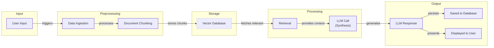
Image 1: A flowchart illustrating a simple LLM Workflow.

**AI agents**, on the other hand, are systems where an LLM plays a central role in dynamically deciding the sequence of steps, reasoning, and actions to achieve a goal [[25]](https://cloud.google.com/discover/what-are-ai-agents). The steps are not defined in advance but are planned based on the task and the current state of the environment. This approach is adaptive and capable of handling novelty, with the LLM driving its own decision-making. Think of an agent as a skilled human expert tackling an unfamiliar problem, adapting their approach with each new piece of information [[26]](https://www.anthropic.com/engineering/building-effective-agents). An agent typically combines the LLM's reasoning with memory and a set of tools it can use to interact with the world, such as searching the web or querying a database [[14]](https://decodingml.substack.com/p/stop-building-ai-agents).

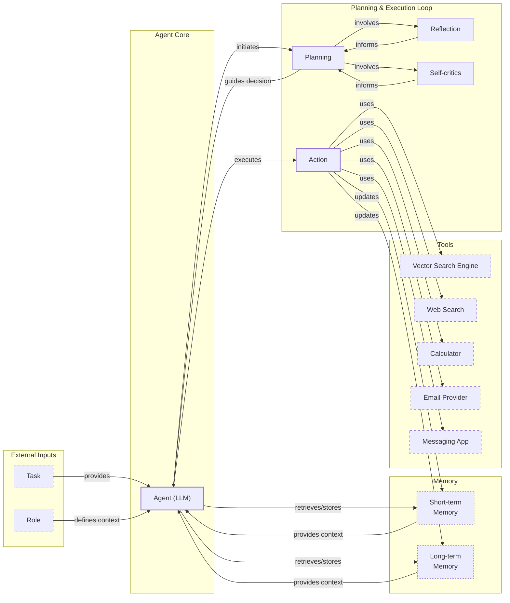
Image 2: A diagram illustrating a simple Agentic System. (Source [14](https://decodingml.substack.com/p/stop-building-ai-agents))

Both workflows and agents require an orchestration layer, but its nature differs. In a workflow, the orchestration layer executes a developer-defined plan. In an agent, it facilitates the LLM's dynamic planning and execution. In future lessons, we will explore specific patterns for building these systems, including chaining, routing, tools, and memory.

## Choosing Your Path

Now that we have defined LLM workflows and AI agents, let's explore their core difference: developer-defined logic versus LLM-driven autonomy in reasoning and action selection. This distinction creates a spectrum between reliability and flexibility.

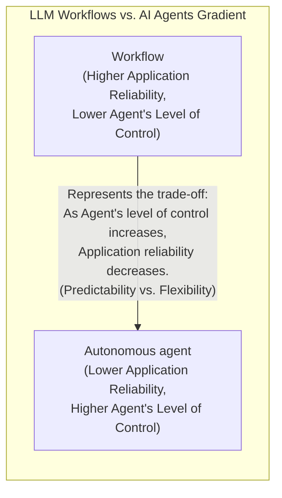
Image 3: A diagram illustrating the gradient between LLM Workflows and AI Agents, showing the trade-off between application reliability and agent's level of control. (Source [16](https://decodingml.substack.com/p/llmops-for-production-agentic-rag))

### When to use LLM workflows

Workflows are best suited for tasks with a well-defined structure. This includes pipelines for data extraction, automated report generation, supply chain optimization for tasks like dynamic route planning [[56]](https://kodexolabs.com/top-ai-agents-supply-chain-logistics/), and repetitive daily tasks like sending emails or social media updates. Their strength lies in predictability and reliability, making them easier to debug and manage. Costs and latency are also more predictable, as you can often use smaller, specialized models for each sub-task. This makes workflows ideal for enterprise environments or regulated fields like finance and healthcare, where consistent, accurate results are non-negotiable [[3]](https://towardsdatascience.com/a-developers-guide-to-building-scalable-ai-workflows-vs-agents/). Even in these domains, however, the lines are blurring. Patterns from robotics are inspiring more adaptive, multi-step workflows for complex tasks like patient services, blending structured execution with dynamic, agent-like decision-making [[57]](https://www.nature.com/articles/s44387-026-00076-4).

However, workflows can be rigid. They require more development time to engineer each step manually and cannot easily handle unexpected scenarios. As an application grows, adding new features can become complex, much like traditional software development.

### When to use AI agents

AI agents excel in scenarios that demand adaptability and dynamic problem-solving. This includes open-ended research, complex customer support, and interactive tasks in unfamiliar environments, like booking a flight without a predefined list of websites. The agent’s ability to reason and plan its own steps makes it powerful for handling ambiguity.

This flexibility comes at a cost. Agents are more prone to errors and non-deterministic behavior, making performance, latency, and costs vary with each run. They often require larger, more expensive models to generalize effectively. Security is also a major concern, as an autonomous agent with write permissions could potentially delete data or send inappropriate communications. Debugging and evaluating agents is notoriously difficult [[3]](https://towardsdatascience.com/a-developers-guide-to-building-scalable-ai-workflows-vs-agents/). Some developers have even joked about their code being deleted by an agent, saying, "Anyway, I wanted to start a new project."

### Hybrid Approaches

Most real-world systems are a hybrid, blending elements of both workflows and agents. This creates a spectrum where you can decide how much control to give the LLM versus the user. Andrej Karpathy introduced the concept of an "autonomy slider," a design pattern that lets users adjust the level of AI autonomy [[4]](https://www.youtube.com/watch?v=LCEmiRjPEtQ).

For example, the coding assistant Cursor offers different levels of control. You can use simple tab-completion (low autonomy), ask the AI to edit a specific block of code with `Cmd+K`, change an entire file with `Cmd+L`, or give it full control over the repository with `Cmd+I` (high autonomy) [[10]](https://www.linkedin.com/posts/markbarbir_andrej-karpathys-latest-talk-describes-our-activity-7343449417426837505-oTFx). Similarly, Perplexity allows you to choose between a simple `search`, a multi-step `research` process, or an in-depth `deep research` report, each granting the AI progressively more autonomy [[11]](https://andrewships.substack.com/p/autonomy-sliders).

The ultimate goal is to create an efficient loop between AI generation and human verification. A well-designed architecture, combined with a thoughtful UI/UX, allows the human to supervise the AI, catch errors, and provide feedback, making the entire system faster and more reliable [[4]](https://www.youtube.com/watch?v=LCEmiRjPEtQ).

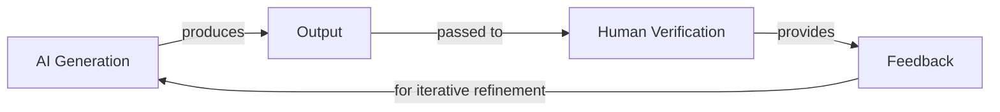
Image 4: A circular flowchart illustrating the AI Generation and Human Verification Loop, emphasizing human supervision and iterative refinement for efficiency.

## Exploring Common Patterns

To build effective AI systems, it helps to understand the common architectural patterns that engineers use. These patterns provide a blueprint for structuring both workflows and agents. For now, we will introduce them at a high level to build intuition; we will dive into the technical details in future lessons.

### Chaining and Routing

This is a foundational workflow pattern used to automate a sequence of LLM calls. **Chaining** connects multiple steps, where the output of one LLM call becomes the input for the next. This is useful for tasks that can be broken down into a linear sequence, like summarizing a document and then translating the summary. This approach improves transparency and makes it easier to debug problems, as you can analyze performance at each stage [[24]](https://www.promptingguide.ai/techniques/prompt_chaining). **Routing** adds conditional logic, allowing the workflow to choose between different paths based on the input. For example, a customer support system could route a query to a "billing" or "technical support" chain based on its content [[21]](https://mlpills.substack.com/p/issue-110-llm-workflow-patterns).

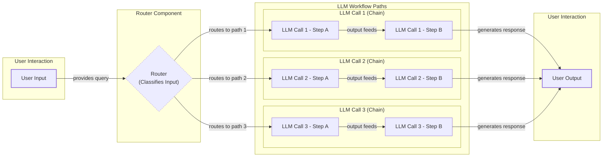
Image 5: A flowchart illustrating the Chaining and Routing pattern in LLM workflows, showing user input, a router, multiple LLM call chains, and user output.

### Orchestrator-Worker

This pattern provides a smooth transition from rigid workflows to more dynamic, agent-like behavior. A central "orchestrator" LLM acts as a project manager, analyzing a user's intent, breaking the task into smaller sub-tasks, and delegating them to specialized "worker" agents or models. The orchestrator then synthesizes the results into a final answer. This separation of concerns allows the system to dynamically decide which actions to take and even execute them in parallel, without giving up full control to a single autonomous agent [[25]](https://online.stevens.edu/blog/building-self-healing-ai-orchestrator-reflexion-patterns/).

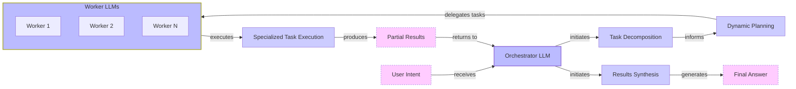
Image 6: An architecture diagram illustrating the Orchestrator-Worker pattern.

### Evaluator-Optimizer Loop

LLM outputs can be significantly improved by providing feedback. This pattern automates that process by creating a self-correction loop. A "generator" LLM produces an initial response. Then, a second "evaluator" LLM reviews the output against a set of criteria and generates an error report, also known as a reflection. This feedback is passed back to the generator, which revises its output. This loop continues until the response meets the required standard, much like a human writer refines a document based on an editor's comments [[30]](https://docs.aws.amazon.com/prescriptive-guidance/latest/agentic-ai-patterns/evaluator-reflect-refine-loop-patterns.html). For tasks like code generation, the evaluation can be even more objective by using external feedback, such as running the generated code against unit tests and feeding the results back to the model [[32]](https://vadim.blog/the-research-on-llm-self-correction).

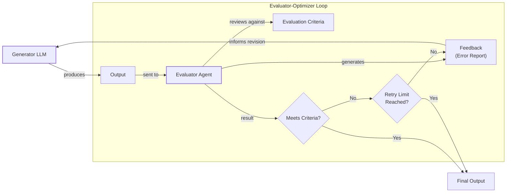
Image 7: A flowchart illustrating the Evaluator-Optimizer Loop pattern for automated LLM result correction.

### The ReAct Pattern

The ReAct (Reason and Act) pattern is the engine behind most modern AI agents. It enables an agent to automatically decide what action to take, interpret the output of that action, and repeat the cycle until a task is complete. The core components are:
*   An **LLM** to reason about the task and decide on the next action.
*   A set of **tools** (or actions) that allow the agent to interact with its external environment, like searching the web or accessing a database.
*   **Memory** to store information from past steps. This includes short-term working memory (like a computer's RAM) and long-term memory for factual data and user preferences.

In each step of the loop, the agent reasons about the task, selects a tool, executes it, and observes the result. This new information is added to its memory, and the cycle begins again. We will explore this pattern in detail in future lessons.

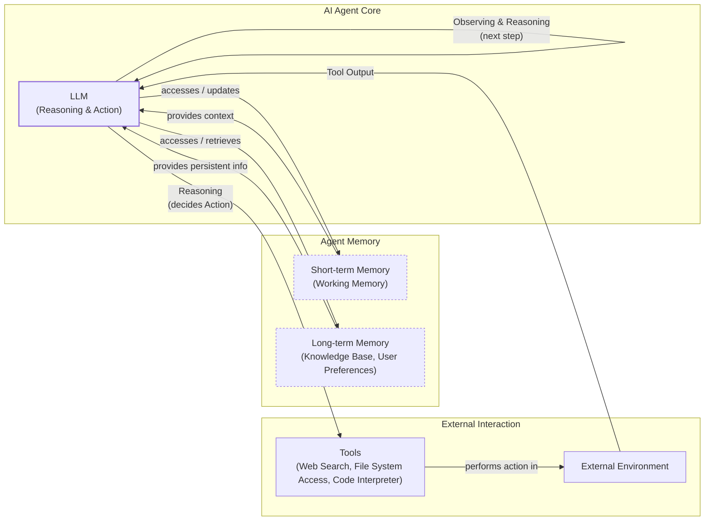
Image 8: A high-level architecture diagram illustrating the core components and dynamics of an AI agent using the ReAct pattern.

## Zooming In on Our Favorite Examples

To ground these concepts in reality, let's analyze a few state-of-the-art examples, moving from a simple workflow to a complex hybrid system. We will keep the explanations high-level, as you only have the context from this lesson so far.

### Simple Workflow: Gemini's Document Summarization

When you are working in a team, finding the right document can be time-consuming, especially with large files. A quick, embedded summary can guide your search and save valuable time. Google's document summarization feature in Workspace is a perfect example of a pure, multi-step workflow [[1]](https://support.google.com/docs/answer/15627020?hl=en).

The process follows a map-reduce pattern, which is well-suited for long documents that exceed an LLM's context window. Here is how it works:
1.  The system reads the long document and splits it into smaller, manageable chunks.
2.  It calls an LLM to summarize each chunk in parallel. This "map" step is much faster than processing the chunks sequentially.
3.  It then takes all the chunk summaries and feeds them into a final LLM call to create a single, cohesive summary of the entire document. This is the "reduce" step.
4.  The result is saved and displayed to the user.

This is a simple, chained workflow with no agentic decision-making. Every step is predefined and executed in a predictable order, making it a reliable and efficient solution for a common business problem [[36]](https://cloud.google.com/blog/products/ai-machine-learning/long-document-summarization-with-workflows-and-gemini-models).

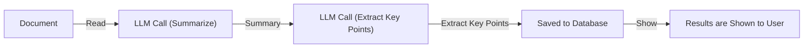
Image 9: A flowchart illustrating the "Document Summarization and Analysis Workflow by Gemini in Google Workspace".

### Single-Agent System: Gemini CLI

Writing code is a slow process that often involves reading dense documentation or trying to understand a new codebase. A coding assistant can dramatically speed up this process. The open-source Gemini CLI is a great example of a single-agent system built for coding, leveraging the ReAct pattern we discussed earlier [[5]](https://developers.google.com/gemini-code-assist/docs/gemini-cli).

Here is a high-level look at its operational loop:
1.  **Context Gathering:** The agent starts by loading its context, which includes the directory structure, a list of available tools (actions), and the conversation history. It can automatically detect project types by looking for files like `package.json` [[41]](https://medium.com/google-cloud/gemini-cli-tutorial-series-part-9-understanding-context-memory-and-conversational-branching-095feb3e5a43).
2.  **LLM Reasoning:** The Gemini model analyzes your request and the current context to form a plan of action.
3.  **Human in the Loop:** Before executing, it often asks for your approval, keeping you in control.
4.  **Tool Execution:** Once approved, it executes tools. These can include file system operations like `grep` to read specific functions, web requests to fetch documentation, or a code interpreter to generate and test code. The results are added back to its working memory.
5.  **Evaluation:** The agent can dynamically evaluate its work, for instance, by trying to compile or run the code it just wrote.
6.  **Loop Decision:** Based on the evaluation, the agent decides if the task is complete or if it needs to repeat the cycle to refine its solution.

This loop of reasoning, acting, and observing allows the Gemini CLI to perform complex coding tasks, from writing new features to debugging existing ones, all within your terminal.

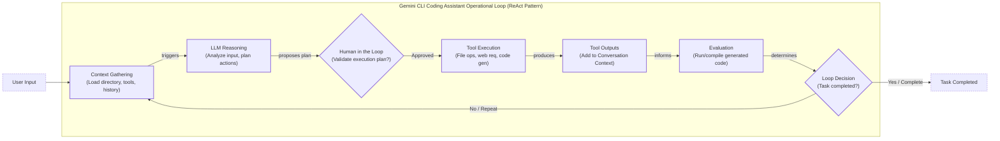
Image 10: A flowchart illustrating the operational loop of the "Gemini CLI Coding Assistant" based on the ReAct pattern.

### Hybrid System: Perplexity's Deep Research

Researching a new topic can be daunting. You often do not know where to start, and sifting through countless sources is time-consuming. A research assistant that can quickly scan the internet and synthesize a report is a powerful learning tool. Perplexity's Deep Research feature is a noteworthy hybrid system that combines structured workflows with autonomous agents to perform expert-level research [[8]](https://www.perplexity.ai/hub/blog/introducing-perplexity-deep-research).

While the exact implementation is closed-source, we can infer its architecture based on public information. It likely uses an orchestrator-worker pattern to manage multiple specialized agents in parallel. The process might look something like this:
1.  **Research Planning & Decomposition:** An orchestrator agent, likely a powerful model like Claude Opus, analyzes your research question and breaks it down into several targeted sub-questions [[6]](https://zenvanriel.com/ai-engineer-blog/perplexity-computer-multi-model-agent-orchestration/).
2.  **Parallel Information Gathering:** The orchestrator deploys multiple specialized search agents, each tasked with one sub-question. These agents work in parallel, using tools like web search to gather information from hundreds of sources. This isolation keeps each agent focused and efficient.
3.  **Analysis & Synthesis:** Each agent validates its sources for credibility and relevance, ranks them, and summarizes the top findings into a partial report.
4.  **Iterative Refinement & Gap Analysis:** The orchestrator collects the partial reports and analyzes them for knowledge gaps. If it finds missing information, it generates follow-up queries and repeats the process until the research is comprehensive or a step limit is reached [[8]](https://www.perplexity.ai/hub/blog/introducing-perplexity-deep-research).
5.  **Report Generation:** Finally, the orchestrator synthesizes all the information into a single, detailed report, complete with inline citations.

This hybrid approach leverages the strengths of both paradigms: the structured, parallel execution of a workflow combined with the dynamic, adaptive reasoning of autonomous agents.

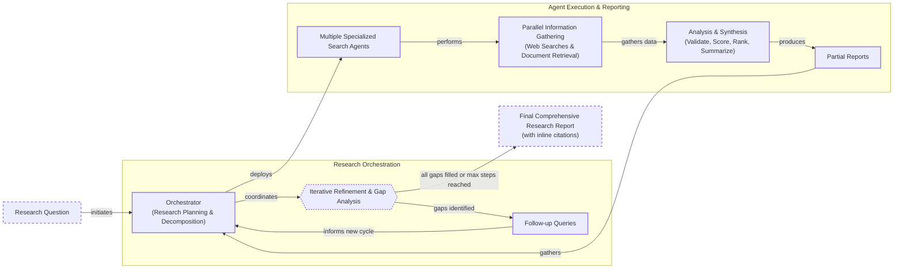
Image 11: Flowchart illustrating the iterative multi-step process of "Perplexity Deep Research Agent"

## The Challenges of Every AI Engineer

Now that you understand the spectrum from LLM workflows to AI agents, it is important to recognize that every AI engineer, whether at a startup or a Fortune 500 company, faces these same fundamental challenges. The architectural decisions you make will determine whether your AI application succeeds in production or fails spectacularly.

Building production-ready AI systems is a constant battle against a unique set of problems [[15]](https://arxiv.org/html/2510.25423v2):
*   **Reliability Issues:** An agent that works perfectly in a demo can become unpredictable with real users. In fact, some studies show that production AI agents can fail 70-95% of the time depending on task complexity [[58]](https://www.fiddler.ai/blog/ai-agent-failure-rate). LLM reasoning failures compound through multi-step processes; even with a 99% success rate per step, a 20-step agent will fail nearly one in five times [[59]](https://dev.to/wassimchegham/why-your-ai-agent-demo-falls-apart-in-production-1320). This leads to unexpected and costly outcomes.
*   **Context Limits:** As conversations grow longer, systems can lose track of their original purpose. This is a technical issue known as "context rot," where attention mechanisms in the LLM struggle with long inputs. Critical instructions can get buried or "lost-in-the-middle" of the context window, causing the agent to drift from its goal and make poor decisions [[60]](https://redis.io/blog/context-rot/). Maintaining consistent output quality across different agent specializations is a continuous challenge.
*   **Data Integration:** You need to build robust pipelines to pull information from various sources—like Slack, web APIs, and databases—while ensuring only high-quality data reaches your AI system. The "garbage-in, garbage-out" principle is unforgiving.
*   **Cost-Performance Trap:** Sophisticated agents can deliver impressive results but often come with a high price tag per user interaction, making them economically unfeasible for many applications.
*   **Security Concerns:** Autonomous agents with powerful write permissions are a significant risk. They could send incorrect emails, delete critical files, or expose sensitive data if not properly controlled [[16]](https://permiso.io/blog/8-critical-ai-security-challenges).

The good news is that these challenges are solvable. In upcoming lessons, we will cover patterns for building reliable products through specialized evaluation and monitoring pipelines. We will explore strategies for creating effective hybrid systems and methods for keeping costs and latency under control. In our next lesson, we will start with structured outputs, a key technique for building reliable workflows.

Your path forward as an AI engineer is about mastering these realities. By the end of this course, you will have the knowledge to architect AI systems that are not only powerful but also reliable, cost-effective, and secure. You will know when to use a workflow, when to deploy an agent, and how to build effective hybrid systems that work in real-world applications.

## References

- [1] [How does Gemini document summarization workflow operate in Google Workspace?](https://support.google.com/docs/answer/15627020?hl=en)
- [2] [Exploring the difference between agents and workflows](https://decodingml.substack.com/p/llmops-for-production-agentic-rag)
- [3] [A Developer’s Guide to Building Scalable AI: Workflows vs Agents](https://towardsdatascience.com/a-developers-guide-to-building-scalable-ai-workflows-vs-agents/)
- [4] [Andrej Karpathy: Software Is Changing (Again)](https://www.youtube.com/watch?v=LCEmiRjPEtQ)
- [5] [Gemini CLI](https://developers.google.com/gemini-code-assist/docs/gemini-cli)
- [6] [How does Perplexity Deep Research hybrid agent orchestrate parallel research?](https://zenvanriel.com/ai-engineer-blog/perplexity-computer-multi-model-agent-orchestration/)
- [7] [How does Perplexity Deep Research hybrid agent orchestrate parallel research?](https://www.gend.co/blog/perplexity-computer-ai-agent-orchestration)
- [8] [Introducing Perplexity Deep Research](https://www.perplexity.ai/hub/blog/introducing-perplexity-deep-research)
- [9] [What autonomy slider examples use Cursor and Perplexity in Karpathy talk?](https://medium.com/@ben_pouladian/andrej-karpathy-on-software-3-0-software-in-the-age-of-ai-b25533da93b6)
- [10] [What autonomy slider examples use Cursor and Perplexity in Karpathy talk?](https://www.linkedin.com/posts/markbarbir_andrej-karpathys-latest-talk-describes-our-activity-7343449417426837505-oTFx)
- [11] [Autonomy Sliders](https://andrewships.substack.com/p/autonomy-sliders)
- [12] [What autonomy slider examples use Cursor and Perplexity in Karpathy talk?](https://www.latent.space/p/s3)
- [13] [What autonomy slider examples use Cursor and Perplexity in Karpathy talk?](https://singjupost.com/andrej-karpathy-software-is-changing-again/)
- [14] [Stop Building AI Agents: Here’s what you should build instead](https://decodingml.substack.com/p/stop-building-ai-agents)
- [15] [What Challenges Do Developers Face in AI Agent Systems? An Empirical Study on Stack Overflow & GitHub Issues](https://arxiv.org/html/2510.25423v2)
- [16] [What reliability context and security challenges face AI engineers building agents?](https://permiso.io/blog/8-critical-ai-security-challenges)
- [17] [What reliability context and security challenges face AI engineers building agents?](https://medium.com/@ananya_95177/key-challenges-in-ai-agent-development-and-how-to-solve-them-460fceb0a6d5)
- [18] [What reliability context and security challenges face AI engineers building agents?](https://unit42.paloaltonetworks.com/agentic-ai-threats/)
- [19] [What reliability context and security challenges face AI engineers building agents?](https://www.cyberark.com/resources/blog/the-agentic-ai-revolution-5-unexpected-security-challenges)
- [20] [How does chaining and routing work in LLM workflows?](https://mirascope.com/blog/llm-chaining)
- [21] [How does chaining and routing work in LLM workflows?](https://mlpills.substack.com/p/issue-110-llm-workflow-patterns)
- [22] [How does chaining and routing work in LLM workflows?](https://orq.ai/blog/prompt-structure-chaining)
- [23] [How does chaining and routing work in LLM workflows?](https://www.geeksforgeeks.org/artificial-intelligence/llm-chains/)
- [24] [How does chaining and routing work in LLM workflows?](https://www.promptingguide.ai/techniques/prompt_chaining)
- [25] [What is an AI agent?](https://cloud.google.com/discover/what-are-ai-agents)
- [26] [Building effective agents](https://www.anthropic.com/engineering/building-effective-agents)
- [27] [Real Agents vs. Workflows: The Truth Behind AI 'Agents'](https://www.youtube.com/watch?v=kQxr-uOxw2o&t=1s)
- [28] [Building Production-Ready RAG Applications: Jerry Liu](https://www.youtube.com/watch?v=TRjq7t2Ms5I)
- [29] [Gemini CLI: your open-source AI agent](https://blog.google/technology/developers/introducing-gemini-cli-open-source-ai-agent/)
- [30] [How does evaluator-optimizer loop auto-correct LLMs with reflection?](https://docs.aws.amazon.com/prescriptive-guidance/latest/agentic-ai-patterns/evaluator-reflect-refine-loop-patterns.html)
- [31] [How does evaluator-optimizer loop auto-correct LLMs with reflection?](https://dev.to/clayroach/building-self-correcting-llm-systems-the-evaluator-optimizer-pattern-169p)
- [32] [How does evaluator-optimizer loop auto-correct LLMs with reflection?](https://vadim.blog/the-research-on-llm-self-correction)
- [33] [How does evaluator-optimizer loop auto-correct LLMs with reflection?](https://platform.claude.com/cookbook/patterns-agents-evaluator-optimizer)
- [34] [How does evaluator-optimizer loop auto-correct LLMs with reflection?](https://sebgnotes.substack.com/p/evaluator-optimizer-llm-workflow)
- [35] [How does Gemini document summarization workflow operate in Google Workspace?](https://masterconcept.ai/blog/new-google-workspace-gemini-feature-your-pdfs-now-write-their-own-summaries-and-suggest-next-steps/)
- [36] [Long document summarization with Workflows and Gemini models](https://cloud.google.com/blog/products/ai-machine-learning/long-document-summarization-with-workflows-and-gemini-models)
- [37] [How does Gemini document summarization workflow operate in Google Workspace?](https://knowledge.workspace.google.com/admin/gemini/google-workspace-with-gemini)
- [38] [How does Gemini CLI gather context from directory structure?](https://wietsevenema.eu/blog/2025/how-gemini-cli-builds-context/)
- [39] [How does Gemini CLI gather context from directory structure?](https://milvus.io/ai-quick-reference/how-do-i-provide-context-files-to-gemini-cli)
- [40] [How does Gemini CLI gather context from directory structure?](https://geminicli.com/docs/cli/gemini-md/)
- [41] [How does Gemini CLI gather context from directory structure?](https://medium.com/google-cloud/gemini-cli-tutorial-series-part-9-understanding-context-memory-and-conversational-branching-095feb3e5a43)
- [42] [How does Gemini CLI gather context from directory structure?](https://aipositive.substack.com/p/a-look-at-context-engineering-in)
- [43] [What monitoring pipelines solve AI reliability issues?](https://www.linkedin.com/posts/tracercloud_the-third-wave-of-data-engineering-activity-7417891798364168192-ZQJz)
- [44] [What monitoring pipelines solve AI reliability issues?](https://www.commvault.com/use-cases/protecting-ai-data-pipelines)
- [45] [What monitoring pipelines solve AI reliability issues?](https://www.lumenova.ai/blog/machine-learning-monitoring-tools-ai-reliability/)
- [46] [What monitoring pipelines solve AI reliability issues?](https://www.integrate.io/blog/data-pipeline-monitoring-tools/)
- [47] [How does Perplexity Deep Research hybrid agent orchestrate parallel research?](https://www.digitalapplied.com/blog/perplexity-agent-api-platform-ai-search-developer-guide)
- [48] [What is orchestrator-worker pattern for LLM to agent transition?](https://mlpills.substack.com/p/diy-17-orchestrator-worker-llm-agent)
- [49] [What is orchestrator-worker pattern for LLM to agent transition?](https://www.linkedin.com/posts/seanf_the-orchestrator-worker-pattern-is-a-well-known-activity-7294775230353313792-_zFL)
- [50] [Orchestrator-Workers Workflow](https://platform.claude.com/cookbook/patterns-agents-orchestrator-workers)
- [51] [What is orchestrator-worker pattern for LLM to agent transition?](https://gurusup.com/blog/agent-orchestration-patterns)
- [52] [Introducing ChatGPT agent: bridging research and action](https://openai.com/index/introducing-chatgpt-agent/)
- [53] [Gemini CLI](https://github.com/google-gemini/gemini-cli/blob/main/README.md)
- [54] [601 real-world gen AI use cases from the world's leading organizations](https://cloud.google.com/transform/101-real-world-generative-ai-use-cases-from-industry-leaders)
- [55] [A Brief History of Workflow Orchestration](https://www.prefect.io/blog/brief-history-of-workflow-orchestration)
- [56] [Top AI Agents for Supply Chain and Logistics](https://kodexolabs.com/top-ai-agents-supply-chain-logistics/)
- [57] [The rise of AI agents in health care](https://www.nature.com/articles/s44387-026-00076-4)
- [58] [Why is the AI Agent Failure Rate so High?](https://www.fiddler.ai/blog/ai-agent-failure-rate)
- [59] [Why your AI Agent demo falls apart in production](https://dev.to/wassimchegham/why-your-ai-agent-demo-falls-apart-in-production-1320)
- [60] [What Is Context Rot, and How Can You Prevent It?](https://redis.io/blog/context-rot/)

</article>