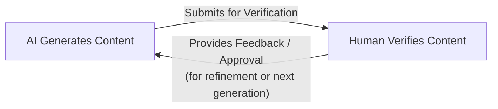
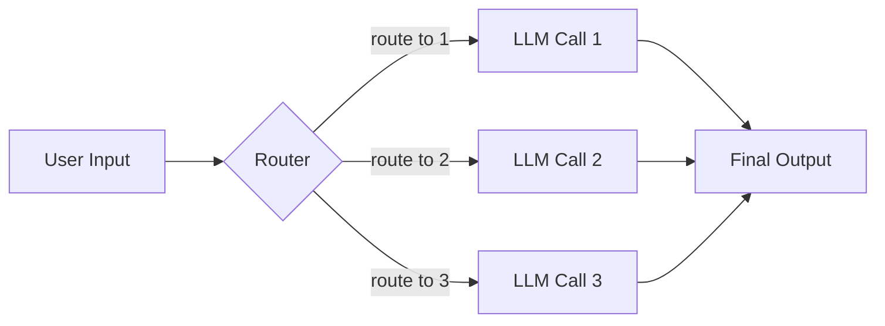
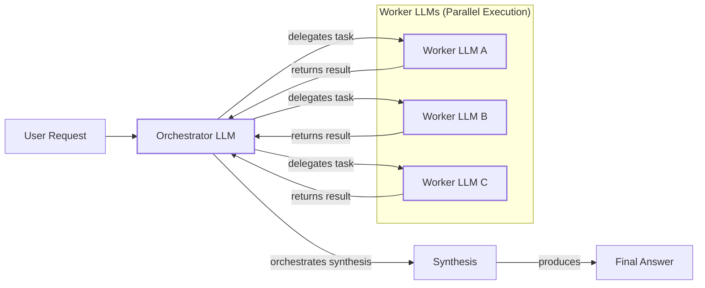
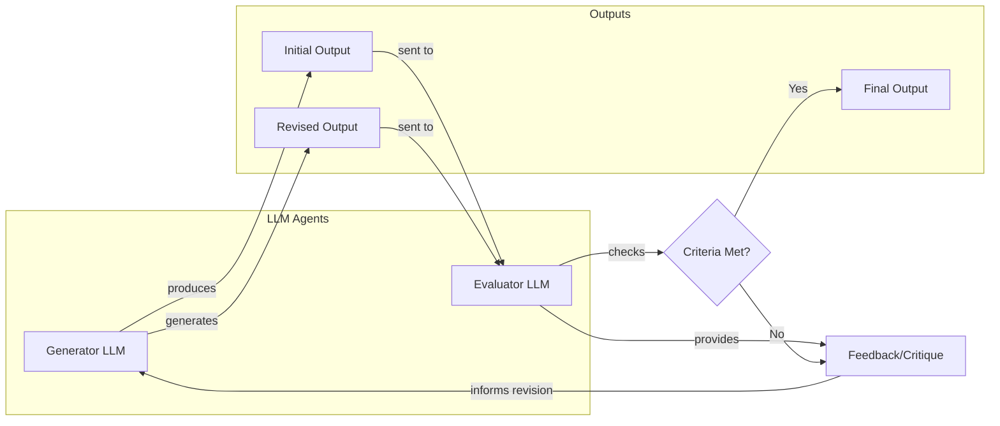
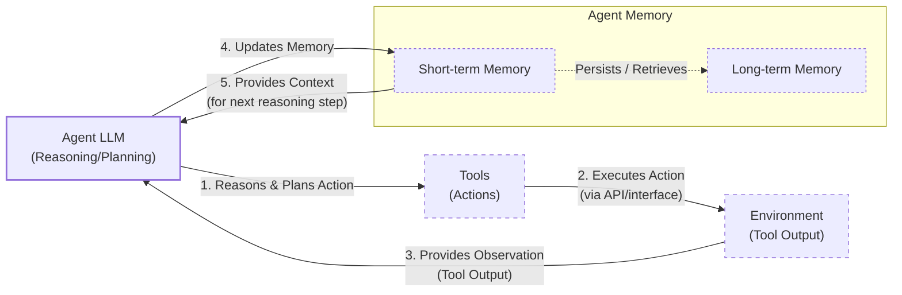
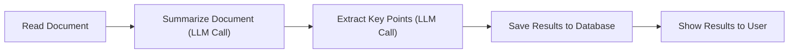
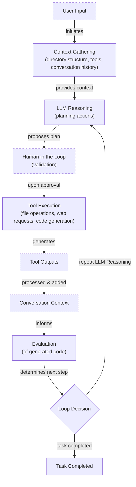
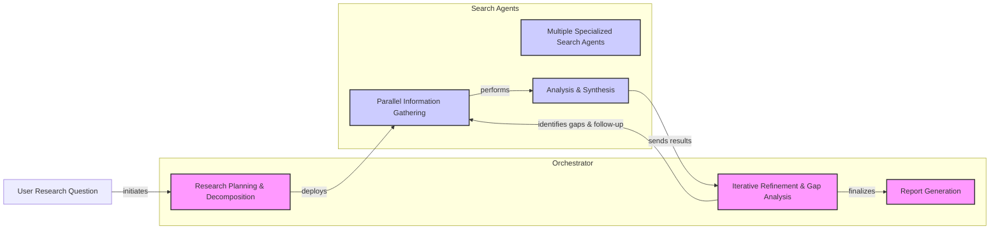

# The Critical Decision Every AI Engineer Faces: Workflows vs. Agents

As an AI engineer preparing to build your first real application, you will face a key decision after narrowing down the problem you want to solve: How should you design your AI solution? Should it follow a predictable, step-by-step workflow, or does it demand a more autonomous approach, where the LLM makes self-directed decisions? This fundamental question will determine the success or failure of your project. It is one of the most important architectural decisions you will make.

Choose the wrong approach, and you might end up with an overly rigid system that breaks when users deviate from expected patterns or when you try to add new features. You could also build an unpredictable agent that works brilliantly 80% of the time but fails catastrophically when it matters most. According to a 2024 Bain survey, while many companies are adopting generative AI, only 1% consider their implementations "mature" [[1]](https://towardsdatascience.com/a-developers-guide-to-building-scalable-ai-workflows-vs-agents/). This gap often stems from poor architectural choices. Months of development time can be wasted rebuilding, leading to frustrated users and executives who cannot afford to keep the system running due to spiraling costs.

The day-to-day reality of building with AI is that in 2024 and 2025, we are seeing billion-dollar AI startups succeed or fail based on this architectural decision. Success stories like Klarna, which handles two-thirds of its customer service chats with an AI assistant, or BCG, which used a multi-agent system to cut engineering effort in shipbuilding by 45%, demonstrate the power of getting this right [[1]](https://towardsdatascience.com/a-developers-guide-to-building-scalable-ai-workflows-vs-agents/). The most successful teams and AI engineers know when to use workflows versus agents and, more importantly, how to combine both approaches effectively. This choice is not just a technical detail; it is a strategic one that impacts development time, cost, reliability, and the end-user experience.

By the end of this lesson, you will have a framework to help you make this decision. You will understand the fundamental trade-offs, see real-world examples from leading AI companies, and learn how to design systems that combine the strengths of both approaches.

## Understanding the Spectrum: From Workflows to Agents

Before you can choose a path, you need to understand the landscape. The terms "workflow" and "agent" are often used interchangeably, but they represent two distinct architectural philosophies. Let's clarify what they are, focusing on their properties and how they are used in practice.

### LLM Workflows

An LLM workflow is a sequence of tasks that may involve one or more LLM calls, orchestrated by developer-written code [[2]](https://www.anthropic.com/engineering/building-effective-agents). Think of it as a factory assembly line: each step is predefined, and the control flow is explicit. The system moves from one stage to the next in a predictable manner, whether it is extracting data, calling a tool, or generating a response.

<https://decodingml.substack.com/p/stop-building-ai-agents> 
Image 1: A simple, predefined workflow where an LLM calls a tool. (Image by Paul Iusztin from [Decoding ML [3]](https://decodingml.substack.com/p/stop-building-ai-agents))

The defining characteristic of a workflow is that the developer is in control. The logic is hardcoded, creating a deterministic or rule-based path. This predictability makes workflows reliable and easier to debug. You can test them like any other piece of software, with stack traces, logs, and clear fallback logic [[1]](https://towardsdatascience.com/a-developers-guide-to-building-scalable-ai-workflows-vs-agents/). If something breaks, you can trace the exact step where the failure occurred. We will explore common workflow patterns like chaining, routing, and the orchestrator-worker model in future lessons.

### AI Agents

In contrast, an AI agent is a system where an LLM dynamically decides the sequence of steps, reasoning, and actions required to achieve a goal [[2]](https://www.anthropic.com/engineering/building-effective-agents). Instead of following a predefined script, the agent plans its own path. It can reason about a task, select the right tools, and adapt its approach based on the outcomes of its actions.

<https://decodingml.substack.com/p/llmops-for-production-agentic-rag> 
Image 2: The core components of an LLM-powered agent, including memory, planning, and tools. (Image by Paul Iusztin from [Decoding ML [4]](https://decodingml.substack.com/p/llmops-for-production-agentic-rag))

The modern agent represents a major leap from its predecessors. Early "expert systems" of the 1970s, such as MYCIN for diagnosing bacterial infections, were proto-agents that used symbolic logic. They were powerful in narrow domains but brittle, as every rule had to be hand-coded by human experts. Today's LLM-powered agents have shifted from these rigid, rule-based environments to flexible, learning-driven architectures that can interact with unstructured inputs and refine their performance over time [[5]](https://www.ibm.com/think/topics/evolution-of-ai-agents).

An agent is more like a skilled human expert tackling an unfamiliar problem. It uses its reasoning abilities to navigate ambiguity and complexity. This autonomy is what makes agents powerful, but it also introduces unpredictability. Key concepts that enable this, such as tools, memory, and reasoning patterns like ReAct, will be covered in depth later in this course.

Both workflows and agents require an orchestration layer. In a workflow, this layer simply executes the predefined plan. In an agent, it facilitates the LLM's dynamic planning and execution, acting more as a runtime environment than a strict controller.

## Choosing Your Path

We have defined LLM workflows and AI agents independently. Now, we will explore their core difference: developer-defined logic versus LLM-driven autonomy in reasoning and action selection. Most real-world systems are not purely one or the other but exist on a spectrum between full human control and full AI autonomy [[6]](https://andrewships.substack.com/p/autonomy-sliders).

<https://substackcdn.com/image/fetch/f_auto,q_auto:good,fl_progressive:steep/https%3A%2F%2Fsubstack-post-media.s3.amazonaws.com%2Fpublic%2Fimages%2F5e64d5e0-7ef1-4e7f-b441-3bf1fef4ff9a_1276x818.png> 
Image 3: The trade-off between the reliability of a workflow and the adaptability of an agent. (Image by Paul Iusztin from [Decoding ML [4]](https://decodingml.substack.com/p/llmops-for-production-agentic-rag))

### When to Use LLM Workflows

Workflows are the backbone of most production AI applications today. They are best suited for tasks with a well-defined structure, where the steps to completion are known in advance. Examples include pipelines for data extraction, automated report generation from multiple sources, and content repurposing, like turning an article into a series of social media posts.

The primary strength of workflows is their predictability. They are reliable, easier to debug, and their operational costs and latency are more consistent [[1]](https://towardsdatascience.com/a-developers-guide-to-building-scalable-ai-workflows-vs-agents/). This makes them ideal for enterprise environments and regulated fields like finance and healthcare, where deterministic behavior is a requirement. A financial report must be accurate every time, and a medical diagnostic tool cannot afford to be unpredictably creative. Workflows are also perfect for building Minimum Viable Products (MVPs) and for high-frequency, low-complexity scenarios where cost per request is a key metric.

However, workflows can be rigid. They may require significant development time to engineer each step, and adding new features can become complex. They struggle to handle unexpected user inputs or novel scenarios, as their paths are hardcoded.

### When to Use AI Agents

AI agents are best for open-ended problems that require dynamic adaptation. Examples include complex research and synthesis, advanced code debugging, and interactive tasks in unfamiliar environments, like booking a flight without specifying which websites to use.

The main strength of agents is their flexibility. They can reason through ambiguity, learn from their actions, and devise novel solutions to problems. However, this autonomy comes at a cost. Agents are non-deterministic, which means their performance, latency, and costs can vary significantly with each run [[3]](https://decodingml.substack.com/p/stop-building-ai-agents). They are more prone to errors, harder to debug, and can pose security risks if not properly constrained. For instance, developers have shared stories of AI coding agents like Replit Agent or Claude Code deleting their entire codebase, joking that they "wanted to start a new project anyway."

### Hybrid Approaches and the Autonomy Slider

Most real-world systems are a hybrid, blending the stability of workflows with the flexibility of agents. Andrej Karpathy introduced the concept of an "autonomy slider," a design pattern that allows you to adjust how much control you give to the AI [[7]](https://www.youtube.com/watch?v=LCEmiRjPEtQ).

For example, the AI code editor Cursor offers different levels of autonomy. You can use simple tab-completion (low autonomy), ask the AI to edit a selected block of code (`Cmd+K`), rewrite an entire file (`Cmd+L`), or let it work across the entire repository in agent mode (`Cmd+I`) (high autonomy) [[7]](https://www.youtube.com/watch?v=LCEmiRjPEtQ). Similarly, the answer engine Perplexity allows you to choose between a quick `search`, a more involved `research` task, or a `deep research` report that takes several minutes to generate [[7]](https://www.youtube.com/watch?v=LCEmiRjPEtQ), [[8]](https://www.perplexity.ai/hub/blog/introducing-perplexity-deep-research).

This slider reflects a fundamental loop in human-AI collaboration: the AI generates content, and the human verifies it. The ultimate goal is to make this generation-verification loop as fast and efficient as possible [[7]](https://www.youtube.com/watch?v=LCEmiRjPEtQ).

Image 4: A circular diagram illustrating the iterative AI generation and human verification loop.

Well-designed workflows and a good user experience are key to accelerating this loop. By choosing the right level of autonomy for the task, you can build systems that are both powerful and reliable.

## Exploring Common Patterns

To build an intuition for AI engineering, let's look at the most common patterns used to construct workflows and agents. We will keep these explanations high-level, as each pattern will be covered in detail in future lessons.

### LLM Workflow Patterns

Workflows are about orchestrating LLM calls and other operations in a structured way. Here are a few foundational patterns.

**Chaining and routing** is the simplest form of automation. It involves linking multiple LLM calls in a sequence, where the output of one step becomes the input for the next [[9]](https://www.geeksforgeeks.org/artificial-intelligence/llm-chains/). This pattern is ideal for tasks that naturally break down into smaller, ordered sub-tasks, such as translating a document and then verifying its accuracy. The main advantage is predictability; you always know what will happen next, which makes debugging straightforward [[10]](https://mlpills.substack.com/p/issue-110-llm-workflow-patterns). You can also add routing logic to direct the workflow down different paths based on certain conditions, allowing the system to choose between multiple appropriate options [[10]](https://mlpills.substack.com/p/issue-110-llm-workflow-patterns). This modular approach makes the system testable and reliable, though it lacks flexibility for tasks that require adaptive sequencing.

Image 5: A flowchart illustrating the "Chaining and Routing" pattern in LLM workflows.

The **orchestrator-worker** pattern introduces a dynamic element. A central "orchestrator" LLM acts as a project manager, analyzing a user's intent, breaking the task into sub-tasks, and delegating them to specialized "worker" models or tools [[11]](https://platform.claude.com/cookbook/patterns-agents-orchestrator-workers). This is perfect for complex scenarios where the exact steps are not known in advance, such as analyzing a company's product launch by assigning different workers to analyze market data, social media sentiment, and competitor actions [[29]](https://mlpills.substack.com/p/diy-17-orchestrator-worker-llm-agent). The key advantage is parallelization; the orchestrator can identify independent tasks and have workers execute them simultaneously, leading to significant speed improvements [[25]](https://online.stevens.edu/blog/building-self-healing-ai-orchestrator-reflexion-patterns/). The orchestrator then synthesizes the results into a final answer. This pattern bridges the gap between rigid workflows and fully autonomous agents by allowing the system to dynamically plan which actions to take.

Image 6: A flowchart illustrating the Orchestrator-Worker pattern in LLM workflows.

The **evaluator-optimizer loop** is designed to improve output quality through automated feedback. In this pattern, one LLM generates a response, and a second "evaluator" LLM critiques it based on predefined criteria. The feedback is then passed back to the generator, which revises its output. This process is inspired by control theory, where a feedback loop monitors its own outputs to evaluate them against a desired state and adjust its actions accordingly [[12]](https://docs.aws.amazon.com/prescriptive-guidance/latest/agentic-ai-patterns/evaluator-reflect-refine-loop-patterns.html). For this to be effective, the feedback must be objective and external, such as running generated code against unit tests and feeding back the pass/fail status and stack traces. Pure self-reflection, where an LLM checks its own work without new information, has been shown to be ineffective for improving reasoning [[30]](https://vadim.blog/the-research-on-llm-self-correction). The loop continues until the response meets the desired quality standard, mimicking how a human writer refines a document based on an editor's comments.

Image 7: A feedback loop diagram illustrating the "Evaluator-Optimizer" pattern.

### Core Components of a ReAct AI Agent

Nearly all modern agents are built using a reasoning pattern called ReAct, which stands for Reason and Act. This pattern enables an agent to break down a task, create a plan, and execute it step-by-step. The agent cycles through a loop of reasoning about the next action, taking that action using a tool, and observing the result to inform its next step until the task is complete [[13]](https://cloud.google.com/discover/what-are-ai-agents).

A ReAct agent has a few core components:
*   An **LLM** to reason, plan actions, and interpret results.
*   A set of **tools** (or actions) that allow it to interact with the external world, such as searching the web or querying a database. We will cover tools in detail in Lesson 6.
*   **Short-term memory** to keep track of the current conversation and actions taken. Think of this as the agent's working memory, similar to a computer's RAM.
*   **Long-term memory** to access factual knowledge and remember user preferences across sessions. We will explore memory systems in Lesson 9.

Image 8: A flowchart illustrating the high-level dynamics of an AI agent using the "ReAct pattern".

These patterns are the building blocks of AI engineering. While we have only touched on them briefly, you will learn to implement and combine them throughout this course to build increasingly sophisticated applications.

## Zooming In on Our Favorite Examples

To anchor these concepts in the real world, let's analyze a few examples, moving from a simple workflow to a complex hybrid system. We will keep these explanations high-level and intuitive, as this is the first time you are encountering these systems.

### Document Summarization Workflow by Gemini in Google Workspace

**Problem:** Finding the right information in a large document can be a time-consuming process. A quick, embedded summary can guide your search and save valuable time.

The "Summary by Gemini" feature in Google Workspace is a perfect example of a pure, multi-step workflow [[14]](https://support.google.com/docs/answer/15627020?hl=en). It follows a simple, linear chain of LLM calls to process a document. When a user types `@Summary`, the system triggers a workflow that is available in both editing and suggesting modes. For long documents, this process often follows a map-reduce pattern: the document is split into smaller chunks, each chunk is summarized in parallel (the "map" step), and then a final LLM call combines these partial summaries into a single, coherent overview (the "reduce" step) [[31]](https://cloud.google.com/blog/products/ai-machine-learning/long-document-summarization-with-workflows-and-gemini-models). This entire process is triggered by a user action and follows a predefined path, making it a classic example of a developer-orchestrated workflow designed for a specific, repeatable task.

Image 9: A sequential flowchart illustrating the "Document Summarization and Analysis Workflow by Gemini in Google Workspace".

Here is how a workflow like this might work:
1.  **Read Document:** The system first ingests the full text of the document.
2.  **Summarize Document:** It makes an LLM call with a prompt to generate a concise summary.
3.  **Extract Key Points:** A second LLM call might be used to pull out specific entities or key takeaways.
4.  **Save and Display:** The structured results are saved and then presented to the user in a clean interface.

This is a workflow because every step is predefined. There is no dynamic decision-making; the system simply executes a hardcoded sequence of operations.

### Gemini CLI Coding Assistant

**Problem:** Writing code is a slow process that often involves reading dense documentation or trying to understand unfamiliar codebases. A coding assistant can significantly speed up this process.

The open-source Gemini CLI is a good example of a single-agent system that uses the ReAct architecture to help with coding tasks [[15]](https://blog.google/technology/developers/introducing-gemini-cli-open-source-ai-agent/), [[16]](https://github.com/google-gemini/gemini-cli/blob/main/README.md). Based on our latest research from August 2025, we can see how it works under the hood. It can write code from scratch, assist an engineer with specific functions, generate documentation, and help you quickly understand a new codebase. It is implemented in TypeScript and shares technology with Gemini Code Assist in VS Code [[32]](https://developers.google.com/gemini-code-assist/docs/gemini-cli). Similar tools in this space include Cursor, Windsurf, Claude Code, and Warp.

Image 10: A flowchart illustrating the operational loop of the Gemini CLI Coding Assistant.

Here is a high-level overview of its operational loop:
1.  **Context Gathering:** The agent starts by loading its context. It creates a high-level snapshot of the local directory structure and uses a hierarchical system of `GEMINI.md` files to load persistent instructions, from a global file in `~/.gemini/` to project-specific and even subdirectory-level files [[33]](https://wietsevenema.eu/blog/2025/how-gemini-cli-builds-context/), [[34]](https://geminicli.com/docs/cli/gemini-md/).
2.  **LLM Reasoning:** The Gemini model analyzes the user's request and the current context to create a plan of action.
3.  **Human in the Loop:** Before executing, it often validates the plan with the user.
4.  **Tool Execution:** The agent executes the selected tools. These can include file system operations like `grep`, a terminal for running commands, web search for accessing documentation, and code generation or interpretation [[32]](https://developers.google.com/gemini-code-assist/docs/gemini-cli).
5.  **Evaluation:** The agent can dynamically evaluate the generated code, for instance, by attempting to compile or run it to check for errors.
6.  **Loop Decision:** Based on the outcome, the agent decides whether the task is complete or if it needs to repeat the reasoning loop to take further actions.

However, its power comes with trade-offs. Users report that as the context for a task grows, the tool can experience significant latency. For example, when analyzing a large code branch, some operations can take minutes to complete [[17]](https://github.com/google-gemini/gemini-cli/discussions/12311), [[18]](https://news.ycombinator.com/item?id=46060508). This highlights a key challenge in agentic systems: balancing advanced reasoning capabilities with real-world performance.

### Perplexity Deep Research

**Problem:** Researching a new topic can be daunting. You often do not know where to start, and sifting through countless blogs, papers, and videos is time-consuming. A research assistant that can quickly scan the internet and synthesize a comprehensive report is a powerful learning tool.

Perplexity's Deep Research feature is a good example of a hybrid system. Based on our latest research from August 2025, it combines structured workflow patterns with dynamic, multi-agent reasoning to conduct autonomous, expert-level research [[8]](https://www.perplexity.ai/hub/blog/introducing-perplexity-deep-research). Unlike the single-agent Gemini CLI, this system deploys multiple specialized agents in parallel, orchestrated by a workflow. It can perform dozens of searches across hundreds of sources to generate a detailed report in just a few minutes. Since the solution is closed-source, the following is an assumption based on publicly available information [[19]](https://zenvanriel.com/ai-engineer-blog/perplexity-computer-multi-model-agent-orchestration/).

Image 11: A complex iterative flowchart illustrating the "Perplexity Deep Research Iterative Multi-Step Process".

Here is an oversimplified look at how it might work:
1.  **Research Planning & Decomposition:** An orchestrator agent, likely a powerful reasoning model like Claude Opus, analyzes the user's research question and breaks it down into targeted sub-questions [[19]](https://zenvanriel.com/ai-engineer-blog/perplexity-computer-multi-model-agent-orchestration/). This step uses the orchestrator-worker pattern.
2.  **Parallel Information Gathering:** Specialized search agents, potentially powered by models like Google Gemini, tackle each sub-question in parallel. They use tools like web search to gather information from hundreds of sources [[19]](https://zenvanriel.com/ai-engineer-blog/perplexity-computer-multi-model-agent-orchestration/), [[8]](https://www.perplexity.ai/hub/blog/introducing-perplexity-deep-research). This isolation keeps each agent focused and efficient.
3.  **Analysis & Synthesis:** Each agent validates its sources, ranks them by relevance, and summarizes the top findings.
4.  **Iterative Refinement & Gap Analysis:** The orchestrator gathers the partial reports, identifies any knowledge gaps, and generates follow-up queries, repeating the process until the research is comprehensive [[8]](https://www.perplexity.ai/hub/blog/introducing-perplexity-deep-research).
5.  **Report Generation:** Finally, the orchestrator synthesizes all the information into a single, coherent report with inline citations.

The effectiveness of this hybrid approach is demonstrated by its performance on external benchmarks. Perplexity Deep Research achieves state-of-the-art results on evaluations like Google DeepMind's DeepSearchQA and its own production-grounded DRACO benchmark, which measures factual accuracy and analysis depth on real-world user queries [[20]](https://research.perplexity.ai/articles/evaluating-deep-research-performance-in-the-wild-with-the-draco-benchmark). For example, it scores 93.9% accuracy on the SimpleQA benchmark for factual questions [[21]](https://www.linkedin.com/posts/perplexity-ai_introducing-deep-research-on-perplexity-activity-7296217839827308546---0z). This combines the structured control of a workflow with the dynamic reasoning of multiple agents, creating a system that is both powerful and efficient.

## The Challenges of Every AI Engineer

Now that you understand the spectrum from LLM workflows to AI agents, it is important to recognize that every AI Engineer, whether at a startup or a Fortune 500 company, faces these same architectural challenges when designing a new AI application. This is one of the core decisions that determine whether your AI application succeeds in production or fails spectacularly.

As you begin your journey, you will encounter a recurring set of technical difficulties [[22]](https://arxiv.org/html/2510.25423v2).
*   **Reliability Issues:** Your agent works perfectly in demos but becomes unpredictable with real users. LLM reasoning failures, such as those caused by malformed tool outputs or permission errors, can compound through multi-step processes, leading to unexpected and costly outcomes [[22]](https://arxiv.org/html/2510.25423v2), [[23]](https://permiso.io/blog/8-critical-ai-security-challenges).
*   **Context Limits:** Systems struggle to maintain coherence across long conversations, gradually losing track of their purpose. This "lost-in-the-middle" problem can degrade performance long before a model's context window is full, making consistent output quality a continuous challenge [[24]](https://medium.com/@ananya_95177/key-challenges-in-ai-agent-development-and-how-to-solve-them-460fceb0a6d5).
*   **Data Integration:** You will need to build pipelines to pull information from various sources like Slack, web APIs, SQL databases, and data lakes, while ensuring only high-quality data is passed to your AI system. This is what the `arxiv` paper identifies as the "retrieval, embeddings, and agent memory" challenge [[22]](https://arxiv.org/html/2510.25423v2).
*   **Cost-Performance Trap:** Sophisticated agents can deliver impressive results but may cost a fortune per user interaction. Multi-agent systems can consume up to 15 times more tokens than simple chat interactions, making them economically unfeasible for many applications [[1]](https://towardsdatascience.com/a-developers-guide-to-building-scalable-ai-workflows-vs-agents/).
*   **Security Concerns:** Autonomous agents with powerful write permissions could send the wrong emails, delete critical files, or expose sensitive data if not properly governed. These risks, including prompt injection and over-permissioned agents, are now driving the creation of new enterprise governance frameworks and regulations, such as Singapore's Model AI Governance Framework for Agentic AI [[25]](https://airia.com/voluntary-ai-standards-becoming-legal-requirements/), [[26]](https://www.cyberark.com/resources/blog/the-agentic-ai-revolution-5-unexpected-security-challenges).

These challenges are solvable. The difficulty of debugging agents, for instance, has led to the development of new LLM observability platforms that provide detailed traces of an agent's reasoning process, moving beyond traditional tools that treat the agent as a black box [[27]](https://futureagi.com/blog/debug-ai-agents-2025/). Another promising approach is grounding agents with knowledge graphs, which provide structured, factual context to mitigate hallucinations. Research shows this can improve LLM accuracy by over 50% on average [[28]](https://atlan.com/know/combining-knowledge-graphs-llms/).

In the upcoming lessons, we will address each of these issues. You will learn patterns for building reliable products through specialized evaluation and monitoring pipelines, strategies for building hybrid systems, and ways to keep costs and latency under control. Your path forward as an AI engineer is about mastering these realities. You will learn when to use a workflow, when to deploy an agent, and how to design systems that are robust, efficient, and safe. In our next lesson, we will start by exploring structured outputs, a fundamental technique for ensuring reliability in any AI application.

## References

- [1] https://towardsdatascience.com/a-developers-guide-to-building-scalable-ai-workflows-vs-agents/
- [2] https://www.anthropic.com/engineering/building-effective-agents
- [3] https://decodingml.substack.com/p/stop-building-ai-agents
- [4] https://decodingml.substack.com/p/llmops-for-production-agentic-rag
- [5] https://www.ibm.com/think/topics/evolution-of-ai-agents
- [6] https://andrewships.substack.com/p/autonomy-sliders
- [7] https://www.youtube.com/watch?v=LCEmiRjPEtQ
- [8] https://www.perplexity.ai/hub/blog/introducing-perplexity-deep-research
- [9] https://www.geeksforgeeks.org/artificial-intelligence/llm-chains/
- [10] https://mlpills.substack.com/p/issue-110-llm-workflow-patterns
- [11] https://platform.claude.com/cookbook/patterns-agents-orchestrator-workers
- [12] https://docs.aws.amazon.com/prescriptive-guidance/latest/agentic-ai-patterns/evaluator-reflect-refine-loop-patterns.html
- [13] https://cloud.google.com/discover/what-are-ai-agents
- [14] https://support.google.com/docs/answer/15627020?hl=en
- [15] https://blog.google/technology/developers/introducing-gemini-cli-open-source-ai-agent/
- [16] https://github.com/google-gemini/gemini-cli/blob/main/README.md
- [17] https://github.com/google-gemini/gemini-cli/discussions/12311
- [18] https://news.ycombinator.com/item?id=46060508
- [19] https://zenvanriel.com/ai-engineer-blog/perplexity-computer-multi-model-agent-orchestration/
- [20] https://research.perplexity.ai/articles/evaluating-deep-research-performance-in-the-wild-with-the-draco-benchmark
- [21] https://www.linkedin.com/posts/perplexity-ai_introducing-deep-research-on-perplexity-activity-7296217839827308546---0z
- [22] https://arxiv.org/html/2510.25423v2
- [23] https://permiso.io/blog/8-critical-ai-security-challenges
- [24] https://medium.com/@ananya_95177/key-challenges-in-ai-agent-development-and-how-to-solve-them-460fceb0a6d5
- [25] https://airia.com/voluntary-ai-standards-becoming-legal-requirements/
- [26] https://www.cyberark.com/resources/blog/the-agentic-ai-revolution-5-unexpected-security-challenges
- [27] https://futureagi.com/blog/debug-ai-agents-2025/
- [28] https://atlan.com/know/combining-knowledge-graphs-llms/
- [29] https://mlpills.substack.com/p/diy-17-orchestrator-worker-llm-agent
- [30] https://vadim.blog/the-research-on-llm-self-correction
- [31] https://cloud.google.com/blog/products/ai-machine-learning/long-document-summarization-with-workflows-and-gemini-models
- [32] https://developers.google.com/gemini-code-assist/docs/gemini-cli
- [33] https://wietsevenema.eu/blog/2025/how-gemini-cli-builds-context/
- [34] https://geminicli.com/docs/cli/gemini-md/
</article>