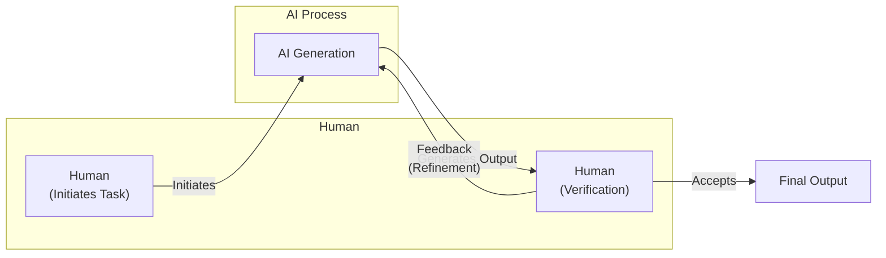
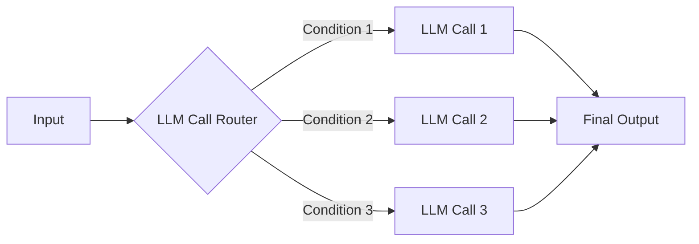
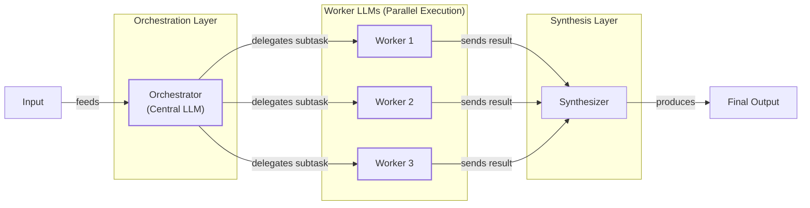
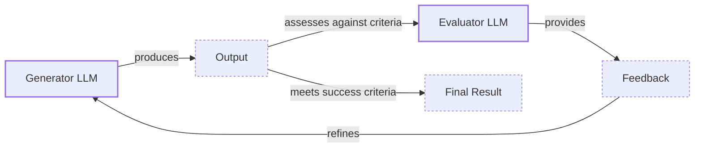
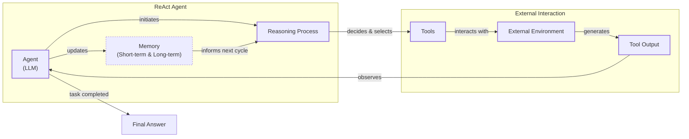
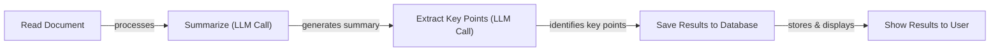
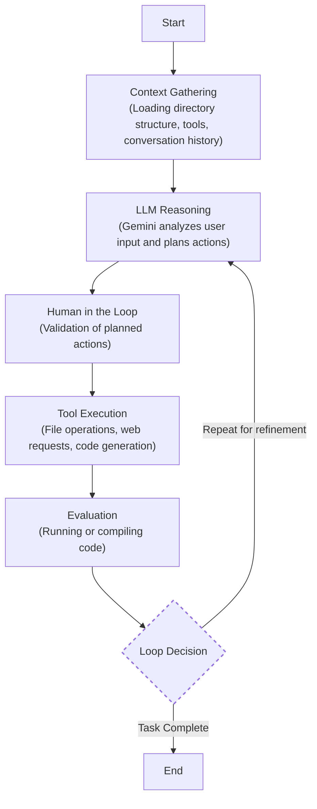
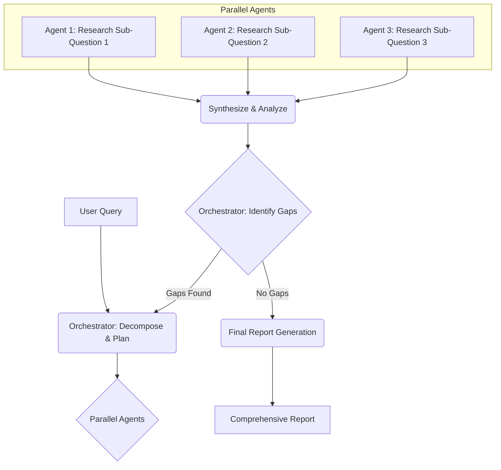

# The Critical Decision Every AI Engineer Faces: LLM Workflows vs. AI Agents

As an AI engineer preparing to build your first real AI application, after narrowing down the problem you want to solve, one key decision is how to design your AI solution. Should it follow a predictable, step-by-step workflow, or does it demand a more autonomous approach, where the LLM makes self-directed decisions along the way? This fundamental question will determine the success or failure of your project: How should you architect your AI system?

When building AI applications, you face this critical architectural decision early in your development process. Should you create a predictable workflow where you control every action, or should you build an autonomous agent that can think and decide for itself? This choice will impact everything from development time and costs to reliability and user experience. We learned this the hard way. Six months ago, we built a "research crew" with three agents and five tools. On paper, it was a perfect system. In practice, the researcher ignored the web scraper, the summarizer forgot to use the citation tool, and the coordinator gave up entirely when processing longer documents. It was a beautiful plan falling apart in spectacular ways.

Choose the wrong approach, and you might end up with an overly rigid system that breaks when users deviate from expected patterns or when you try to add new features. You could also build an unpredictable agent that works brilliantly 80% of the time but fails catastrophically when it matters most. This can lead to months of wasted development time, frustrated users who cannot rely on the application, and executives who cannot afford to keep the system running as costs skyrocket. The operational complexity, debugging pain, and spiraling token bill are often left out of the success stories.

In 2024 and 2025, billion-dollar AI startups are succeeding or failing based on this architectural decision. The most successful teams and AI engineers know when to use workflows versus agents and, more importantly, how to combine both approaches effectively. This choice is not just a technical detail; it is a strategic one that defines your product's capabilities and limitations.

By the end of this lesson, you will have a framework to make this critical decision with clarity. You will understand the fundamental trade-offs, see real-world examples from leading AI companies, and learn how to design systems that combine the strengths of both approaches.

## Understanding the Spectrum: From Workflows to Agents

Before you can choose between workflows and agents, you need a clear understanding of what they are. At this point, we will not focus on the technical specifics but rather on their properties and how they are used.

An LLM workflow is a sequence of tasks involving LLM calls or other operations, such as reading or writing data. It is largely predefined and orchestrated by developer-written code [[1]](https://www.anthropic.com/engineering/building-effective-agents). The steps are defined in advance, resulting in deterministic or rule-based paths with predictable execution and explicit control flow. Think of a workflow as a factory assembly line, where each station performs a specific, repeatable task in a set order.

This structure makes them highly predictable, testable, and easier to debug. Because you control the logic, you can optimize each step, use smaller, specialized models for specific tasks, and maintain a consistent and reliable output. In future lessons, we will explore common workflow patterns like chaining, routing, and orchestrator-worker designs.

https://substackcdn.com/image/fetch/$s_!h4Gr!,w_1456,c_limit,f_auto,q_auto:good,fl_progressive:steep/https%3A%2F%2Fsubstack-post-media.s3.amazonaws.com%2Fpublic%2Fimages%2F33ab02e1-0922-4810-af64-092c29e7976c_1275x296.png
Image 1: A simple LLM workflow, where an input is processed by a series of LLM calls to produce an output. (Source [ML Pills](https://mlpills.substack.com/p/issue-110-llm-workflow-patterns))

AI agents, on the other hand, are systems where an LLM plays a central role in dynamically deciding the sequence of steps, reasoning, and actions to achieve a goal [[2]](https://cloud.google.com/discover/what-are-ai-agents). The steps are not defined in advance but are planned based on the task and the current state of the environment. This makes them adaptive and capable of handling novelty. An agent is like a skilled human expert addressing a new problem, adapting their approach with each new piece of information.

To do this, agents use actions, memory, and reasoning patterns like ReAct, which we will cover in future lessons. An agent is composed of the LLM, which acts as its brain, along with memory for context, and tools to interact with the outside world [[3]](https://d/p/llmops-for-production-agentic-rag). This composition allows them to reason, plan, and learn from their interactions, making them suitable for complex and unpredictable tasks.

https://substackcdn.com/image/fetch/$s_!gLNT!,f_auto,q_auto:good,fl_progressive:steep/https%3A%2F%2Fsubstack-post-media.s3.amazonaws.com%2Fpublic%2Fimages%2F67ffe267-55f2-4af7-9910-7410c7605550_1220x754.png
Image 2: An AI agent consists of memory, planning, and tools, with the agent at the center coordinating these components. (Source [Decoding ML](https://d/p/llmops-for-production-agentic-rag))

Both workflows and agents require an orchestration layer, but its nature differs. In workflows, the orchestrator executes a defined plan. In agents, it facilitates the LLM's dynamic planning and execution. This distinction between developer-defined logic and LLM-driven autonomy is the core of the architectural choice you will face.

## Choosing Your Path

In the previous section, we defined LLM workflows and AI agents independently. Now, we want to explore their core differences: developer-defined logic versus LLM-driven autonomy in reasoning and action selection.

https://substackcdn.com/image/fetch/$s_!yBni!,f_auto,q_auto:good,fl_progressive:steep/https%3A%2F%2Fsubstack-post-media.s3.amazonaws.com%2Fpublic%2Fimages%2F5e64d5e0-7ef1-4e7f-b441-3bf1fef4ff9a_1276x818.png
Image 3: A diagram showing the spectrum from a structured Workflow to an autonomous Agent, highlighting the trade-off between application reliability and the agent's level of control. (Source [Decoding ML](https://decodingml.substack.com/p/stop-building-ai-agents))

### When to Use LLM Workflows

Workflows are best for tasks with a well-defined structure. This includes pipelines for data extraction from sources like Slack or Google Drive, automated report or email generation, and content repurposing [[4]](https://cloud.google.com/transform/101-real-world-generative-ai-use-cases-from-industry-leaders). Their strength lies in predictability and reliability, which makes them easier to debug and test. Operationally, you can often use smaller, specialized models for each sub-task, leading to lower and more predictable costs and latency [[1]](https://www.anthropic.com/engineering/building-effective-agents). However, building them can require more development time upfront, and the user experience can feel rigid if it cannot handle unexpected scenarios.

Because of their reliability, workflows are preferred in enterprises and regulated fields like finance and healthcare. In these domains, a system must produce the correct, auditable output every time, as errors can have a direct impact on people's money and lives. Workflows are also ideal for building Minimum Viable Products (MVPs) that require rapid deployment, as well as for high-frequency scenarios where the cost per request matters more than sophisticated reasoning.

### When to Use AI Agents

Agents are better suited for open-ended or dynamic tasks. This includes complex customer support, open-ended research and synthesis, or interactive problem-solving like debugging code. Their primary strength is their adaptability and flexibility to handle ambiguity.

However, this autonomy comes with significant weaknesses. Agents are more prone to errors and non-deterministic behavior, making performance, latency, and costs vary with each run. They often require larger, more expensive models to generalize effectively. If not designed well, there can be huge security concerns, especially on write operations, where an agent could delete all your data or send inappropriate emails.

Finally, a huge disadvantage of AI agents is that they are hard to debug and evaluate. There are already stories of developers having their code deleted by an agent, joking that they "wanted to start a new project anyway."

### Hybrid Approaches and the Autonomy Slider

Most real-world systems are not purely one or the other; they blend elements of both. In reality, there is a spectrum between rigid workflows and fully autonomous agents, and the best systems often find a balance.

Andrej Karpathy introduced the concept of an "autonomy slider," where you decide how much control to give the LLM versus the user [[5]](https://singjupost.com/andrej-karpathy-software-is-changing-again/). Coding assistants like Cursor exemplify this. A user can choose tab-completion (low autonomy), editing a selected block of code (medium autonomy), or letting the agent modify the entire repository (high autonomy). Similarly, Perplexity offers a quick search (workflow-like), a more involved research mode, or a "deep research" (agentic) option [[5]](https://singjupost.com/andrej-karpathy-software-is-changing-again/). The user tunes the level of autonomy based on the complexity of the task.

The ultimate goal is to speed up the loop between AI generation and human verification. This is achieved not just through a well-designed architecture but also through a thoughtful user interface that makes it easy for humans to guide and correct the AI, as seen in products like Cursor [[5]](https://singjupost.com/andrej-karpathy-software-is-changing-again/).

Image 4: A circular flow diagram illustrating the iterative process of AI generation and human verification.

## Exploring Common Patterns

To navigate the world of AI Engineering, it helps to understand the common patterns used to build both workflows and agents. We will introduce them here at a high level to build intuition; future lessons will dive into the technical details of each.

### LLM Workflow Patterns

Workflows are constructed from several foundational patterns that allow for structured, multi-step processing.

**Chaining and routing** is the simplest pattern, used to automate multiple LLM calls together [[6]](https://mlpills.substack.com/p/issue-110-llm-workflow-patterns). It helps glue different steps and allows the system to decide between different paths based on the input or intermediate outputs. For example, a customer support workflow might first use an LLM to classify a user's query (e.g., billing, technical, general).

Based on this classification, the query is then routed to a specialized sub-workflow designed to handle that specific type of request. This separation of concerns ensures that each part of the system is optimized for its task, improving both accuracy and efficiency.

Image 5: A flowchart illustrating the "Chaining and Routing" pattern for LLM workflows.

The **orchestrator-worker** pattern introduces a level of dynamic planning [[6]](https://mlpills.substack.com/p/issue-110-llm-workflow-patterns). A central orchestrator LLM analyzes the user's intent, breaks the task into sub-tasks, and delegates them to specialized worker models. The orchestrator then synthesizes the results into a final answer.

This pattern is powerful because it separates high-level reasoning (the orchestrator) from specialized execution (the workers), allowing for parallel processing and greater modularity. This pattern makes a smooth transition from rigid workflows to more adaptive, agentic behavior.

Image 6: A flowchart illustrating the Orchestrator-Worker pattern with a central LLM orchestrating parallel worker LLMs and a synthesizer combining results.

An **evaluator-optimizer loop** is used to auto-correct and refine the output from an LLM [[7]](https://platform.claude.com/cookbook/patterns-agents-evaluator-optimizer). In this pattern, one LLM generates a response, and another "evaluator" LLM reviews it against specific criteria. The evaluator provides feedback, which is then passed back to the generator to improve its next attempt.

This cycle repeats until the output meets the desired quality, mimicking how a human writer refines a document based on an editor's feedback. This pattern is especially useful when output quality is more important than speed.

Image 7: A circular flow diagram illustrating the "Evaluator-Optimizer" loop.

### Core Components of a ReAct AI Agent

The ReAct (Reason and Act) framework is the dominant pattern for building modern AI agents [[2]](https://cloud.google.com/discover/what-are-ai-agents). It enables an agent to automatically decide what action to take, interpret the output of that action, and repeat the process until a task is completed.

A ReAct agent consists of several core components:
*   An **LLM** to reason, plan actions, and interpret outputs.
*   A set of **tools** (or actions) that allow the agent to interact with its external environment. We will cover tools in detail in Lesson 6.
*   **Short-term memory** to keep track of the current conversation and actions, much like RAM in a computer.
*   **Long-term memory** to access factual knowledge (from the internet or private databases) and remember user preferences across sessions. We will explore memory in Lesson 9.

This iterative loop of reasoning, acting, and observing is what gives ReAct agents their power and flexibility. We will dive deep into this pattern in Lessons 7 and 8.

Image 8: A flowchart illustrating the high-level dynamics of a ReAct (Reason and Act) AI agent.

## Zooming In on Our Favorite Examples

To better anchor these concepts in the real world, let's look at a few examples, from a simple workflow to a more advanced hybrid system. We will keep these explanations high-level and intuitive.

### Document Summarization in Google Workspace: A Simple Workflow

A common problem in team environments is finding the right information within large documents. A quick, embedded summary can save significant time and guide search strategies. The document summarization feature in Google Workspace is a perfect example of a pure, multi-step workflow [[8]](https://cloud.google.com/blog/products/ai-machine-learning/long-document-summarization-with-workflows-and-gemini-models).

This system uses a "map-reduce" approach, which is a classic workflow pattern. First, the long document is split into smaller, manageable "chunks" that fit within the LLM's context window. In the "map" phase, the system creates a summary for each of these chunks in parallel. This is much faster than processing them one by one.

In the final "reduce" phase, all the individual summaries are concatenated and fed into the LLM one last time to create a final, cohesive summary of the entire document. Each step is predictable and follows a predefined path, making it a classic example of a reliable, structured workflow.

Image 9: A sequential flowchart illustrating a simple LLM workflow for document summarization and analysis using Gemini in Google Workspace.

### Gemini CLI: An Agentic Coding Assistant

Writing code is a time-consuming process that often involves reading dense documentation or navigating unfamiliar codebases. A coding assistant can dramatically speed this up. The Gemini CLI, an open-source tool from Google, is a great example of a single-agent system that uses the ReAct pattern to assist with coding [[9]](https://blog.google/technology/developers/introducing-gemini-cli-open-source-ai-agent/).

The Gemini CLI operates in an iterative loop. It starts by gathering context, creating an initial snapshot of your local directory structure to get a high-level sense of the project [[10]](https://wietsevenema.eu/blog/2025/how-gemini-cli-builds-context/). It also loads project-specific instructions from `GEMINI.md` files. Then, the Gemini model analyzes your request and this context to form a plan of action. Before executing potentially destructive actions, it validates the plan with you, keeping a human in the loop.

Once approved, the agent executes its chosen tools. These can range from file system operations like reading specific functions with `grep`, to web searches for documentation, to actually generating and applying code diffs. The results of these actions are fed back into the agent's memory. The agent then evaluates the outcome, for instance by trying to compile the new code. Based on this evaluation, it decides whether the task is complete or if it needs to loop back to the reasoning step to plan its next move. This iterative process of reasoning and acting allows the Gemini CLI to handle complex coding tasks that a simple workflow could not.

Image 10: A circular flow diagram illustrating the operational loop of the Gemini CLI coding assistant, which implements the ReAct pattern.

### Perplexity Deep Research: A Hybrid System

Researching a new topic can be daunting. You often do not know where to start, and sifting through countless sources is time-consuming. Perplexity's Deep Research feature is a powerful research assistant that acts as a hybrid system, combining structured workflows with dynamic, multi-agent reasoning to produce expert-level reports [[11]](https://www.perplexity.ai/hub/blog/introducing-perplexity-deep-research).

While Perplexity's exact architecture is closed-source, we can infer how it might work based on its behavior and industry best practices. It likely uses an orchestrator-worker pattern to manage multiple specialized agents in parallel [[12]](https://zenvanriel.com/ai-engineer-blog/perplexity-computer-multi-model-agent-orchestration/). The central reasoning engine, or orchestrator, is reportedly Claude Opus. This orchestrator analyzes your research question and decomposes it into several targeted sub-questions.

Then, it deploys specialized worker agents in parallel to tackle each sub-question. For instance, it might use Google Gemini for deep research queries and other models for different tasks. Each agent uses tools like web search and document retrieval to gather information independently. This parallel approach is efficient and keeps each agent focused. After the initial information gathering, each agent analyzes and synthesizes its findings.

The orchestrator then collects these partial results and performs a gap analysis to see if the original question has been fully answered. If not, it generates follow-up queries and repeats the process, creating an iterative refinement loop. Once the research is comprehensive, the orchestrator synthesizes all the information into a single, cohesive report with inline citations. This hybrid approach combines the structured planning of a workflow with the adaptive reasoning of multiple agents, allowing it to tackle complex research tasks that are beyond the scope of a single agent or a rigid workflow.

Image 11: An iterative, multi-step process for a hybrid research agent like Perplexity's Deep Research.

## The Challenges of Every AI Engineer

Now that you understand the spectrum from LLM workflows to AI agents, it is important to recognize that every AI engineer faces these same fundamental challenges when designing a new AI application. This is not a decision unique to startups or large corporations. This choice is one of the core decisions that determine whether your application succeeds in production or fails spectacularly.

As you build, you will face a set of recurring problems. Your agent might work perfectly in demos but become unpredictable with real users. LLM reasoning failures can compound through multi-step processes, leading to unexpected and costly outcomes. Studies of developer discussions on platforms like Stack Overflow and GitHub show that runtime reliability and orchestration are among the most difficult and persistent challenges [[13]](https://arxiv.org/html/2510.25423v2).

Systems can also struggle to maintain coherence across long conversations, gradually losing track of their purpose. You will need to build pipelines to pull information from various sources like Slack, web APIs, and databases, all while ensuring only high-quality data is passed to your AI system. Furthermore, sophisticated agents can deliver impressive results but may become economically unfeasible due to high costs per interaction. Finally, autonomous agents with powerful write permissions introduce security risks, as they could potentially delete critical files or expose sensitive data if not properly sandboxed and monitored [[14]](https://permiso.io/blog/8-critical-ai-security-challenges).

These challenges are solvable. In the upcoming lessons, we will address each of these issues. You will learn proven strategies for building reliable products through specialized evaluation and monitoring pipelines, techniques for building hybrid systems, and ways to keep costs and latency under control. We will cover structured outputs, memory management, advanced RAG, and different agentic patterns like ReAct.

Your path forward as an AI engineer is about mastering these realities. By the end of this course, you will have the knowledge to architect AI systems that are not only powerful but also robust, efficient, and safe. You will know when to use a workflow, when to deploy an agent, and how to build effective hybrid systems that work in the real world. In our next lesson, we will explore structured outputs, a key technique for making LLM interactions more reliable.

## References

- [1] [Building effective agents](https://www.anthropic.com/engineering/building-effective-agents)
- [2] [What is an AI agent?](https://cloud.google.com/discover/what-are-ai-agents)
- [3] [Exploring the difference between agents and workflows](https://d/p/llmops-for-production-agentic-rag)
- [4] [601 real-world gen AI use cases from the world's leading organizations](https://cloud.google.com/transform/101-real-world-generative-ai-use-cases-from-industry-leaders)
- [5] [Andrej Karpathy: Software Is Changing (Again)](https://singjupost.com/andrej-karpathy-software-is-changing-again/)
- [6] [Issue #110 - LLM Workflow Patterns](https://mlpills.substack.com/p/issue-110-llm-workflow-patterns)
- [7] [Evaluator optimizer | Claude Cookbook](https://platform.claude.com/cookbook/patterns-agents-evaluator-optimizer)
- [8] [Long document summarization with Workflows and Gemini models](https://cloud.google.com/blog/products/ai-machine-learning/long-document-summarization-with-workflows-and-gemini-models)
- [9] [Gemini CLI: your open-source AI agent](https://blog.google/technology/developers/introducing-gemini-cli-open-source-ai-agent/)
- [10] [How Gemini CLI builds context](https://wietsevenema.eu/blog/2025/how-gemini-cli-builds-context/)
- [11] [Introducing Perplexity Deep Research](https://www.perplexity.ai/hub/blog/introducing-perplexity-deep-research)
- [12] [Perplexity Computer: Multi-Model Agent Orchestration](https://zenvanriel.com/ai-engineer-blog/perplexity-computer-multi-model-agent-orchestration/)
- [13] [What Challenges Do Developers Face in AI Agent Systems? An Empirical Study on Stack Overflow & GitHub Issues](https://arxiv.org/html/2510.25423v2)
- [14] [8 Critical AI Security Challenges and How to Solve Them](https://permiso.io/blog/8-critical-ai-security-challenges)
- [15] [Real Agents vs. Workflows: The Truth Behind AI 'Agents'](https://www.youtube.com/watch?v=kQxr-uOxw2o&t=1s)
- [16] [A Developer’s Guide to Building Scalable AI: Workflows vs Agents](https://towardsdatascience.com/a-developers-guide-to-building-scalable-ai-workflows-vs-agents/)
- [17] [Stop Building AI Agents: Here’s what you should build instead](https://decodingml.substack.com/p/stop-building-ai-agents)
- [18] [Andrej Karpathy: Software Is Changing (Again)](https://www.youtube.com/watch?v=LCEmiRjPEtQ)
- [19] [Building Production-Ready RAG Applications: Jerry Liu](https://www.youtube.com/watch?v=TRjq7t2Ms5I)
- [20] [Gemini CLI README.md](https://github.com/google-gemini/gemini-cli/blob/main/README.md)
- [21] [Introducing ChatGPT agent: bridging research and action](https://openai.com/index/introducing-chatgpt-agent/)