# LLM Workflows vs. AI Agents: Choosing the Right Architecture for Your AI Application

As an AI engineer preparing to build your first real AI application, after narrowing down the problem you want to solve, one key decision is how to design your AI solution. Should it follow a predictable, step-by-step workflow, or does it demand a more autonomous approach, where the LLM makes self-directed decisions along the way? Thus, one of the fundamental questions that will determine the success or failure of your project is: How should you architect your AI system?

When building AI applications, engineers face this critical architectural decision early in their development process. Choosing the right approach will impact everything from development time and costs to reliability and user experience. If you choose the wrong path, you might end up with an overly rigid system that breaks when users deviate from expected patterns or when developers try to add new features. You could also build an unpredictable agent that works brilliantly 80% of the time but fails catastrophically when it matters most, leading to months of wasted development time rebuilding the entire architecture. This can result in frustrated users who cannot rely on the application and frustrated executives who cannot afford to keep it running, as agentic systems can consume up to 15 times more tokens than simple chat interactions [[4]](https://www.anthropic.com/engineering/building-effective-agents).

In 2024 and 2025, we have seen billion-dollar AI startups succeed or fail based primarily on this architectural decision. The most successful teams and AI engineers know when to use workflows versus agents and, more importantly, how to combine both approaches effectively. This lesson will provide a framework to help you make this architectural choice. You will understand the fundamental trade-offs, see real-world examples from leading AI companies, and learn how to design systems that balance predictability with flexibility.

## Understanding the Spectrum: From Workflows to Agents

In this section, we will explore what LLM workflows and AI agents are. We will not focus on the technical specifics but rather on their properties and how they are used.

An LLM workflow is a sequence of tasks involving LLM calls or other operations, such as reading from or writing to a database. It is largely predefined and orchestrated by developer-written code. The steps are defined in advance, resulting in deterministic or rule-based paths with predictable execution and explicit control flow. A workflow is like a factory assembly line, where each station performs a specific, repeatable task. This concept of orchestrating predefined steps is not new; it has deep roots in data engineering, evolving from simple time-based schedulers like cron to the complex Directed Acyclic Graphs (DAGs) that power modern data pipelines [[18]](https://www.prefect.io/blog/brief-history-of-workflow-orchestration). In future lessons, we will explore common workflow patterns like chaining, routing, and orchestrator-worker.

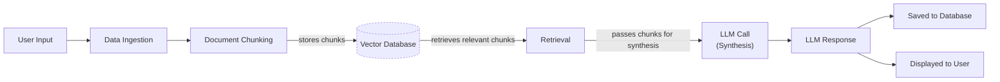
Image 1: A flowchart illustrating a simple LLM Workflow.

On the other hand, AI agents are systems where an LLM plays a central role in dynamically planning the sequence of steps, reasoning, and actions to achieve a goal [[1]](https://cloud.google.com/discover/what-are-ai-agents). The steps are not defined in advance but are planned based on the task and the current state of the environment. This makes agents adaptive and capable of handling novelty, with the LLM driving autonomy in decision-making. An agent is like a skilled human expert tackling an unfamiliar problem, adapting their approach with each new piece of information. These systems are defined by their ability to reason, act, observe their environment, and even collaborate and self-refine over time [[1]](https://cloud.google.com/discover/what-are-ai-agents). They rely on concepts we will cover later in the course, such as tools, memory, and ReAct agents.

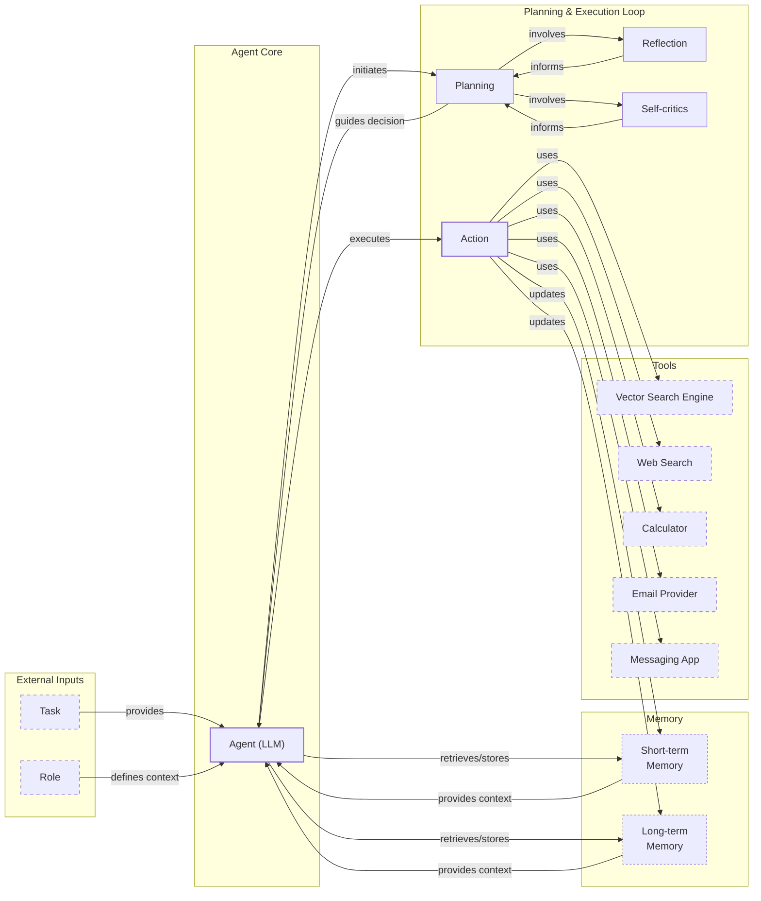
Image 2: A diagram illustrating a simple Agentic System. (Source [Decoding ML](https://decodingml.substack.com/p/llmops-for-production-agentic-rag))

Both workflows and agents require an orchestration layer, but its nature differs. In workflows, the orchestrator executes a predefined plan. In agents, it facilitates the LLM's dynamic planning and execution [[2]](https://towardsdatascience.com/a-developers-guide-to-building-scalable-ai-workflows-vs-agents/). This distinction between developer-defined logic and LLM-driven autonomy is the core difference we will explore next.

## Choosing Your Path

In the previous section, we defined LLM workflows and AI agents. Now, we will explore their core differences: developer-defined logic versus LLM-driven autonomy in reasoning and action selection. Most real-world systems are not purely one or the other but exist on a spectrum. This creates a trade-off: as you give the agent more control, the application's reliability often decreases [[3]](https://decodingml.substack.com/p/llmops-for-production-agentic-rag).

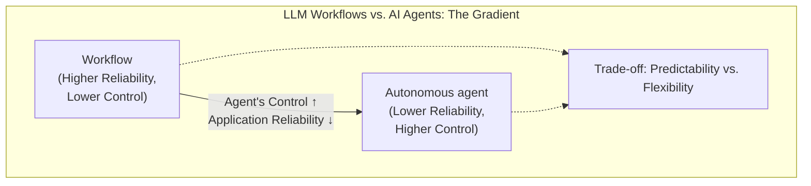
Image 3: A diagram illustrating the gradient between LLM Workflows and AI Agents, showing the trade-off between control and reliability.

### When to Use LLM Workflows

Workflows are best for tasks with a well-defined structure [[4]](https://www.anthropic.com/engineering/building-effective-agents). Examples include pipelines for data extraction, automated report generation, and document summarization followed by translation. They are also ideal for repetitive tasks like sending emails or transforming articles into social media posts. Similar principles apply in logistics, where automated workflows handle tasks like invoice auditing and shipment tracking, which demand high reliability [[19]](https://www.mindstudio.ai/blog/logistics-supply-chain/). The main strengths of workflows are their predictability and reliability. Debugging is easier because the paths are fixed, and operational costs are more predictable, especially since you can use smaller, specialized models for sub-tasks. However, workflows can be rigid. They require more development time since each step is manually engineered, and adding new features can become complex.

Enterprises in regulated fields like finance and healthcare often prefer workflows because they require predictable programs that work consistently. For a financial advisor, a report must be accurate every time. For a medical diagnostic tool, high accuracy is non-negotiable. Workflows are also ideal for building Minimum Viable Products (MVPs) and for high-frequency scenarios where the cost per request is more important than sophisticated reasoning [[2]](https://towardsdatascience.com/a-developers-guide-to-building-scalable-ai-workflows-vs-agents/).

### When to Use AI Agents

AI agents are better suited for open-ended or dynamic problems. Examples include complex customer support, debugging code, or interactive tasks like booking a flight without a predefined set of websites. The primary strength of agents is their adaptability. They can handle ambiguity and complexity because their steps are decided dynamically.

However, this flexibility comes with weaknesses. Agents are more prone to errors and can be unreliable due to their non-deterministic nature. This unreliability is not trivial; it is a product of compounding errors. For a multi-step task, even a 95% success rate at each individual step can lead to an overall failure rate of over 40% after just ten steps [[20]](https://dev.to/wassimchegham/why-your-ai-agent-demo-falls-apart-in-production-1320). In production, some studies report that agents fail to complete their assigned tasks correctly 70% to 95% of the time without human intervention [[21]](https://www.fiddler.ai/blog/ai-agent-failure-rate). Performance, latency, and costs can vary with each call. They often require larger, more expensive LLMs to generalize effectively and make more API calls to complete a task, increasing costs. There are also significant security concerns, especially with write operations. An improperly designed agent could delete data or send inappropriate emails. Finally, agents are notoriously difficult to debug and evaluate [[2]](https://towardsdatascience.com/a-developers-guide-to-building-scalable-ai-workflows-vs-agents/), [[5]](https://decodingml.substack.com/p/stop-building-ai-agents). There are even stories of developers having their code deleted by an agent, joking, "Anyway, I wanted to start a new project."

### Hybrid Approaches and the Autonomy Slider

Most real-world systems are a hybrid, blending the stability of workflows with the flexibility of agents. This is where the concept of an "autonomy slider" comes in, a term coined by Andrej Karpathy [[6]](https://www.youtube.com/watch?v=LCEmiRjPEtQ), [[7]](https://andrewships.substack.com/p/autonomy-sliders). This slider allows you to decide how much control to give the LLM versus the user. At the manual end, you have a workflow with a human verifying each step. At the automatic end, you have a fully autonomous agent. This concept has historical roots in automation research, with frameworks like Sheridan & Verplanck's 10 levels of automation dating back to 1978, providing a structured way to think about the human-computer partnership [[7]](https://andrewships.substack.com/p/autonomy-sliders).

Coding assistants like Cursor illustrate this well. You can use simple tab-completion (low autonomy), ask it to change a specific block of code (Cmd+K), the entire file (Cmd+L), or let it operate on the whole repository (Cmd+I) in full agent mode. Similarly, Perplexity offers a quick search, a more involved "research" mode, and a "deep research" mode that gives the AI significant autonomy [[6]](https://www.youtube.com/watch?v=LCEmiRjPEtQ).

The goal is to create a fast and efficient loop between AI generation and human verification. This is often achieved through a well-designed architecture and a thoughtful user interface that allows for easy supervision and intervention.

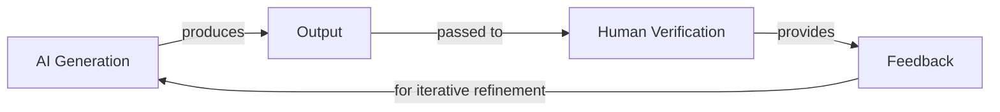
Image 4: A circular flowchart illustrating the AI Generation and Human Verification Loop, emphasizing human supervision and iterative refinement for efficiency.

This blend of structured process and dynamic decision-making is also seen in other advanced fields. For example, in healthcare robotics, systems often use a phased workflow that first translates a human request into a high-level plan, and only then generates specific, executable commands for the robot, ensuring both flexibility and safety [[22]](https://medium.com/ai-robotics-for-built-environment/llm-agents-for-adaptive-healthcare-robotics-series-1-2-adjusting-llm-output-with-human-feedback-19e9b7365e41). This hybrid approach, balancing control and autonomy, is made possible by a set of powerful architectural patterns. Understanding these patterns is the next step in learning how to design effective AI systems.

## Exploring Common Patterns

To build your intuition for AI engineering, you will now look at some of the most common patterns for building both workflows and agents. We will keep these explanations high-level, as we will cover each one in detail in future lessons.

### LLM Workflows

Workflows are all about structuring a sequence of LLM calls and other operations. Here are a few foundational patterns.

**Chaining and routing** are the simplest forms of automation. Chaining connects multiple LLM calls in a sequence, where the output of one step becomes the input for the next [[27]](https://mirascope.com/blog/llm-chaining). This is useful for tasks that naturally break down into ordered sub-tasks, like translating a document and then verifying its accuracy [[28]](https://mlpills.substack.com/p/issue-110-llm-workflow-patterns). This structured approach improves transparency and makes debugging easier, as you can analyze the performance of each stage independently [[36]](https://www.promptingguide.ai/techniques/prompt_chaining). Routing adds a decision-making layer, allowing the workflow to choose between different paths based on the input [[4]](https://www.anthropic.com/engineering/building-effective-agents). For instance, a customer support system might route a billing question to one workflow and a technical question to another, each handled by a specialized LLM sub-chain [[37]](https://www.geeksforgeeks.org/artificial-intelligence/llm-chains/). This helps you glue together multiple LLM calls and guide the system toward the most appropriate action.

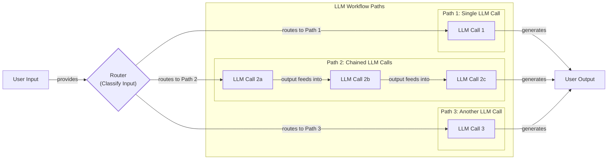
Image 5: A flowchart illustrating the Chaining and Routing pattern in LLM workflows.

The **orchestrator-worker** pattern provides a more dynamic approach. A central orchestrator LLM acts as a "project manager," analyzing the user's intent, breaking the task into sub-tasks, and delegating them to specialized worker LLMs or tools [[4]](https://www.anthropic.com/engineering/building-effective-agents), [[8]](https://platform.claude.com/cookbook/patterns-agents-orchestrator-workers), [[29]](https://online.stevens.edu/blog/building-self-healing-ai-orchestrator-reflexion-patterns/). This is ideal for complex tasks where the sub-tasks are not known in advance [[29]](https://online.stevens.edu/blog/building-self-healing-ai-orchestrator-reflexion-patterns/). For example, a product launch analysis might require different workers for market research, competitive analysis, and financial forecasting, all coordinated by the orchestrator [[30]](https://mlpills.substack.com/p/diy-17-orchestrator-worker-llm-agent). A key advantage is parallelization, where the orchestrator can assign independent tasks to multiple workers to be executed simultaneously, leading to significant speed improvements [[29]](https://online.stevens.edu/blog/building-self-healing-ai-orchestrator-reflexion-patterns/). This allows the system to dynamically decide which actions to take, creating a smooth transition from rigid workflows to more flexible, agent-like behavior.

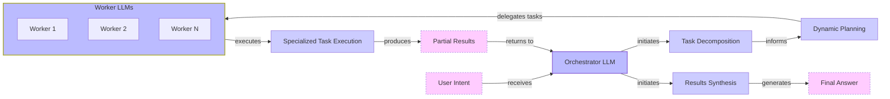
Image 6: An architecture diagram illustrating the Orchestrator-Worker pattern.

The **evaluator-optimizer loop** is a pattern for auto-correcting LLM outputs. It functions as a cognitive feedback loop where one LLM generates a response, while another evaluates it against a set of criteria [[4]](https://www.anthropic.com/engineering/building-effective-agents), [[9]](https://platform.claude.com/cookbook/patterns-agents-evaluator-optimizer), [[38]](https://docs.aws.amazon.com/prescriptive-guidance/latest/agentic-ai-patterns/evaluator-reflect-refine-loop-patterns.html). If the output falls short, the evaluator provides feedback (a reflection), and the generator refines its response. This is similar to how a human writer might revise a draft based on an editor's comments. This pattern is effective when evaluation criteria are clear and iterative refinement adds value. For example, in code generation, unit tests can provide objective, external feedback that allows the model to correct its own errors, a process that has been shown to be more effective than pure self-reflection without external signals [[31]](https://vadim.blog/the-research-on-llm-self-correction). This pattern is rapidly evolving, with new research focusing on more structured reflection techniques and integrating multimodal feedback from images or user interfaces, not just text [[23]](https://aclanthology.org/2025.findings-emnlp.1384.pdf).

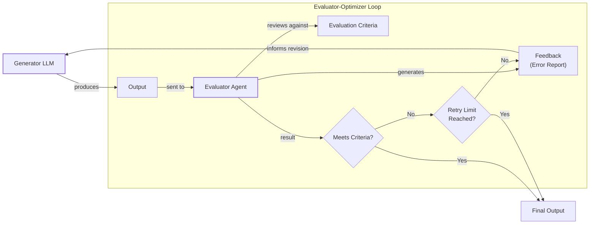
Image 7: A flowchart illustrating the Evaluator-Optimizer Loop pattern for automated LLM result correction.

### Core Components of a ReAct AI Agent

The ReAct (Reason and Act) pattern is at the heart of most modern agents. It enables an agent to reason about a task, decide on an action, execute it, observe the outcome, and repeat the cycle until the task is complete.

A ReAct agent typically consists of a few core components:
*   An **LLM** to reason about the task and decide which actions to take.
*   A set of **tools** (or actions) that allow the agent to interact with its external environment. We will cover tools in detail in Lesson 6.
*   **Short-term memory** to keep track of the current task, like RAM in a computer.
*   **Long-term memory** to access factual data and remember user preferences. We will explore memory in Lesson 9.

This pattern has shown the most potential for building capable agents, and we will cover it in detail in Lessons 7 and 8.

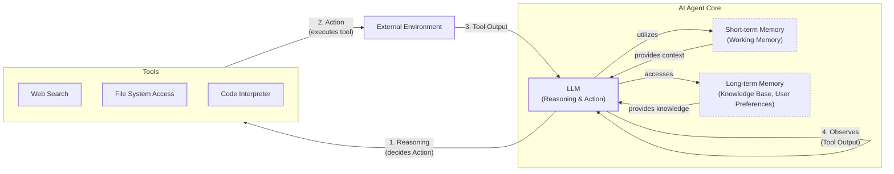
Image 8: A high-level architecture diagram illustrating the core components and dynamics of an AI agent using the ReAct pattern.

## Zooming In on Our Favorite Examples

To anchor these concepts in the real world, let's look at a few examples, from a simple workflow to a more advanced hybrid system. We will keep these explanations high-level and intuitive.

### Document Summarization and Analysis Workflow by Gemini in Google Workspace

Finding the right information in large documents can be a time-consuming process. A quick, embedded summarization feature can guide your search and save valuable time. The "Summary by Gemini" feature in Google Workspace is a perfect example of a pure, multi-step workflow [[10]](https://support.google.com/docs/answer/15627020?hl=en), [[11]](https://cloud.google.com/blog/products/ai-machine-learning/long-document-summarization-with-workflows-and-gemini-models). When a user opens a PDF in Google Drive, a "Summary by Gemini" panel can automatically appear, generating a concise summary and suggesting follow-up questions [[32]](https://masterconcept.ai/blog/new-google-workspace-gemini-feature-your-pdfs-now-write-their-own-summaries-and-suggest-next-steps/).

This workflow is a simple chain of LLM calls and operations. For long documents that exceed the model's context window, it uses a map-reduce approach. This technique, common in large-scale data processing, is adapted here for text. The document is first split into smaller, manageable chunks that fit within the LLM's context window. The "map" step involves sending each chunk to the LLM in parallel to generate individual summaries. This parallel execution is significantly faster than processing the chunks sequentially. In the final "reduce" step, all the partial summaries are concatenated and sent to the LLM one last time to create a single, cohesive summary of the entire document [[11]](https://cloud.google.com/blog/products/ai-machine-learning/long-document-summarization-with-workflows-and-gemini-models). Each step is predefined, making it a reliable and predictable process.

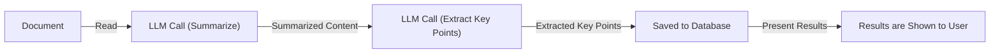
Image 9: A flowchart illustrating the Document Summarization and Analysis Workflow by Gemini in Google Workspace.

### Gemini CLI Coding Assistant

Writing code is a slow process that often requires reading dense documentation or outdated blogs. A coding assistant can speed this up. The open-source Gemini CLI is a great example of a single-agent system for coding that uses the ReAct architecture [[12]](https://blog.google/technology/developers/introducing-gemini-cli-open-source-ai-agent/), [[13]](https://developers.google.com/gemini-code-assist/docs/gemini-cli). It can help you write code from scratch, assist with specific functions, generate documentation, and quickly understand new codebases.

Based on our research from August 2025, the Gemini CLI operates in a loop:
1.  **Context Gathering:** The system loads the directory structure, available tools, and conversation history into its working memory. It creates an initial snapshot of the file and folder tree to get a high-level sense of the project's layout without reading file contents [[33]](https://wietsevenema.eu/blog/2025/how-gemini-cli-builds-context/). It also loads context from special `GEMINI.md` files found in the project directory and its parent folders, which provide persistent instructions and project-specific information [[34]](https://geminicli.com/docs/cli/gemini-md/).
2.  **LLM Reasoning:** The Gemini model analyzes the user's request and the current context to plan the necessary actions. This is the "reason" part of the ReAct loop.
3.  **Human in the Loop:** Before executing potentially destructive actions, it can validate the execution plan with the user, ensuring a layer of safety.
4.  **Tool Execution:** The agent executes actions (tools) like file operations, web requests, or code generation. This is the "act" part of the loop. The results are then added back to the context as an "observation" for the next reasoning step.
5.  **Evaluation:** It dynamically evaluates the generated code, for example by running or compiling it, to check for errors.
6.  **Loop Decision:** The agent decides if the task is complete or if it needs to repeat the cycle, planning and executing more tools based on the new observations.

This loop allows the agent to use a variety of tools, including file system access to read code with `grep` or list directories, a code interpreter for dynamic validation, web search for accessing documentation, and even version control tools like Git to automatically commit changes.

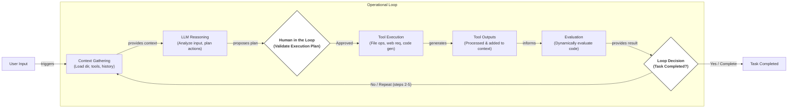
Image 10: Flowchart illustrating the operational loop of the "Gemini CLI Coding Assistant" based on the ReAct pattern.

### Perplexity Deep Research Agent

Researching a new topic can be daunting. You often do not know where to start. A research assistant that scans the internet and compiles a report can be a huge help. Perplexity's Deep Research feature is a notable hybrid system that combines ReAct reasoning with workflow patterns to perform autonomous, expert-level research [[14]](https://www.perplexity.ai/hub/blog/introducing-perplexity-deep-research).

This closed-source system uses multiple specialized agents orchestrated in parallel. It performs dozens of searches across hundreds of sources to synthesize comprehensive reports in just a few minutes. Based on our research, here is a simplified version of how it might work:
1.  **Research Planning & Decomposition:** An orchestrator agent, likely a powerful model like Claude Opus, analyzes the research question and breaks it down into targeted sub-questions. It then deploys multiple specialized research agents, each assigned to a sub-question. This use of an orchestrator to manage a team of sub-agents is a key architectural insight, separating the high-level reasoning from the specific task execution [[15]](https://zenvanriel.com/ai-engineer-blog/perplexity-computer-multi-model-agent-orchestration/).
2.  **Parallel Information Gathering:** Each specialized agent runs in parallel, using tools like web search and document retrieval to gather information on its assigned sub-question. This parallel execution is a key advantage, allowing the system to explore multiple avenues of research simultaneously and asynchronously [[35]](https://www.gend.co/blog/perplexity-computer-ai-agent-orchestration/).
3.  **Analysis & Synthesis:** After gathering sources, each agent validates and scores them based on relevance and credibility. It then ranks the top sources and summarizes them into a partial report.
4.  **Iterative Refinement & Gap Analysis:** The orchestrator collects the partial reports, identifies knowledge gaps, and generates follow-up queries. This iterative process allows the system to refine its research plan as it learns more, repeating the cycle until the research is complete or a step limit is reached. This dynamic, multi-step workflow is a core feature of Perplexity's Agent API, which maintains context across the entire process [[39]](https://www.digitalapplied.com/blog/perplexity-agent-api-platform-ai-search-developer-guide).
5.  **Report Generation:** Finally, the orchestrator combines the results from all agents into a final, comprehensive report with inline citations.

This hybrid system combines the structured planning of a workflow with the dynamic adaptation of agents, allowing it to tackle complex research tasks efficiently [[14]](https://www.perplexity.ai/hub/blog/introducing-perplexity-deep-research), [[15]](https://zenvanriel.com/ai-engineer-blog/perplexity-computer-multi-model-agent-orchestration/).

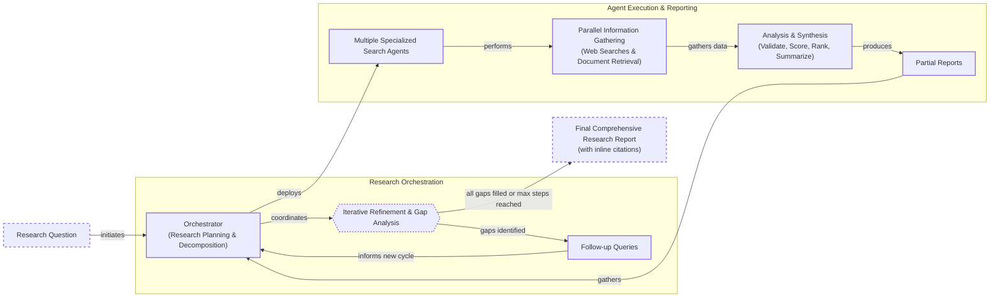
Image 11: Flowchart illustrating the iterative multi-step process of "Perplexity Deep Research Agent"

The business case for such a complex architecture is grounded in tangible returns. For automated research and analysis tasks, orchestrator-worker systems can yield significant productivity gains, with some benchmarks showing operational cost reductions of 20-35% and error reductions of over 50% in related automation workflows [[24]](https://www.onabout.ai/p/mastering-multi-agent-orchestration-architectures-patterns-roi-benchmarks-for-2025-2026). This demonstrates how hybrid designs can justify their development cost by delivering measurable business value.

## The Challenges of Every AI Engineer

Now that you understand the spectrum from LLM workflows to AI agents, it is important to recognize that every AI Engineer faces these same fundamental challenges when designing a new AI application. This architectural decision is one of the core factors that determine whether your project succeeds in production or fails spectacularly.

You will face reliability issues. Your agent might work perfectly in demos but become unpredictable with real users, as LLM reasoning failures can compound through multi-step processes [[16]](https://arxiv.org/html/2510.25423v2). The math is unforgiving: even at 99% per-step accuracy, a 20-step agent fails nearly one in five times [[20]](https://dev.to/wassimchegham/why-your-ai-agent-demo-falls-apart-in-production-1320). You will face context limits, where systems struggle to maintain coherence across long conversations. This phenomenon, often called "context rot," occurs as the context window fills, diluting the model's attention and causing it to forget early instructions or constraints that get "lost in the middle" [[25]](https://redis.io/blog/context-rot/). You will need to build data integration pipelines to pull information from various sources while ensuring only high-quality data is used. You will also run into the cost-performance trap, where sophisticated agents deliver impressive results but are too expensive to be economically feasible. Finally, you will need to address security concerns, as autonomous agents with write permissions could delete files, expose sensitive data, or be exploited through chained vulnerabilities where a flaw in one agent cascades to others [[17]](https://www.cyberark.com/resources/blog/the-agentic-ai-revolution-5-unexpected-security-challenges).

These challenges are solvable. In upcoming lessons, we will cover patterns for building reliable products through specialized evaluation and monitoring pipelines, strategies for building hybrid systems, and ways to keep costs and latency under control. The industry is moving toward agents that can understand and process information from text, images, and audio combined, and we will explore how to handle this multimodal data [[26]](https://aiera.blog/latest-ai-trends-2026-what-actually-changing-and-how-it/). In our next lesson, we will explore how to get structured and reliable information out of an LLM. Later, we will cover topics like memory, tools, and advanced agentic patterns like ReAct.

Your path forward as an AI engineer is about mastering these realities. By the end of this course, you will have the knowledge to architect AI systems that are not only powerful but also dependable, efficient, and safe. You will know when to use workflows, when to deploy an agent, and how to build effective hybrid systems that work in the real world.

## References

- [1] https://cloud.google.com/discover/what-are-ai-agents
- [2] https://towardsdatascience.com/a-developers-guide-to-building-scalable-ai-workflows-vs-agents/
- [3] https://decodingml.substack.com/p/llmops-for-production-agentic-rag
- [4] https://www.anthropic.com/engineering/building-effective-agents
- [5] https://decodingml.substack.com/p/stop-building-ai-agents
- [6] https://www.youtube.com/watch?v=LCEmiRjPEtQ
- [7] https://andrewships.substack.com/p/autonomy-sliders
- [8] https://platform.claude.com/cookbook/patterns-agents-orchestrator-workers
- [9] https://platform.claude.com/cookbook/patterns-agents-evaluator-optimizer
- [10] https://support.google.com/docs/answer/15627020?hl=en
- [11] https://cloud.google.com/blog/products/ai-machine-learning/long-document-summarization-with-workflows-and-gemini-models
- [12] https://blog.google/technology/developers/introducing-gemini-cli-open-source-ai-agent/
- [13] https://developers.google.com/gemini-code-assist/docs/gemini-cli
- [14] https://www.perplexity.ai/hub/blog/introducing-perplexity-deep-research
- [15] https://zenvanriel.com/ai-engineer-blog/perplexity-computer-multi-model-agent-orchestration/
- [16] https://arxiv.org/html/2510.25423v2
- [17] https://www.cyberark.com/resources/blog/the-agentic-ai-revolution-5-unexpected-security-challenges
- [18] https://www.prefect.io/blog/brief-history-of-workflow-orchestration
- [19] https://www.mindstudio.ai/blog/logistics-supply-chain/
- [20] https://dev.to/wassimchegham/why-your-ai-agent-demo-falls-apart-in-production-1320
- [21] https://www.fiddler.ai/blog/ai-agent-failure-rate
- [22] https://medium.com/ai-robotics-for-built-environment/llm-agents-for-adaptive-healthcare-robotics-series-1-2-adjusting-llm-output-with-human-feedback-19e9b7365e41
- [23] https://aclanthology.org/2025.findings-emnlp.1384.pdf
- [24] https://www.onabout.ai/p/mastering-multi-agent-orchestration-architectures-patterns-roi-benchmarks-for-2025-2026
- [25] https://redis.io/blog/context-rot/
- [26] https://aiera.blog/latest-ai-trends-2026-what-actually-changing-and-how-it/
- [27] https://mirascope.com/blog/llm-chaining
- [28] https://mlpills.substack.com/p/issue-110-llm-workflow-patterns
- [29] https://online.stevens.edu/blog/building-self-healing-ai-orchestrator-reflexion-patterns/
- [30] https://mlpills.substack.com/p/diy-17-orchestrator-worker-llm-agent
- [31] https://vadim.blog/the-research-on-llm-self-correction
- [32] https://masterconcept.ai/blog/new-google-workspace-gemini-feature-your-pdfs-now-write-their-own-summaries-and-suggest-next-steps/
- [33] https://wietsevenema.eu/blog/2025/how-gemini-cli-builds-context/
- [34] https://geminicli.com/docs/cli/gemini-md/
- [35] https://www.gend.co/blog/perplexity-computer-ai-agent-orchestration
- [36] https://www.promptingguide.ai/techniques/prompt_chaining
- [37] https://www.geeksforgeeks.org/artificial-intelligence/llm-chains/
- [38] https://docs.aws.amazon.com/prescriptive-guidance/latest/agentic-ai-patterns/evaluator-reflect-refine-loop-patterns.html
- [39] https://www.digitalapplied.com/blog/perplexity-agent-api-platform-ai-search-developer-guide