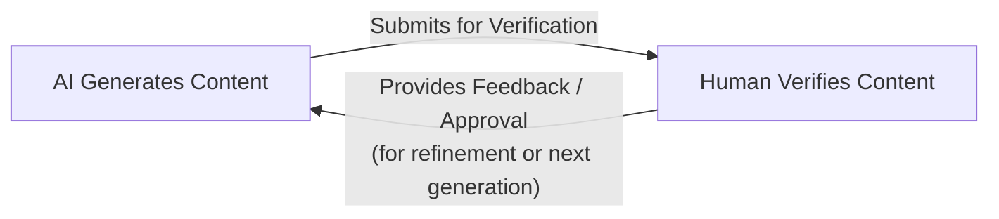
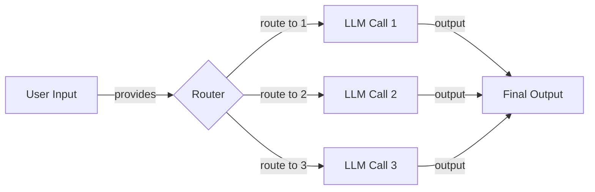
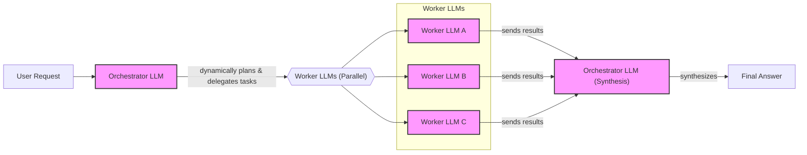
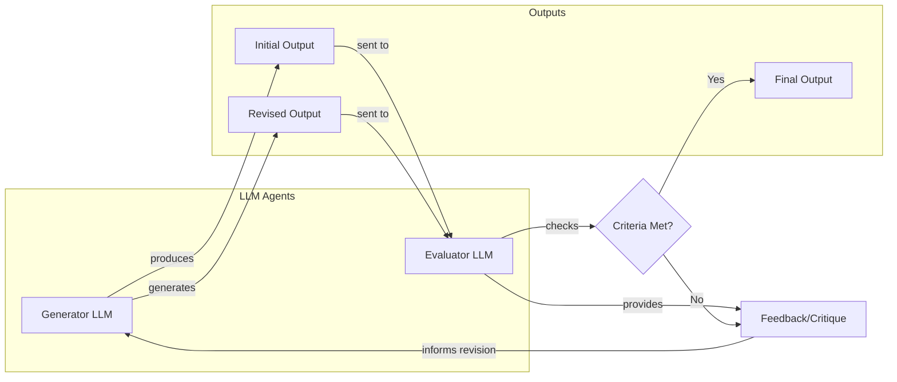
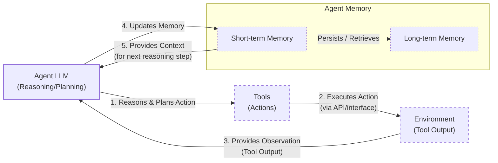
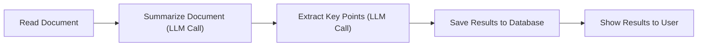
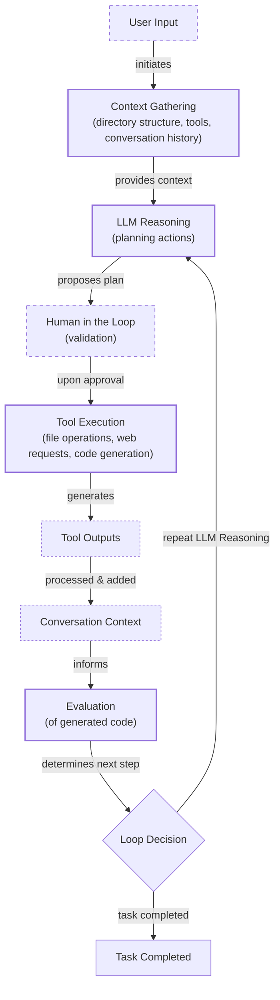
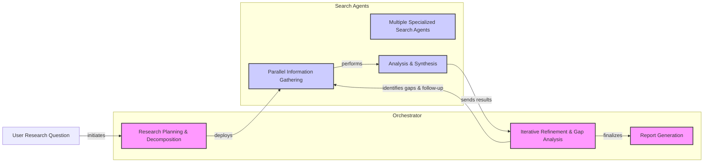

# Lesson 2: AI Workflows vs. AI Agents

As an AI engineer preparing to build your first real AI application, after narrowing down the problem you want to solve, one key decision is how to design your AI solution. Should it follow a predictable, step-by-step workflow, or does it demand a more autonomous approach, where the LLM makes self-directed decisions along the way? Thus, one of the fundamental questions that will determine the success or failure of your project is: How should you architect your AI system?

When building AI applications, engineers face this critical architectural decision early in their development process. Should they create a predictable, step-by-step workflow where they control every action, or should they build an autonomous agent that can think and decide for itself? This is one of the key decisions that will impact everything from development time and costs to reliability and user experience.

Choose the wrong approach and you might end up with an overly rigid system that breaks when users deviate from expected patterns, or an unpredictable agent that works brilliantly 80% of the time but fails catastrophically when it matters most. Months of development time can be wasted rebuilding the entire architecture, leading to frustrated users who cannot rely on the application and executives who cannot afford to keep it running.

In 2024 and 2025, we have seen billion-dollar AI startups succeed or fail based primarily on this architectural decision. The most successful teams and AI engineers know when to use workflows versus agents and, more importantly, how to combine both approaches effectively.

By the end of this lesson, we will provide you with a framework to confidently make this critical decision. You will understand the fundamental trade-offs between LLM workflows and AI agents, see real-world examples from leading AI companies, and learn how to design systems that leverage the best of both worlds.

## Understanding the Spectrum: From Workflows to Agents

Before we can choose between them, we need a clear understanding of what LLM workflows and AI agents are. For now, we will focus not on the technical specifics, but on their core properties and how they are used in practice.

### LLM Workflows

An LLM workflow is a sequence of tasks that involves one or more LLM calls, orchestrated by developer-written code. Think of it as a factory assembly line: each step is defined in advance, leading to a deterministic, rule-based path with a predictable execution flow. You, the developer, are in complete control. The logic is explicit, the paths are fixed, and if something breaks, you can trace it back to a specific step.

This is the architecture behind most of the reliable AI applications you see today, from simple data extraction pipelines to automated report generation. In future lessons, we will explore common workflow patterns like chaining, routing, and the orchestrator-worker model, but the core principle remains the same: the developer defines the logic.

<https://substackcdn.com/image/fetch/f_auto,q_auto:good,fl_progressive:steep/https://substack-post-media.s3.amazonaws.com/public/images/5e64d5e0-7ef1-4e7f-b441-3bf1fef4ff9a_1276x818.png>
Image 1: A comparison of a fixed, predefined workflow versus a dynamic, adaptive agent. (Source [Exploring the difference between agents and workflows](https://decodingml.substack.com/p/llmops-for-production-agentic-rag) [[38]](https://decodingml.substack.com/p/llmops-for-production-agentic-rag))

### AI Agents

In contrast, an AI agent is a system where the LLM itself dynamically decides the sequence of steps, reasoning, and actions needed to achieve a goal. The path is not defined in advance; it emerges as the agent interacts with its environment and learns from the outcomes of its actions.

Imagine a skilled human expert tackling an unfamiliar problem. They do not follow a script. They assess the situation, form a plan, try something, observe the result, and adapt their next move accordingly. This is the essence of an agentic system. It is flexible, adaptive, and capable of handling ambiguity and novelty in ways that a rigid workflow cannot. To achieve this, agents are equipped with the ability to perform actions (which we will cover as "tools" in Lesson 6) and maintain memory of past interactions (a topic for Lesson 9). Most modern agents use a reasoning pattern known as ReAct, which we will explore in detail in Lessons 7 and 8.

### The Evolution from Expert Systems to LLM Agents

This distinction between developer-defined workflows and LLM-driven agents is not entirely new; it mirrors the historical evolution of AI itself. Early "expert systems" from the 1970s, designed to capture the knowledge of human experts for tasks like medical diagnosis, were the precursors to modern workflows [[52]](https://www.ibm.com/think/topics/evolution-of-ai-agents). These systems operated on hand-coded knowledge bases and rigid, rule-based logic. They were powerful in their narrow domains but brittle and unable to handle any task outside their pre-defined scope.

For decades, AI research sought to overcome these limitations. The breakthrough came not from classical agent research but from the development of LLMs, which provided a general-purpose cognitive core capable of understanding open-ended instructions and planning for novel situations [[52]](https://www.ibm.com/think/topics/evolution-of-ai-agents). This enabled the shift from static, rule-based systems to the dynamic, learning-driven agents we have today, finally delivering on the promise of AI that can reason and act autonomously in complex environments [[53]](https://www.linkedin.com/pulse/day-1-evolution-ai-agents-from-rule-based-systems-joaquin-marques-m3j5e).

### The Role of Orchestration

Both workflows and agents require an orchestration layer to manage their execution. However, the role of this layer is fundamentally different in each case. In a workflow, the orchestrator is like a project manager executing a predefined plan, ensuring each step happens in the correct order. In an agentic system, the orchestrator acts more like a facilitator, providing the LLM with the resources it needs to plan and execute its own path. The developer builds the environment, but the LLM drives the action.

## Choosing Your Path

The core difference between these two approaches comes down to a single question: who is in control? In a workflow, the developer defines the logic. In an agent, the LLM drives the reasoning and action selection. This distinction creates a spectrum of autonomy, and where your application should sit on this spectrum depends entirely on your use case.

<https://substackcdn.com/image/fetch/f_auto,q_auto:good,fl_progressive:steep/https%3A%2F%2Fsubstack-post-media.s3.amazonaws.com%2Fpublic%2Fimages%2F3bf927de-ab95-449f-b936-7ccb3ab5f448_1587x526.png>
Image 2: The trade-off between application reliability and the agent's level of control. (Source [Stop Building AI Agents: Here’s what you should build instead](https://decodingml.substack.com/p/stop-building-ai-agents) [[46]](https://decodingml.substack.com/p/stop-building-ai-agents))

### When to Use LLM Workflows

Workflows shine in scenarios where the task is well-defined and repeatable. If you can map out the steps required to get from input to output, a workflow is almost always the right choice. Examples include pipelines for data extraction from sources like Slack or Google Drive, automated generation of reports or emails, and content repurposing, such as turning an article into a series of social media posts [[31]](https://cloud.google.com/transform/101-real-world-generative-ai-use-cases-from-industry-leaders).

The primary strength of workflows is their predictability. Because the paths are fixed, they are reliable, easier to debug, and their operational costs and latency are more consistent. This makes them ideal for enterprise environments and regulated fields like finance and healthcare, where a high degree of accuracy and auditability is non-negotiable [[32]](https://towardsdatascience.com/a-developers-guide-to-building-scalable-ai-workflows-vs-agents/). However, this rigidity is also their main weakness. They can be brittle when faced with unexpected inputs, and adding new features can become complex as the application grows.

### When to Use AI Agents

Agents are best suited for open-ended, dynamic problems where the path to a solution cannot be determined in advance. Think of tasks like complex, multi-turn customer support conversations, in-depth research on a novel topic, or debugging a novel issue in a large codebase.

The strength of agents lies in their adaptability. They can handle ambiguity, learn from their mistakes, and devise creative solutions to unfamiliar problems. However, this autonomy comes at a cost. Agentic systems are inherently non-deterministic, which means their performance, latency, and cost can vary with each run. This makes them less reliable and much harder to debug and evaluate [[15]](https://arxiv.org/html/2510.25423v2). They often require larger, more expensive models to power their reasoning, and their iterative nature can lead to a higher number of LLM calls per task. Security is also a major concern, as an agent with write permissions could potentially delete data or send inappropriate communications. Some users have even joked about their code being deleted by an agent, saying, "Anyway, I wanted to start a new project."

### Hybrid Approaches: The Autonomy Slider

In reality, the choice is rarely a binary one. Most production-grade AI systems are hybrids, blending the reliability of workflows with the flexibility of agents. Andrej Karpathy introduced the concept of an "autonomy slider," a design pattern that allows the user or developer to adjust the level of control given to the AI [[39]](https://www.youtube.com/watch?v=LCEmiRjPEtQ).

For example, the AI-powered code editor Cursor allows a developer to move from simple tab-completion (low autonomy) to suggesting changes for a block of code (`Cmd+K`), the entire file (`Cmd+L`), or even making changes across the whole repository in agent mode (`Cmd+I`) [[39]](https://www.youtube.com/watch?v=LCEmiRjPEtQ). Similarly, the answer engine Perplexity offers different levels of autonomy: a simple `search`, a multi-step `research` mode, and a comprehensive `deep research` mode that can take several minutes to generate a detailed report [[10]](https://medium.com/@ben_pouladian/software-3-0-software-in-the-age-of-ai-b25533da93b6), [[11]](https://andrewships.substack.com/p/autonomy-sliders).

The goal of any AI application is to accelerate the iterative loop between AI generation and human verification. A well-designed architecture, whether it is a workflow, an agent, or a hybrid, combined with a thoughtful user interface, is key to making this loop as fast and efficient as possible.

Image 3: A circular diagram illustrating the iterative AI generation and human verification loop.

## Exploring Common Patterns

To build an intuition for AI engineering, it is useful to understand the common patterns used to construct both workflows and agents. We will cover these in depth in later lessons, but for now, let's look at a high-level overview.

### LLM Workflow Patterns

Workflows are built by composing a series of steps. Here are a few foundational patterns:

**Chaining and routing** is the simplest form of automation. It involves linking multiple LLM calls together in a sequence or using a routing step to guide the workflow between different options based on the input. This allows you to break down a complex task into a series of smaller, more manageable steps.

Image 4: A flowchart illustrating the "Chaining and Routing" pattern in LLM workflows.

The **orchestrator-worker** pattern introduces a layer of dynamic decision-making. A central "orchestrator" LLM analyzes the user's intent, breaks the task down into sub-tasks, and delegates them to specialized "worker" models or workflows. This provides a smooth transition from rigid workflows to more flexible, agent-like behavior, as the system can dynamically decide which actions to take [[25]](https://online.stevens.edu/blog/building-self-healing-ai-orchestrator-reflexion-patterns/), [[26]](https://mlpills.substack.com/p/diy-17-orchestrator-worker-llm-agent).

Image 5: A flowchart illustrating the Orchestrator-Worker pattern in LLM workflows.

The **evaluator-optimizer loop** is a pattern for self-correction. After an LLM generates an initial output, a second "evaluator" LLM assesses it against a set of criteria. If the output falls short, the evaluator provides feedback, and the original model revises its work. This loop continues until the output meets the required standard, mimicking the iterative process a human writer might use to refine a document [[30]](https://docs.aws.amazon.com/prescriptive-guidance/latest/agentic-ai-patterns/evaluator-reflect-refine-loop-patterns.html), [[33]](https://platform.claude.com/cookbook/patterns-agents-evaluator-optimizer). This pattern is directly inspired by event-driven feedback control loops from systems engineering and control theory, where a system monitors its own output, evaluates it against a desired state, and adjusts its actions accordingly [[30]](https://docs.aws.amazon.com/prescriptive-guidance/latest/agentic-ai-patterns/evaluator-reflect-refine-loop-patterns.html).

Image 6: A feedback loop diagram illustrating the "Evaluator-Optimizer" pattern.

### Core Components of a ReAct AI Agent

The ReAct (Reason and Act) framework is the dominant pattern for building modern AI agents. It enables an agent to autonomously decide what action to take, interpret the output of that action, and repeat the cycle until a task is complete.

At a high level, a ReAct agent consists of several core components:
-   An **LLM** that acts as the reasoning engine, planning the next action and interpreting the results from the environment.
-   A set of **tools** (actions) that allow the agent to interact with the external world, such as searching the web, querying a database, or calling an API. We will cover tools in detail in Lesson 6.
-   **Short-term memory** that functions like a computer's RAM, holding the context of the current conversation or task.
-   **Long-term memory** that provides access to factual knowledge, such as internal company documents or the public internet, and stores persistent information like user preferences. We will dedicate Lesson 9 to memory systems.

Image 7: A flowchart illustrating the high-level dynamics of an AI agent using the "ReAct pattern".

These patterns are the building blocks of modern AI engineering. You do not need to master them now, but having an intuitive grasp of them will help you understand the architectural choices behind the state-of-the-art systems we are about to explore.

## Zooming In on Our Favorite Examples

To anchor these concepts in the real world, let's analyze a few state-of-the-art examples, ranging from a simple workflow to a complex hybrid system. We will keep the explanations high-level, focusing on the design choices rather than the technical implementation.

### Document Summarization in Google Workspace: A Simple Workflow

**Problem:** Navigating large documents to find specific information is a time-consuming and often frustrating process for teams. A quick, embedded summary can provide immediate context and guide users to the relevant sections.

**Solution:** The document summarization feature in Google Workspace is a perfect example of a pure, multi-step workflow [[1]](https://support.google.com/docs/answer/15627020?hl=en). It follows a simple, linear chain of LLM calls to process a document and present a concise overview to the user.

Image 8: A sequential flowchart illustrating the "Document Summarization and Analysis Workflow by Gemini in Google Workspace".

The process is straightforward: the system reads the document, sends it to an LLM for summarization, potentially makes another call to extract key points, and then displays the results. There is no dynamic decision-making; the steps are hardcoded and predictable. This ensures reliability and consistency, which are essential for a feature used by millions of people.

### Gemini CLI: A Single-Agent System

**Problem:** Writing code is a complex, time-consuming process that involves reading documentation, understanding new codebases, and debugging issues. A coding assistant can dramatically accelerate this workflow.

**Solution:** The Gemini CLI is an open-source AI agent that brings the power of Gemini directly into a developer's terminal [[36]](https://blog.google/technology/developers/introducing-gemini-cli-open-source-ai-agent/). It leverages a ReAct architecture to function as a single, powerful agent for coding tasks [[5]](https://developers.google.com/gemini-code-assist/docs/gemini-cli). It can be used for "vibe coding" (writing code from scratch with natural language), assisting experienced engineers, generating documentation, and helping developers get up to speed on new codebases.

Here is a high-level look at its operational loop:

1.  **Context Gathering:** The agent starts by loading its context: the directory structure of the codebase, the set of available tools (like file system operations or web search), and the history of the current conversation [[40]](https://wietsevenema.eu/blog/2025/how-gemini-cli-builds-context/), [[42]](https://geminicli.com/docs/cli/gemini-md/).
2.  **LLM Reasoning:** The Gemini model analyzes the user's prompt and the available context to create a plan of action.
3.  **Human in the Loop:** Before executing, the agent often presents its plan to the user for validation.
4.  **Tool Execution:** Once approved, the agent executes the planned actions, which could involve reading files (`grep`), making web requests for documentation, or generating code diffs. The results of these actions are fed back into the agent's memory.
5.  **Evaluation:** The agent can dynamically evaluate the generated code, for example, by running it or attempting to compile it.
6.  **Loop Decision:** Based on the outcome, the agent decides whether the task is complete or if another cycle of reasoning and action is needed.

However, this power is not without its trade-offs. Scaling context to a large token window can lead to "context bloating," where irrelevant information degrades performance [[43]](https://medium.com/google-cloud/gemini-cli-tutorial-series-part-9-understanding-context-memory-and-conversational-branching-095feb3e5a43). Users have reported significant latency as the context size grows, and to mitigate this, recent versions of the CLI have introduced more aggressive auto-compression to manage the context window more effectively [[54]](https://github.com/google-gemini/gemini-cli/discussions/12311).

Image 9: Operational Loop of the Gemini CLI Coding Assistant

### Perplexity Deep Research: A Hybrid System

**Problem:** Researching a new or complex topic can be a daunting task. It is often difficult to know where to start, which sources are reliable, and how to synthesize information from multiple perspectives.

**Solution:** Perplexity's Deep Research mode is a sophisticated hybrid system that combines structured workflows with multiple autonomous agents to conduct expert-level research [[8]](https://www.perplexity.ai/hub/blog/introducing-perplexity-deep-research). While the exact implementation is closed-source, its behavior suggests a powerful blend of orchestration and agentic reasoning. It can perform dozens of searches across hundreds of sources to produce a comprehensive, cited report in just a few minutes.

Here is a simplified model of how it might work:

1.  **Research Planning & Decomposition:** An orchestrator agent analyzes the user's research question and breaks it down into a series of targeted sub-questions. This step leverages the orchestrator-worker pattern, deploying multiple specialized agents to tackle different facets of the research.
2.  **Parallel Information Gathering:** Each sub-question is assigned to a specialized search agent. These agents work in parallel, using tools like web search and document retrieval to gather a wide range of information. This parallelization speeds up the process and allows for a more comprehensive search.
3.  **Analysis & Synthesis:** Each agent independently analyzes the information it has gathered, scoring sources for credibility and relevance, ranking them, and summarizing the most important findings.
4.  **Iterative Refinement & Gap Analysis:** The orchestrator collects the reports from the worker agents and synthesizes them. It then analyzes the combined information to identify any knowledge gaps or areas that need further exploration. If gaps are found, it generates follow-up queries and repeats the process.
5.  **Report Generation:** Once the orchestrator determines that the research is complete, it generates a final, comprehensive report, complete with inline citations, and presents it to the user.

The effectiveness of this hybrid approach is demonstrated by its performance on several benchmarks. Perplexity's internal evaluations, using a production-grounded benchmark called DRACO, show it achieves state-of-the-art results in factual accuracy, depth of analysis, and citation quality across domains like Law and Academia [[55]](https://research.perplexity.ai/articles/evaluating-deep-research-performance-in-the-wild-with-the-draco-benchmark). On external benchmarks, it scores 93.9% on SimpleQA for factual recall and outperforms several leading models on Humanity's Last Exam [[56]](https://www.linkedin.com/posts/perplexity-ai_introducing-deep-research-on-perplexity-activity-7296217839827308546---0z). This performance is achieved while generating reports in 2-4 minutes, showcasing the efficiency of its vertically integrated system [[57]](https://sahanirakesh.medium.com/perplexity-ai-deep-research-detailed-explanation-guide-baf6fee43ce8).

Image 10: A complex iterative flowchart illustrating the "Perplexity Deep Research Iterative Multi-Step Process".

Perplexity's Deep Research agent is a powerful example of a hybrid system. It uses a structured, workflow-like process at the orchestration level to manage the overall research task, while leveraging the autonomy and flexibility of multiple agents at the execution level to gather and analyze information dynamically.

## The Challenges of Every AI Engineer

Now that you understand the spectrum from LLM workflows to AI agents, it is important to recognize that every AI engineer, whether at a startup or a Fortune 500 company, faces these same fundamental challenges when designing a new AI application. This architectural choice is one of the core decisions that determines whether your AI application succeeds in production or fails spectacularly.

As you begin your journey in AI engineering, you will constantly battle a series of recurring issues:
- **Reliability Issues:** Agentic systems that perform flawlessly in demos can become unpredictable with real users. A recent empirical study of developer discussions on Stack Overflow and GitHub found that runtime reliability, operational robustness, and orchestration control are among the most difficult and persistent challenges in agent development [[15]](https://arxiv.org/html/2510.25423v2).
- **Context Limits:** As conversations get longer, systems can lose track of their original purpose. This "context decay" is a common failure mode that degrades performance long before a model's context window is physically full [[18]](https://unit42.paloaltonetworks.com/agentic-ai-threats/).
- **Data Integration:** The "garbage-in, garbage-out" principle is amplified in AI systems. Building robust pipelines to pull clean, relevant data from disparate sources like Slack, APIs, and databases is a constant challenge.
- **The Cost-Performance Trap:** Highly sophisticated agents can produce impressive results, but often at a token cost that makes them economically unfeasible for many applications. Balancing performance with operational cost is a critical engineering trade-off.
- **Security Concerns:** Autonomous agents with the power to take action in the world introduce new threat vectors. An agent with write permissions could accidentally delete critical files, send incorrect emails, or be manipulated into exposing sensitive data [[16]](https://permiso.io/blog/8-critical-ai-security-challenges), [[19]](https://www.cyberark.com/resources/blog/the-agentic-ai-revolution-5-unexpected-security-challenges). These risks are significant enough that they are driving the creation of new enterprise governance frameworks and regulations specifically for autonomous AI systems [[58]](https://airia.com/voluntary-ai-standards-becoming-legal-requirements/).

These challenges are not reasons to avoid building with AI. They are the engineering problems that define the field. In the upcoming lessons, we will systematically tackle each of these issues. We will cover context engineering to manage information flow, structured outputs to ensure reliability, and patterns for building robust evaluation and monitoring pipelines. We will explore advanced reliability patterns, such as using Knowledge Graphs to ground agent reasoning in factual data [[59]](https://atlan.com/know/combining-knowledge-graphs-llms/), and new observability tools that use LLMs as graders to help debug agentic systems [[60]](https://galileo.ai/blog/debug-multi-agent-ai-systems). We will explore how to build hybrid systems that get the best of both worlds and how to keep costs and latency under control.

By the end of this course, you will have the knowledge to architect AI systems that are not only powerful but also robust, efficient, and safe. You will know when to use a workflow, when to deploy an agent, and how to build effective systems that work in the messy, unpredictable real world.

## References

- [1] Summarize your document in Docs with Gemini (Workspace Experiments). (n.d.). Google Docs Editors Help. [https://support.google.com/docs/answer/15627020?hl=en](https://support.google.com/docs/answer/15627020?hl=en)
- [2] New Google Workspace Gemini feature: Your PDFs now write their own summaries and suggest next steps. (n.d.). Master Concept. [https://masterconcept.ai/blog/new-google-workspace-gemini-feature-your-pdfs-now-write-their-own-summaries-and-suggest-next-steps/](https://masterconcept.ai/blog/new-google-workspace-gemini-feature-your-pdfs-now-write-their-own-summaries-and-suggest-next-steps/)
- [3] Long document summarization with Workflows and Gemini models. (n.d.). Google Cloud Blog. [https://cloud.google.com/blog/products/ai-machine-learning/long-document-summarization-with-workflows-and-gemini-models](https://cloud.google.com/blog/products/ai-machine-learning/long-document-summarization-with-workflows-and-gemini-models)
- [4] Google Workspace with Gemini. (n.d.). Google Workspace Knowledge. [https://knowledge.workspace.google.com/admin/gemini/google-workspace-with-gemini](https://knowledge.workspace.google.com/admin/gemini/google-workspace-with-gemini)
- [5] Gemini CLI. (n.d.). Google for Developers. [https://developers.google.com/gemini-code-assist/docs/gemini-cli](https://developers.google.com/gemini-code-assist/docs/gemini-cli)
- [6] Perplexity Computer: The Future of AI Agent Orchestration. (n.d.). ZENVANRIEL. [https://zenvanriel.com/ai-engineer-blog/perplexity-computer-multi-model-agent-orchestration/](https://zenvanriel.com/ai-engineer-blog/perplexity-computer-multi-model-agent-orchestration/)
- [7] Perplexity Computer: The Future of AI Agent Orchestration. (n.d.). Gend.co. [https://www.gend.co/blog/perplexity-computer-ai-agent-orchestration](https://www.gend.co/blog/perplexity-computer-ai-agent-orchestration)
- [8] Introducing Perplexity Deep Research. (2025, February 14). Perplexity Blog. [https://www.perplexity.ai/hub/blog/introducing-perplexity-deep-research](https://www.perplexity.ai/hub/blog/introducing-perplexity-deep-research)
- [9] The Perplexity Agent API Platform: A Developer’s Guide to the Future of AI Search. (n.d.). Digital Applied. [https://www.digitalapplied.com/blog/perplexity-agent-api-platform-ai-search-developer-guide](https://www.digitalapplied.com/blog/perplexity-agent-api-platform-ai-search-developer-guide)
- [10] Andrej Karpathy on Software 3.0: Software in the Age of AI. (2025, June 18). Medium. [https://medium.com/@ben_pouladian/andrej-karpathy-on-software-3-0-software-in-the-age-of-ai-b25533da93b6](https://medium.com/@ben_pouladian/andrej-karpathy-on-software-3-0-software-in-the-age-of-ai-b25533da93b6)
- [11] Autonomy Sliders. (2025, July 11). Andrew Ships. [https://andrewships.substack.com/p/autonomy-sliders](https://andrewships.substack.com/p/autonomy-sliders)
- [12] Mark Barbir on LinkedIn. (n.d.). LinkedIn. [https://www.linkedin.com/posts/markbarbir_andrej-karpathys-latest-talk-describes-our-activity-7343449417426837505-oTFx](https://www.linkedin.com/posts/markbarbir_andrej-karpathys-latest-talk-describes-our-activity-7343449417426837505-oTFx)
- [13] Software 3.0. (2025, June 14). Latent Space. [https://www.latent.space/p/s3](https://www.latent.space/p/s3)
- [14] Andrej Karpathy: Software is changing again. (2025, June 14). The Singju Post. [https://singjupost.com/andrej-karpathy-software-is-changing-again/](https://singjupost.com/andrej-karpathy-software-is-changing-again/)
- [15] What Challenges Do Developers Face in AI Agent Systems? An Empirical Study on Stack Overflow & GitHub Issues. (2025, October 25). arXiv. [https://arxiv.org/html/2510.25423v2](https://arxiv.org/html/2510.25423v2)
- [16] 8 Critical AI Security Challenges & How to Solve Them. (n.d.). Permiso. [https://permiso.io/blog/8-critical-ai-security-challenges](https://permiso.io/blog/8-critical-ai-security-challenges)
- [17] Key Challenges in AI Agent Development (and How to Solve Them). (2024, May 13). Medium. [https://medium.com/@ananya_95177/key-challenges-in-ai-agent-development-and-how-to-solve-them-460fceb0a6d5](https://medium.com/@ananya_95177/key-challenges-in-ai-agent-development-and-how-to-solve-them-460fceb0a6d5)
- [18] Agentic AI Security Threats. (n.d.). Palo Alto Networks. [https://unit42.paloaltonetworks.com/agentic-ai-threats/](https://unit42.paloaltonetworks.com/agentic-ai-threats/)
- [19] The Agentic AI Revolution: 5 Unexpected Security Challenges. (n.d.). CyberArk. [https://www.cyberark.com/resources/blog/the-agentic-ai-revolution-5-unexpected-security-challenges](https://www.cyberark.com/resources/blog/the-agentic-ai-revolution-5-unexpected-security-challenges)
- [20] What is LLM Chaining? (n.d.). Mirascope. [https://mirascope.com/blog/llm-chaining](https://mirascope.com/blog/llm-chaining)
- [21] LLM Workflow Patterns. (2024, August 28). ML Pills. [https://mlpills.substack.com/p/issue-110-llm-workflow-patterns](https://mlpills.substack.com/p/issue-110-llm-workflow-patterns)
- [22] What is Prompt Chaining? A Guide to Structured AI Responses. (n.d.). Orq.ai. [https://orq.ai/blog/prompt-structure-chaining](https://orq.ai/blog/prompt-structure-chaining)
- [23] LLM Chains. (n.d.). GeeksforGeeks. [https://www.geeksforgeeks.org/artificial-intelligence/llm-chains/](https://www.geeksforgeeks.org/artificial-intelligence/llm-chains/)
- [24] Prompt Chaining. (n.d.). Prompting Guide. [https://www.promptingguide.ai/techniques/prompt_chaining](https://www.promptingguide.ai/techniques/prompt_chaining)
- [25] Building a Self-Healing AI Orchestrator with Reflexion Patterns. (n.d.). Stevens Institute of Technology. [https://online.stevens.edu/blog/building-self-healing-ai-orchestrator-reflexion-patterns/](https://online.stevens.edu/blog/building-self-healing-ai-orchestrator-reflexion-patterns/)
- [26] Orchestrator-Worker LLM Agent. (2024, September 11). ML Pills. [https://mlpills.substack.com/p/diy-17-orchestrator-worker-llm-agent](https://mlpills.substack.com/p/diy-17-orchestrator-worker-llm-agent)
- [27] Sean Fitzgerald on LinkedIn. (n.d.). LinkedIn. [https://www.linkedin.com/posts/seanf_the-orchestrator-worker-pattern-is-a-well-known-activity-7294775230353313792-_zFL](https://www.linkedin.com/posts/seanf_the-orchestrator-worker-pattern-is-a-well-known-activity-7294775230353313792-_zFL)
- [28] Orchestrator-Workers. (n.d.). Anthropic. [https://platform.claude.com/cookbook/patterns-agents-orchestrator-workers](https://platform.claude.com/cookbook/patterns-agents-orchestrator-workers)
- [29] AI Agent Orchestration Patterns. (n.d.). GurusUp. [https://gurusup.com/blog/agent-orchestration-patterns](https://gurusup.com/blog/agent-orchestration-patterns)
- [30] Evaluator-Reflect-Refine Loop Patterns. (n.d.). AWS Prescriptive Guidance. [https://docs.aws.amazon.com/prescriptive-guidance/latest/agentic-ai-patterns/evaluator-reflect-refine-loop-patterns.html](https://docs.aws.amazon.com/prescriptive-guidance/latest/agentic-ai-patterns/evaluator-reflect-refine-loop-patterns.html)
- [31] 601 real-world gen AI use cases from the world's leading organizations. (2026, April 22). Google Cloud. [https://cloud.google.com/transform/101-real-world-generative-ai-use-cases-from-industry-leaders](https://cloud.google.com/transform/101-real-world-generative-ai-use-cases-from-industry-leaders)
- [32] A Developer’s Guide to Building Scalable AI: Workflows vs Agents. (2025, June 27). Towards Data Science. [https://towardsdatascience.com/a-developers-guide-to-building-scalable-ai-workflows-vs-agents/](https://towardsdatascience.com/a-developers-guide-to-building-scalable-ai-workflows-vs-agents/)
- [33] Building effective agents. (2024, December 19). Anthropic. [https://www.anthropic.com/engineering/building-effective-agents](https://www.anthropic.com/engineering/building-effective-agents)
- [34] What is an AI agent?. (2026, April 2). Google Cloud. [https://cloud.google.com/discover/what-are-ai-agents](https://cloud.google.com/discover/what-are-ai-agents)
- [35] Real Agents vs. Workflows: The Truth Behind AI 'Agents'. (2024, August 29). YouTube. [https://www.youtube.com/watch?v=kQxr-uOxw2o&t=1s](https://www.youtube.com/watch?v=kQxr-uOxw2o&t=1s)
- [36] Gemini CLI: your open-source AI agent. (2025, June 25). The Keyword. [https://blog.google/technology/developers/introducing-gemini-cli-open-source-ai-agent/](https://blog.google/technology/developers/introducing-gemini-cli-open-source-ai-agent/)
- [37] Gemini CLI. (n.d.). GitHub. [https://github.com/google-gemini/gemini-cli](https://github.com/google-gemini/gemini-cli)
- [38] Exploring the difference between agents and workflows. (n.d.). Decoding ML. [https://decodingml.substack.com/p/llmops-for-production-agentic-rag](https://decodingml.substack.com/p/llmops-for-production-agentic-rag)
- [39] Andrej Karpathy: Software Is Changing (Again). (2025, June 14). YouTube. [https://www.youtube.com/watch?v=LCEmiRjPEtQ](https://www.youtube.com/watch?v=LCEmiRjPEtQ)
- [40] How Gemini CLI builds context. (2025, June 27). Wietse Venema. [https://wietsevenema.eu/blog/2025/how-gemini-cli-builds-context/](https://wietsevenema.eu/blog/2025/how-gemini-cli-builds-context/)
- [41] How Do I Provide Context Files to Gemini CLI? (n.d.). Milvus. [https://milvus.io/ai-quick-reference/how-do-i-provide-context-files-to-gemini-cli](https://milvus.io/ai-quick-reference/how-do-i-provide-context-files-to-gemini-cli)
- [42] GEMINI.md. (n.d.). Gemini CLI. [https://geminicli.com/docs/cli/gemini-md/](https://geminicli.com/docs/cli/gemini-md/)
- [43] Gemini CLI Tutorial Series: Part 9 - Understanding Context, Memory, and Conversational Branching. (2025, March 14). Medium. [https://medium.com/google-cloud/gemini-cli-tutorial-series-part-9-understanding-context-memory-and-conversational-branching-095feb3e5a43](https://medium.com/google-cloud/gemini-cli-tutorial-series-part-9-understanding-context-memory-and-conversational-branching-095feb3e5a43)
- [44] A Look at Context Engineering in Gemini CLI. (2025, July 1). AI Positive. [https://aipositive.substack.com/p/a-look-at-context-engineering-in](https://aipositive.substack.com/p/a-look-at-context-engineering-in)
- [45] LinkedIn Post by Tracer. (n.d.). LinkedIn. [https://www.linkedin.com/posts/tracercloud_the-third-wave-of-data-engineering-activity-7417891798364168192-ZQJz](https://www.linkedin.com/posts/tracercloud_the-third-wave-of-data-engineering-activity-7417891798364168192-ZQJz)
- [46] Stop Building AI Agents: Here’s what you should build instead. (n.d.). Decoding ML. [https://decodingml.substack.com/p/stop-building-ai-agents](https://decodingml.substack.com/p/stop-building-ai-agents)
- [47] Protecting AI Data Pipelines. (n.d.). Commvault. [https://www.commvault.com/use-cases/protecting-ai-data-pipelines](https://www.commvault.com/use-cases/protecting-ai-data-pipelines)
- [48] Machine Learning Monitoring Tools for AI Reliability. (n.d.). Lumenova. [https://www.lumenova.ai/blog/machine-learning-monitoring-tools-ai-reliability/](https://www.lumenova.ai/blog/machine-learning-monitoring-tools-ai-reliability/)
- [49] Top Data Pipeline Monitoring Tools. (n.d.). Integrate.io. [https://www.integrate.io/blog/data-pipeline-monitoring-tools/](https://www.integrate.io/blog/data-pipeline-monitoring-tools/)
- [50] Building Production-Ready RAG Applications: Jerry Liu. (2023, November 2). YouTube. [https://www.youtube.com/watch?v=TRjq7t2Ms5I](https://www.youtube.com/watch?v=TRjq7t2Ms5I)
- [51] Introducing ChatGPT agent: bridging research and action. (2025, July 17). OpenAI. [https://openai.com/index/introducing-chatgpt-agent/](https://openai.com/index/introducing-chatgpt-agent/)
- [52] The evolution of AI agents. (n.d.). IBM. [https://www.ibm.com/think/topics/evolution-of-ai-agents](https://www.ibm.com/think/topics/evolution-of-ai-agents)
- [53] The Evolution of AI Agents: From Rule-Based Systems to LLM-Powered Revolution. (n.d.). LinkedIn. [https://www.linkedin.com/pulse/day-1-evolution-ai-agents-from-rule-based-systems-joaquin-marques-m3j5e](https://www.linkedin.com/pulse/day-1-evolution-ai-agents-from-rule-based-systems-joaquin-marques-m3j5e)
- [54] Performance Issues. (n.d.). GitHub Discussions. [https://github.com/google-gemini/gemini-cli/discussions/12311](https://github.com/google-gemini/gemini-cli/discussions/12311)
- [55] Evaluating Deep Research Performance in the Wild with the DRACO Benchmark. (n.d.). Perplexity Research. [https://research.perplexity.ai/articles/evaluating-deep-research-performance-in-the-wild-with-the-draco-benchmark](https://research.perplexity.ai/articles/evaluating-deep-research-performance-in-the-wild-with-the-draco-benchmark)
- [56] Perplexity AI on LinkedIn. (n.d.). LinkedIn. [https://www.linkedin.com/posts/perplexity-ai_introducing-deep-research-on-perplexity-activity-7296217839827308546---0z](https://www.linkedin.com/posts/perplexity-ai_introducing-deep-research-on-perplexity-activity-7296217839827308546---0z)
- [57] Perplexity AI Deep Research: A Detailed Explanation and Guide. (n.d.). Medium. [https://sahanirakesh.medium.com/perplexity-ai-deep-research-detailed-explanation-guide-baf6fee43ce8](https://sahanirakesh.medium.com/perplexity-ai-deep-research-detailed-explanation-guide-baf6fee43ce8)
- [58] Voluntary AI Standards Are Becoming Legal Requirements. (n.d.). AIRIA. [https://airia.com/voluntary-ai-standards-becoming-legal-requirements/](https://airia.com/voluntary-ai-standards-becoming-legal-requirements/)
- [59] Combining Knowledge Graphs and LLMs: The Ultimate Guide. (n.d.). Atlan. [https://atlan.com/know/combining-knowledge-graphs-llms/](https://atlan.com/know/combining-knowledge-graphs-llms/)
- [60] How to Debug Multi-Agent AI Systems. (n.d.). Galileo. [https://galileo.ai/blog/debug-multi-agent-ai-systems](https://galileo.ai/blog/debug-multi-agent-ai-systems)