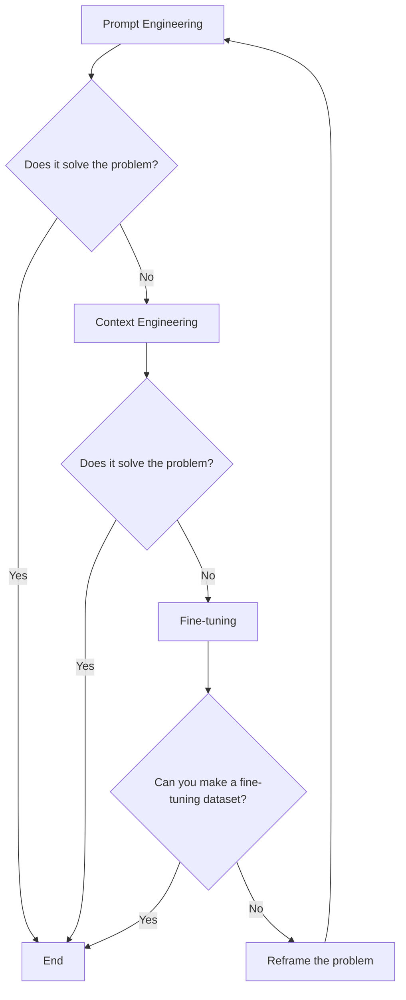
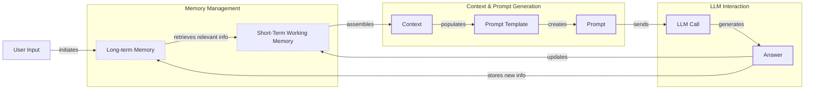
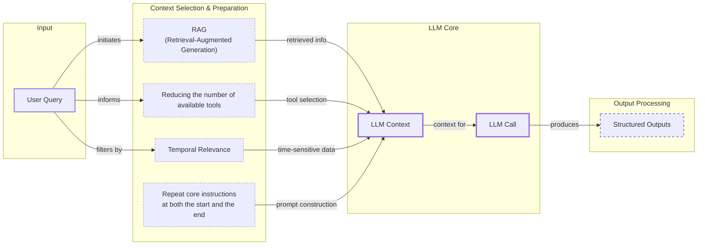
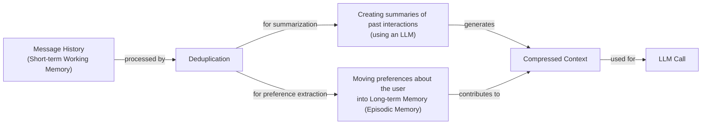
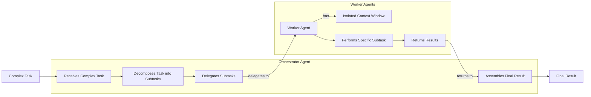

# Context Engineering: 2025’s #1 Skill in AI

## Introduction: When prompt engineering breaks

The story of modern AI applications is one of rapid evolution. In 2022, the world was introduced to simple chatbots, capable of answering questions in a single turn [[29]]. By 2023, these evolved into Retrieval-Augmented Generation (RAG) systems, which could connect LLMs to domain-specific knowledge, making them far more useful for specialized tasks. The year 2024 brought us tool-using agents that could perform actions and interact with external systems [[27]]. Now, in 2025, we are building memory-enabled agents that remember past interactions, learn user preferences, and build relationships over time.

In our last lesson, we explored the landscape of AI agents and LLM workflows and how to choose between them. As these applications grow more complex, prompt engineering, a practice that once served us well, is showing its limits. It optimizes single LLM calls but fails when managing systems with memory, actions, and long interaction histories. The sheer volume of information an agent might need—past conversations, user data, documents, and action descriptions—has grown exponentially.

Simply stuffing all this information into a prompt is not a viable strategy. This approach leads to a new set of problems that require a more disciplined solution. Context engineering is the practice of orchestrating this entire information ecosystem to ensure the LLM gets exactly what it needs, when it needs it. This skill is becoming a core foundation for AI engineering.

## From prompt to context engineering

Prompt engineering, while effective for simple tasks, is designed for single, stateless interactions. It treats each call to an LLM as a new, isolated event. This approach breaks down in stateful applications where context must be preserved and managed across multiple turns. As a conversation or task progresses, the context grows, and without a strategy to manage this growth, the LLM’s performance degrades.

This degradation happens in several ways. First, there is **context decay**, where the model gets confused by the noise of an ever-expanding history. This is often called the "lost-in-the-middle" problem, where models struggle to access information buried in the middle of long inputs. Research consistently shows that model accuracy can drop by over 30% when relevant information is not at the beginning or end of the context [[59]]. Performance can start to degrade significantly once the context exceeds 32,000 tokens, long before advertised limits are reached [[21]].

Second, there is the **context window challenge**. The context window is the model's finite working memory, and every piece of information competes for space [[31], [33]]. The self-attention mechanism in transformers also imposes a quadratic computational overhead, meaning that as the context length doubles, the computation required can quadruple, making large contexts slow and expensive [[22]].

Finally, every token adds to the **cost and latency** of an LLM call. In agentic workflows, where context accumulates with each step, costs can balloon quickly [[16]]. A naive approach of "context-augmented generation," or just dumping everything in, creates a slow, expensive, and underperforming system. We will explore these concepts in more detail in upcoming lessons, including memory in Lesson 9 and RAG in Lesson 10.

On a recent project, we learned this the hard way. We were working with a model that supported a two-million-token context window, so we thought, "*What could go wrong*?" We stuffed everything in: our research, guidelines, examples, and user history. The result was an LLM workflow that took 30 minutes to run and produced low-quality outputs.

A more disciplined approach is needed. Context engineering shifts the focus from crafting static prompts to building dynamic systems that manage information flow. As an AI engineer, your job is to select only the most critical pieces of context for each LLM call. This makes your applications accurate, fast, and cost-effective.

## Understanding context engineering

Context engineering is the practice of finding the best way to arrange parts of your application's memory into the context that is passed to an LLM to achieve the best results. It is a solution to an optimization problem where you retrieve the right parts of both your short- and long-term memory to solve a specific task without overwhelming the model [[22]]. For example, when you ask a cooking agent for a recipe, you do not give it the entire cookbook. Instead, you retrieve the specific recipe, along with personal context like allergies or taste preferences. This precise selection ensures the model receives only the essential information.

Andrej Karpathy offered a great analogy for this: LLMs are like a new kind of operating system, where the model acts as the CPU and its context window functions as the RAM [[31], [33]]. Just as an operating system manages what fits into RAM, context engineering curates what occupies the model’s working memory. This reframes the challenge from simply writing prompts to managing a critical system resource. It is important to note that the context is a *subset* of the system's total working memory; you can hold information without passing it to the LLM on every turn.

How does context engineering relate to prompt engineering? It is simple. Prompt engineering is a subset of context engineering. You still write effective prompts, but you also design a system that feeds the right context into those prompts. This means understanding not just *how* to phrase a task, but *what* information the model needs to perform optimally.

| Dimension | Prompt Engineering | Context Engineering |
|-----------|-------------------|---------------------|
| Scope | Single interaction optimization | Entire information ecosystem |
| State Management | Stateless function | Stateful due to memory |
| Focus | How to phrase tasks | What information to provide |

Table 1: A comparison of prompt engineering and context engineering.

Context engineering is the new fine-tuning. While fine-tuning has its place, it is expensive, time-consuming, and inflexible. Data changes constantly, making fine-tuning a last resort. For most enterprise use cases, you get better results faster and more cheaply with context engineering [[52], [53]]. It allows for rapid iteration and adaptation to evolving data without altering the core model, a key advantage in dynamic environments. This approach avoids the computational resources and specialized expertise required for retraining, offering a more agile path to reliable AI applications.

When you start a new AI project, your decision-making process for guiding the LLM should look like the one presented in Image 1. You start with the simplest approach and only move to more complex methods when necessary.



Image 1: A flowchart illustrating the decision-making workflow for choosing a key strategy when starting a new AI project.

For instance, if you build an agent to process internal Slack messages, you do not need to fine-tune a model on your company’s communication style. It is more effective to use a powerful reasoning model and engineer the context to retrieve specific messages and enable actions like creating tasks or drafting emails. Throughout this course, we will show you how to solve most industry problems using only context engineering.

## What makes up the context

To master context engineering, you first need to understand what "context" actually is. It is everything the LLM sees in a single turn, dynamically assembled from various memory components before being passed to the model. The high-level workflow, as presented in Image 2, begins when a user input triggers the system to pull relevant information from both long-term and short-term memory. This information is assembled into the final context, inserted into a prompt template, and sent to the LLM. The LLM’s answer then updates the memory, and the cycle repeats.



Image 2: A flowchart illustrating the high-level workflow of how context is processed in an LLM application.

These components are grouped into two main categories. We will explain them intuitively for now, as we have future dedicated lessons for all of them.

### Short-Term Working Memory

Short-term working memory is the state of the agent for the current task or conversation. It is volatile and changes with each interaction, helping the agent maintain a coherent dialogue and make immediate decisions. It includes the **user input**, which is the most recent query from the user. It also contains the **message history**, the log of the current conversation that allows the LLM to understand previous turns. The agent's **internal thoughts**, such as the reasoning steps it takes to decide on its next action, are also part of this memory. Finally, **tool calls and outputs**, which are the results from any actions the agent has performed, provide information from external systems [[36], [39]]. This working memory is the agent's immediate "consciousness."

### Long-Term Memory

Long-term memory is more persistent and stores information across sessions, allowing the AI system to remember things beyond a single conversation. We divide it into three types, drawing parallels from human memory [[22], [37]]. An AI system can include some or all of them:

**Procedural memory** is knowledge encoded directly in the code. It includes the system prompt, which sets the agent's overall behavior and rules. It also includes the definitions of available actions, which tell the agent what it can do, and schemas for structured outputs, which guide the format of its responses. This is the agent's set of built-in skills or instincts [[37]].

**Episodic memory** is the memory of specific past experiences, like user preferences or previous interactions and agent actions. It is used to help the agent personalize its responses based on individual users. This type of memory allows the agent to remember things like "the user prefers concise answers" or "we discussed project X yesterday." We typically store this in vector or graph databases for efficient retrieval [[37], [40]].

**Semantic memory** is the agent’s factual knowledge base. It can be internal, like company documents stored in a database, or external, accessed via the internet through API calls or web scraping. This memory provides the factual information the agent needs to answer questions, such as "What were our Q3 sales figures?" This is the core of RAG [[37], [38]].

If this seems like a lot, bear with us. We will cover all these concepts in-depth in future lessons, including structured outputs (Lesson 4), tools (Lesson 6), memory (Lesson 9), RAG (Lesson 10), and working with multimodal data (Lesson 11).

<https://substackcdn.com/image/fetch/f_auto,q_auto:good,fl_progressive:steep/https%3A%2F%2Fsubstack-post-media.s3.amazonaws.com%2Fpublic%2Fimages%2F39dce26a-e51e-4167-ac9e-ca28c45b53a6_1115x708.png>
Image 3: A detailed illustration of how all the context engineering components work together inside an AI agent (Source [Decoding AI Magazine [21]](https://www.decodingai.com/p/context-engineering-2025s-1-skill))

The key takeaway is that these components are not static. They are dynamically re-computed for every single interaction. For each conversation turn or new task, the short-term memory grows, or the long-term memory can change. Context engineering involves knowing how to select the right pieces from this vast memory pool to construct the most effective prompt for the task at hand.

## Production implementation challenges

Now that we understand what makes up the context, let's look at the core challenges of implementing it in production. These challenges all revolve around a single question: *"How can I keep my context as small as possible while providing enough information to the LLM?"*

Here are four common issues that come up when building AI applications:

1.  **The context window challenge:** Every AI model has a limited context window, which is the maximum amount of information (tokens) it can process simultaneously. The model's working memory is finite. While context windows are getting larger, they are not infinite, and treating them as such leads to other problems [[2]]. The self-attention mechanism in transformers imposes a quadratic computational overhead, and the Key-Value (KV) cache, which stores intermediate computations, can become a memory bottleneck, making large contexts expensive and slow [[22], [33]].

2.  **Information overload:** Too much context reduces the performance of the LLM by confusing it. This is known as the "lost-in-the-middle" or "needle in a haystack" problem, where LLMs are known for remembering information best at the beginning and end of the context window. Information in the middle is often overlooked, and performance can drop long before the physical context limit is reached [[56], [58], [59]]. A 2025 study by Chroma on 18 frontier models confirmed that adding "distractors"—semantically similar but irrelevant information—amplifies this degradation [[3]].

3.  **Context drift:** This occurs when conflicting versions of the truth accumulate in the memory over time. For example, the memory might contain two conflicting statements: "*The user's budget is $500*" and later "*The user's budget is $1,000*." This is not a quantum physics experiment; it is a data conflict that confuses the LLM [[6]]. Without a mechanism to resolve or prune outdated facts, the agent's knowledge base becomes unreliable, leading to inconsistent reasoning and a gradual erosion of user trust [[7], [8]].

4.  **Tool confusion:** The final challenge is tool confusion, which arises in two main ways. First, adding too many tools to an agent can confuse the LLM about the best one for the job. The Gorilla benchmark shows that nearly all models perform worse when given more than one tool [[21]]. Second, confusion can occur when tool descriptions are poorly written or overlap. If the distinctions between actions are unclear, the model may choose the wrong tool or fail to act, leading to failed tasks.

## Key strategies for context optimization

Initially, most AI applications were chatbots over single knowledge bases. Today, modern AI solutions must manage multiple knowledge bases, tools, and complex conversational histories. Context engineering is about managing this complexity while meeting performance, latency, and cost requirements.

Here are four popular context engineering strategies used across the industry:

### Selecting the right context

Retrieving the right information from memory is a critical first step. A common mistake is to provide everything at once. To solve this, you should use RAG with reranking to fetch only the most relevant facts. You can also use structured outputs to pass only the necessary information to downstream steps. For time-sensitive information, you can implement temporal ranking to filter out outdated data. Another effective technique is to reduce the number of available tools. Studies have shown that limiting the selection to under 30 tools can triple an agent's selection accuracy by reducing ambiguity [[21]]. Finally, for the most important instructions, repeat them at both the start and the end of the prompt. This leverages the model's tendency to pay more attention to the context edges, ensuring core instructions are not lost [[57]].



Image 4: An architecture diagram illustrating context selection techniques in an LLM system.

We will cover structured outputs in Lesson 4 and RAG in Lesson 10.

### Context compression

As message history grows in short-term working memory, you must manage past interactions to keep your context window in check. You cannot simply drop past conversation turns, as the LLM still needs to remember what happened. Instead, you need ways to compress key facts from the past. You can do this by **creating summaries of past interactions** using an LLM to replace a long, detailed history with a concise overview. Another method is **moving user preferences to long-term memory**, transferring them from working memory to episodic memory to keep the working context clean. Finally, **deduplication** techniques, such as semantic clustering, can identify and remove redundant information from the context to avoid repetition [[11], [12], [14]].



Image 5: A flowchart illustrating context compression strategies for managing short-term working memory.

### Isolating Context

Another powerful strategy is to isolate context by splitting information across multiple agents or LLM workflows. This technique is similar to tool isolation but is more general, referring to the whole context. The key idea is that instead of one agent with a massive, cluttered context window, you can have a team of agents, each with a smaller, focused context. We often implement this using an orchestrator-worker pattern, where a central orchestrator agent breaks down a problem and assigns sub-tasks to specialized worker agents [[46], [47]]. Each worker operates in its own isolated context, which prevents cross-domain hallucinations, reduces token consumption, and allows for parallel processing [[47], [48]]. We will cover this pattern in more detail in Lesson 5.



Image 6: Architecture diagram illustrating the orchestrator-worker pattern for context isolation.

### Format Optimizations

Finally, the way you format the context matters. Models are sensitive to structure, and using clear delimiters can improve performance. A common strategy is to use XML tags to wrap different pieces of context (e.g., `<user_query>`, `<documents>`) [[44]]. This helps the model distinguish between different types of information and improves reasoning reliability. Also, when providing structured data as input, YAML is often more token-efficient than JSON. One study found it to be 66% more token-efficient, which helps save space in your context window [[21]].

You always have to understand what is passed to the LLM. Seeing exactly what occupies your context window at every step is key to mastering context engineering. This is usually done by properly monitoring your traces, tracking what happens at each step, and understanding the inputs and outputs [[16], [18]]. As this is a significant step to go from PoC to production, we will have dedicated lessons on this.

## Here is an example

Let's connect the theory and strategies discussed earlier with concrete examples. Context engineering is applied to build powerful AI systems in various domains. In **healthcare**, an AI assistant can access a patient's history, current symptoms, and relevant medical literature to suggest personalized diagnoses. This involves retrieving sensitive data from episodic memory and factual knowledge from semantic memory, requiring careful context assembly to ensure safety and accuracy [[41]]. In **finance**, an agent might integrate with a company's CRM system, calendars, and financial data to make decisions based on user preferences. This requires managing context from multiple enterprise systems and adhering to strict compliance and privacy rules. For **project management**, an AI system can access tools like CRMs, Slack, and task managers to automatically understand project requirements and update tasks, isolating context for each tool to avoid confusion.

Let's walk through a concrete example. Imagine a user asks a healthcare assistant: `I have a headache. What can I do to stop it? I would prefer not to take any medicine.`

Before the LLM even sees this query, a context engineering system gets to work. It retrieves the user's patient history, known allergies, and lifestyle habits from an episodic memory store [[41]]. It then queries a semantic memory of up-to-date medical literature for non-medicinal headache remedies. It assembles this information, along with the user's query and the conversation history, into a structured prompt. We send the prompt to the LLM, which generates a personalized, safe, and relevant recommendation. Finally, we log the interaction and save any new preferences back to the user's episodic memory.

Here’s a simplified Python example showing how these components might be assembled into a complete system prompt. Notice the clear structure and ordering, using XML tags to delineate different types of information.

```python
SYSTEM_PROMPT = """
You are a helpful and cautious AI healthcare assistant. Your goal is to provide safe, non-medicinal advice. Do not provide medical diagnoses.

<INSTRUCTIONS>
1. Analyze the user's query and the provided context.
2. Use the patient history to understand their health profile and preferences.
3. Use the retrieved medical knowledge to form your recommendation.
4. If you lack sufficient information, ask clarifying questions.
5. Always prioritize safety and advise consulting a doctor for serious issues.
</INSTRUCTIONS>

<PATIENT_HISTORY>
{retrieved_patient_history}
</PATIENT_HISTORY>

<MEDICAL_KNOWLEDGE>
{retrieved_medical_articles}
</MEDICAL_KNOWLEDGE>

<CONVERSATION_HISTORY>
{formatted_chat_history}
</CONVERSATION_HISTORY>

<USER_QUERY>
{user_query}
</USER_QUERY>

Based on all the information above, provide a helpful response.
"""
```

To build such a system, you would use a combination of tools. An LLM like **Gemini** provides the reasoning engine. A framework like **LangGraph** orchestrates the workflow. Databases such as **PostgreSQL**, **Qdrant**, or **Neo4j** serve as long-term memory stores [[62]]. Specialized tools like **Mem0** can manage memory state, and observability platforms like **Opik** or **LangSmith** are essential for debugging complex interactions [[16], [64], [65]]. Often, it is effective to keep it simple, as you can achieve much with only PostgreSQL or MongoDB.

Here is a more practical example showing a context compression pipeline. This code uses the `sentence-transformers` library for embedding and `numpy` for calculations to filter irrelevant text chunks, a common first step in a RAG system. This is a simplified version of a production pattern where you would compare a library like `sentence-transformers` against a more managed service like an OpenAI or Cohere embedding API for trade-offs in cost, latency, and performance.

```python
import numpy as np
from sentence_transformers import SentenceTransformer

# 1. Define a class to filter chunks based on relevance
class RelevanceFilter:
    def __init__(self, model_name='all-MiniLM-L6-v2', threshold=0.3):
        self.model = SentenceTransformer(model_name)
        self.threshold = threshold

    def filter_chunks(self, query: str, chunks: list[str]) -> list[str]:
        # Encode the query and chunk texts
        query_embedding = self.model.encode(query, normalize_embeddings=True)
        chunk_embeddings = self.model.encode(chunks, normalize_embeddings=True)

        # Compute cosine similarities
        similarities = np.dot(chunk_embeddings, query_embedding)

        # Filter chunks above the relevance threshold
        relevant_chunks = [
            chunk for chunk, score in zip(chunks, similarities) if score >= self.threshold
        ]
        return relevant_chunks

# 2. Example usage
retrieved_chunks = [
    "Context compression reduces token usage in LLM applications by removing redundant information.",
    "Token optimization is crucial for managing API costs and context window limits.",
    "The weather today is sunny with temperatures around 72 degrees Fahrenheit.",
    "Extractive summarization selects important sentences from the original text."
]
user_query = "How does context compression work?"

# 3. Initialize the filter and apply it
relevance_filter = RelevanceFilter(threshold=0.25)
filtered_chunks = relevance_filter.filter_chunks(user_query, retrieved_chunks)

print("Filtered Chunks:")
for chunk in filtered_chunks:
    print(f"- {chunk}")

# It outputs:
# Filtered Chunks:
# - Context compression reduces token usage in LLM applications by removing redundant information.
# - Token optimization is crucial for managing API costs and context window limits.
# - Extractive summarization selects important sentences from the original text.
```

This example demonstrates a core context engineering technique: programmatically reducing the amount of information sent to the LLM, keeping only what is most relevant to the task.

## Connecting context engineering to AI engineering

The practice of context engineering is more about building intuition than learning a specific algorithm. It is the art of knowing how to structure prompts, what information to include, and how to order it for maximum impact. This discipline helps you determine the minimal yet essential information an LLM needs to perform at its best.

This skill does not exist in a vacuum. It’s a multidisciplinary practice that sits at the intersection of several key engineering fields [[22], [23]]:

*   **AI Engineering:** Understanding LLMs, RAG, and AI agents is the foundation. This involves implementing practical solutions like LLM workflows and evaluation pipelines to test and refine how context is managed.
*   **Software Engineering:** You need to build scalable and maintainable systems to aggregate context and wrap agents in robust APIs. This means applying principles like modularity, testing, and clear documentation to your AI systems.
*   **Data Engineering:** Constructing reliable data pipelines for RAG and other memory systems is critical. This includes ETL processes, data quality checks, and governance to ensure the context fed to the LLM is accurate and trustworthy.
*   **MLOps:** Deploying agents on the right infrastructure and automating Continuous Integration/Continuous Deployment (CI/CD) makes them reproducible, observable, and scalable. This involves monitoring, logging, and managing the lifecycle of your context-aware AI systems in production.

Our goal with this course is to teach you how to combine these skills to build production-ready AI products. In the world of AI, we should all think in systems rather than isolated components, having a mindset shift from developers to architects.

In the next lesson, we will explore structured outputs, a key technique for selecting and formatting context. Later in the course, we will dive deeper into other concepts introduced here, such as tools, memory, and RAG, to give you a complete toolkit for building intelligent AI systems.

## References

- [1] Kamradt, G. (2023). Needle In A Haystack - Pressure Testing LLMs [GitHub Repository]. https://github.com/gkamradt/LLMTest_NeedleInAHaystack
- [2] Redis. (n.d.). Context Window Overflow in LLMs. https://redis.io/blog/context-window-overflow/
- [3] Hong, K., Troynikov, A., & Huber, J. (2025). Context Rot: How Increasing Input Tokens Impacts LLM Performance. Chroma. https://www.trychroma.com/research/context-rot
- [4] Sahin, S. (n.d.). The Common Failure Points of LLM RAG Systems and How to Overcome Them. Medium. https://medium.com/@sahin.samia/the-common-failure-points-of-llm-rag-systems-and-how-to-overcome-them-926d9090a88f
- [5] Your 1M+ context window LLM is less powerful than you think. (n.d.). Towards Data Science. https://towardsdatascience.com/your-1m-context-window-llm-is-less-powerful-than-you-think/
- [6] Bronsdon, C. (2025). Seven Strategies to Maintain LLM Reliability Across Diverse Use Cases in Production. Galileo. https://galileo.ai/blog/production-llm-monitoring-strategies
- [7] Coforge. (n.d.). Navigating the Shifting Sands: Understanding and Mitigating Data Drift in LLMs. https://www.coforge.com/what-we-know/blog/navigating-the-shifting-sands-understanding-and-mitigating-data-drift-in-llms
- [8] Context Rot in Enterprise AI LLMs. (n.d.). The New Stack. https://thenewstack.io/context-rot-enterprise-ai-llms/
- [9] The Hidden Cost of LLM Drift Detection. (n.d.). InsightFinder. https://insightfinder.com/blog/hidden-cost-llm-drift-detection/
- [11] How to Build Context Compression. (2026). OneUptime. https://oneuptime.com/blog/post/2026-01-30-context-compression/view
- [12] LLMOps Crash Course Part 8. (n.d.). Daily Dose of DS. https://www.dailydoseofds.com/llmops-crash-course-part-8/
- [13] Mei, L. et al. (2025). Context Compression via Item Description Summarization for SLM Relevance Ranking. arXiv. https://arxiv.org/html/2510.22101v1
- [14] Efficient Context Management for LLM Agents. (2025). JetBrains Research. https://blog.jetbrains.com/research/2025/12/efficient-context-management/
- [15] LlamaIndex. (n.d.). Context Engineering - What it is, and techniques to consider. https://www.llamaindex.ai/blog/context-engineering-what-it-is-and-techniques-to-consider
- [16] Kinzer, K. (2025). Context Window: What It Is and Why It Matters for AI Agents. Comet. https://www.comet.com/site/blog/context-window/
- [17] DataHub. (n.d.). Context Window Optimization. https://datahub.com/blog/context-window-optimization/
- [18] Context Window Management Strategies for Long-Context AI Agents and Chatbots. (n.d.). Maxim. https://www.getmaxim.ai/articles/context-window-management-strategies-for-long-context-ai-agents-and-chatbots/
- [19] Chase, H. (2025). The rise of "context engineering". LangChain Blog. https://blog.langchain.com/the-rise-of-context-engineering/
- [20] Pinecone. (n.d.). What is Context Engineering?. https://www.pinecone.io/learn/context-engineering/
- [21] Iusztin, P. (2025). Context Engineering: 2025’s #1 Skill in AI. Decoding AI. https://www.decodingai.com/p/context-engineering-2025s-1-skill
- [22] Mei, L. et al. (2025). A Survey of Context Engineering for Large Language Models. arXiv. https://arxiv.org/pdf/2507.13334
- [23] Schmid, P. (n.d.). Context Engineering. https://www.philschmid.de/context-engineering
- [24] Packmind. (n.d.). What is ContextOps?. https://packmind.com/context-engineering-ai-coding/what-is-contextops/
- [25] Mezmo. (n.d.). Context Engineering for Observability. https://www.mezmo.com/learn-observability/context-engineering-for-observability-how-to-deliver-the-right-data-to-llms
- [26] Sombra. (n.d.). AI Context Engineering Guide. https://sombrainc.com/blog/ai-context-engineering-guide
- [27] DataCamp. (n.d.). Context Engineering: A Guide With Examples. https://www.datacamp.com/blog/context-engineering
- [28] Glean. (n.d.). Context Engineering: The Foundation of Reliable, High-Performing Models. https://www.glean.com/blog/context-engineering-ai-the-foundation-of-reliable-high-performing-models
- [29] Security Industry Association. (2024). Understanding the Evolution from Classic Chatbots to RAG Chatbots to AI-Powered Assistants. https://www.securityindustry.org/2024/07/16/understanding-the-evolution-from-classic-chatbots-to-rag-chatbots-to-ai-powered-assistants/
- [30] PagerGPT. (n.d.). Evolution of AI Chatbots. https://pagergpt.ai/ai-chatbot/evolution-of-ai-chatbots
- [31] Karpathy, A. (n.d.). X. https://x.com/karpathy/status/1937902205765607626
- [32] Glean. (n.d.). Context Engineering vs. Prompt Engineering: Key Differences Explained. https://www.glean.com/perspectives/context-engineering-vs-prompt-engineering-key-differences-explained
- [33] Atlan. (n.d.). Working Memory in LLMs. https://atlan.com/know/working-memory-llms/
- [34] Teki, S. (n.d.). From Vibe Coding to Context Engineering. https://www.sundeepteki.org/blog/from-vibe-coding-to-context-engineering-a-blueprint-for-production-grade-genai-systems
- [35] Roychowdhury, A. (n.d.). Context Engineering: The Silent Architecture Behind Every AI. LinkedIn. https://www.linkedin.com/pulse/context-engineering-silent-architecture-behind-every-ai-roychowdhury-lzcec
- [36] Atlan. (n.d.). Working Memory in LLMs. https://atlan.com/know/working-memory-llms/
- [37] DataCamp. (n.d.). How Does LLM Memory Work?. https://www.datacamp.com/blog/how-does-llm-memory-work
- [38] Analytics Vidhya. (2026). How Does LLM Memory Work?. https://www.analyticsvidhya.com/blog/2026/01/how-does-llm-memory-work/
- [39] Skymod. (n.d.). Why Memory Matters in LLM Agents. https://skymod.tech/why-memory-matters-in-llm-agents-short-term-vs-long-term-memory-architectures/
- [40] Label Studio. (n.d.). Episodic vs. Persistent Memory in LLMs. https://labelstud.io/learningcenter/episodic-vs-persistent-memory-in-llms/
- [41] Iusztin, P. (2025). Context Engineering: 2025’s #1 Skill in AI. Decoding AI. https://www.decodingai.com/p/context-engineering-2025s-1-skill
- [42] Horthy, D. (n.d.). 12-Factor Agents. GitHub. https://github.com/humanlayer/12-factor-agents/blob/main/content/factor-03-own-your-context-window.md
- [43] MDPI. (2025). Prompt Engineering in Healthcare. https://www.mdpi.com/2079-9292/13/15/2961
- [44] Anthropic. (n.d.). Effective Context Engineering for AI Agents. https://www.anthropic.com/engineering/effective-context-engineering-for-ai-agents
- [45] Saravia, E. (2025). Context Engineering Guide. NLP Newsletter. https://nlp.elvissaravia.com/p/context-engineering-guide
- [46] Beam. (n.d.). Multi-Agent Orchestration Patterns in Production. https://beam.ai/agentic-insights/multi-agent-orchestration-patterns-production
- [47] GuruSup. (n.d.). Multi-Agent Orchestration Guide. https://gurusup.com/blog/multi-agent-orchestration-guide
- [48] Vellum. (n.d.). Multi-Agent Systems: Building with Context Engineering. https://www.vellum.ai/blog/multi-agent-systems-building-with-context-engineering
- [49] Praetorian. (n.d.). Deterministic AI Orchestration. https://www.praetorian.com/blog/deterministic-ai-orchestration-a-platform-architecture-for-autonomous-development/
- [50] Specialized Agents. (2026). arXiv. https://arxiv.org/html/2601.13671v1
- [51] Panjuta, D. (n.d.). Prompt Engineering vs. Context Engineering. LinkedIn. https://www.linkedin.com/posts/denis-panjuta_prompt-engineering-vs-context-engineering-activity-7363945251180322816-1q_m
- [52] Memgraph. (n.d.). Prompt Engineering vs. Context Engineering. https://memgraph.com/blog/prompt-engineering-vs-context-engineering
- [53] Mezmo. (n.d.). Context Engineering for Observability. https://www.mezmo.com/learn-observability/context-engineering-for-observability-how-to-deliver-the-right-data-to-llms
- [54] Instinctools. (n.d.). Context Engineering. https://www.instinctools.com/blog/context-engineering/
- [55] Neo4j. (n.d.). Agentic AI: Context Engineering vs. Prompt Engineering. https://neo4j.com/blog/agentic-ai/context-engineering-vs-prompt-engineering/
- [56] DeJohn, A. (n.d.). Lost in the Middle: A Lesson in Failing AI Agents Backwards. LinkedIn. https://www.linkedin.com/pulse/lost-middle-lesson-failing-ai-agents-backwards-anthony-dejohn-01k2e
- [57] Promptmetheus. (n.d.). Lost-in-the-Middle Effect. https://promptmetheus.com/resources/llm-knowledge-base/lost-in-the-middle-effect
- [58] Thousand Miles AI. (n.d.). The Lost in the Middle Problem. DEV.to. https://dev.to/thousand_miles_ai/the-lost-in-the-middle-problem-why-llms-ignore-the-middle-of-your-context-window-3al2
- [59] Atlan. (n.d.). LLM Context Window Limitations. https://atlan.com/know/llm-context-window-limitations/
- [60] BigDataBoutique. (n.d.). Needle in a Haystack. https://bigdataboutique.com/blog/needle-in-haystack-optimizing-retrieval-and-rag-over-long-context-windows-5dfb3c
- [61] Codecademy. (n.d.). Context Engineering in AI. https://www.codecademy.com/article/context-engineering-in-ai
- [62] Stackademic. (n.d.). Context Engineering in LLMs and AI Agents. https://blog.stackademic.com/context-engineering-in-llms-and-ai-agents-eb861f0d3e9b
- [63] Lena. (n.d.). Context Engineering 101 cheat sheet. X. https://x.com/lenadroid/status/1943685060785524824
- [64] Atlan. (n.d.). Context Engineering Platforms Comparison. https://atlan.com/know/context-engineering-platforms-comparison/
- [65] Scalable Path. (n.d.). LangGraph. https://www.scalablepath.com/machine-learning/langgraph