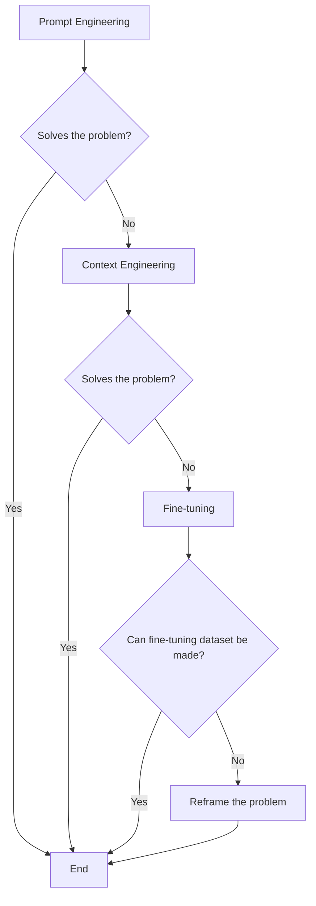
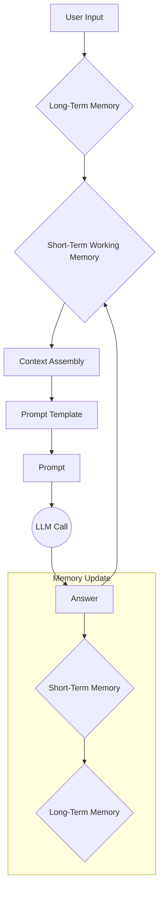
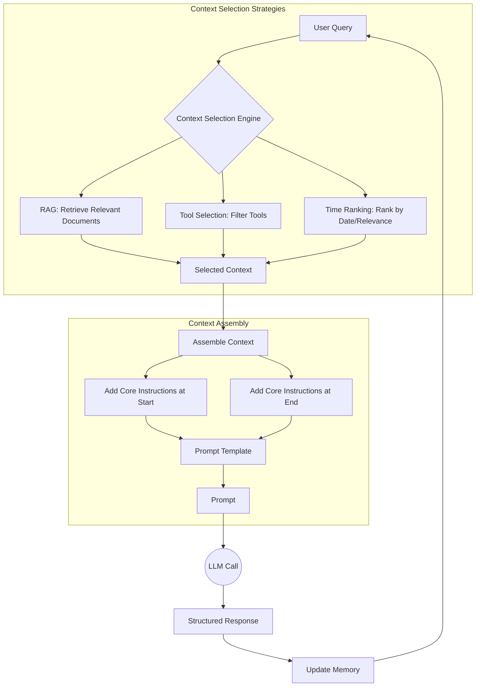
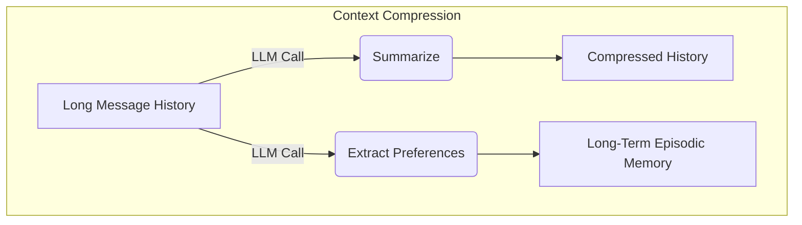
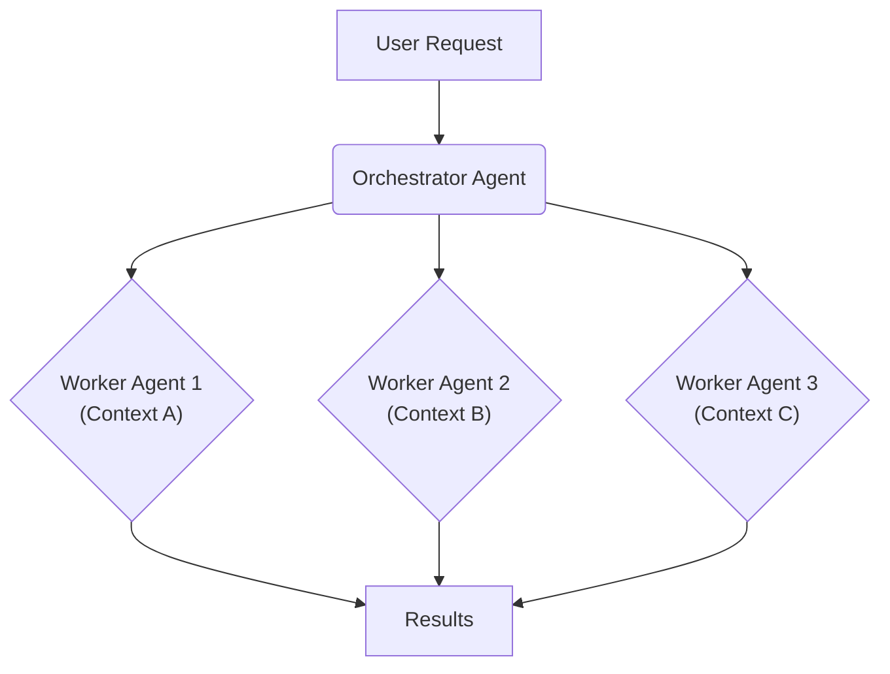

# Lesson 3: Context Engineering

## When prompt engineering breaks

AI applications have evolved rapidly. In 2022, we had simple chatbots for question-and-answering. By 2023, Retrieval-Augmented Generation (RAG) systems connected LLMs to domain-specific knowledge [[26]](https://www.securityindustry.org/2024/07/16/understanding-the-evolution-from-classic-chatbots-to-rag-chatbots-to-ai-powered-assistants/). 2024 brought us tool-using agents that could perform actions. Now, we are building memory-enabled agents that remember past interactions and build relationships over time [[30]](https://www.linkedin.com/posts/ai-apps-central_most-people-put-all-ai-systems-in-the-same-activity-7438555783077793792-UEUm).

In our last lesson, we explored how to choose between AI agents and LLM workflows when designing a system. As these applications grow more complex, prompt engineering, a practice that once served us well, is showing its limits. It optimizes single LLM calls but fails when managing systems with memory, actions, and long interaction histories. The sheer volume of information an agent might need—past conversations, user data, documents, and action descriptions—has grown exponentially.

Simply stuffing all this into a prompt is not a viable strategy. The discipline of orchestrating this entire information ecosystem to ensure the LLM gets exactly what it needs, when it needs it, is called context engineering. This skill is becoming a core foundation for AI engineering, moving beyond the limitations of single prompts to build robust, stateful systems.

## From Prompt to Context Engineering

Prompt engineering, while effective for simple tasks, is designed for single, stateless interactions. It treats each call to an LLM as a new, isolated event. This approach breaks down in stateful applications where context must be preserved and managed across multiple turns. As applications evolve into long-horizon tasks, multi-agent systems, and complex enterprise workflows, context engineering has become the necessary successor, focusing on the architecture of information flow for ongoing interactions rather than single prompts [[55]](https://neo4j.com/blog/agentic-ai/context-engineering-vs-prompt-engineering/).

As a conversation or task progresses, the context grows. Without a strategy to manage this growth, the LLM’s performance degrades. This is context decay: the model gets confused by the noise of an ever-expanding history and starts to lose track of the original instructions or key information. This "lost-in-the-middle" phenomenon is well-documented, with research showing that models struggle to access information positioned in the middle of long inputs, favoring content at the beginning or end [[56]](https://www.linkedin.com/pulse/lost-middle-lesson-failing-ai-agents-backwards-anthony-dejohn-01k2e).

Even with large context windows, a physical limit exists for what you can include. Also, on the operational side, every token adds to the cost and latency of an LLM call [[16]](https://www.comet.com/site/blog/context-window/). Simply putting everything into the context creates a slow, expensive, and underperforming system. We will explore these concepts in more detail in upcoming lessons, including memory in Lesson 9 and RAG in Lesson 10.

On a recent project, we learned this the hard way. We were working with a model that supported a large context window, so we thought, "What could go wrong?" We stuffed everything in: our research, guidelines, examples, and user history. The result was an LLM workflow that took 30 minutes to run and produced low-quality outputs.

This experience highlights why context engineering is essential. It shifts the focus from crafting static prompts to building dynamic systems that manage information flow. As an AI engineer, your job is to select only the most critical pieces of context for each LLM call. This makes your applications accurate, fast, and cost-effective.

## Understanding Context Engineering

Context engineering is about finding the best way to arrange parts of your memory into the context that is passed to the LLM to squeeze out the best results. It is a solution to an optimization problem where you have to retrieve the right parts of both your short and long-term memory to solve a specific task without overwhelming the LLM [[22]](https://arxiv.org/pdf/2507.13334). For example, when you ask a cooking agent for a recipe, you do not give it the entire cookbook. Instead, you retrieve the specific recipe, along with personal context like allergies or taste preferences. This precise selection ensures the model receives only the essential information.

Andrej Karpathy explains that LLMs are like a new kind of operating system where the model is the CPU and its context window is the RAM [[23]](https://x.com/karpathy/status/1937902205765607626). Just as an operating system manages what fits into your computer’s limited RAM, context engineering manages what information occupies the model’s limited context window [[31]](https://www.langchain.com/blog/context-engineering-for-agents). This analogy underscores the discipline's role in resource management; it's about curating, persisting, and retrieving data to optimize the performance of the LLM "CPU" [[31]](https://www.langchain.com/blog/context-engineering-for-agents), [[33]](https://atlan.com/know/working-memory-llms/).

How does context engineering relate to prompt engineering? Prompt engineering is a subset of context engineering. You still write effective prompts, but you also design a system that feeds the right context into those prompts. This means understanding not just *how* to phrase a task, but *what* information the model needs to perform optimally.

<center>
<br>
Table 1: A comparison of prompt engineering and context engineering.
</center>

| Dimension | Prompt Engineering | Context Engineering |
| :--- | :--- | :--- |
| **Scope** | Single interaction optimization | Entire information ecosystem |
| **State Management** | Stateless function | Stateful due to memory |
| **Focus** | How to phrase tasks | What information to provide |

Context engineering is the new fine-tuning. While fine-tuning has its place, it is expensive, time-consuming, and inflexible [[11]](https://www.tribe.ai/applied-ai/fine-tuning-vs-prompt-engineering). Data changes constantly, making fine-tuning a last resort [[10]](https://www.tabnine.com/blog/your-ai-doesnt-need-more-training-it-needs-context/). For most enterprise use cases, you get better results faster and more cheaply with context engineering [[51]](https://www.linkedin.com/posts/denis-panjuta_prompt-engineering-vs-context-engineering-activity-7363945251180322816-1q_m). It allows for rapid iteration and adaptation to evolving data without altering the core model, a key advantage in dynamic environments. This approach avoids the computational resources and specialized expertise required for retraining, offering a more agile path to reliable AI applications.

When you start a new AI project, your decision-making process for guiding the LLM should look like the one presented in Image 1.


Image 1: A flowchart illustrating the decision-making workflow for choosing between Prompt Engineering, Context Engineering, and Fine-tuning when starting a new AI project.

For instance, if you build an agent to process internal Slack messages, you do not need to fine-tune a model on your company’s communication style. It is more effective to use a powerful reasoning model and engineer the context to retrieve specific messages and enable actions like creating tasks or drafting emails. Throughout this course, we will show you how to solve most industry problems using only context engineering.

## What Makes Up the Context

To master context engineering, you first need to understand what "context" actually is. It is everything the LLM sees in a single turn, dynamically assembled from various memory components before being passed to the model. The high-level workflow begins when a user input triggers the system to pull relevant information from both long-term and short-term memory. This information is assembled into the final context, inserted into a prompt template, and sent to the LLM. The LLM’s answer then updates the memory, and the cycle repeats.


Image 2: The high-level workflow of how context is assembled and used in an AI system.

These components are grouped into two main categories. We will explain them intuitively for now, as we have future dedicated lessons for all of them.

### Short-Term Working Memory

Short-term working memory is the state of the agent for the current task or conversation. It is volatile and changes with each interaction, helping the agent maintain a coherent dialogue and make immediate decisions. This working memory is composed of several key elements that are updated with each turn [[31]](https://www.langchain.com/blog/context-engineering-for-agents/).

**User input** is the most immediate piece of context, representing the user's latest query or command. It directly shapes the agent's next response.

**Message history** provides the log of the current conversation. By including previous turns, the agent can understand the flow of the dialogue, reference past statements, and maintain a coherent interaction.

**The agent's internal thoughts** are the reasoning steps it takes to decide on its next action. This is often managed using a "scratchpad," a temporary space where the agent can outline a plan, store intermediate results, or reflect on its process before generating a final output [[35]](https://www.linkedin.com/pulse/context-engineering-silent-architecture-behind-every-ai-roychowdhury-lzcec).

**Action calls and outputs** are the results from any external actions the agent has performed. When an agent interacts with a tool, like a search engine or a database, the output of that tool is fed back into the context, providing fresh information for the next step.

### Long-Term Memory

Long-term memory is more persistent and stores information across sessions, allowing the AI system to remember things beyond a single conversation. We divide it into three types, drawing parallels from human memory [[5]](https://arxiv.org/html/2504.15965v1). An AI system can include some or all of them.

**Procedural memory** is knowledge encoded directly in the code and system configuration. This includes the system prompt, which sets the agent's overall behavior, personality, and constraints. It also contains the definitions of available actions, which inform the agent of its capabilities, and schemas for structured outputs, which guide the format of its responses. This type of memory is like the agent's built-in skills and rules of engagement [[39]](https://skymod.tech/why-memory-matters-in-llm-agents-short-term-vs-long-term-memory-architectures/).

**Episodic memory** consists of specific past experiences, such as user preferences, previous conversations, or historical interactions. This memory is crucial for personalization, allowing the agent to tailor its responses to individual users. For example, it might remember a user's location, interests, or past issues. This information is typically stored in external systems like vector or graph databases for efficient retrieval when needed [[40]](https://labelstud.io/learningcenter/episodic-vs-persistent-memory-in-llms/).

**Semantic memory** represents the agent’s general knowledge base. This can be internal, such as a company's private documents stored in a data lake, or external, accessed via the internet through API calls or web scraping. This memory provides the factual information the agent needs to answer questions accurately and ground its responses in reliable data [[38]](https://www.analyticsvidhya.com/blog/2026/01/how-does-llm-memory-work/).

If this seems like a lot, bear with us. We will cover all these concepts in-depth in future lessons, including structured outputs (Lesson 4), actions (Lesson 6), memory (Lesson 9), and RAG (Lesson 10).

<https://github.com/user-attachments/assets/0f1f193f-8e94-4044-a276-576bd7764fd0> 
Image 3: Context engineering encompasses a variety of techniques and information sources. (Source [humanlayer/12-factor-agents [3]](https://github.com/humanlayer/12-factor-agents/blob/main/content/factor-03-own-your-context-window.md))

The key takeaway is that these components are not static. They are dynamically re-computed for every single interaction. For each conversation turn or new task, the short-term memory grows, or the long-term memory can change. Context engineering involves knowing how to select the right pieces from this vast memory pool to construct the most effective prompt for the task at hand.

## Production Implementation Challenges

Now that we understand what makes up the context, let's look at the core challenges of implementing it in production. These challenges all revolve around a single question: *"How can I keep my context as small as possible while providing enough information to the LLM?"* [[21]](https://www.datacamp.com/blog/context-engineering)

Here are four common issues that come up when building AI applications:

1.  **The context window challenge:** Every AI model has a limited context window, the maximum amount of information (tokens) it can process at once [[16]](https://www.comet.com/site/blog/context-window/). This is the model's working memory. For example, models like GPT-4o have a 128K token window, while others like Gemini 3 claim up to 1 million tokens [[59]](https://atlan.com/know/llm-context-window-limitations/). While these windows are getting larger, they are not infinite. More importantly, the *effective* context window—the amount of information a model can reliably use—is often much smaller than the advertised limit. Research has shown that some models lose over 99% of their claimed capacity on complex tasks, with performance degrading long before the hard limit is reached [[59]](https://atlan.com/know/llm-context-window-limitations/).

2.  **Information overload:** Too much context reduces the performance of the LLM by confusing it. This is known as the "lost-in-the-middle" or "needle in a haystack" problem, where LLMs are known for remembering information best at the beginning and end of the context window [[56]](https://www.linkedin.com/pulse/lost-middle-lesson-failing-ai-agents-backwards-anthony-dejohn-01k2e). Information in the middle is often overlooked, and performance can drop by over 30% for mid-position information [[59]](https://atlan.com/know/llm-context-window-limitations/). This U-shaped attention curve means that simply filling the context window is an ineffective strategy, as critical details can be ignored if not positioned correctly [[58]](https://dev.to/thousand_miles_ai/the-lost-in-the-middle-problem-why-llms-ignore-the-middle-of-your-context-window-3al2).

3.  **Context drift:** This occurs when conflicting views of truth accumulate in the memory over time [[6]](https://galileo.ai/blog/production-llm-monitoring-strategies). For example, you can have conflicting statements about the same concept such as "My cat is white" and "My cat is black." This is not quantum physics or the Schrödinger Cat experiment, but it confuses the LLM and prevents it from knowing what to pick. This issue, also called context rot, causes the model to lose focus, fall into loops, or produce hallucinations as its reasoning degrades [[8]](https://thenewstack.io/context-rot-enterprise-ai-llms/). A common mitigation strategy is to implement memory decay rules that automatically down-rank or delete old, rarely used, or contradicted facts to prevent stale information from polluting the context [[67]](https://medium.com/@armankamran/context-is-the-new-intelligence-engineering-the-next-generation-of-generative-ai-systems-174d99634c0c).

4.  **Tool confusion:** The final challenge is tool confusion, which arises in two main ways. First, adding too many actions to an agent can confuse the LLM about the best one for the job [[13]](https://www.forrester.com/blogs/the-state-of-ai-agents-lots-of-potential-and-confusion/). Second, confusion can occur when tool descriptions are poorly written or overlap. If the distinctions between actions are unclear, even a human would struggle to choose the right one. The orchestrator-worker pattern, where a primary agent delegates tasks to specialized sub-agents with fewer tools, is a common strategy to mitigate this.

## Key Strategies for Context Optimization

Initially, most AI applications were chatbots over single knowledge bases. Today, modern AI solutions must manage multiple knowledge bases, tools, and complex conversational histories, especially for long-horizon tasks like code migrations that require coherence over many steps [[68]](https://www.anthropic.com/engineering/effective-context-engineering-for-ai-agents), [[69]](https://sequoiacap.com/podcast/context-engineering-our-way-to-long-horizon-agents-langchains-harrison-chase/). Context engineering manages this complexity by treating the LLM as one component in a larger system, with its context managed iteratively based on three principles: relevance, sufficiency, and isolation [[70]](https://arxiv.org/pdf/2603.09619).

Here are four popular context engineering strategies used across the industry [[31]](https://www.langchain.com/blog/context-engineering-for-agents/):

### Selecting the Right Context

Retrieving the right information from memory is a critical first step. A common mistake is to provide everything at once, assuming that models with large context windows can handle it. As we have discussed, the "lost-in-the-middle" problem often results in poor performance, increased latency, and higher costs. To solve this, you should use structured outputs to separate different parts of the LLM outputs and pass only what is required downstream. We will cover this in Lesson 4. Another technique is to use RAG to pass only the factual information required to answer a given user question. This grounds the model in relevant data, improving factual accuracy and reducing hallucinations. We will explore this in depth in Lesson 10. You can also reduce the number of available tools to avoid confusing the LLM. Delegating tool subsets to specialized agents can triple selection accuracy [[21]](https://www.datacamp.com/blog/context-engineering). For time-sensitive information, ranking data by date and filtering out irrelevant points is effective [[12]](https://www.dailydoseofds.com/llmops-crash-course-part-8/). Finally, for the most important instructions, it is recommended to repeat them at both the start and the end of the prompt to leverage the model's attention bias [[57]](https://promptmetheus.com/resources/llm-knowledge-base/lost-in-the-middle-effect).


Image 4: A workflow showing how context selection strategies work together to optimize information retrieval and assembly.

### Context Compression

As message history grows in short-term working memory, you must manage past interactions to keep your context window in check. You cannot simply drop past conversation turns, as the LLM still needs to remember what happened. Instead, you need ways to compress key facts from the past. This process is analogous to memory consolidation in the human brain, where experiences are staged in the hippocampus before long-term storage in the neocortex during sleep [[71]](https://dev.to/joojodontoh/teaching-alfred-to-remember-with-a-neuroscience-inspired-memory-system-for-ai-agents-2o5l). Some advanced architectures mimic this with a "sleep consolidation loop" that replays interactions to strengthen important memories and prune weak ones [[72]](https://arxiv.org/html/2604.23878v1). Common techniques include creating summaries of past interactions using an LLM, a strategy used by agents like OpenHands to manage long tasks [[14]](https://blog.jetbrains.com/research/2025/12/efficient-context-management/). Another approach is moving user preferences from working memory into long-term episodic memory to keep the immediate context clean. Finally, deduplication techniques, such as semantic clustering, can identify and remove redundant information, ensuring the context remains concise and relevant [[11]](https://oneuptime.com/blog/post/2026-01-30-context-compression/view). Evaluating the effectiveness of these strategies is crucial, and frameworks exist to measure how much useful context is preserved across dimensions like task continuity and reasoning retention [[73]](https://factory.ai/news/evaluating-compression).


Image 5: Compressing context by summarizing history and extracting preferences to long-term memory.

### Isolating Context

Another powerful strategy is to isolate context by splitting information across multiple agents or LLM workflows. This technique is similar to tool isolation but applies to the entire context. Instead of one agent with a massive, cluttered context window, you can have a team of agents, each with a smaller, focused context. We often implement this using an orchestrator-worker pattern, where a central orchestrator agent breaks down a problem and assigns sub-tasks to specialized worker agents [[46]](https://beam.ai/agentic-insights/multi-agent-orchestration-patterns-production). Each worker operates in its own isolated context, improving focus and allowing for parallel processing. This pattern accounts for 70% of production multi-agent deployments, reducing token consumption by 60-70% compared to monolithic agents [[47]](https://gurusup.com/blog/multi-agent-orchestration-guide). We will cover this pattern in more detail in Lesson 5.


Image 6: The orchestrator-worker pattern isolates context across multiple specialized agents.

### Format Optimizations

Finally, the way you format the context matters. Models are sensitive to structure, and using clear delimiters can improve performance. A common strategy is to use XML tags to wrap different pieces of context (e.g., `<user_query>`, `<documents>`). This helps the model distinguish between different types of information and makes it easier for engineers to reference context elements within the system prompt [[44]](https://www.anthropic.com/engineering/effective-context-engineering-for-ai-agents). Additionally, when providing structured data as input, using YAML (YAML Ain't Markup Language) is often more token-efficient than JSON (JavaScript Object Notation), which helps save space in your context window.

You always have to understand what is passed to the LLM. Seeing exactly what occupies your context window at every step is key to mastering context engineering. Usually, this is done by properly monitoring your traces, tracking what happens at each step, and understanding the inputs and outputs. As this is a significant step to go from PoC to production, we will have dedicated lessons on this.

## Here Is an Example

Let's connect the theory and strategies with concrete examples. Consider several common real-world scenarios:

**Healthcare:** An AI assistant accesses a patient's medical history, current symptoms, and the latest medical literature to provide personalized diagnostic support [[41]](https://www.decodingai.com/p/context-engineering-2025s-1-skill). This involves handling sensitive patient data types like electronic health records and lab results, which requires strict privacy considerations and compliance with regulations like HIPAA. The system must be able to retrieve relevant information from both episodic memory (patient history) and semantic memory (medical knowledge bases) to generate safe and accurate recommendations [[43]](https://www.mdpi.com/2079-9292/13/15/2961).

**Financial Services:** AI systems integrate with enterprise tools like Customer Relationship Management (CRM) systems, emails, and calendars, combining real-time market data and client portfolio information to generate tailored financial advice [[41]](https://www.decodingai.com/p/context-engineering-2025s-1-skill). This requires integration with various financial data sources and adherence to strict compliance and regulatory requirements to ensure the advice is both accurate and legally sound.

**Project Management:** AI systems access enterprise infrastructure like CRMs and task managers to automatically understand project requirements, then add and update project tasks. This involves maintaining context across different enterprise tools, such as tracking dependencies between tasks in a project management tool while referencing conversations in a chat application to automate project workflows.

**Content Creator Assistant:** An AI agent uses your research, past content, and personality traits to understand what and how to create a given piece of content. This requires managing diverse content sources, such as articles, notes, and style guides, to generate content that is consistent with the creator's voice and brand.

**Robotics:** In human-robot interaction, decision-making systems integrate information from multiple sensors—like vision, audio, and touch—to infer context and generate appropriate actions. For example, a social robot might adjust its dialogue based on a person's emotional cues, or a collaborative robot could refine its grasp using force and visual feedback [[74]](https://www.frontiersin.org/journals/robotics-and-ai/articles/10.3389/frobt.2025.1604472/full).

Let's walk through a specific query to see context engineering in action with the healthcare assistant scenario. A user asks: `I have a headache. What can I do to stop it? I would prefer not to take any medicine.`

Before the AI attempts to answer, a context engineering system performs several steps:

1.  It retrieves the user's patient history, known allergies, and lifestyle habits from episodic memory.
2.  It queries a medical database for non-pharmacological headache remedies from semantic memory [[43]](https://www.mdpi.com/2079-9292/13/15/2961).
3.  It uses various tools to assemble the key units of information from both memory types into the final context.
4.  It formats this information into a structured prompt and calls the LLM.
5.  Finally, it presents a personalized, context-aware answer to the user.

Here is a simplified Python example showing how you might structure the context and prompt for the LLM, using XML tags to format the different context elements and YAML to format all input data collections.

1.  First, we define the user's query.

    ```python
    import yaml
    
    user_query = "I have a headache. What can I do to stop it? I would prefer not to take any medicine."
    ```

2.  Next, we define the patient's history, which would typically be retrieved from episodic memory.

    ```python
    patient_history = {
        "patient": {
            "name": "John Doe",
            "age": 45,
            "gender": "M",
            "conditions": ["mild_hypertension"],
            "allergies": [],
            "preferences": {
                "medication_avoidance": True,
                "preferred_treatments": "natural_remedies"
            },
            "habits": {
                "stress_level": "high",
                "work_related": True,
                "caffeine_intake": "3-4_cups_daily"
            }
        }
    }
    ```

3.  Then, we include relevant medical literature, which would be retrieved from semantic memory.

    ```python
    medical_literature = {
        "articles": [
            {
                "id": 1,
                "topic": "dehydration_headaches",
                "finding": "Dehydration is a common cause of tension headaches",
                "treatment": "Rehydration can alleviate symptoms within 30 minutes to three hours"
            },
            {
                "id": 2,
                "topic": "cold_compress",
                "finding": "Applying a cold compress to the forehead and temples can constrict blood vessels",
                "treatment": "Reduces inflammation, helping to relieve migraine pain"
            },
            {
                "id": 3,
                "topic": "caffeine_withdrawal",
                "finding": "Caffeine withdrawal can trigger headaches",
                "treatment": "For regular caffeine consumers, a small amount may alleviate withdrawal headaches"
            },
            {
                "id": 4,
                "topic": "stress_relief",
                "finding": "Stress-relief techniques are effective for tension headaches",
                "treatment": "Deep breathing, meditation, or short walks can help"
            }
        ]
    }
    ```

4.  Finally, we assemble the complete prompt, combining all elements into a structured format. Notice how we format the patient history and medical literature as YAML instead of passing them directly as plain Python dictionaries.

    ```python
    prompt = f"""
    <system_prompt>
    You are a helpful AI medical assistant. Your role is to provide safe, helpful, and personalized health advice based on the provided context. Do not give advice outside of the provided context. Prioritize non-medicinal options as per user preference.
    </system_prompt>
    
    <patient_history>
    {yaml.dump(patient_history)}
    </patient_history>
    
    <medical_literature>
    {yaml.dump(medical_literature)}
    </medical_literature>
    
    <user_query>
    {user_query}
    </user_query>
    
    <instructions>
    Based on all the information above, provide a step-by-step plan for the user to relieve their headache. Structure your response clearly.
    </instructions>
    """
    ```

To build such a system, you need a robust tech stack. Here is a potential stack we recommend and will use throughout this course:

*   **LLM:** Gemini as a multimodal, reasoning, and cost-effective LLM Application Programming Interface (API) provider.
*   **Orchestration:** LangGraph for defining stateful, agentic workflows [[65]](https://www.scalablepath.com/machine-learning/langgraph).
*   **Databases:** PostgreSQL, MongoDB, Redis, Qdrant, and Neo4j. Often, it is effective to keep it simple, as you can achieve much with only PostgreSQL or MongoDB.
*   **Observability:** Opik or LangSmith for evaluation and trace monitoring [[18]](https://www.getmaxim.ai/articles/context-window-management-strategies-for-long-context-ai-agents-and-chatbots/).

## Connecting Context Engineering to AI Engineering

Context engineering is a practice that blends intuition with systematic design. It is about developing the ability to craft effective prompts, select the right information from memory, and arrange context for optimal results. This discipline helps you determine the minimal yet essential information an LLM needs to perform at its best.

It is important to understand that context engineering cannot be learned in isolation. It is a complex field that combines:

1.  **AI Engineering:** This involves implementing practical solutions such as LLM workflows, RAG, AI Agents, and evaluation pipelines. A key task is to design and build the systems that retrieve, process, and manage the context that feeds the LLM.
2.  **Software Engineering (SWE):** You must build your AI product with code that is not just functional, but also scalable and maintainable. This means applying SWE principles like modularity, testing, and documentation to your context engineering systems, ensuring they are robust and can evolve with your product's needs [[23]](https://sombrainc.com/blog/ai-context-engineering-guide).
3.  **Data Engineering:** This requires designing data pipelines that feed curated and validated data into the memory layer. Data engineering practices such as ETL (Extract, Transform, Load), data quality checks, and data governance are crucial for ensuring the context provided to the LLM is reliable and trustworthy [[24]](https://www.decube.io/post/master-data-pipeline-architecture-best-practices-for-engineers).
4.  **Operations (Ops):** You need to deploy agents on the proper infrastructure to ensure they are reproducible, maintainable, observable, and scalable. This includes automating processes with Continuous Integration/Continuous Deployment (CI/CD) pipelines and implementing monitoring and logging to track the performance of your context-aware AI systems in production [[22]](https://www.mezmo.com/learn-observability/context-engineering-for-observability-how-to-deliver-the-right-data-to-llms).

Our goal with this course is to teach you how to combine these skills to build production-ready AI products. In the world of AI, we should all think in systems rather than isolated components, having a mindset shift from developers to architects.

In the next lesson, we will explore structured outputs, a key technique for controlling the information that flows out of an LLM and into the other parts of your system.

## References

- [1] Ntinopoulos, V., Biefer, H. R. C., Tudorache, I., Papadopoulos, N., Odavic, D., Risteski, P., Haeussler, A., & Dzemali, O. (2025). Large language models for data extraction from unstructured and semi-structured electronic health records: a multiple model performance evaluation. BMJ Health & Care Informatics, 32(1), e101139. https://pmc.ncbi.nlm.nih.gov/articles/PMC11751965/
- [2] Evaluation of LLM-based Strategies for the Extraction of Food Product Information from Online Shops. (n.d.). arXiv. https://arxiv.org/html/2506.21585v1
- [3] humanlayer/12-factor-agents. (n.d.). GitHub. https://github.com/humanlayer/12-factor-agents/blob/main/content/factor-03-own-your-context-window.md
- [4] Falconer, S. (n.d.). Four design patterns for Event-Driven, Multi-Agent systems. Confluent. https://www.confluent.io/blog/event-driven-multi-agent-systems/
- [5] From Human Memory to AI Memory: A survey on Memory Mechanisms in the Era of LLMS. (n.d.). arXiv. https://arxiv.org/html/2504.15965v1
- [6] Galileo. (n.d.). Production LLM Monitoring Strategies. https://galileo.ai/blog/production-llm-monitoring-strategies
- [7] Larson, E. J. (2025, July 25). Context, drift, and the illusion of intent. Colligo. https://erikjlarson.substack.com/p/context-drift-and-the-illusion-of
- [8] The New Stack. (n.d.). Context Rot Is Coming for Your Enterprise AI. https://thenewstack.io/context-rot-enterprise-ai-llms/
- [9] Liu, S. (2025, January 10). The state of AI agents: lots of potential … and confusion. Forrester. https://www.forrester.com/blogs/the-state-of-ai-agents-lots-of-potential-and-confusion/
- [10] Muntean, A. (2025, April 3). Your AI doesn't need more Training—It needs context. Tabnine. https://www.tabnine.com/blog/your-ai-doesnt-need-more-training-it-needs-context/
- [11] Fine-Tuning vs. Prompt Engineering: A Decision Framework for Enterprise AI | Tribe AI. (n.d.). Tribe AI. https://www.tribe.ai/applied-ai/fine-tuning-vs-prompt-engineering
- [12] AI Agents for Product Managers: Tools that work for you. (n.d.). Product School. https://productschool.com/blog/artificial-intelligence/ai-agents-product-managers
- [13] Liu, S. (2025, January 10). The state of AI agents: lots of potential … and confusion. Forrester. https://www.forrester.com/blogs/the-state-of-ai-agents-lots-of-potential-and-confusion/
- [14] 66degrees. (2025, April 7). Building a business case for AI in financial Services | 66degrees. https://66degrees.com/building-a-business-case-for-ai-in-financial-services/
- [15] Akira AI. (n.d.). Context Engineering: The Complete guide. https://www.akira.ai/blog/context-engineering
- [16] Comet. (2025, December 23). Context Window: What It Is and Why It Matters for AI Agents. https://www.comet.com/site/blog/context-window/
- [17] Promptmetheus. (n.d.). Lost-in-the-Middle effect. https://promptmetheus.com/resources/llm-knowledge-base/lost-in-the-middle-effect
- [18] Maxim.ai. (n.d.). Context Window Management Strategies for Long-Context AI Agents and Chatbots. https://www.getmaxim.ai/articles/context-window-management-strategies-for-long-context-ai-agents-and-chatbots/
- [19] LlamaIndex. (n.d.). Context Engineering - What it is, and techniques to consider. https://www.llamaindex.ai/blog/context-engineering-what-it-is-and-techniques-to-consider
- [20] Chase, H. (2025, June 23). The rise of "context engineering". LangChain Blog. https://blog.langchain.com/the-rise-of-context-engineering/
- [21] DataCamp. (n.d.). Context Engineering: A Guide With Examples. https://www.datacamp.com/blog/context-engineering
- [22] Mei, L., Yao, J., Ge, Y., Wang, Y., Bi, B., Cai, Y., Liu, J., Li, M., Li, Z., Zhang, D., Zhou, C., Mao, J., Xia, T., Guo, J., & Liu, S. (2025, July 17). A survey of context engineering for large language models. arXiv.org. https://arxiv.org/pdf/2507.13334
- [23] karpathy, A. (n.d.). X. https://x.com/karpathy/status/1937902205765607626
- [24] lenadroid. (n.d.). X. https://x.com/lenadroid/status/1943685060785524824
- [25] Elvis. (2025, July 5). Context Engineering Guide. AI Newsletter. https://nlp.elvissaravia.com/p/context-engineering-guide
- [26] Security Industry Association. (2024, July 16). Understanding the Evolution from Classic Chatbots to RAG Chatbots to AI-Powered Assistants. https://www.securityindustry.org/2024/07/16/understanding-the-evolution-from-classic-chatbots-to-rag-chatbots-to-ai-powered-assistants/
- [27] pagergpt.ai. (n.d.). The Evolution of AI Chatbots. https://pagergpt.ai/ai-chatbot/evolution-of-ai-chatbots
- [28] Pinecone. (n.d.). What is Context Engineering? https://www.pinecone.io/learn/context-engineering/
- [29] dante-ai.com. (n.d.). When Did AI Chatbots Start? https://www.dante-ai.com/news/when-did-ai-chatbots-start
- [30] AI Apps Central. (n.d.). LinkedIn post on AI system evolution. https://www.linkedin.com/posts/ai-apps-central_most-people-put-all-ai-systems-in-the-same-activity-7438555783077793792-UEUm
- [31] LangChain Team. (2025, July 2). Context Engineering for Agents. LangChain Blog. https://blog.langchain.com/context-engineering-for-agents/
- [32] Glean. (n.d.). Context Engineering vs. Prompt Engineering: Key Differences Explained. https://www.glean.com/perspectives/context-engineering-vs-prompt-engineering-key-differences-explained
- [33] Atlan. (n.d.). The LLM is the CPU, the Context Window is RAM. https://atlan.com/know/working-memory-llms/
- [34] Sundeep Teki. (n.d.). From Vibe Coding to Context Engineering. https://www.sundeepteki.org/blog/from-vibe-coding-to-context-engineering-a-blueprint-for-production-grade-genai-systems
- [35] Roychowdhury, A. (n.d.). Context Engineering: The Silent Architecture Behind Every AI. LinkedIn. https://www.linkedin.com/pulse/context-engineering-silent-architecture-behind-every-ai-roychowdhury-lzcec
- [36] Atlan. (n.d.). Working Memory in LLMs. https://atlan.com/know/working-memory-llms/
- [37] DataCamp. (n.d.). How Does LLM Memory Work? https://www.datacamp.com/blog/how-does-llm-memory-work
- [38] Analytics Vidhya. (2026, January). How Does LLM Memory Work? https://www.analyticsvidhya.com/blog/2026/01/how-does-llm-memory-work/
- [39] Skymod. (n.d.). Why Memory Matters in LLM Agents. https://skymod.tech/why-memory-matters-in-llm-agents-short-term-vs-long-term-memory-architectures/
- [40] Label Studio. (n.d.). Episodic vs. Persistent Memory in LLMs. https://labelstud.io/learningcenter/episodic-vs-persistent-memory-in-llms/
- [41] Iusztin, P. (2025). Context Engineering: 2025's #1 Skill. Decoding AI. https://www.decodingai.com/p/context-engineering-2025s-1-skill
- [42] OneUptime. (2026, January 30). Context Compression. https://oneuptime.com/blog/post/2026-01-30-context-compression/view
- [43] Patil, R., Heston, T. F., & Bhuse, V. (2024). Prompt Engineering in Healthcare. Electronics, 13(15), 2961. https://www.mdpi.com/2079-9292/13/15/2961
- [44] Anthropic. (n.d.). Effective Context Engineering for AI Agents. https://www.anthropic.com/engineering/effective-context-engineering-for-ai-agents
- [45] Packmind. (n.d.). What is ContextOps? https://packmind.com/context-engineering-ai-coding/what-is-contextops/
- [46] Beam.ai. (n.d.). Multi-Agent Orchestration Patterns for Production. https://beam.ai/agentic-insights/multi-agent-orchestration-patterns-production
- [47] GuruSup. (n.d.). Multi-Agent Orchestration Guide. https://gurusup.com/blog/multi-agent-orchestration-guide
- [48] Vellum.ai. (n.d.). Multi-Agent Systems: Building with Context Engineering. https://www.vellum.ai/blog/multi-agent-systems-building-with-context-engineering
- [49] Praetorian. (n.d.). Deterministic AI Orchestration. https://www.praetorian.com/blog/deterministic-ai-orchestration-a-platform-architecture-for-autonomous-development/
- [50] arXiv. (2026). Specialized agents. https://arxiv.org/html/2601.13671v0
- [51] Panjuta, D. (n.d.). Prompt Engineering vs. Context Engineering. LinkedIn. https://www.linkedin.com/posts/denis-panjuta_prompt-engineering-vs-context-engineering-activity-7363945251180322816-1q_m
- [52] Memgraph. (n.d.). Prompt Engineering vs. Context Engineering. https://memgraph.com/blog/prompt-engineering-vs-context-engineering
- [53] Mezmo. (n.d.). Context Engineering for Observability. https://www.mezmo.com/learn-observability/context-engineering-for-observability-how-to-deliver-the-right-data-to-llms
- [54] Instinctools. (n.d.). Context Engineering. https://www.instinctools.com/blog/context-engineering/
- [55] Neo4j. (n.d.). Agentic AI: Context Engineering vs. Prompt Engineering. https://neo4j.com/blog/agentic-ai/context-engineering-vs-prompt-engineering/
- [56] DeJohn, A. (n.d.). Lost in the Middle: A Lesson in Failing AI Agents Backwards. LinkedIn. https://www.linkedin.com/pulse/lost-middle-lesson-failing-ai-agents-backwards-anthony-dejohn-01k2e
- [57] Promptmetheus. (n.d.). Lost-in-the-Middle Effect. https://promptmetheus.com/resources/llm-knowledge-base/lost-in-the-middle-effect
- [58] Thousand Miles AI. (n.d.). The Lost in the Middle Problem. dev.to. https://dev.to/thousand_miles_ai/the-lost-in-the-middle-problem-why-llms-ignore-the-middle-of-your-context-window-3al2
- [59] Atlan. (2026). LLM Context Window Limitations. https://atlan.com/know/llm-context-window-limitations/
- [60] Bigdataboutique. (n.d.). Needle in a Haystack. https://bigdataboutique.com/blog/needle-in-haystack-optimizing-retrieval-and-rag-over-long-context-windows-5dfb3c
- [61] Codecademy. (n.d.). Context Engineering in AI. https://www.codecademy.com/article/context-engineering-in-ai
- [62] Stackademic. (n.d.). Context Engineering in LLMs and AI Agents. https://blog.stackademic.com/context-engineering-in-llms-and-ai-agents-eb861f0d3e9b
- [63] Packmind. (n.d.). How to Implement Context Engineering. https://packmind.com/context-engineering-ai-coding/how-to-implement-context-engineering/
- [64] Atlan. (n.d.). Context Engineering Platforms Comparison. https://atlan.com/know/context-engineering-platforms-comparison/
- [65] Scalable Path. (n.d.). LangGraph. https://www.scalablepath.com/machine-learning/langgraph
- [66] Neo4j. (n.d.). Agentic AI: Context Engineering vs. Prompt Engineering. https://neo4j.com/blog/agentic-ai/context-engineering-vs-prompt-engineering/
- [67] Kamran, A. (n.d.). Context is the New Intelligence. Medium. https://medium.com/@armankamran/context-is-the-new-intelligence-engineering-the-next-generation-of-generative-ai-systems-174d99634c0c
- [68] Anthropic. (n.d.). Effective context engineering for AI agents. https://www.anthropic.com/engineering/effective-context-engineering-for-ai-agents
- [69] Chase, H. (n.d.). Context Engineering Our Way to Long-Horizon Agents. Sequoia Capital. https://sequoiacap.com/podcast/context-engineering-our-way-to-long-horizon-agents-langchains-harrison-chase/
- [70] A Paradigm Shift in Building Autonomous Agents. (2026, March 18). arXiv.org. https://arxiv.org/pdf/2603.09619
- [71] D'Ontoh, J. (n.d.). Teaching Alfred to Remember. dev.to. https://dev.to/joojodontoh/teaching-alfred-to-remember-with-a-neuroscience-inspired-memory-system-for-ai-agents-2o5l
- [72] ZenBrain: A Neuroscience-Inspired General-Purpose AI Agent Architecture. (2026, April 29). arXiv.org. https://arxiv.org/html/2604.23878v1
- [73] Factory.ai. (n.d.). Evaluating Context Compression for AI Agents. https://factory.ai/news/evaluating-compression
- [74] Multimodal perception-driven decision-making in human-robot interaction. (2025). Frontiers. https://www.frontiersin.org/journals/robotics-and-ai/articles/10.3389/frobt.2025.1604472/full
- [75] Sombra. (n.d.). AI Context Engineering Guide. https://sombrainc.com/blog/ai-context-engineering-guide
- [76] Decube. (n.d.). Master Data Pipeline Architecture. https://www.decube.io/post/master-data-pipeline-architecture-best-practices-for-engineers
- [77] Mezmo. (n.d.). Context Engineering for Observability. https://www.mezmo.com/learn-observability/context-engineering-for-observability-how-to-deliver-the-right-data-to-llms
- [78] Glean. (n.d.). Context engineering AI: The foundation of reliable, high-performing models. https://www.glean.com/blog/context-engineering-ai-the-foundation-of-reliable-high-performing-models