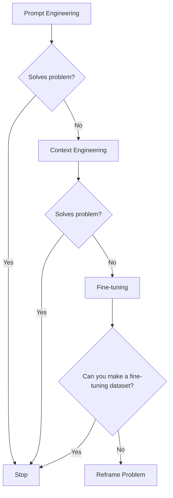
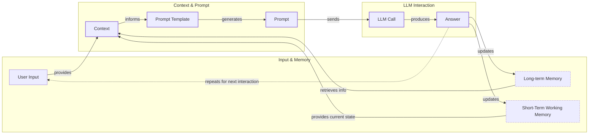
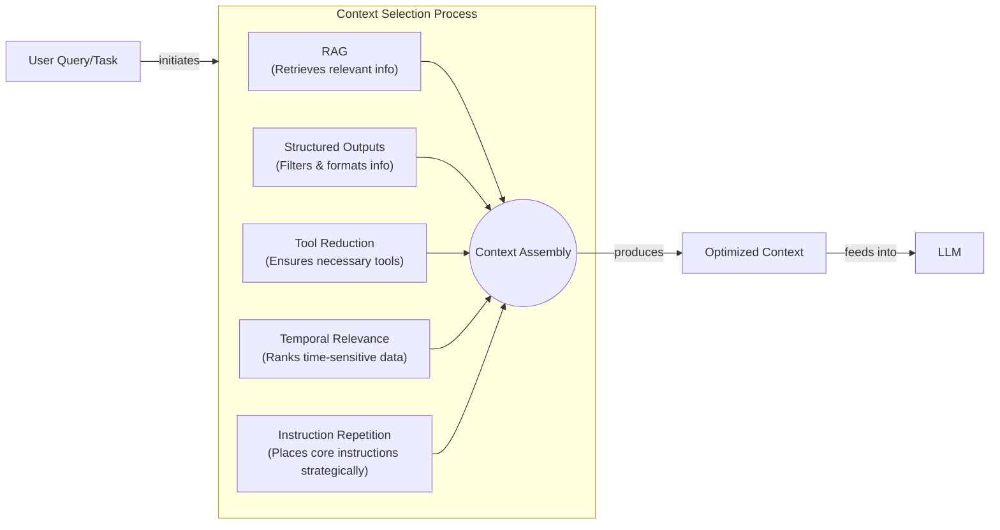
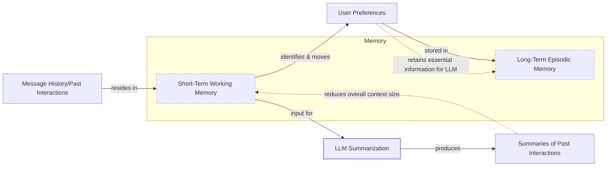
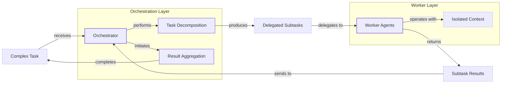

# Context Engineering

## When prompt engineering breaks

AI applications have evolved rapidly. In 2022, we had simple chatbots for question-and-answering, which often relied on predefined scripts and pattern matching, making them ineffective for complex queries [[26]](https://www.securityindustry.org/2024/07/16/understanding-the-evolution-from-classic-chatbots-to-rag-chatbots-to-ai-powered-assistants/). By 2023, Retrieval-Augmented Generation (RAG) systems connected LLMs to domain-specific knowledge, allowing for more contextual responses but limiting them to informational tasks without the ability to perform actions [[26]](https://www.securityindustry.org/2024/07/16/understanding-the-evolution-from-classic-chatbots-to-rag-chatbots-to-ai-powered-assistants/). 2024 brought us tool-using agents that could perform actions, bridging the gap between responding and acting [[27]](https://pagergpt.ai/ai-chatbot/evolution-of-ai-chatbots). Now, we are building memory-enabled agents that remember past interactions and build relationships over time, moving towards systems of collaborating agents with shared memory [[30]](https://www.linkedin.com/posts/ai-apps-central_most-people-put-all-ai-systems-in-the-same-activity-7438555783077793792-UEUm).

In our last lesson, we explored how to choose between AI agents and LLM workflows when designing a system. As these applications grow more complex, prompt engineering, a practice that once served us well, is showing its limits. It optimizes single LLM calls but fails when managing systems with memory, actions, and long interaction histories. The sheer volume of information an agent might need has grown exponentially. This includes past conversations, user data, documents, and action descriptions. Simply stuffing all this into a prompt is not a viable strategy.

The solution to this growing complexity is context engineering. It is the discipline of orchestrating this entire information ecosystem to ensure the LLM gets exactly what it needs, when it needs it. This skill is becoming a core foundation for AI engineering, moving beyond simple prompts to architecting the entire information flow for intelligent systems [[1]](https://arxiv.org/pdf/2507.13334).

## From prompt to context engineering

Prompt engineering, while effective for simple tasks, is designed for single, stateless interactions. It treats each call to an LLM as a new, isolated event. This approach breaks down in stateful applications where context must be preserved and managed across multiple turns.

As a conversation or task progresses, the context grows. Without a strategy to manage this growth, the LLM’s performance degrades. This is context decay: the model gets confused by the noise of an ever-expanding history [[3]](https://www.trychroma.com/research/context-rot). It starts to lose track of the original instructions or key information, a phenomenon often called "lost-in-the-middle" where models struggle to recall details buried in long inputs [[56]](https://www.linkedin.com/pulse/lost-middle-lesson-failing-ai-agents-backwards-anthony-dejohn-01k2e).

Even with large context windows, a physical limit exists for what you can include. The self-attention mechanism in transformers imposes a quadratic computational and memory overhead, meaning costs and processing time increase exponentially with context length [[1]](https://arxiv.org/pdf/2507.13334). Every token adds to the cost and latency of an LLM call [[16]](https://www.comet.com/site/blog/context-window/). Simply putting everything into the context creates a slow, expensive, and underperforming system. We will explore these concepts in more detail in upcoming lessons, including memory in Lesson 9 and RAG in Lesson 10.

On a recent project, we learned this the hard way. We were working with a model that supported a million-token context window, so we thought, "*What could go wrong*?" We stuffed everything in: our research, guidelines, examples, and user history. The result was an LLM workflow that took 30 minutes to run and produced low-quality outputs.

Context engineering provides the solution to these challenges. It addresses these limitations by treating AI applications not as a series of isolated prompts, but as systems that operate through dynamic context gathered from past conversations, databases, and tools [[7]](https://www.datacamp.com/blog/context-engineering). Thus, as AI Engineers, our job is to keep only what's essential in the context when we pass it to the LLM, making our applications accurate, fast, and cost-effective.

## Understanding context engineering

Context engineering is about finding the best way to arrange parts of your application's memory into the context that's passed to an LLM to get the best results. It's a solution to an optimization problem where you have to retrieve the right information from both your short-term and long-term memory to solve a specific task without overwhelming the model [[1]](https://arxiv.org/pdf/2507.13334). For example, when asking a cooking agent for a recipe, instead of passing the whole cookbook to the agent, we retrieve just the information about that recipe, together with personal preferences like allergies or taste preferences.

Andrej Karpathy offered a great analogy for this, stating that LLMs are like a new kind of operating system where the model is the CPU and its context window is the RAM [[66]](https://x.com/karpathy/status/1937902205765607626). Just as an operating system curates what fits into RAM, context engineering manages what information occupies the model’s limited working memory [[31]](https://www.langchain.com/blog/context-engineering-for-agents). This reframes the task from simply writing instructions to designing a system that manages this "RAM" efficiently. It elevates context management from a simple workaround to a core engineering discipline, similar to how an OS manages memory for a CPU [[33]](https://atlan.com/know/working-memory-llms/).

Context engineering is not replacing prompt engineering. Instead, prompt engineering is a subset of context engineering [[5]](https://blog.langchain.com/the-rise-of-context-engineering/). You still work with prompts, so learning how to write them effectively is a critical skill. But on top of that, it's important to know how to incorporate the right context into the prompt without compromising the LLM's performance. Context engineering is the system-level discipline, while prompt engineering is the tactical skill of crafting instructions within that system [[25]](https://www.glean.com/blog/context-engineering-ai-the-foundation-of-reliable-high-performing-models).

| Dimension | Prompt Engineering | Context Engineering |
| --- | --- | --- |
| Scope | Single interaction optimization | Entire information ecosystem |
| State Management | Stateless function | Stateful due to memory |
| Focus | How to phrase tasks | What information to provide |

Table 1: A comparison of prompt engineering and context engineering.

Context engineering is the new fine-tuning. While fine-tuning has its place, it is expensive, time-consuming, and inflexible. Data changes constantly, making fine-tuning a last resort [[2]](https://www.decodingai.com/p/context-engineering-2025s-1-skill). For most enterprise use cases, you get better results faster and more cheaply with context engineering. It allows for rapid iteration and adaptation to evolving data without altering the core model, a key advantage in dynamic environments [[51]](https://www.linkedin.com/posts/denis-panjuta_prompt-engineering-vs-context-engineering-activity-7363945251180322816-1q_m).

The decision framework is clear: fine-tuning is for teaching a model a new core skill or behavior, like consistently adhering to a specific JSON format or adopting a unique company voice. It alters the model's internal weights. In contrast, context engineering is for providing immediate, task-specific knowledge at inference time, such as feeding the model relevant documents to answer a question. Fine-tuning is a slow, resource-intensive process that requires large, high-quality datasets and expertise. Context engineering is a faster, more flexible approach that allows for quick iteration. You should always exhaust prompt and context engineering before considering the significant investment of fine-tuning.

When you start a new AI project, your decision-making process for guiding the LLM should look like the one presented in Image 1.



Image 1: A flowchart illustrating the decision-making workflow for choosing an AI project strategy.

You start with prompt engineering. If that doesn't solve your problem, you move to context engineering. Only if that fails, and you can create a high-quality dataset, should you consider fine-tuning. Otherwise, it is often better to reframe the problem.

For example, when processing Slack messages from your company, it's sufficient to use a reasoning LLM as the core of the agent and various mechanisms to retrieve specific Slack messages and take actions based on them, such as creating action points or writing emails. Fine-tuning the LLM on your company's communication style would likely be a waste of resources [[53]](https://www.mezmo.com/learn-observability/context-engineering-for-observability-how-to-deliver-the-right-data-to-llms). Throughout this course, we will show you how to solve most industry use cases using the power of context engineering.

## What makes up the context

To better understand context engineering, let's look at the core elements that build up the context. The context is connected to the prompt template and the final prompt that is sent to the LLM. The high-level workflow, as presented in Image 2, begins when a user input triggers the system to pull relevant information from both long-term and short-term memory. This information is assembled into the final context, inserted into a prompt template, and sent to the LLM. The LLM’s answer then updates the memory, and the cycle repeats.



Image 2: A high-level workflow diagram showing how context is connected to the prompt template and prompt in an LLM application.

These components are grouped into two main categories. We will explain them intuitively for now, as we have future dedicated lessons for all of them.

### Short-Term Working Memory

Short-term working memory is the state of the agent for the current task or conversation. It is volatile and changes with each interaction, helping the agent maintain a coherent dialogue and make immediate decisions [[39]](https://skymod.tech/why-memory-matters-in-llm-agents-short-term-vs-long-term-memory-architectures/). This is analogous to concepts from cognitive psychology, where working memory holds and manipulates information for immediate tasks, and executive functions filter what is relevant and inhibit distractions [[67]](https://medium.com/99p-labs/bridging-human-minds-and-machines-how-cognitive-psychology-shapes-the-future-of-llms-c474614fedc4). An agent's short-term memory serves a similar purpose, managing the active state needed for coherent reasoning. It can include some or all of these components:

**User input** is the most recent query or command from the user. It's the immediate trigger for the agent's response and directly shapes the current turn of the conversation.

**Message history** is the log of the current conversation, including both user inputs and agent responses. This allows the LLM to understand the flow of the dialogue and reference previous turns to maintain coherence.

**The agent's internal thoughts** are the reasoning steps the agent takes to decide on its next action. This "chain-of-thought" or "scratchpad" is part of the context that helps the model plan and execute complex tasks.

**Action calls and outputs** include the details of any external tools the agent has used and the results it received. This provides the agent with real-world information and feedback from its environment.

### Long-Term Memory

Long-term memory is more persistent and stores information across sessions, allowing the AI system to remember things beyond a single conversation. We divide it into three types, drawing parallels from human memory [[37]](https://www.datacamp.com/blog/how-does-llm-memory-work). An AI system can include some or all of them:

**Procedural memory** is knowledge encoded directly in the code. This includes the system prompt, which defines the agent's core behavior and rules. It also includes the definitions of available actions (tools) and schemas for structured outputs, which guide the format of its responses. This is the agent's built-in skills.

**Episodic memory** is the memory of specific past experiences, such as user preferences or previous interactions. It allows for personalization, like remembering a user's role or prior requests. This information is typically stored in vector or graph databases for efficient retrieval [[40]](https://labelstud.io/learningcenter/episodic-vs-persistent-memory-in-llms/).

**Semantic memory** is the agent’s factual knowledge base. It can be internal, like company documents stored in a database, or external, accessed via the internet through API calls. This is the core of RAG and provides the factual information the agent needs to answer questions accurately [[38]](https://www.analyticsvidhya.com/blog/2026/01/how-does-llm-memory-work/).

<https://substackcdn.com/image/fetch/f_auto,q_auto:good,fl_progressive:steep/https%3A%2F%2Fsubstack-post-media.s3.amazonaws.com%2Fpublic%2Fimages%2F39dce26a-e51e-4167-ac9e-ca28c45b53a6_1115x708.png> 
Image 3: A detailed illustration of what makes up the context of an AI agent. (Source [Decoding AI Magazine](https://www.decodingai.com/p/context-engineering-2025s-1-skill))

If this seems like a lot, bear with us. We will cover all these concepts in-depth in future lessons, including structured outputs in Lesson 4, actions in Lesson 6, memory in Lesson 9, and RAG in Lesson 10.

The key takeaway is that these components are not static. They are dynamically re-computed for every single interaction. For each conversation turn or new task, the short-term memory grows, and the long-term memory can change. A big part of context engineering is knowing how to pick the right components from this memory pool when building the prompt that's passed to the LLM.

## Production implementation challenges

Now that we understand what makes up the context, let's look at the core challenges of implementing it in production. These challenges all revolve around a single question: *"How can I keep my context as small as possible while providing enough information to the LLM?"*

Here are four common issues that come up when building AI applications:

**The context window challenge** is a primary constraint. Every AI model has a limited context window, the maximum amount of information (tokens) it can process at once [[16]](https://www.comet.com/site/blog/context-window/). Models like GPT-4o have a 128K token window, while Claude Opus 4 offers 200K, and Gemini 2.5 Pro advertises 1M tokens [[59]](https://atlan.com/know/llm-context-window-limitations/). However, for long-running tasks spanning dozens of LLM calls, context accumulates without active management, quickly exceeding even these large limits. A 50-step workflow with 20K tokens per call can consume 1M tokens in total [[16]](https://www.comet.com/site/blog/context-window/).

**Information overload**, also known as the "lost-in-the-middle" problem, occurs because too much context reduces the performance of the LLM by confusing it. Research from Stanford and UC Berkeley in 2023 showed that models attend well to the beginning and end of a context but poorly to the middle, with accuracy dropping over 30% for information in mid-window positions [[59]](https://atlan.com/know/llm-context-window-limitations/). This is a direct parallel to the primacy and recency effects in human psychology, where we tend to remember the first and last items in a list far better than those in the middle [[68]](https://arxiv.org/html/2504.02441v1). This means performance can degrade long before the physical context limit is reached, as the model overlooks critical details buried in a noisy input [[58]](https://dev.to/thousand_miles_ai/the-lost-in-the-middle-problem-why-llms-ignore-the-middle-of-your-context-window-3al2). This highlights a critical research gap known as the comprehension-generation asymmetry: models can ingest and understand vast contexts but struggle to generate equally sophisticated, long-form outputs based on that understanding [[69]](https://alphaxiv.org/overview/2507.13334v2).

**Context drift** occurs when conflicting versions of the truth accumulate over time [[6]](https://galileo.ai/blog/production-llm-monitoring-strategies). For example, if the memory contains both "The user's budget is $500" and later "The user's budget is $1,000," the agent can get confused. This can happen due to changes in user inputs, shifts in the knowledge base, or even variations in infrastructure that affect reasoning [[9]](https://insightfinder.com/blog/hidden-cost-llm-drift-detection). Without a mechanism to resolve or prune outdated facts, the agent's knowledge base becomes unreliable, leading to inconsistent or incorrect responses as it struggles to determine which information is authoritative [[8]](https://thenewstack.io/context-rot-enterprise-ai-llms/).

**Tool confusion** arises in two main ways. First, providing an agent with too many tools can paralyze it with choice or cause it to select the wrong one. The Gorilla benchmark showed that nearly all models perform worse when given more than one tool [[2]](https://www.decodingai.com/p/context-engineering-2025s-1-skill). Second, confusion can occur when tool descriptions are poorly written or overlap. If the distinctions between actions are unclear, the model struggles to choose the right one. Effective mitigation involves writing clear, concise, and distinct tool descriptions that precisely define each tool's purpose and parameters, avoiding ambiguity that could mislead the model's selection process [[7]](https://www.datacamp.com/blog/context-engineering).

## Key strategies for context optimization

Initially, most AI applications were chatbots over single knowledge bases. Today, modern AI solutions must manage multiple knowledge bases, tools, and complex conversational histories. Context engineering is about managing this complexity while meeting performance, latency, and cost requirements.

Here are four popular context engineering strategies used across the industry:

### Selecting the Right Context

Retrieving the right information from memory is a critical first step. A common mistake is to provide everything at once, assuming that models with large context windows can handle it. As we've discussed, the "lost-in-the-middle" problem often leads to poor performance, increased latency, and higher costs.

To solve this, consider these approaches:
*   **Use structured outputs** to define clear schemas for what the LLM should return. This allows you to pass only the necessary, structured information to downstream steps. We will cover this in detail in Lesson 4.
*   **Use RAG** to fetch only the specific chunks of text needed to answer a user's question, rather than providing entire documents. The mechanics of RAG involve breaking down large documents into smaller, manageable chunks, creating vector embeddings for each chunk, and storing them in a vector database. When a query comes in, the system retrieves the most semantically similar chunks to provide focused, relevant context to the LLM. This includes using re-ranking techniques to prioritize the most relevant chunks. This is a core topic we will explore in Lesson 10.
*   **Reduce the number of available tools** to avoid confusing the LLM. Studies have shown that applying RAG to tool descriptions and limiting the selection to under 30 tools can triple an agent's selection accuracy [[7]](https://www.datacamp.com/blog/context-engineering).
*   **Rank time-sensitive data** by date and filter out anything no longer relevant. This ensures the model receives the most current information, a technique sometimes called temporal ranking [[12]](https://www.dailydoseofds.com/llmops-crash-course-part-8/).
*   **Repeat core instructions** at both the start and the end of the prompt. This leverages the model's tendency to pay more attention to the context edges, ensuring critical instructions are not lost. This is a well-documented strategy to mitigate the "lost-in-the-middle" effect [[57]](https://promptmetheus.com/resources/llm-knowledge-base/lost-in-the-middle-effect).



Image 4: A system diagram illustrating how five context optimization techniques work together to select the right context for an LLM.

### Context Compression

As message history grows in short-term working memory, you must manage past interactions to keep your context window in check. You cannot simply drop past conversation turns, as the LLM still needs to remember what happened. Instead, you need ways to compress key facts from the past.

You can do this through:
*   **Creating summaries of past interactions:** Use an LLM to replace a long, detailed history with a concise overview. This is a common strategy in tools like Claude Code, which runs a "context-clearing" process to summarize the conversation when the context window is nearly full [[4]](https://blog.langchain.com/context-engineering-for-agents/). This is a form of abstractive summarization. Alternatively, you can use extractive summarization, which selects the most important sentences based on information density without generating new text. While extractive methods are faster and avoid potential hallucinations, abstractive summaries can be more coherent and compact [[11]](https://oneuptime.com/blog/post/2026-01-30-context-compression/view).
*   **Moving user preferences to long-term memory:** Transfer user preferences from working memory to long-term episodic memory. This keeps the working context clean while ensuring preferences are remembered for future sessions.
*   **Deduplication:** Remove redundant information from the context to avoid repetition. Techniques like semantic deduplication compute similarities between chunks and select a single representative, removing redundancy [[11]](https://oneuptime.com/blog/post/2026-01-30-context-compression/view).



Image 5: A process flow diagram illustrating context compression techniques.

### Isolating Context

Another powerful strategy is to isolate context by splitting information across multiple specialized agents. Instead of one agent with a massive, cluttered context window, you can have a team of agents, each with a smaller, focused context. This improves focus and allows for parallel processing.

We often implement this using an orchestrator-worker pattern, where a central orchestrator agent breaks down a problem and assigns sub-tasks to specialized worker agents [[46]](https://beam.ai/agentic-insights/multi-agent-orchestration-patterns-production). Each worker operates in its own isolated context, receiving only the information needed for its specific task. This prevents interference and makes the system more modular and scalable. For example, a billing agent never sees product data, which prevents cross-domain hallucinations and can reduce token consumption by 60-70% compared to a monolithic agent [[47]](https://gurusup.com/blog/multi-agent-orchestration-guide). We will cover this pattern in more detail in Lesson 5.



Image 6: An architecture diagram illustrating the orchestrator-worker pattern for context isolation in multi-agent systems.

### Format Optimization

Finally, the way you format the context matters. Models are sensitive to structure, and using clear delimiters can improve performance. Common strategies are to:
*   **Use XML tags:** Wrap different pieces of context in XML-like tags (e.g., `<user_query>`, `<documents>`). This helps the model distinguish between different types of information and improves reasoning reliability [[41]](https://www.decodingai.com/p/context-engineering-2025s-1-skill).
*   **Prefer YAML over JSON:** When providing structured data as input, YAML is often more token-efficient than JSON, which helps save space in your context window. One analysis suggests YAML can be 66% more token-efficient [[2]](https://www.decodingai.com/p/context-engineering-2025s-1-skill).

Ultimately, you always have to understand what is passed to the LLM. Seeing exactly what occupies your context window at every step is key to mastering context engineering. This is usually done by monitoring your application's traces, tracking what happens at each step, and understanding the inputs and outputs. Observability platforms like Opik or Maxim provide the necessary tools to inspect and debug these complex interactions [[18]](https://www.getmaxim.ai/articles/context-window-management-strategies-for-long-context-ai-agents-and-chatbots/). As this is a significant step to go from a proof-of-concept to production, we will have dedicated lessons on this topic.

## Here is an example

Let's connect the theory and strategies with a concrete example. Context engineering is applied to build powerful AI systems in various domains.

**Healthcare** systems use context engineering to provide personalized diagnostic support. An AI assistant can access a patient's medical history, including specific data types like known allergies, lifestyle habits, and current symptoms. This information, combined with the latest medical literature, allows the model to generate safe and relevant recommendations. A critical aspect here is privacy; systems must handle sensitive patient data responsibly, adhering to regulations and ensuring that only necessary information is used for a given query [[41]](https://www.decodingai.com/p/context-engineering-2025s-1-skill).

**Financial Services** agents integrate with enterprise tools like Customer Relationship Management (CRM) systems, emails, and calendars. They combine real-time market data with client portfolio information to generate tailored financial advice. Context engineering here involves managing access to confidential financial data and ensuring compliance with industry regulations.

**Project Task Managers** access enterprise infrastructure like CRMs, Slack, and task managers to automate workflows. They understand project requirements from various sources, create new tasks, and update existing ones, maintaining context across different platforms to ensure smooth project execution.

**Content Creator Assistants** use an individual's research, past content, and personality traits to generate new material. The context includes style guides, brand voice, and previous articles, allowing the agent to create content that is consistent and aligned with the creator's identity.

**Robotics** systems in the physical world use context-aware control to work safely alongside humans. By processing a constant stream of sensor data about the environment and human posture, a robot can predict movements and adapt its actions in real-time, preventing accidents and improving collaboration efficiency [[70]](https://www.techbriefs.com/component/content/article/39462-system-provides-robots-with-context-awareness), [[71]](https://arxiv.org/html/2402.05188v1).

Let's walk through a specific query to see context engineering in action with the healthcare assistant scenario. A user asks: `I have a headache. What can I do to stop it? I would prefer not to take any medicine.`

Before the AI attempts to answer, a context engineering system performs several steps:
1.  It retrieves the user's patient history, known allergies, and lifestyle habits from an **episodic memory** store.
2.  It queries a **semantic memory** of up-to-date medical literature for non-medicinal headache remedies.
3.  It assembles this information, along with the user's query and the conversation history, into a structured prompt.
4.  The prompt is sent to the LLM, which generates a personalized, safe, and relevant recommendation.
5.  The interaction is logged, and any new preferences are saved back to the user's episodic memory.

Here’s a simplified Python example showing how these components might be assembled into a complete system prompt.

```python
import yaml

# 1. Define user query and retrieved patient history (episodic memory)
user_query = "I have a headache. What can I do to stop it? I would prefer not to take any medicine."

patient_history = {
    "patient": {
        "name": "John Doe",
        "age": 45,
        "preferences": {
            "medication_avoidance": True,
            "preferred_treatments": "natural_remedies"
        },
        "habits": {
            "stress_level": "high",
            "caffeine_intake": "3-4_cups_daily"
        }
    }
}

# 2. Retrieve relevant medical literature (semantic memory)
medical_literature = {
    "articles": [
        {"topic": "dehydration_headaches", "finding": "Dehydration is a common cause of tension headaches."},
        {"topic": "cold_compress", "finding": "Applying a cold compress can help relieve migraine pain."},
        {"topic": "caffeine_withdrawal", "finding": "Caffeine withdrawal can trigger headaches."},
        {"topic": "stress_relief", "finding": "Stress-relief techniques are effective for tension headaches."}
    ]
}

# 3. Assemble the complete prompt with XML tags and YAML for data
prompt = f"""
<system_prompt>
You are a helpful and cautious AI healthcare assistant. Your goal is to provide safe, non-medicinal advice. Do not provide medical diagnoses.
</system_prompt>

<patient_history>
{yaml.dump(patient_history)}
</patient_history>

<medical_literature>
{yaml.dump(medical_literature)}
</medical_literature>

<user_query>
{user_query}
</user_query>

<instructions>
Based on all the information above, provide a helpful response.
</instructions>
"""

# The final prompt is now ready to be sent to the LLM
# print(prompt)
```

To build such a system, you would use a combination of tools. An LLM like Gemini provides the reasoning engine. A framework like LangGraph can orchestrate the workflow. Databases such as PostgreSQL, MongoDB, Redis, Qdrant, and Neo4j can serve as long-term memory stores. Often, it's recommended to keep it simple, as you can get very far with only PostgreSQL or MongoDB. Observability platforms like Opik or LangSmith are essential for debugging these complex interactions [[62]](https://blog.stackademic.com/context-engineering-in-llms-and-ai-agents-eb861f0d3e9b), [[64]](https://atlan.com/know/context-engineering-platforms-comparison/).

For a production code example, consider a content creation agent built with LangGraph. The agent's state could be defined to hold research notes, a draft, and feedback. Each step in the graph (e.g., `research`, `write_draft`, `incorporate_feedback`) would operate on this state, with each node having its own focused context. The `research` node might use RAG to pull from a vector store, while the `write_draft` node uses the research notes and a style guide. This is a more robust approach than a single, monolithic agent that tries to do everything at once. An alternative using LlamaIndex might involve its agent abstractions, which offer a higher-level way to define tools and memory but provide less granular control over the state transitions compared to LangGraph's explicit graph structure [[62]](https://blog.stackademic.com/context-engineering-in-llms-and-ai-agents-eb861f0d3e9b).

## Connecting context engineering to AI engineering

Mastering context engineering is less about learning a specific algorithm and more about building intuition. It’s the art of knowing how to structure prompts, what information to include, and how to order it for maximum impact. This skill helps you determine the minimal yet essential information an LLM needs to perform at its best.

This skill doesn't exist in a vacuum. It’s a multidisciplinary practice that sits at the intersection of several key engineering fields [[22]](https://www.mezmo.com/learn-observability/context-engineering-for-observability-how-to-deliver-the-right-data-to-llms), [[23]](https://sombrainc.com/blog/ai-context-engineering-guide):

*   **AI Engineering:** Understanding LLMs, RAG, and AI agents is the foundation. This involves implementing practical solutions like LLM workflows and evaluation pipelines.
*   **Software Engineering:** You need to build scalable and maintainable systems to aggregate context and wrap agents in robust APIs. This means applying principles like modularity, testing, and documentation to your AI applications.
*   **Data Engineering:** Constructing reliable data pipelines for RAG and other memory systems is critical. This includes Extract, Transform, Load (ETL) processes, data quality checks, and data governance to ensure the context is trustworthy.
*   **MLOps:** Deploying agents on the right infrastructure and automating Continuous Integration/Continuous Deployment (CI/CD) makes them reproducible, observable, and scalable. This involves practices like monitoring, logging, and versioning for both code and data.

Our goal with this course is to teach you how to combine these skills to build production-ready AI products. In the world of AI, we should all think in systems rather than isolated components, having a mindset shift from developers to architects.

The best way to develop your context engineering skills is to get your hands dirty. In our next lesson, we will explore structured outputs, a key technique for controlling what comes out of an LLM. As we move through the course, we will cover actions, memory, and RAG, giving you the building blocks to create your own context-aware agents. This also includes preparing for future challenges, such as multimodal context engineering, where agents must seamlessly blend text, audio, and video to understand the world more holistically [[72]](https://www.twelvelabs.io/blog/context-engineering-for-video-understanding).

## Conclusion

Context engineering is the essential discipline for building reliable and sophisticated AI applications. It moves beyond simple prompt crafting to the systematic design of an AI's entire information environment. By mastering techniques for selecting, compressing, isolating, and formatting context, you can build systems that are more accurate, efficient, and scalable.

This lesson has laid the foundation by explaining what context is, why it's critical, and how to manage it effectively. As we continue through this course, you will see these principles applied in every aspect of AI engineering, from building structured workflows to deploying autonomous agents. The future of AI lies not just in more powerful models, but in our ability to provide them with the right context to unlock their full potential.

## References

- [1] [A Survey of Context Engineering for Large Language Models](https://arxiv.org/pdf/2507.13334)
- [2] [Context Engineering: 2025’s #1 Skill in AI](https://www.decodingai.com/p/context-engineering-2025s-1-skill)
- [3] [Context Rot: How Increasing Input Tokens Impacts LLM Performance](https://www.trychroma.com/research/context-rot)
- [4] [Context Engineering for Agents](https://blog.langchain.com/context-engineering-for-agents/)
- [5] [The rise of "context engineering"](https://blog.langchain.com/the-rise-of-context-engineering/)
- [6] [Production LLM Monitoring Strategies to Detect, Diagnose, and Remediate Failures](https://galileo.ai/blog/production-llm-monitoring-strategies)
- [7] [Context Engineering: A Guide With Examples](https://www.datacamp.com/blog/context-engineering)
- [8] [Context Rot is the Silent Killer of Enterprise AI](https://thenewstack.io/context-rot-enterprise-ai-llms/)
- [9] [The Hidden Cost of LLM Drift Detection](https://insightfinder.com/blog/hidden-cost-llm-drift-detection)
- [10] [How to Reduce LLM Hallucination](https://www.helicone.ai/blog/how-to-reduce-llm-hallucination)
- [11] [Context Compression: Preserving Information in LLMs](https://oneuptime.com/blog/post/2026-01-30-context-compression/view)
- [12] [LLMOps Crash Course Part 8: Memory and Temporal Context](https://www.dailydoseofds.com/llmops-crash-course-part-8/)
- [13] [Cutting Through the Noise: Smarter Context Management for LLM-Powered Agents](https://blog.jetbrains.com/research/2025/12/efficient-context-management/)
- [14] [Context Window: What It Is and Why It Matters for AI Agents](https://www.comet.com/site/blog/context-window/)
- [15] [Your LLM Hits The Token Limit. Now What?](https://www.linkedin.com/posts/aditya-santhanam_your-llm-hits-the-token-limit-conversation-activity-7425863566190260224-Pz6v)
- [16] [Context Window: What It Is and Why It Matters for AI Agents](https://www.comet.com/site/blog/context-window/)
- [17] [Context Window Optimization for LLMs](https://datahub.com/blog/context-window-optimization/)
- [18] [Context Window Management Strategies for Long Context AI Agents and Chatbots](https://www.getmaxim.ai/articles/context-window-management-strategies-for-long-context-ai-agents-and-chatbots/)
- [19] [Your LLM Hits The Token Limit. Now What?](https://www.linkedin.com/posts/aditya-santhanam_your-llm-hits-the-token-limit-conversation-activity-7425863566190260224-Pz6v)
- [20] [Cutting Through the Noise: Smarter Context Management for LLM-Powered Agents](https://blog.jetbrains.com/research/2025/12/efficient-context-management/)
- [21] [Why AI coding assistants fail without context : an introduction to ContextOps](https://packmind.com/context-engineering-ai-coding/what-is-contextops/)
- [22] [Context Engineering for Observability: How to Deliver the Right Data to LLMs](https://www.mezmo.com/learn-observability/context-engineering-for-observability-how-to-deliver-the-right-data-to-llms)
- [23] [AI Context Engineering: An In-depth Guide With Examples](https://sombrainc.com/blog/ai-context-engineering-guide)
- [24] [Context engineering AI: The foundation of reliable, high-performing models](https://www.glean.com/blog/context-engineering-ai-the-foundation-of-reliable-high-performing-models)
- [25] [Context engineering AI: The foundation of reliable, high-performing models](https://www.glean.com/blog/context-engineering-ai-the-foundation-of-reliable-high-performing-models)
- [26] [Understanding the Evolution From Classic Chatbots to RAG Chatbots to AI-Powered Assistants](https://www.securityindustry.org/2024/07/16/understanding-the-evolution-from-classic-chatbots-to-rag-chatbots-to-ai-powered-assistants/)
- [27] [The Evolution of AI Chatbots: From Generative AI to Autonomous Agents](https://pagergpt.ai/ai-chatbot/evolution-of-ai-chatbots)
- [28] [When Did AI Chatbots Start? A Brief History](https://www.dante-ai.com/news/when-did-ai-chatbots-start)
- [29] [When Did AI Chatbots Start? A Brief History](https://www.dante-ai.com/news/when-did-ai-chatbots-start)
- [30] [Most people put all AI systems in the same bucket...](https://www.linkedin.com/posts/ai-apps-central_most-people-put-all-ai-systems-in-the-same-activity-7438555783077793792-UEUm)
- [31] [Context Engineering for Agents](https://www.langchain.com/blog/context-engineering-for-agents)
- [32] [Context Engineering vs. Prompt Engineering: Key Differences Explained](https://www.glean.com/perspectives/context-engineering-vs-prompt-engineering-key-differences-explained)
- [33] [Working Memory in LLMs: The Engineering View](https://atlan.com/know/working-memory-llms/)
- [34] [From Vibe Coding to Context Engineering: A Blueprint for Production-Grade GenAI Systems](https://www.sundeepteki.org/blog/from-vibe-coding-to-context-engineering-a-blueprint-for-production-grade-genai-systems)
- [35] [Context Engineering: The Silent Architecture Behind Every AI Agent](https://www.linkedin.com/pulse/context-engineering-silent-architecture-behind-every-ai-roychowdhury-lzcec)
- [36] [Working Memory in LLMs: The Engineering View](https://atlan.com/know/working-memory-llms/)
- [37] [How Does LLM Memory Work?](https://www.datacamp.com/blog/how-does-llm-memory-work)
- [38] [How Does LLM Memory Work? A Comprehensive Guide](https://www.analyticsvidhya.com/blog/2026/01/how-does-llm-memory-work/)
- [39] [Why Memory Matters in LLM Agents: Short-Term vs. Long-Term Memory Architectures](https://skymod.tech/why-memory-matters-in-llm-agents-short-term-vs-long-term-memory-architectures/)
- [40] [Episodic vs. Persistent Memory in LLMs](https://labelstud.io/learningcenter/episodic-vs-persistent-memory-in-llms/)
- [41] [Context Engineering: 2025’s #1 Skill in AI](https://www.decodingai.com/p/context-engineering-2025s-1-skill)
- [42] [Prompt Engineering in Healthcare: A Comprehensive Guide](https://www.mdpi.com/2079-9292/13/15/2961)
- [43] [Prompt Engineering in Healthcare: A Comprehensive Guide](https://www.mdpi.com/2079-9292/13/15/2961)
- [44] [Effective Context Engineering for AI Agents](https://www.anthropic.com/engineering/effective-context-engineering-for-ai-agents)
- [45] [Multi-Agent Orchestration Patterns for Production](https://beam.ai/agentic-insights/multi-agent-orchestration-patterns-production)
- [46] [Multi-Agent Orchestration Patterns for Production](https://beam.ai/agentic-insights/multi-agent-orchestration-patterns-production)
- [47] [Multi-Agent Orchestration: The Ultimate Guide](https://gurusup.com/blog/multi-agent-orchestration-guide)
- [48] [Multi-Agent Systems: Building with Context Engineering](https://www.vellum.ai/blog/multi-agent-systems-building-with-context-engineering)
- [49] [Deterministic AI Orchestration: A Platform Architecture for Autonomous Development](https://www.praetorian.com/blog/deterministic-ai-orchestration-a-platform-architecture-for-autonomous-development/)
- [50] [A Survey on Large Language Model-based Autonomous Agents](https://arxiv.org/html/2601.13671v1)
- [51] [Prompt Engineering vs. Context Engineering](https://www.linkedin.com/posts/denis-panjuta_prompt-engineering-vs-context-engineering-activity-7363945251180322816-1q_m)
- [52] [Prompt Engineering vs. Context Engineering: Which One Should You Use?](https://memgraph.com/blog/prompt-engineering-vs-context-engineering)
- [53] [Context Engineering for Observability: How to Deliver the Right Data to LLMs](https://www.mezmo.com/learn-observability/context-engineering-for-observability-how-to-deliver-the-right-data-to-llms)
- [54] [Context Engineering: How to Get Better Results from LLMs](https://www.instinctools.com/blog/context-engineering/)
- [55] [Agentic AI: Context Engineering vs. Prompt Engineering](https://neo4j.com/blog/agentic-ai/context-engineering-vs-prompt-engineering/)
- [56] [Lost in the Middle: A Lesson from Failing AI Agents (Backwards)](https://www.linkedin.com/pulse/lost-middle-lesson-failing-ai-agents-backwards-anthony-dejohn-01k2e)
- [57] [Lost-in-the-Middle Effect](https://promptmetheus.com/resources/llm-knowledge-base/lost-in-the-middle-effect)
- [58] [The Lost in the Middle Problem: Why LLMs Ignore the Middle of Your Context Window](https://dev.to/thousand_miles_ai/the-lost-in-the-middle-problem-why-llms-ignore-the-middle-of-your-context-window-3al2)
- [59] [LLM Context Window Limitations: Impacts, Risks, & Fixes in 2026](https://atlan.com/know/llm-context-window-limitations/)
- [60] [Needle in a Haystack: Optimizing Retrieval and RAG over Long Context Windows](https://bigdataboutique.com/blog/needle-in-haystack-optimizing-retrieval-and-rag-over-long-context-windows-5dfb3c)
- [61] [Context Engineering in AI: Building Smarter and More Aware Systems](https://www.codecademy.com/article/context-engineering-in-ai)
- [62] [Context Engineering in LLMs and AI Agents](https://blog.stackademic.com/context-engineering-in-llms-and-ai-agents-eb861f0d3e9b)
- [63] [How to implement context engineering in your AI coding workflow](https://packmind.com/context-engineering-ai-coding/how-to-implement-context-engineering/)
- [64] [Context Engineering Platforms: A 2026 Comparison](https://atlan.com/know/context-engineering-platforms-comparison/)
- [65] [LangGraph: A Developer’s Guide to Building Stateful, Multi-Agent LLM Workflows](https://www.scalablepath.com/machine-learning/langgraph)
- [66] [+1 for "context engineering" over "prompt engineering".](https://x.com/karpathy/status/1937902205765607626)
- [67] [Bridging Human Minds and Machines: How Cognitive Psychology Shapes the Future of LLMs](https://medium.com/99p-labs/bridging-human-minds-and-machines-how-cognitive-psychology-shapes-the-future-of-llms-c474614fedc4)
- [68] [Memory in Mind and Machine: A Comparative Analysis of Biological and Artificial Systems](https://arxiv.org/html/2504.02441v1)
- [69] [A Survey of Context Engineering for Large Language Models](https://alphaxiv.org/overview/2507.13334v2)
- [70] [System Provides Robots With Context Awareness](https://www.techbriefs.com/component/content/article/39462-system-provides-robots-with-context-awareness)
- [71] [In-Context Learning for Robotics with Feedback Loops](https://arxiv.org/html/2402.05188v1)
- [72] [Context Engineering for Video Understanding: Let's Get Multimodal](https://www.twelvelabs.io/blog/context-engineering-for-video-understanding)