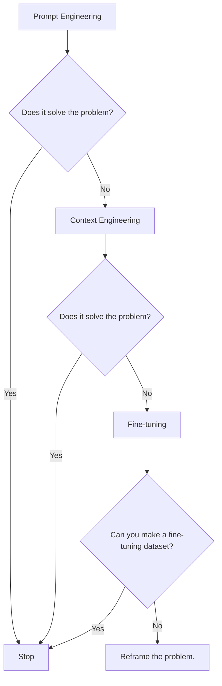
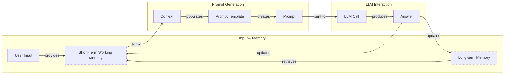
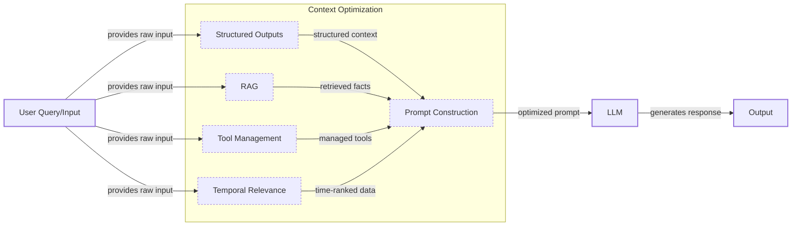
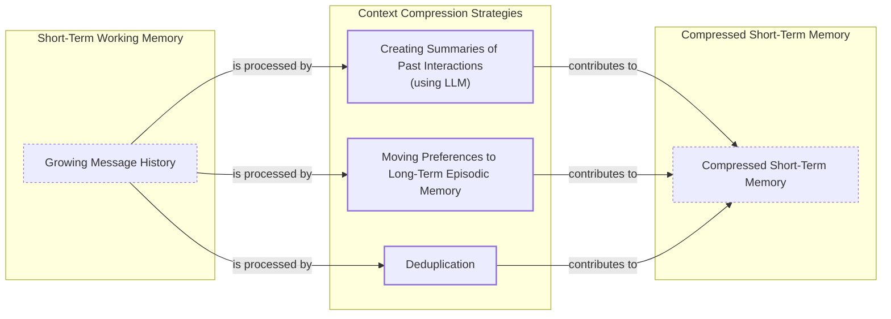
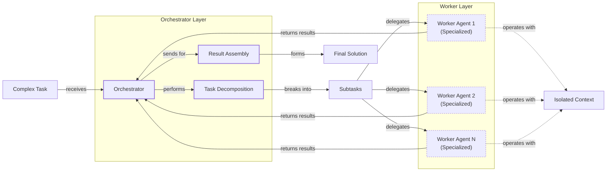

# Lesson 3: Context Engineering

AI applications have evolved rapidly. In 2022, we had simple chatbots for question-answering. By 2023, Retrieval-Augmented Generation (RAG) systems connected LLMs to domain-specific knowledge. 2024 brought us tool-using agents that could perform actions. Now, we are building memory-enabled agents that remember past interactions and build relationships over time.

In our last lesson, we explored how to choose between AI agents and LLM workflows when designing a system. As these applications grow more complex, prompt engineering, a practice that once served us well, is showing its limits. It optimizes single LLM calls but fails when managing systems with memory, actions, and long interaction histories. The sheer volume of information an agent might need—past conversations, user data, documents, and action descriptions—has grown exponentially. Simply stuffing all this into a prompt is not a viable strategy.

This is where context engineering comes in. It is the discipline of orchestrating this entire information ecosystem to ensure the LLM gets exactly what it needs, when it needs it. This skill is becoming a core foundation for AI engineering.

## From Prompt to Context Engineering

Prompt engineering, while effective for simple tasks, is designed for single, stateless interactions. It treats each call to an LLM as a new, isolated event. This approach breaks down in stateful applications where context must be preserved and managed across multiple turns [[31]](https://blog.langchain.com/context-engineering-for-agents/).

As a conversation or task progresses, the context grows. Without a strategy to manage this growth, the LLM’s performance degrades. This is context decay: the model gets confused by the noise of an ever-expanding history. It starts to lose track of the original instructions or key information [[41]](https://www.decodingai.com/p/context-engineering-2025s-1-skill).

Even with large context windows, a physical limit exists for what you can include. Also, on the operational side, every token adds to the cost and latency of an LLM call [[16]](https://www.comet.com/site/blog/context-window/). Simply putting everything into the context creates a slow, expensive, and underperforming system. We will explore these concepts in more detail in upcoming lessons, including memory in Lesson 9 and RAG in Lesson 10.

On a recent project, we learned this the hard way. We were working with a model that supported a million-token context window, so we thought, "What could go wrong?" We stuffed everything in: our research, guidelines, examples, and user history. The result was an LLM workflow that took 30 minutes to run and produced low-quality outputs [[41]](https://www.decodingai.com/p/context-engineering-2025s-1-skill).

This is where context engineering becomes essential. It shifts the focus from crafting static prompts to building dynamic systems that manage information flow. As an AI engineer, your job is to select only the most critical pieces of context for each LLM call. This makes your applications accurate, fast, and cost-effective [[41]](https://www.decodingai.com/p/context-engineering-2025s-1-skill).

## Understanding Context Engineering

Context engineering is about finding the best way to arrange parts of your memory into the context that is passed to the LLM to squeeze out the best results. It is a solution to an optimization problem where you have to retrieve the right parts of both your short and long-term memory to solve a specific task without overwhelming the LLM [[22]](https://arxiv.org/pdf/2507.13334). For example, when you ask a cooking agent for a recipe, you do not give it the entire cookbook. Instead, you retrieve the specific recipe, along with personal context like allergies or taste preferences. This precise selection ensures the model receives only the essential information.

Andrej Karpathy offered a great analogy for this: LLMs are like a new kind of operating system, where the model acts as the CPU and its context window functions as the RAM [[31]](https://www.langchain.com/blog/context-engineering-for-agents). Just as an operating system manages what fits into RAM, context engineering curates what occupies the model’s working memory. It is important to note that the context is a subset of the system's total working memory; you can hold information without passing it to the LLM on every turn [[41]](https://www.decodingai.com/p/context-engineering-2025s-1-skill).

This analogy can be extended by drawing parallels to cognitive psychology. The LLM's context window is like a human's working memory, which holds information for immediate use. The practice of context engineering, then, is like a human's executive function, which strategically filters relevant information and inhibits irrelevant patterns to improve focus and reasoning [[85]](https://medium.com/99p-labs/bridging-human-minds-and-machines-how-cognitive-psychology-shapes-the-future-of-llms-c474614fedc4).

Context engineering is not replacing prompt engineering. Instead, prompt engineering is a subset of context engineering. You still need to learn how to write good prompts while gathering the right context and stuffing it into your prompt without breaking the LLM [[41]](https://www.decodingai.com/p/context-engineering-2025s-1-skill). The table below summarizes the key differences.

| Dimension | Prompt Engineering | Context Engineering |
| :--- | :--- | :--- |
| Scope | Single interaction optimization | Entire information ecosystem |
| State Management | Primarily stateless | Inherently stateful, with explicit memory management |
| Focus | How to phrase tasks | What information to provide |
Table 1: A comparison of prompt engineering and context engineering.

Context engineering is the new fine-tuning. While fine-tuning has its place, it is expensive, time-consuming, and inflexible. Data changes constantly, making fine-tuning a last resort [[51]](https://www.linkedin.com/posts/denis-panjuta_prompt-engineering-vs-context-engineering-activity-7363945251180322816-1q_m). For most enterprise use cases, you get better results faster and more cheaply with context engineering. It allows for rapid iteration and adaptation to evolving data without altering the core model, a key advantage in dynamic environments.

When you start a new AI project, your decision-making process for guiding the LLM should look like the one presented in Image 1. You start with the simplest approach and only move to more complex ones if needed.


Image 1: A flowchart illustrating the decision-making workflow for choosing a key strategy when starting a new AI project.

For instance, if you build an agent to process internal Slack messages, you do not need to fine-tune a model on your company’s communication style. It is more effective to use a powerful reasoning model and engineer the context to retrieve specific messages and enable actions like creating tasks or drafting emails. Throughout this course, we will show you how to solve most industry problems using only context engineering.

## What Makes Up the Context

To master context engineering, you first need to understand what "context" actually is. It is everything the LLM sees in a single turn, dynamically assembled from various memory components before being passed to the model [[31]](https://www.langchain.com/blog/context-engineering-for-agents/).

The high-level workflow, as presented in Image 2, begins when a user input triggers the system to pull relevant information from both long-term and short-term memory. This information is assembled into the final context, inserted into a prompt template, and sent to the LLM. The LLM’s answer then updates the memory, and the cycle repeats.


Image 2: A flowchart illustrating the high-level workflow of how context is built and used in an LLM application.

These components are grouped into two main categories. We will explain them intuitively for now, as we have future dedicated lessons for all of them.

### Short-Term Working Memory

Short-term working memory is the state of the agent for the current task or conversation. It is volatile and changes with each interaction, helping the agent maintain a coherent dialogue and make immediate decisions. It can include some or all of these components [[39]](https://skymod.tech/why-memory-matters-in-llm-agents-short-term-vs-long-term-memory-architectures/):

*   **User input:** The most recent query or command from the user. Its integration has an immediate impact on the context.
*   **Message history:** The log of the current conversation, allowing the LLM to understand the flow and previous turns. This is crucial for maintaining coherence.
*   **Agent's internal thoughts:** The reasoning steps the agent takes to decide on its next action, often referred to as a scratchpad.
*   **Action calls and outputs:** The results from any actions the agent has performed, providing information from external systems for subsequent steps.

### Long-Term Memory

Long-term memory is more persistent and stores information across sessions, allowing the AI system to remember things beyond a single conversation. We divide it into three types, drawing parallels from human memory [[37]](https://www.datacamp.com/blog/how-does-llm-memory-work). An AI system can include some or all of them:

*   **Procedural memory:** This is knowledge encoded directly in the code. It includes the system prompt, which sets the agent's overall behavior. It also includes the definitions of available actions, which tell the agent what it can do, and schemas for structured outputs, which guide the format of its responses. Think of this as the agent's built-in skills [[38]](https://www.analyticsvidhya.com/blog/2026/01/how-does-llm-memory-work/).
*   **Episodic memory:** This is memory of specific past experiences, like user preferences or previous interactions. It is used to help the agent personalize its responses based on individual users. We typically store this in vector or graph databases for efficient retrieval [[40]](https://labelstud.io/learningcenter/episodic-vs-persistent-memory-in-llms/).
*   **Semantic memory:** This is the agent’s general knowledge base. It can be internal, like company documents, or external, accessed via the internet through API calls. This memory provides the factual information the agent needs to answer questions [[36]](https://atlan.com/know/working-memory-llms/).

If this seems like a lot, bear with us. We will cover all these concepts in-depth in future lessons, including structured outputs (Lesson 4), actions (Lesson 6), memory (Lesson 9), RAG (Lesson 10), and working with multimodal data (Lesson 11).

https://substackcdn.com/image/fetch/f_auto,q_auto:good,fl_progressive:steep/https%3A%2F%2Fsubstack-post-media.s3.amazonaws.com%2Fpublic%2Fimages%2F39dce26a-e51e-4167-ac9e-ca28c45b53a6_1115x708.png
Image 3: A detailed illustration of how all the context engineering components work together inside an AI agent (Source [Decoding AI Magazine](https://www.decodingai.com/p/context-engineering-2025s-1-skill) [[41]](https://www.decodingai.com/p/context-engineering-2025s-1-skill))

The key takeaway is that these components are not static. They are dynamically re-computed for every single interaction. For each conversation turn or new task, the short-term memory grows, or the long-term memory can change. Context engineering involves knowing how to select the right pieces from this vast memory pool to construct the most effective prompt for the task at hand.

## Production Implementation Challenges

Now that we understand what makes up the context, let's look at the core challenges of implementing it in production. These challenges all revolve around a single question: "How can I keep my context as small as possible while providing enough information to the LLM?" A practical approach is to define "context budgets" that set explicit limits on context size to keep agents fast, predictable, and cost-effective [[103]](https://auotam.com/blog/context-budgets-for-production-agents).

Here are five common issues that come up when building AI applications:

1.  **The context window challenge:** Every AI model has a limited context window, the maximum amount of information (tokens) it can process at once. Think of it like your computer's RAM. If your machine has only 32GB of RAM, that is all it can use at one time. While context windows are getting larger, they are not infinite, and treating them as such leads to other problems [[17]](https://datahub.com/blog/context-window-optimization/).

2.  **Information overload:** Just because you can fit a lot of information into the context does not mean you should. Too much context reduces the performance of the LLM by confusing it. This is known as the "lost-in-the-middle" or "needle in a haystack" problem, where LLMs are known for remembering information best at the beginning and end of the context window [[56]](https://www.linkedin.com/pulse/lost-middle-lesson-failing-ai-agents-backwards-anthony-dejohn-01k2e). Information in the middle is often overlooked, and performance can drop long before the physical context limit is reached, a result of information-theoretic limits that cause semantic drift and ranking noise as retrieval breadth increases [[68]](https://arxiv.org/html/2511.12869v1), [[58]](https://dev.to/thousand_miles_ai/the-lost-in-the-middle-problem-why-llms-ignore-the-middle-of-your-context-window-3al2).

3.  **Context drift and poisoning:** Context drift occurs when conflicting versions of the truth accumulate in the memory over time [[41]](https://www.decodingai.com/p/context-engineering-2025s-1-skill). A more severe issue is context poisoning, where compromised or outdated information enters the context and propagates into answers, creating cascading errors. This is especially dangerous in systems that use long-term memory, as malicious data can be introduced to corrupt the knowledge base and cause persistent policy misalignment [[76]](https://www.elastic.co/search-labs/blog/context-poisoning-llm), [[78]](https://neuraltrust.ai/blog/memory-context-poisoning).

4.  **Tool confusion:** The final challenge is tool confusion, which arises in two main ways. First, adding too many actions to an agent can confuse the LLM about the best one for the job, a problem that often appears with over 100 actions [[41]](https://www.decodingai.com/p/context-engineering-2025s-1-skill). Second, confusion can occur when tool descriptions are poorly written or overlap. The Gorilla benchmark shows that nearly all models perform worse when given more than one tool. If the distinctions between actions are unclear, even a human would struggle to choose the right one [[41]](https://www.decodingai.com/p/context-engineering-2025s-1-skill).

5.  **Privacy and security risks:** The use of persistent episodic memory introduces significant privacy challenges. By creating a durable record of user interactions, these systems build detailed profiles that can include sensitive personal information [[96]](https://arxiv.org/html/2508.07664v1). This also creates new security risks. In an incident known as Echoleak, a prompt hidden in an email tricked an agent into leaking private information from prior conversations because it could not isolate the new prompt from old memories [[97]](https://www.newamerica.org/insights/ai-agents-and-memory/).

## Key Strategies for Context Optimization

Initially, most AI applications were chatbots over single knowledge bases. Today, modern AI solutions must manage multiple knowledge bases, tools, and complex conversational histories. Advanced systems are even moving toward real-time context engines that continuously maintain and materialize context for agents to query [[92]](https://www.deltastream.io/blog/deltastream-the-real-time-context-engine-for-agents/). Context engineering is about managing this complexity while meeting performance, latency, and cost requirements.

Here are four popular context engineering strategies used across the industry:

### Selecting the Right Context

Retrieving the right information from memory is a critical first step. A common mistake is to provide everything at once, assuming that models with large context windows can handle it. As we have discussed, the "lost-in-the-middle" problem often leads to poor performance, increased latency, and higher costs [[59]](https://atlan.com/know/llm-context-window-limitations/).

To solve this, consider these approaches:

*   **Use structured outputs:** Define clear schemas for what the LLM should return. This allows you to pass only the necessary, structured information to downstream steps. We will cover this in detail in Lesson 4.
*   **Use RAG:** Instead of providing entire documents, use RAG to fetch only the specific chunks of text needed to answer a user's question. This is a core topic we will explore in Lesson 10.
*   **Reduce the number of available actions:** Rather than giving an agent access to every available action, use various strategies to delegate action subsets to specialized components. Studies show that keeping tool selections under 30 can improve selection accuracy threefold [[21]](https://packmind.com/context-engineering-ai-coding/what-is-contextops/). Still, the ideal number depends on the tools, the LLM, and how well the actions are defined.
*   **Rank time-sensitive data:** For time-sensitive information, rank it by date and filter out anything no longer relevant [[12]](https://www.dailydoseofds.com/llmops-crash-course-part-8/).
*   **Use "just-in-time" retrieval:** Instead of pre-loading all possible context, give agents tools to retrieve information on demand. This allows them to incrementally discover relevant context through exploration, assembling understanding layer by layer while keeping working memory lean [[94]](https://www.anthropic.com/engineering/effective-context-engineering-for-ai-agents).
*   **Repeat core instructions:** For the most important instructions, repeat them at both the start and the end of the prompt. This uses the model's tendency to pay more attention to the context edges, ensuring core instructions are not lost [[57]](https://promptmetheus.com/resources/llm-knowledge-base/lost-in-the-middle-effect).


Image 4: A system architecture diagram illustrating context optimization techniques in an AI system.

### Context Compression

As message history grows in short-term working memory, you must manage past interactions to keep your context window in check. You cannot simply drop past conversation turns, as the LLM still needs to remember what happened. Instead, you need ways to compress key facts from the past.

You can do this through [[11]](https://oneuptime.com/blog/post/2026-01-30-context-compression/view):

1.  **Creating summaries of past interactions:** Use an LLM to replace a long, detailed history with a concise overview.
2.  **Moving user preferences to long-term memory:** Transfer user preferences from working memory to long-term episodic memory. This keeps the working context clean while ensuring preferences are remembered for future sessions.
3.  **Deduplication:** Remove redundant information from the context to avoid repetition.

While these techniques work within the Transformer architecture, emerging architectures like State-Space Models (SSMs) offer a different approach. Unlike Transformers, which are like databases that recall every detail, SSMs are more brain-like, summarizing past context into a fixed-size hidden state. This makes them highly efficient for managing extremely long sequences [[73]](https://goombalab.github.io/blog/2025/tradeoffs/), [[71]](https://pub.towardsai.net/exploring-state-space-models-the-next-evolution-beyond-transformers-ddf99362f722).


Image 5: A process diagram illustrating context compression strategies, showing the flow from growing message history through various compression steps to a compressed short-term memory.

### Isolating Context

Another powerful strategy is to isolate context by splitting information across multiple agents or LLM workflows. This technique is similar to tool isolation but applies to the entire context. The key idea is that instead of one agent with a massive, cluttered context window, you can have a team of agents, each with a smaller, focused context [[48]](https://www.vellum.ai/blog/multi-agent-systems-building-with-context-engineering).

We often implement this using an orchestrator-worker pattern, where a central orchestrator agent breaks down a problem and assigns sub-tasks to specialized worker agents. Each worker operates in its own isolated context, improving focus and allowing for parallel processing. We will cover this pattern in more detail in Lesson 5 [[46]](https://beam.ai/agentic-insights/multi-agent-orchestration-patterns-production).


Image 6: An architecture diagram illustrating the orchestrator-worker pattern for context isolation.

### Format Optimizations

Finally, the way you format the context matters. Models are sensitive to structure, and using clear delimiters can improve performance. Common strategies are to:

*   **Use XML tags:** Wrap different pieces of context in XML-like tags (e.g., `<user_query>`, `<documents>`). This helps the model distinguish between different types of information, while making it easier for the engineer to reference context elements within the system prompt [[44]](https://www.anthropic.com/engineering/effective-context-engineering-for-ai-agents).
*   **Prefer YAML over JSON:** When providing structured data as input, YAML is often more token-efficient than JSON, which helps save space in your context window [[41]](https://www.decodingai.com/p/context-engineering-2025s-1-skill).
*   **Design for the KV cache:** A more advanced technique is to structure the context to maximize the use of the Key-Value (KV) cache, which stores intermediate attention calculations. This can dramatically cut latency. The best practice is to arrange context in layers from most stable (system prompt, tools) to most volatile (user input, recent history). This ensures that only the newest tokens invalidate the cache, preserving the computations from the stable prefix [[102]](https://fp8.co/articles/Context-Engineering-for-AI-Agents).

You always have to understand what is passed to the LLM. Seeing exactly what occupies your context window at every step is key to mastering context engineering. Usually, this is done by properly monitoring your traces, tracking what happens at each step, and understanding what the inputs and outputs are. As this is a significant step to go from PoC to production, we will have dedicated lessons on this [[18]](https://www.getmaxim.ai/articles/context-window-management-strategies-for-long-context-ai-agents-and-chatbots/).

## Here is an Example

Let's connect the theory and strategies discussed earlier with concrete examples. Consider several common real-world scenarios:

*   **Healthcare:** An AI assistant accesses a patient's medical history, current symptoms, and relevant medical literature to suggest personalized diagnoses [[41]](https://www.decodingai.com/p/context-engineering-2025s-1-skill).
*   **Financial Services:** An agent might integrate with a company's Customer Relationship Management (CRM) system, calendars, and financial data to make decisions based on user preferences [[41]](https://www.decodingai.com/p/context-engineering-2025s-1-skill).
*   **Project Management:** An AI system can access enterprise tools like CRMs, Slack, and task managers to automatically understand project requirements and update tasks.
*   **Content Creator Assistant:** An AI agent uses your research, past content, and personality traits to understand what and how to create a given piece of content.

Let's walk through a specific query to see context engineering in action with the healthcare assistant scenario. A user asks: `I have a headache. What can I do to stop it? I would prefer not to take any medicine.`

Before the AI attempts to answer, a context engineering system performs several steps [[41]](https://www.decodingai.com/p/context-engineering-2025s-1-skill):

1.  It retrieves the user's patient history, known allergies, and lifestyle habits from episodic memory.
2.  It queries a medical database for non-pharmacological headache remedies from semantic memory.
3.  It assembles the key units of information from both memory types into the final context.
4.  It formats this information into a structured prompt and calls the LLM.
5.  Finally, it presents a personalized, context-aware answer to the user.

Here is a simplified Python example showing how you might structure the context and prompt for the LLM, using XML tags to format the different context elements.

1.  First, we import the necessary libraries and define the user's query.
    ```python
    import yaml
    
    user_query = "I have a headache. What can I do to stop it? I would prefer not to take any medicine."
    ```

2.  Next, we define the patient's history, which would typically be retrieved from episodic memory.
    ```python
    patient_history = {
        "patient": {
            "name": "John Doe",
            "age": 45,
            "gender": "M",
            "conditions": ["mild_hypertension"],
            "allergies": [],
            "preferences": {
                "medication_avoidance": True,
                "preferred_treatments": "natural_remedies"
            },
            "habits": {
                "stress_level": "high",
                "work_related": True,
                "caffeine_intake": "3-4_cups_daily"
            }
        }
    }
    ```

3.  Then, we include relevant medical literature, which would be retrieved from semantic memory.
    ```python
    medical_literature = {
        "articles": [
            {
                "id": 1,
                "topic": "dehydration_headaches",
                "finding": "Dehydration is a common cause of tension headaches",
                "treatment": "Rehydration can alleviate symptoms within 30 minutes to three hours"
            },
            {
                "id": 2,
                "topic": "cold_compress",
                "finding": "Applying a cold compress to the forehead and temples can constrict blood vessels",
                "treatment": "Reduces inflammation, helping to relieve migraine pain"
            },
            {
                "id": 3,
                "topic": "caffeine_withdrawal",
                "finding": "Caffeine withdrawal can trigger headaches",
                "treatment": "For regular caffeine consumers, a small amount may alleviate withdrawal headaches"
            },
            {
                "id": 4,
                "topic": "stress_relief",
                "finding": "Stress-relief techniques are effective for tension headaches",
                "treatment": "Deep breathing, meditation, or short walks can help"
            }
        ]
    }
    ```

4.  Finally, we assemble the complete prompt. Notice how we format the patient history and medical literature as YAML instead of JSON for token efficiency.
    ```python
    prompt = f"""
    <system_prompt>
    You are a helpful AI medical assistant. Your role is to provide safe, helpful, and personalized health advice based on the provided context. Do not give advice outside of the provided context. Prioritize non-medicinal options as per user preference.
    </system_prompt>
    
    <patient_history>
    {yaml.dump(patient_history)}
    </patient_history>
    
    <medical_literature>
    {yaml.dump(medical_literature)}
    </medical_literature>
    
    <user_query>
    {user_query}
    </user_query>
    
    <instructions>
    Based on all the information above, provide a step-by-step plan for the user to relieve their headache. Structure your response clearly.
    </instructions>
    """
    ```

To build such a system, you need a robust tech stack. Here is a potential stack we recommend and will use throughout this course:

*   **LLM:** Gemini for its multimodal, reasoning, and cost-effective API.
*   **Orchestration:** LangGraph for defining stateful, agentic workflows.
*   **Databases:** PostgreSQL, MongoDB, Redis, Qdrant, and Neo4j. It is often effective to keep it simple, as you can achieve much with only PostgreSQL or MongoDB.
*   **Observability:** Opik or LangSmith for evaluation and trace monitoring.

## Connecting Context Engineering to AI Engineering

Mastering context engineering is less about learning a specific algorithm and more about building intuition. It is the art of knowing how to structure prompts, what information to include, and how to order it for maximum impact [[31]](https://www.langchain.com/blog/context-engineering-for-agents/).

This skill does not exist in a vacuum. It is a multidisciplinary practice that sits at the intersection of several key engineering fields:

1.  **AI Engineering:** Understanding LLMs, RAG, and AI agents is the foundation.
2.  **Software Engineering:** You need to build scalable and maintainable systems to aggregate context and wrap agents in robust APIs [[23]](https://sombrainc.com/blog/ai-context-engineering-guide).
3.  **Data Engineering:** Constructing reliable data pipelines for RAG and other memory systems is critical [[22]](https://www.mezmo.com/learn-observability/context-engineering-for-observability-how-to-deliver-the-right-data-to-llms).
4.  **MLOps:** Deploying agents on the right infrastructure and automating Continuous Integration/Continuous Deployment (CI/CD) makes them reproducible, observable, and scalable [[21]](https://packmind.com/context-engineering-ai-coding/what-is-contextops/).

This extends all the way to the hardware layer. The software strategies we use today are influencing the design of next-generation AI accelerators. Companies are now building custom chips designed to support models with over 10 million tokens of context, aiming to solve context limitations at the silicon level [[90]](https://aimultiple.com/ai-chip-makers).

Our goal with this course is to teach you how to combine these skills to build production-ready AI products. We like to say that in the world of AI, we should all think in systems rather than isolated components, having a mindset shift from developers to architects.

In the next lesson, we will explore structured outputs.

## References

- [1] Kamradt, G. (2023). Needle In A Haystack - Pressure Testing LLMs [GitHub Repository]. https://github.com/gkamradt/LLMTest_NeedleInAHaystack
- [2] Wu, D., Wang, H., Yu, W., Zhang, Y., Chang, K.-W., and Yu, D. (2025). LongMemEval: Benchmarking Chat Assistants on Long-Term Interactive Memory. arXiv preprint arXiv:2410.10813. https://arxiv.org/abs/2410.10813
- [3] Hong, K., Troynikov, A., & Huber, J. (2025). Context Rot: How Increasing Input Tokens Impacts LLM Performance. Chroma. https://www.trychroma.com/research/context-rot
- [4] Mei, L., Yao, J., Ge, Y., Wang, Y., Bi, B., Cai, Y., Liu, J., Li, M., Li, Z., Zhang, D., Zhou, C., Mao, J., Xia, T., Guo, J., & Liu, S. (2025, July 17). A survey of context engineering for large language models. arXiv.org. https://arxiv.org/pdf/2507.13334
- [6] Galileo. (2025). Production LLM Monitoring Strategies to Detect & Mitigate Drift. https://galileo.ai/blog/production-llm-monitoring-strategies
- [7] Coforge. (n.d.). Navigating the Shifting Sands: Understanding and Mitigating Data Drift in LLMs. https://www.coforge.com/what-we-know/blog/navigating-the-shifting-sands-understanding-and-mitigating-data-drift-in-llms
- [8] The New Stack. (2026). Context Rot: The Silent Killer of Enterprise AI LLMs. https://thenewstack.io/context-rot-enterprise-ai-llms/
- [9] InsightFinder. (n.d.). The Hidden Cost of LLM Drift and Why Early Detection Matters. https://insightfinder.com/blog/hidden-cost-llm-drift-detection/
- [10] Helicone. (n.d.). How to Reduce LLM Hallucinations: A Comprehensive Guide. https://www.helicone.ai/blog/how-to-reduce-llm-hallucination
- [11] OneUptime. (2026). Context Compression: A Practical Guide for LLM Applications. https://oneuptime.com/blog/post/2026-01-30-context-compression/view
- [12] Daily Dose of DS. (n.d.). LLMOps Crash Course Part 8: Memory and Temporal Context. https://www.dailydoseofds.com/llmops-crash-course-part-8/
- [13] arXiv. (2025). Context Compression via Summarization for SLM-based Relevance Ranking. https://arxiv.org/html/2510.22101v1
- [14] JetBrains Research. (2025). Efficient Context Management for LLM-Powered Agents. https://blog.jetbrains.com/research/2025/12/efficient-context-management/
- [16] Kinzer, K. (2025, December 23). Context Window: What It Is and Why It Matters for AI Agents. Comet. https://www.comet.com/site/blog/context-window/
- [17] DataHub. (n.d.). Context Window Optimization: Maximizing LLM Performance. https://datahub.com/blog/context-window-optimization/
- [18] Maxim.ai. (n.d.). Context Window Management Strategies for Long-Context AI Agents and Chatbots. https://www.getmaxim.ai/articles/context-window-management-strategies-for-long-context-ai-agents-and-chatbots/
- [20] JetBrains Research. (2025). Efficient Context Management for LLM-Powered Agents. https://blog.jetbrains.com/research/2025/12/efficient-context-management/
- [21] Py, L. (n.d.). Why AI coding assistants fail without context: an introduction to ContextOps. Packmind. https://packmind.com/context-engineering-ai-coding/what-is-contextops/
- [22] Mezmo. (n.d.). Context Engineering for Observability: How to Deliver the Right Data to LLMs. https://www.mezmo.com/learn-observability/context-engineering-for-observability-how-to-deliver-the-right-data-to-llms
- [23] Sombra. (n.d.). AI Context Engineering: A Comprehensive Guide. https://sombrainc.com/blog/ai-context-engineering-guide
- [25] Glean. (n.d.). Context Engineering in AI: The Foundation of Reliable, High-Performing Models. https://www.glean.com/blog/context-engineering-ai-the-foundation-of-reliable-high-performing-models
- [26] Security Industry Association. (2024). Understanding the Evolution from Classic Chatbots to RAG Chatbots to AI-Powered Assistants. https://www.securityindustry.org/2024/07/16/understanding-the-evolution-from-classic-chatbots-to-rag-chatbots-to-ai-powered-assistants/
- [31] The LangChain Team. (2025, July 2). Context Engineering. LangChain Blog. https://blog.langchain.com/context-engineering-for-agents/
- [32] Glean. (n.d.). Context Engineering vs. Prompt Engineering: Key Differences Explained. https://www.glean.com/perspectives/context-engineering-vs-prompt-engineering-key-differences-explained
- [33] Atlan. (n.d.). Working Memory in LLMs: The Real Bottleneck Beyond Context Windows. https://atlan.com/know/working-memory-llms/
- [34] Teki, S. (n.d.). From Vibe Coding to Context Engineering: A Blueprint for Production-Grade GenAI Systems. https://www.sundeepteki.org/blog/from-vibe-coding-to-context-engineering-a-blueprint-for-production-grade-genai-systems
- [35] Roychowdhury, A. (2025). Context Engineering: The Silent Architecture Behind Every AI Agent. LinkedIn. https://www.linkedin.com/pulse/context-engineering-silent-architecture-behind-every-ai-roychowdhury-lzcec
- [36] Atlan. (n.d.). Working Memory in LLMs: The Real Bottleneck Beyond Context Windows. https://atlan.com/know/working-memory-llms/
- [37] DataCamp. (n.d.). How Does LLM Memory Work? https://www.datacamp.com/blog/how-does-llm-memory-work
- [38] Analytics Vidhya. (2026). How Does LLM Memory Work? A Deep Dive. https://www.analyticsvidhya.com/blog/2026/01/how-does-llm-memory-work/
- [39] Skymod. (n.d.). Why Memory Matters in LLM Agents: Short-Term vs. Long-Term Memory Architectures. https://skymod.tech/why-memory-matters-in-llm-agents-short-term-vs-long-term-memory-architectures/
- [40] Label Studio. (n.d.). Episodic vs. Persistent Memory in LLMs. https://labelstud.io/learningcenter/episodic-vs-persistent-memory-in-llms/
- [41] Iusztin, P. (2025, July 22). Context Engineering: 2025’s #1 Skill in AI. Decoding AI Magazine. https://www.decodingai.com/p/context-engineering-2025s-1-skill
- [43] MDPI. (2025). Prompt Engineering in Healthcare: A Comprehensive Review. https://www.mdpi.com/2079-9292/13/15/2961
- [44] Anthropic. (n.d.). Effective Context Engineering for AI Agents. https://www.anthropic.com/engineering/effective-context-engineering-for-ai-agents
- [46] Falk, F. (2026, April 15). 6 Multi-Agent Orchestration Patterns That Actually Work in Production. Beam.ai. https://beam.ai/agentic-insights/multi-agent-orchestration-patterns-production
- [47] GuruSup. (n.d.). Multi-Agent Orchestration: A Comprehensive Guide. https://gurusup.com/blog/multi-agent-orchestration-guide
- [48] Vellum. (n.d.). Multi-Agent Systems: Building with Context Engineering. https://www.vellum.ai/blog/multi-agent-systems-building-with-context-engineering
- [49] Praetorian. (n.d.). Deterministic AI Orchestration: A Platform Architecture for Autonomous Development. https://www.praetorian.com/blog/deterministic-ai-orchestration-a-platform-architecture-for-autonomous-development/
- [50] arXiv. (2026). A Framework for Building Specialized and Orchestrated Multi-Agent Systems. https://arxiv.org/html/2601.13671v1
- [51] Panjuta, D. (2025). Prompt Engineering vs. Context Engineering. LinkedIn. https://www.linkedin.com/posts/denis-panjuta_prompt-engineering-vs-context-engineering-activity-7363945251180322816-1q_m
- [52] Memgraph. (n.d.). Prompt Engineering vs. Context Engineering. https://memgraph.com/blog/prompt-engineering-vs-context-engineering
- [53] Mezmo. (n.d.). Context Engineering for Observability: How to Deliver the Right Data to LLMs. https://www.mezmo.com/learn-observability/context-engineering-for-observability-how-to-deliver-the-right-data-to-llms
- [54] Instinctools. (n.d.). Context Engineering: Beyond the Prompt. https://www.instinctools.com/blog/context-engineering/
- [55] Neo4j. (n.d.). Agentic AI: Context Engineering vs. Prompt Engineering. https://neo4j.com/blog/agentic-ai/context-engineering-vs-prompt-engineering/
- [56] DeJohn, A. (2025). Lost in the Middle: A Lesson in Failing AI Agents (and How to Fix Them). LinkedIn. https://www.linkedin.com/pulse/lost-middle-lesson-failing-ai-agents-backwards-anthony-dejohn-01k2e
- [57] Promptmetheus. (n.d.). Lost-in-the-Middle Effect. https://promptmetheus.com/resources/llm-knowledge-base/lost-in-the-middle-effect
- [58] Thousand Miles AI. (n.d.). The 'Lost in the Middle' Problem: Why LLMs Ignore the Middle of Your Context Window. DEV.to. https://dev.to/thousand_miles_ai/the-lost-in-the-middle-problem-why-llms-ignore-the-middle-of-your-context-window-3al2
- [59] Atlan. (2026). LLM Context Window Limitations: Impacts, Risks, & Fixes in 2026. https://atlan.com/know/llm-context-window-limitations/
- [60] BigData Boutique. (n.d.). Needle-in-a-Haystack: Optimizing Retrieval and RAG over Long Context Windows. https://bigdataboutique.com/blog/needle-in-haystack-optimizing-retrieval-and-rag-over-long-context-windows-5dfb3c
- [61] Codecademy. (n.d.). Context Engineering in AI. https://www.codecademy.com/article/context-engineering-in-ai
- [62] Stackademic. (n.d.). Context Engineering in LLMs and AI Agents. https://blog.stackademic.com/context-engineering-in-llms-and-ai-agents-eb861f0d3e9b
- [63] Packmind. (n.d.). How to Implement Context Engineering for AI Coding. https://packmind.com/context-engineering-ai-coding/how-to-implement-context-engineering/
- [64] Atlan. (n.d.). Context Engineering Platforms: A Comparison. https://atlan.com/know/context-engineering-platforms-comparison/
- [65] Scalable Path. (n.d.). LangGraph: Building Stateful, Multi-Agent Applications. https://www.scalablepath.com/machine-learning/langgraph
- [68] arXiv. (2025). Information-theoretic bounds on large language model capabilities. https://arxiv.org/html/2511.12869v1
- [71] Towards AI. (n.d.). Exploring State-Space Models: The Next Evolution Beyond Transformers. https://pub.towardsai.net/exploring-state-space-models-the-next-evolution-beyond-transformers-ddf99362f722
- [73] Goomba Lab. (2025). Tradeoffs between Transformers and State-Space Models. https://goombalab.github.io/blog/2025/tradeoffs/
- [76] Elastic. (n.d.). Context Poisoning in LLMs. https://www.elastic.co/search-labs/blog/context-poisoning-llm
- [78] NeuralTrust AI. (n.d.). Memory and Context Poisoning. https://neuraltrust.ai/blog/memory-context-poisoning
- [85] 99P Labs. (n.d.). Bridging Human Minds and Machines: How Cognitive Psychology Shapes the Future of LLMs. https://medium.com/99p-labs/bridging-human-minds-and-machines-how-cognitive-psychology-shapes-the-future-of-llms-c474614fedc4
- [90] AI Multiple. (n.d.). Top AI Chip Makers & Companies in 2026. https://aimultiple.com/ai-chip-makers
- [92] DeltaStream. (n.d.). DeltaStream: The Real-Time Context Engine for Agents. https://www.deltastream.io/blog/deltastream-the-real-time-context-engine-for-agents/
- [94] Anthropic. (n.d.). Effective context engineering for AI agents. https://www.anthropic.com/engineering/effective-context-engineering-for-ai-agents
- [96] arXiv. (2025). User Perceptions of Privacy in Personalized LLMs with Memory. https://arxiv.org/html/2508.07664v1
- [97] New America. (n.d.). AI Agents and Memory. https://www.newamerica.org/insights/ai-agents-and-memory/
- [102] FP8. (n.d.). Context Engineering for AI Agents. https://fp8.co/articles/Context-Engineering-for-AI-Agents
- [103] Auotam. (n.d.). Context Budgets for Production Agents. https://auotam.com/blog/context-budgets-for-production-agents