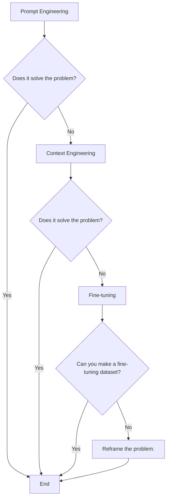
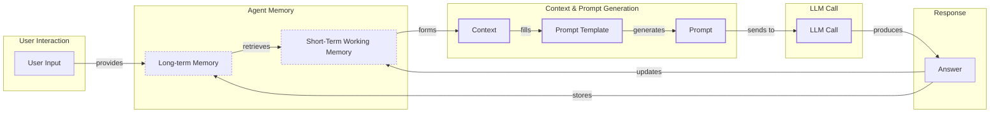
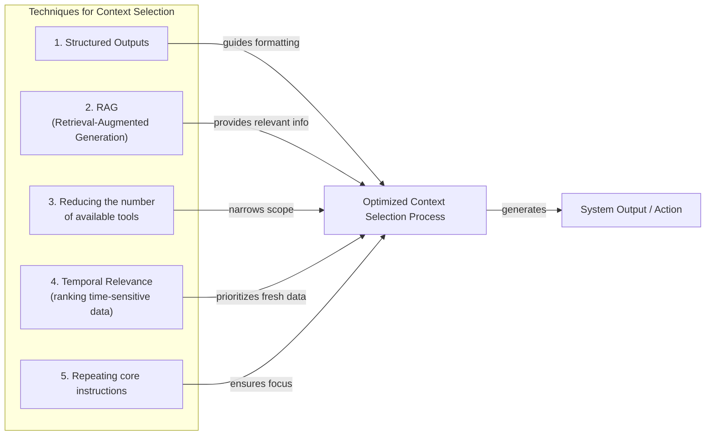
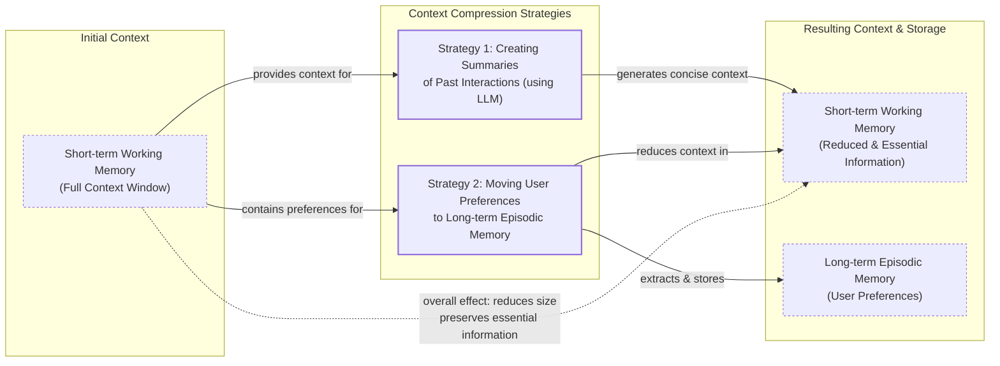
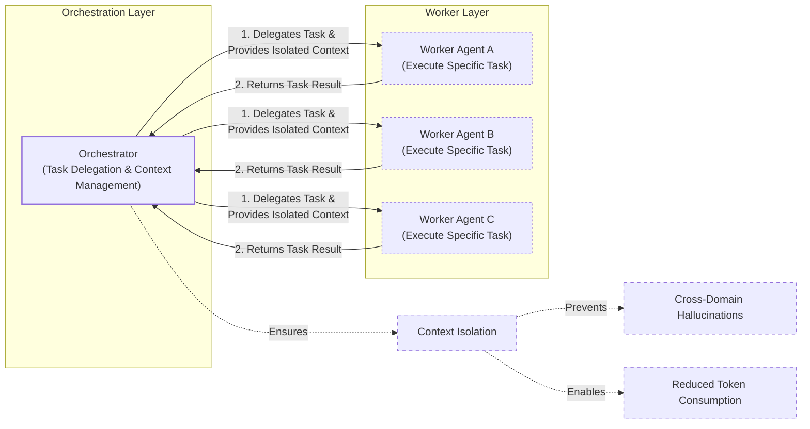

# Lesson 3: Context Engineering

AI applications have evolved rapidly. In 2022, we had simple chatbots for question-answering. By 2023, Retrieval-Augmented Generation (RAG) systems connected LLMs to domain-specific knowledge, allowing them to answer questions about private documents. 2024 brought us tool-using agents that could perform actions in the real world, like booking flights or sending emails. Now, we are building memory-enabled agents that remember past interactions and build relationships over time [[26]](https://www.securityindustry.org/2024/07/16/understanding-the-evolution-from-classic-chatbots-to-rag-chatbots-to-ai-powered-assistants/), [[30]](https://www.linkedin.com/posts/ai-apps-central_most-people-put-all-ai-systems-in-the-same-activity-7438555783077793792-UEUm).

In our last lesson, we explored how to choose between AI agents and LLM workflows when designing a system. As these applications grow more complex, prompt engineering, a practice that once served us well, is showing its limits. It optimizes single LLM calls but fails when managing systems with memory, actions, and long interaction histories. The sheer volume of information an agent might need—past conversations, user data, documents, and action descriptions—has grown exponentially.

Simply stuffing all this into a prompt is not a viable strategy. This is where context engineering comes in. It is the discipline of orchestrating this entire information ecosystem to ensure the LLM gets exactly what it needs, when it needs it. This skill is becoming a core foundation for AI engineering.

## From Prompt to Context Engineering

Prompt engineering, while effective for simple tasks, is designed for single, stateless interactions. It treats each call to an LLM as a new, isolated event. This approach breaks down in stateful applications where context must be preserved and managed across multiple turns. For an agent to follow a multi-step plan or recall a user’s preference from an earlier conversation, it needs a memory of what has happened before.

As a conversation or task progresses, the context grows. Without a strategy to manage this growth, the LLM’s performance degrades. This is context decay, or "context rot": the model gets confused by the noise of an ever-expanding history and starts to lose track of the original instructions or key information [[3]](https://www.trychroma.com/research/context-rot), [[8]](https://thenewstack.io/context-rot-enterprise-ai-llms/).

Even with large context windows, a physical limit exists for what you can include. Also, on the operational side, every token adds to the cost and latency of an LLM call [[16]](https://www.comet.com/site/blog/context-window/), [[20]](https://blog.jetbrains.com/research/2025/12/efficient-context-management/). Simply putting everything into the context creates a slow, expensive, and underperforming system. We will explore these concepts in more detail in upcoming lessons, including memory in Lesson 9 and RAG in Lesson 10.

On a recent project, we learned this the hard way. We were working with a model that supported a two-million-token context window, so we thought, "What could go wrong?" We stuffed everything in: our research, guidelines, examples, and user history. The result was an LLM workflow that took 30 minutes to run and produced low-quality outputs.

This is where context engineering becomes essential. It shifts the focus from crafting static prompts to building dynamic systems that manage information flow. As an AI engineer, your job is to select only the most critical pieces of context for each LLM call. This makes your applications accurate, fast, and cost-effective.

## Understanding Context Engineering

Context engineering is about finding the best way to arrange parts of your application's memory into the context that is passed to the LLM. It is a solution to an optimization problem where you retrieve the right parts from your short-term and long-term memory to solve a specific task without overwhelming the model. For example, when you ask a cooking agent for a recipe, you do not give it the entire cookbook. Instead, you retrieve the specific recipe, along with personal context like allergies or taste preferences. This precise selection ensures the model receives only the essential information.

Andrej Karpathy explains that LLMs are like a new kind of operating system where the model is the CPU and its context window is the RAM. Just as an operating system manages what fits into your computer’s limited RAM, context engineering manages what information occupies the model’s limited context window [[31]](https://www.langchain.com/blog/context-engineering-for-agents), [[33]](https://atlan.com/know/working-memory-llms/).

How does context engineering relate to prompt engineering? Prompt engineering is a subset of context engineering. You still write effective prompts, but you also design a system that feeds the right context into those prompts. This means understanding not just *how* to phrase a task, but *what* information the model needs to perform optimally.

Table 1: A comparison of prompt engineering and context engineering.

| Dimension | Prompt Engineering | Context Engineering |
| :--- | :--- | :--- |
| Scope | Single interaction optimization | Entire information ecosystem |
| State Management | Stateless function | Stateful due to memory |
| Focus | How to phrase tasks | What information to provide |

Context engineering is the new fine-tuning. While fine-tuning has its place, it is expensive, time-consuming, and inflexible. Data changes constantly, making fine-tuning a last resort. For most enterprise use cases, you get better results faster and more cheaply with context engineering [[51]](https://www.linkedin.com/posts/denis-panjuta_prompt-engineering-vs-context-engineering-activity-7363945251180322816-1q_m), [[52]](https://memgraph.com/blog/prompt-engineering-vs-context-engineering). It allows for rapid iteration and adaptation to evolving data without altering the core model, a key advantage in dynamic environments.

When you start a new AI project, your decision-making process for guiding the LLM should look like the one presented in Image 1. You start with the simplest approach and only escalate to more complex methods if necessary.



Image 1: A flowchart illustrating the decision-making workflow for choosing an AI strategy.

For instance, if you build an agent to process internal Slack messages, you do not need to fine-tune a model on your company’s communication style. It is more effective to use a powerful reasoning model and engineer the context to retrieve specific messages and enable actions like creating tasks or drafting emails. Throughout this course, we will show you how to solve most industry problems using only context engineering.

## What Makes Up the Context

To master context engineering, you first need to understand what "context" actually is. It is everything the LLM sees in a single turn, dynamically assembled from various memory components before being passed to the model. The high-level workflow, as presented in Image 2, begins when a user input triggers the system to pull relevant information from both long-term and short-term memory. This information is assembled into the final context, inserted into a prompt template, and sent to the LLM. The LLM’s answer then updates the memory, and the cycle repeats.



Image 2: A high-level workflow diagram showing the connection of context elements to the prompt and LLM call, including memory and feedback loops.

These components are grouped into two main categories. We will explain them intuitively for now, as we have future dedicated lessons for all of them.

### Short-Term Working Memory

Short-term working memory is the state of the agent for the current task or conversation. It is volatile and changes with each interaction, helping the agent maintain a coherent dialogue and make immediate decisions. It can include some or all of these components:

*   **User input:** The most recent query or command from the user, which is integrated directly to shape the immediate response.
*   **Message history:** The log of the current conversation, allowing the LLM to understand the flow and reference previous turns to maintain coherence.
*   **Agent's internal thoughts:** The reasoning steps the agent takes to decide on its next action, often referred to as a scratchpad or chain-of-thought, which are included in the context to guide its logic.
*   **Action calls and outputs:** The results from any actions the agent has performed, providing concrete information from external systems that informs the next step.

### Long-Term Memory

Long-term memory is more persistent and stores information across sessions, allowing the AI system to remember things beyond a single conversation. We divide it into three types, drawing parallels from human memory [[37]](https://www.datacamp.com/blog/how-does-llm-memory-work), [[38]](https://www.analyticsvidhya.com/blog/2026/01/how-does-llm-memory-work/). This is inspired by cognitive science's multi-store models, where the brain's hippocampus acts as a consolidation hub, forming new long-term memories from short-term experiences [[76]](https://systemweakness.com/decoding-ai-memory-why-our-brains-hold-the-key-to-the-next-generation-of-llms-a0246f1a56a2). An AI system can include some or all of them:

*   **Procedural memory:** This is knowledge encoded directly in the code. It includes the system prompt, which sets the agent's overall behavior. It also includes the definitions of available actions, which tell the agent what it can do, and schemas for structured outputs, which guide the format of its responses. Think of this as the agent's built-in skills that dictate its operational rules.
*   **Episodic memory:** This is memory of specific past experiences, like user preferences or previous interactions. It helps the agent personalize its responses based on individual users. We typically store this in vector or graph databases for efficient retrieval, enabling tailored interactions.
*   **Semantic memory:** This is the agent’s general knowledge base. It can be internal, like company documents stored in a data lake, or external, accessed via the internet through API calls or web scraping. This memory provides the factual information the agent needs to answer questions accurately.

If this seems like a lot, bear with us. We will cover all these concepts in-depth in future lessons, including structured outputs (Lesson 4), actions (Lesson 6), memory (Lesson 9), and RAG (Lesson 10). 

Image 3: Context engineering encompasses a variety of techniques and information sources. (Source [humanlayer/12-factor-agents](https://github.com/humanlayer/12-factor-agents/blob/main/content/factor-03-own-your-context-window.md))

The key takeaway is that these components are not static. They are dynamically re-computed for every single interaction. For each conversation turn or new task, the short-term memory grows, or the long-term memory can change. Context engineering involves knowing how to select the right pieces from this vast memory pool to construct the most effective prompt for the task at hand.

## Production Implementation Challenges

Now that we understand what makes up the context, let's look at the core challenges of implementing it in production. These challenges all revolve around a single question: *"How can I keep my context as small as possible while providing enough information to the LLM?"*

Here are four common issues that come up when building AI applications:

1.  **The context window challenge:** Every AI model has a limited context window, the maximum amount of information (tokens) it can process at once. Think of it like your computer's RAM. If your machine has only 32GB of RAM, that is all it can use at one time. While context windows are getting larger, they are not infinite, and treating them as such leads to other problems [[16]](https://www.comet.com/site/blog/context-window/), [[17]](https://datahub.com/blog/context-window-optimization/). Popular models like GPT-4o have a 128K token limit, while others like Gemini 2.5 Pro offer up to 1 million tokens.

2.  **Information overload:** Just because you can fit a lot of information into the context does not mean you should. Too much context reduces the performance of the LLM by confusing it. This is known as the *"lost-in-the-middle"* or *"needle in the haystack"* problem, where LLMs are known for remembering information best at the beginning and end of the context window. Information in the middle is often overlooked, and performance can drop long before the physical context limit is reached [[56]](https://www.linkedin.com/pulse/lost-middle-lesson-failing-ai-agents-backwards-anthony-dejohn-01k2e), [[58]](https://dev.to/thousand_miles_ai/the-lost-in-the-middle-problem-why-llms-ignore-the-middle-of-your-context-window-3al2). Research from Chroma across 18 frontier models showed that accuracy can drop by 30% or more for information in the middle of a prompt [[59]](https://atlan.com/know/llm-context-window-limitations/).

3.  **Context drift:** This occurs when conflicting views of truth accumulate in the memory over time. For example, the memory might contain two conflicting statements: "*My cat is white*" and "*My cat is black*." This is not Schrodinger's Cat quantum physics experiment; it is a data conflict that confuses the LLM [[6]](https://galileo.ai/blog/production-llm-monitoring-strategies). Without a mechanism to resolve these conflicts, the model's responses become unreliable as it doesn't know which piece of information to trust [[9]](https://insightfinder.com/blog/hidden-cost-llm-drift-detection/). A practical mitigation is to implement memory decay rules that automatically down-rank or delete memories that are old, rarely used, or contradicted by new facts [[77]](https://medium.com/@armankamran/context-is-the-new-intelligence-engineering-the-next-generation-of-generative-ai-systems-174d99634c0c).

4.  **Tool confusion:** The final challenge is tool confusion, which arises in two main ways. First, adding too many actions to an agent can confuse the LLM about the best one for the job. While the exact number varies, issues can start to appear with as few as 30 tools and become more pronounced with over 100 [[21]](https://packmind.com/context-engineering-ai-coding/what-is-contextops/). Second, confusion can occur when tool descriptions are poorly written or overlap. If the distinctions between actions are unclear, even a human would struggle to choose the right one.

## Key Strategies for Context Optimization

A useful way to frame these strategies is through three principles for agent decisions: relevance, sufficiency, and isolation [[78]](https://arxiv.org/pdf/2603.09619). Relevance means providing only the minimum context needed. Sufficiency ensures all necessary information is present to avoid hallucination. Isolation prevents data leakage in multi-agent systems. Context engineering is about balancing these principles to meet performance, latency, and cost requirements.

Here are four popular context engineering strategies used across the industry:

### Selecting the Right Context

Retrieving the right information from memory is a critical first step. The guiding principle is to find the smallest set of high-signal tokens that maximizes the likelihood of the desired outcome, curating what the model sees within its limited attention budget [[79]](https://www.anthropic.com/engineering/effective-context-engineering-for-ai-agents). A common mistake is to provide everything at once. As we've discussed, the "lost-in-the-middle" problem often leads to poor performance, increased latency, and higher costs. To solve this, consider the approaches illustrated in Image 4.



Image 4: A diagram illustrating how five techniques for selecting the right context work together in a larger system, contributing to an optimized context selection process.

**Use structured outputs** to define clear schemas for what the LLM should return. This allows you to pass only the necessary, structured information to downstream steps. We will cover this in detail in Lesson 4.

**Use RAG** to fetch only the specific chunks of text needed to answer a user's question, instead of providing entire documents. This is a core topic we will explore in Lesson 10.

**Reduce the number of available actions** by delegating action subsets to specialized components. For example, an orchestrator-worker pattern can delegate subtasks to specialized agents. Studies have shown that limiting the tool selection to under 30 can triple an agent's selection accuracy [[22]](https://www.mezmo.com/learn-observability/context-engineering-for-observability-how-to-deliver-the-right-data-to-llms).

**Implement memory decay rules** to rank time-sensitive data, filtering out or down-ranking information that is old, rarely used, or obsolete. This ensures the model receives the most current information and prevents context drift [[12]](https://www.dailydoseofds.com/llmops-crash-course-part-8/), [[77]](https://medium.com/@armankamran/context-is-the-new-intelligence-engineering-the-next-generation-of-generative-ai-systems-174d99634c0c).

**Repeat core instructions** at both the start and the end of the prompt. This uses the model's tendency to pay more attention to the context edges, ensuring core instructions are not lost [[57]](https://promptmetheus.com/resources/llm-knowledge-base/lost-in-the-middle-effect).

### Context Compression

As message history grows in short-term working memory, you must manage past interactions to keep your context window in check. You cannot simply drop past conversation turns, as the LLM still needs to remember what happened. Instead, you need ways to compress key facts from the past. This goes beyond simple summarization. Extractive methods can fail by removing key relational words, leading to incorrect answers [[80]](https://aclanthology.org/2025.findings-emnlp.362.pdf). Evaluating strategies is key; structured summarization, for example, has been shown to better preserve an agent's reasoning in long-running tasks [[81]](https://factory.ai/news/evaluating-compression).



Image 5: A diagram illustrating two context compression strategies and their effect on short-term memory.

You can do this through the strategies in Image 5. **Creating summaries of past interactions** uses an LLM to replace a long, detailed history with a concise overview [[14]](https://blog.jetbrains.com/research/2025/12/efficient-context-management/). **Moving user preferences to long-term memory** transfers them from working memory to long-term episodic memory, keeping the working context clean while ensuring preferences are remembered. Finally, **deduplication** removes redundant information from the context to avoid repetition and save space [[11]](https://oneuptime.com/blog/post/2026-01-30-context-compression/view).

### Isolating Context

Another powerful strategy is to isolate context by splitting information across multiple agents or LLM workflows. Instead of one agent with a massive, cluttered context window, you can have a team of agents, each with a smaller, focused context.



Image 6: An architecture diagram illustrating the orchestrator-worker pattern for context isolation, showing task delegation, isolated context provision, and the resulting benefits of preventing hallucinations and reducing token consumption.

We often implement this using an orchestrator-worker pattern, where a central orchestrator agent breaks down a problem and assigns sub-tasks to specialized worker agents [[46]](https://beam.ai/agentic-insights/multi-agent-orchestration-patterns-production), [[47]](https://gurusup.com/blog/multi-agent-orchestration-guide). Each worker operates in its own isolated context, improving focus and allowing for parallel processing. This pattern accounts for 70% of production multi-agent deployments and can reduce token consumption by 60-70% compared to a single monolithic agent [[47]](https://gurusup.com/blog/multi-agent-orchestration-guide). We will cover this pattern in more detail in Lesson 5.

### Format Optimizations

Finally, the way you format the context matters. Models are sensitive to structure, and using clear delimiters can improve performance. Common strategies are to use XML tags to wrap different pieces of context (e.g., `<user_query>`, `<documents>`). This helps the model distinguish between different types of information [[44]](https://www.anthropic.com/engineering/effective-context-engineering-for-ai-agents). When providing structured data as input, YAML is often more token-efficient than JSON, which helps save space in your context window.

Ultimately, you must always understand what is passed to the LLM. Seeing exactly what occupies your context window at every step is key to mastering context engineering. This is usually done by monitoring your traces, tracking what happens at each step, and understanding the inputs and outputs [[18]](https://www.getmaxim.ai/articles/context-window-management-strategies-for-long-context-ai-agents-and-chatbots/articles/context-window-management-strategies-for-long-context-ai-agents-and-chatbots/). As this is a significant step to go from PoC to production, we will have dedicated lessons on this.

## Here Is an Example

Let's connect the theory and strategies with a concrete example. Consider these real-world scenarios where context is critical:

*   **Healthcare:** An AI assistant accesses a patient's medical history, current symptoms, and the latest medical literature to provide personalized diagnostic support. The context includes structured patient data from an electronic health record, unstructured notes from previous visits, and relevant articles retrieved from a medical knowledge base [[41]](https://www.decodingai.com/p/context-engineering-2025s-1-skill), [[43]](https://www.mdpi.com/2079-9292/13/15/2961).
*   **Financial Services:** AI systems integrate with enterprise tools like Customer Relationship Management (CRM) systems and calendars, combining real-time market data with client portfolios to generate tailored financial advice. Here, the context is a dynamic mix of the client's financial goals, risk tolerance, current holdings, and live market data from APIs [[25]](https://www.glean.com/blog/context-engineering-ai-the-foundation-of-reliable-high-performing-models).
*   **Project Management:** AI systems access enterprise infrastructure like Slack and task managers to automatically understand project requirements, then add and update project tasks. The context includes conversation histories, project documentation, and the current state of the task board.
*   **Content Creator Assistant:** An AI agent uses your research, past content, and personality traits to understand what and how to create a given piece of content. The context is built from your personal knowledge base, style guides, and audience feedback.

Let's walk through a specific query to see context engineering in action with the healthcare assistant scenario. A user asks: `I have a headache. What can I do to stop it? I would prefer not to take any medicine.`

Before the AI attempts to answer, a context engineering system performs several steps. It retrieves the user's patient history, known allergies, and lifestyle habits from episodic memory. It then queries a medical database for non-pharmacological headache remedies from semantic memory. The system assembles the key units of information from both memory types, formats them into a structured prompt, and calls the LLM to generate a personalized, context-aware answer.

Here is a simplified Python example showing how you might structure the context and prompt for the LLM.

1.  First, we import the necessary libraries and define the user's query.

    ```python
    import yaml
    
    user_query = "I have a headache. What can I do to stop it? I would prefer not to take any medicine."
    ```

2.  Next, we define the patient's history, which would typically be retrieved from episodic memory.

    ```python
    patient_history = {
        "patient": {
            "name": "John Doe",
            "age": 45,
            "gender": "M",
            "conditions": ["mild_hypertension"],
            "allergies": [],
            "preferences": {
                "medication_avoidance": True,
                "preferred_treatments": "natural_remedies"
            },
            "habits": {
                "stress_level": "high",
                "work_related": True,
                "caffeine_intake": "3-4_cups_daily"
            }
        }
    }
    ```

3.  Then, we include relevant medical literature, which would be retrieved from semantic memory.

    ```python
    medical_literature = {
        "articles": [
            {
                "id": 1,
                "topic": "dehydration_headaches",
                "finding": "Dehydration is a common cause of tension headaches",
                "treatment": "Rehydration can alleviate symptoms within 30 minutes to three hours"
            },
            {
                "id": 2,
                "topic": "cold_compress",
                "finding": "Applying a cold compress to the forehead and temples can constrict blood vessels",
                "treatment": "Reduces inflammation, helping to relieve migraine pain"
            },
            {
                "id": 3,
                "topic": "caffeine_withdrawal",
                "finding": "Caffeine withdrawal can trigger headaches",
                "treatment": "For regular caffeine consumers, a small amount may alleviate withdrawal headaches"
            },
            {
                "id": 4,
                "topic": "stress_relief",
                "finding": "Stress-relief techniques are effective for tension headaches",
                "treatment": "Deep breathing, meditation, or short walks can help"
            }
        ]
    }
    ```

4.  Finally, we assemble the complete prompt. We use XML tags to format the different context elements and YAML to format the data collections for token efficiency.

    ```python
    prompt = f"""
    <system_prompt>
    You are a helpful AI medical assistant. Your role is to provide safe, helpful, and personalized health advice based on the provided context. Do not give advice outside of the provided context. Prioritize non-medicinal options as per user preference.
    </system_prompt>
    
    <patient_history>
    {yaml.dump(patient_history)}
    </patient_history>
    
    <medical_literature>
    {yaml.dump(medical_literature)}
    </medical_literature>
    
    <user_query>
    {user_query}
    </user_query>
    
    <instructions>
    Based on all the information above, provide a step-by-step plan for the user to relieve their headache. Structure your response clearly.
    </instructions>
    """
    ```

To build such a system, you need a robust tech stack. Here is a potential stack we recommend and will use throughout this course:

*   **LLM:** Gemini as a multimodal, reasoning, and cost-effective LLM API provider.
*   **Orchestration:** LangGraph for defining stateful, agentic workflows [[65]](https://www.scalablepath.com/machine-learning/langgraph).
*   **Databases:** PostgreSQL, MongoDB, Redis, Qdrant, and Neo4j. It is often effective to keep it simple, as you can achieve much with only PostgreSQL or MongoDB.
*   **Observability:** Opik or LangSmith for evaluation and trace monitoring [[16]](https://www.comet.com/site/blog/context-window/), [[64]](https://atlan.com/know/context-engineering-platforms-comparison/).

## Connecting Context Engineering to AI Engineering

Context engineering is more of an art than a science. It is about developing the intuition to craft effective prompts, select the right information from memory, and arrange context for optimal results. This discipline helps you determine the minimal yet essential information an LLM needs to perform at its best, especially for complex, long-horizon tasks like coding or research that unfold over extended interactions [[82]](https://sequoiacap.com/podcast/context-engineering-our-way-to-long-horizon-agents-langchains-harrison-chase/).

It's important to understand that context engineering cannot be learned in isolation. It is a complex field that combines:

1.  **AI Engineering:** Implement practical solutions such as LLM workflows, RAG, AI Agents, and evaluation pipelines. These are the core components that bring your AI application to life.
2.  **Software Engineering (SWE):** Build your AI product with code that is not just functional, but also scalable and maintainable. This involves designing architectures that can grow with your product's needs [[23]](https://sombrainc.com/blog/ai-context-engineering-guide).
3.  **Data Engineering:** Design data pipelines that feed curated and validated data into the memory layer. This ensures the context your AI relies on is accurate and trustworthy [[24]](https://www.decube.io/post/master-data-pipeline-architecture-best-practices-for-engineers).
4.  **Operations (Ops):** Deploy agents on the proper infrastructure to ensure they are reproducible, maintainable, observable, and scalable, including automating processes with CI/CD pipelines [[22]](https://www.mezmo.com/learn-observability/context-engineering-for-observability-how-to-deliver-the-right-data-to-llms).

Our goal with this course is to teach you how to combine these skills to build production-ready AI products. We like to say that in the world of AI, we should all think in systems rather than isolated components, having a mindset shift from developers to architects.

In the next lesson, we will explore structured outputs, a key technique for making the communication between your LLM and your application code reliable and predictable.

## References

- [1] https://atlan.com/know/llm-context-window-limitations/
- [2] https://redis.io/blog/context-window-overflow/
- [3] https://www.trychroma.com/research/context-rot
- [4] https://medium.com/@sahin.samia/the-common-failure-points-of-llm-rag-systems-and-how-to-overcome-them-926d9090a88f
- [5] https://towardsdatascience.com/your-1m-context-window-llm-is-less-powerful-than-you-think/
- [6] https://galileo.ai/blog/production-llm-monitoring-strategies
- [7] https://www.coforge.com/what-we-know/blog/navigating-the-shifting-sands-understanding-and-mitigating-data-drift-in-llms
- [8] https://thenewstack.io/context-rot-enterprise-ai-llms/
- [9] https://insightfinder.com/blog/hidden-cost-llm-drift-detection/
- [10] https://www.helicone.ai/blog/how-to-reduce-llm-hallucination
- [11] https://oneuptime.com/blog/post/2026-01-30-context-compression/view
- [12] https://www.dailydoseofds.com/llmops-crash-course-part-8/
- [13] https://arxiv.org/html/2510.22101v1
- [14] https://blog.jetbrains.com/research/2025/12/efficient-context-management/
- [15] https://www.comet.com/site/blog/context-window/
- [16] https://www.comet.com/site/blog/context-window/
- [17] https://datahub.com/blog/context-window-optimization/
- [18] https://www.getmaxim.ai/articles/context-window-management-strategies-for-long-context-ai-agents-and-chatbots/
- [19] https://www.getmaxim.ai/articles/context-window-management-strategies-for-long-context-ai-agents-and-chatbots/
- [20] https://blog.jetbrains.com/research/2025/12/efficient-context-management/
- [21] https://packmind.com/context-engineering-ai-coding/what-is-contextops/
- [22] https://www.mezmo.com/learn-observability/context-engineering-for-observability-how-to-deliver-the-right-data-to-llms
- [23] https://sombrainc.com/blog/ai-context-engineering-guide
- [24] https://www.decube.io/post/master-data-pipeline-architecture-best-practices-for-engineers
- [25] https://www.glean.com/blog/context-engineering-ai-the-foundation-of-reliable-high-performing-models
- [26] https://www.securityindustry.org/2024/07/16/understanding-the-evolution-from-classic-chatbots-to-rag-chatbots-to-ai-powered-assistants/
- [27] https://pagergpt.ai/ai-chatbot/evolution-of-ai-chatbots
- [28] https://www.dante-ai.com/news/when-did-ai-chatbots-start
- [29] https://www.dante-ai.com/news/when-did-ai-chatbots-start
- [30] https://www.linkedin.com/posts/ai-apps-central_most-people-put-all-ai-systems-in-the-same-activity-7438555783077793792-UEUm
- [31] https://www.langchain.com/blog/context-engineering-for-agents
- [32] https://www.glean.com/perspectives/context-engineering-vs-prompt-engineering-key-differences-explained
- [33] https://atlan.com/know/working-memory-llms/
- [34] https://www.sundeepteki.org/blog/from-vibe-coding-to-context-engineering-a-blueprint-for-production-grade-genai-systems
- [35] https://www.linkedin.com/pulse/context-engineering-silent-architecture-behind-every-ai-roychowdhury-lzcec
- [36] https://atlan.com/know/working-memory-llms/
- [37] https://www.datacamp.com/blog/how-does-llm-memory-work
- [38] https://www.analyticsvidhya.com/blog/2026/01/how-does-llm-memory-work/
- [39] https://skymod.tech/why-memory-matters-in-llm-agents-short-term-vs-long-term-memory-architectures/
- [40] https://labelstud.io/learningcenter/episodic-vs-persistent-memory-in-llms/
- [41] https://www.decodingai.com/p/context-engineering-2025s-1-skill
- [42] https://www.decodingai.com/p/context-engineering-2025s-1-skill
- [43] https://www.mdpi.com/2079-9292/13/15/2961
- [44] https://www.anthropic.com/engineering/effective-context-engineering-for-ai-agents
- [45] https://beam.ai/agentic-insights/multi-agent-orchestration-patterns-production
- [46] https://beam.ai/agentic-insights/multi-agent-orchestration-patterns-production
- [47] https://gurusup.com/blog/multi-agent-orchestration-guide
- [48] https://www.vellum.ai/blog/multi-agent-systems-building-with-context-engineering
- [49] https://www.praetorian.com/blog/deterministic-ai-orchestration-a-platform-architecture-for-autonomous-development/
- [50] https://arxiv.org/html/2601.13671v1
- [51] https://www.linkedin.com/posts/denis-panjuta_prompt-engineering-vs-context-engineering-activity-7363945251180322816-1q_m
- [52] https://memgraph.com/blog/prompt-engineering-vs-context-engineering
- [53] https://www.mezmo.com/learn-observability/context-engineering-for-observability-how-to-deliver-the-right-data-to-llms
- [54] https://www.instinctools.com/blog/context-engineering/
- [55] https://neo4j.com/blog/agentic-ai/context-engineering-vs-prompt-engineering/
- [56] https://www.linkedin.com/pulse/lost-middle-lesson-failing-ai-agents-backwards-anthony-dejohn-01k2e
- [57] https://promptmetheus.com/resources/llm-knowledge-base/lost-in-the-middle-effect
- [58] https://dev.to/thousand_miles_ai/the-lost-in-the-middle-problem-why-llms-ignore-the-middle-of-your-context-window-3al2
- [59] https://atlan.com/know/llm-context-window-limitations/
- [60] https://bigdataboutique.com/blog/needle-in-haystack-optimizing-retrieval-and-rag-over-long-context-windows-5dfb3c
- [61] https://www.codecademy.com/article/context-engineering-in-ai
- [62] https://blog.stackademic.com/context-engineering-in-llms-and-ai-agents-eb861f0d3e9b
- [63] https://packmind.com/context-engineering-ai-coding/how-to-implement-context-engineering/
- [64] https://atlan.com/know/context-engineering-platforms-comparison/
- [65] https://www.scalablepath.com/machine-learning/langgraph
- [66] https://arxiv.org/pdf/2507.13334
- [67] https://www.datacamp.com/blog/context-engineering
- [68] https://www.llamaindex.ai/blog/context-engineering-what-it-is-and-techniques-to-consider
- [69] https://blog.langchain.com/context-engineering-for-agents/
- [70] https://blog.langchain.com/the-rise-of-context-engineering/
- [71] https://x.com/karpathy/status/1937902205765607626
- [72] https://x.com/lenadroid/status/1943685060785524824
- [73] https://github.com/humanlayer/12-factor-agents/blob/main/content/factor-03-own-your-context-window.md
- [74] https://nlp.elvissaravia.com/p/context-engineering-guide
- [75] https://www.pinecone.io/learn/context-engineering/
- [76] https://systemweakness.com/decoding-ai-memory-why-our-brains-hold-the-key-to-the-next-generation-of-llms-a0246f1a56a2
- [77] https://medium.com/@armankamran/context-is-the-new-intelligence-engineering-the-next-generation-of-generative-ai-systems-174d99634c0c
- [78] https://arxiv.org/pdf/2603.09619
- [79] https://www.anthropic.com/engineering/effective-context-engineering-for-ai-agents
- [80] https://aclanthology.org/2025.findings-emnlp.362.pdf
- [81] https://factory.ai/news/evaluating-compression
- [82] https://sequoiacap.com/podcast/context-engineering-our-way-to-long-horizon-agents-langchains-harrison-chase/