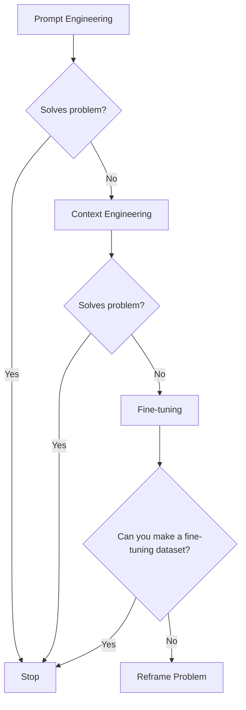
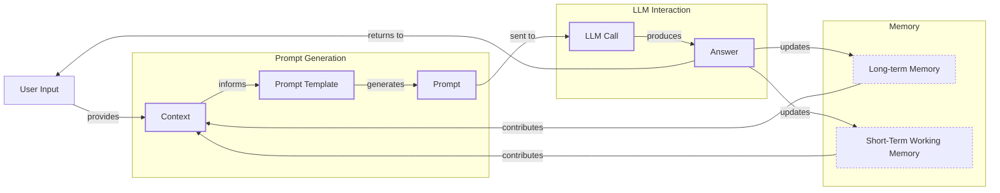
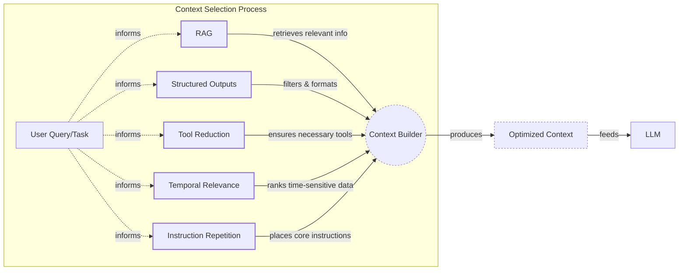
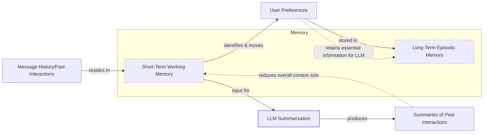
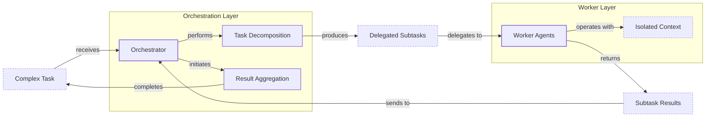

# Lesson 3: Context Engineering

## When prompt engineering breaks

AI applications have evolved rapidly. In 2022, we had simple chatbots for question-and-answering. By 2023, Retrieval-Augmented Generation (RAG) systems connected LLMs to domain-specific knowledge. 2024 brought us tool-using agents that could perform actions. Now, we are building memory-enabled agents that remember past interactions and maintain state over time [[1]](https://www.securityindustry.org/2024/07/16/understanding-the-evolution-from-classic-chatbots-to-rag-chatbots-to-ai-powered-assistants/), [[2]](https://www.linkedin.com/posts/ai-apps-central_most-people-put-all-ai-systems-in-the-same-activity-7438555783077793792-UEUm), [[3]](https://pagergpt.ai/ai-chatbot/evolution-of-ai-chatbots/).

In our last lesson, we explored how to choose between AI agents and LLM workflows when designing a system. As these applications grow more complex, prompt engineering, a practice that once served us well, is showing its limits. It optimizes single LLM calls but fails when managing systems with memory, actions, and long interaction histories. The sheer volume of information an agent might need has grown exponentially. This includes past conversations, user data, documents, and action descriptions.

Simply stuffing all this into a prompt is not a viable strategy [[4]](https://www.decodingai.com/p/context-engineering-2025s-1-skill). This necessity gives rise to context engineering, the discipline of orchestrating this entire information ecosystem to ensure the LLM gets exactly what it needs, when it needs it. This skill is becoming a core foundation for AI engineering, and it is the new fine-tuning. For most use cases, you get better results faster and more cheaply with context engineering, making fine-tuning a last resort [[5]](https://www.linkedin.com/posts/denis-panjuta_prompt-engineering-vs-context-engineering-activity-7363945251180322816-1q_m).

## From prompt to context engineering

The limitations of prompt engineering become clear when we examine its core issues in the context of modern AI systems. It is designed for single, stateless interactions, treating each LLM call as an isolated event. This model fails in stateful applications where context must be preserved and managed across multiple turns [[4]](https://www.decodingai.com/p/context-engineering-2025s-1-skill).

As a conversation or task progresses, the context grows. Without a strategy to manage this growth, the LLM’s performance degrades. This is context decay. The model gets confused by the noise of an ever-expanding history and starts to lose track of the original instructions or key information [[6]](https://thenewstack.io/context-rot-enterprise-ai-llms/), [[7]](https://www.trychroma.com/research/context-rot). This is not just a theoretical problem. Microsoft Research and Salesforce found that model performance can drop by an average of 39% when moving from single-turn to multi-turn conversations [[8]](https://atlan.com/know/llm-context-window-limitations/).

Even with large context windows, a physical limit exists for what you can include. Furthermore, every token adds to the cost and latency of an LLM call [[9]](https://www.comet.com/site/blog/context-window/). Simply putting everything into the context creates a slow, expensive, and underperforming system. We will explore these concepts in more detail in upcoming lessons, including memory in Lesson 9 and RAG in Lesson 10.

On a recent project, we learned this the hard way. We were working with a model that supported a million-token context window, so we thought, "What could go wrong?" We stuffed everything in: our research, guidelines, examples, and user history. The result was an LLM workflow that took 30 minutes to run and produced low-quality outputs [[4]](https://www.decodingai.com/p/context-engineering-2025s-1-skill).

Context engineering addresses these limitations. It shifts the focus from crafting static prompts to building dynamic systems that manage information flow. As an AI Engineer, your job is to select only the most essential pieces of context for each LLM call, making your applications accurate, fast, and cost-effective.

## Understanding context engineering

Context engineering is the practice of designing systems that decide what information an AI model sees before it generates a response [[10]](https://blog.langchain.com/context-engineering-for-agents/). It is a solution to an optimization problem: you must retrieve the right parts from your short-term and long-term memory to solve a specific task without overwhelming the model [[4]](https://www.decodingai.com/p/context-engineering-2025s-1-skill). A recent survey formalizes this by defining context engineering as the search for the ideal set of functions to assemble a context that maximizes the quality of the LLM's output for a given task [[11]](https://arxiv.org/pdf/2507.13334). This can be framed as an application of the Information Bottleneck principle, where the goal is to squeeze the most relevant information through the limited context window [[12]](https://aclanthology.org/2024.findings-acl.409.pdf), [[13]](https://openreview.net/pdf/038e427a2c56fa8157174274b5fbcf992fd0a336.pdf). Anthropic describes this as curating the "smallest useful set of high-signal tokens" needed for the model to produce the desired outcome [[14]](https://www.progressiverobot.com/2026/04/28/context-engineering/).

For example, when asking a cooking agent for a recipe, you do not pass the whole cookbook to the agent. Instead, you retrieve just the information about that recipe, together with personal preferences, such as allergies or taste preferences. This precise selection ensures the model receives only essential information.

Andrej Karpathy offered a great analogy for this. LLMs are like a new kind of operating system, where the model acts as the CPU and its context window functions as the RAM [[10]](https://blog.langchain.com/context-engineering-for-agents/), [[15]](https://atlan.com/know/working-memory-llms/). Just as an operating system manages what fits into RAM, context engineering curates what occupies the model’s working memory. This is an important distinction because the context is only a subset of the system's total working memory. You can hold information without passing it to the LLM on every turn.

Context engineering is not replacing prompt engineering. Instead, prompt engineering is a subset of context engineering [[4]](https://www.decodingai.com/p/context-engineering-2025s-1-skill). You still work with prompts, so learning how to write them effectively is still a vital skill. But on top of that, it is important to know how to incorporate the right context into the prompt without compromising the LLM's performance.

| Dimension | Prompt Engineering | Context Engineering |
| --- | --- | --- |
| Scope | Single interaction optimization | Entire information ecosystem |
| State Management | Stateless function | Stateful due to memory |
| Focus | How to phrase tasks | What information to provide |

Table 1: A comparison of prompt engineering and context engineering.

As mentioned, context engineering is the new fine-tuning. Fine-tuning teaches core skills or behaviors, like adopting a specific JSON format, which can improve speed and reduce costs compared to including examples in every prompt. However, it is expensive, time-consuming, and inflexible. Data changes constantly, making fine-tuning a last resort [[5]](https://www.linkedin.com/posts/denis-panjuta_prompt-engineering-vs-context-engineering-activity-7363945251180322816-1q_m). For most enterprise use cases, you get better results faster and more cheaply with context engineering.

When you start a new AI project, your decision-making process for guiding the LLM should look like this:


Image 1: A flowchart illustrating the decision-making workflow for choosing an AI project strategy.

For instance, when building an agent to process internal Slack messages, you do not need to fine-tune a model on your company’s communication style. It is more effective to use a powerful reasoning model and engineer the context to retrieve specific messages and enable actions like creating tasks or drafting emails. Throughout this course, we will show you how to solve most industry problems using only context engineering.

## What makes up the context

To master context engineering, you first need to understand what "context" actually is. It is everything the LLM sees in a single turn, dynamically assembled from various memory components before being passed to the model [[16]](https://www.glean.com/blog/context-engineering-ai-the-foundation-of-reliable-high-performing-models). This context is not limited to text. It can include a rich mix of data types, including images, audio, and video, creating a multimodal information stream for the LLM [[17]](https://snyk.io/articles/context-engineering/).

The high-level workflow begins when user input triggers the system to pull relevant information from both long-term and short-term memory. This information is assembled into the final context, inserted into a prompt template, and sent to the LLM. The LLM’s answer then updates the memory, and the cycle repeats.


Image 2: A high-level workflow diagram showing how context is connected to the prompt template and prompt in an LLM application.

These components are grouped into two main categories. We will explain them intuitively for now, as we have future dedicated lessons for all of them.

### Short-Term Working Memory

Short-term working memory is the state of the agent for the current task or conversation [[18]](https://www.dailydoseofds.com/llmops-crash-course-part-8/). It is volatile and changes with each interaction, helping the agent maintain a coherent dialogue and make immediate decisions. It can include some or all of these components:

*   **User input** is the most recent query or command from the user. This is the immediate trigger for the agent's next action, shaping the immediate direction of the interaction.
*   **Message history** is the log of the current conversation, allowing the LLM to understand the flow and previous turns. This history is essential for maintaining coherence in multi-turn dialogues.
*   **Agent's internal thoughts** are the reasoning steps the agent takes to decide on its next action, often referred to as a scratchpad or chain-of-thought. This process is analogous to a human's cognitive journey, where we "think aloud" to solve a problem step-by-step [[19]](https://promptengineering.org/memory-context-and-cognition-in-llms/). The entire process of selecting, filtering, and reasoning with this working memory can be compared to the brain's executive functions, which manage attention and inhibit irrelevant information to achieve a goal [[20]](https://medium.com/99p-labs/bridging-human-minds-and-machines-how-cognitive-psychology-shapes-the-future-of-llms-c474614fedc4).
*   **Action calls and outputs** are the results from any actions the agent has performed, providing information from external systems. This feedback loop is vital for tasks that require interaction with the outside world.

### Long-Term Memory

Long-term memory is more persistent and stores information across sessions, allowing the AI system to remember things beyond a single conversation. We divide it into three types, drawing parallels from human memory [[21]](https://www.analyticsvidhya.com/blog/2026/01/how-does-llm-memory-work/). An AI system can include some or all of them:

*   **Procedural memory** is knowledge encoded directly in the code. It includes the system prompt, which sets the agent's overall behavior. It also includes the definitions of available actions, which tell the agent what it can do, and schemas for structured outputs, which guide the format of its responses. This is the agent's built-in skills [[22]](https://www.datacamp.com/blog/how-does-llm-memory-work).
*   **Episodic memory** is memory of specific past experiences, like user preferences or previous interactions. It is used to help the agent personalize its responses based on individual users. We typically store this in vector or graph databases for efficient retrieval [[23]](https://skymod.tech/why-memory-matters-in-llm-agents-short-term-vs-long-term-memory-architectures/).
*   **Semantic memory** is the agent’s general knowledge base. It can be internal, like company documents stored in a vector database, or external, accessed via the internet through API calls or web scrapers. This memory provides the factual information the agent needs to answer questions [[15]](https://atlan.com/know/working-memory-llms/).

If this seems like a lot, bear with us. We will cover all these concepts in-depth in future lessons, including structured outputs in Lesson 4, actions in Lesson 6, memory in Lesson 9, RAG in Lesson 10, and working with multimodal data in Lesson 11.
Image 3: A detailed illustration of how all the context engineering components work together inside an AI agent. (Source [DECODING ML](https://i.imgur.com/gK4Yv33.png))

The key takeaway is that these components are not static. They are dynamically re-computed for every single interaction. For each conversation turn or new task, the short-term memory grows, or the long-term memory can change. Context engineering involves knowing how to select the right pieces from this vast memory pool to construct the most effective prompt for the task at hand.

## Production implementation challenges

Now that we understand what makes up the context, let's look at the core challenges of implementing it in production. These challenges all revolve around a single question: "How can I keep my context as small as possible while providing enough information to the LLM?" This requires treating context not as an infinite canvas but as a scarce and valuable resource [[14]](https://www.progressiverobot.com/2026/04/28/context-engineering/).

Here are four common issues that come up when building AI applications:

**The context window challenge** is a fundamental constraint. Every AI model has a limited context window, the maximum amount of information (tokens) it can process at once. This includes models like Claude 4.5 Sonnet (200K tokens), GPT-4.1 (1M tokens), and Gemini 3 (1M tokens) [[9]](https://www.comet.com/site/blog/context-window/). This functions like your computer's RAM. If you have only 32GB, that is all you can use at one time. While context windows are getting larger, they are not infinite, and treating them as such leads to other problems [[4]](https://www.decodingai.com/p/context-engineering-2025s-1-skill). The self-attention mechanism in transformers has a computational and memory overhead that grows quadratically with the sequence length, making very long contexts expensive [[8]](https://atlan.com/know/llm-context-window-limitations/).

**Information overload** occurs when too much context reduces the performance of the LLM by confusing it. This is known as the "lost-in-the-middle" or "needle in a haystack" problem, where LLMs are known for remembering information best at the beginning and end of the context window [[24]](https://www.linkedin.com/pulse/lost-middle-lesson-failing-ai-agents-backwards-anthony-dejohn-01k2e). Information in the middle is often overlooked, and performance can drop long before the physical context limit is reached [[25]](https://dev.to/thousand_miles_ai/the-lost-in-the-middle-problem-why-llms-ignore-the-middle-of-your-context-window-3al2). Research shows accuracy can drop by over 30% for information in the middle of a long context [[26]](https://atlan.com/know/llm-context-window-limitations/). This phenomenon is a direct parallel to the primacy and recency effects observed in human psychology, where we tend to remember the first and last items in a list far better than those in the middle [[27]](https://arxiv.org/html/2504.02441v1).

A critical and related challenge is the **comprehension-generation asymmetry**. While models can ingest and understand vast amounts of complex information, they struggle to generate equally sophisticated, long-form outputs. This gap means a model might successfully find a "needle" in a haystack but fail to write a comprehensive essay synthesizing the themes of the entire haystack [[28]](https://medium.com/data-science-collective/3-critical-research-gaps-in-context-engineering-610fa3dcc4a3), [[29]](https://alphaxiv.org/overview/2507.13334v2). This asymmetry is a core limitation that constrains the full potential of LLMs in applications requiring detailed analysis or extended reasoning [[30]](https://medium.com/@adnanmasood/a-practitioners-take-on-a-survey-of-context-engineering-for-large-language-models-49ac87d23a1e).

**Context drift** happens when conflicting versions of the truth accumulate in the memory over time [[31]](https://galileo.ai/blog/production-llm-monitoring-strategies). For example, the memory might contain two conflicting statements: "My cat is white" and "My cat is black." This is not Schrodinger's Cat quantum physics experiment. It is a data conflict that confuses the LLM and prevents it from knowing what to pick [[4]](https://www.decodingai.com/p/context-engineering-2025s-1-skill). Without a mechanism to resolve these conflicts, the model's responses become unreliable.

**Tool confusion** is the final challenge, which arises in two main ways. First, adding too many actions to an agent can confuse the LLM about the best one for the job [[4]](https://www.decodingai.com/p/context-engineering-2025s-1-skill). Second, confusion can occur when tool descriptions are poorly written or overlap. If the distinctions between actions are unclear, even a human would struggle to choose the right one [[32]](https://redis.io/blog/context-window-overflow/).

## Key strategies for context optimization

Initially, most AI applications were chatbots over single knowledge bases. Today, modern AI solutions must manage multiple knowledge bases, tools, and complex conversational histories. Context engineering is about managing this complexity while meeting performance, latency, and cost requirements.

Here are four popular context engineering strategies used across the industry:

### Selecting the Right Context

Retrieving the right information from memory is an essential first step. A common mistake is to provide everything at once, assuming that models with large context windows can handle it. As we have discussed, the "lost-in-the-middle" problem often leads to poor performance, increased latency, and higher costs.

To solve this, consider these approaches:

*   **Use structured outputs.** Define clear schemas for what the LLM should return. This allows you to pass only the necessary, structured information to downstream steps. We will cover this in detail in Lesson 4.
*   **Use RAG.** Instead of providing entire documents, use RAG to fetch only the specific chunks of text needed to answer a user's question [[33]](https://medium.com/@sahin.samia/the-common-failure-points-of-llm-rag-systems-and-how-to-overcome-them-926d9090a88f). This is a core topic we will explore in Lesson 10.
*   **Reduce the number of available actions.** Rather than giving an agent access to every available action, use various strategies to delegate action subsets to specialized components. For example, a typical pattern is to employ the orchestrator-worker pattern to delegate subtasks to specialized agents [[34]](https://beam.ai/agentic-insights/multi-agent-orchestration-patterns-production). Studies have shown that applying RAG to tool descriptions can improve tool selection accuracy by three-fold [[10]](https://blog.langchain.com/context-engineering-for-agents/).
*   **Rank time-sensitive data.** For time-sensitive information, rank it by date and filter out anything no longer relevant [[35]](https://oneuptime.com/blog/post/2026-01-30-context-compression/view).
*   **Repeat core instructions.** For the most important instructions, repeat them at both the start and the end of the prompt. This uses the model's tendency to pay more attention to the context edges, ensuring core instructions are not lost [[36]](https://promptmetheus.com/resources/llm-knowledge-base/lost-in-the-middle-effect).


Image 4: System diagram illustrating context optimization techniques for LLM context selection.

### Context Compression

As message history grows in short-term working memory, you must manage past interactions to keep your context window in check. You cannot simply drop past conversation turns, as the LLM still needs to remember what happened. Instead, you need ways to compress key facts from the past. The guiding principle here comes from information theory's Data Processing Inequality, which states that processing data (e.g., summarizing it) cannot increase the amount of information it contains. The goal of compression is therefore to preserve the most valuable information while discarding the noise [[37]](https://cs191w.stanford.edu/projects/Spring2025/Ishan___Khare_.pdf).

You can do this through:

*   **Creating summaries of past interactions.** Use an LLM to replace a long, detailed history with a concise overview [[38]](https://blog.jetbrains.com/research/2025/12/efficient-context-management/).
*   **Moving user preferences to long-term memory.** Transfer user preferences from working memory to long-term episodic memory. This keeps the working context clean while ensuring preferences are remembered for future sessions.
*   **Deduplication.** Remove redundant information from the context to avoid repetition, using techniques like semantic deduplication based on cosine similarity [[18]](https://www.dailydoseofds.com/llmops-crash-course-part-8/), [[35]](https://oneuptime.com/blog/post/2026-01-30-context-compression/view).


Image 5: A process flow diagram illustrating context compression techniques.

### Isolating Context

Another powerful strategy is to isolate context by splitting information across multiple agents or LLM workflows. This technique is similar to tool isolation, but it is more general, referring to the whole context. The key idea is that instead of one agent with a massive, cluttered context window, you can have a team of agents, each with a smaller, focused context [[10]](https://blog.langchain.com/context-engineering-for-agents/).

We often implement this using an orchestrator-worker pattern, where a central orchestrator agent breaks down a problem and assigns sub-tasks to specialized worker agents [[39]](https://gurusup.com/blog/multi-agent-orchestration-guide). Each worker operates in its own isolated context, improving focus and allowing for parallel processing. This prevents cross-domain hallucinations and can reduce token consumption by 60-70% compared to a single, monolithic agent [[39]](https://gurusup.com/blog/multi-agent-orchestration-guide). We will cover this pattern in more detail in Lesson 5.


Image 6: An architecture diagram illustrating the orchestrator-worker pattern for context isolation in multi-agent systems.

### Format Optimization

Finally, the way you format the context matters. Models are sensitive to structure, and using clear delimiters can improve performance. Common strategies are to use XML tags to wrap different pieces of context (e.g., `<user_query>`, `<documents>`) [[40]](https://www.anthropic.com/engineering/effective-context-engineering-for-ai-agents). This helps the model distinguish between different types of information. Also, using YAML instead of JSON when inputting structured data to the LLM is recommended, as YAML can be more token-efficient [[4]](https://www.decodingai.com/p/context-engineering-2025s-1-skill).

You always have to understand what is passed to the LLM. Seeing exactly what occupies your context window at every step is key to mastering context engineering. This is done by properly monitoring your traces, tracking what happens at each step, and understanding the inputs and outputs [[41]](https://www.getmaxim.ai/articles/context-window-management-strategies-for-long-context-ai-agents-and-chatbots/). As this is a significant step to go from PoC to production, we will have dedicated lessons on this.

## Here is an example

Let's connect the theory and strategies with concrete examples. Context engineering is applied to build powerful AI systems in various domains:

*   **Healthcare:** An AI assistant can access a patient's history, current symptoms, and relevant medical literature to suggest personalized diagnoses [[42]](https://www.mdpi.com/2079-9292/13/15/2961). This involves carefully retrieving sensitive patient data, ensuring privacy, and grounding medical advice in up-to-date, verifiable sources to maintain safety and trust.
*   **Financial Services:** An agent might integrate with a company's CRM system, calendars, and financial data to make decisions based on user preferences [[4]](https://www.decodingai.com/p/context-engineering-2025s-1-skill). This requires managing context from multiple enterprise systems, respecting data access permissions, and ensuring compliance with financial regulations.
*   **Project Task Managers:** AI systems can access enterprise tools like CRMs, Slack, and task managers to automatically understand project requirements and then add or update project tasks. This involves maintaining a coherent state of the project across different platforms and user interactions.
*   **Content Creator Assistant:** An AI agent can access your research, past content, and style guidelines to help create new content that matches your unique voice. This requires managing a diverse set of unstructured documents and learning implicit stylistic preferences over time.

Let's walk through a specific query to see context engineering in action with the healthcare assistant scenario. A user asks: `I have a headache. What can I do to stop it? I would prefer not to take any medicine.`

Before the LLM even sees this query, a context engineering system gets to work:

1.  It retrieves the user's patient history, known allergies, and lifestyle habits from an **episodic memory** store.
2.  It queries a **semantic memory** of up-to-date medical literature for non-medicinal headache remedies.
3.  It assembles this information, along with the user's query and the conversation history, into a structured prompt.
4.  We send the prompt to the LLM, which generates a personalized, safe, and relevant recommendation.
5.  We log the interaction and save any new preferences back to the user's episodic memory.

Here are two production-level code examples demonstrating how to build such a system.

### Example 1: LangGraph for Stateful Orchestration

LangGraph is a library for building stateful, multi-actor applications. It is well-suited for creating complex agentic workflows where you need explicit control over the state and context at each step.

1.  First, we define the state of our graph. This will hold all the information that persists between steps, including the conversation history and the final answer.
    ```python
    import yaml
    from typing import List, TypedDict
    
    class AgentState(TypedDict):
        messages: List[str]
        answer: str
    ```
2.  Next, we define a node in our graph. This node will represent the core logic of our healthcare assistant. It takes the current state, retrieves the necessary context, assembles the prompt, and calls the LLM.
    ```python
    def healthcare_assistant_node(state: AgentState):
        # In a real app, this data would be retrieved from databases
        patient_history = {"patient": {"name": "John Doe", "preferences": {"medication_avoidance": True}}}
        medical_literature = {"articles": [{"topic": "dehydration_headaches", "treatment": "Rehydration"}]}
        
        user_query = state["messages"][-1]
        
        prompt = f"""
        <system_prompt>
        You are a helpful AI healthcare assistant. Provide safe, non-medicinal advice.
        </system_prompt>
        <patient_history>{yaml.dump(patient_history)}</patient_history>
        <medical_literature>{yaml.dump(medical_literature)}</medical_literature>
        <user_query>{user_query}</user_query>
        Based on all the information above, provide a helpful response.
        """
        
        # Assume 'client' is an initialized LLM client
        # response = client.generate_content(prompt)
        # For this example, we'll mock the response
        response_text = "Based on your preference for non-medicinal options, you could try rehydrating. Dehydration is a common cause of headaches."
        
        return {"answer": response_text}
    ```
3.  With LangGraph, we would then define the graph structure, connecting this node to others and defining the flow of execution. This gives us a robust and observable way to manage the agent's context and behavior.

### Example 2: LangChain for Conversational Memory

For simpler conversational agents, LangChain provides useful components for managing memory. Here, we will use `ConversationBufferMemory` to automatically handle the chat history.

1.  We set up a simple chain using LangChain Expression Language (LCEL). This chain will combine a prompt template with our LLM. We also initialize a memory object to store the conversation.
    ```python
    from langchain_openai import ChatOpenAI
    from langchain.memory import ConversationBufferMemory
    from langchain_core.prompts import ChatPromptTemplate, MessagesPlaceholder
    from langchain.chains import LLMChain
    
    # llm = ChatOpenAI(model="gpt-4o")
    memory = ConversationBufferMemory(memory_key="chat_history", return_messages=True)
    
    prompt = ChatPromptTemplate.from_messages([
        ("system", "You are a helpful assistant."),
        MessagesPlaceholder(variable_name="chat_history"),
        ("human", "{input}"),
    ])
    
    # chain = LLMChain(llm=llm, prompt=prompt, memory=memory)
    ```
2.  When we run the chain, the `ConversationBufferMemory` automatically loads the past messages, injects them into the prompt, and saves the new interaction.
    ```python
    # Mocking the chain invocation for demonstration
    # response = chain.invoke({"input": "I have a headache."})
    # print(response['text'])
    
    # Second turn
    # response_2 = chain.invoke({"input": "What can I do for it?"})
    # print(response_2['text'])
    ```
3.  This approach is simpler than LangGraph for basic chatbots but offers less control over the context. LangChain manages the history automatically, which is convenient but can lead to context window issues in long conversations if not combined with summarization or other compression techniques.

To build such systems, you need a robust tech stack. A potential stack we recommend and will use throughout this course includes Gemini as the LLM, LangGraph for orchestration, databases like PostgreSQL or Qdrant for long-term memory, and Opik or LangSmith for observability [[43]](https://www.scalablepath.com/machine-learning/langgraph/), [[44]](https://blog.stackademic.com/context-engineering-in-llms-and-ai-agents-eb861f0d3e9b/), [[45]](https://atlan.com/know/context-engineering-platforms-comparison/).

## Connecting context engineering to AI engineering

Mastering context engineering requires developing intuition alongside systematic practice. It is about knowing how to structure prompts, what information to include, and how to order it for maximum impact. This discipline helps you determine the minimal yet essential information an LLM needs to perform at its best.

This skill does not exist in a vacuum. It is a multidisciplinary practice that sits at the intersection of several key engineering fields:

*   **AI Engineering:** You must implement practical solutions such as LLM workflows, RAG, AI Agents, and evaluation pipelines. This involves understanding the capabilities and limitations of different models and retrieval techniques to select the right context [[46]](https://sombrainc.com/blog/ai-context-engineering-guide).
*   **Software Engineering:** You need to build scalable and maintainable systems to aggregate context and wrap agents in robust APIs. This means applying principles of modular design, testing, and version control to your context pipelines, treating context as a form of infrastructure [[47]](https://www.mezmo.com/learn-observability/context-engineering-for-observability-how-to-deliver-the-right-data-to-llms).
*   **Data Engineering:** Constructing reliable data pipelines for RAG and other memory systems is essential. This ensures that the information your agent relies on is accurate, up-to-date, and efficiently accessible, forming the content and structural layers of your context [[16]](https://www.glean.com/blog/context-engineering-ai-the-foundation-of-reliable-high-performing-models).
*   **Operations (Ops):** Deploying agents on the right infrastructure and automating Continuous Integration/Continuous Deployment (CI/CD) makes them reproducible, observable, and scalable. This discipline, sometimes called ContextOps, applies the principles of DevOps to the management of AI context, unifying its creation, validation, and distribution [[48]](https://packmind.com/context-engineering-ai-coding/what-is-contextops/).

Our goal with this course is to teach you how to combine these skills to build production-ready AI products. In the world of AI, we should all think in systems rather than isolated components, having a mindset shift from developers to architects.

By applying these trade-offs in a real project, you will build the intuition that separates a simple chatbot from a truly intelligent agent. In the next lesson, we will explore structured outputs, a key technique for making the data flowing out of your LLM predictable and reliable. We will also continue to build on these ideas in future lessons covering agentic patterns, memory, and RAG.

## References

- [1] https://www.securityindustry.org/2024/07/16/understanding-the-evolution-from-classic-chatbots-to-rag-chatbots-to-ai-powered-assistants/
- [2] https://www.linkedin.com/posts/ai-apps-central_most-people-put-all-ai-systems-in-the-same-activity-7438555783077793792-UEUm
- [3] https://pagergpt.ai/ai-chatbot/evolution-of-ai-chatbots
- [4] https://www.decodingai.com/p/context-engineering-2025s-1-skill
- [5] https://www.linkedin.com/posts/denis-panjuta_prompt-engineering-vs-context-engineering-activity-7363945251180322816-1q_m
- [6] https://thenewstack.io/context-rot-enterprise-ai-llms/
- [7] https://www.trychroma.com/research/context-rot
- [8] https://atlan.com/know/llm-context-window-limitations/
- [9] https://www.comet.com/site/blog/context-window/
- [10] https://blog.langchain.com/context-engineering-for-agents/
- [11] https://arxiv.org/pdf/2507.13334
- [12] https://aclanthology.org/2024.findings-acl.409.pdf
- [13] https://openreview.net/pdf/038e427a2c56fa8157174274b5fbcf992fd0a336.pdf
- [14] https://www.progressiverobot.com/2026/04/28/context-engineering/
- [15] https://atlan.com/know/working-memory-llms/
- [16] https://www.glean.com/blog/context-engineering-ai-the-foundation-of-reliable-high-performing-models
- [17] https://snyk.io/articles/context-engineering/
- [18] https://www.dailydoseofds.com/llmops-crash-course-part-8/
- [19] https://promptengineering.org/memory-context-and-cognition-in-llms/
- [20] https://medium.com/99p-labs/bridging-human-minds-and-machines-how-cognitive-psychology-shapes-the-future-of-llms-c474614fedc4
- [21] https://www.analyticsvidhya.com/blog/2026/01/how-does-llm-memory-work/
- [22] https://www.datacamp.com/blog/how-does-llm-memory-work
- [23] https://skymod.tech/why-memory-matters-in-llm-agents-short-term-vs-long-term-memory-architectures/
- [24] https://www.linkedin.com/pulse/lost-middle-lesson-failing-ai-agents-backwards-anthony-dejohn-01k2e
- [25] https://dev.to/thousand_miles_ai/the-lost-in-the-middle-problem-why-llms-ignore-the-middle-of-your-context-window-3al2
- [26] https://atlan.com/know/llm-context-window-limitations/
- [27] https://arxiv.org/html/2504.02441v1
- [28] https://medium.com/data-science-collective/3-critical-research-gaps-in-context-engineering-610fa3dcc4a3
- [29] https://alphaxiv.org/overview/2507.13334v2
- [30] https://medium.com/@adnanmasood/a-practitioners-take-on-a-survey-of-context-engineering-for-large-language-models-49ac87d23a1e
- [31] https://galileo.ai/blog/production-llm-monitoring-strategies
- [32] https://redis.io/blog/context-window-overflow/
- [33] https://medium.com/@sahin.samia/the-common-failure-points-of-llm-rag-systems-and-how-to-overcome-them-926d9090a88f
- [34] https://beam.ai/agentic-insights/multi-agent-orchestration-patterns-production
- [35] https://oneuptime.com/blog/post/2026-01-30-context-compression/view
- [36] https://promptmetheus.com/resources/llm-knowledge-base/lost-in-the-middle-effect
- [37] https://cs191w.stanford.edu/projects/Spring2025/Ishan___Khare_.pdf
- [38] https://blog.jetbrains.com/research/2025/12/efficient-context-management/
- [39] https://gurusup.com/blog/multi-agent-orchestration-guide
- [40] https://www.anthropic.com/engineering/effective-context-engineering-for-ai-agents
- [41] https://www.getmaxim.ai/articles/context-window-management-strategies-for-long-context-ai-agents-and-chatbots/
- [42] https://www.mdpi.com/2079-9292/13/15/2961
- [43] https://www.scalablepath.com/machine-learning/langgraph
- [44] https://blog.stackademic.com/context-engineering-in-llms-and-ai-agents-eb861f0d3e9b
- [45] https://atlan.com/know/context-engineering-platforms-comparison/
- [46] https://sombrainc.com/blog/ai-context-engineering-guide
- [47] https://www.mezmo.com/learn-observability/context-engineering-for-observability-how-to-deliver-the-right-data-to-llms
- [48] https://packmind.com/context-engineering-ai-coding/what-is-contextops/
- [49] https://robotsatemyhomework.substack.com/p/context-engineering-guide
- [50] https://neurips.cc/virtual/2025/poster/115721
- [51] https://arxiv.org/html/2506.11650v1
- [52] https://arxiv.org/html/2402.05188v1
- [53] https://www.twelvelabs.io/blog/context-engineering-for-video-understanding