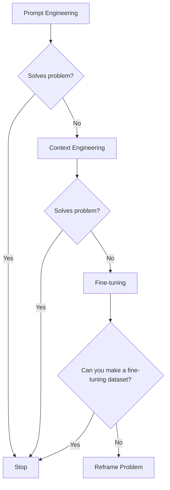
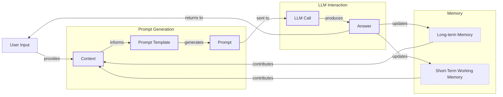
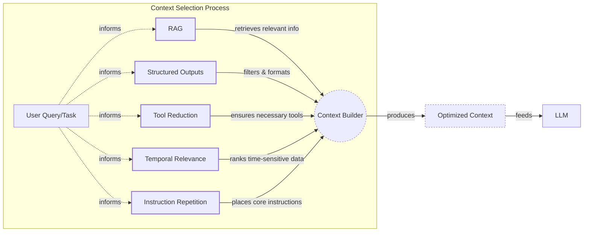
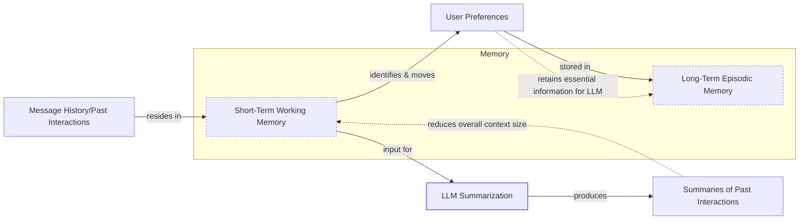
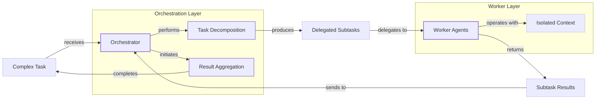

# Lesson 3: Context Engineering

AI applications have evolved rapidly. In 2022, we had simple chatbots for question-answering [[26]](https://www.securityindustry.org/2024/07/16/understanding-the-evolution-from-classic-chatbots-to-rag-chatbots-to-ai-powered-assistants/). By 2023, Retrieval-Augmented Generation (RAG) systems connected LLMs to domain-specific knowledge [[30]](https://www.linkedin.com/posts/ai-apps-central_most-people-put-all-ai-systems-in-the-same-activity-7438555783077793792-UEUm). 2024 brought us tool-using agents that could perform actions [[27]](https://pagergpt.ai/ai-chatbot/evolution-of-ai-chatbots). Now, we are building memory-enabled agents that remember past interactions and maintain state over time [[30]](https://www.linkedin.com/posts/ai-apps-central_most-people-put-all-ai-systems-in-the-same-activity-7438555783077793792-UEUm).

In our last lesson, we explored how to choose between AI agents and LLM workflows when designing a system. As these applications grow more complex, prompt engineering, a practice that once served us well, is showing its limits. It optimizes single LLM calls but fails when managing systems with memory, actions, and long interaction histories. The sheer volume of information an agent might need—past conversations, user data, documents, and action descriptions—has grown exponentially.

Simply stuffing all this into a prompt is not a viable strategy [[41]](https://www.decodingai.com/p/context-engineering-2025s-1-skill). This is where context engineering comes in. It is the discipline of orchestrating this entire information ecosystem to ensure the LLM gets exactly what it needs, when it needs it. This skill is becoming a core foundation for AI engineering, and it is the new fine-tuning. For most use cases, you get better results faster and more cheaply with context engineering, making fine-tuning a last resort [[51]](https://www.linkedin.com/posts/denis-panjuta_prompt-engineering-vs-context-engineering-activity-7363945251180322816-1q_m).

## From prompt to context engineering

Prompt engineering, while effective for simple tasks, is designed for single, stateless interactions [[41]](https://www.decodingai.com/p/context-engineering-2025s-1-skill). It treats each call to an LLM as a new, isolated event. This approach breaks down in stateful applications where context must be preserved and managed across multiple turns.

As a conversation or task progresses, the context grows. Without a strategy to manage this growth, the LLM’s performance degrades. This is context decay: the model gets confused by the noise of an ever-expanding history [[8]](https://thenewstack.io/context-rot-enterprise-ai-llms/), [[3]](https://www.trychroma.com/research/context-rot). It starts to lose track of the original instructions or key information. Microsoft Research and Salesforce found that model performance can drop by an average of 39% when moving from single-turn to multi-turn conversations [[1]](https://atlan.com/know/llm-context-window-limitations/).

Even with large context windows, a physical limit exists for what you can include. Also, every token adds to the cost and latency of an LLM call [[16]](https://www.comet.com/site/blog/context-window/). Simply putting everything into the context creates a slow, expensive, and underperforming system. We will explore these concepts in more detail in upcoming lessons, including memory in Lesson 9 and RAG in Lesson 10.

On a recent project, we learned this the hard way. We were working with a model that supported a million-token context window, so we thought, "*What could go wrong?*" We stuffed everything in: our research, guidelines, examples, and user history. The result was an LLM workflow that took 30 minutes to run and produced low-quality outputs [[41]](https://www.decodingai.com/p/context-engineering-2025s-1-skill).

This is where context engineering becomes essential. It shifts the focus from crafting static prompts to building dynamic systems that manage information flow. As an AI engineer, your job is to select only the most critical pieces of context for each LLM call. This makes your applications accurate, fast, and cost-effective.

## Understanding context engineering

Context engineering is about finding the best way to arrange parts of your memory into the context that is passed to an LLM to get the best results [[31]](https://www.langchain.com/blog/context-engineering-for-agents). It is a solution to an optimization problem where you have to retrieve the right parts of both your short-term and long-term memory to solve a specific task without overwhelming the model [[41]](https://www.decodingai.com/p/context-engineering-2025s-1-skill). This can be framed as an application of the Information Bottleneck principle, where the goal is to squeeze the most relevant information for a task through the limited context window [[66]](https://aclanthology.org/2024.findings-acl.409.pdf), [[67]](https://openreview.net/pdf/038e427a2c56fa8157174274b5fbcf992fd0a336.pdf). Anthropic describes this as curating the "smallest useful set of high-signal tokens" needed for the model to produce the desired outcome [[68]](https://www.progressiverobot.com/2026/04/28/context-engineering/). For example, when you ask a cooking agent for a recipe, you do not give it the entire cookbook. Instead, you retrieve the specific recipe, along with personal context like allergies or taste preferences. This precise selection ensures the model receives only essential information.

Andrej Karpathy offered a great analogy for this: LLMs are like a new kind of operating system, where the model acts as the CPU and its context window functions as the RAM [[31]](https://www.langchain.com/blog/context-engineering-for-agents), [[33]](https://atlan.com/know/working-memory-llms/). Just as an operating system manages what fits into RAM, context engineering curates what occupies the model’s working memory. This is a critical distinction because the context is only a subset of the system's total working memory; you can hold information without passing it to the LLM on every turn.

Context engineering is not replacing prompt engineering. Instead, you can see prompt engineering as a part of context engineering [[41]](https://www.decodingai.com/p/context-engineering-2025s-1-skill). You still need to learn how to write good prompts while gathering the right context and stuffing it into your prompt without breaking the LLM.

| Dimension | Prompt Engineering | Context Engineering |
| --- | --- | --- |
| Scope | Single interaction optimization | Entire information ecosystem |
| State Management | Stateless function | Stateful due to memory |
| Focus | How to phrase tasks | What information to provide |

Table 1: A comparison of prompt engineering and context engineering.

A simple way to frame the distinction is that prompt engineering optimizes a single interaction, while context engineering optimizes every interaction from now on [[69]](https://robotsatemyhomework.substack.com/p/context-engineering-guide). As mentioned, context engineering is the new fine-tuning. Fine-tuning teaches core skills or behaviors, like adopting a specific JSON format, which can improve speed and reduce costs compared to including examples in every prompt. However, it is expensive, time-consuming, and inflexible. Data changes constantly, making fine-tuning a last resort [[51]](https://www.linkedin.com/posts/denis-panjuta_prompt-engineering-vs-context-engineering-activity-7363945251180322816-1q_m). For most enterprise use cases, you get better results faster and more cheaply with context engineering.

When you start a new AI project, your decision-making process for guiding the LLM should look like this:


Image 1: A flowchart illustrating the decision-making workflow for choosing an AI project strategy.

For instance, when building an agent to process internal Slack messages, you do not need to fine-tune a model on your company’s communication style. It is more effective to use a powerful reasoning model and engineer the context to retrieve specific messages and enable actions like creating tasks or drafting emails. Throughout this course, we will show you how to solve most industry problems using only context engineering.

## What makes up the context

To master context engineering, you first need to understand what "context" actually is. It is everything the LLM sees in a single turn, dynamically assembled from various memory components before being passed to the model [[25]](https://www.glean.com/blog/context-engineering-ai-the-foundation-of-reliable-high-performing-models). This context is not limited to text; it can include a rich mix of data types, including images, audio, and video, creating a multimodal information stream for the LLM [[70]](https://snyk.io/articles/context-engineering/).

The high-level workflow begins when user input triggers the system to pull relevant information from both long-term and short-term memory. This information is assembled into the final context, inserted into a prompt template, and sent to the LLM. The LLM’s answer then updates the memory, and the cycle repeats.


Image 2: A high-level workflow diagram showing how context is connected to the prompt template and prompt in an LLM application.

These components are grouped into two main categories. We will explain them intuitively for now, as we have future dedicated lessons for all of them.

### Short-Term Working Memory

Short-term working memory is the state of the agent for the current task or conversation [[12]](https://www.dailydoseofds.com/llmops-crash-course-part-8/). It is volatile and changes with each interaction, helping the agent maintain a coherent dialogue and make immediate decisions. It can include some or all of these components:

*   **User input**: The most recent query or command from the user. This is the immediate trigger for the agent's next action.
*   **Message history**: The log of the current conversation, allowing the LLM to understand the flow and previous turns.
*   **Agent's internal thoughts**: The reasoning steps the agent takes to decide on its next action, often referred to as a scratchpad or chain-of-thought. This process is analogous to a human's cognitive journey, where we "think aloud" to solve a problem step-by-step [[71]](https://promptengineering.org/memory-context-and-cognition-in-llms/). The entire process of selecting, filtering, and reasoning with this working memory can be compared to the brain's executive functions, which manage attention and inhibit irrelevant information to achieve a goal [[72]](https://medium.com/99p-labs/bridging-human-minds-and-machines-how-cognitive-psychology-shapes-the-future-of-llms-c474614fedc4).
*   **Action calls and outputs**: The results from any actions the agent has performed, providing information from external systems.

### Long-Term Memory

Long-term memory is more persistent and stores information across sessions, allowing the AI system to remember things beyond a single conversation. We divide it into three types, drawing parallels from human memory [[38]](https://www.analyticsvidhya.com/blog/2026/01/how-does-llm-memory-work/). An AI system can include some or all of them:

*   **Procedural memory**: This is knowledge encoded directly in the code. It includes the system prompt, which sets the agent's overall behavior. It also includes the definitions of available actions, which tell the agent what it can do, and schemas for structured outputs, which guide the format of its responses. Think of this as the agent's built-in skills [[37]](https://www.datacamp.com/blog/how-does-llm-memory-work).
*   **Episodic memory**: This is memory of specific past experiences, like user preferences or previous interactions. It is used to help the agent personalize its responses based on individual users. We typically store this in vector or graph databases for efficient retrieval [[39]](https://skymod.tech/why-memory-matters-in-llm-agents-short-term-vs-long-term-memory-architectures/).
*   **Semantic memory**: This is the agent’s general knowledge base. It can be internal, like company documents stored in a vector database, or external, accessed via the internet through API calls or web scrapers. This memory provides the factual information the agent needs to answer questions [[36]](https://atlan.com/know/working-memory-llms/).

If this seems like a lot, bear with us. We will cover all these concepts in-depth in future lessons, including structured outputs in Lesson 4, actions in Lesson 6, memory in Lesson 9, RAG in Lesson 10, and working with multimodal data in Lesson 11.
Image 3: A detailed illustration of how all the context engineering components work together inside an AI agent. (Source [Decoding ML](https://i.imgur.com/gK4Yv33.png))

The key takeaway is that these components are not static. They are dynamically re-computed for every single interaction. For each conversation turn or new task, the short-term memory grows, or the long-term memory can change. Context engineering involves knowing how to select the right pieces from this vast memory pool to construct the most effective prompt for the task at hand.

## Production implementation challenges

Now that we understand what makes up the context, let's look at the core challenges of implementing it in production. These challenges all revolve around a single question: *"How can I keep my context as small as possible while providing enough information to the LLM?"* This requires treating context not as an infinite canvas but as a scarce and valuable resource [[68]](https://www.progressiverobot.com/2026/04/28/context-engineering/).

Here are four common issues that come up when building AI applications:

1.  **The context window challenge:** Every AI model has a limited context window, the maximum amount of information (tokens) it can process at once. Think of it like your computer's RAM. If your machine has only 32GB of RAM, that is all it can use at one time. While context windows are getting larger, they are not infinite, and treating them as such leads to other problems [[41]](https://www.decodingai.com/p/context-engineering-2025s-1-skill). The self-attention mechanism in transformers has a computational and memory overhead that grows quadratically with the sequence length, making very long contexts expensive [[1]](https://atlan.com/know/llm-context-window-limitations/). This limitation is not just practical but also theoretical; research has established scaling laws showing that a model's ability to capture long-range dependencies is fundamentally bounded by the size of its internal state [[73]](https://neurips.cc/virtual/2025/poster/115721), [[67]](https://openreview.net/pdf/038e427a2c56fa8157174274b5fbcf992fd0a336.pdf).

2.  **Information overload:** Just because you can fit a lot of information into the context does not mean you should. Too much context reduces the performance of the LLM by confusing it. This is known as the "lost-in-the-middle" or "needle in a haystack" problem, where LLMs are known for remembering information best at the beginning and end of the context window [[56]](https://www.linkedin.com/pulse/lost-middle-lesson-failing-ai-agents-backwards-anthony-dejohn-01k2e). Information in the middle is often overlooked, and performance can drop long before the physical context limit is reached [[58]](https://dev.to/thousand_miles_ai/the-lost-in-the-middle-problem-why-llms-ignore-the-middle-of-your-context-window-3al2). Research shows accuracy can drop by over 30% for information in the middle of a long context [[59]](https://atlan.com/know/llm-context-window-limitations/). This phenomenon is a direct parallel to the primacy and recency effects observed in human psychology, where we tend to remember the first and last items in a list far better than those in the middle [[74]](https://arxiv.org/html/2504.02441v1).

3.  **Context drift:** This occurs when conflicting versions of the truth accumulate in the memory over time [[6]](https://galileo.ai/blog/production-llm-monitoring-strategies). For example, the memory might contain two conflicting statements: "*My cat is white*" and "*My cat is black*." This is not Schrodinger's Cat quantum physics experiment; it is a data conflict that confuses the LLM and prevents it from knowing what to pick [[41]](https://www.decodingai.com/p/context-engineering-2025s-1-skill). Without a mechanism to resolve these conflicts, the model's responses become unreliable.

4.  **Tool confusion:** The final challenge is tool confusion, which arises in two main ways. First, adding too many actions to an agent can confuse the LLM about the best one for the job [[41]](https://www.decodingai.com/p/context-engineering-2025s-1-skill). Second, confusion can occur when tool descriptions are poorly written or overlap. If the distinctions between actions are unclear, even a human would struggle to choose the right one [[2]](https://redis.io/blog/context-window-overflow/).

## Key strategies for context optimization

Initially, most AI applications were chatbots over single knowledge bases. Today, modern AI solutions must manage multiple knowledge bases, tools, and complex conversational histories. Context engineering is about managing this complexity while meeting performance, latency, and cost requirements.

Here are four popular context engineering strategies used across the industry:

### Selecting the Right Context

Retrieving the right information from memory is a critical first step. A common mistake is to provide everything at once, assuming that models with large context windows can handle it. As we have discussed, the "lost-in-the-middle" problem often leads to poor performance, increased latency, and higher costs.

To solve this, consider these approaches:

*   **Use structured outputs:** Define clear schemas for what the LLM should return. This allows you to pass only the necessary, structured information to downstream steps. We will cover this in detail in Lesson 4.
*   **Use RAG:** Instead of providing entire documents, use RAG to fetch only the specific chunks of text needed to answer a user's question [[4]](https://medium.com/@sahin.samia/the-common-failure-points-of-llm-rag-systems-and-how-to-overcome-them-926d9090a88f). This is a core topic we will explore in Lesson 10.
*   **Reduce the number of available actions:** Rather than giving an agent access to every available action, use various strategies to delegate action subsets to specialized components. For example, a typical pattern is to leverage the orchestrator-worker pattern to delegate subtasks to specialized agents [[46]](https://beam.ai/agentic-insights/multi-agent-orchestration-patterns-production). Studies have shown that applying RAG to tool descriptions can improve tool selection accuracy by three-fold [[31]](https://www.langchain.com/blog/context-engineering-for-agents).
*   **Rank time-sensitive data:** For time-sensitive information, rank it by date and filter out anything no longer relevant [[11]](https://oneuptime.com/blog/post/2026-01-30-context-compression/view).
*   **Repeat core instructions:** For the most important instructions, repeat them at both the start and the end of the prompt. This uses the model's tendency to pay more attention to the context edges, ensuring core instructions are not lost [[57]](https://promptmetheus.com/resources/llm-knowledge-base/lost-in-the-middle-effect).


Image 4: System diagram illustrating context optimization techniques for LLM context selection.

### Context Compression

As message history grows in short-term working memory, you must manage past interactions to keep your context window in check. You cannot simply drop past conversation turns, as the LLM still needs to remember what happened. Instead, you need ways to compress key facts from the past. The guiding principle here comes from information theory's Data Processing Inequality, which states that processing data (e.g., summarizing it) cannot increase the amount of information it contains. The goal of compression is therefore to preserve the most valuable information while discarding the noise [[75]](https://cs191w.stanford.edu/projects/Spring2025/Ishan___Khare_.pdf).

You can do this through:

*   **Creating summaries of past interactions:** Use an LLM to replace a long, detailed history with a concise overview [[14]](https://blog.jetbrains.com/research/2025/12/efficient-context-management/).
*   **Moving user preferences to long-term memory:** Transfer user preferences from working memory to long-term episodic memory. This keeps the working context clean while ensuring preferences are remembered for future sessions.
*   **Deduplication:** Remove redundant information from the context to avoid repetition, using techniques like semantic deduplication based on cosine similarity [[11]](https://oneuptime.com/blog/post/2026-01-30-context-compression/view), [[12]](https://www.dailydoseofds.com/llmops-crash-course-part-8/).


Image 5: A process flow diagram illustrating context compression techniques.

### Isolating Context

Another powerful strategy is to isolate context by splitting information across multiple agents or LLM workflows. This technique is similar to tool isolation, but it is more general, referring to the whole context. The key idea is that instead of one agent with a massive, cluttered context window, you can have a team of agents, each with a smaller, focused context [[31]](https://www.langchain.com/blog/context-engineering-for-agents).

We often implement this using an orchestrator-worker pattern, where a central orchestrator agent breaks down a problem and assigns sub-tasks to specialized worker agents [[47]](https://gurusup.com/blog/multi-agent-orchestration-guide). Each worker operates in its own isolated context, improving focus and allowing for parallel processing. This prevents cross-domain hallucinations and can reduce token consumption by 60-70% compared to a single, monolithic agent [[47]](https://gurusup.com/blog/multi-agent-orchestration-guide). We will cover this pattern in more detail in Lesson 5.


Image 6: An architecture diagram illustrating the orchestrator-worker pattern for context isolation in multi-agent systems.

### Format Optimization

Finally, the way you format the context matters. Models are sensitive to structure, and using clear delimiters can improve performance. Common strategies are to use XML tags to wrap different pieces of context (e.g., `<user_query>`, `<documents>`) [[44]](https://www.anthropic.com/engineering/effective-context-engineering-for-ai-agents). This helps the model distinguish between different types of information. Also, using YAML instead of JSON when inputting structured data to the LLM is recommended, as YAML can be more token-efficient [[41]](https://www.decodingai.com/p/context-engineering-2025s-1-skill).

You always have to understand what is passed to the LLM. Seeing exactly what occupies your context window at every step is key to mastering context engineering. This is done by properly monitoring your traces, tracking what happens at each step, and understanding the inputs and outputs [[18]](https://www.getmaxim.ai/articles/context-window-management-strategies-for-long-context-ai-agents-and-chatbots/). As this is a significant step to go from PoC to production, we will have dedicated lessons on this.

## Here is an example

Let's connect the theory and strategies with a concrete example. Context engineering is applied to build powerful AI systems in various domains:

*   **Healthcare:** An AI assistant can access a patient's history, current symptoms, and relevant medical literature to suggest personalized diagnoses [[43]](https://www.mdpi.com/2079-9292/13/15/2961).
*   **Financial Services:** An agent might integrate with a company's CRM system, calendars, and financial data to make decisions based on user preferences [[41]](https://www.decodingai.com/p/context-engineering-2025s-1-skill).
*   **Project Task Managers:** AI systems can access enterprise tools like CRMs, Slack, and task managers to automatically understand project requirements and then add or update tasks.
*   **Content Creator Assistant:** An AI agent can access your research, past content, and style guidelines to help create new content that matches your unique voice.
*   **Robotics:** In autonomous systems, context engineering provides robots with the necessary information to act. This can involve abstracting sensor data and system state into a high-level context for an LLM to reason over, or using feedback loops from the environment to dynamically update the context for the next action [[76]](https://arxiv.org/html/2506.11650v1), [[77]](https://arxiv.org/html/2402.05188v1).
*   **Video Analysis:** AI agents can analyze vast video archives by combining visual data with textual context. For example, an agent could scan security footage for a specific action, using case notes as context to understand what to look for [[78]](https://www.twelvelabs.io/blog/context-engineering-for-video-understanding).

Let's walk through a specific query to see context engineering in action with the healthcare assistant scenario. A user asks: `I have a headache. What can I do to stop it? I would prefer not to take any medicine.`

Before the LLM even sees this query, a context engineering system gets to work:

1.  It retrieves the user's patient history, known allergies, and lifestyle habits from an **episodic memory** store, often a vector or graph database.
2.  It queries a **semantic memory** of up-to-date medical literature for non-medicinal headache remedies.
3.  It assembles this information, along with the user's query and the conversation history, into a structured prompt.
4.  We send the prompt to the LLM, which generates a personalized, safe, and relevant recommendation.
5.  We log the interaction and save any new preferences back to the user's episodic memory.

Here’s a simplified Python example showing how these components might be assembled into a complete system prompt. Notice the clear structure using XML tags and the ordering of context elements.

```python
import yaml

# 1. Define the user's query.
user_query = "I have a headache. What can I do to stop it? I would prefer not to take any medicine."

# 2. Define the patient's history (retrieved from episodic memory).
patient_history = {
    "patient": {
        "name": "John Doe",
        "age": 45,
        "allergies": [],
        "preferences": {
            "medication_avoidance": True,
            "preferred_treatments": "natural_remedies"
        },
        "habits": {
            "stress_level": "high",
            "caffeine_intake": "3-4_cups_daily"
        }
    }
}

# 3. Include relevant medical literature (retrieved from semantic memory).
medical_literature = {
    "articles": [
        {"topic": "dehydration_headaches", "treatment": "Rehydration can alleviate symptoms within 30 minutes to three hours"},
        {"topic": "cold_compress", "treatment": "Applying a cold compress can constrict blood vessels and reduce inflammation"},
        {"topic": "caffeine_withdrawal", "treatment": "For regular consumers, a small amount may alleviate withdrawal headaches"},
        {"topic": "stress_relief", "treatment": "Deep breathing or short walks can help"}
    ]
}

# 4. Assemble the complete prompt.
prompt = f"""
<system_prompt>
You are a helpful and cautious AI healthcare assistant. Your goal is to provide safe, non-medicinal advice. Do not provide medical diagnoses.
1. Analyze the user's query and the provided context.
2. Use the patient history to understand their health profile and preferences.
3. Use the retrieved medical knowledge to form your recommendation.
4. If you lack sufficient information, ask clarifying questions.
5. Always prioritize safety and advise consulting a doctor for serious issues.
</system_prompt>

<patient_history>
{yaml.dump(patient_history)}
</patient_history>

<medical_literature>
{yaml.dump(medical_literature)}
</medical_literature>

<user_query>
{user_query}
</user_query>

Based on all the information above, provide a helpful response.
"""
```

To build such a system, you would use a combination of tools. An LLM like **Gemini** provides the reasoning engine. A framework like **LangGraph** orchestrates the workflow [[65]](https://www.scalablepath.com/machine-learning/langgraph). Databases such as **PostgreSQL**, **Qdrant**, or **Neo4j** serve as long-term memory stores [[62]](https://blog.stackademic.com/context-engineering-in-llms-and-ai-agents-eb861f0d3e9b). It is often effective to keep it simple, as you can achieve much with only PostgreSQL or MongoDB. Observability platforms like **Opik** or **LangSmith** are essential for debugging complex interactions [[64]](https://atlan.com/know/context-engineering-platforms-comparison/).

## Connecting context engineering to AI engineering

Mastering context engineering is less about learning a specific algorithm and more about building intuition. It’s the art of knowing how to structure prompts, what information to include, and how to order it for maximum impact.

This skill does not exist in a vacuum. It’s a multidisciplinary practice that sits at the intersection of several key engineering fields:

*   **AI Engineering:** Understanding LLMs, RAG, and AI agents is the foundation [[23]](https://sombrainc.com/blog/ai-context-engineering-guide).
*   **Software Engineering:** You need to build scalable and maintainable systems to aggregate context and wrap agents in robust APIs [[22]](https://www.mezmo.com/learn-observability/context-engineering-for-observability-how-to-deliver-the-right-data-to-llms).
*   **Data Engineering:** Constructing reliable data pipelines for RAG and other memory systems is critical [[25]](https://www.glean.com/blog/context-engineering-ai-the-foundation-of-reliable-high-performing-models).
*   **Operations (Ops):** Deploying agents on the right infrastructure and automating Continuous Integration/Continuous Deployment (CI/CD) makes them reproducible, observable, and scalable [[21]](https://packmind.com/context-engineering-ai-coding/what-is-contextops/). This often involves building dedicated "context pipelines" to manage the flow of information for monitoring and debugging [[79]](https://www.mezmo.com/learn-observability/context-engineering-for-observability-how-to-deliver-the-right-data-to-llms).

Our goal with this course is to teach you how to combine these skills to build production-ready AI products. We like to say that in the world of AI, we should all think in systems rather than isolated components, having a mindset shift from developers to architects. However, the field is still young and faces significant open research questions. A key challenge is the "comprehension-generation asymmetry": while LLMs can ingest and understand vast, complex contexts, they struggle to generate outputs of comparable sophistication [[80]](https://alphaxiv.org/overview/2507.13334v2). They can read a library in seconds but fail to write a coherent essay about it [[81]](https://medium.com/data-science-collective/3-critical-research-gaps-in-context-engineering-610fa3dcc4a3). This gap is reflected in benchmarks like GAIA, where state-of-the-art agents score around 15% accuracy compared to 92% for humans [[82]](https://medium.com/@adnanmasood/a-practitioners-take-on-a-survey-of-context-engineering-for-large-language-models-49ac87d23a1e).

In the next lesson, we will explore structured outputs, a key technique for making the data flowing out of your LLM predictable and reliable.

## References

- [1] LLM Context Window Limitations: Impacts, Risks, & Fixes in 2026. (n.d.). Atlan. [https://atlan.com/know/llm-context-window-limitations/](https://atlan.com/know/llm-context-window-limitations/)
- [2] Context Window Overflow. (n.d.). Redis. [https://redis.io/blog/context-window-overflow/](https://redis.io/blog/context-window-overflow/)
- [3] Hong, K., Troynikov, A., & Huber, J. (2025, July). Context Rot: How Increasing Input Tokens Impacts LLM Performance. Chroma. [https://www.trychroma.com/research/context-rot](https://www.trychroma.com/research/context-rot)
- [4] Sahin, S. (2025, July 10). The Common Failure Points of LLM RAG Systems and How to Overcome Them. Medium. [https://medium.com/@sahin.samia/the-common-failure-points-of-llm-rag-systems-and-how-to-overcome-them-926d9090a88f](https://medium.com/@sahin.samia/the-common-failure-points-of-llm-rag-systems-and-how-to-overcome-them-926d9090a88f)
- [5] Your 1M-context window LLM is less powerful than you think. (2025, April 24). Towards Data Science. [https://towardsdatascience.com/your-1m-context-window-llm-is-less-powerful-than-you-think/](https://towardsdatascience.com/your-1m-context-window-llm-is-less-powerful-than-you-think/)
- [6] Production LLM Monitoring Strategies. (n.d.). Galileo. [https://galileo.ai/blog/production-llm-monitoring-strategies](https://galileo.ai/blog/production-llm-monitoring-strategies)
- [7] Navigating the Shifting Sands: Understanding and Mitigating Data Drift in LLMs. (n.d.). Coforge. [https://www.coforge.com/what-we-know/blog/navigating-the-shifting-sands-understanding-and-mitigating-data-drift-in-llms](https://www.coforge.com/what-we-know/blog/navigating-the-shifting-sands-understanding-and-mitigating-data-drift-in-llms)
- [8] Context Rot Is the Silent Killer of Enterprise AI LLMs. (n.d.). The New Stack. [https://thenewstack.io/context-rot-enterprise-ai-llms/](https://thenewstack.io/context-rot-enterprise-ai-llms/)
- [9] The Hidden Cost of LLM Drift Detection. (n.d.). InsightFinder. [https://insightfinder.com/blog/hidden-cost-llm-drift-detection/](https://insightfinder.com/blog/hidden-cost-llm-drift-detection/)
- [10] How to Reduce LLM Hallucination: A Practical Guide. (n.d.). Helicone. [https://www.helicone.ai/blog/how-to-reduce-llm-hallucination](https://www.helicone.ai/blog/how-to-reduce-llm-hallucination)
- [11] Context Compression. (n.d.). OneUptime. [https://oneuptime.com/blog/post/2026-01-30-context-compression/view](https://oneuptime.com/blog/post/2026-01-30-context-compression/view)
- [12] LLMOps Crash Course (Part 8): Memory and Temporal Context. (n.d.). Daily Dose of DS. [https://www.dailydoseofds.com/llmops-crash-course-part-8/](https://www.dailydoseofds.com/llmops-crash-course-part-8/)
- [13] Context Compression via Summarization for SLM Relevance Ranking. (2025, October). arXiv. [https://arxiv.org/html/2510.22101v1](https://arxiv.org/html/2510.22101v1)
- [14] Efficient Context Management for LLM-Powered Agents. (2025, December 1). JetBrains Research. [https://blog.jetbrains.com/research/2025/12/efficient-context-management/](https://blog.jetbrains.com/research/2025/12/efficient-context-management/)
- [16] Kinzer, K. (2025, December 23). Context Window: What It Is and Why It Matters for AI Agents. Comet. [https://www.comet.com/site/blog/context-window/](https://www.comet.com/site/blog/context-window/)
- [17] Context Window Optimization. (n.d.). DataHub. [https://datahub.com/blog/context-window-optimization/](https://datahub.com/blog/context-window-optimization/)
- [18] Context Window Management Strategies for Long-Context AI Agents and Chatbots. (n.d.). Maxim.ai. [https://www.getmaxim.ai/articles/context-window-management-strategies-for-long-context-ai-agents-and-chatbots/](https://www.getmaxim.ai/articles/context-window-management-strategies-for-long-context-ai-agents-and-chatbots/)
- [19] Santhanam, A. (2025, May 19). Your LLM hits the token limit. LinkedIn. [https://www.linkedin.com/posts/aditya-santhanam_your-llm-hits-the-token-limit-conversation-activity-7425863566190260224-Pz6v](https://www.linkedin.com/posts/aditya-santhanam_your-llm-hits-the-token-limit-conversation-activity-7425863566190260224-Pz6v)
- [21] Why AI coding assistants fail without context: an introduction to ContextOps. (n.d.). Packmind. [https://packmind.com/context-engineering-ai-coding/what-is-contextops/](https://packmind.com/context-engineering-ai-coding/what-is-contextops/)
- [22] Context Engineering for Observability: How to Deliver the Right Data to LLMs. (n.d.). Mezmo. [https://www.mezmo.com/learn-observability/context-engineering-for-observability-how-to-deliver-the-right-data-to-llms](https://www.mezmo.com/learn-observability/context-engineering-for-observability-how-to-deliver-the-right-data-to-llms)
- [23] AI Context Engineering Guide for Developers. (n.d.). Sombra. [https://sombrainc.com/blog/ai-context-engineering-guide](https://sombrainc.com/blog/ai-context-engineering-guide)
- [25] Context engineering AI: The foundation of reliable, high-performing models. (n.d.). Glean. [https://www.glean.com/blog/context-engineering-ai-the-foundation-of-reliable-high-performing-models](https://www.glean.com/blog/context-engineering-ai-the-foundation-of-reliable-high-performing-models)
- [26] Understanding the Evolution from Classic Chatbots to RAG Chatbots to AI-Powered Assistants. (2024, July 16). Security Industry Association. [https://www.securityindustry.org/2024/07/16/understanding-the-evolution-from-classic-chatbots-to-rag-chatbots-to-ai-powered-assistants/](https://www.securityindustry.org/2024/07/16/understanding-the-evolution-from-classic-chatbots-to-rag-chatbots-to-ai-powered-assistants/)
- [27] The Evolution of AI Chatbots: From Generative AI to Autonomous Agents. (n.d.). pagergpt.ai. [https://pagergpt.ai/ai-chatbot/evolution-of-ai-chatbots](https://pagergpt.ai/ai-chatbot/evolution-of-ai-chatbots)
- [29] When Did AI Chatbots Start? The History of AI Chatbots. (n.d.). Dante AI. [https://www.dante-ai.com/news/when-did-ai-chatbots-start](https://www.dante-ai.com/news/when-did-ai-chatbots-start)
- [30] Most people put all AI systems in the same bucket. (2025, June 17). LinkedIn. [https://www.linkedin.com/posts/ai-apps-central_most-people-put-all-ai-systems-in-the-same-activity-7438555783077793792-UEUm](https://www.linkedin.com/posts/ai-apps-central_most-people-put-all-ai-systems-in-the-same-activity-7438555783077793792-UEUm)
- [31] The LangChain Team. (2025, July 2). Context Engineering for Agents. LangChain Blog. [https://blog.langchain.com/context-engineering-for-agents/](https://blog.langchain.com/context-engineering-for-agents/)
- [32] Context Engineering vs. Prompt Engineering: Key Differences Explained. (n.d.). Glean. [https://www.glean.com/perspectives/context-engineering-vs-prompt-engineering-key-differences-explained](https://www.glean.com/perspectives/context-engineering-vs-prompt-engineering-key-differences-explained)
- [33] Working Memory in LLMs: The Engineering View in 2026. (n.d.). Atlan. [https://atlan.com/know/working-memory-llms/](https://atlan.com/know/working-memory-llms/)
- [34] From ‘Vibe Coding’ to Context Engineering: A Blueprint for Production-Grade GenAI Systems. (n.d.). Sundeep Teki. [https://www.sundeepteki.org/blog/from-vibe-coding-to-context-engineering-a-blueprint-for-production-grade-genai-systems](https://www.sundeepteki.org/blog/from-vibe-coding-to-context-engineering-a-blueprint-for-production-grade-genai-systems)
- [35] Roychowdhury, A. (2025, July 17). Context Engineering: The Silent Architecture Behind Every AI Agent. LinkedIn. [https://www.linkedin.com/pulse/context-engineering-silent-architecture-behind-every-ai-roychowdhury-lzcec](https://www.linkedin.com/pulse/context-engineering-silent-architecture-behind-every-ai-roychowdhury-lzcec)
- [36] How Does LLM Memory Work? (n.d.). Atlan. [https://atlan.com/know/working-memory-llms/](https://atlan.com/know/working-memory-llms/)
- [37] How Does LLM Memory Work? (n.d.). DataCamp. [https://www.datacamp.com/blog/how-does-llm-memory-work](https://www.datacamp.com/blog/how-does-llm-memory-work)
- [38] How Does LLM Memory Work?. (2026, January). Analytics Vidhya. [https://www.analyticsvidhya.com/blog/2026/01/how-does-llm-memory-work/](https://www.analyticsvidhya.com/blog/2026/01/how-does-llm-memory-work/)
- [39] Why Memory Matters in LLM Agents: Short-Term vs. Long-Term Memory Architectures. (n.d.). Skymod. [https://skymod.tech/why-memory-matters-in-llm-agents-short-term-vs-long-term-memory-architectures/](https://skymod.tech/why-memory-matters-in-llm-agents-short-term-vs-long-term-memory-architectures/)
- [40] Episodic vs Persistent Memory in LLMs. (n.d.). Label Studio. [https://labelstud.io/learningcenter/episodic-vs-persistent-memory-in-llms/](https://labelstud.io/learningcenter/episodic-vs-persistent-memory-in-llms/)
- [41] Iusztin, P. (2025, July 22). Context Engineering: 2025’s #1 Skill in AI. Decoding AI. [https://www.decodingai.com/p/context-engineering-2025s-1-skill](https://www.decodingai.com/p/context-engineering-2025s-1-skill)
- [43] Prompt Engineering in Healthcare. (2025). MDPI. [https://www.mdpi.com/2079-9292/13/15/2961](https://www.mdpi.com/2079-9292/13/15/2961)
- [44] Effective Context Engineering for AI Agents. (n.d.). Anthropic. [https://www.anthropic.com/engineering/effective-context-engineering-for-ai-agents](https://www.anthropic.com/engineering/effective-context-engineering-for-ai-agents)
- [46] Multi-Agent Orchestration Patterns for Production. (n.d.). Beam.ai. [https://beam.ai/agentic-insights/multi-agent-orchestration-patterns-production](https://beam.ai/agentic-insights/multi-agent-orchestration-patterns-production)
- [47] Multi-Agent Orchestration: A Comprehensive Guide. (n.d.). GuruSup. [https://gurusup.com/blog/multi-agent-orchestration-guide](https://gurusup.com/blog/multi-agent-orchestration-guide)
- [48] Multi-Agent Systems: Building with Context Engineering. (n.d.). Vellum.ai. [https://www.vellum.ai/blog/multi-agent-systems-building-with-context-engineering](https://www.vellum.ai/blog/multi-agent-systems-building-with-context-engineering)
- [49] Deterministic AI Orchestration: A Platform Architecture for Autonomous Development. (n.d.). Praetorian. [https://www.praetorian.com/blog/deterministic-ai-orchestration-a-platform-architecture-for-autonomous-development/](https://www.praetorian.com/blog/deterministic-ai-orchestration-a-platform-architecture-for-autonomous-development/)
- [50] Specialized Agents in Multi-Agent Systems. (2026, January). arXiv. [https://arxiv.org/html/2601.13671v1](https://arxiv.org/html/2601.13671v1)
- [51] Panjuta, D. (2025, June 13). Prompt Engineering vs Context Engineering. LinkedIn. [https://www.linkedin.com/posts/denis-panjuta_prompt-engineering-vs-context-engineering-activity-7363945251180322816-1q_m](https://www.linkedin.com/posts/denis-panjuta_prompt-engineering-vs-context-engineering-activity-7363945251180322816-1q_m)
- [52] Prompt Engineering vs. Context Engineering. (n.d.). Memgraph. [https://memgraph.com/blog/prompt-engineering-vs-context-engineering](https://memgraph.com/blog/prompt-engineering-vs-context-engineering)
- [53] Context Engineering for Observability. (n.d.). Mezmo. [https://www.mezmo.com/learn-observability/context-engineering-for-observability-how-to-deliver-the-right-data-to-llms](https://www.mezmo.com/learn-observability/context-engineering-for-observability-how-to-deliver-the-right-data-to-llms)
- [54] Context Engineering. (n.d.). Instinctools. [https://www.instinctools.com/blog/context-engineering/](https://www.instinctools.com/blog/context-engineering/)
- [55] Agentic AI: Context Engineering vs Prompt Engineering. (n.d.). Neo4j. [https://neo4j.com/blog/agentic-ai/context-engineering-vs-prompt-engineering/](https://neo4j.com/blog/agentic-ai/context-engineering-vs-prompt-engineering/)
- [56] DeJohn, A. (2025, July 1). 'Lost in the Middle': A Lesson on Failing AI Agents (and Working Backwards). LinkedIn. [https://www.linkedin.com/pulse/lost-middle-lesson-failing-ai-agents-backwards-anthony-dejohn-01k2e](https://www.linkedin.com/pulse/lost-middle-lesson-failing-ai-agents-backwards-anthony-dejohn-01k2e)
- [57] Lost-in-the-Middle Effect. (n.d.). Promptmetheus. [https://promptmetheus.com/resources/llm-knowledge-base/lost-in-the-middle-effect](https://promptmetheus.com/resources/llm-knowledge-base/lost-in-the-middle-effect)
- [58] The 'Lost in the Middle' Problem: Why LLMs Ignore the Middle of Your Context Window. (n.d.). DEV Community. [https://dev.to/thousand_miles_ai/the-lost-in-the-middle-problem-why-llms-ignore-the-middle-of-your-context-window-3al2](https://dev.to/thousand_miles_ai/the-lost-in-the-middle-problem-why-llms-ignore-the-middle-of-your-context-window-3al2)
- [60] Needle in a Haystack: Optimizing Retrieval and RAG over Long Context Windows. (n.d.). Bigdataboutique. [https://bigdataboutique.com/blog/needle-in-haystack-optimizing-retrieval-and-rag-over-long-context-windows-5dfb3c](https://bigdataboutique.com/blog/needle-in-haystack-optimizing-retrieval-and-rag-over-long-context-windows-5dfb3c)
- [61] Context Engineering in AI. (n.d.). Codecademy. [https://www.codecademy.com/article/context-engineering-in-ai](https://www.codecademy.com/article/context-engineering-in-ai)
- [62] Context Engineering in LLMs and AI Agents. (n.d.). Stackademic. [https://blog.stackademic.com/context-engineering-in-llms-and-ai-agents-eb861f0d3e9b](https://blog.stackademic.com/context-engineering-in-llms-and-ai-agents-eb861f0d3e9b)
- [63] How to Implement Context Engineering. (n.d.). Packmind. [https://packmind.com/context-engineering-ai-coding/how-to-implement-context-engineering/](https://packmind.com/context-engineering-ai-coding/how-to-implement-context-engineering/)
- [64] Context Engineering Platforms Comparison. (n.d.). Atlan. [https://atlan.com/know/context-engineering-platforms-comparison/](https://atlan.com/know/context-engineering-platforms-comparison/)
- [65] LangGraph. (n.d.). Scalable Path. [https://www.scalablepath.com/machine-learning/langgraph](https://www.scalablepath.com/machine-learning/langgraph)
- [66] Belrose, N., et al. (2024). Findings of the Association for Computational Linguistics: ACL 2024. [https://aclanthology.org/2024.findings-acl.409.pdf](https://aclanthology.org/2024.findings-acl.409.pdf)
- [67] Dao, T., et al. (2024). The L²M Limit: A Foundation for Long-Context Language Modeling. [https://openreview.net/pdf/038e427a2c56fa8157174274b5fbcf992fd0a336.pdf](https://openreview.net/pdf/038e427a2c56fa8157174274b5fbcf992fd0a336.pdf)
- [68] Context Engineering. (2026, April 28). Progressive Robot. [https://www.progressiverobot.com/2026/04/28/context-engineering/](https://www.progressiverobot.com/2026/04/28/context-engineering/)
- [69] Context Engineering Guide. (n.d.). Robots Ate My Homework. [https://robotsatemyhomework.substack.com/p/context-engineering-guide](https://robotsatemyhomework.substack.com/p/context-engineering-guide)
- [70] Future directions in context engineering. (n.d.). Snyk. [https://snyk.io/articles/context-engineering/](https://snyk.io/articles/context-engineering/)
- [71] Memory, Context, and Cognition in LLMs. (n.d.). PromptEngineering.org. [https://promptengineering.org/memory-context-and-cognition-in-llms/](https://promptengineering.org/memory-context-and-cognition-in-llms/)
- [72] Bridging Human Minds and Machines. (n.d.). 99P Labs. [https://medium.com/99p-labs/bridging-human-minds-and-machines-how-cognitive-psychology-shapes-the-future-of-llms-c474614fedc4](https://medium.com/99p-labs/bridging-human-minds-and-machines-how-cognitive-psychology-shapes-the-future-of-llms-c474614fedc4)
- [73] Liu, A., et al. (2025). A Universal Theoretical Framework for Long-context Language Modeling based on a Bipartite Mutual Information Scaling Law. [https://neurips.cc/virtual/2025/poster/115721](https://neurips.cc/virtual/2025/poster/115721)
- [74] Kos-Barber, M., et al. (2025). Contextual Primacy and Recency Effects in Human and Machine Memory. [https://arxiv.org/html/2504.02441v1](https://arxiv.org/html/2504.02441v1)
- [75] Khare, I. (2025). An Information-Theoretic Approach to Context Compression in Large Language Models. [https://cs191w.stanford.edu/projects/Spring2025/Ishan___Khare_.pdf](https://cs191w.stanford.edu/projects/Spring2025/Ishan___Khare_.pdf)
- [76] RCP: A Context Abstraction Protocol for Human-AI-Robot Collaboration. (2025). [https://arxiv.org/html/2506.11650v1](https://arxiv.org/html/2506.11650v1)
- [77] InCoRo: In-Context Learning for Robotics with Feedback Loops. (2024). [https://arxiv.org/html/2402.05188v1](https://arxiv.org/html/2402.05188v1)
- [78] Context Engineering for Video Understanding. (n.d.). Twelve Labs. [https://www.twelvelabs.io/blog/context-engineering-for-video-understanding](https://www.twelvelabs.io/blog/context-engineering-for-video-understanding)
- [79] Context Engineering for Observability. (n.d.). Mezmo. [https://www.mezmo.com/learn-observability/context-engineering-for-observability-how-to-deliver-the-right-data-to-llms](https://www.mezmo.com/learn-observability/context-engineering-for-observability-how-to-deliver-the-right-data-to-llms)
- [80] A Survey of Context Engineering for Large Language Models. (2025). [https://alphaxiv.org/overview/2507.13334v2](https://alphaxiv.org/overview/2507.13334v2)
- [81] 3 Critical Research Gaps in Context Engineering. (n.d.). Data Science Collective. [https://medium.com/data-science-collective/3-critical-research-gaps-in-context-engineering-610fa3dcc4a3](https://medium.com/data-science-collective/3-critical-research-gaps-in-context-engineering-610fa3dcc4a3)
- [82] A Practitioner's Take on A Survey of Context Engineering for Large Language Models. (2025). [https://medium.com/@adnanmasood/a-practitioners-take-on-a-survey-of-context-engineering-for-large-language-models-49ac87d23a1e](https://medium.com/@adnanmasood/a-practitioners-take-on-a-survey-of-context-engineering-for-large-language-models-49ac87d23a1e)