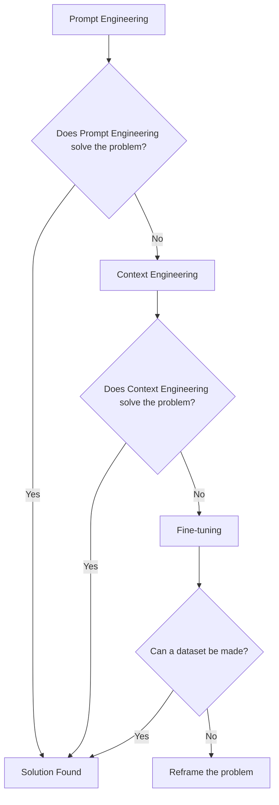
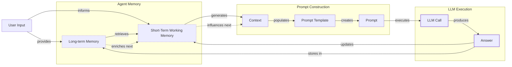
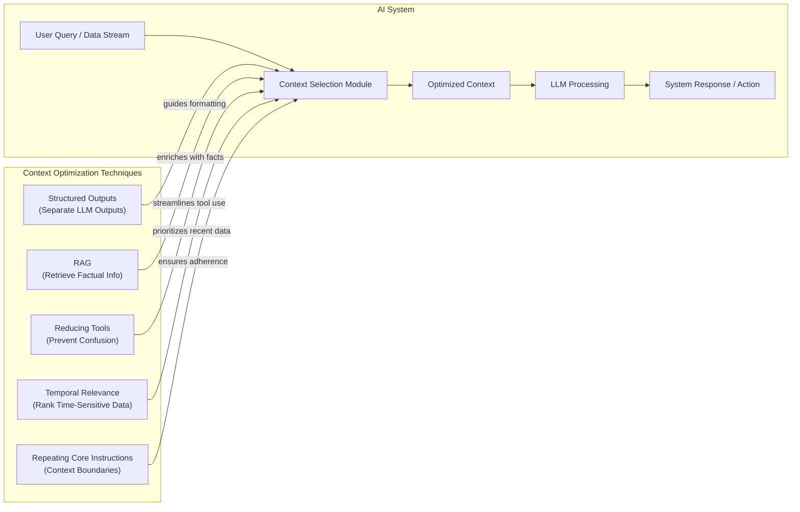
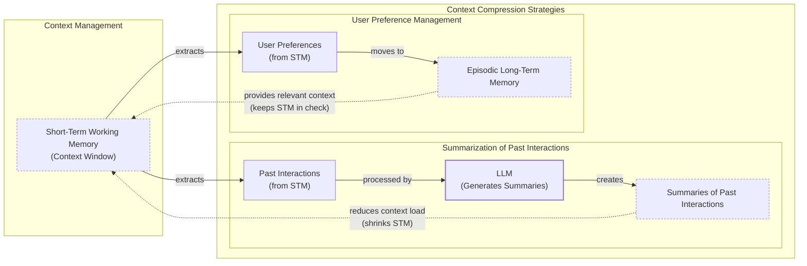
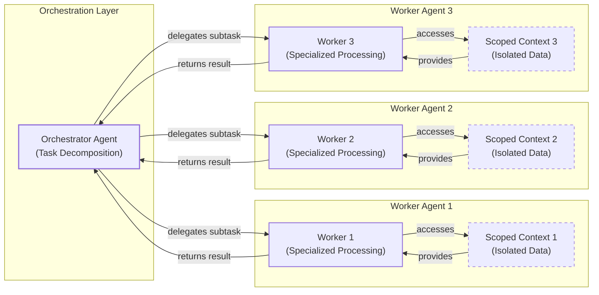

# Context Engineering

AI applications have evolved rapidly. In 2022, we had simple chatbots for question-and-answering. By 2023, Retrieval-Augmented Generation (RAG) systems connected LLMs to domain-specific knowledge. 2024 brought us tool-using agents that could perform actions. Now, we are building memory-enabled agents that remember past interactions and build relationships over time.

In our last lesson, we explored how to choose between AI agents and LLM workflows when designing a system. As these applications grow more complex, prompt engineering, a practice that once served us well, is showing its limits. It optimizes single LLM calls but fails when managing systems with memory, actions, and long interaction histories. The sheer volume of information an agent might need—past conversations, user data, documents, and action descriptions—has grown exponentially. Simply stuffing all this into a prompt is not a viable strategy. This is where context engineering comes in. It is the discipline of orchestrating this entire information ecosystem to ensure the LLM gets exactly what it needs, when it needs it. This skill is becoming a core foundation for AI engineering.

## From Prompt to Context Engineering

Prompt engineering, while effective for simple tasks, is designed for single, stateless interactions. It treats each call to an LLM as a new, isolated event. This approach breaks down in stateful applications where context must be preserved and managed across multiple turns.

As a conversation or task progresses, the context grows. Without a strategy to manage this growth, the LLM’s performance degrades. This is context decay: the model gets confused by the noise of an ever-expanding history. It starts to lose track of the original instructions or key information, a phenomenon known as "lost-in-the-middle" [[56]](https://www.linkedin.com/pulse/lost-middle-lesson-failing-ai-agents-backwards-anthony-dejohn-01k2e).

Even with large context windows, a physical limit exists for what you can include. Also, on the operational side, every token adds to the cost and latency of an LLM call [[16]](https://www.comet.com/site/blog/context-window/). Simply putting everything into the context creates a slow, expensive, and underperforming system. We will explore these concepts in more detail in upcoming lessons, including memory in Lesson 9 and RAG in Lesson 10.

On a recent project, we learned this the hard way. We were working with a model that supported a two-million-token context window, so we thought, "*What could go wrong?*" We stuffed everything in: our research, guidelines, examples, and user history. The result was an LLM workflow that took 30 minutes to run and produced low-quality outputs.

This is where context engineering becomes essential. It shifts the focus from crafting static prompts to building dynamic systems that manage information flow. As an AI engineer, your job is to select only the most critical pieces of context for each LLM call. This makes your applications accurate, fast, and cost-effective.

## Understanding Context Engineering

Context engineering is about finding the best way to arrange parts of your memory into the context that is passed to the LLM to get the best results. It is a solution to an optimization problem in which you have to retrieve the right parts of both your short- and long-term memory to solve a specific task without overwhelming the LLM [[22]](https://arxiv.org/pdf/2507.13334). For example, when you ask a cooking agent for a recipe, you do not give it the entire cookbook. Instead, you retrieve the specific recipe, along with personal context like allergies or taste preferences. This precise selection ensures the model receives only the essential information.

Andrej Karpathy offered a great analogy for this: LLMs are like a new kind of operating system, where the model acts as the CPU and its context window functions as the RAM [[31]](https://www.langchain.com/blog/context-engineering-for-agents). Just as an operating system manages what fits into RAM, context engineering curates what occupies the model’s working memory [[33]](https://atlan.com/know/working-memory-llms/). This aligns with concepts from cognitive psychology, where the context window mirrors human working memory, and context engineering acts as the "executive function" that strategically filters and manipulates information for a task [[66]](https://medium.com/99p-labs/bridging-human-minds-and-machines-how-cognitive-psychology-shapes-the-future-of-llms-c474614fedc4). It is important to note that the context is a subset of the system's total working memory; you can hold information without passing it to the LLM on every turn.

Context engineering is not replacing prompt engineering. Instead, you can intuitively see prompt engineering as a subset of context engineering [[41]](https://www.decodingai.com/p/context-engineering-2025s-1-skill). You still need to learn how to write good prompts while gathering the right context and stuffing it into your prompt without breaking the LLM. That’s what context engineering is all about.

<table_caption>
Table 1: A comparison of prompt engineering and context engineering.
</table_caption>

| Dimension | Prompt Engineering | Context Engineering |
|-----------|-------------------|---------------------|
| Scope | Single interaction optimization | Entire information ecosystem |
| State Management | Stateless function | Stateful due to memory |
| Focus | How to phrase tasks | What information to provide |

Context engineering is the new fine-tuning. While fine-tuning has its place, it is expensive, time-consuming, and inflexible. Data changes constantly, making fine-tuning a last resort [[51]](https://www.linkedin.com/posts/denis-panjuta_prompt-engineering-vs-context-engineering-activity-7363945251180322816-1q_m). For most enterprise use cases, you get better results faster and more cheaply with context engineering. It allows for rapid iteration and adaptation to evolving data without altering the core model, a key advantage in dynamic environments [[53]](https://www.mezmo.com/learn-observability/context-engineering-for-observability-how-to-deliver-the-right-data-to-llms). This approach avoids the computational resources and specialized expertise required for retraining, offering a more agile path to reliable AI applications.

When you start a new AI project, your decision-making process for guiding the LLM should look like the one presented in Image 1.



<diagram_caption>
Image 1: A flowchart illustrating the decision-making workflow for choosing between Prompt Engineering, Context Engineering, and Fine-tuning when starting a new AI project.
</diagram_caption>

For instance, if you build an agent to process internal Slack messages, you do not need to fine-tune a model on your company’s communication style. It is more effective to use a powerful reasoning model and engineer the context to retrieve specific messages and enable actions like creating tasks or drafting emails. Throughout this course, we will show you how to solve most industry problems using only context engineering.

## What Makes Up the Context

To master context engineering, you first need to understand what "context" actually is. It is everything the LLM sees in a single turn, dynamically assembled from various memory components before being passed to the model. The high-level workflow begins when a user input triggers the system to pull relevant information from both long-term and short-term memory. This information is assembled into the final context, inserted into a prompt template, and sent to the LLM. The LLM’s answer then updates the memory, and the cycle repeats, as shown in Image 2.



<diagram_caption>
Image 2: A high-level workflow diagram showing how context is connected to the prompt template and prompt in an LLM application.
</diagram_caption>

These components are grouped into two main categories. We will explain them intuitively for now, as we have future dedicated lessons for all of them.

### Short-Term Working Memory

Short-term working memory is the state of the agent for the current task or conversation. It is volatile and changes with each interaction, helping the agent maintain a coherent dialogue and make immediate decisions [[12]](https://www.dailydoseofds.com/llmops-crash-course-part-8/). It can include some or all of these components:

**User input** is the most recent query or command from the user. It is the immediate trigger for the agent's next action and directly shapes the immediate context.

**Message history** is the log of the current conversation, allowing the LLM to understand the flow and previous turns. This component is crucial for maintaining coherence in multi-turn dialogues.

**The agent's internal thoughts** are the reasoning steps the agent takes to decide on its next action. This "chain-of-thought" or scratchpad content provides a trace of the agent's decision-making process.

**Action calls and outputs** are the results from any actions the agent has performed, providing information from external systems. This includes API responses or database query results that are fed back into the context.

### Long-Term Memory

Long-term memory is more persistent and stores information across sessions, allowing the AI system to remember things beyond a single conversation. We divide it into three types, drawing parallels from human memory [[37]](https://www.datacamp.com/blog/how-does-llm-memory-work). An AI system can include some or all of them:

**Procedural memory** is knowledge encoded directly in the code. It includes the system prompt, which sets the agent's overall behavior and rules. It also includes the definitions of available actions and schemas for structured outputs, which guide the format of its responses. Think of this as the agent's built-in skills [[38]](https://www.analyticsvidhya.com/blog/2026/01/how-does-llm-memory-work/).

**Episodic memory** is the memory of specific past experiences, like user preferences or previous interactions. It is used to help the agent personalize its responses based on individual users. We typically store this in vector or graph databases for efficient retrieval [[39]](https://skymod.tech/why-memory-matters-in-llm-agents-short-term-vs-long-term-memory-architectures/).

**Semantic memory** is the agent’s general knowledge base. It can be internal, like company documents stored in a data lake, or external, accessed via the internet through API calls. This memory provides the factual information the agent needs to answer questions [[40]](https://labelstud.io/learningcenter/episodic-vs-persistent-memory-in-llms/).

While persistent memory enhances utility, it introduces significant privacy and security challenges. Creating a persistent record of user interactions builds detailed profiles that can include sensitive information, amplifying risks through data aggregation and cross-session inference [[67]](https://arxiv.org/html/2508.07664v1). This can lead to security failures like the "Echoleak" incident, where a malicious prompt in an email tricked an agent into leaking private information from past conversations because it lacked proper session isolation [[68]](https://www.newamerica.org/insights/ai-agents-and-memory/).

If this seems like a lot, bear with us. We will cover all these concepts in-depth in future lessons, including structured outputs in Lesson 4, actions in Lesson 6, memory in Lesson 9, and RAG in Lesson 10.

https://substackcdn.com/image/fetch/w_1456,c_limit,f_auto,q_auto:good,fl_progressive:steep/https%3A%2F%2Fsubstack-post-media.s3.amazonaws.com%2Fpublic%2Fimages%2F39dce26a-e51e-4167-ac9e-ca28c45b53a6_1115x708.png
<image_caption>Image 3: A detailed illustration of how all the context engineering components work together inside an AI agent. (Source [Decoding AI Magazine](https://www.decodingai.com/p/context-engineering-2025s-1-skill) [[41]](https://www.decodingai.com/p/context-engineering-2025s-1-skill))</image_caption>

The key takeaway is that these components are not static. They are dynamically re-computed for every single interaction. For each conversation turn or new task, the short-term memory grows, or the long-term memory can change. Context engineering involves knowing how to select the right pieces from this vast memory pool to construct the most effective prompt for the task at hand.

## Production Implementation Challenges

Now that we understand what makes up the context, let's look at the core challenges of implementing it in production. These challenges all revolve around a single question: *"How can I keep my context as small as possible while providing enough information to the LLM?"*

Here are five common issues that come up when building AI applications:

**The context window challenge** is a primary constraint. Every AI model has a limited context window, the maximum amount of information (tokens) it can process at once. This is similar to your computer's RAM. While context windows are growing, with next-generation AI chips from companies like SambaNova and Positron targeting 10 million+ token contexts, they are not infinite, and treating them as such leads to other problems [[17]](https://datahub.com/blog/context-window-optimization/), [[69]](https://aimultiple.com/ai-chip-makers).

**Information overload** is a direct consequence. Just because you can fit a lot of information into the context does not mean you should. Too much context, especially irrelevant data, reduces the performance of the LLM by confusing it. This is known as the "lost-in-the-middle" problem, where models struggle to recall information buried in long inputs [[58]](https://dev.to/thousand_miles_ai/the-lost-in-the-middle-problem-why-llms-ignore-the-middle-of-your-context-window-3al2). For long-horizon agentic tasks, this overload can derail the reasoning process, with some studies showing that over 50% of search trajectories fail due to poor context management [[72]](https://samaya.ai/blog/lost-in-the-maze-overcoming-context-limitations-in-long-horizon-agentic-search).

**Context drift** occurs when conflicting versions of the truth accumulate in the memory over time. For example, the memory might contain two conflicting statements: "The user's budget is $500" and later "The user's budget is $1,000." This is not a quantum physics experiment; it is a data conflict that confuses the LLM [[6]](https://galileo.ai/blog/production-llm-monitoring-strategies). Without a mechanism to resolve these conflicts, the model's responses become unreliable as it cannot determine which fact is current [[7]](https://www.coforge.com/what-we-know/blog/navigating-the-shifting-sands-understanding-and-mitigating-data-drift-in-llms).

**Context poisoning** is a more severe form of drift where compromised, outdated, or irrelevant information enters the context window and propagates into future answers [[70]](https://www.elastic.co/search-labs/blog/context-poisoning-llm). Once an error is embedded, the LLM treats it as truth, creating cascading failures. In long-horizon tasks, this can cause an agent to become fixated on an impossible goal or get stuck in a loop, unable to recover from an early wrong turn [[71]](https://www.dbreunig.com/2025/06/22/how-contexts-fail-and-how-to-fix-them.html).

**Tool confusion** is the final challenge, which arises in two main ways. First, adding too many actions to an agent can confuse the LLM about the best one for the job. The Gorilla benchmark shows that nearly all models perform worse when given more than one tool [[41]](https://www.decodingai.com/p/context-engineering-2025s-1-skill). Second, confusion can occur when tool descriptions are poorly written or overlap. If the distinctions between actions are unclear, even a human would struggle to choose the right one.

## Key Strategies for Context Optimization

Initially, most AI applications were chatbots over single knowledge bases. Today, modern AI solutions must manage multiple knowledge bases, tools, and complex conversational histories. Context engineering is about managing this complexity while meeting performance, latency, and cost requirements.

Here are four popular context engineering strategies used across the industry:

### Selecting the Right Context

Retrieving the right information from memory is a critical first step. A common mistake is to provide everything at once, assuming that models with large context windows can handle it. As we have discussed, the "lost-in-the-middle" problem often leads to poor performance, increased latency, and higher costs [[59]](https://atlan.com/know/llm-context-window-limitations/).



<diagram_caption>
Image 4: Mermaid diagram illustrating context optimization techniques for selecting the right context in an AI system.
</diagram_caption>

To solve this, consider these approaches:

**Use structured outputs** to define clear schemas for what the LLM should return. This allows you to pass only the necessary, structured information to downstream steps. We will cover this in detail in Lesson 4.

**Use RAG** instead of providing entire documents. This technique fetches only the specific chunks of text needed to answer a user's question, reducing noise and improving factual grounding. This is a core topic we will explore in Lesson 10.

**Reduce the number of available tools** to avoid confusing the LLM. Rather than giving an agent access to every available action, use strategies to delegate action subsets to specialized components. For example, the orchestrator-worker pattern delegates subtasks to specialized agents [[46]](https://beam.ai/agentic-insights/multi-agent-orchestration-patterns-production). Studies have shown that keeping tool selections under 30 can triple tool selection accuracy [[22]](https://arxiv.org/pdf/2507.13334).

**Rank time-sensitive data** and filter out anything no longer relevant. For tasks involving temporal context, such as analyzing recent events, ranking information by date ensures the model receives the most current data [[12]](https://www.dailydoseofds.com/llmops-crash-course-part-8/).

**Repeat core instructions** at both the start and the end of the prompt. This counteracts the "lost-in-the-middle" effect by leveraging the model's tendency to pay more attention to the context's edges, ensuring critical instructions are not overlooked [[57]](https://promptmetheus.com/resources/llm-knowledge-base/lost-in-the-middle-effect).

**Use just-in-time retrieval**, where agents are given tools to fetch context on demand rather than being front-loaded with information. This allows for "progressive disclosure," where an agent discovers context through exploration, keeping its working memory lean [[75]](https://www.anthropic.com/engineering/effective-context-engineering-for-ai-agents).

### Context Compression

As message history grows in short-term working memory, you must manage past interactions to keep your context window in check. You cannot simply drop past conversation turns, as the LLM still needs to remember what happened. Instead, you need ways to compress key facts from the past.



<diagram_caption>
Image 5: A Mermaid diagram illustrating context compression strategies, showing how summarization and user preference management reduce the load on short-term working memory.
</diagram_caption>

You can do this through:

**Creating summaries of past interactions** by using an LLM to replace a long, detailed history with a concise overview. This is a common strategy in tools like Claude Code and frameworks like OpenHands [[14]](https://blog.jetbrains.com/research/2025/12/efficient-context-management/).

**Moving user preferences to long-term memory** by transferring them from working memory to episodic memory. This keeps the working context clean while ensuring preferences are remembered for future sessions.

**Deduplication** to remove redundant information from the context. Techniques like MinHash can be used to efficiently identify and eliminate duplicate or near-duplicate content, preserving token space for novel information [[11]](https://oneuptime.com/blog/post/2026-01-30-context-compression/view).

**Implement context budgets** to enforce explicit limits on context size. By treating the context window like a storage system with quotas, you can keep agents fast, cost-effective, and predictable in production [[76]](https://auotam.com/blog/context-budgets-for-production-agents).

### Isolating Context

Another powerful strategy is to isolate context by splitting information across multiple agents or LLM workflows. This technique is similar to tool isolation but applies to the entire context. Instead of one agent with a massive, cluttered context window, you can have a team of agents, each with a smaller, focused context.



<diagram_caption>
Image 6: Mermaid diagram illustrating the orchestrator-worker pattern for context isolation.
</diagram_caption>

We often implement this using an orchestrator-worker pattern, where a central orchestrator agent breaks down a problem and assigns sub-tasks to specialized worker agents [[47]](https://gurusup.com/blog/multi-agent-orchestration-guide). Each worker operates in its own isolated context, which improves focus and allows for parallel processing. This is a core principle behind multi-agent systems, leveraging the separation of concerns principle from software engineering. We will cover this pattern in more detail in a future lesson.

### Format Optimization

Finally, the way you format the context matters. Models are sensitive to structure, and using clear delimiters can improve performance. Common strategies are to use XML tags to wrap different pieces of context (e.g., `<user_query>`, `<documents>`). This helps the model distinguish between different types of information and makes it easier for you to reference context elements within the system prompt [[44]](https://www.anthropic.com/engineering/effective-context-engineering-for-ai-agents). Also, when providing structured data as input, YAML is often more token-efficient than JSON, which helps save space in your context window [[41]](https://www.decodingai.com/p/context-engineering-2025s-1-skill).

To optimize for latency, you can structure the context to be cache-aware. By ordering context from most stable (system prompt, tool schemas) to most volatile (the latest user query), you can maximize the use of the model's KV cache, reducing inference costs and latency [[74]](https://fp8.co/articles/Context-Engineering-for-AI-Agents).

You always have to understand what is passed to the LLM. Seeing exactly what occupies your context window at every step is key to mastering context engineering. Usually, this is done by properly monitoring your traces with observability platforms, tracking what happens at each step, and understanding the inputs and outputs [[18]](https://www.getmaxim.ai/articles/context-window-management-strategies-for-long-context-ai-agents-and-chatbots/). As this is a significant step to go from PoC to production, we will have dedicated lessons on this.

## Here is an Example

Let's connect the theory and strategies discussed earlier with a concrete example. Context engineering is applied to build powerful AI systems in various domains, from healthcare to finance. For instance, in healthcare, an AI assistant can access a patient's history, current symptoms, and relevant medical literature to suggest personalized diagnoses [[43]](https://www.mdpi.com/2079-9292/13/15/2961). In finance, an agent might integrate with a company's CRM, calendars, and financial data to make decisions based on user preferences.

Let's walk through the healthcare assistant scenario. A user asks: `I have a headache. What can I do to stop it? I would prefer not to take any medicine.`

Before the LLM even sees this query, a context engineering system gets to work:

1.  It retrieves the user's patient history, known allergies, and lifestyle habits from an **episodic memory** store, often a vector or graph database.
2.  It queries a **semantic memory** of up-to-date medical literature for non-medicinal headache remedies.
3.  It assembles this information, along with the user's query and the conversation history, into a structured prompt.
4.  We send the prompt to the LLM, which generates a personalized, safe, and relevant recommendation.
5.  We log the interaction and save any new preferences back to the user's episodic memory.

Here’s a simplified Python example showing how these components might be assembled into a complete system prompt. Notice the clear structure using XML tags and the YAML format for data, which is more token-efficient than JSON.

```python
SYSTEM_PROMPT = """
You are a helpful and cautious AI healthcare assistant. Your goal is to provide safe, non-medicinal advice. Do not provide medical diagnoses.

<INSTRUCTIONS>
1. Analyze the user's query and the provided context.
2. Use the patient history to understand their health profile and preferences.
3. Use the retrieved medical knowledge to form your recommendation.
4. If you lack sufficient information, ask clarifying questions.
5. Always prioritize safety and advise consulting a doctor for serious issues.
</INSTRUCTIONS>

<PATIENT_HISTORY>
{retrieved_patient_history}
</PATIENT_HISTORY>

<MEDICAL_KNOWLEDGE>
{retrieved_medical_articles}
</MEDICAL_KNOWLEDGE>

<CONVERSATION_HISTORY>
{formatted_chat_history}
</CONVERSATION_HISTORY>

<USER_QUERY>
{user_query}
</USER_QUERY>

Based on all the information above, provide a helpful response.
"""
```

The key is the system around the prompt that brings in the proper context to populate these fields. To build such a system, you would use a combination of tools. An LLM like **Gemini** provides the reasoning engine. A framework like **LangGraph** orchestrates the workflow. Databases such as **PostgreSQL**, **Qdrant**, or **Neo4j** can serve as long-term memory stores. For simpler AI applications where resources are limited, you can achieve significant results with just PostgreSQL or even SQLite. Observability platforms like **Opik** or **LangSmith** are essential for debugging complex interactions [[65]](https://www.scalablepath.com/machine-learning/langgraph), [[64]](https://atlan.com/know/context-engineering-platforms-comparison/).

## Connecting Context Engineering to AI Engineering

Mastering context engineering is less about learning a specific algorithm and more about building intuition. It’s the art of knowing how to structure prompts, what information to include, and how to order it for maximum impact. This skill does not exist in a vacuum. It’s a multidisciplinary practice that sits at the intersection of several key engineering fields:

**AI Engineering** is the foundation. Understanding LLMs, RAG, and AI agents is essential to know what is possible and how to implement practical solutions.

**Software Engineering** is crucial for building scalable and maintainable systems. You need to construct reliable data pipelines, design robust APIs, and create architectures that can evolve with your product [[23]](https://sombrainc.com/blog/ai-context-engineering-guide).

**Data Engineering** ensures the quality of your context. Constructing reliable pipelines for RAG and other memory systems is critical for feeding curated and validated data into your AI application [[22]](https://www.mezmo.com/learn-observability/context-engineering-for-observability-how-to-deliver-the-right-data-to-llms).

**MLOps** makes your agents reproducible, observable, and scalable. Deploying agents on the right infrastructure and automating CI/CD pipelines are necessary for production-grade systems. This field is evolving down to the silicon level, with emerging hardware like process-in-memory (PIM) and neuromorphic chips being designed to address these computational challenges more efficiently [[21]](https://packmind.com/context-engineering-ai-coding/what-is-contextops/), [[80]](https://arxiv.org/pdf/2411.13717).

Our goal with this course is to teach you how to combine these skills to build production-ready AI products. We like to say that in the world of AI, we should all think in systems rather than isolated components, having a mindset shift from developers to architects.

In the next lesson, we will explore structured outputs, a key technique for controlling what information comes *out* of an LLM. This will build directly on our understanding of context engineering, as structured data is often fed back into the system as context for future steps.

## References

- [1] Overstuffing LLM context windows in complex multi-turn applications leads to performance drops, context rot, and frequent hallucinations. Microsoft Research and Salesforce tested 15 LLMs across 200,000+ simulated conversations, finding 39% average performance drop from single-turn to multi-turn. Recovery from early errors is poor; stale metadata in early turns corrupts subsequent answers as tokens accumulate without removal. Maximum Effective Context Window (MECW) falls far below advertised limits (up to 99% gap on complex tasks per Paulsen 2025). Context rot degrades accuracy 30%+ in mid-window positions across 18 frontier models (Chroma 2025). Enterprise queries consume 50K-100K tokens before reasoning, with metadata quality as key constraint. Production failures include: chatbots forgetting early messages after 20 turns; document Q&A missing sections due to chunking/retrieval gaps or mid-window lost-in-the-middle; agentic workflows accumulating tokens until breaking (e.g., coding agents losing function signatures); analytics assistants running out of room for schema/governance. Chroma confirmed attention fades to early tokens, prioritizing recent/high-signal ones; stale metadata accelerates rot.
- [2] Context window overflow in multi-turn apps occurs from conversation history accumulation (15 turns reaching 30K tokens), RAG retrieval bloat (10 docs at 1,500 tokens each = 15K tokens), system prompt overhead repeating per call, token budget mismanagement, and tool output accumulation in agents. LLMs perform worse in multi-turn vs single-turn (per arXiv:2505.06120). Failures: quality degradation (hallucinations, ignoring early context, poor evidence use especially mid-prompt); agent workflows failing when tool outputs (e.g., 20K JSON) overflow, preventing completion; latency rise as early warning. Silent truncation drops info without errors; models regress before hard limits due to context rot (attention favors beginning/end, middle ignored).
- [3] Chroma's 2025 study on 18 frontier models shows context rot: performance degrades non-uniformly as input length increases, even on simple tasks. Needle-in-a-Haystack extensions reveal lower needle-question similarity accelerates degradation; distractors amplify impact (single reduces performance, four compound it; non-uniform per distractor); haystack structure matters (shuffled outperforms coherent). LongMemEval conversational QA: full 113K-token prompts (with irrelevant context) cause major drops vs focused ~300-token versions, as models must retrieve + reason. Repeated words replication: degrades with length (input=output scale), models under/over-generate, insert random words, refuse tasks; position accuracy favors early unique words. Implications for multi-turn: added irrelevant history forces dual retrieval+reasoning, degrading reliability.
- [4] In RAG for multi-turn apps, context limitations from too many retrieved docs force truncation/prioritization, omitting crucial info. Example: 2008 crisis query retrieves reports but limits cause incomplete causes/effects coverage. Answer extraction errors: LLM fails to filter noise/contradictions from stuffed context, e.g., diabetes med side effects emphasizing minors over majors. Impacts: incomplete/misleading responses in complex queries.
- [5] Even with 1M+ windows, working memory overloads before limits on complex tasks (BAPO-hard: summarization, code tracing, inconsistency detection). Variable tracking (e.g., code reachability) fails beyond 5-10 vars, regressing to random guessing. Explains failures like plot hole detection, long story understanding, similar doc questions. Longer contexts increase BAPO-hard subtasks frequency, more failures.
- [6] Context drift from conflicting information affects LLM reliability by causing shifts in reasoning style, tone, or confidence, leading to unpredictable responses and impacting user experience. Variations in model responses to fixed canary prompts indicate behavioral drift. Sudden divergence in ensemble agreement across model versions highlights changes from fine-tuning, updates, or drift. Semantic degradation occurs subtly before failures, eroding consistency and trust. Data drift changes input patterns, user behavior, vocabulary, or structure compared to training baseline, measured by Population Stability Index (PSI) and KL Divergence, which quantify distribution shifts and information loss in high-dimensional text data. Without monitoring, failures cascade across systems, overwhelming infrastructure and eroding user trust. Mitigation includes tracking consistency with fixed canary prompts, monitoring ensemble agreement, semantic validation using transformer-based similarity models, topic analysis, and tone classifiers. Implement statistical drift detection with PSI, KL Divergence, Kolmogorov-Smirnov or chi-square tests. Deploy behavioral and semantic drift monitoring with embedding-based techniques, clustering, anomaly detection, t-SNE visualizations. Use synthetic feedback systems like toxicity filters. Design adaptive alerting systems correlating multiple signals, tiered escalation. Build response workflows for incident classification, triage, containment, investigation with traces, and post-incident reviews. Unified quality and drift monitoring detects hallucinations and semantic drift without ground truth labels.
- [7] Data drift, including changes in statistical properties of input data differing from training data, affects LLM reliability by causing gradual decline in response accuracy and relevance as real-world language evolves beyond training horizon. It erodes user trust as users perceive unreliability, leading to verification, disengagement, or return to manual processes. Amplifies ethical bias from outdated worldviews and language patterns, risking regulatory and reputational harm. Types include covariate, concept, and label drift. Detection uses Population Stability Index (PSI) for feature distribution changes, KL/Jensen-Shannon Divergence for distributional divergence like new slang, performance metrics (BLEU, ROUGE, F1) for output quality, human feedback loops. Mitigation: Continuous model training and fine-tuning with new high-quality data; robust drift detection and monitoring with AI observability; Human-in-the-Loop (HITL) validation for critical outputs; hybrid architecture of RAG + fine-tuning for adaptability and factual grounding; governance and continuous improvement with transparent processes and accountability.
- [8] Context rot from conflicting information over time, where new data conflicts with existing data in massive pools, affects LLM reliability by diluting results, introducing clashing context, causing agents/LLMs to become confused, lethargic, fall into loops with excessive tool calls, delays, hallucinations, and degraded reasoning/accuracy. LLMs exhaust attention budgets, lose focus, derail reasoning. Triggers vicious cycle of diminishing model validity, mistargeting users. Mitigation: Track performance metrics like response time, tokens consumed; evaluation setups for early signals; context engineering for relevant context retrieval from unstructured data using Elasticsearch, Elastic Agent Builder, vector store, observability platform, ELSER for semantic search, Jina AI embeddings. Governance in LLMOps: purge inaccurate/conflicting/outdated/irrelevant data/metadata from knowledge base before RAG training; temporal filtering, metadata boosting, data-chunk optimization, retrieval volume calibration within token budgets.
- [9] LLM drift from conflicting information over time, including semantic shifts in high-dimensional embedding space and reasoning structure, affects reliability by causing silent quality degradation (less precise answers, inconsistent outputs), increased hallucination risk, loss of trust, technical/organizational debt. Sources: changing user inputs/prompts, retrieval/knowledge base changes shifting tone/emphasis, embedding shifts weakening coherence, infrastructure variability like latency affecting reasoning. Traditional stats miss subtle changes; accuracy masks early drift. Mitigation: Monitor semantic/behavioral stability (reasoning structures, response entropy, input-output consistency); identify anomalies relative to behavioral baselines without labeled data. Correlate drift with system context across pipelines, models, infrastructure for diagnosis. Treat as reliability/observability problem for early visibility, not just evaluation.
- [10] Context-conflicting hallucinations, where LLMs produce self-contradictory responses especially in longer outputs, affect reliability by undermining trust. Fact/input-conflicting also arise from drifts. Mitigation: Optimize prompts (specific, structured, Chain-of-Thought); effective RAG for grounding; robust evaluation with user feedback, scoring, LLM-as-judge, experiments, alerts; advanced: fine-tune with quality data teaching 'I don’t know', guardrails, A/B testing, combine RAG+fine-tuning.
- [11] Context compression techniques for LLM applications include a pipeline combining relevance filtering, semantic deduplication, extractive summarization, sentence pruning, and token budget allocation to reduce token usage by 50-80% while preserving accuracy.
- [12] Context engineering techniques for memory and temporal context in LLM applications include summarization, filtering, deduplication, structured compaction, and prompt compression (e.g., LLMLingua) to manage context windows efficiently. Short-term memory: Recent conversation verbatim (last N turns), trimmed oldest if over limit; combines with rolling summaries of older context. Long-term memory: Embed and store important info in vector DB; retrieve via query similarity.
- [13] Context compression via item description summarization for SLM relevance ranking in semantic search reduces input length up to 10x with minimal accuracy loss.
- [14] Context management for LLM agents compares observation masking and LLM summarization; hybrid combines both for efficiency. Observation Masking (SWE-agent): Rolling window (e.g., last 10 turns) hides older observations with placeholders, preserving full reasoning/actions. Reduces costs >50%. LLM Summarization (OpenHands): Separate LLM summarizes older turns; retains recent 10 turns verbatim. Cuts costs >50%.
- [16] LLM observability tools like Opik help developers trace exactly what’s in an agent’s context window at each step, monitor usage and limits, test workflows under different loads, and catch context-related issues before production.
- [17] Context window optimization involves selecting, structuring, and prioritizing information entering the LLM’s context window to maximize output quality while minimizing cost and latency. Techniques like compaction summarize conversation or task history when nearing limits.
- [18] Production AI applications require continuous monitoring of context window utilization via token usage analytics. AI observability platforms like Maxim provide comprehensive token tracking to identify when applications approach limits and detect sudden increases indicating issues.
- [20] Empirical study compares context management approaches: raw agent (unmanaged growth), observation masking (trim old observations with placeholders), LLM summarization (AI-generated summaries of past steps). Both masking and summarization cut costs over 50% vs raw agent without hurting problem-solving.
- [21] Context engineering combines with software engineering, data pipelines, and operations practices through ContextOps, the DevOps for AI-generated code. It unifies context creation, validation, and distribution across teams and AI assistants, adding abstraction, automation, and governance.
- [22] Mei, L., Yao, J., Ge, Y., Wang, Y., Bi, B., Cai, Y., Liu, J., Li, M., Li, Z., Zhang, D., Zhou, C., Mao, J., Xia, T., Guo, J., & Liu, S. (2025, July 17). A survey of context engineering for large language models. [https://arxiv.org/pdf/2507.13334](https://arxiv.org/pdf/2507.13334)
- [23] Context engineering is an engineering problem combining software engineering (data pipelines, architecture, backend design) with prompt engineering evolution. Core components: RAG retrieval, memory store, user profile/state, tools/APIs, policies/guardrails, and orchestration logic.
- [25] Context engineering designs/manages info (data/memory/tools/rules) for AI tasks, building dynamic systems from sources (instructions/user input/history/retrieved knowledge/tools). It combines with software engineering (curate/structure context like code), data pipelines (ingest/keep fresh data), and operations (hybrid search/retrieval, agent orchestration).
- [26] With the launch of ChatGPT in late 2022, conversational agents evolved from classic chatbots (pre-2022, predefined scripts) to RAG chatbots (search + generation) and now to AI-powered assistants that perform multistep actions.
- [31] Andrej Karpathy. (2025, May 2). +1 for "context engineering" over "prompt engineering". [https://x.com/karpathy/status/1937902205765607626](https://x.com/karpathy/status/1937902205765607626)
- [32] The LLM is like the CPU, and its context window is like RAM, representing a 'working memory' for the model. This analogy from Andrej Karpathy captures the essence of context engineering — determining what information to load into that working memory at each step of an AI interaction.
- [33] Andrej Karpathy’s framing: the LLM is the CPU, the context window is RAM. Model weights are ROM. Everything outside the context window (vector stores, conversation history) is disk storage. Context engineering is 'the delicate art and science of filling the context window with just the right information for the next step.'
- [34] The most powerful mental model comes from Andrej Karpathy: the LLM is a new kind of CPU, and its context window is its RAM. This reframes engineering as designing a rudimentary operating system for this CPU, managing RAM.
- [35] Andrej Karpathy described context engineering as the new systems programming challenge of the LLM era. The context window is the CPU register of an AI agent, every byte precious.
- [36] Working memory in LLMs is the context window: the finite, active space where all reasoning happens. Analogy: LLM is CPU, context window is RAM; model weights are ROM; external memories are disk storage. Long-term memories (semantic, episodic, procedural) are inert until retrieved and injected into the context window.
- [37] LLM memory can be classified by object (personal vs system), form (parametric vs non-parametric), and time (short-term in context window vs long-term external). Short-term is the working memory for the current session. Types include Semantic (facts), Episodic (past interactions), and Procedural (instructions).
- [38] Short-term/contextual memory is the current context window/conversation buffer. Long-term/persistent memory is external (vector DBs, RAG). Cognitive types include Semantic (facts), Episodic (events), and Procedural (how-to/skills).
- [39] Short-term (STM) memory includes conversation buffers in the context window. Long-term (LTM) memory uses external DBs/vector stores for retrieval. Cognitive types are Episodic (history), Semantic (facts), and Procedural (rules/prompts).
- [40] Episodic (short-term/session-based) memory is the context window and chat history for the current conversation. Persistent (long-term) memory uses external vector DBs or fine-tuned weights across sessions.
- [41] Iusztin, P. (2025, July 22). Context Engineering: 2025’s #1 Skill in AI. [https://www.decodingai.com/p/context-engineering-2025s-1-skill](https://www.decodingai.com/p/context-engineering-2025s-1-skill)
- [43] This academic paper on 'Prompt Engineering in Healthcare' discusses applications in primary care for personalized diagnostics via well-crafted prompts. It provides detailed prompt templates in JSON format for personalized remedies.
- [44] Anthropic. (2025). Effective context engineering for AI agents. [https://www.anthropic.com/engineering/effective-context-engineering-for-ai-agents](https://www.anthropic.com/engineering/effective-context-engineering-for-ai-agents)
- [46] The orchestrator-worker pattern involves one agent receiving the task, breaking it into subtasks, delegating each to a specialist worker, and assembling results. The orchestrator uses a capable model while workers use cheaper, task-specific ones, cutting costs 40-60%.
- [47] Orchestrator-worker pattern: A central orchestrator receives tasks, classifies intent, decomposes them into subtasks, routes them to specialized stateless worker agents, and combines the results. This accounts for 70% of production deployments and reduces token consumption by 60-70% vs monolithic agents.
- [48] Context engineering strategies for multi-agent systems include isolating context by giving each agent a scoped window to avoid conflict. A supervisor pattern can be used where a central agent delegates to sub-agents.
- [49] In an orchestrator-worker pattern, the orchestrator holds a state machine and spawns ephemeral sub-agents with clean context windows and no shared history to solve context drift. Workers are stateless.
- [50] Multi-agent systems can use specialized worker agents for well-defined tasks, operating in parallel with narrow sub-domains. An orchestration layer handles planning, execution, and state management.
- [51] Denis Panjuta. (2025, July 25). Prompt Engineering vs. Context Engineering. [https://www.linkedin.com/posts/denis-panjuta_prompt-engineering-vs-context-engineering-activity-7363945251180322816-1q_m](https://www.linkedin.com/posts/denis-panjuta_prompt-engineering-vs-context-engineering-activity-7363945251180322816-1q_m)
- [52] Prompt engineering shapes language/behavior for self-contained tasks. Context engineering shapes what the model sees (relevance/reliability) and controls tools/data for enterprise applications where prompts break.
- [53] Context engineering designs/manages context (prompts, RAG, memory, guardrails) for reliable AI, evolving static prompts to dynamic systems. An example is a support bot where context assembly (profile, snippets, guardrails) yields an accurate response without fine-tuning.
- [54] Context engineering controls info assembly for multi-step workflows, while prompt engineering focuses on individual instructions. An example is an insurance onboarding multi-agent system that cut time 12x via middleware without fine-tuning.
- [55] Prompt engineering is for self-contained generative tasks. Context engineering manages retrieval/memory/tools for dynamic context in agents. Context via knowledge graphs can suffice for reliable agents without fine-tuning.
- [56] The 'lost in the middle' problem shows that LLM performance degrades when relevant information is in the middle of a long input. Models show primacy and recency bias. In production AI agents, bloated contexts lead to hallucinations and failures. Mitigation involves 'context engineering' by moving logic to the application layer to keep context lean.
- [57] The Lost-in-the-Middle Effect is when a model's attention diminishes for information in the middle of a prompt. Mitigation includes placing important information at the beginning or end of the prompt and repeating key details at the end.
- [58] The 'Lost in the Middle' problem shows LLMs have a U-shaped attention curve. In production, relevant chunks in the middle are ignored. Mitigations include strategic document ordering, reducing retrieved documents, prompt compression, and multi-pass extraction.
- [59] Lost-in-the-middle problem: models attend poorly to the middle of context, with accuracy dropping >30% for mid-position info. In production, this causes chatbots to forget early messages and document Q&A to miss sections. Mitigations include RAG, sliding windows, and context compression.
- [60] Needle-in-a-haystack visualizes how LLMs fail when a key fact (needle) is in the middle of a large context (haystack). This is related to the 'Lost-in-the-Middle' problem. Fixes include improving retrieval precision, using rerankers, and breaking flows into smaller calls.
- [61] Context engineering involves techniques like RAG, memory management, tool selection, and context compression. Implementation involves analyzing use cases, designing architecture (retrieval pipelines, vector stores), and integrating context with AI models.
- [62] Context engineering assembles relevant information for LLMs dynamically. Key frameworks include LangChain/LangGraph for chains and agents, and LlamaIndex for vector stores and RAG. Techniques include RAG with vector databases (Pinecone, Weaviate) and memory buffers.
- [63] Context engineering for AI coding uses structured context files (CLAUDE.md, .cursor/rules) in a hierarchical architecture. Implementation involves designing the hierarchy, creating starter packs, and continuous measurement. Tools include Packmind ContextOps for governance.
- [64] Context engineering platforms include orchestration (LangChain/LangGraph, CrewAI), retrieval (LlamaIndex), memory (Mem0, Zep), observability (Langfuse, LangSmith), and governance (Atlan). Composed stacks can combine these tools for specific applications like RAG or multi-agent systems.
- [65] LangGraph orchestrates stateful multi-agent workflows using graphs, shared persistent state/memory (via SQLCheckpointer/databases), and human-in-the-loop capabilities. It integrates with any LLM and data sources and pairs with LangSmith for observability.
- [66] Bridging Human Minds and Machines: How Cognitive Psychology Shapes the Future of LLMs. (2024, May 21). [https://medium.com/99p-labs/bridging-human-minds-and-machines-how-cognitive-psychology-shapes-the-future-of-llms-c474614fedc4](https://medium.com/99p-labs/bridging-human-minds-and-machines-how-cognitive-psychology-shapes-the-future-of-llms-c474614fedc4)
- [67] Zhang, M., Jia, R., & Wang, W. Y. (2025, August 14). What Do We Mean When We Talk About LLM "Memory"? A Technical Overview and Survey of User Perceptions. [https://arxiv.org/html/2508.07664v1](https://arxiv.org/html/2508.07664v1)
- [68] AI Agents and Memory. (2024, June 27). [https://www.newamerica.org/insights/ai-agents-and-memory/](https://www.newamerica.org/insights/ai-agents-and-memory/)
- [69] AI Chip Makers: In-depth Guide on 20+ Companies. (2024, October 1). [https://aimultiple.com/ai-chip-makers](https://aimultiple.com/ai-chip-makers)
- [70] Context Poisoning in LLMs. (2024, August 28). [https://www.elastic.co/search-labs/blog/context-poisoning-llm](https://www.elastic.co/search-labs/blog/context-poisoning-llm)
- [71] How Contexts Fail (and How to Fix Them). (2025, June 22). [https://www.dbreunig.com/2025/06/22/how-contexts-fail-and-how-to-fix-them.html](https://www.dbreunig.com/2025/06/22/how-contexts-fail-and-how-to-fix-them.html)
- [72] Lost in the Maze: Overcoming Context Limitations in Long-Horizon Agentic Search. (2024, September 18). [https://samaya.ai/blog/lost-in-the-maze-overcoming-context-limitations-in-long-horizon-agentic-search](https://samaya.ai/blog/lost-in-the-maze-overcoming-context-limitations-in-long-horizon-agentic-search)
- [73] Liu, A., Kong, L., & Smith, N. A. (2025, November 28). Information-Theoretic Limitations on the Generalization of Large Language Models. [https://arxiv.org/html/2511.12869v1](https://arxiv.org/html/2511.12869v1)
- [74] Context Engineering for AI Agents. (2024, November 1). [https://fp8.co/articles/Context-Engineering-for-AI-Agents](https://fp8.co/articles/Context-Engineering-for-AI-Agents)
- [75] Effective context engineering for AI agents. (2024, September 10). [https://www.anthropic.com/engineering/effective-context-engineering-for-ai-agents](https://www.anthropic.com/engineering/effective-context-engineering-for-ai-agents)
- [76] Context Budgets for Production Agents. (2024, November 12). [https://auotam.com/blog/context-budgets-for-production-agents](https://auotam.com/blog/context-budgets-for-production-agents)
- [77] DeltaStream, the Real-Time Context Engine for Agents. (2025, February 4). [https://www.deltastream.io/blog/deltastream-the-real-time-context-engine-for-agents/](https://www.deltastream.io/blog/deltastream-the-real-time-context-engine-for-agents/)
- [78] Al-Busaidi, S. S., & Al-Busaidi, F. S. (2026, January 21). Entropic Context Shaping: An Information-Theoretic Approach for LLM Agent Context Selection. [https://arxiv.org/html/2601.11585v1](https://arxiv.org/html/2601.11585v1)
- [79] Exploring State-Space Models: The Next Evolution Beyond Transformers. (2024, March 14). [https://pub.towardsai.net/exploring-state-space-models-the-next-evolution-beyond-transformers-ddf99362f722](https://pub.towardsai.net/exploring-state-space-models-the-next-evolution-beyond-transformers-ddf99362f722)
- [80] Wang, Y., Zhang, C., & Li, Y. (2024, November 22). A Survey of Emerging Hardware Accelerators for Deep Learning. [https://arxiv.org/pdf/2411.13717](https://arxiv.org/pdf/2411.13717)