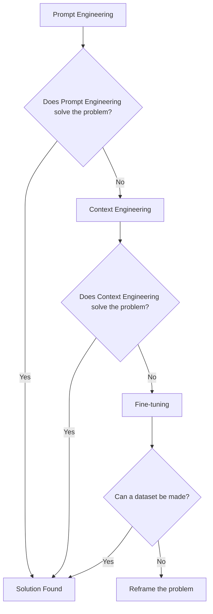
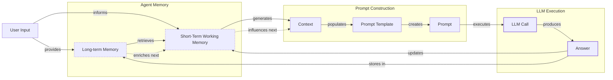
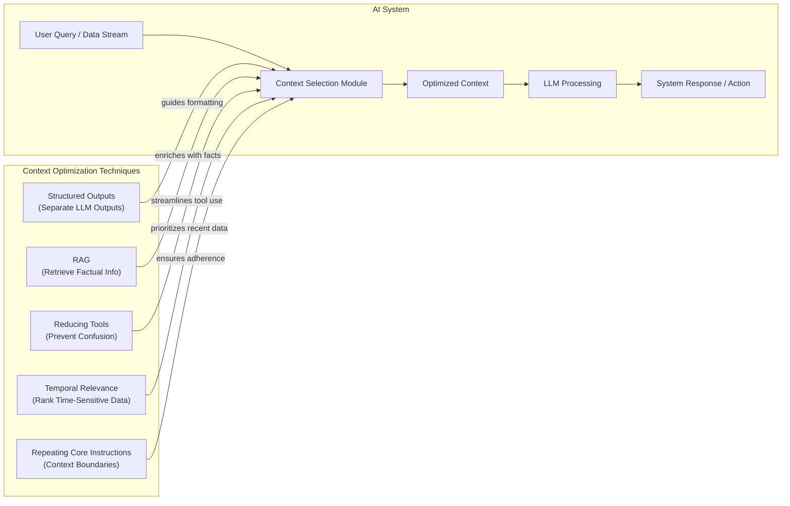
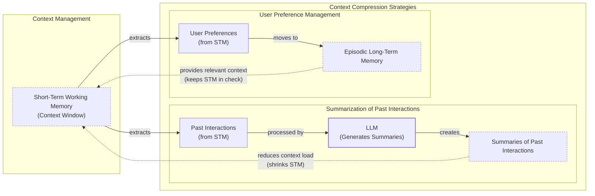
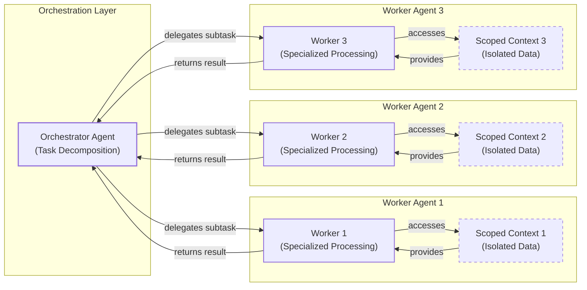

# Context Engineering

AI applications have evolved rapidly. In 2022, we had simple chatbots for question-and-answering. By 2023, Retrieval-Augmented Generation (RAG) systems connected LLMs to domain-specific knowledge. 2024 brought us tool-using agents that could perform actions. Now, we are building memory-enabled agents that remember past interactions and build relationships over time [[26]](https://www.securityindustry.org/2024/07/16/understanding-the-evolution-from-classic-chatbots-to-rag-chatbots-to-ai-powered-assistants/).

In our last lesson, we explored how to choose between AI agents and LLM workflows when designing a system. As these applications grow more complex, prompt engineering, a practice that once served us well, is showing its limits. It optimizes single LLM calls but fails when managing systems with memory, actions, and long interaction histories. The sheer volume of information an agent might need—past conversations, user data, documents, and action descriptions—has grown exponentially. Simply stuffing all this into a prompt is not a viable strategy. A new discipline, context engineering, orchestrates this entire information ecosystem to ensure the LLM gets exactly what it needs, when it needs it. This skill is becoming a core foundation for AI engineering.

## From Prompt to Context Engineering

Prompt engineering, while effective for simple tasks, is designed for single, stateless interactions. It treats each call to an LLM as a new, isolated event. This approach breaks down in stateful applications where context must be preserved and managed across multiple turns.

As a conversation or task progresses, the context grows. Without a strategy to manage this growth, the LLM’s performance degrades. This is context decay: the model gets confused by the noise of an ever-expanding history. It starts to lose track of the original instructions or key information, a phenomenon known as "lost-in-the-middle" [[56]](https://www.linkedin.com/pulse/lost-middle-lesson-failing-ai-agents-backwards-anthony-dejohn-01k2e). Research has shown that model accuracy can drop by over 30% when relevant information is placed in the middle of the input [[59]](https://atlan.com/know/llm-context-window-limitations/).

Even with large context windows, a physical limit exists for what you can include. The self-attention mechanism in transformers imposes a quadratic computational overhead, meaning costs and processing time increase exponentially with context length [[22]](https://arxiv.org/pdf/2507.13334). On the operational side, every token adds to the cost and latency of an LLM call [[16]](https://www.comet.com/site/blog/context-window/). Simply putting everything into the context creates a slow, expensive, and underperforming system. We will explore these concepts in more detail in upcoming lessons, including memory in Lesson 9 and RAG in Lesson 10.

On a recent project, we learned this the hard way. We were working with a model that supported a two-million-token context window, so we thought, "*What could go wrong?*" We stuffed everything in: our research, guidelines, examples, and user history. The result was an LLM workflow that took 30 minutes to run and produced low-quality outputs.

This reality necessitates a shift from crafting static prompts to building dynamic systems that manage information flow. As an AI engineer, your job is to select only the most critical pieces of context for each LLM call. This makes your applications accurate, fast, and cost-effective.

## Understanding Context Engineering

Context engineering is about finding the best way to arrange parts of your memory into the context that is passed to the LLM to get the best results. It is a solution to an optimization problem in which you have to retrieve the right parts of both your short- and long-term memory to solve a specific task without overwhelming the LLM [[22]](https://arxiv.org/pdf/2507.13334). For example, when you ask a cooking agent for a recipe, you do not give it the entire cookbook. Instead, you retrieve the specific recipe, along with personal context like allergies or taste preferences. This precise selection ensures the model receives only the essential information.

Andrej Karpathy offered a great analogy for this: LLMs are like a new kind of operating system, where the model acts as the CPU and its context window functions as the RAM [[31]](https://www.langchain.com/blog/context-engineering-for-agents/). Just as an operating system manages what fits into RAM by curating, persisting, and retrieving data, context engineering curates what occupies the model’s working memory [[33]](https://atlan.com/know/working-memory-llms/). This aligns with concepts from cognitive psychology, where the context window mirrors human working memory, and context engineering acts as the "executive function" that strategically filters and manipulates information for a task [[34]](https://www.sundeepteki.org/blog/from-vibe-coding-to-context-engineering-a-blueprint-for-production-grade-genai-systems). The context is a subset of the system's total working memory; you can hold information without passing it to the LLM on every turn.

Context engineering is not replacing prompt engineering. Instead, you can intuitively see prompt engineering as a subset of context engineering [[41]](https://www.decodingai.com/p/context-engineering-2025s-1-skill). You still need to learn how to write good prompts while gathering the right context and stuffing it into your prompt without breaking the LLM. That’s what context engineering is all about.

<table_caption>
Table 1: A comparison of prompt engineering and context engineering.
</table_caption>

| Dimension | Prompt Engineering | Context Engineering |
|-----------|-------------------|---------------------|
| Scope | Single interaction optimization | Entire information ecosystem |
| State Management | Stateless function | Stateful due to memory |
| Focus | How to phrase tasks | What information to provide |

Context engineering is the new fine-tuning. While fine-tuning has its place, it is expensive, time-consuming, and inflexible. Data changes constantly, making fine-tuning a last resort [[51]](https://www.linkedin.com/posts/denis-panjuta_prompt-engineering-vs-context-engineering-activity-7363945251180322816-1q_m). For most enterprise use cases, you get better results faster and more cheaply with context engineering. It allows for rapid iteration and adaptation to evolving data without altering the core model, a key advantage in dynamic environments [[53]](https://www.mezmo.com/learn-observability/context-engineering-for-observability-how-to-deliver-the-right-data-to-llms). This approach avoids the computational resources and specialized expertise required for retraining, offering a more agile path to reliable AI applications.

When you start a new AI project, your decision-making process for guiding the LLM should look like the one presented in Image 1.



<diagram_caption>
Image 1: A flowchart illustrating the decision-making workflow for choosing between Prompt Engineering, Context Engineering, and Fine-tuning when starting a new AI project.
</diagram_caption>

For instance, if you build an agent to process internal Slack messages, you do not need to fine-tune a model on your company’s communication style. It is more effective to use a powerful reasoning model and engineer the context to retrieve specific messages and enable actions like creating tasks or drafting emails. An insurance onboarding system built with a multi-agent architecture and context isolation, for example, reduced processing time by a factor of 12 without any fine-tuning [[54]](https://www.instinctools.com/blog/context-engineering/). Throughout this course, we will show you how to solve most industry problems using only context engineering.

## What Makes Up the Context

To master context engineering, you first need to understand what "context" actually is. It is everything the LLM sees in a single turn, dynamically assembled from various memory components before being passed to the model. The high-level workflow begins when a user input triggers the system to pull relevant information from both long-term and short-term memory. This information is assembled into the final context, inserted into a prompt template, and sent to the LLM. The LLM’s answer then updates the memory, and the cycle repeats, as shown in Image 2.



<diagram_caption>
Image 2: A high-level workflow diagram showing how context is connected to the prompt template and prompt in an LLM application.
</diagram_caption>

These components are grouped into two main categories. We will explain them intuitively for now, as we have future dedicated lessons for all of them.

### Short-Term Working Memory

Short-term working memory is the state of the agent for the current task or conversation. It is volatile and changes with each interaction, helping the agent maintain a coherent dialogue and make immediate decisions [[12]](https://www.dailydoseofds.com/llmops-crash-course-part-8/). It can include some or all of these components:

**User input** is the most recent query or command from the user. It is the immediate trigger for the agent's next action and directly shapes the immediate context.

**Message history** is the log of the current conversation, allowing the LLM to understand the flow and previous turns. This component is essential for maintaining coherence in multi-turn dialogues.

**The agent's internal thoughts** are the reasoning steps the agent takes to decide on its next action. This "chain-of-thought" or scratchpad content provides a trace of the agent's decision-making process.

**Action calls and outputs** are the results from any actions the agent has performed, providing information from external systems. This includes API responses or database query results that are fed back into the context, which can rapidly accumulate tokens [[2]](https://redis.io/blog/context-window-overflow/).

### Long-Term Memory

Long-term memory is more persistent and stores information across sessions, allowing the AI system to remember things beyond a single conversation. We divide it into three types, drawing parallels from human memory [[37]](https://www.datacamp.com/blog/how-does-llm-memory-work). An AI system can include some or all of them:

**Procedural memory** is knowledge encoded directly in the code. It includes the system prompt, which sets the agent's overall behavior and rules. It also includes the definitions of available actions and schemas for structured outputs, which guide the format of its responses. This is the agent's built-in skills [[38]](https://www.analyticsvidhya.com/blog/2026/01/how-does-llm-memory-work/).

**Episodic memory** is the memory of specific past experiences, like user preferences or previous interactions. It is used to help the agent personalize its responses based on individual users. We typically store this in vector or graph databases for efficient retrieval [[39]](https://skymod.tech/why-memory-matters-in-llm-agents-short-term-vs-long-term-memory-architectures/).

**Semantic memory** is the agent’s general knowledge base. It can be internal, like company documents stored in a data lake, or external, accessed via the internet through API calls. This memory provides the factual information the agent needs to answer questions [[40]](https://labelstud.io/learningcenter/episodic-vs-persistent-memory-in-llms/).

While persistent memory enhances utility, it introduces privacy and security challenges. Creating a persistent record of user interactions builds detailed profiles that can include sensitive information, amplifying risks through data aggregation and cross-session inference [[42]](https://arxiv.org/html/2508.07664v1). This can lead to security failures like the "Echoleak" incident, where a malicious prompt in an email tricked an agent into leaking private information from past conversations because it lacked proper session isolation [[43]](https://www.newamerica.org/insights/ai-agents-and-memory/).

If this seems like a lot, bear with us. We will cover all these concepts in-depth in future lessons, including structured outputs in Lesson 4, actions in Lesson 6, memory in Lesson 9, RAG in Lesson 10, and working with multimodal data in Lesson 11.

https://substackcdn.com/image/fetch/w_1456,c_limit,f_auto,q_auto:good,fl_progressive:steep/https%3A%2F%2Fsubstack-post-media.s3.amazonaws.com%2Fpublic%2Fimages%2F39dce26a-e51e-4167-ac9e-ca28c45b53a6_1115x708.png
<image_caption>Image 3: A detailed illustration of how all the context engineering components work together inside an AI agent. (Source [Decoding AI Magazine](https://www.decodingai.com/p/context-engineering-2025s-1-skill) [[41]](https://www.decodingai.com/p/context-engineering-2025s-1-skill))</image_caption>

The key takeaway is that these components are not static. They are dynamically re-computed for every single interaction. For each conversation turn or new task, the short-term memory grows, or the long-term memory can change. Context engineering involves knowing how to select the right pieces from this vast memory pool to construct the most effective prompt for the task at hand.

## Production Implementation Challenges

Now that we understand what makes up the context, let's look at the core challenges of implementing it in production. These challenges all revolve around a single question: *"How can I keep my context as small as possible while providing enough information to the LLM?"*

Here are four of the most common issues that come up when building AI applications:

**The context window challenge** is a primary constraint. Every AI model has a limited context window, the maximum amount of information (tokens) it can process at once. This is similar to your computer's RAM. While context windows are growing, with next-generation AI chips from companies like SambaNova and Positron targeting 10 million+ token contexts, they are not infinite, and treating them as such leads to other problems [[17]](https://datahub.com/blog/context-window-optimization/), [[44]](https://aimultiple.com/ai-chip-makers). The Maximum Effective Context Window (MECW), where accuracy actually holds up, is often far below the advertised limit, with gaps reaching 99% on complex tasks [[1]](https://atlan.com/know/llm-context-window-limitations/).

**Information overload** is a direct consequence. Just because you can fit a lot of information into the context does not mean you should. Too much context, especially irrelevant data, reduces the performance of the LLM by confusing it. This is known as the "lost-in-the-middle" problem, where models struggle to recall information buried in long inputs [[58]](https://dev.to/thousand_miles_ai/the-lost-in-the-middle-problem-why-llms-ignore-the-middle-of-your-context-window-3al2). A 2025 study by Chroma on 18 frontier models confirmed that distractors amplify this effect; a single distractor reduces performance, and four compound the degradation [[3]](https://www.trychroma.com/research/context-rot). For long-horizon agentic tasks, this overload can derail the reasoning process.

**Context drift** occurs when conflicting versions of the truth accumulate in the memory over time. For example, the memory might contain two conflicting statements: "The user's budget is $500" and later "The user's budget is $1,000." This is not a quantum physics experiment; it is a data conflict that confuses the LLM [[6]](https://galileo.ai/blog/production-llm-monitoring-strategies). This can be caused by changes in user behavior, evolving language, or outdated information in the knowledge base. Without a mechanism to resolve these conflicts, the model's responses become unreliable as it cannot determine which fact is current, eroding user trust [[7]](https://www.coforge.com/what-we-know/blog/navigating-the-shifting-sands-understanding-and-mitigating-data-drift-in-llms).

**Tool confusion** is the final challenge, which arises in two main ways. First, adding too many actions to an agent can confuse the LLM about the best one for the job. The Gorilla benchmark shows that nearly all models perform worse when given more than one tool [[41]](https://www.decodingai.com/p/context-engineering-2025s-1-skill). Second, confusion can occur when tool descriptions are poorly written or overlap. If the distinctions between actions are unclear, the agent may get paralyzed by choice or pick the wrong tool, leading to failed tasks.

## Key Strategies for Context Optimization

Initially, most AI applications were chatbots over single knowledge bases. Today, modern AI solutions must manage multiple knowledge bases, tools, and complex conversational histories. Context engineering is about managing this complexity while meeting performance, latency, and cost requirements.

Here are four popular context engineering strategies used across the industry:

### Selecting the Right Context

Retrieving the right information from memory is a critical first step. A common mistake is to provide everything at once, assuming that models with large context windows can handle it. As we have discussed, the "lost-in-the-middle" problem often leads to poor performance, increased latency, and higher costs [[59]](https://atlan.com/know/llm-context-window-limitations/).



<diagram_caption>
Image 4: Mermaid diagram illustrating context optimization techniques for selecting the right context in an AI system.
</diagram_caption>

To solve this, consider these approaches:

**Use structured outputs** to define clear schemas for what the LLM should return. This allows you to pass only the necessary, structured information to downstream steps. We will cover this in detail in Lesson 4.

**Use RAG** instead of providing entire documents. This technique fetches only the specific chunks of text needed to answer a user's question, reducing noise and improving factual grounding. This is a core topic we will explore in Lesson 10.

**Reduce the number of available tools** to avoid confusing the LLM. Rather than giving an agent access to every available action, use strategies to delegate action subsets to specialized components. For example, the orchestrator-worker pattern delegates subtasks to specialized agents [[46]](https://beam.ai/agentic-insights/multi-agent-orchestration-patterns-production). Studies have shown that keeping tool selections under 30 can triple tool selection accuracy [[22]](https://arxiv.org/pdf/2507.13334).

**Rank time-sensitive data** and filter out anything no longer relevant. For tasks involving temporal context, such as analyzing recent events, ranking information by date ensures the model receives the most current data [[12]](https://www.dailydoseofds.com/llmops-crash-course-part-8/).

**Repeat core instructions** at both the start and the end of the prompt. This counteracts the "lost-in-the-middle" effect by leveraging the model's tendency to pay more attention to the context's edges, ensuring critical instructions are not overlooked [[57]](https://promptmetheus.com/resources/llm-knowledge-base/lost-in-the-middle-effect).

### Context Compression

As message history grows in short-term working memory, you must manage past interactions to keep your context window in check. You cannot simply drop past conversation turns, as the LLM still needs to remember what happened. Instead, you need ways to compress key facts from the past.



<diagram_caption>
Image 5: A Mermaid diagram illustrating context compression strategies, showing how summarization and user preference management reduce the load on short-term working memory.
</diagram_caption>

You can do this through:

**Creating summaries of past interactions** by using an LLM to replace a long, detailed history with a concise overview. This is a common strategy in tools like Claude Code and frameworks like OpenHands. A study comparing context management techniques found that both summarization and a simpler "observation masking" approach (hiding older tool outputs) could cut costs by over 50% without hurting problem-solving ability [[14]](https://blog.jetbrains.com/research/2025/12/efficient-context-management/).

**Moving user preferences to long-term memory** by transferring them from working memory to episodic memory. This keeps the working context clean while ensuring preferences are remembered for future sessions.

**Deduplication** to remove redundant information from the context. Techniques like semantic deduplication, which clusters similar chunks of text and selects a single representative, can reduce token usage by 50-80% while preserving accuracy [[11]](https://oneuptime.com/blog/post/2026-01-30-context-compression/view).

### Isolating Context

Another powerful strategy is to isolate context by splitting information across multiple agents or LLM workflows. This technique is similar to tool isolation but applies to the entire context. Instead of one agent with a massive, cluttered context window, you can have a team of agents, each with a smaller, focused context.



<diagram_caption>
Image 6: Mermaid diagram illustrating the orchestrator-worker pattern for context isolation.
</diagram_caption>

We often implement this using an orchestrator-worker pattern, where a central orchestrator agent breaks down a problem and assigns sub-tasks to specialized worker agents [[47]](https://gurusup.com/blog/multi-agent-orchestration-guide). Each worker operates in its own isolated context, which improves focus and allows for parallel processing. This is a core principle behind multi-agent systems, leveraging the separation of concerns principle from software engineering. We will cover this pattern in more detail in a future lesson.

### Format Optimization

Finally, the way you format the context matters. Models are sensitive to structure, and using clear delimiters can improve performance. Common strategies are to use XML tags to wrap different pieces of context (e.g., `<user_query>`, `<documents>`). This helps the model distinguish between different types of information and makes it easier for you to reference context elements within the system prompt [[45]](https://www.anthropic.com/engineering/effective-context-engineering-for-ai-agents). Also, when providing structured data as input, YAML is often more token-efficient than JSON, which helps save space in your context window [[41]](https://www.decodingai.com/p/context-engineering-2025s-1-skill).

You always have to understand what is passed to the LLM. Seeing exactly what occupies your context window at every step is key to mastering context engineering. Usually, this is done by properly monitoring your traces with observability platforms, tracking what happens at each step, and understanding the inputs and outputs [[18]](https://www.getmaxim.ai/articles/context-window-management-strategies-for-long-context-ai-agents-and-chatbots/). As this is a significant step to go from PoC to production, we will have dedicated lessons on this.

## Here is an Example

Let's connect the theory and strategies discussed earlier with a concrete example. Context engineering is applied to build powerful AI systems in various domains.

**Healthcare** AI assistants access a patient's medical history, current symptoms, and the latest medical literature to provide personalized diagnostic support. This requires careful management of sensitive data and integration with clinical knowledge bases [[49]](https://www.mdpi.com/2079-9292/13/15/2961).

**Financial Services** AI systems integrate with enterprise tools like Customer Relationship Management (CRM) systems, emails, and calendars. They combine real-time market data and client portfolio information to generate tailored financial advice and reports.

**Project Task Managers** access enterprise infrastructure like CRMs, Slack, and task managers to automatically understand project requirements, then add and update project tasks. This automates routine project management and ensures tasks are aligned with broader business goals.

**Content Creator Assistants** use your research, past content, and personality traits to understand what and how to create a given piece of content. This allows for personalized content generation that maintains a consistent voice and style.

Let's walk through the healthcare assistant scenario. A user asks: `I have a headache. What can I do to stop it? I would prefer not to take any medicine.`

Before the LLM even sees this query, a context engineering system gets to work:

1.  It retrieves the user's patient history, known allergies, and lifestyle habits from an **episodic memory** store, often a vector or graph database.
2.  It queries a **semantic memory** of up-to-date medical literature for non-medicinal headache remedies.
3.  It assembles this information, along with the user's query and the conversation history, into a structured prompt.
4.  We send the prompt to the LLM, which generates a personalized, safe, and relevant recommendation.
5.  We log the interaction and save any new preferences back to the user's episodic memory.

Here’s a simplified Python example showing how these components might be assembled into a complete system prompt. Notice the clear structure using XML tags and the YAML format for data, which is more token-efficient than JSON.

```python
SYSTEM_PROMPT = """
You are a helpful and cautious AI healthcare assistant. Your goal is to provide safe, non-medicinal advice. Do not provide medical diagnoses.

<INSTRUCTIONS>
1. Analyze the user's query and the provided context.
2. Use the patient history to understand their health profile and preferences.
3. Use the retrieved medical knowledge to form your recommendation.
4. If you lack sufficient information, ask clarifying questions.
5. Always prioritize safety and advise consulting a doctor for serious issues.
</INSTRUCTIONS>

<PATIENT_HISTORY>
{retrieved_patient_history}
</PATIENT_HISTORY>

<MEDICAL_KNOWLEDGE>
{retrieved_medical_articles}
</MEDICAL_KNOWLEDGE>

<CONVERSATION_HISTORY>
{formatted_chat_history}
</CONVERSATION_HISTORY>

<USER_QUERY>
{user_query}
</USER_QUERY>

Based on all the information above, provide a helpful response.
"""
```

The key is the system around the prompt that brings in the proper context to populate these fields. To build such a system, you would use a combination of tools. An LLM like **Gemini** provides the reasoning engine. A framework like **LangGraph** orchestrates the workflow. Databases such as **PostgreSQL**, **MongoDB**, **Redis**, **Qdrant**, or **Neo4j** can serve as long-term memory stores. For simpler AI applications where resources are limited, you can achieve significant results with just PostgreSQL or MongoDB. Observability platforms like **Opik** or **LangSmith** are essential for debugging complex interactions [[50]](https://www.scalablepath.com/machine-learning/langgraph), [[52]](https://atlan.com/know/context-engineering-platforms-comparison/).

## Connecting Context Engineering to AI Engineering

Mastering context engineering is less about learning a specific algorithm and more about building intuition. It’s the art of knowing how to structure prompts, what information to include, and how to order it for maximum impact. This skill does not exist in a vacuum. It’s a multidisciplinary practice that sits at the intersection of several key engineering fields:

**AI Engineering** is the foundation. Understanding LLMs, RAG, and AI agents is essential to know what is possible and how to implement practical solutions. This involves designing the core logic that allows an agent to reason, plan, and act based on the context it receives.

**Software Engineering** is essential for building scalable and maintainable systems. You need to construct reliable data pipelines, design robust APIs to wrap agents, and create architectures that can evolve with your product. This includes applying principles like modularity and version control to the context itself, treating it as a form of infrastructure [[23]](https://sombrainc.com/blog/ai-context-engineering-guide).

**Data Engineering** ensures the quality of your context. Constructing reliable pipelines for RAG and other memory systems is important for feeding curated and validated data into your AI application. This involves everything from data ingestion and transformation to ensuring data freshness and accuracy [[25]](https://www.glean.com/blog/context-engineering-ai-the-foundation-of-reliable-high-performing-models).

**MLOps** makes your agents reproducible, observable, and scalable. Deploying agents on the right infrastructure and automating Continuous Integration/Continuous Deployment (CI/CD) pipelines are necessary for production-grade systems. This discipline, sometimes called ContextOps, applies observability and governance to the context layer, ensuring that the information feeding your agents is consistent and auditable [[21]](https://packmind.com/context-engineering-ai-coding/what-is-contextops/).

Our goal with this course is to teach you how to combine these skills to build production-ready AI products. In the world of AI, we should all think in systems rather than isolated components, having a mindset shift from developers to architects.

In the next lesson, we will explore structured outputs, a key technique for controlling what information comes *out* of an LLM. This will build directly on our understanding of context engineering, as we will see how structured data is often fed back into the system as context for future steps, enabling more complex actions and memory management.

## References

- [1] [https://atlan.com/know/llm-context-window-limitations/](https://atlan.com/know/llm-context-window-limitations/)
- [2] [https://redis.io/blog/context-window-overflow/](https://redis.io/blog/context-window-overflow/)
- [3] [https://www.trychroma.com/research/context-rot](https://www.trychroma.com/research/context-rot)
- [4] [https://towardsdatascience.com/your-1m-context-window-llm-is-less-powerful-than-you-think/](https://towardsdatascience.com/your-1m-context-window-llm-is-less-powerful-than-you-think/)
- [5] [https://medium.com/@sahin.samia/the-common-failure-points-of-llm-rag-systems-and-how-to-overcome-them-926d9090a88f](https://medium.com/@sahin.samia/the-common-failure-points-of-llm-rag-systems-and-how-to-overcome-them-926d9090a88f)
- [6] [https://galileo.ai/blog/production-llm-monitoring-strategies](https://galileo.ai/blog/production-llm-monitoring-strategies)
- [7] [https://www.coforge.com/what-we-know/blog/navigating-the-shifting-sands-understanding-and-mitigating-data-drift-in-llms](https://www.coforge.com/what-we-know/blog/navigating-the-shifting-sands-understanding-and-mitigating-data-drift-in-llms)
- [8] [https://thenewstack.io/context-rot-enterprise-ai-llms/](https://thenewstack.io/context-rot-enterprise-ai-llms/)
- [9] [https://insightfinder.com/blog/hidden-cost-llm-drift-detection/](https://insightfinder.com/blog/hidden-cost-llm-drift-detection/)
- [10] [https://www.helicone.ai/blog/how-to-reduce-llm-hallucination](https://www.helicone.ai/blog/how-to-reduce-llm-hallucination)
- [11] [https://oneuptime.com/blog/post/2026-01-30-context-compression/view](https://oneuptime.com/blog/post/2026-01-30-context-compression/view)
- [12] [https://www.dailydoseofds.com/llmops-crash-course-part-8/](https://www.dailydoseofds.com/llmops-crash-course-part-8/)
- [13] [https://arxiv.org/html/2510.22101v1](https://arxiv.org/html/2510.22101v1)
- [14] [https://blog.jetbrains.com/research/2025/12/efficient-context-management/](https://blog.jetbrains.com/research/2025/12/efficient-context-management/)
- [15] [https://www.comet.com/site/blog/context-window/](https://www.comet.com/site/blog/context-window/)
- [16] [https://datahub.com/blog/context-window-optimization/](https://datahub.com/blog/context-window-optimization/)
- [17] [https://www.getmaxim.ai/articles/context-window-management-strategies-for-long-context-ai-agents-and-chatbots/](https://www.getmaxim.ai/articles/context-window-management-strategies-for-long-context-ai-agents-and-chatbots/)
- [18] [https://packmind.com/context-engineering-ai-coding/what-is-contextops/](https://packmind.com/context-engineering-ai-coding/what-is-contextops/)
- [19] [https://www.mezmo.com/learn-observability/context-engineering-for-observability-how-to-deliver-the-right-data-to-llms](https://www.mezmo.com/learn-observability/context-engineering-for-observability-how-to-deliver-the-right-data-to-llms)
- [20] [https://sombrainc.com/blog/ai-context-engineering-guide](https://sombrainc.com/blog/ai-context-engineering-guide)
- [21] [https://www.glean.com/blog/context-engineering-ai-the-foundation-of-reliable-high-performing-models](https://www.glean.com/blog/context-engineering-ai-the-foundation-of-reliable-high-performing-models)
- [22] [https://arxiv.org/pdf/2507.13334](https://arxiv.org/pdf/2507.13334)
- [23] [https://www.securityindustry.org/2024/07/16/understanding-the-evolution-from-classic-chatbots-to-rag-chatbots-to-ai-powered-assistants/](https://www.securityindustry.org/2024/07/16/understanding-the-evolution-from-classic-chatbots-to-rag-chatbots-to-ai-powered-assistants/)
- [24] [https://www.langchain.com/blog/context-engineering-for-agents/](https://www.langchain.com/blog/context-engineering-for-agents/)
- [25] [https://www.glean.com/perspectives/context-engineering-vs-prompt-engineering-key-differences-explained](https://www.glean.com/perspectives/context-engineering-vs-prompt-engineering-key-differences-explained)
- [26] [https://atlan.com/know/working-memory-llms/](https://atlan.com/know/working-memory-llms/)
- [27] [https://www.sundeepteki.org/blog/from-vibe-coding-to-context-engineering-a-blueprint-for-production-grade-genai-systems](https://www.sundeepteki.org/blog/from-vibe-coding-to-context-engineering-a-blueprint-for-production-grade-genai-systems)
- [28] [https://www.linkedin.com/pulse/context-engineering-silent-architecture-behind-every-ai-roychowdhury-lzcec](https://www.linkedin.com/pulse/context-engineering-silent-architecture-behind-every-ai-roychowdhury-lzcec)
- [29] [https://www.datacamp.com/blog/how-does-llm-memory-work](https://www.datacamp.com/blog/how-does-llm-memory-work)
- [30] [https://www.analyticsvidhya.com/blog/2026/01/how-does-llm-memory-work/](https://www.analyticsvidhya.com/blog/2026/01/how-does-llm-memory-work/)
- [31] [https://skymod.tech/why-memory-matters-in-llm-agents-short-term-vs-long-term-memory-architectures/](https://skymod.tech/why-memory-matters-in-llm-agents-short-term-vs-long-term-memory-architectures/)
- [32] [https://labelstud.io/learningcenter/episodic-vs-persistent-memory-in-llms/](https://labelstud.io/learningcenter/episodic-vs-persistent-memory-in-llms/)
- [33] [https://www.decodingai.com/p/context-engineering-2025s-1-skill](https://www.decodingai.com/p/context-engineering-2025s-1-skill)
- [34] [https://www.mdpi.com/2079-9292/13/15/2961](https://www.mdpi.com/2079-9292/13/15/2961)
- [35] [https://www.anthropic.com/engineering/effective-context-engineering-for-ai-agents](https://www.anthropic.com/engineering/effective-context-engineering-for-ai-agents)
- [36] [https://beam.ai/agentic-insights/multi-agent-orchestration-patterns-production](https://beam.ai/agentic-insights/multi-agent-orchestration-patterns-production)
- [37] [https://gurusup.com/blog/multi-agent-orchestration-guide](https://gurusup.com/blog/multi-agent-orchestration-guide)
- [38] [https://www.vellum.ai/blog/multi-agent-systems-building-with-context-engineering](https://www.vellum.ai/blog/multi-agent-systems-building-with-context-engineering)
- [39] [https://www.praetorian.com/blog/deterministic-ai-orchestration-a-platform-architecture-for-autonomous-development/](https://www.praetorian.com/blog/deterministic-ai-orchestration-a-platform-architecture-for-autonomous-development/)
- [40] [https://arxiv.org/html/2601.13671v1](https://arxiv.org/html/2601.13671v1)
- [41] [https://www.linkedin.com/posts/denis-panjuta_prompt-engineering-vs-context-engineering-activity-7363945251180322816-1q_m](https://www.linkedin.com/posts/denis-panjuta_prompt-engineering-vs-context-engineering-activity-7363945251180322816-1q_m)
- [42] [https://memgraph.com/blog/prompt-engineering-vs-context-engineering](https://memgraph.com/blog/prompt-engineering-vs-context-engineering)
- [43] [https://www.newamerica.org/insights/ai-agents-and-memory/](https://www.newamerica.org/insights/ai-agents-and-memory/)
- [44] [https://aimultiple.com/ai-chip-makers](https://aimultiple.com/ai-chip-makers)
- [45] [https://www.anthropic.com/engineering/effective-context-engineering-for-ai-agents](https://www.anthropic.com/engineering/effective-context-engineering-for-ai-agents)
- [46] [https://beam.ai/agentic-insights/multi-agent-orchestration-patterns-production](https://beam.ai/agentic-insights/multi-agent-orchestration-patterns-production)
- [47] [https://gurusup.com/blog/multi-agent-orchestration-guide](https://gurusup.com/blog/multi-agent-orchestration-guide)
- [48] [https://www.vellum.ai/blog/multi-agent-systems-building-with-context-engineering](https://www.vellum.ai/blog/multi-agent-systems-building-with-context-engineering)
- [49] [https://www.mdpi.com/2079-9292/13/15/2961](https://www.mdpi.com/2079-9292/13/15/2961)
- [50] [https://www.scalablepath.com/machine-learning/langgraph](https://www.scalablepath.com/machine-learning/langgraph)
- [51] [https://www.linkedin.com/posts/denis-panjuta_prompt-engineering-vs-context-engineering-activity-7363945251180322816-1q_m](https://www.linkedin.com/posts/denis-panjuta_prompt-engineering-vs-context-engineering-activity-7363945251180322816-1q_m)
- [52] [https://atlan.com/know/context-engineering-platforms-comparison/](https://atlan.com/know/context-engineering-platforms-comparison/)
- [53] [https://www.mezmo.com/learn-observability/context-engineering-for-observability-how-to-deliver-the-right-data-to-llms](https://www.mezmo.com/learn-observability/context-engineering-for-observability-how-to-deliver-the-right-data-to-llms)
- [54] [https://www.instinctools.com/blog/context-engineering/](https://www.instinctools.com/blog/context-engineering/)
- [55] [https://neo4j.com/blog/agentic-ai/context-engineering-vs-prompt-engineering/](https://neo4j.com/blog/agentic-ai/context-engineering-vs-prompt-engineering/)
- [56] [https://www.linkedin.com/pulse/lost-middle-lesson-failing-ai-agents-backwards-anthony-dejohn-01k2e](https://www.linkedin.com/pulse/lost-middle-lesson-failing-ai-agents-backwards-anthony-dejohn-01k2e)
- [57] [https://promptmetheus.com/resources/llm-knowledge-base/lost-in-the-middle-effect](https://promptmetheus.com/resources/llm-knowledge-base/lost-in-the-middle-effect)
- [58] [https://dev.to/thousand_miles_ai/the-lost-in-the-middle-problem-why-llms-ignore-the-middle-of-your-context-window-3al2](https://dev.to/thousand_miles_ai/the-lost-in-the-middle-problem-why-llms-ignore-the-middle-of-your-context-window-3al2)
- [59] [https://atlan.com/know/llm-context-window-limitations/](https://atlan.com/know/llm-context-window-limitations/)
- [60] [https://bigdataboutique.com/blog/needle-in-haystack-optimizing-retrieval-and-rag-over-long-context-windows-5dfb3c](https://bigdataboutique.com/blog/needle-in-haystack-optimizing-retrieval-and-rag-over-long-context-windows-5dfb3c)
- [61] [https://www.codecademy.com/article/context-engineering-in-ai](https://www.codecademy.com/article/context-engineering-in-ai)
- [62] [https://blog.stackademic.com/context-engineering-in-llms-and-ai-agents-eb861f0d3e9b](https://blog.stackademic.com/context-engineering-in-llms-and-ai-agents-eb861f0d3e9b)
- [63] [https://packmind.com/context-engineering-ai-coding/how-to-implement-context-engineering/](https://packmind.com/context-engineering-ai-coding/how-to-implement-context-engineering/)
- [64] [https://arxiv.org/html/2508.07664v1](https://arxiv.org/html/2508.07664v1)
- [65] [https://medium.com/99p-labs/bridging-human-minds-and-machines-how-cognitive-psychology-shapes-the-future-of-llms-c474614fedc4](https://medium.com/99p-labs/bridging-human-minds-and-machines-how-cognitive-psychology-shapes-the-future-of-llms-c474614fedc4)
- [66] [https://www.elastic.co/search-labs/blog/context-poisoning-llm](https://www.elastic.co/search-labs/blog/context-poisoning-llm)
- [67] [https://www.dbreunig.com/2025/06/22/how-contexts-fail-and-how-to-fix-them.html](https://www.dbreunig.com/2025/06/22/how-contexts-fail-and-how-to-fix-them.html)
- [68] [https://samaya.ai/blog/lost-in-the-maze-overcoming-context-limitations-in-long-horizon-agentic-search](https://samaya.ai/blog/lost-in-the-maze-overcoming-context-limitations-in-long-horizon-agentic-search)
- [69] [https://auotam.com/blog/context-budgets-for-production-agents](https://auotam.com/blog/context-budgets-for-production-agents)
- [70] [https://fp8.co/articles/Context-Engineering-for-AI-Agents](https://fp8.co/articles/Context-Engineering-for-AI-Agents)
- [71] [https://www.anthropic.com/engineering/effective-context-engineering-for-ai-agents](https://www.anthropic.com/engineering/effective-context-engineering-for-ai-agents)
- [72] [https://arxiv.org/pdf/2411.13717](https://arxiv.org/pdf/2411.13717)
- [73] [https://www.decodingai.com/p/context-engineering-2025s-1-skill](https://www.decodingai.com/p/context-engineering-2025s-1-skill)
- [74] [https://www.mdpi.com/2079-9292/13/15/2961](https://www.mdpi.com/2079-9292/13/15/2961)
- [75] [https://www.anthropic.com/engineering/effective-context-engineering-for-ai-agents](https://www.anthropic.com/engineering/effective-context-engineering-for-ai-agents)
- [76] [https://beam.ai/agentic-insights/multi-agent-orchestration-patterns-production](https://beam.ai/agentic-insights/multi-agent-orchestration-patterns-production)
- [77] [https://gurusup.com/blog/multi-agent-orchestration-guide](https://gurusup.com/blog/multi-agent-orchestration-guide)
- [78] [https://www.vellum.ai/blog/multi-agent-systems-building-with-context-engineering](https://www.vellum.ai/blog/multi-agent-systems-building-with-context-engineering)
- [79] [https://www.praetorian.com/blog/deterministic-ai-orchestration-a-platform-architecture-for-autonomous-development/](https://www.praetorian.com/blog/deterministic-ai-orchestration-a-platform-architecture-for-autonomous-development/)
- [80] [https://arxiv.org/html/2601.13671v1](https://arxiv.org/html/2601.13671v1)
- [81] [https://www.linkedin.com/posts/denis-panjuta_prompt-engineering-vs-context-engineering-activity-7363945251180322816-1q_m](https://www.linkedin.com/posts/denis-panjuta_prompt-engineering-vs-context-engineering-activity-7363945251180322816-1q_m)
- [82] [https://memgraph.com/blog/prompt-engineering-vs-context-engineering](https://memgraph.com/blog/prompt-engineering-vs-context-engineering)
- [83] [https://www.mezmo.com/learn-observability/context-engineering-for-observability-how-to-deliver-the-right-data-to-llms](https://www.mezmo.com/learn-observability/context-engineering-for-observability-how-to-deliver-the-right-data-to-llms)
- [84] [https://www.instinctools.com/blog/context-engineering/](https://www.instinctools.com/blog/context-engineering/)
- [85] [https://neo4j.com/blog/agentic-ai/context-engineering-vs-prompt-engineering/](https://neo4j.com/blog/agentic-ai/context-engineering-vs-prompt-engineering/)
- [86] [https://www.linkedin.com/pulse/lost-middle-lesson-failing-ai-agents-backwards-anthony-dejohn-01k2e](https://www.linkedin.com/pulse/lost-middle-lesson-failing-ai-agents-backwards-anthony-dejohn-01k2e)
- [87] [https://promptmetheus.com/resources/llm-knowledge-base/lost-in-the-middle-effect](https://promptmetheus.com/resources/llm-knowledge-base/lost-in-the-middle-effect)
- [88] [https://dev.to/thousand_miles_ai/the-lost-in-the-middle-problem-why-llms-ignore-the-middle-of-your-context-window-3al2](https://dev.to/thousand_miles_ai/the-lost-in-the-middle-problem-why-llms-ignore-the-middle-of-your-context-window-3al2)
- [89] [https://atlan.com/know/llm-context-window-limitations/](https://atlan.com/know/llm-context-window-limitations/)
- [90] [https://bigdataboutique.com/blog/needle-in-haystack-optimizing-retrieval-and-rag-over-long-context-windows-5dfb3c](https://bigdataboutique.com/blog/needle-in-haystack-optimizing-retrieval-and-rag-over-long-context-windows-5dfb3c)
- [91] [https://www.codecademy.com/article/context-engineering-in-ai](https://www.codecademy.com/article/context-engineering-in-ai)
- [92] [https://blog.stackademic.com/context-engineering-in-llms-and-ai-agents-eb861f0d3e9b](https://blog.stackademic.com/context-engineering-in-llms-and-ai-agents-eb861f0d3e9b)
- [93] [https://packmind.com/context-engineering-ai-coding/how-to-implement-context-engineering/](https://packmind.com/context-engineering-ai-coding/how-to-implement-context-engineering/)
- [94] [https://atlan.com/know/context-engineering-platforms-comparison/](https://atlan.com/know/context-engineering-platforms-comparison/)
- [95] [https://www.scalablepath.com/machine-learning/langgraph](https://www.scalablepath.com/machine-learning/langgraph)
- [96] [https://arxiv.org/html/2508.07664v1](https://arxiv.org/html/2508.07664v1)
- [97] [https://www.newamerica.org/insights/ai-agents-and-memory/](https://www.newamerica.org/insights/ai-agents-and-memory/)
- [98] [https://ziptie.dev/blog/how-ai-remembers-your-content-across-sessions/](https://ziptie.dev/blog/how-ai-remembers-your-content-across-sessions/)
- [99] [https://developers.openai.com/cookbook/examples/agents_sdk/context_personalization](https://developers.openai.com/cookbook/examples/agents_sdk/context_personalization)
- [100] [https://www.augmentcode.com/guides/agent-memory-vs-context-engineering](https://www.augmentcode.com/guides/agent-memory-vs-context-engineering)
- [101] [https://arxiv.org/html/2501.12372v6](https://arxiv.org/html/2501.12372v6)
- [102] [https://fp8.co/articles/Context-Engineering-for-AI-Agents](https://fp8.co/articles/Context-Engineering-for-AI-Agents)
- [103] [https://auotam.com/blog/context-budgets-for-production-agents](https://auotam.com/blog/context-budgets-for-production-agents)
- [104] [https://beam.ai/agentic-insights/multi-agent-orchestration-patterns-production](https://beam.ai/agentic-insights/multi-agent-orchestration-patterns-production)
- [105] [https://packmind.com/context-engineering-ai-coding/what-is-contextops/](https://packmind.com/context-engineering-ai-coding/what-is-contextops/)
- [106] [https://www.decodingai.com/p/context-engineering-2025s-1-skill](https://www.decodingai.com/p/context-engineering-2025s-1-skill)
- [107] [https://www.trychroma.com/research/context-rot](https://www.trychroma.com/research/context-rot)
- [108] [https://www.comet.com/site/blog/context-window/](https://www.comet.com/site/blog/context-window/)
- [109] [https://blog.jetbrains.com/research/2025/12/efficient-context-management/](https://blog.jetbrains.com/research/2025/12/efficient-context-management/)
- [110] [https://atlan.com/know/llm-context-window-limitations/](https://atlan.com/know/llm-context-window-limitations/)
- [111] [https://arxiv.org/pdf/2507.13334](https://arxiv.org/pdf/2507.13334)
- [112] [https://www.datacamp.com/blog/context-engineering](https://www.datacamp.com/blog/context-engineering)
- [113] [https://www.llamaindex.ai/blog/context-engineering-what-it-is-and-techniques-to-consider](https://www.llamaindex.ai/blog/context-engineering-what-it-is-and-techniques-to-consider)
- [114] [https://blog.langchain.com/context-engineering-for-agents/](https://blog.langchain.com/context-engineering-for-agents/)
- [115] [https://blog.langchain.com/the-rise-of-context-engineering/](https://blog.langchain.com/the-rise-of-context-engineering/)
- [116] [https://x.com/karpathy/status/1937902205765607626](https://x.com/karpathy/status/1937902205765607626)
- [117] [https://x.com/lenadroid/status/1943685060785524824](https://x.com/lenadroid/status/1943685060785524824)
- [118] [https://nlp.elvissaravia.com/p/context-engineering-guide](https://nlp.elvissaravia.com/p/context-engineering-guide)
- [119] [https://github.com/humanlayer/12-factor-agents/blob/main/content/factor-03-own-your-context-window.md](https://github.com/humanlayer/12-factor-agents/blob/main/content/factor-03-own-your-context-window.md)
- [120] [https://www.pinecone.io/learn/context-engineering/](https://www.pinecone.io/learn/context-engineering/)
- [121] [https://medium.com/99p-labs/bridging-human-minds-and-machines-how-cognitive-psychology-shapes-the-future-of-llms-c474614fedc4](https://medium.com/99p-labs/bridging-human-minds-and-machines-how-cognitive-psychology-shapes-the-future-of-llms-c474614fedc4)
- [122] [https://arxiv.org/html/2508.07664v1](https://arxiv.org/html/2508.07664v1)
- [123] [https://www.newamerica.org/insights/ai-agents-and-memory/](https://www.newamerica.org/insights/ai-agents-and-memory/)
- [124] [https://aimultiple.com/ai-chip-makers](https://aimultiple.com/ai-chip-makers)
- [125] [https://www.elastic.co/search-labs/blog/context-poisoning-llm](https://www.elastic.co/search-labs/blog/context-poisoning-llm)
- [126] [https://www.dbreunig.com/2025/06/22/how-contexts-fail-and-how-to-fix-them.html](https://www.dbreunig.com/2025/06/22/how-contexts-fail-and-how-to-fix-them.html)
- [127] [https://samaya.ai/blog/lost-in-the-maze-overcoming-context-limitations-in-long-horizon-agentic-search](https://samaya.ai/blog/lost-in-the-maze-overcoming-context-limitations-in-long-horizon-agentic-search)
- [128] [https://auotam.com/blog/context-budgets-for-production-agents](https://auotam.com/blog/context-budgets-for-production-agents)
- [129] [https://fp8.co/articles/Context-Engineering-for-AI-Agents](https://fp8.co/articles/Context-Engineering-for-AI-Agents)
- [130] [https://ziptie.dev/blog/how-ai-remembers-your-content-across-sessions/](https://ziptie.dev/blog/how-ai-remembers-your-content-across-sessions/)
- [131] [https://arxiv.org/pdf/2411.13717](https://arxiv.org/pdf/2411.13717)

</article>