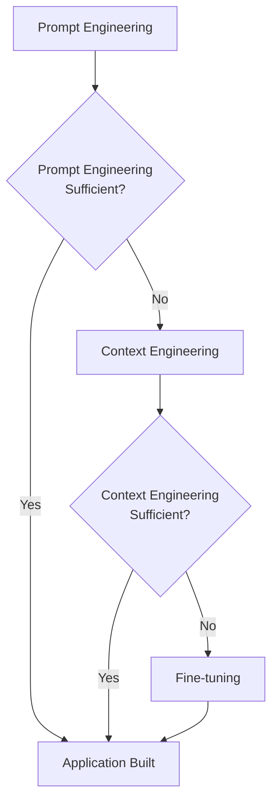
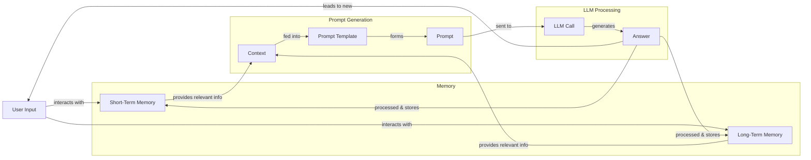
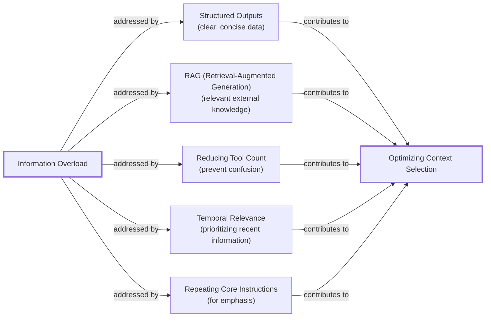
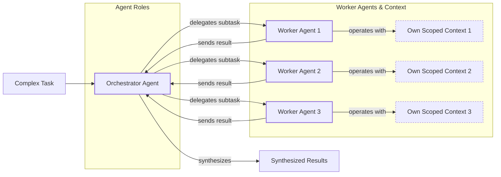

# Lesson 3: Context Engineering

## When prompt engineering breaks

AI applications have evolved rapidly. In 2022, we had simple chatbots. By 2023, Retrieval-Augmented Generation (RAG) systems connected LLMs to domain-specific knowledge. Now, we are building memory-enabled agents that remember past interactions and perform actions over time.

In our last lesson, we explored how to choose between AI agents and LLM workflows. As these applications grow more complex, prompt engineering, which optimizes single LLM calls, is showing its limits. The volume of information an agent might need has grown exponentially. A new discipline, context engineering, is required to orchestrate this entire information ecosystem and ensure the LLM gets exactly what it needs.

## From Prompt to Context Engineering

Prompt engineering is designed for single, stateless interactions, treating each LLM call as an isolated event. This approach breaks down in stateful applications where context must be managed across multiple turns.

As a task progresses, the context grows, and performance degrades due to context decay. The model gets confused by the noise of an ever-expanding history, leading to hallucinations and misguided answers [[1]](https://www.decodingai.com/p/context-engineering-2025s-1-skill). Even with large context windows, every token adds to cost and latency. A naive approach of stuffing everything into the context creates slow, expensive, and underperforming systems. We will explore these concepts in more detail in upcoming lessons.

The solution is to shift from crafting static prompts to building dynamic systems that manage information flow. As an AI engineer, your job is to select only the most critical pieces of context for each LLM call, making your applications accurate, fast, and cost-effective.

## Understanding Context Engineering

Context engineering is the practice of strategically filling the model’s limited context window with the right information, at the right time, and in the right format [[1]](https://www.decodingai.com/p/context-engineering-2025s-1-skill). It is an optimization problem: we retrieve the necessary parts from memory to solve a task without overwhelming the model. For example, a cooking agent needs a specific recipe and user allergies, not the entire cookbook.

Andrej Karpathy provides a useful analogy: LLMs are a new operating system, where the model is the CPU and its context window is the RAM [[2]](https://x.com/karpathy/status/1937902205765607626). Context engineering, like an OS, curates what occupies this working memory.

Prompt engineering is a subset of context engineering. You still write effective prompts, but you also design a system that feeds the right context into them. This means understanding not just *how* to phrase a task, but *what* information the model needs to perform optimally [[1]](https://www.decodingai.com/p/context-engineering-2025s-1-skill).

| Dimension | Prompt Engineering | Context Engineering |
| --- | --- | --- |
| Scope | Single interaction optimization | Entire information ecosystem |
| State Management | Primarily stateless | Inherently stateful, with explicit memory management |
| Focus | How to phrase tasks | What information to provide |

Table 1: A comparison of prompt engineering and context engineering.

Context engineering is often called the new fine-tuning. Fine-tuning is expensive, slow, and inflexible, making it a last resort for most applications [[3]](https://www.linkedin.com/posts/denis-panjuta_prompt-engineering-vs-context-engineering-activity-7363945251180322816-1q_m). Context engineering delivers better results faster and more cheaply by allowing rapid iteration without altering the core model.

When you start a new AI project, your decision-making process for guiding the LLM should look like the one presented in Image 1. For instance, to process internal Slack messages, you do not need to fine-tune a model. It is more effective to use context engineering to retrieve messages and enable actions. Throughout this course, we will focus on solving problems with this approach.



Image 1: A simplified flowchart illustrating the decision-making workflow for building AI applications.

## What Makes Up the Context

To master context engineering, you first need to understand what "context" actually is. It is everything the LLM sees in a single turn, dynamically assembled from various memory components before being passed to the model [[4]](https://arxiv.org/pdf/2507.13334).

The high-level workflow begins when a user input triggers the system to pull relevant information from memory. This information is assembled into the final context, inserted into a prompt template, and sent to the LLM. The LLM’s answer then updates the memory, and the cycle repeats, as shown in Image 2.



Image 2: A simplified flowchart depicting the high-level workflow of an AI application.

These memory components are grouped into two main categories.

**Short-term working memory** is the agent's state for the current task. It is volatile and helps maintain a coherent dialogue. It includes user input, message history, the agent's internal thoughts, and outputs from any actions performed [[1]](https://www.decodingai.com/p/context-engineering-2025s-1-skill), [[5]](https://www.datacamp.com/blog/context-engineering).

**Long-term memory** is persistent and stores information across sessions. We divide it into three types: **procedural memory** (the agent's built-in skills, like its system prompt), **episodic memory** (specific past experiences, like user preferences), and **semantic memory** (the agent’s general knowledge base) [[1]](https://www.decodingai.com/p/context-engineering-2025s-1-skill).

We will cover all these concepts in-depth in future lessons.

https://substackcdn.com/image/fetch/f_auto,q_auto:good,fl_progressive:steep/https%3A%2F%2Fsubstack-post-media.s3.amazonaws.com%2Fpublic%2Fimages%2F39dce26a-e51e-4167-ac9e-ca28c45b53a6_1115x708.png
Image 3: A detailed illustration of how all the context engineering components work together inside an AI agent. (Source [Decoding AI [1]](https://www.decodingai.com/p/context-engineering-2025s-1-skill))

These components are dynamic and re-computed for every interaction. Context engineering involves selecting the right pieces from this memory pool to construct the most effective prompt.

## Production Implementation Challenges

Now that we understand what makes up the context, let's look at the core challenges of implementing it in production. These all revolve around a single question: *"How can I keep my context as small as possible while providing enough information to the LLM?"*

Here are four common issues that arise when building AI applications:

**The context window challenge** refers to the finite input size of LLMs. This space is a limited and expensive resource, as the self-attention mechanism imposes a quadratic computational overhead for every token added [[4]](https://arxiv.org/pdf/2507.13334).

This leads to **information overload**, also known as the "lost-in-the-middle" problem. Research shows that as you add more information, models lose focus on critical details, especially those in the middle of the context [[6]](https://www.linkedin.com/pulse/lost-middle-lesson-failing-ai-agents-backwards-anthony-dejohn-01k2e). Performance often degrades long before the physical limit is reached.

Another issue is **context drift**, where conflicting versions of the truth accumulate over time [[7]](https://galileo.ai/blog/production-llm-monitoring-strategies). If memory contains contradictory facts, the agent can get confused, making its knowledge base unreliable.

Finally, there is **tool confusion**. This happens when an agent is given too many tools, or when tool descriptions are poorly written. Models can become paralyzed by choice or pick the wrong tool, leading to failed tasks [[1]](https://www.decodingai.com/p/context-engineering-2025s-1-skill).

## Key Strategies for Context Optimization

Modern AI solutions must manage complexity across multiple knowledge bases, tools, and conversational histories. Context engineering is about managing this complexity while meeting performance, latency, and cost requirements. Here are four popular strategies used across the industry.

**Selecting the right context** is your first line of defense against information overload. Use structured outputs to define clear schemas for what the LLM should return. Use RAG to fetch specific text chunks instead of entire documents. For agents, reduce the number of available actions; some studies found that keeping tool selections under 30 gave three times better tool selection accuracy [[8]](https://www.datacamp.com/blog/context-engineering). Rank time-sensitive data by date, and repeat core instructions at both the start and end of the prompt to leverage the model's attention bias [[9]](https://promptmetheus.com/resources/llm-knowledge-base/lost-in-the-middle-effect). We will cover RAG and structured outputs in future lessons.



Image 4: A diagram illustrating strategies for selecting the right context to combat information overload.

**Context compression** is necessary as message history grows. You cannot simply drop past turns, so you must compress key facts. This can be done by creating summaries of past interactions, moving user preferences to long-term memory, or using deduplication to remove redundant information [[10]](https://oneuptime.com/blog/post/2026-01-30-context-compression/view).

```mermaid
flowchart LR
    %% Problem statement
    A["Growing Message History"]

    %% Overall Goal/Process
    B["Context Compression"]

    %% Strategies
    subgraph "Context Compression Strategies"
        C["Summarization"]
        D["Moving Preferences to Long-Term Memory"]
        E["Deduplication"]
    end

    %% Examples
    subgraph "Implementation Examples"
        C1["LLM-generated summaries<br/>of older turns"]
        D1["Storing key facts<br/>in vector DBs"]
        E1["Removing redundant information"]
    end

    %% Outcome
    F["Reduced Context Size"]

    A -- "necessitates" --> B
    B -- "employs" --> C
    B -- "employs" --> D
    B -- "employs" --> E

    C -- "e.g." --> C1
    D -- "e.g." --> D1
    E -- "e.g." --> E1

    C1 --> F
    D1 --> F
    E1 --> F

    %% Visual grouping (without custom styling)
    classDef problem
    classDef process
    classDef strategy
    classDef example
    classDef outcome

    class A problem
    class B process
    class C,D,E strategy
    class C1,D1,E1 example
    class F outcome
```

Image 5: A diagram illustrating strategies for context compression.

**Isolating context** involves splitting a complex problem across multiple specialized agents. Instead of one agent with a massive context window, you can have a team of agents, each with a smaller, focused one. This is often implemented using an orchestrator-worker pattern, where a central agent assigns sub-tasks to specialized workers [[11]](https://beam.ai/agentic-insights/multi-agent-orchestration-patterns-production). We will cover this pattern in more detail in a future lesson.



Image 6: A diagram illustrating the Orchestrator-Worker Pattern for Isolating Context.

**Format optimization** is also important, as models are sensitive to structure. Using clear delimiters like XML tags can improve reasoning, and preferring YAML over JSON for structured data can be more token-efficient [[1]](https://www.decodingai.com/p/context-engineering-2025s-1-skill). Ultimately, seeing exactly what occupies your context window at every step is key to mastering context engineering, which is why monitoring is so important.

## Here Is an Example

Let's connect the theory with a concrete example. AI systems are already being applied in various domains. In healthcare, an AI assistant can access a patient's history and medical literature to suggest diagnoses. In finance, an agent might integrate with a CRM and market data to offer personalized advice. For project management, an AI can access tools like Slack and task managers to automate updates [[1]](https://www.decodingai.com/p/context-engineering-2025s-1-skill).

Let's walk through a healthcare assistant scenario. A user asks: `I have a headache. What can I do to stop it? I would prefer not to take any medicine.`

Before the LLM sees the query, a context engineering system retrieves the user's patient history from episodic memory and queries a medical database for remedies from semantic memory. This information is assembled into a structured prompt, sent to the LLM, and the resulting personalized recommendation is logged [[1]](https://www.decodingai.com/p/context-engineering-2025s-1-skill).

Here’s a simplified example showing how these components might be assembled into a prompt, using XML tags for structure and YAML for data collections:

```
<system_prompt>
You are a helpful and cautious AI healthcare assistant. Your goal is to provide safe, non-medicinal advice. Do not provide medical diagnoses.
</system_prompt>

<patient_history>
{retrieved_patient_history_in_yaml}
</patient_history>

<medical_knowledge>
{retrieved_medical_articles_in_yaml}
</medical_knowledge>

<conversation_history>
{formatted_chat_history}
</conversation_history>

<user_query>
{user_query}
</user_query>
```

To build such a system, you would use a combination of tools. An LLM like Gemini provides the reasoning engine. A framework like LangGraph can orchestrate the workflow. Databases such as PostgreSQL, Qdrant, or Neo4j can serve as long-term memory stores. Observability platforms are essential for debugging these complex interactions.

## Connecting Context Engineering to AI Engineering

Mastering context engineering is less about learning a specific algorithm and more about building intuition for how to structure prompts and select information for maximum impact.

This skill is a multidisciplinary practice that combines:
1.  **AI Engineering:** Understanding LLMs, RAG, and AI agents.
2.  **Software Engineering:** Building scalable and maintainable systems.
3.  **Data Engineering:** Constructing reliable data pipelines for memory systems.
4.  **Operations (Ops):** Deploying agents on the right infrastructure and automating CI/CD [[1]](https://www.decodingai.com/p/context-engineering-2025s-1-skill).

Our goal with this course is to teach you how to combine these skills to build production-ready AI products. We believe in thinking in systems rather than isolated components, shifting our mindset from developers to architects.

In the next lesson, we will explore structured outputs.

## References

- [1] https://www.decodingai.com/p/context-engineering-2025s-1-skill
- [2] https://x.com/karpathy/status/1937902205765607626
- [3] https://www.linkedin.com/posts/denis-panjuta_prompt-engineering-vs-context-engineering-activity-7363945251180322816-1q_m
- [4] https://arxiv.org/pdf/2507.13334
- [5] https://www.datacamp.com/blog/context-engineering
- [6] https://www.linkedin.com/pulse/lost-middle-lesson-failing-ai-agents-backwards-anthony-dejohn-01k2e
- [7] https://galileo.ai/blog/production-llm-monitoring-strategies
- [8] https://www.datacamp.com/blog/context-engineering
- [9] https://promptmetheus.com/resources/llm-knowledge-base/lost-in-the-middle-effect
- [10] https://oneuptime.com/blog/post/2026-01-30-context-compression/view
- [11] https://beam.ai/agentic-insights/multi-agent-orchestration-patterns-production
</article>