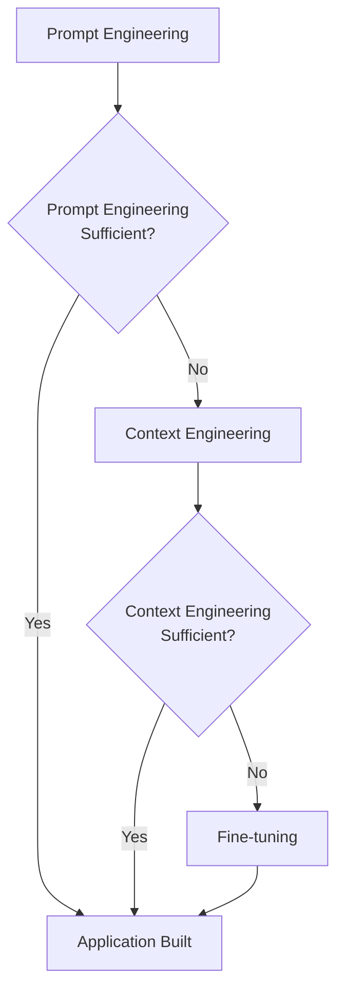
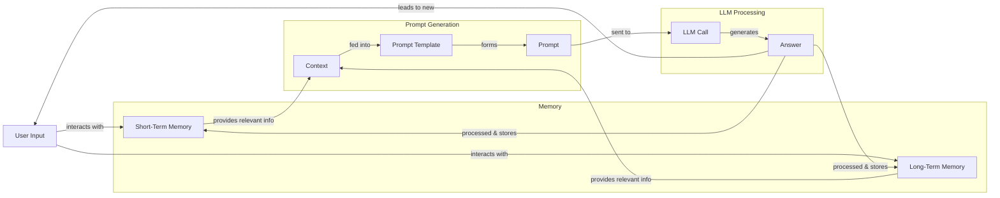
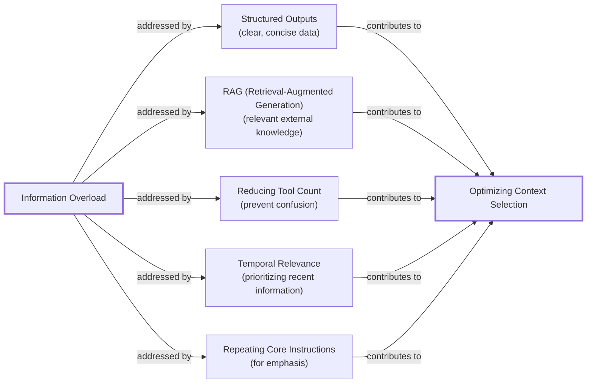
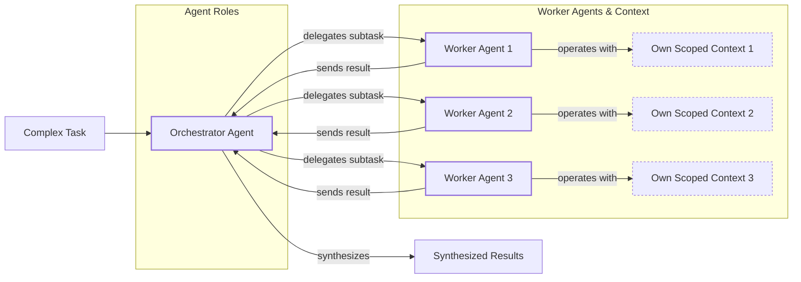

# Lesson 3: Context Engineering

AI applications have evolved rapidly. In 2022, we had simple chatbots for question-answering. By 2023, Retrieval-Augmented Generation (RAG) systems connected LLMs to domain-specific knowledge. 2024 brought us tool-using agents that could perform actions. Now, we are building memory-enabled agents that remember past interactions and build relationships over time.

In our last lesson, we explored how to choose between AI agents and LLM workflows when designing a system. As these applications grow more complex, prompt engineering, a practice that once served us well, is showing its limits. It optimizes single LLM calls but fails when managing systems with memory, actions, and long interaction histories. The sheer volume of information an agent might need—past conversations, user data, documents, and action descriptions—has grown exponentially. Simply stuffing all this into a prompt is not a viable strategy. This is where context engineering comes in. It is the discipline of orchestrating this entire information ecosystem to ensure the LLM gets exactly what it needs, when it needs it. This skill is becoming a core foundation for AI engineering.

## From Prompt to Context Engineering

Prompt engineering, while effective for simple tasks, is designed for single, stateless interactions. It treats each call to an LLM as a new, isolated event. This approach breaks down in stateful applications where context must be preserved and managed across multiple turns.

As a conversation or task progresses, the context grows. Without a strategy to manage this growth, the LLM’s performance degrades. This is context decay: the model gets confused by the noise of an ever-expanding history, leading to hallucinations and misguided answers [[1]](https://www.decodingai.com/p/context-engineering-2025s-1-skill). It starts to lose track of the original instructions or key information.

Even with large context windows, a physical limit exists for what you can include. Also, on the operational side, every token adds to the cost and latency of an LLM call [[1]](https://www.decodingai.com/p/context-engineering-2025s-1-skill). Simply putting everything into the context creates a slow, expensive, and underperforming system. We will explore these concepts in more detail in upcoming lessons, including memory and RAG.

On a recent project, we learned this the hard way. We were working with a model that supported a million-token context window, so we thought, "*What could go wrong*?" We stuffed everything in: our research, guidelines, examples, and user history. The result was an LLM workflow that took 30 minutes to run and produced low-quality outputs [[1]](https://www.decodingai.com/p/context-engineering-2025s-1-skill).

This is where context engineering becomes essential. It shifts the focus from crafting static prompts to building dynamic systems that manage information flow. As an AI engineer, your job is to select only the most critical pieces of context for each LLM call. This makes your applications accurate, fast, and cost-effective.

## Understanding Context Engineering

Context engineering is the practice of strategically filling the model’s limited context window with the right information, at the right time, and in the right format [[1]](https://www.decodingai.com/p/context-engineering-2025s-1-skill). It is an optimization problem: we retrieve the right parts from short-term and long-term memory to solve a specific task without overwhelming the model. For example, when you ask a cooking agent for a recipe, you do not give it the entire cookbook. Instead, you retrieve the specific recipe, along with personal context like allergies or taste preferences. This precise selection ensures the model receives only the essential information.

Andrej Karpathy offered a great analogy for this: LLMs are like a new kind of operating system, where the model acts as the CPU and its context window functions as the RAM [[2]](https://x.com/karpathy/status/1937902205765607626). Just as an operating system manages what fits into RAM, context engineering curates what occupies the model’s working memory.

Prompt engineering is a subset of context engineering. You still write effective prompts, but you also design a system that feeds the right context into those prompts. This means understanding not just *how* to phrase a task, but *what* information the model needs to perform optimally [[1]](https://www.decodingai.com/p/context-engineering-2025s-1-skill).

| Dimension | Prompt Engineering | Context Engineering |
| --- | --- | --- |
| Scope | Single interaction optimization | Entire information ecosystem |
| State Management | Primarily stateless | Inherently stateful, with explicit memory management |
| Focus | How to phrase tasks | What information to provide |

Table 1: A comparison of prompt engineering and context engineering.

Context engineering is the new fine-tuning. While fine-tuning has its place, it is expensive, time-consuming, and inflexible. Data changes constantly, making fine-tuning a last resort [[3]](https://www.linkedin.com/posts/denis-panjuta_prompt-engineering-vs-context-engineering-activity-7363945251180322816-1q_m). For most enterprise use cases, you get better results faster and more cheaply with context engineering. It allows for rapid iteration and adaptation to evolving data without altering the core model.

When you start a new AI project, your decision-making process for guiding the LLM should look like the one presented in Image 1. For instance, if you build an agent to process internal Slack messages, you do not need to fine-tune a model on your company’s communication style. It is more effective to use context engineering to retrieve specific messages and enable actions. Throughout this course, we will show you how to solve most industry problems using this approach.



Image 1: A simplified flowchart illustrating the decision-making workflow for building AI applications.

## What Makes Up the Context

To master context engineering, you first need to understand what "context" actually is. It is everything the LLM sees in a single turn, dynamically assembled from various memory components before being passed to the model [[4]](https://arxiv.org/pdf/2507.13334).

The high-level workflow begins when a user input triggers the system to pull relevant information from both long-term and short-term memory. This information is assembled into the final context, inserted into a prompt template, and sent to the LLM. The LLM’s answer then updates the memory, and the cycle repeats, as shown in Image 2.



Image 2: A simplified flowchart depicting the high-level workflow of an AI application.

These memory components are grouped into two main categories. We will explain them intuitively for now, as we have dedicated lessons for all of them.

**Short-term working memory** is the state of the agent for the current task. It is volatile and changes with each interaction, helping the agent maintain a coherent dialogue. It can include user input, message history, the agent's internal thoughts, and the outputs from any actions it has performed [[5]](https://www.decodingai.com/p/context-engineering-2025s-1-skill), [[6]](https://www.datacamp.com/blog/context-engineering).

**Long-term memory** is more persistent and stores information across sessions. We divide it into three types, drawing parallels from human memory. **Procedural memory** is knowledge encoded in the code, like the system prompt and available actions. **Episodic memory** stores specific past experiences, like user preferences, often in vector or graph databases for personalization. **Semantic memory** is the agent’s general knowledge base, such as company documents or data accessed via APIs [[5]](https://www.decodingai.com/p/context-engineering-2025s-1-skill).

https://substackcdn.com/image/fetch/f_auto,q_auto:good,fl_progressive:steep/https%3A%2F%2Fsubstack-post-media.s3.amazonaws.com%2Fpublic%2Fimages%2F39dce26a-e51e-4167-ac9e-ca28c45b53a6_1115x708.png
Image 3: A detailed illustration of how all the context engineering components work together inside an AI agent. (Source [Decoding AI [5]](https://www.decodingai.com/p/context-engineering-2025s-1-skill))

The key takeaway is that these components are not static. They are dynamically re-computed for every interaction. Context engineering involves knowing how to select the right pieces from this vast memory pool to construct the most effective prompt for the task at hand.

## Production Implementation Challenges

Now that we understand what makes up the context, let's look at the core challenges of implementing it in production. These all revolve around a single question: *"How can I keep my context as small as possible while providing enough information to the LLM?"*

Here are four common issues that come up when building AI applications:

**The context window challenge** is a primary concern. Every model has a finite context window, which acts like a computer's RAM. Even with massive windows, this space is a limited and expensive resource. The self-attention mechanism in LLMs imposes a quadratic computational overhead, meaning every token adds to cost and latency [[4]](https://arxiv.org/pdf/2507.13334).

This leads to **information overload**, also known as the "lost-in-the-middle" problem. Research consistently shows that as you stuff more information into the context, models lose their ability to focus on critical details, especially those placed in the middle [[7]](https://www.linkedin.com/pulse/lost-middle-lesson-failing-ai-agents-backwards-anthony-dejohn-01k2e). Performance often falls off a cliff long before the physical limit is reached.

Another subtle issue is **context drift**, where conflicting versions of the truth accumulate over time [[8]](https://galileo.ai/blog/production-llm-monitoring-strategies). For example, if memory contains both "The user's budget is $500" and later "The user's budget is $1,000," the agent can get confused. Without a mechanism to resolve or prune outdated facts, the agent’s knowledge becomes unreliable.

Finally, there is **tool confusion**. This happens when an agent is given too many tools, or when tool descriptions are poorly written or overlap. Models can get paralyzed by choice or pick the wrong tool, leading to failed tasks. The Gorilla benchmark shows that nearly all models perform worse when given more than one tool [[1]](https://www.decodingai.com/p/context-engineering-2025s-1-skill).

## Key Strategies for Context Optimization

Initially, most AI applications were simple chatbots. Today, modern AI solutions must manage multiple knowledge bases, tools, and complex conversational histories. Context engineering is about managing this complexity while meeting performance, latency, and cost requirements. Here are four popular strategies used across the industry.

### Selecting the Right Context

Retrieving the right information is your first line of defense against information overload. Instead of providing all available context, use techniques to filter and prioritize. Use structured outputs to define clear schemas for what the LLM should return, allowing you to pass only necessary data downstream. Use RAG to fetch specific text chunks instead of entire documents. For agents, reduce the number of available actions; studies show that limiting the selection to under 30 tools can triple selection accuracy [[9]](https://www.llamaindex.ai/blog/context-engineering-what-it-is-and-techniques-to-consider). Rank time-sensitive data by date, and repeat core instructions at both the start and end of the prompt to leverage the model's attention bias [[10]](https://dev.to/thousand_miles_ai/the-lost-in-the-middle-problem-why-llms-ignore-the-middle-of-your-context-window-3al2).



Image 4: A diagram illustrating strategies for selecting the right context to combat information overload.

### Context Compression

As message history grows, you must manage past interactions to keep your context window in check. You cannot simply drop past turns, as the LLM still needs to remember what happened. Instead, you need ways to compress key facts. You can do this by creating summaries of past interactions, moving user preferences to long-term memory, or using deduplication to remove redundant information [[11]](https://oneuptime.com/blog/post/2026-01-30-context-compression/view).

```mermaid
flowchart LR
    %% Problem statement
    A["Growing Message History"]

    %% Overall Goal/Process
    B["Context Compression"]

    %% Strategies
    subgraph "Context Compression Strategies"
        C["Summarization"]
        D["Moving Preferences to Long-Term Memory"]
        E["Deduplication"]
    end

    %% Examples
    subgraph "Implementation Examples"
        C1["LLM-generated summaries<br/>of older turns"]
        D1["Storing key facts<br/>in vector DBs"]
        E1["Removing redundant information"]
    end

    %% Outcome
    F["Reduced Context Size"]

    A -- "necessitates" --> B
    B -- "employs" --> C
    B -- "employs" --> D
    B -- "employs" --> E

    C -- "e.g." --> C1
    D -- "e.g." --> D1
    E -- "e.g." --> E1

    C1 --> F
    D1 --> F
    E1 --> F

    %% Visual grouping (without custom styling)
    classDef problem
    classDef process
    classDef strategy
    classDef example
    classDef outcome

    class A problem
    class B process
    class C,D,E strategy
    class C1,D1,E1 example
    class F outcome
```

Image 5: A diagram illustrating strategies for context compression.

### Isolating Context

Another powerful strategy is to isolate context by splitting a complex problem across multiple specialized agents. Instead of one agent with a massive, cluttered context window, you can have a team of agents, each with a smaller, focused one. This is often implemented using an orchestrator-worker pattern, where a central agent breaks down a problem and assigns sub-tasks to specialized workers [[12]](https://beam.ai/agentic-insights/multi-agent-orchestration-patterns-production). Each worker operates in its own isolated context, improving focus and allowing for parallel processing.



Image 6: A diagram illustrating the Orchestrator-Worker Pattern for Isolating Context.

### Format Optimization

Finally, the way you format the context matters. Models are sensitive to structure, and using clear delimiters can improve reasoning reliability. Common strategies are to use XML tags to delineate different information types and to prefer YAML over JSON when providing structured data, as it is often more token-efficient [[5]](https://www.decodingai.com/p/context-engineering-2025s-1-skill). Seeing exactly what occupies your context window at every step is key to mastering context engineering, which is why monitoring and observability are essential.

## Here Is an Example

Let's connect the theory with a concrete example. AI systems are already being applied in various domains. In healthcare, an AI assistant can access a patient's history and medical literature to suggest diagnoses. In finance, an agent might integrate with a CRM and market data to offer personalized advice. For project management, an AI can access tools like Slack and task managers to automate updates [[5]](https://www.decodingai.com/p/context-engineering-2025s-1-skill).

Let's walk through a healthcare assistant scenario. A user asks: `I have a headache. What can I do to stop it? I would prefer not to take any medicine.`

Before the LLM even sees this query, a context engineering system gets to work:
1.  It retrieves the user's patient history, allergies, and habits from **episodic memory**.
2.  It queries a medical database for non-medicinal headache remedies from **semantic memory**.
3.  It assembles this information, along with the query and conversation history, into a structured prompt.
4.  The prompt is sent to the LLM, which generates a personalized, safe, and relevant recommendation.
5.  The interaction is logged, and new preferences are saved back to memory [[5]](https://www.decodingai.com/p/context-engineering-2025s-1-skill).

Here’s a simplified example showing how these components might be assembled into a prompt, using XML tags for structure and YAML for data collections:

```
<system_prompt>
You are a helpful and cautious AI healthcare assistant. Your goal is to provide safe, non-medicinal advice. Do not provide medical diagnoses.
</system_prompt>

<patient_history>
{retrieved_patient_history_in_yaml}
</patient_history>

<medical_knowledge>
{retrieved_medical_articles_in_yaml}
</medical_knowledge>

<conversation_history>
{formatted_chat_history}
</conversation_history>

<user_query>
{user_query}
</user_query>
```

To build such a system, you would use a combination of tools. An LLM like Gemini provides the reasoning engine. A framework like LangGraph can orchestrate the workflow. Databases such as PostgreSQL, Qdrant, or Neo4j can serve as long-term memory stores. Observability platforms are essential for debugging these complex interactions.

## Connecting Context Engineering to AI Engineering

Mastering context engineering is less about learning a specific algorithm and more about building intuition. It’s the art of knowing how to structure prompts, what information to include, and how to order it for maximum impact.

This skill does not exist in a vacuum. It’s a multidisciplinary practice that sits at the intersection of several key engineering fields:
1.  **AI Engineering:** Understanding LLMs, RAG, and AI agents is the foundation.
2.  **Software Engineering:** You need to build scalable and maintainable systems to aggregate context and wrap agents in robust APIs.
3.  **Data Engineering:** Constructing reliable data pipelines for RAG and other memory systems is critical.
4.  **Operations (Ops):** Deploying agents on the right infrastructure and automating CI/CD makes them reproducible, observable, and scalable [[5]](https://www.decodingai.com/p/context-engineering-2025s-1-skill).

Our goal with this course is to teach you how to combine these skills to build production-ready AI products. We like to say that in the world of AI, we should all think in systems rather than isolated components, shifting our mindset from developers to architects.

In the next lesson, we will explore structured outputs.

## References

- [1] Iusztin, P. (2025, July 22). Context Engineering: 2025’s #1 Skill in AI. Decoding AI. [https://www.decodingai.com/p/context-engineering-2025s-1-skill](https://www.decodingai.com/p/context-engineering-2025s-1-skill)
- [2] Karpathy, A. (2025, July 2). +1 for "context engineering" over "prompt engineering". X. [https://x.com/karpathy/status/1937902205765607626](https://x.com/karpathy/status/1937902205765607626)
- [3] Panjuta, D. (2025, July 1). Prompt Engineering vs. Context Engineering. LinkedIn. [https://www.linkedin.com/posts/denis-panjuta_prompt-engineering-vs-context-engineering-activity-7363945251180322816-1q_m](https://www.linkedin.com/posts/denis-panjuta_prompt-engineering-vs-context-engineering-activity-7363945251180322816-1q_m)
- [4] Mei, L., Yao, J., Ge, Y., et al. (2025, July 17). A Survey of Context Engineering for Large Language Models. arXiv. [https://arxiv.org/pdf/2507.13334](https://arxiv.org/pdf/2507.13334)
- [5] Iusztin, P. (2025, July 22). Context Engineering: 2025’s #1 Skill in AI. Decoding AI Magazine. [https://www.decodingai.com/p/context-engineering-2025s-1-skill](https://www.decodingai.com/p/context-engineering-2025s-1-skill)
- [6] Context Engineering: A Guide With Examples. (2025). DataCamp. [https://www.datacamp.com/blog/context-engineering](https://www.datacamp.com/blog/context-engineering)
- [7] DeJohn, A. (2025, June 28). Lost in the Middle: A Lesson in Failing AI Agents (Backwards). LinkedIn. [https://www.linkedin.com/pulse/lost-middle-lesson-failing-ai-agents-backwards-anthony-dejohn-01k2e](https://www.linkedin.com/pulse/lost-middle-lesson-failing-ai-agents-backwards-anthony-dejohn-01k2e)
- [8] Bronsdon, C. (2025, July 18). Seven Strategies to Maintain LLM Reliability Across Diverse Use Cases in Production. Galileo. [https://galileo.ai/blog/production-llm-monitoring-strategies](https://galileo.ai/blog/production-llm-monitoring-strategies)
- [9] Context Engineering - What it is, and techniques to consider. (2025). LlamaIndex. [https://www.llamaindex.ai/blog/context-engineering-what-it-is-and-techniques-to-consider](https://www.llamaindex.ai/blog/context-engineering-what-it-is-and-techniques-to-consider)
- [10] The 'Lost in the Middle' Problem: Why LLMs ignore the middle of your context window. (2025). dev.to. [https://dev.to/thousand_miles_ai/the-lost-in-the-middle-problem-why-llms-ignore-the-middle-of-your-context-window-3al2](https://dev.to/thousand_miles_ai/the-lost-in-the-middle-problem-why-llms-ignore-the-middle-of-your-context-window-3al2)
- [11] Context Compression. (2026, January 30). OneUptime. [https://oneuptime.com/blog/post/2026-01-30-context-compression/view](https://oneuptime.com/blog/post/2026-01-30-context-compression/view)
- [12] Multi-Agent Orchestration Patterns for Production. (2025). beam.ai. [https://beam.ai/agentic-insights/multi-agent-orchestration-patterns-production](https://beam.ai/agentic-insights/multi-agent-orchestration-patterns-production)