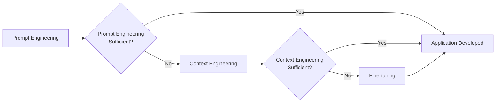
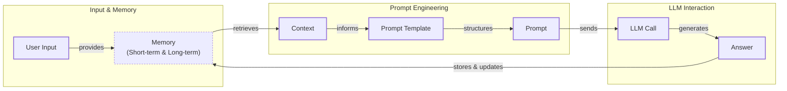
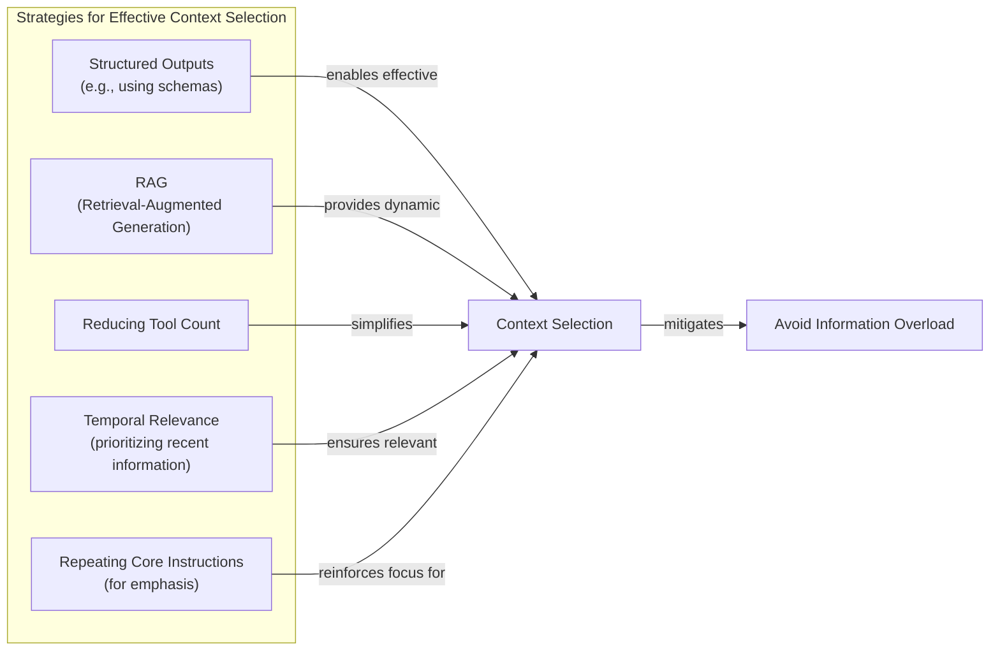
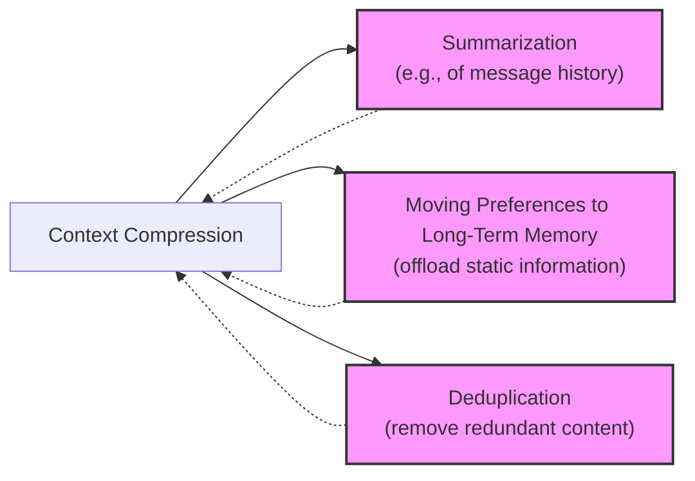
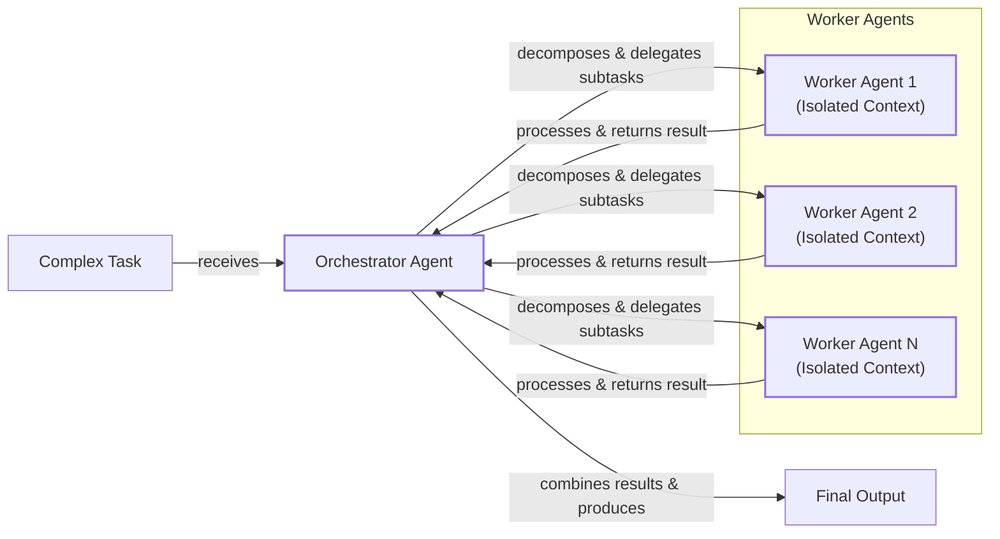

# Lesson 3: Context Engineering

AI applications have evolved rapidly from simple chatbots in 2022 to today's memory-enabled agents that perform actions and remember past interactions [[1]](https://www.securityindustry.org/2024/07/16/understanding-the-evolution-from-classic-chatbots-to-rag-chatbots-to-ai-powered-assistants/), [[2]](https://pagergpt.ai/ai-chatbot/evolution-of-ai-chatbots). In our last lesson, we explored how to choose between AI agents and LLM workflows. As these systems grow more complex, prompt engineering—which optimizes single LLM calls—is no longer enough. The volume of information an agent needs has grown exponentially, from user data to documents. Simply stuffing this into a prompt fails. Context engineering is the practice of orchestrating this entire information ecosystem to ensure the LLM gets exactly what it needs.

## From prompt to context engineering

Prompt engineering is designed for single, stateless interactions, a limitation in stateful applications where context must be managed across multiple turns. As a conversation progresses, the context grows, and performance degrades. This is context decay: the model gets confused by an expanding history. Even with large context windows, physical limits exist, and every token adds to cost and latency. We will explore these concepts, including memory and retrieval, in more detail in upcoming lessons. Simply stuffing everything into the context creates a slow, expensive system. Context engineering shifts the focus from static prompts to building dynamic systems that manage this information flow, making applications accurate and cost-effective.

## Understanding context engineering

Context engineering is the practice of finding the optimal way to arrange information from your application's memory into the context passed to an LLM. It is an optimization problem where you retrieve the right parts from memory to solve a task without overwhelming the model. For example, when you ask a cooking agent for a recipe, you do not give it the entire cookbook. You retrieve the specific recipe, along with personal context like allergies.

Andrej Karpathy compares LLMs to a new kind of operating system: the model is the CPU and its context window is the RAM [[3]](https://www.langchain.com/blog/context-engineering-for-agents/). Context engineering, then, is the practice of managing what information occupies this limited RAM for each task [[4]](https://atlan.com/know/working-memory-llms/).

Prompt engineering is a subset of context engineering. You still write effective prompts, but you also design a system that feeds the right context into those prompts. This means understanding not just *how* to phrase a task, but *what* information the model needs to perform optimally.

| Dimension | Prompt Engineering | Context Engineering |
| :--- | :--- | :--- |
| Scope | Single interaction optimization | Entire information ecosystem |
| State Management | Stateless function | Stateful due to memory |
| Focus | How to phrase tasks | What information to provide |

Table 1: A comparison of prompt engineering and context engineering.

Context engineering is the new fine-tuning. While fine-tuning has its place, it is expensive and inflexible. For most enterprise use cases, you get better results faster and more cheaply with context engineering [[5]](https://www.linkedin.com/posts/denis-panjuta_prompt-engineering-vs-context-engineering-activity-7363945251180322816-1q_m). It allows for rapid iteration without altering the core model. When you start a new AI project, your decision-making process for guiding the LLM should look like the one presented in Image 1.



Image 1: A simplified flowchart illustrating the decision-making workflow for AI application development.

For instance, to build an agent that processes internal Slack messages, you do not need to fine-tune a model on your company’s communication style. It is more effective to use a powerful reasoning model and engineer the context to retrieve specific messages and enable actions. Throughout this course, we will show you how to solve most industry problems using only context engineering.

## What makes up the context

Context is everything the LLM sees in a single turn, dynamically assembled from memory. As shown in Image 2, user input triggers the retrieval of information, which is then assembled into a prompt. The LLM's answer updates the memory, and the cycle continues. These concepts will be presented intuitively, as they will be covered in depth in future lessons.



Image 2: A simplified flowchart illustrating the high-level workflow of an AI application.

Context components are grouped into two main categories.

**Short-term working memory** is the state of the agent for the current task. It is volatile and changes with each interaction, helping the agent maintain a coherent dialogue. It can include user input, message history, the agent's internal thoughts, and the results from any action calls and outputs [[4]](https://atlan.com/know/working-memory-llms/).

**Long-term memory** is more persistent and stores information across sessions. We can think of it in three types, drawing parallels from human memory. **Procedural memory** is knowledge encoded in the code, like the system prompt and action definitions [[6]](https://www.datacamp.com/blog/how-does-llm-memory-work). **Episodic memory** stores specific past experiences, like user preferences, in databases for efficient retrieval [[7]](https://www.analyticsvidhya.com/blog/2026/01/how-does-llm-memory-work/). **Semantic memory** is the agent’s general knowledge base, such as internal documents or external information accessed via the internet [[8]](https://skymod.tech/why-memory-matters-in-llm-agents-short-term-vs-long-term-memory-architectures/).

The key takeaway is that these components are dynamically re-computed for every interaction. Context engineering involves selecting the right pieces from this memory pool. Image 3 provides a high-level overview of how these different information sources are part of the broader context engineering discipline.

Image 3: Context engineering encompasses a variety of techniques and information sources. (Source [[9]](https://github.com/humanlayer/12-factor-agents/blob/main/content/factor-03-own-your-context-window.md))

## Production implementation challenges

Now that we understand context, let's look at the core challenges in production, which all revolve around keeping the context small yet informative. Four common issues arise. First, **the context window challenge** refers to the limited input size of every model, which creates bottlenecks in long-horizon tasks. Second, **information overload** occurs when too much context reduces LLM performance, a problem known as "lost-in-the-middle" where models overlook information placed in the middle of the context. Third, **context drift** happens when conflicting information accumulates in memory over time, making responses unreliable. Finally, **tool confusion** arises when an agent has too many actions or when their descriptions are poorly written, confusing the LLM [[10]](https://tldr.takara.ai/p/2510.00615), [[11]](https://redis.io/blog/context-window-overflow/), [[12]](https://www.linkedin.com/pulse/lost-middle-lesson-failing-ai-agents-backwards-anthony-dejohn-01k2e), [[14]](https://galileo.ai/blog/production-llm-monitoring-strategies), [[15]](https://thenewstack.io/context-rot-enterprise-ai-llms/), [[16]](https://www.getmaxim.ai/articles/context-window-management-strategies-for-long-context-ai-agents-and-chatbots/), [[17]](https://atlan.com/know/llm-context-window-limitations/).

## Key strategies for context optimization

Modern AI solutions must manage complexity across multiple knowledge bases, tools, and conversational histories. Context engineering is about managing this complexity while meeting performance, latency, and cost requirements. Here are four popular strategies:

### 1. Selecting the Right Context

Retrieving the right information is a critical first step. Instead of providing everything, which can lead to the "lost-in-the-middle" problem, you should be selective. As illustrated in Image 4, this involves using structured outputs to pass only necessary data, and using Retrieval-Augmented Generation (RAG) to fetch only specific text chunks needed to answer a question. We will explore this powerful technique in a dedicated lesson. You should also reduce the number of available actions to avoid confusion. For time-sensitive data, ranking by date is effective. Finally, repeating core instructions at the start and end of the prompt leverages the model's positional bias to ensure they are not overlooked [[13]](https://dev.to/qvfagundes/positional-encodings-and-context-window-engineering-why-token-order-matters-13h), [[18]](https://promptmetheus.com/resources/llm-knowledge-base/lost-in-the-middle-effect).



Image 4: A simplified Mermaid diagram illustrating strategies for selecting the right context to avoid information overload.

### 2. Context Compression

As message history grows, you must manage past interactions to keep your context window in check. Instead of dropping past turns, you can compress key facts. As shown in Image 5, this can be done by creating summaries of past interactions, moving user preferences to long-term memory, and removing redundant information. Choosing the right compression threshold is a trade-off: being too aggressive loses information, while being too lenient reduces efficiency gains [[19]](https://oneuptime.com/blog/post/2026-01-30-context-compression/view), [[20]](https://www.dailydoseofds.com/llmops-crash-course-part-8/), [[21]](https://liner.com/review/acon-optimizing-context-compression-for-longhorizon-llm-agents).



Image 5: A simplified Mermaid diagram illustrating key strategies for context compression, including Summarization, Moving Preferences to Long-Term Memory, and Deduplication.

### 3. Isolating Context

Another powerful strategy is to isolate context by splitting information across multiple agents. Instead of one agent with a massive context, you can have a team of specialized agents, each with a smaller, focused context. We often implement this using an orchestrator-worker pattern, where a central agent assigns sub-tasks to workers, as shown in Image 6. This improves focus and allows for parallel processing. We will cover this pattern in more detail in a future lesson [[22]](https://beam.ai/agentic-insights/multi-agent-orchestration-patterns-production), [[23]](https://gurusup.com/blog/multi-agent-orchestration-guide).



Image 6: A simplified Mermaid diagram illustrating the "Orchestrator-Worker" pattern for isolating context in multi-agent systems.

### 4. Format Optimizations

Finally, the way you format the context matters. Models are sensitive to structure. Using XML tags to wrap different pieces of context helps the model distinguish between information types. When providing structured data, YAML is often more token-efficient than JSON, which helps save space. Ultimately, you must always understand what is passed to the LLM. Monitoring your traces to see what occupies the context window is key [[24]](https://www.anthropic.com/engineering/effective-context-engineering-for-ai-agents).

## Here is an example

Let's connect these ideas with concrete examples. In healthcare, an AI assistant might access a patient's medical history and the latest literature to provide diagnostic support. In financial services, AI systems can integrate with CRMs and calendars to generate tailored advice. For project management, an agent could access Slack and task managers to update project tasks automatically. A content creator's assistant might use your past work and research to help generate new ideas [[25]](https://www.decodingai.com/p/context-engineering-2025s-1-skill).

Let's walk through a query for the healthcare assistant: `I have a headache. What can I do to stop it? I would prefer not to take any medicine.`

Before answering, a context engineering system retrieves the user's patient history from episodic memory and queries a medical database for non-medicinal remedies from semantic memory. It then assembles and formats this information into a structured prompt before calling the LLM to generate a personalized answer [[25]](https://www.decodingai.com/p/context-engineering-2025s-1-skill).

Here is a simplified pseudocode snippet showing how you might structure the context using XML and YAML:

```python
# User query, patient history, and medical literature are retrieved
# and formatted before being passed to the LLM.

prompt = f"""
<system_prompt>
You are a helpful AI medical assistant. Provide safe, personalized health advice based on the provided context.
</system_prompt>

<patient_history>
{yaml.dump(patient_history)}
</patient_history>

<medical_literature>
{yaml.dump(medical_literature)}
</medical_literature>

<user_query>
{user_query}
</user_query>
"""
```

To build such a system, you need a robust tech stack. Here is a potential stack we recommend and will use throughout this course:

*   **LLM:** Gemini for its multimodal, reasoning, and cost-effective capabilities.
*   **Orchestration:** LangGraph for defining stateful, agentic workflows [[26]](https://www.scalablepath.com/machine-learning/langgraph).
*   **Databases:** PostgreSQL, MongoDB, Redis, Qdrant, and Neo4j.
*   **Observability:** Opik or LangSmith for evaluation and trace monitoring [[27]](https://www.comet.com/site/blog/context-window/).

## Connecting context engineering to AI engineering

The practical example above shows how a well-engineered context comes together. Context engineering is an art of intuition for crafting effective prompts and arranging optimal context. It is a complex field that combines AI Engineering to implement solutions, Software Engineering (SWE) to build scalable products, Data Engineering to design data pipelines, and Operations (Ops) to deploy and maintain systems. Our goal with this course is to teach you how to combine these skills for production-ready AI products, fostering a shift in mindset from developer to architect. In the next lesson, we will explore structured outputs [[28]](https://www.cio.com/article/4080592/context-engineering-improving-ai-by-moving-beyond-the-prompt.html).

## References

- [1] Understanding the Evolution: From Classic Chatbots to RAG Chatbots to AI-Powered Assistants [https://www.securityindustry.org/2024/07/16/understanding-the-evolution-from-classic-chatbots-to-rag-chatbots-to-ai-powered-assistants/](https://www.securityindustry.org/2024/07/16/understanding-the-evolution-from-classic-chatbots-to-rag-chatbots-to-ai-powered-assistants/)
- [2] Evolution of AI Chatbots [https://pagergpt.ai/ai-chatbot/evolution-of-ai-chatbots](https://pagergpt.ai/ai-chatbot/evolution-of-ai-chatbots)
- [3] Context Engineering for Agents [https://blog.langchain.com/context-engineering-for-agents/](https://blog.langchain.com/context-engineering-for-agents/)
- [4] Working Memory LLMs [https://atlan.com/know/working-memory-llms/](https://atlan.com/know/working-memory-llms/)
- [5] Prompt Engineering vs Context Engineering [https://www.linkedin.com/posts/denis-panjuta_prompt-engineering-vs-context-engineering-activity-7363945251180322816-1q_m](https://www.linkedin.com/posts/denis-panjuta_prompt-engineering-vs-context-engineering-activity-7363945251180322816-1q_m)
- [6] How Does LLM Memory Work [https://www.datacamp.com/blog/how-does-llm-memory-work](https://www.datacamp.com/blog/how-does-llm-memory-work)
- [7] How Does LLM Memory Work [https://www.analyticsvidhya.com/blog/2026/01/how-does-llm-memory-work/](https://www.analyticsvidhya.com/blog/2026/01/how-does-llm-memory-work/)
- [8] Why Memory Matters in LLM Agents [https://skymod.tech/why-memory-matters-in-llm-agents-short-term-vs-long-term-memory-architectures/](https://skymod.tech/why-memory-matters-in-llm-agents-short-term-vs-long-term-memory-architectures/)
- [9] Own your context window [https://github.com/humanlayer/12-factor-agents/blob/main/content/factor-03-own-your-context-window.md](https://github.com/humanlayer/12-factor-agents/blob/main/content/factor-03-own-your-context-window.md)
- [10] Growing context length from accumulating actions and observations raises costs... [https://tldr.takara.ai/p/2510.00615](https://tldr.takara.ai/p/2510.00615)
- [11] When the Context Window Overflows [https://redis.io/blog/context-window-overflow/](https://redis.io/blog/context-window-overflow/)
- [12] Lost in the Middle: A Lesson in Failing AI Agents Backwards [https://www.linkedin.com/pulse/lost-middle-lesson-failing-ai-agents-backwards-anthony-dejohn-01k2e](https://www.linkedin.com/pulse/lost-middle-lesson-failing-ai-agents-backwards-anthony-dejohn-01k2e)
- [13] Positional Encodings and Context Window Engineering [https://dev.to/qvfagundes/positional-encodings-and-context-window-engineering-why-token-order-matters-13h](https://dev.to/qvfagundes/positional-encodings-and-context-window-engineering-why-token-order-matters-13h)
- [14] Production LLM Monitoring Strategies [https://galileo.ai/blog/production-llm-monitoring-strategies](https://galileo.ai/blog/production-llm-monitoring-strategies)
- [15] Context Rot Is Coming for Your Enterprise AI LLMs [https://thenewstack.io/context-rot-enterprise-ai-llms/](https://thenewstack.io/context-rot-enterprise-ai-llms/)
- [16] Context Window Management Strategies for Long-Context AI Agents and Chatbots [https://www.getmaxim.ai/articles/context-window-management-strategies-for-long-context-ai-agents-and-chatbots/](https://www.getmaxim.ai/articles/context-window-management-strategies-for-long-context-ai-agents-and-chatbots/)
- [17] LLM Context Window Limitations [https://atlan.com/know/llm-context-window-limitations/](https://atlan.com/know/llm-context-window-limitations/)
- [18] Lost-in-the-Middle effect [https://promptmetheus.com/resources/llm-knowledge-base/lost-in-the-middle-effect](https://promptmetheus.com/resources/llm-knowledge-base/lost-in-the-middle-effect)
- [19] Context Compression [https://oneuptime.com/blog/post/2026-01-30-context-compression/view](https://oneuptime.com/blog/post/2026-01-30-context-compression/view)
- [20] LLMOps Crash Course Part 8 [https://www.dailydoseofds.com/llmops-crash-course-part-8/](https://www.dailydoseofds.com/llmops-crash-course-part-8/)
- [21] ACON: Optimizing Context Compression for Long-Horizon LLM Agents [https://liner.com/review/acon-optimizing-context-compression-for-longhorizon-llm-agents](https://liner.com/review/acon-optimizing-context-compression-for-longhorizon-llm-agents)
- [22] Multi-Agent Orchestration Patterns in Production [https://beam.ai/agentic-insights/multi-agent-orchestration-patterns-production](https://beam.ai/agentic-insights/multi-agent-orchestration-patterns-production)
- [23] Multi-Agent Orchestration Guide [https://gurusup.com/blog/multi-agent-orchestration-guide](https://gurusup.com/blog/multi-agent-orchestration-guide)
- [24] Effective Context Engineering for AI Agents [https://www.anthropic.com/engineering/effective-context-engineering-for-ai-agents](https://www.anthropic.com/engineering/effective-context-engineering-for-ai-agents)
- [25] Context Engineering 2025's #1 Skill [https://www.decodingai.com/p/context-engineering-2025s-1-skill](https://www.decodingai.com/p/context-engineering-2025s-1-skill)
- [26] LangGraph [https://www.scalablepath.com/machine-learning/langgraph](https://www.scalablepath.com/machine-learning/langgraph)
- [27] Context Window [https://www.comet.com/site/blog/context-window/](https://www.comet.com/site/blog/context-window/)
- [28] Context engineering: Improving AI by moving beyond the prompt [https://www.cio.com/article/4080592/context-engineering-improving-ai-by-moving-beyond-the-prompt.html](https://www.cio.com/article/4080592/context-engineering-improving-ai-by-moving-beyond-the-prompt.html)