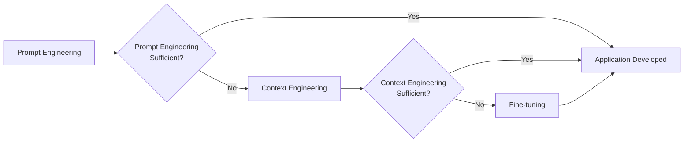
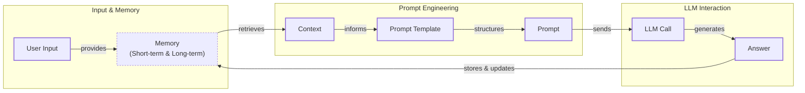
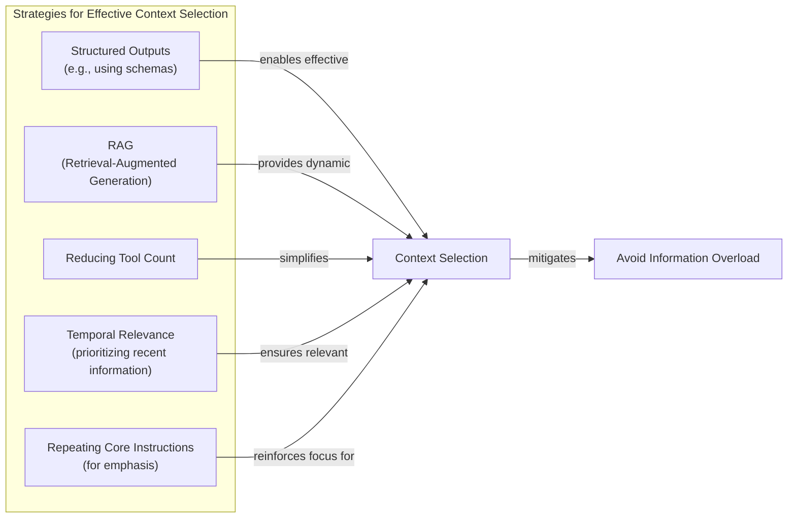
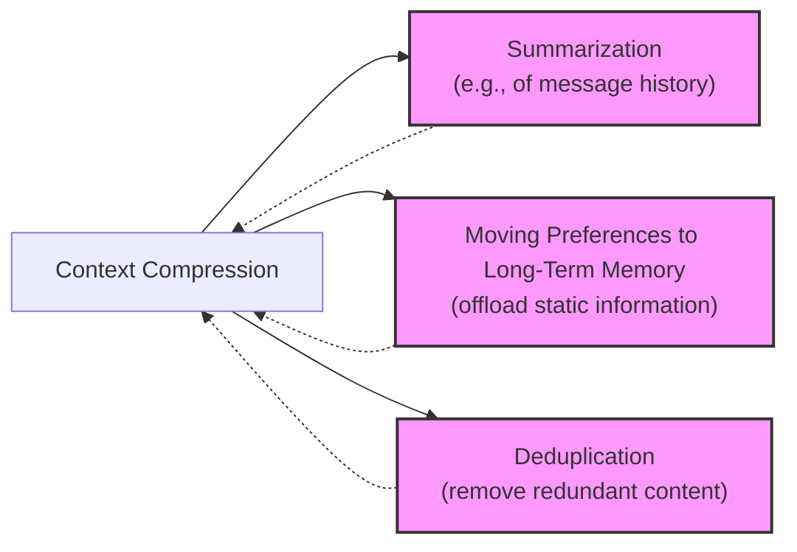
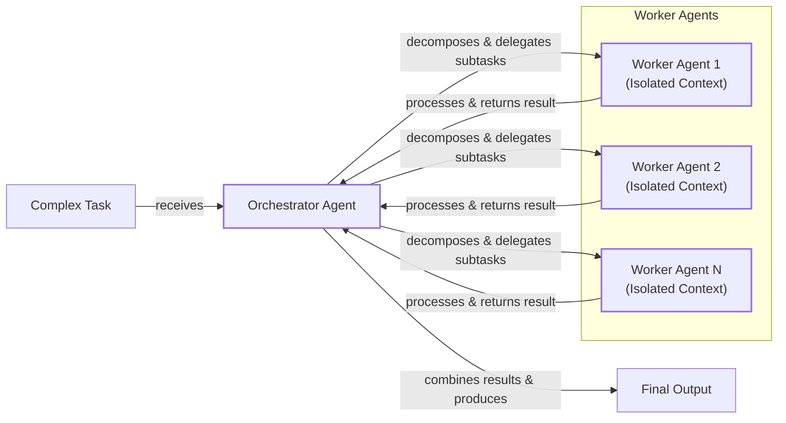

# Lesson 3: Context Engineering

AI applications have evolved rapidly. In 2022, we had simple chatbots for question-answering [[1]](https://www.securityindustry.org/2024/07/16/understanding-the-evolution-from-classic-chatbots-to-rag-chatbots-to-ai-powered-assistants/). By 2023, systems that could retrieve domain-specific knowledge appeared, followed by agents in 2024 that could perform actions [[2]](https://pagergpt.ai/ai-chatbot/evolution-of-ai-chatbots). Now, we are building memory-enabled agents that remember past interactions.

In our last lesson, we explored how to choose between AI agents and LLM workflows. As these applications grow more complex, prompt engineering is showing its limits. It optimizes single LLM calls but fails when managing systems with memory, actions, and long interaction histories. The volume of information—past conversations, user data, and documents—has grown exponentially. This is where context engineering comes in. It is the discipline of orchestrating this information ecosystem to ensure the LLM gets exactly what it needs.

## From prompt to context engineering

Prompt engineering, while effective for simple tasks, is designed for single, stateless interactions. This approach breaks down in stateful applications where context must be preserved across multiple turns. As a conversation or task progresses, the context grows. Without a strategy to manage this growth, the LLM’s performance degrades. This is context decay: the model gets confused by the noise of an ever-expanding history and loses track of key information.

Even with large context windows, there is a physical limit to what you can include. Every token also adds to the cost and latency of an LLM call. Simply putting everything into the context creates a slow, expensive, and underperforming system. We will explore these concepts in more detail in upcoming lessons, including memory and knowledge retrieval.

On a recent project, we learned this the hard way. We were working with a model that supported a million-token context window and stuffed everything in: research, guidelines, and user history. The result was an LLM workflow that took 30 minutes to run and produced low-quality outputs. Context engineering solves this by shifting focus from static prompts to dynamic systems that manage information flow, making applications accurate, fast, and cost-effective.

## Understanding context engineering

Context engineering is the practice of finding the optimal way to arrange information from your application's memory into the context passed to an LLM. It is an optimization problem where you retrieve the right parts from memory to solve a task without overwhelming the model. For example, when you ask a cooking agent for a recipe, you do not give it the entire cookbook. You retrieve the specific recipe, along with personal context like allergies.

Andrej Karpathy explains that LLMs are like a new kind of operating system where the model is the CPU and its context window is the RAM [[3]](https://www.langchain.com/blog/context-engineering-for-agents/). Just as an operating system manages what fits into your computer’s limited RAM, context engineering manages what information occupies the model’s limited context window [[4]](https://atlan.com/know/working-memory-llms/).

Prompt engineering is a subset of context engineering. You still write effective prompts, but you also design a system that feeds the right context into those prompts. This means understanding not just *how* to phrase a task, but *what* information the model needs to perform optimally.

| Dimension | Prompt Engineering | Context Engineering |
| :--- | :--- | :--- |
| Scope | Single interaction optimization | Entire information ecosystem |
| State Management | Stateless function | Stateful due to memory |
| Focus | How to phrase tasks | What information to provide |

Table 1: A comparison of prompt engineering and context engineering.

Context engineering is the new fine-tuning. While fine-tuning has its place, it is expensive, time-consuming, and inflexible. For most enterprise use cases, you get better results faster and more cheaply with context engineering [[5]](https://www.linkedin.com/posts/denis-panjuta_prompt-engineering-vs-context-engineering-activity-7363945251180322816-1q_m). It allows for rapid iteration without altering the core model. When you start a new AI project, your decision-making process for guiding the LLM should look like the one presented in Image 1.



Image 1: A simplified flowchart illustrating the decision-making workflow for AI application development.

For instance, to build an agent that processes internal Slack messages, you do not need to fine-tune a model on your company’s communication style. It is more effective to use a powerful reasoning model and engineer the context to retrieve specific messages and enable actions. Throughout this course, we will show you how to solve most industry problems using only context engineering.

## What makes up the context

Context is everything the LLM sees in a single turn, dynamically assembled from various memory components. The high-level workflow, as presented in Image 2, begins when user input triggers the system to pull relevant information from memory. This information is assembled into the final context, inserted into a prompt template, and sent to the LLM. The LLM’s answer then updates the memory, and the cycle repeats.



Image 2: A simplified flowchart illustrating the high-level workflow of an AI application.

These components are grouped into two main categories, which we will explain intuitively for now.

**Short-term working memory** is the state of the agent for the current task. It is volatile and changes with each interaction, helping the agent maintain a coherent dialogue. It can include user input, message history, the agent's internal thoughts, and the results from any actions performed [[4]](https://atlan.com/know/working-memory-llms/).

**Long-term memory** is more persistent and stores information across sessions. We divide it into three types, drawing parallels from human memory:

*   **Procedural memory:** This is knowledge encoded in the code, like the system prompt that sets the agent's behavior and the definitions of available actions [[6]](https://www.datacamp.com/blog/how-does-llm-memory-work).
*   **Episodic memory:** This is memory of specific past experiences, like user preferences, stored in databases for efficient retrieval [[7]](https://www.analyticsvidhya.com/blog/2026/01/how-does-llm-memory-work/).
*   **Semantic memory:** This is the agent’s general knowledge base, such as internal company documents or external information accessed via the internet [[8]](https://skymod.tech/why-memory-matters-in-llm-agents-short-term-vs-long-term-memory-architectures/).

We will cover these concepts in-depth in future lessons on structured outputs, actions, memory, and knowledge retrieval. The key takeaway is that these components are dynamically re-computed for every interaction, and context engineering involves selecting the right pieces from this memory pool.

Image 3: Context engineering encompasses a variety of techniques and information sources. (Source [[9]](https://github.com/humanlayer/12-factor-agents/blob/main/content/factor-03-own-your-context-window.md))

## Production implementation challenges

Now that we understand context, let's look at the core challenges in production. These revolve around keeping the context small yet informative.

Here are four common issues that come up when building AI applications:

1.  **The context window challenge:** Every AI model has a limited context window, the maximum amount of information it can process at once. This becomes a major challenge in long-horizon tasks where interaction history accumulates, increasing costs and reducing efficiency [[10]](https://tldr.takara.ai/p/2510.00615). While context windows are getting larger, they are not infinite [[11]](https://redis.io/blog/context-window-overflow/).
2.  **Information overload:** Too much context reduces LLM performance. This is known as the "lost-in-the-middle" problem, where models overlook information placed in the middle of the context [[12]](https://www.linkedin.com/pulse/lost-middle-lesson-failing-ai-agents-backwards-anthony-dejohn-01k2e). This is a direct result of positional bias in the transformer architecture, which gives less weight to content that is not near the beginning or end [[13]](https://dev.to/qvfagundes/positional-encodings-and-context-window-engineering-why-token-order-matters-13h), [[14]](https://dev.to/thousand_miles_ai/the-lost-in-the-middle-problem-why-llms-ignore-the-middle-of-your-context-window-3al2), [[15]](https://atlan.com/know/llm-context-window-limitations/).
3.  **Context drift:** This occurs when conflicting information accumulates in the memory over time, like having two contradictory statements about the same fact [[16]](https://galileo.ai/blog/production-llm-monitoring-strategies). Without a mechanism to resolve these conflicts, the model's responses become unreliable [[17]](https://thenewstack.io/context-rot-enterprise-ai-llms/).
4.  **Tool confusion:** This arises when an agent has too many actions, confusing the LLM about the best one for the job. Confusion can also occur when action descriptions are poorly written or overlap, making it difficult to choose correctly [[18]](https://www.getmaxim.ai/articles/context-window-management-strategies-for-long-context-ai-agents-and-chatbots/).

## Key strategies for context optimization

Modern AI solutions must manage complexity across multiple knowledge bases, tools, and conversational histories. Context engineering is about managing this complexity while meeting performance, latency, and cost requirements. Here are four popular strategies:

### 1. Selecting the Right Context

Retrieving the right information is a critical first step. A common mistake is to provide everything, but the "lost-in-the-middle" problem often leads to poor performance. To solve this, use structured outputs, retrieve only specific text chunks, reduce the number of available actions, rank time-sensitive data, and repeat core instructions at the start and end of the prompt to leverage the model's positional bias [[13]](https://dev.to/qvfagundes/positional-encodings-and-context-window-engineering-why-token-order-matters-13h), [[19]](https://promptmetheus.com/resources/llm-knowledge-base/lost-in-the-middle-effect).



Image 4: A simplified Mermaid diagram illustrating strategies for selecting the right context to avoid information overload.

### 2. Context Compression

As message history grows, you must manage past interactions to keep your context window in check. Instead of dropping past turns, you can compress key facts by creating summaries of past interactions, moving user preferences to long-term memory, and removing redundant information [[20]](https://oneuptime.com/blog/post/2026-01-30-context-compression/view), [[21]](https://www.dailydoseofds.com/llmops-crash-course-part-8/). Choosing the right compression threshold is a trade-off: being too aggressive loses information, while being too lenient reduces efficiency [[22]](https://liner.com/review/acon-optimizing-context-compression-for-longhorizon-llm-agents).



Image 5: A simplified Mermaid diagram illustrating key strategies for context compression, including Summarization, Moving Preferences to Long-Term Memory, and Deduplication.

### 3. Isolating Context

Another powerful strategy is to isolate context by splitting information across multiple agents. Instead of one agent with a massive context, you can have a team of specialized agents, each with a smaller, focused context. We often implement this using an orchestrator-worker pattern, where a central agent assigns sub-tasks to workers [[23]](https://beam.ai/agentic-insights/multi-agent-orchestration-patterns-production), [[24]](https://gurusup.com/blog/multi-agent-orchestration-guide). We will cover this in more detail in a future lesson.



Image 6: A simplified Mermaid diagram illustrating the "Orchestrator-Worker" pattern for isolating context in multi-agent systems.

### 4. Format Optimizations

Finally, the way you format the context matters. Models are sensitive to structure. Using XML tags to wrap different pieces of context helps the model distinguish between information types [[25]](https://www.anthropic.com/engineering/effective-context-engineering-for-ai-agents). When providing structured data, YAML is often more token-efficient than JSON, which helps save space. Ultimately, you must always understand what is passed to the LLM. Monitoring your traces to see what occupies the context window is key.

## Here is an example

Let's connect these ideas with a concrete example. Consider these common real-world scenarios:

*   **Healthcare:** An AI assistant accesses a patient's medical history, symptoms, and medical literature to provide diagnostic support [[26]](https://www.decodingai.com/p/context-engineering-2025s-1-skill).
*   **Financial Services:** AI systems integrate with CRMs and calendars, combining market data and client portfolios to generate tailored financial advice.
*   **Project Management:** AI systems access enterprise tools like Slack and task managers to automatically update project tasks.
*   **Content Creator Assistant:** An AI agent uses your research and past content to understand what and how to create a new piece of content.

Let's walk through a query for the healthcare assistant: `I have a headache. What can I do to stop it? I would prefer not to take any medicine.`

Before answering, a context engineering system retrieves the user's patient history from episodic memory and queries a medical database for non-medicinal remedies from semantic memory [[26]](https://www.decodingai.com/p/context-engineering-2025s-1-skill). It then assembles and formats this information into a structured prompt before calling the LLM to generate a personalized answer.

Here is a simplified pseudocode snippet showing how you might structure the context using XML and YAML:

```python
# User query, patient history, and medical literature are retrieved
# and formatted before being passed to the LLM.

prompt = f"""
<system_prompt>
You are a helpful AI medical assistant. Provide safe, personalized health advice based on the provided context.
</system_prompt>

<patient_history>
{yaml.dump(patient_history)}
</patient_history>

<medical_literature>
{yaml.dump(medical_literature)}
</medical_literature>

<user_query>
{user_query}
</user_query>
"""
```

To build such a system, you need a robust tech stack. Here is a potential stack we recommend and will use throughout this course:

*   **LLM:** Gemini for its multimodal, reasoning, and cost-effective capabilities.
*   **Orchestration:** LangGraph for defining stateful, agentic workflows [[27]](https://www.scalablepath.com/machine-learning/langgraph).
*   **Databases:** PostgreSQL, MongoDB, Redis, Qdrant, and Neo4j.
*   **Observability:** Opik or LangSmith for evaluation and trace monitoring [[28]](https://www.comet.com/site/blog/context-window/).

## Connecting context engineering to AI engineering

Context engineering is more of an art than a science. It is about developing the intuition to craft effective prompts, select the right information from memory, and arrange context for optimal results. This discipline is becoming a foundational part of enterprise AI, helping determine the minimal information an LLM needs to perform at its best [[29]](https://www.cio.com/article/4080592/context-engineering-improving-ai-by-moving-beyond-the-prompt.html).

It is important to understand that context engineering cannot be learned in isolation. It is a complex field that combines:

1.  **AI Engineering:** Implement practical solutions such as LLM workflows and AI Agents.
2.  **Software Engineering (SWE):** Build scalable and maintainable AI products.
3.  **Data Engineering:** Design data pipelines that feed curated data into the memory layer.
4.  **Operations (Ops):** Deploy agents on proper infrastructure to ensure they are reproducible and observable.

Our goal with this course is to teach you how to combine these skills to build production-ready AI products. In the world of AI, we should all think in systems rather than isolated components.

In the next lesson, we will explore structured outputs.

## References

- [1] Security Industry Association. (2024, July 16). Understanding the Evolution: From Classic Chatbots to RAG Chatbots to AI-Powered Assistants. [https://www.securityindustry.org/2024/07/16/understanding-the-evolution-from-classic-chatbots-to-rag-chatbots-to-ai-powered-assistants/](https://www.securityindustry.org/2024/07/16/understanding-the-evolution-from-classic-chatbots-to-rag-chatbots-to-ai-powered-assistants/)
- [2] PagerGPT. (n.d.). Evolution of AI Chatbots. [https://pagergpt.ai/ai-chatbot/evolution-of-ai-chatbots](https://pagergpt.ai/ai-chatbot/evolution-of-ai-chatbots)
- [3] LangChain Blog. (2025, July 2). Context Engineering for Agents. [https://blog.langchain.com/context-engineering-for-agents/](https://blog.langchain.com/context-engineering-for-agents/)
- [4] Atlan. (n.d.). Working Memory LLMs. [https://atlan.com/know/working-memory-llms/](https://atlan.com/know/working-memory-llms/)
- [5] LinkedIn. (n.d.). Prompt Engineering vs Context Engineering. [https://www.linkedin.com/posts/denis-panjuta_prompt-engineering-vs-context-engineering-activity-7363945251180322816-1q_m](https://www.linkedin.com/posts/denis-panjuta_prompt-engineering-vs-context-engineering-activity-7363945251180322816-1q_m)
- [6] DataCamp. (n.d.). How Does LLM Memory Work. [https://www.datacamp.com/blog/how-does-llm-memory-work](https://www.datacamp.com/blog/how-does-llm-memory-work)
- [7] Analytics Vidhya. (2026, January). How Does LLM Memory Work. [https://www.analyticsvidhya.com/blog/2026/01/how-does-llm-memory-work/](https://www.analyticsvidhya.com/blog/2026/01/how-does-llm-memory-work/)
- [8] Skymod. (n.d.). Why Memory Matters in LLM Agents: Short-Term vs. Long-Term Memory Architectures. [https://skymod.tech/why-memory-matters-in-llm-agents-short-term-vs-long-term-memory-architectures/](https://skymod.tech/why-memory-matters-in-llm-agents-short-term-vs-long-term-memory-architectures/)
- [9] Horthy, D. (n.d.). GitHub - humanlayer/12-factor-agents: Own your context window. [https://github.com/humanlayer/12-factor-agents/blob/main/content/factor-03-own-your-context-window.md](https://github.com/humanlayer/12-factor-agents/blob/main/content/factor-03-own-your-context-window.md)
- [10] TLDR. (n.d.). Growing context length from accumulating actions and observations raises costs... [https://tldr.takara.ai/p/2510.00615](https://tldr.takara.ai/p/2510.00615)
- [11] Redis. (n.d.). When the Context Window Overflows. [https://redis.io/blog/context-window-overflow/](https://redis.io/blog/context-window-overflow/)
- [12] LinkedIn. (n.d.). Lost in the Middle: A Lesson in Failing AI Agents Backwards. [https://www.linkedin.com/pulse/lost-middle-lesson-failing-ai-agents-backwards-anthony-dejohn-01k2e](https://www.linkedin.com/pulse/lost-middle-lesson-failing-ai-agents-backwards-anthony-dejohn-01k2e)
- [13] Dev.to. (n.d.). Positional Encodings and Context Window Engineering: Why Token Order Matters. [https://dev.to/qvfagundes/positional-encodings-and-context-window-engineering-why-token-order-matters-13h](https://dev.to/qvfagundes/positional-encodings-and-context-window-engineering-why-token-order-matters-13h)
- [14] Dev.to. (n.d.). The Lost in the Middle Problem: Why LLMs Ignore the Middle of Your Context Window. [https://dev.to/thousand_miles_ai/the-lost-in-the-middle-problem-why-llms-ignore-the-middle-of-your-context-window-3al2](https://dev.to/thousand_miles_ai/the-lost-in-the-middle-problem-why-llms-ignore-the-middle-of-your-context-window-3al2)
- [15] Atlan. (n.d.). LLM Context Window Limitations. [https://atlan.com/know/llm-context-window-limitations/](https://atlan.com/know/llm-context-window-limitations/)
- [16] Galileo. (n.d.). Production LLM Monitoring Strategies to Catch Failures Before They Happen. [https://galileo.ai/blog/production-llm-monitoring-strategies](https://galileo.ai/blog/production-llm-monitoring-strategies)
- [17] The New Stack. (n.d.). Context Rot Is Coming for Your Enterprise AI LLMs. [https://thenewstack.io/context-rot-enterprise-ai-llms/](https://thenewstack.io/context-rot-enterprise-ai-llms/)
- [18] Maxim. (n.d.). Context Window Management Strategies for Long-Context AI Agents and Chatbots. [https://www.getmaxim.ai/articles/context-window-management-strategies-for-long-context-ai-agents-and-chatbots/](https://www.getmaxim.ai/articles/context-window-management-strategies-for-long-context-ai-agents-and-chatbots/)
- [19] Promptmetheus. (n.d.). Lost-in-the-Middle effect. [https://promptmetheus.com/resources/llm-knowledge-base/lost-in-the-middle-effect](https://promptmetheus.com/resources/llm-knowledge-base/lost-in-the-middle-effect)
- [20] OneUptime. (2026, January 30). Context Compression. [https://oneuptime.com/blog/post/2026-01-30-context-compression/view](https://oneuptime.com/blog/post/2026-01-30-context-compression/view)
- [21] Daily Dose of DS. (n.d.). LLMOps Crash Course Part 8. [https://www.dailydoseofds.com/llmops-crash-course-part-8/](https://www.dailydoseofds.com/llmops-crash-course-part-8/)
- [22] Liner. (n.d.). ACON: Optimizing Context Compression for Long-Horizon LLM Agents. [https://liner.com/review/acon-optimizing-context-compression-for-longhorizon-llm-agents](https://liner.com/review/acon-optimizing-context-compression-for-longhorizon-llm-agents)
- [23] Beam AI. (n.d.). Multi-Agent Orchestration Patterns in Production. [https://beam.ai/agentic-insights/multi-agent-orchestration-patterns-production](https://beam.ai/agentic-insights/multi-agent-orchestration-patterns-production)
- [24] GuruSup. (n.d.). Multi-Agent Orchestration Guide. [https://gurusup.com/blog/multi-agent-orchestration-guide](https://gurusup.com/blog/multi-agent-orchestration-guide)
- [25] Anthropic. (n.d.). Effective Context Engineering for AI Agents. [https://www.anthropic.com/engineering/effective-context-engineering-for-ai-agents](https://www.anthropic.com/engineering/effective-context-engineering-for-ai-agents)
- [26] Decoding AI. (n.d.). Context Engineering 2025's #1 Skill. [https://www.decodingai.com/p/context-engineering-2025s-1-skill](https://www.decodingai.com/p/context-engineering-2025s-1-skill)
- [27] Scalable Path. (n.d.). LangGraph. [https://www.scalablepath.com/machine-learning/langgraph](https://www.scalablepath.com/machine-learning/langgraph)
- [28] Comet. (n.d.). Context Window. [https://www.comet.com/site/blog/context-window/](https://www.comet.com/site/blog/context-window/)
- [29] CIO. (n.d.). Context engineering: Improving AI by moving beyond the prompt. [https://www.cio.com/article/4080592/context-engineering-improving-ai-by-moving-beyond-the-prompt.html](https://www.cio.com/article/4080592/context-engineering-improving-ai-by-moving-beyond-the-prompt.html)