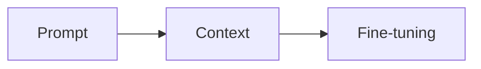
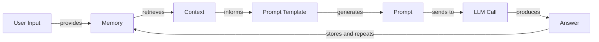
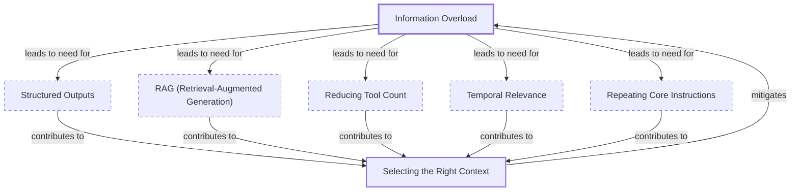
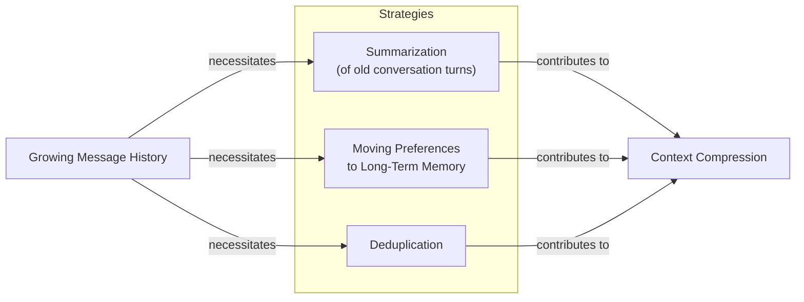
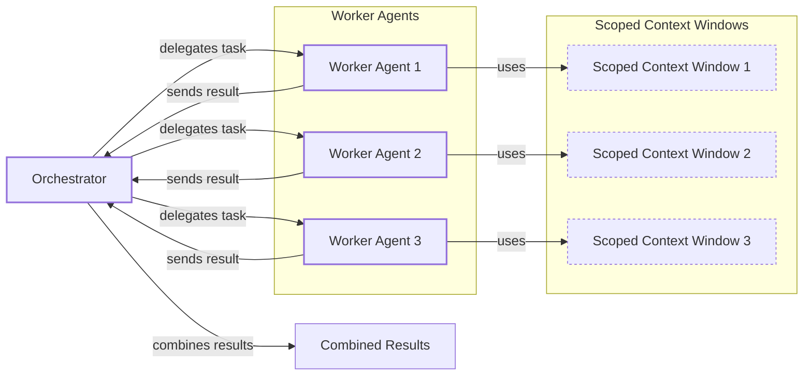

# Lesson 3: Context Engineering

## When prompt engineering breaks

AI applications have evolved rapidly from simple chatbots in 2022 to information-retrieving systems in 2023 and action-performing agents in 2024 [[1]](https://www.securityindustry.org/2024/07/16/understanding-the-evolution-from-classic-chatbots-to-rag-chatbots-to-ai-powered-assistants/), [[2]](https://pagergpt.ai/ai-chatbot/evolution-of-ai-chatbots). Now, we build memory-enabled agents that remember past interactions. In our last lesson, we explored choosing between AI agents and LLM workflows. As these systems grow more complex, prompt engineering, which optimizes single LLM calls, is no longer enough. The sheer volume of information an agent needs has grown exponentially. Orchestrating this information ecosystem, or context engineering, is now a core skill for building reliable AI.

## From prompt to context engineering

Prompt engineering is designed for single, stateless interactions. This approach fails in stateful applications where context must be preserved across multiple turns. As a conversation progresses, the context grows, and without management, performance degrades. This is context decay: the model gets confused by the noise of an expanding history [[3]](https://www.decodingai.com/p/context-engineering-2025s-1-skill).

Even with large context windows, every token adds to cost and latency [[4]](https://blog.langchain.com/context-engineering-for-agents/). We will explore these concepts in more detail in upcoming lessons. We once built a workflow where we stuffed everything into the context, resulting in a 30-minute run time. It was unusable. Context engineering shifts the focus to dynamic systems that manage information flow, making applications accurate, fast, and cost-effective.

## Understanding context engineering

Context engineering is the optimization problem of finding the ideal way to assemble a context that maximizes an LLM's output quality for a given task [[5]](https://arxiv.org/pdf/2507.13334). You retrieve the right parts from memory to solve a task without overwhelming the model. For example, a cooking agent retrieves a specific recipe and your allergies, not the entire cookbook.

Andrej Karpathy offered a great analogy: LLMs are like a new operating system, where the model is the CPU and its context window is the RAM [[4]](https://blog.langchain.com/context-engineering-for-agents/). Context engineering curates what occupies this working memory [[6]](https://x.com/karpathy/status/1937902205765607626).

Prompt engineering is a subset of this discipline. You still write good prompts, but you also design a system that feeds the right context into them [[3]](https://www.decodingai.com/p/context-engineering-2025s-1-skill).

| Dimension | Prompt Engineering | Context Engineering |
| --- | --- | --- |
| Scope | Single interaction optimization | Entire information ecosystem |
| Complexity | Manual string manipulation | System-level, multi-component optimization |
| State Management | Primarily stateless | Inherently stateful, with explicit memory management |
| Focus | How to phrase tasks | What information to provide |

Table 1: A comparison of prompt engineering and context engineering.

Context engineering is also the new fine-tuning. Fine-tuning is expensive, slow, and inflexible, making it a last resort [[7]](https://www.linkedin.com/posts/denis-panjuta_prompt-engineering-vs-context-engineering-activity-7363945251180322816-1q_m). For most use cases, context engineering delivers better results more cheaply. Your decision-making process should follow the workflow in Image 1.


Image 1: A flowchart illustrating the decision-making workflow for AI application development.

For example, to process Slack messages, you don't need to fine-tune a model. It's more effective to engineer the context to retrieve messages and enable actions. This course will focus on solving problems using context engineering.

## What makes up the context

To master context engineering, you must understand what "context" is: everything the LLM sees in a single turn, dynamically assembled from various memory components [[8]](https://github.com/humanlayer/12-factor-agents/blob/main/content/factor-03-own-your-context-window.md).
Image 2: Context engineering encompasses a variety of techniques and information sources. (Source [humanlayer/12-factor-agents [8]](https://github.com/humanlayer/12-factor-agents/blob/main/content/factor-03-own-your-context-window.md))

The workflow begins when user input triggers the system to pull information from memory. This is assembled into the final context, placed in a prompt template, and sent to the LLM. The model's answer then updates the memory, and the cycle repeats.


Image 3: A flowchart depicting the high-level workflow of an LLM application.

We will explain these components intuitively, as future lessons will cover them in depth. Context is grouped into two main categories.

**Short-term working memory** is the agent's state for the current task, including user input, message history, internal thoughts, and action outputs [[9]](https://www.dailydoseofds.com/llmops-crash-course-part-8/).

**Long-term memory** is more persistent. It includes **procedural memory** (the system prompt and action definitions), **episodic memory** (past user preferences), and **semantic memory** (a general knowledge base) [[10]](https://www.datacamp.com/blog/how-does-llm-memory-work), [[11]](https://www.analyticsvidhya.com/blog/2026/01/how-does-llm-memory-work/), [[12]](https://skymod.tech/why-memory-matters-in-llm-agents-short-term-vs-long-term-memory-architectures/).

These components are not static; they are re-computed for every interaction. Context engineering is about selecting the right pieces from this memory pool to build the most effective prompt.

## Production implementation challenges

Implementing context engineering in production presents several challenges, all centered on keeping the context small yet informative.

**The context window challenge** refers to the limited input size of LLMs. A model's effective context window (MECW), where accuracy holds up, is often far smaller than its advertised maximum (MCW). Every token adds to cost and latency [[13]](https://arxiv.org/pdf/2509.21361), [[3]](https://www.decodingai.com/p/context-engineering-2025s-1-skill).

**Information overload**, or the "lost-in-the-middle" problem, occurs when too much context confuses the model, which tends to ignore information in the middle of a prompt [[14]](https://dev.to/thousand_miles_ai/the-lost-in-the-middle-problem-why-llms-ignore-the-middle-of-your-context-window-3al2).

**Context drift** happens when conflicting or irrelevant information accumulates over time, polluting the context and confusing the agent [[15]](https://centricconsulting.com/blog/building-with-production-ready-ai-agent-systems-the-hidden-constraints_ai/), [[16]](https://galileo.ai/blog/production-llm-monitoring-strategies).

**Action confusion** arises when an agent has too many actions or poorly written descriptions. Similarly, adding too many rules leads to **rule saturation**, where the model is less likely to follow any individual rule [[15]](https://centricconsulting.com/blog/building-with-production-ready-ai-agent-systems-the-hidden-constraints_ai/), [[17]](https://www.datacamp.com/blog/context-engineering).

## Key strategies for context optimization

Modern AI solutions manage multiple knowledge bases and complex histories. Here are four strategies to handle this complexity.

### Selecting the right context

Retrieving the right information is your first line of defense. Instead of providing everything, use "just in time" retrieval to fetch only what is needed for the current step [[18]](https://www.anthropic.com/engineering/effective-context-engineering-for-ai-agents). This involves using structured outputs, which we will cover in Lesson 4, and retrieval systems, which we will explore in Lesson 10. Other techniques include reducing the number of available actions, ranking time-sensitive data, and repeating core instructions at the start and end of the prompt [[19]](https://promptmetheus.com/resources/llm-knowledge-base/lost-in-the-middle-effect).


Image 4: Diagram illustrating strategies for selecting the right context for LLMs to mitigate information overload.

### Context compression

To manage growing message history, you must compress past interactions. While LLM-based summarization is an option, it can be costly. Simpler methods like moving user preferences to long-term memory or using deduplication are often more efficient [[20]](https://blog.jetbrains.com/research/2025/12/efficient-context-management/), [[21]](https://oneuptime.com/blog/post/2026-01-30-context-compression/view). We will discuss memory in detail in Lesson 9.


Image 5: A diagram illustrating context compression strategies to manage growing message history.

### Isolating Context

Isolating context involves splitting a problem across multiple specialized agents. This is often done with an orchestrator-worker pattern, which we will cover in Lesson 5. A central agent delegates tasks, and each worker maintains its own focused context. This is more reliable than parallel multi-agent systems that can produce inconsistent results [[22]](https://gurusup.com/blog/multi-agent-orchestration-guide), [[23]](https://cognition.ai/blog/dont-build-multi-agents).


Image 6: A diagram illustrating the Orchestrator-Worker pattern for isolating context.

### Format Optimization

The format of your context matters. Using clear structures like XML tags helps the model distinguish between information types. For structured data, YAML is often more token-efficient than JSON. Understanding what occupies your context window at every step is key to this process [[24]](https://www.anthropic.com/engineering/effective-context-engineering-for-ai-agents), [[3]](https://www.decodingai.com/p/context-engineering-2025s-1-skill).

## Here is an example

Let's connect theory with a concrete example. In healthcare, an AI assistant can access a patient's history, symptoms, and medical literature to suggest personalized diagnoses. In finance, an agent might integrate with a company's CRM system and financial data to make decisions. For project management, an AI can access enterprise infrastructure like Slack and task managers to update projects automatically [[25]](https://www.decodingai.com/p/context-engineering-2025s-1-skill), [[26]](https://sombrainc.com/blog/ai-context-engineering-guide).

Let's walk through a healthcare query: `I have a headache. What can I do to stop it? I would prefer not to take any medicine.`

Before the LLM even sees this, a context engineering system gets to work:
1.  It retrieves the user's patient history from episodic memory.
2.  It queries a semantic memory of medical literature for non-medicinal remedies.
3.  It assembles this information into a structured prompt.
4.  It sends the prompt to the LLM, which generates a personalized, safe recommendation.

Here’s a simplified pseudocode snippet showing how these components might be assembled into a prompt. Notice the clear structure and ordering using XML tags and YAML for data.

```
SYSTEM_PROMPT = """
You are a helpful AI healthcare assistant.
<INSTRUCTIONS>
1. Analyze the user's query and the provided context.
2. Use the patient history to understand their health profile.
3. Use the retrieved medical knowledge to form your recommendation.
</INSTRUCTIONS>
<PATIENT_HISTORY>
{retrieved_patient_history_in_yaml}
</PATIENT_HISTORY>
<MEDICAL_KNOWLEDGE>
{retrieved_medical_articles_in_yaml}
</MEDICAL_KNOWLEDGE>
<USER_QUERY>
{user_query}
</USER_QUERY>
"""
```

To build such a system, you would use a combination of tools. An LLM like Gemini provides the reasoning engine. A framework like LangGraph can orchestrate the workflow. Databases such as PostgreSQL, Qdrant, or Neo4j can serve as long-term memory stores. Observability platforms like LangSmith are essential for debugging [[27]](https://atlan.com/know/context-engineering-platforms-comparison/).

## Conclusion - Wrap-up: Connecting context engineering to AI engineering

Context engineering is about building the intuition to structure prompts and select the right information for maximum impact. This skill is a multidisciplinary practice that combines AI Engineering, Software Engineering, Data Engineering, and Operations.

Our goal is to teach you how to integrate these skills to build production-ready AI products. By thinking in systems rather than isolated components, you will learn to architect robust AI applications. In the next lesson, we will explore structured outputs, a key technique for controlling what information you get *out* of an LLM.

## References

- [1] [Understanding the Evolution from Classic Chatbots to RAG Chatbots to AI-Powered Assistants](https://www.securityindustry.org/2024/07/16/understanding-the-evolution-from-classic-chatbots-to-rag-chatbots-to-ai-powered-assistants/)
- [2] [The Evolution of AI Chatbots](https://pagergpt.ai/ai-chatbot/evolution-of-ai-chatbots)
- [3] [Context Engineering: 2025’s #1 Skill in AI](https://www.decodingai.com/p/context-engineering-2025s-1-skill)
- [4] [Context Engineering for Agents](https://blog.langchain.com/context-engineering-for-agents/)
- [5] [A Survey of Context Engineering for Large Language Models](https://arxiv.org/pdf/2507.13334)
- [6] [+1 for "context engineering" over "prompt engineering"](https://x.com/karpathy/status/1937902205765607626)
- [7] [Prompt Engineering vs. Context Engineering](https://www.linkedin.com/posts/denis-panjuta_prompt-engineering-vs-context-engineering-activity-7363945251180322816-1q_m)
- [8] [Own your context window](https://github.com/humanlayer/12-factor-agents/blob/main/content/factor-03-own-your-context-window.md)
- [9] [LLMOps Crash Course Part 8](https://www.dailydoseofds.com/llmops-crash-course-part-8/)
- [10] [How Does LLM Memory Work?](https://www.datacamp.com/blog/how-does-llm-memory-work)
- [11] [How Does LLM Memory Work?](https://www.analyticsvidhya.com/blog/2026/01/how-does-llm-memory-work/)
- [12] [Why Memory Matters in LLM Agents](https://skymod.tech/why-memory-matters-in-llm-agents-short-term-vs-long-term-memory-architectures/)
- [13] [Understanding the Discrepancy Between Maximum and Effective Context Window in LLMs](https://arxiv.org/pdf/2509.21361)
- [14] [The 'Lost in the Middle' Problem](https://dev.to/thousand_miles_ai/the-lost-in-the-middle-problem-why-llms-ignore-the-middle-of-your-context-window-3al2)
- [15] [Building with Production-Ready AI Agent Systems: The Hidden Constraints](https://centricconsulting.com/blog/building-with-production-ready-ai-agent-systems-the-hidden-constraints_ai/)
- [16] [Production LLM Monitoring Strategies](https://galileo.ai/blog/production-llm-monitoring-strategies)
- [17] [Context Engineering: A Guide With Examples](https://www.datacamp.com/blog/context-engineering)
- [18] [Effective Context Engineering for AI Agents](https://www.anthropic.com/engineering/effective-context-engineering-for-ai-agents)
- [19] [Lost-in-the-Middle Effect](https://promptmetheus.com/resources/llm-knowledge-base/lost-in-the-middle-effect)
- [20] [Efficient Context Management for LLM Agents](https://blog.jetbrains.com/research/2025/12/efficient-context-management/)
- [21] [How to Build Context Compression](https://oneuptime.com/blog/post/2026-01-30-context-compression/view)
- [22] [Multi-Agent Orchestration Guide](https://gurusup.com/blog/multi-agent-orchestration-guide)
- [23] [Don’t Build Multi-Agents](https://cognition.ai/blog/dont-build-multi-agents)
- [24] [Effective Context Engineering for AI Agents](https://www.anthropic.com/engineering/effective-context-engineering-for-ai-agents)
- [25] [Context Engineering: 2025’s #1 Skill](https://www.decodingai.com/p/context-engineering-2025s-1-skill)
- [26] [A Guide to AI Context Engineering](https://sombrainc.com/blog/ai-context-engineering-guide)
- [27] [Context Engineering Platforms Comparison](https://atlan.com/know/context-engineering-platforms-comparison/)