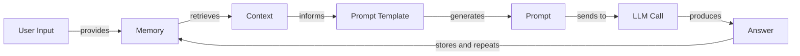
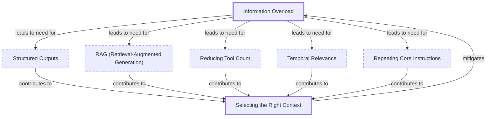
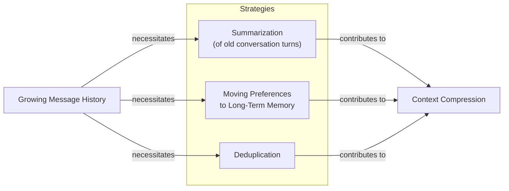
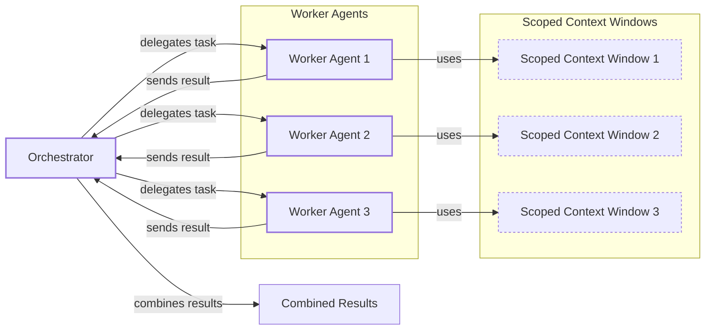

# Lesson 3: Context Engineering

AI applications have evolved rapidly. In 2022, we had simple chatbots for question-answering. By 2023, Retrieval-Augmented Generation (RAG) systems connected LLMs to domain-specific knowledge [[1]](https://www.securityindustry.org/2024/07/16/understanding-the-evolution-from-classic-chatbots-to-rag-chatbots-to-ai-powered-assistants/). 2024 brought us tool-using agents that could perform actions [[2]](https://pagergpt.ai/ai-chatbot/evolution-of-ai-chatbots). Now, we are building memory-enabled agents that remember past interactions and build relationships over time.

In our last lesson, we explored how to choose between AI agents and LLM workflows. As these applications grow more complex, prompt engineering is showing its limits. It optimizes single LLM calls but fails when managing systems with memory, actions, and long interaction histories. The volume of information an agent might need has grown exponentially. Simply stuffing all this into a prompt is not a viable strategy. This is where context engineering comes in. It is the discipline of orchestrating this entire information ecosystem to ensure the LLM gets exactly what it needs, when it needs it.

## From prompt to context engineering

Prompt engineering, while effective for simple tasks, is designed for single, stateless interactions. It treats each call to an LLM as a new, isolated event. This approach breaks down in stateful applications where context must be preserved and managed across multiple turns.

As a conversation or task progresses, the context grows. Without a strategy to manage this growth, the LLM’s performance degrades. This is context decay: the model gets confused by the noise of an ever-expanding history and starts to lose track of key information [[3]](https://www.decodingai.com/p/context-engineering-2025s-1-skill).

Even with large context windows, a physical limit exists for what you can include. Operationally, every token adds to the cost and latency of an LLM call [[4]](https://blog.langchain.com/context-engineering-for-agents/). I once built a workflow where I stuffed everything into the context: research, guidelines, examples, and reviews. The result? A 30-minute run time. It was unusable. This is where context engineering becomes essential. It shifts the focus from crafting static prompts to building dynamic systems that manage information flow, making your applications accurate, fast, and cost-effective [[3]](https://www.decodingai.com/p/context-engineering-2025s-1-skill).

## Understanding context engineering

Context engineering is the optimization problem of finding the ideal way to assemble a context that maximizes the quality of an LLM's output for a given task [[5]](https://arxiv.org/pdf/2507.13334). To put it simply, you retrieve the right parts from your short-term and long-term memory to solve a task without overwhelming the model. For example, when you ask a cooking agent for a recipe, you do not give it the entire cookbook. Instead, you retrieve the specific recipe, along with personal context like allergies or taste preferences.

Andrej Karpathy offered a great analogy: LLMs are like a new kind of operating system, where the model is the CPU and its context window is the RAM [[4]](https://blog.langchain.com/context-engineering-for-agents/). Just as an operating system manages what fits into RAM, context engineering curates what occupies the model’s working memory [[6]](https://x.com/karpathy/status/1937902205765607626).

Prompt engineering is a subset of context engineering. You still write effective prompts, but you also design a system that feeds the right context into them. This means understanding not just *how* to phrase a task, but *what* information the model needs to perform optimally [[3]](https://www.decodingai.com/p/context-engineering-2025s-1-skill).

| Dimension | Prompt Engineering | Context Engineering |
| --- | --- | --- |
| Scope | Single interaction optimization | Entire information ecosystem |
| Complexity | Manual string manipulation | System-level, multi-component optimization |
| State Management | Primarily stateless | Inherently stateful, with explicit memory management |
| Focus | How to phrase tasks | What information to provide |

Table 1: A comparison of prompt engineering and context engineering.

Context engineering is the new fine-tuning. While fine-tuning has its place, it is expensive, time-consuming, and inflexible [[7]](https://www.linkedin.com/posts/denis-panjuta_prompt-engineering-vs-context-engineering-activity-7363945251180322816-1q_m). For most enterprise use cases, you get better results faster and more cheaply with context engineering. When you start a new AI project, your decision-making process for guiding the LLM should look like the one presented in Image 1.


Image 1: A flowchart illustrating the decision-making workflow for AI application development.

For instance, if you build an agent to process internal Slack messages, you do not need to fine-tune a model on your company’s communication style. It is more effective to use a powerful reasoning model and engineer the context to retrieve specific messages and enable actions. Throughout this course, we will show you how to solve most industry problems using only context engineering.

## What makes up the context

To master context engineering, you first need to understand what "context" is. It is everything the LLM sees in a single turn, dynamically assembled from various memory components before being passed to the model [[8]](https://github.com/humanlayer/12-factor-agents/blob/main/content/factor-03-own-your-context-window.md).

https://github.com/user-attachments/assets/0f1f193f-8e94-4044-a276-576bd7764fd0
Image 2: Context engineering encompasses a variety of techniques and information sources. (Source [humanlayer/12-factor-agents [8]](https://github.com/humanlayer/12-factor-agents/blob/main/content/factor-03-own-your-context-window.md))

The high-level workflow begins when user input triggers the system to pull relevant information from memory. This information is assembled into the final context, inserted into a prompt template, and sent to the LLM. The LLM’s answer then updates the memory, and the cycle repeats.


Image 3: A flowchart depicting the high-level workflow of an LLM application.

These components are grouped into two main categories. We will explain them intuitively for now, as we have future dedicated lessons for all of them.

### Short-Term Working Memory

Short-term working memory is the state of the agent for the current task or conversation. It is volatile and changes with each interaction [[9]](https://www.dailydoseofds.com/llmops-crash-course-part-8/). It can include:

- **User input:** The most recent query from the user.
- **Message history:** The log of the current conversation.
- **Agent's internal thoughts:** The reasoning steps the agent takes.
- **Action calls and outputs:** The results from any actions the agent has performed.

### Long-Term Memory

Long-term memory is more persistent and stores information across sessions. We divide it into three types, drawing parallels from human memory [[10]](https://www.datacamp.com/blog/how-does-llm-memory-work):

- **Procedural memory:** This is knowledge encoded directly in the code, like the system prompt that sets the agent's behavior and the definitions of available actions [[11]](https://www.analyticsvidhya.com/blog/2026/01/how-does-llm-memory-work/).
- **Episodic memory:** This is memory of specific past experiences, like user preferences or previous interactions, often stored in vector or graph databases for efficient retrieval [[12]](https://skymod.tech/why-memory-matters-in-llm-agents-short-term-vs-long-term-memory-architectures/).
- **Semantic memory:** This is the agent’s general knowledge base, providing the factual information it needs. It can be internal company documents or external data accessed via APIs [[11]](https://www.analyticsvidhya.com/blog/2026/01/how-does-llm-memory-work/).

These components are not static; they are dynamically re-computed for every interaction. Context engineering involves knowing how to select the right pieces from this memory pool to construct the most effective prompt.

## Production implementation challenges

Now that we understand what makes up the context, let's look at the core challenges of implementing it in production. These all revolve around keeping your context as small as possible while providing enough information to the LLM.

Here are four common issues:

1.  **The context window challenge:** Every model has a limited context window. This highlights the difference between a model's maximum context window (MCW) and its maximum *effective* context window (MECW)—the point where more tokens no longer improve quality. Published limits can be a false promise [[13]](https://arxiv.org/pdf/2509.21361). Every token adds to cost and latency [[3]](https://www.decodingai.com/p/context-engineering-2025s-1-skill).
2.  **Information overload:** Too much context reduces performance. This is the "lost-in-the-middle" problem, where models remember information best at the beginning and end of the context, often overlooking what is in the middle. Performance can drop long before the physical limit is reached [[14]](https://dev.to/thousand_miles_ai/the-lost-in-the-middle-problem-why-llms-ignore-the-middle-of-your-context-window-3al2).
3.  **Context pollution:** In long-running sessions, irrelevant history from past tool calls or conversations can pollute the context, drowning out the current task. This is also known as context drift, where conflicting versions of the truth accumulate and confuse the agent [[15]](https://centricconsulting.com/blog/building-with-production-ready-ai-agent-systems-the-hidden-constraints_ai/), [[16]](https://galileo.ai/blog/production-llm-monitoring-strategies).
4.  **Tool confusion and rule saturation:** This arises when an agent has too many tools, or when tool descriptions are poorly written. Similarly, as you add more rules and instructions, each one becomes less likely to be followed—a problem known as rule saturation [[15]](https://centricconsulting.com/blog/building-with-production-ready-ai-agent-systems-the-hidden-constraints_ai/). The Gorilla benchmark shows that nearly all models perform worse when given more than one tool [[17]](https://www.datacamp.com/blog/context-engineering).

## Key strategies for context optimization

Modern AI solutions must manage multiple knowledge bases, tools, and complex conversational histories. Here are four popular context engineering strategies to manage this complexity while meeting performance, latency, and cost requirements.

### Selecting the right context

Retrieving the right information from memory is a critical first step. A common mistake is to provide everything at once. This is often called "just in time" retrieval, which mirrors how humans use external tools like bookmarks or file systems rather than memorizing everything. By using lightweight identifiers (like file paths or database keys) and retrieving the full content only when needed, you keep the context high-signal and efficient [[18]](https://www.anthropic.com/engineering/effective-context-engineering-for-ai-agents). To solve this, consider these approaches: use structured outputs to pass only necessary information; use RAG to fetch specific text chunks; reduce the number of available actions; rank time-sensitive data; and repeat core instructions at the start and end of the prompt to leverage the model's attention patterns [[19]](https://promptmetheus.com/resources/llm-knowledge-base/lost-in-the-middle-effect).


Image 4: Diagram illustrating strategies for selecting the right context for LLMs to mitigate information overload.

### Context compression

As message history grows, you must manage past interactions to keep your context window in check. While you can use an LLM to create summaries, this adds significant cost and latency, as summary calls have little cache reuse [[20]](https://blog.jetbrains.com/research/2025/12/efficient-context-management/). Simpler methods like moving user preferences to long-term memory or using deduplication techniques are often more efficient [[21]](https://oneuptime.com/blog/post/2026-01-30-context-compression/view).


Image 5: A diagram illustrating context compression strategies to manage growing message history.

### Isolating Context

Another powerful strategy is to isolate context by splitting information across multiple agents or LLM workflows. We often implement this using an orchestrator-worker pattern, where a central orchestrator breaks down a problem and assigns sub-tasks to specialized worker agents, each operating in its own isolated context [[22]](https://gurusup.com/blog/multi-agent-orchestration-guide). This approach is often more reliable than multi-agent systems where agents run in parallel. Without a shared, continuous context, parallel agents can develop conflicting assumptions and produce inconsistent results, a common failure mode in production [[23]](https://cognition.ai/blog/dont-build-multi-agents).


Image 6: A diagram illustrating the Orchestrator-Worker pattern for isolating context.

### Format Optimization

Finally, the way you format the context matters. Models are sensitive to structure, and using clear delimiters can improve performance [[24]](https://www.anthropic.com/engineering/effective-context-engineering-for-ai-agents). Common strategies are to use XML tags to wrap different pieces of context and prefer YAML over JSON when providing structured data, as it is often more token-efficient [[3]](https://www.decodingai.com/p/context-engineering-2025s-1-skill). Seeing exactly what occupies your context window at every step is key to mastering context engineering.

## Here is an example

Let's connect theory with a concrete example. In healthcare, an AI assistant can access a patient's history, symptoms, and medical literature to suggest personalized diagnoses [[25]](https://www.decodingai.com/p/context-engineering-2025s-1-skill). In finance, an agent might integrate with a company's CRM system and financial data to make decisions [[26]](https://sombrainc.com/blog/ai-context-engineering-guide). For project management, an AI can access tools like Slack and task managers to update projects automatically.

Let's walk through a healthcare query: `I have a headache. What can I do to stop it? I would prefer not to take any medicine.`

Before the LLM even sees this, a context engineering system gets to work:
1.  It retrieves the user's patient history from episodic memory.
2.  It queries a semantic memory of medical literature for non-medicinal remedies.
3.  It assembles this information into a structured prompt.
4.  It sends the prompt to the LLM, which generates a personalized, safe recommendation.

Here’s a simplified pseudocode snippet showing how these components might be assembled into a prompt. Notice the clear structure and ordering using XML tags and YAML for data.

```
SYSTEM_PROMPT = """
You are a helpful AI healthcare assistant.
<INSTRUCTIONS>
1. Analyze the user's query and the provided context.
2. Use the patient history to understand their health profile.
3. Use the retrieved medical knowledge to form your recommendation.
</INSTRUCTIONS>
<PATIENT_HISTORY>
{retrieved_patient_history_in_yaml}
</PATIENT_HISTORY>
<MEDICAL_KNOWLEDGE>
{retrieved_medical_articles_in_yaml}
</MEDICAL_KNOWLEDGE>
<USER_QUERY>
{user_query}
</USER_QUERY>
"""
```

To build such a system, you would use a combination of tools. An LLM like Gemini provides the reasoning engine. A framework like LangGraph can orchestrate the workflow. Databases such as PostgreSQL, Qdrant, or Neo4j can serve as long-term memory stores. Observability platforms like LangSmith are essential for debugging [[27]](https://atlan.com/know/context-engineering-platforms-comparison/).

## Connecting context engineering to AI engineering

Mastering context engineering is less about a specific algorithm and more about building intuition. It is the art of knowing how to structure prompts, what information to include, and how to order it for maximum impact.

This skill does not exist in a vacuum. It is a multidisciplinary practice that sits at the intersection of several key engineering fields:

-   **AI Engineering:** Understanding LLMs, RAG, and AI agents is the foundation.
-   **Software Engineering:** You need to build scalable and maintainable systems to aggregate context and wrap agents in robust APIs.
-   **Data Engineering:** Constructing reliable data pipelines for memory systems is critical.
-   **MLOps:** Deploying agents on the right infrastructure makes them reproducible, observable, and scalable.

Our goal is to teach you how to combine these skills to build production-ready AI products. In the next lesson, we will explore structured outputs, a key technique for controlling what information you get *out* of an LLM.

## References

- [1] Security Industry Association. (2024, July 16). Understanding the Evolution from Classic Chatbots to RAG Chatbots to AI-Powered Assistants. https://www.securityindustry.org/2024/07/16/understanding-the-evolution-from-classic-chatbots-to-rag-chatbots-to-ai-powered-assistants/
- [2] pagergpt.ai. (n.d.). The Evolution of AI Chatbots. https://pagergpt.ai/ai-chatbot/evolution-of-ai-chatbots
- [3] Iusztin, P. (2025, July 22). Context Engineering: 2025’s #1 Skill in AI. Decoding AI Magazine. https://www.decodingai.com/p/context-engineering-2025s-1-skill
- [4] LangChain. (2025, July 2). Context Engineering for Agents. https://blog.langchain.com/context-engineering-for-agents/
- [5] Mei, L., Yao, J., Ge, Y., Wang, Y., Bi, B., Cai, Y., Liu, J., Li, M., Li, Z., Zhang, D., Zhou, C., Mao, J., Xia, T., Guo, J., & Liu, S. (2025, July 17). A survey of context engineering for large language models. arXiv.org. https://arxiv.org/pdf/2507.13334
- [6] karpathy, (n.d.). X. https://x.com/karpathy/status/1937902205765607626
- [7] LinkedIn. (n.d.). Prompt Engineering vs. Context Engineering. https://www.linkedin.com/posts/denis-panjuta_prompt-engineering-vs-context-engineering-activity-7363945251180322816-1q_m
- [8] humanlayer. (n.d.). 12-factor-agents/content/factor-03-own-your-context-window.md at main · humanlayer/12-factor-agents. GitHub. https://github.com/humanlayer/12-factor-agents/blob/main/content/factor-03-own-your-context-window.md
- [9] Daily Dose of DS. (n.d.). LLMOps Crash Course Part 8. https://www.dailydoseofds.com/llmops-crash-course-part-8/
- [10] DataCamp. (n.d.). How Does LLM Memory Work? https://www.datacamp.com/blog/how-does-llm-memory-work
- [11] Analytics Vidhya. (2026, January). How Does LLM Memory Work? https://www.analyticsvidhya.com/blog/2026/01/how-does-llm-memory-work/
- [12] Skymod. (n.d.). Why Memory Matters in LLM Agents. https://skymod.tech/why-memory-matters-in-llm-agents-short-term-vs-long-term-memory-architectures/
- [13] arXiv. (2025, September). Understanding the Discrepancy Between Maximum and Effective Context Window in LLMs. https://arxiv.org/pdf/2509.21361
- [14] dev.to. (n.d.). The 'Lost in the Middle' Problem. https://dev.to/thousand_miles_ai/the-lost-in-the-middle-problem-why-llms-ignore-the-middle-of-your-context-window-3al2
- [15] Centric Consulting. (n.d.). Building with Production-Ready AI Agent Systems: The Hidden Constraints. https://centricconsulting.com/blog/building-with-production-ready-ai-agent-systems-the-hidden-constraints_ai/
- [16] Galileo. (n.d.). Production LLM Monitoring Strategies. https://galileo.ai/blog/production-llm-monitoring-strategies
- [17] DataCamp. (n.d.). Context Engineering: A Guide With Examples. https://www.datacamp.com/blog/context-engineering
- [18] Anthropic. (n.d.). Effective Context Engineering for AI Agents. https://www.anthropic.com/engineering/effective-context-engineering-for-ai-agents
- [19] Promptmetheus. (n.d.). Lost-in-the-Middle Effect. https://promptmetheus.com/resources/llm-knowledge-base/lost-in-the-middle-effect
- [20] JetBrains Research. (2025, December). Efficient Context Management for LLM Agents. https://blog.jetbrains.com/research/2025/12/efficient-context-management/
- [21] OneUptime. (2026, January 30). How to Build Context Compression. https://oneuptime.com/blog/post/2026-01-30-context-compression/view
- [22] GuruSup. (n.d.). Multi-Agent Orchestration Guide. https://gurusup.com/blog/multi-agent-orchestration-guide
- [23] Cognition AI. (2025, June 12). Don’t Build Multi-Agents. https://cognition.ai/blog/dont-build-multi-agents
- [24] Anthropic. (n.d.). Effective Context Engineering for AI Agents. https://www.anthropic.com/engineering/effective-context-engineering-for-ai-agents
- [25] Decoding AI. (2025). Context Engineering: 2025’s #1 Skill. https://www.decodingai.com/p/context-engineering-2025s-1-skill
- [26] Sombra Inc. (n.d.). A Guide to AI Context Engineering. https://sombrainc.com/blog/ai-context-engineering-guide
- [27] Atlan. (n.d.). Context Engineering Platforms Comparison. https://atlan.com/know/context-engineering-platforms-comparison/