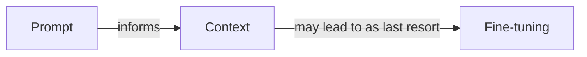
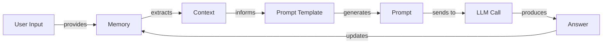
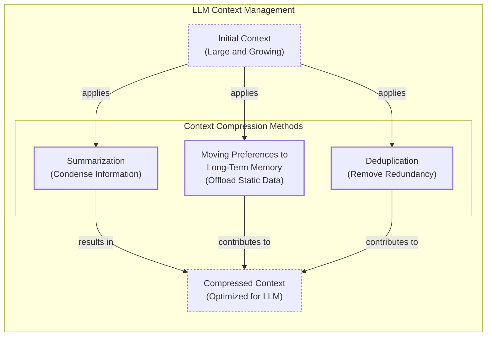
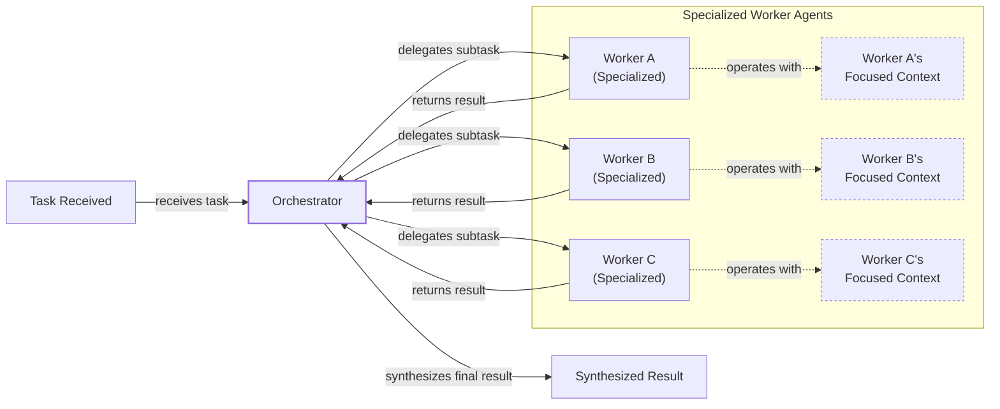

# Context Engineering: The Core of Modern AI

AI applications have evolved rapidly. In 2022, we had simple chatbots for question-answering. By 2023, Retrieval-Augmented Generation (RAG) systems connected LLMs to domain-specific knowledge. 2024 brought us tool-using agents that could perform actions. Now, we are building memory-enabled agents that remember past interactions and build relationships over time [[26]](https://www.securityindustry.org/2024/07/16/understanding-the-evolution-from-classic-chatbots-to-rag-chatbots-to-ai-powered-assistants/), [[27]](https://pagergpt.ai/ai-chatbot/evolution-of-ai-chatbots).

In our last lesson, we explored how to choose between AI agents and LLM workflows. As these applications grow more complex, prompt engineering is showing its limits. It optimizes single LLM calls but fails when managing systems with memory, actions, and long interaction histories [[51]](https://www.linkedin.com/posts/denis-panjuta_prompt-engineering-vs-context-engineering-activity-7363945251180322816-1q_m). The volume of information an agent might need—past conversations, user data, documents, and action descriptions—has grown exponentially. Simply stuffing all this into a prompt is not a viable strategy. This is where context engineering comes in. It is the discipline of orchestrating this entire information ecosystem to ensure the LLM gets exactly what it needs, when it needs it.

## From Prompt to Context Engineering

Prompt engineering, while effective for simple tasks, is designed for single, stateless interactions. It treats each call to an LLM as a new, isolated event. This approach breaks down in stateful applications where context must be preserved and managed across multiple turns [[52]](https://memgraph.com/blog/prompt-engineering-vs-context-engineering).

As a conversation or task progresses, the context grows. Without a strategy to manage this growth, the LLM’s performance degrades. This is context decay: the model gets confused by the noise of an ever-expanding history and starts to lose track of the original instructions [[3]](https://www.trychroma.com/research/context-rot). Even with large context windows, a physical limit exists. Operationally, every token adds to the cost and latency of an LLM call. We will explore these concepts in more detail in upcoming lessons, including memory and RAG.

On a recent project, we learned this the hard way. We were working with a model that supported a million-token context window, so we thought, "What could go wrong?" We stuffed everything in: our research, guidelines, examples, and user history. The result was an LLM workflow that was slow, expensive, and produced low-quality outputs. This is where context engineering becomes essential. It shifts the focus from crafting static prompts to building dynamic systems that manage information flow, making your applications accurate, fast, and cost-effective [[25]](https://www.glean.com/blog/context-engineering-ai-the-foundation-of-reliable-high-performing-models).

## Understanding Context Engineering

Context engineering is the art of finding the smallest possible set of high-signal tokens that give the LLM the highest probability of a good outcome [[66]](https://towardsdatascience.com/deep-dive-into-context-engineering-for-ai-agents/). It is an optimization problem: you retrieve the right information from your application's memory to solve a specific task without overwhelming the model [[22]](https://arxiv.org/pdf/2507.13334). For example, when you ask a cooking agent for a recipe, you do not give it the entire cookbook. Instead, you retrieve the specific recipe, along with personal context like allergies or taste preferences.

Andrej Karpathy explains that LLMs are like a new kind of operating system where the model is the CPU and its context window is the RAM [[31]](https://www.langchain.com/blog/context-engineering-for-agents), [[33]](https://atlan.com/know/working-memory-llms/). Just as an operating system manages what fits into your computer’s limited RAM, context engineering manages what information occupies the model’s limited context window.

How does context engineering relate to prompt engineering? Prompt engineering is a subset of context engineering. You still write effective prompts, but you also design a system that feeds the right context into those prompts. This means understanding not just *how* to phrase a task, but *what* information the model needs to perform optimally.

| Dimension | Prompt Engineering | Context Engineering |
| :--- | :--- | :--- |
| Scope | Single interaction optimization | Entire information ecosystem |
| State Management | Stateless function | Stateful due to memory |
| Focus | How to phrase tasks | What information to provide |

Table 1: A comparison of prompt engineering and context engineering.

Context engineering is the new fine-tuning. While fine-tuning has its place, it is expensive, time-consuming, and inflexible. For most enterprise use cases, you get better results faster and more cheaply with context engineering [[51]](https://www.linkedin.com/posts/denis-panjuta_prompt-engineering-vs-context-engineering-activity-7363945251180322816-1q_m). It allows for rapid iteration and adaptation to evolving data without altering the core model. When you start a new AI project, your decision-making process for guiding the LLM should look like the one presented in Image 1.



Image 1: A simplified flowchart illustrating the decision-making workflow in AI application development, from prompt engineering to context engineering and fine-tuning.

For instance, if you build an agent to process internal Slack messages, you do not need to fine-tune a model on your company’s communication style. It is more effective to use a powerful reasoning model and engineer the context to retrieve specific messages and enable actions. Throughout this course, we will show you how to solve most industry problems using only context engineering.

## What Makes Up the Context

To master context engineering, you first need to understand what "context" is. It is everything the LLM sees in a single turn, dynamically assembled from various memory components before being passed to the model [[21]](https://www.datacamp.com/blog/context-engineering).

The high-level workflow begins when user input triggers the system to pull relevant information from memory. This information is assembled into the final context, inserted into a prompt template, and sent to the LLM. The LLM’s answer then updates the memory, and the cycle repeats.



Image 2: A simplified workflow of context engineering.

These components are grouped into two main categories. We will explain them intuitively for now, as we have future dedicated lessons for all of them.

### Short-Term Working Memory

Short-term working memory is the state of the agent for the current task or conversation. It is volatile and changes with each interaction, helping the agent maintain a coherent dialogue. It can include [[37]](https://www.datacamp.com/blog/how-does-llm-memory-work), [[39]](https://skymod.tech/why-memory-matters-in-llm-agents-short-term-vs-long-term-memory-architectures/):

-   **User input:** The most recent query or command from the user.
-   **Message history:** The log of the current conversation.
-   **Agent's internal thoughts:** The reasoning steps the agent takes to decide on its next action.
-   **Action calls and outputs:** The results from any actions the agent has performed.

### Long-Term Memory

Long-term memory is more persistent and stores information across sessions. We divide it into three types, drawing parallels from human memory [[38]](https://www.analyticsvidhya.com/blog/2026/01/how-does-llm-memory-work/), [[40]](https://labelstud.io/learningcenter/episodic-vs-persistent-memory-in-llms/):

-   **Procedural memory:** This is knowledge encoded directly in the code. It includes the system prompt, definitions of available actions, and schemas for structured outputs.
-   **Episodic memory:** This is memory of specific past experiences, like user preferences or previous interactions, typically stored in vector or graph databases for efficient retrieval.
-   **Semantic memory:** This is the agent’s general knowledge base, such as company documents or information accessed via the internet.

These concepts will be covered in-depth in future lessons on structured outputs, actions, memory, and RAG. The key takeaway is that these components are dynamic. Context engineering involves selecting the right pieces from this vast memory pool to construct the most effective prompt for the task at hand.

## Production Implementation Challenges

Now that we understand what makes up the context, let's look at the core challenges of implementing it in production. These all revolve around a single question: "How can I keep my context as small as possible while providing enough information to the LLM?"

Here are four common issues that come up when building AI applications:

1.  **The context window challenge:** The transformer architecture’s attention mechanism has a quadratic (O(n²)) computational and memory complexity with sequence length [[67]](https://www.lesswrong.com/posts/XNBZPbxyYhmoqD87F/llms-and-computation-complexity). This creates a hard physical limit where every token adds cost, even with large context windows [[18]](https://www.getmaxim.ai/articles/context-window-management-strategies-for-long-context-ai-agents-and-chatbots/), [[68]](https://towardsai.net/p/machine-learning/the-context-window-paradox-engineering-trade-offs-in-modern-llm-architecture).
2.  **Information overload:** LLMs have a finite "attention budget" [[69]](https://www.anthropic.com/engineering/effective-context-engineering-for-ai-agents). Too much context leads to "context rot," where the model's recall ability degrades [[69]](https://www.anthropic.com/engineering/effective-context-engineering-for-ai-agents). This causes the "lost-in-the-middle" problem and creates a "long-horizon gap" in multi-step tasks where coherence is lost over time [[56]](https://www.linkedin.com/pulse/lost-middle-lesson-failing-ai-agents-backwards-anthony-dejohn-01k2e), [[58]](https://dev.to/thousand_miles_ai/the-lost-in-the-middle-problem-why-llms-ignore-the-middle-of-your-context-window-3al2), [[70]](https://langwatch.ai/blog/the-6-context-engineering-challenges-stopping-ai-from-scaling-in-production).
3.  **Context drift:** This occurs when conflicting information accumulates in memory. For example, the memory might contain two conflicting statements: "My cat is white" and "My cat is black." Without a mechanism to resolve these, the model's responses become unreliable [[6]](https://galileo.ai/blog/production-llm-monitoring-strategies), [[8]](https://thenewstack.io/context-rot-enterprise-ai-llms/).
4.  **Tool confusion:** This arises when an agent has too many actions, their descriptions are poor, or their functionalities overlap [[21]](https://www.datacamp.com/blog/context-engineering). A bloated toolset can create ambiguity that even a human would struggle to resolve [[69]](https://www.anthropic.com/engineering/effective-context-engineering-for-ai-agents).

## Key Strategies for Context Optimization

Modern AI solutions must manage complexity across multiple knowledge bases, tools, and conversational histories. Here are four popular context engineering strategies used across the industry [[31]](https://www.langchain.com/blog/context-engineering-for-agents/):

### Selecting the Right Context

Retrieving the right information from memory is a critical first step. Instead of providing everything at once, you can let agents retrieve data autonomously, enabling "progressive disclosure" where context is discovered just-in-time [[69]](https://www.anthropic.com/engineering/effective-context-engineering-for-ai-agents).

```mermaid
mindmap
  root("Selecting the right context")
    "Structured Outputs"
    "RAG (Retrieval-Augmented Generation)"
    "Tools"
    "Temporal Relevance"
    "Repeating Core Instructions"
```

Image 3: A mind map illustrating strategies for selecting the right context for an LLM.

To solve information overload, consider these approaches [[11]](https://oneuptime.com/blog/post/2026-01-30-context-compression/view), [[12]](https://www.dailydoseofds.com/llmops-crash-course-part-8/):

-   **Use structured outputs:** Define clear schemas for what the LLM should return. We will cover this in Lesson 4.
-   **Use RAG:** Fetch only the specific chunks of text needed to answer a user's question, which we will explore in Lesson 10.
-   **Reduce the number of available actions:** Limit the selection to under 30 tools to improve selection accuracy.
-   **Rank time-sensitive data:** Rank information by date and filter out anything no longer relevant.
-   **Repeat core instructions:** Repeat the most important instructions at both the start and the end of the prompt to ensure they are not lost [[57]](https://promptmetheus.com/resources/llm-knowledge-base/lost-in-the-middle-effect).

### Context Compression

As message history grows, you must manage past interactions to keep your context window in check. This involves a trade-off between cost, latency, and fidelity [[71]](https://www.sitepoint.com/optimizing-token-usage-context-compression-techniques/). Instead of dropping past turns, you can compress key facts [[11]](https://oneuptime.com/blog/post/2026-01-30-context-compression/view), [[14]](https://blog.jetbrains.com/research/2025/12/efficient-context-management/).



Image 4: A diagram illustrating context compression methods for LLMs, including summarization, moving preferences to long-term memory, and deduplication.

You can do this through summarization, moving user preferences to long-term memory, or deduplication. A hierarchical approach is also effective: retain important turns, summarize medium ones, and remove low-importance ones [[72]](https://arxiv.org/html/2603.29193v1).

### Isolating Context

Another powerful strategy is to break complex tasks into focused workflows, each with an optimized context to prevent overload [[73]](https://www.llamaindex.ai/blog/context-engineering-what-it-is-and-techniques-to-consider). This can be done by splitting information across multiple agents. Instead of one agent with a massive, cluttered context, you can have a team of agents, each with a smaller, focused one [[48]](https://www.vellum.ai/blog/multi-agent-systems-building-with-context-engineering).



Image 5: A simplified diagram illustrating the Orchestrator-Worker Pattern for isolating context.

We often implement this using an orchestrator-worker pattern, where a central orchestrator assigns sub-tasks to specialized worker agents. Each worker operates in its own isolated context, improving focus and allowing for parallel processing [[46]](https://beam.ai/agentic-insights/multi-agent-orchestration-patterns-production), [[47]](https://gurusup.com/blog/multi-agent-orchestration-guide). We will cover this pattern in more detail in a future lesson.

### Format Optimizations

Finally, the way you format the context matters. Models are sensitive to structure, and using clear delimiters can improve performance [[44]](https://www.anthropic.com/engineering/effective-context-engineering-for-ai-agents). Common strategies are to use XML tags to separate different types of information and prefer YAML over JSON for token efficiency. Seeing exactly what occupies your context window at every step is key, which is done by monitoring your system's traces [[16]](https://www.comet.com/site/blog/context-window/).

## Here Is an Example

Let's connect theory with a concrete example. Consider these common real-world scenarios:

-   **Healthcare:** An AI assistant accesses a patient's medical history, symptoms, and medical literature to provide personalized diagnostic support [[41]](https://www.decodingai.com/p/context-engineering-2025s-1-skill).
-   **Financial Services:** AI systems integrate with CRMs, emails, and calendars, combining market data and client portfolios to generate tailored financial advice.
-   **Project Management:** AI systems access enterprise infrastructure to automatically understand project requirements, then add and update tasks.
-   **Content Creator Assistant:** An AI agent uses your research, past content, and personality traits to create content.

Let's walk through a query to the healthcare assistant. A user asks: `I have a headache. What can I do to stop it? I would prefer not to take any medicine.`

Before the AI answers, a context engineering system performs several steps: it retrieves the user's patient history, queries a medical database for non-medicinal remedies, assembles the key information, formats it into a structured prompt, and calls the LLM for a personalized answer [[41]](https://www.decodingai.com/p/context-engineering-2025s-1-skill).

Here is a simplified example showing how you might structure the context using XML and YAML:

```xml
<system_prompt>
You are a helpful and cautious AI healthcare assistant...
</system_prompt>
<patient_history>
patient:
  name: John Doe
  age: 45
  ...
  preferences:
    medication_avoidance: true
</patient_history>
<medical_literature>
articles:
  - topic: dehydration_headaches
    finding: "Dehydration is a common cause..."
  - topic: stress_relief
    finding: "Stress-relief techniques are effective..."
</medical_literature>
<user_query>
I have a headache. What can I do to stop it? I would prefer not to take any medicine.
</user_query>
```

To build such a system, you need a robust tech stack. A potential stack could include Gemini for the LLM, LangGraph for orchestration, various databases for memory, and LangSmith for observability [[62]](https://blog.stackademic.com/context-engineering-in-llms-and-ai-agents-eb861f0d3e9b), [[65]](https://www.scalablepath.com/machine-learning/langgraph).

## Connecting Context Engineering to AI Engineering

Context engineering is about developing the intuition to arrange context for optimal results and determine the minimal yet essential information an LLM needs.

It draws inspiration from established software engineering. Just as developers design APIs and data pipelines, context engineers design the information architecture that powers intelligent agents [[74]](https://www.elastic.co/what-is/context-engineering). It is a complex field that combines [[22]](https://www.mezmo.com/learn-observability/context-engineering-for-observability-how-to-deliver-the-right-data-to-llms), [[23]](https://sombrainc.com/blog/ai-context-engineering-guide):

1.  **AI Engineering:** Implementing LLM workflows, RAG, and evaluation pipelines.
2.  **Software Engineering:** Building scalable code and system architectures.
3.  **Data Engineering:** Designing data pipelines for the memory layer.
4.  **Operations (Ops):** Deploying reproducible, maintainable, and observable agents.

Our goal with this course is to teach you how to combine these skills to build production-ready AI products, shifting your mindset from developer to architect. In the next lesson, we will explore structured outputs.

## References

- [1] Karpathy, A. (2025, July 2). *+1 for "context engineering" over "prompt engineering"*. X. https://x.com/karpathy/status/1937902205765607626
- [2] Lena. (2025, July 10). *Context Engineering 101 cheat sheet*. X. https://x.com/lenadroid/status/1943685060785524824
- [3] Chroma. (2025, July). *Context Rot: How Increasing Input Tokens Impacts LLM Performance*. https://www.trychroma.com/research/context-rot
- [4] Falconer, S. (n.d.). *Four design patterns for Event-Driven, Multi-Agent systems*. Confluent. https://www.confluent.io/blog/event-driven-multi-agent-systems/
- [5] Mei, L., et al. (2025, July 17). *A survey of context engineering for large language models*. arXiv. https://arxiv.org/pdf/2507.13334
- [6] Galileo. (n.d.). *Production LLM Monitoring Strategies*. https://galileo.ai/blog/production-llm-monitoring-strategies
- [7] Larson, E. J. (2025, July 25). *Context, drift, and the illusion of intent*. Colligo. https://erikjlarson.substack.com/p/context-drift-and-the-illusion-of
- [8] The New Stack. (2026, February). *Context Rot: The Silent Killer of Enterprise AI LLMs*. https://thenewstack.io/context-rot-enterprise-ai-llms/
- [9] InsightFinder. (n.d.). *The Hidden Cost of LLM Drift Detection*. https://insightfinder.com/blog/hidden-cost-llm-drift-detection/
- [10] Helicone. (n.d.). *How to Reduce LLM Hallucination*. https://www.helicone.ai/blog/how-to-reduce-llm-hallucination
- [11] OneUptime. (2026, January 30). *How to Build Context Compression*. https://oneuptime.com/blog/post/2026-01-30-context-compression/view
- [12] Daily Dose of DS. (n.d.). *LLMOps Crash Course Part 8: Context Engineering*. https://www.dailydoseofds.com/llmops-crash-course-part-8/
- [13] arXiv. (2025, October). *Context Compression via Item Description Summarization for SLM Relevance Ranking in Semantic Search*. https://arxiv.org/html/2510.22101v1
- [14] JetBrains Research. (2025, December 1). *Cutting Through the Noise: Smarter Context Management for LLM-Powered Agents*. https://blog.jetbrains.com/research/2025/12/efficient-context-management/
- [15] Atlan. (2026). *LLM Context Window Limitations: Impacts, Risks, & Fixes in 2026*. https://atlan.com/know/llm-context-window-limitations/
- [16] Comet. (n.d.). *The LLM Context Window: What It Is, Why It Matters, and How to Manage It*. https://www.comet.com/site/blog/context-window/
- [17] DataHub. (n.d.). *Context Window Optimization*. https://datahub.com/blog/context-window-optimization/
- [18] Maxim.ai. (n.d.). *Context Window Management: Strategies for Long-Context AI Agents and Chatbots*. https://www.getmaxim.ai/articles/context-window-management-strategies-for-long-context-ai-agents-and-chatbots/
- [19] Packmind. (n.d.). *Context Engineering for AI Coding: a Practical Intro to ContextOps*. https://packmind.com/context-engineering-ai-coding/what-is-contextops/
- [20] Mezmo. (n.d.). *Context Engineering for Observability: How to Deliver the Right Data to LLMs*. https://www.mezmo.com/learn-observability/context-engineering-for-observability-how-to-deliver-the-right-data-to-llms
- [21] DataCamp. (n.d.). *Context Engineering: A Guide With Examples*. https://www.datacamp.com/blog/context-engineering
- [22] Mei, L., et al. (2025, July 17). *A survey of context engineering for large language models*. arXiv. https://arxiv.org/pdf/2507.13334
- [23] Sombra Inc. (n.d.). *AI Context Engineering: A Comprehensive Guide*. https://sombrainc.com/blog/ai-context-engineering-guide
- [24] Chase, H. (2025, June 23). *The rise of "context engineering"*. LangChain Blog. https://blog.langchain.com/the-rise-of-context-engineering/
- [25] Glean. (n.d.). *Context engineering AI: The foundation of reliable, high-performing models*. https://www.glean.com/blog/context-engineering-ai-the-foundation-of-reliable-high-performing-models
- [26] Security Industry Association. (2024, July 16). *Understanding the Evolution from Classic Chatbots to RAG Chatbots to AI-Powered Assistants*. https://www.securityindustry.org/2024/07/16/understanding-the-evolution-from-classic-chatbots-to-rag-chatbots-to-ai-powered-assistants/
- [27] PagerGPT. (n.d.). *Evolution of AI Chatbots*. https://pagergpt.ai/ai-chatbot/evolution-of-ai-chatbots
- [28] Atlan. (n.d.). *LLM Context Window Limitations: Impacts, Risks, & Fixes in 2026*. https://atlan.com/know/llm-context-window-limitations/
- [29] Dante AI. (n.d.). *When Did AI Chatbots Start?*. https://www.dante-ai.com/news/when-did-ai-chatbots-start
- [30] Pinecone. (n.d.). *What is Context Engineering?*. https://www.pinecone.io/learn/context-engineering/
- [31] LangChain Blog. (2025, July 2). *Context Engineering for Agents*. https://blog.langchain.com/context-engineering-for-agents/
- [32] Glean. (n.d.). *Context Engineering vs. Prompt Engineering: Key Differences Explained*. https://www.glean.com/perspectives/context-engineering-vs-prompt-engineering-key-differences-explained
- [33] Atlan. (n.d.). *Working Memory in LLMs*. https://atlan.com/know/working-memory-llms/
- [34] Teki, S. (n.d.). *From Vibe Coding to Context Engineering: A Blueprint for Production-Grade GenAI Systems*. https://www.sundeepteki.org/blog/from-vibe-coding-to-context-engineering-a-blueprint-for-production-grade-genai-systems
- [35] Roychowdhury, A. (n.d.). *Context Engineering: The Silent Architecture Behind Every AI*. LinkedIn. https://www.linkedin.com/pulse/context-engineering-silent-architecture-behind-every-ai-roychowdhury-lzcec
- [36] Atlan. (n.d.). *Working Memory in LLMs*. https://atlan.com/know/working-memory-llms/
- [37] DataCamp. (n.d.). *How Does LLM Memory Work?*. https://www.datacamp.com/blog/how-does-llm-memory-work
- [38] Analytics Vidhya. (2026, January). *How Does LLM Memory Work?*. https://www.analyticsvidhya.com/blog/2026/01/how-does-llm-memory-work/
- [39] Skymod. (n.d.). *Why Memory Matters in LLM Agents: Short-Term vs. Long-Term Memory Architectures*. https://skymod.tech/why-memory-matters-in-llm-agents-short-term-vs-long-term-memory-architectures/
- [40] Label Studio. (n.d.). *Episodic vs. Persistent Memory in LLMs*. https://labelstud.io/learningcenter/episodic-vs-persistent-memory-in-llms/
- [41] Iusztin, P. (2025). *Context Engineering: 2025's #1 Skill*. Decoding AI. https://www.decodingai.com/p/context-engineering-2025s-1-skill
- [42] Horthy, D. (n.d.). *Own your context window*. GitHub. https://github.com/humanlayer/12-factor-agents/blob/main/content/factor-03-own-your-context-window.md
- [43] MDPI. (2025, July). *Prompt Engineering in Healthcare*. https://www.mdpi.com/2079-9292/13/15/2961
- [44] Anthropic. (n.d.). *Effective Context Engineering for AI Agents*. https://www.anthropic.com/engineering/effective-context-engineering-for-ai-agents
- [45] LlamaIndex Blog. (n.d.). *Context Engineering - What it is, and techniques to consider*. https://www.llamaindex.ai/blog/context-engineering-what-it-is-and-techniques-to-consider
- [46] Beam.ai. (n.d.). *Multi-Agent Orchestration Patterns for Production*. https://beam.ai/agentic-insights/multi-agent-orchestration-patterns-production
- [47] GuruSup. (n.d.). *Multi-Agent Orchestration Guide*. https://gurusup.com/blog/multi-agent-orchestration-guide
- [48] Vellum.ai. (n.d.). *Multi-Agent Systems: Building with Context Engineering*. https://www.vellum.ai/blog/multi-agent-systems-building-with-context-engineering
- [49] Praetorian. (n.d.). *Deterministic AI Orchestration: A Platform Architecture for Autonomous Development*. https://www.praetorian.com/blog/deterministic-ai-orchestration-a-platform-architecture-for-autonomous-development/
- [50] arXiv. (2026, January). *Specialized Agents*. https://arxiv.org/html/2601.13671v0
- [51] Panjuta, D. (2025, July). *Prompt Engineering vs. Context Engineering*. LinkedIn. https://www.linkedin.com/posts/denis-panjuta_prompt-engineering-vs-context-engineering-activity-7363945251180322816-1q_m
- [52] Memgraph. (n.d.). *Prompt Engineering vs. Context Engineering*. https://memgraph.com/blog/prompt-engineering-vs-context-engineering
- [53] Mezmo. (n.d.). *Context Engineering for Observability*. https://www.mezmo.com/learn-observability/context-engineering-for-observability-how-to-deliver-the-right-data-to-llms
- [54] Instinctools. (n.d.). *Context Engineering*. https://www.instinctools.com/blog/context-engineering/
- [55] Neo4j. (n.d.). *Agentic AI: Context Engineering vs. Prompt Engineering*. https://neo4j.com/blog/agentic-ai/context-engineering-vs-prompt-engineering/
- [56] DeJohn, A. (n.d.). *Lost in the Middle: A Lesson on Failing AI Agents Backwards*. LinkedIn. https://www.linkedin.com/pulse/lost-middle-lesson-failing-ai-agents-backwards-anthony-dejohn-01k2e
- [57] Promptmetheus. (n.d.). *Lost-in-the-Middle Effect*. https://promptmetheus.com/resources/llm-knowledge-base/lost-in-the-middle-effect
- [58] Thousand Miles AI. (n.d.). *The "Lost in the Middle" Problem: Why LLMs Ignore the Middle of Your Context Window*. Dev.to. https://dev.to/thousand_miles_ai/the-lost-in-the-middle-problem-why-llms-ignore-the-middle-of-your-context-window-3al2
- [59] Atlan. (n.d.). *LLM Context Window Limitations*. https://atlan.com/know/llm-context-window-limitations/
- [60] BigData Boutique. (n.d.). *Needle in a Haystack: Optimizing Retrieval and RAG Over Long Context Windows*. https://bigdataboutique.com/blog/needle-in-haystack-optimizing-retrieval-and-rag-over-long-context-windows-5dfb3c
- [61] Codecademy. (n.d.). *Context Engineering in AI*. https://www.codecademy.com/article/context-engineering-in-ai
- [62] Stackademic. (n.d.). *Context Engineering in LLMs and AI Agents*. https://blog.stackademic.com/context-engineering-in-llms-and-ai-agents-eb861f0d3e9b
- [63] Packmind. (n.d.). *How to Implement Context Engineering*. https://packmind.com/context-engineering-ai-coding/how-to-implement-context-engineering/
- [64] Atlan. (n.d.). *Context Engineering Platforms Comparison*. https://atlan.com/know/context-engineering-platforms-comparison/
- [65] Scalable Path. (n.d.). *LangGraph*. https://www.scalablepath.com/machine-learning/langgraph
- [66] Towards Data Science. (n.d.). *Deep Dive into Context Engineering for AI Agents*. https://towardsdatascience.com/deep-dive-into-context-engineering-for-ai-agents/
- [67] LessWrong. (n.d.). *LLMs and Computation Complexity*. https://www.lesswrong.com/posts/XNBZPbxyYhmoqD87F/llms-and-computation-complexity
- [68] Towards AI. (n.d.). *The Context Window Paradox: Engineering Trade-Offs in Modern LLM Architecture*. https://towardsai.net/p/machine-learning/the-context-window-paradox-engineering-trade-offs-in-modern-llm-architecture
- [69] Anthropic. (n.d.). *Effective Context Engineering for AI Agents*. https://www.anthropic.com/engineering/effective-context-engineering-for-ai-agents
- [70] LangWatch. (n.d.). *The 6 Context Engineering Challenges Stopping AI from Scaling in Production*. https://langwatch.ai/blog/the-6-context-engineering-challenges-stopping-ai-from-scaling-in-production
- [71] SitePoint. (n.d.). *Optimizing Token Usage: Context Compression Techniques*. https://www.sitepoint.com/optimizing-token-usage-context-compression-techniques/
- [72] arXiv. (2026, March). *Adaptive Context Compression for Long-Running Interactions*. https://arxiv.org/html/2603.29193v1
- [73] LlamaIndex Blog. (n.d.). *Context Engineering - What it is, and techniques to consider*. https://www.llamaindex.ai/blog/context-engineering-what-it-is-and-techniques-to-consider
- [74] Elastic. (n.d.). *What is context engineering?*. https://www.elastic.co/what-is/context-engineering