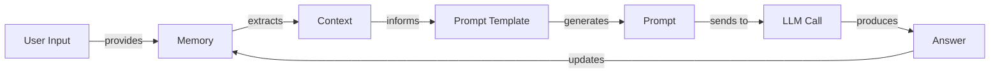
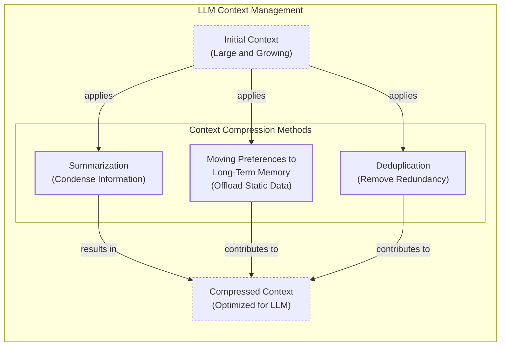

# Context Engineering: The Core of Modern AI

## Introduction

AI applications have evolved rapidly from simple chatbots in 2022 to the memory-enabled agents we build today [[1]](https://www.securityindustry.org/2024/07/16/understanding-the-evolution-from-classic-chatbots-to-rag-chatbots-to-ai-powered-assistants/), [[2]](https://pagergpt.ai/ai-chatbot/evolution-of-ai-chatbots). In our last lesson, we explored how to choose between AI agents and LLM workflows. As these systems grow more complex, prompt engineering is showing its limits. It fails when managing systems with memory, actions, and long interaction histories. The volume of information an agent might need has grown exponentially. This includes past conversations, user data, documents, and action descriptions. Stuffing this all into a prompt is not a viable strategy. A new discipline, context engineering, is required to orchestrate this information ecosystem and ensure the LLM gets exactly what it needs [[3]](https://www.linkedin.com/posts/denis-panjuta_prompt-engineering-vs-context-engineering-activity-7363945251180322816-1q_m).

## From Prompt to Context Engineering

Prompt engineering is designed for single, stateless interactions, treating each LLM call as an isolated event. This approach fails in stateful applications where context must be managed across multiple turns. As a conversation progresses, the context grows, leading to context decay. The model gets confused by the noise of an expanding history and loses track of key information.

Even with large context windows, a physical limit exists. Every token also adds to the cost and latency of an LLM call. We learned this the hard way on a project using a million-token model. We stuffed everything into the context, resulting in a slow, expensive, and underperforming workflow. Context engineering solves this by shifting focus from static prompts to dynamic systems that manage information flow, making applications accurate, fast, and cost-effective [[4]](https://memgraph.com/blog/prompt-engineering-vs-context-engineering), [[5]](https://www.trychroma.com/research/context-rot), [[6]](https://www.glean.com/blog/context-engineering-ai-the-foundation-of-reliable-high-performing-models).

## Understanding Context Engineering

Context engineering is the art of finding the smallest possible set of high-signal tokens that give the LLM the highest probability of a good outcome [[7]](https://towardsdatascience.com/deep-dive-into-context-engineering-for-ai-agents/). It is an optimization problem where you retrieve the right information from memory to solve a task without overwhelming the model. For example, a cooking agent needs a specific recipe and your allergies, not the entire cookbook [[8]](https://arxiv.org/pdf/2507.13334).

As Andrej Karpathy puts it, LLMs are like a new kind of operating system where the LLM is the CPU and its context window is the RAM. He defines context engineering as the "delicate art and science of filling the context window with just the right information for the next step" [[9]](https://x.com/karpathy/status/1937902205765607626), [[10]](https://www.langchain.com/blog/context-engineering-for-agents/).

Prompt engineering is a subset of context engineering. You still write effective prompts, but you also design a system that feeds the right context into them.

| Dimension | Prompt Engineering | Context Engineering |
| :--- | :--- | :--- |
| Scope | Single interaction optimization | Entire information ecosystem |
| State Management | Stateless function | Stateful due to memory |
| Focus | How to phrase tasks | What information to provide |

Table 1: A comparison of prompt engineering and context engineering.

Context engineering is the new fine-tuning. While fine-tuning has its place, it is expensive and inflexible. For most enterprise use cases, you get better results faster and more cheaply with context engineering. It allows for rapid iteration without altering the core model. When starting a new AI project, your decision-making process should follow the workflow in Image 1 [[3]](https://www.linkedin.com/posts/denis-panjuta_prompt-engineering-vs-context-engineering-activity-7363945251180322816-1q_m).


Image 1: A simplified flowchart illustrating the decision-making workflow in AI application development, from prompt engineering to context engineering, and fine-tuning.

For instance, an agent processing Slack messages does not need fine-tuning on your company's communication style. It is more effective to use a powerful reasoning model and engineer the context to retrieve specific messages and enable actions. Throughout this course, we will focus on solving problems using context engineering.

## What Makes Up the Context

To master context engineering, you must understand what "context" is. It is everything the LLM sees in a single turn, dynamically assembled from various memory components [[11]](https://www.datacamp.com/blog/context-engineering).

The high-level workflow begins when user input triggers the system to pull relevant information from memory. This information is assembled into the final context, inserted into a prompt template, and sent to the LLM. The LLM’s answer then updates the memory, and the cycle repeats.



Image 2: A simplified workflow of context engineering.

These components are grouped into two main categories, which we will cover in-depth in future lessons.

### Short-Term Working Memory

Short-term working memory is the agent's state for the current task. It is volatile and helps maintain a coherent dialogue. It can include the user's input, message history, the agent's internal thoughts, and the outputs from any actions it has performed [[12]](https://www.datacamp.com/blog/how-does-llm-memory-work), [[13]](https://skymod.tech/why-memory-matters-in-llm-agents-short-term-vs-long-term-memory-architectures/).

### Long-Term Memory

Long-term memory is persistent and stores information across sessions. We divide it into three types:

-   **Procedural memory:** This is knowledge encoded in the code, like the system prompt, action definitions, and output schemas.
-   **Episodic memory:** This is memory of specific past experiences, like user preferences, stored in vector or graph databases.
-   **Semantic memory:** This is the agent’s general knowledge base, such as company documents or information from the internet [[14]](https://www.analyticsvidhya.com/blog/2026/01/how-does-llm-memory-work/), [[15]](https://labelstud.io/learningcenter/episodic-vs-persistent-memory-in-llms/).

The key takeaway is that these components are dynamic. Context engineering involves selecting the right pieces from this memory pool for each task.

## Production Implementation Challenges

Now that we understand what makes up the context, let's look at the core challenges of implementing it in production. These all revolve around keeping the context small yet informative.

Here are four common issues:

1.  **The context window challenge:** The transformer architecture’s attention mechanism has a quadratic (O(n²)) computational complexity with sequence length. This creates a hard physical limit where every token adds cost and latency [[16]](https://www.lesswrong.com/posts/XNBZPbxyYhmoqD87F/llms-and-computation-complexity), [[17]](https://www.getmaxim.ai/articles/context-window-management-strategies-for-long-context-ai-agents-and-chatbots/).
2.  **Information overload:** LLMs have a finite "attention budget." Too much context leads to "context rot," where the model's recall ability degrades. This causes the "lost-in-the-middle" problem, where information in the middle of the context is ignored [[18]](https://www.anthropic.com/engineering/effective-context-engineering-for-ai-agents), [[19]](https://www.linkedin.com/pulse/lost-middle-lesson-failing-ai-agents-backwards-anthony-dejohn-01k2e), [[20]](https://dev.to/thousand_miles_ai/the-lost-in-the-middle-problem-why-llms-ignore-the-middle-of-your-context-window-3al2).
3.  **Context drift:** This occurs when conflicting information accumulates in memory. Without a mechanism to resolve these conflicts, the model's responses become unreliable [[21]](https://galileo.ai/blog/production-llm-monitoring-strategies), [[22]](https://thenewstack.io/context-rot-enterprise-ai-llms/).
4.  **Tool confusion:** This arises when an agent has too many actions, or their descriptions are poor or overlapping. A bloated toolset can create ambiguity that confuses the model [[11]](https://www.datacamp.com/blog/context-engineering), [[18]](https://www.anthropic.com/engineering/effective-context-engineering-for-ai-agents).

## Key Strategies for Context Optimization

Modern AI solutions must manage complexity across multiple knowledge bases, tools, and conversational histories. Here are four popular context engineering strategies used across the industry [[10]](https://www.langchain.com/blog/context-engineering-for-agents/).

### Selecting the Right Context

Retrieving the right information from memory is a critical first step. Instead of providing everything at once, you can let agents retrieve data autonomously, enabling "progressive disclosure" where context is discovered just-in-time [[18]](https://www.anthropic.com/engineering/effective-context-engineering-for-ai-agents).

```mermaid
mindmap
  root("Selecting the right context")
    "Structured Outputs"
    "RAG (Retrieval-Augmented Generation)"
    "Tools"
    "Temporal Relevance"
    "Repeating Core Instructions"
```

Image 3: A mind map illustrating strategies for selecting the right context for an LLM.

To solve information overload, consider using structured outputs, RAG, reducing the number of available actions, ranking time-sensitive data, and repeating core instructions at the start and end of the prompt [[23]](https://oneuptime.com/blog/post/2026-01-30-context-compression/view), [[24]](https://www.dailydoseofds.com/llmops-crash-course-part-8/), [[25]](https://promptmetheus.com/resources/llm-knowledge-base/lost-in-the-middle-effect).

### Context Compression

As message history grows, you must compress key facts from past interactions to keep your context window in check. This involves a trade-off between cost, latency, and fidelity.



Image 4: A diagram illustrating context compression methods for LLMs, including summarization, moving preferences to long-term memory, and deduplication.

You can do this through summarization, moving user preferences to long-term memory, or deduplication. A hierarchical approach is also effective: retain important turns, summarize medium ones, and remove low-importance ones [[23]](https://oneuptime.com/blog/post/2026-01-30-context-compression/view), [[26]](https://blog.jetbrains.com/research/2025/12/efficient-context-management/), [[27]](https://arxiv.org/html/2603.29193v1).

### Isolating Context

Another powerful strategy is to break complex tasks into focused workflows, each with an optimized context. This can be done by splitting information across multiple agents. Instead of one agent with a massive, cluttered context, you can have a team of agents, each with a smaller, focused one. We often implement this using an orchestrator-worker pattern, which we will cover in a future lesson [[28]](https://www.vellum.ai/blog/multi-agent-systems-building-with-context-engineering), [[29]](https://beam.ai/agentic-insights/multi-agent-orchestration-patterns-production), [[30]](https://gurusup.com/blog/multi-agent-orchestration-guide).

### Format Optimizations

Finally, the way you format the context matters. Models are sensitive to structure, and using clear delimiters can improve performance. Common strategies are to use XML tags to separate different types of information and prefer YAML over JSON for token efficiency. Seeing exactly what occupies your context window at every step is key, which is done by monitoring your system's traces [[31]](https://www.anthropic.com/engineering/effective-context-engineering-for-ai-agents), [[32]](https://www.comet.com/site/blog/context-window/).

## Here Is an Example

Let's connect theory with a concrete example. Consider these common real-world scenarios:

-   **Healthcare:** An AI assistant accesses a patient's medical history, symptoms, and medical literature to provide personalized diagnostic support.
-   **Financial Services:** AI systems integrate with CRMs, emails, and calendars, combining market data and client portfolios to generate tailored financial advice.
-   **Project Management:** AI systems access enterprise infrastructure to automatically understand project requirements, then add and update tasks.
-   **Content Creator Assistant:** An AI agent uses your research, past content, and personality traits to create content [[33]](https://www.decodingai.com/p/context-engineering-2025s-1-skill).

Let's walk through a query to the healthcare assistant. A user asks: `I have a headache. What can I do to stop it? I would prefer not to take any medicine.`

Before the AI answers, a context engineering system performs several steps: it retrieves the user's patient history, queries a medical database for non-medicinal remedies, assembles the key information, formats it into a structured prompt, and calls the LLM for a personalized answer [[33]](https://www.decodingai.com/p/context-engineering-2025s-1-skill).

Here is a simplified example showing how you might structure the context using XML and YAML:

```xml
<system_prompt>
You are a helpful and cautious AI healthcare assistant...
</system_prompt>
<patient_history>
patient:
  name: John Doe
  age: 45
  ...
  preferences:
    medication_avoidance: true
</patient_history>
<medical_literature>
articles:
  - topic: dehydration_headaches
    finding: "Dehydration is a common cause..."
  - topic: stress_relief
    finding: "Stress-relief techniques are effective..."
</medical_literature>
<user_query>
I have a headache. What can I do to stop it? I would prefer not to take any medicine.
</user_query>
```

To build such a system, you need a robust tech stack. A potential stack could include Gemini for the LLM, LangGraph for orchestration, various databases for memory, and LangSmith for observability [[34]](https://blog.stackademic.com/context-engineering-in-llms-and-ai-agents-eb861f0d3e9b), [[35]](https://www.scalablepath.com/machine-learning/langgraph).

## Conclusion

Context engineering is about developing the intuition to arrange context for optimal results and determine the minimal yet essential information an LLM needs. It draws inspiration from established software engineering, where developers design the information architecture that powers intelligent agents [[36]](https://www.elastic.co/what-is/context-engineering).

This complex field combines:

1.  **AI Engineering:** Implementing LLM workflows, RAG, and evaluation pipelines.
2.  **Software Engineering:** Building scalable code and system architectures.
3.  **Data Engineering:** Designing data pipelines for the memory layer.
4.  **Operations (Ops):** Deploying reproducible, maintainable, and observable agents.

Our goal with this course is to teach you how to combine these skills to build production-ready AI products, shifting your mindset from developer to architect. In the next lesson, we will explore structured outputs [[37]](https://www.mezmo.com/learn-observability/context-engineering-for-observability-how-to-deliver-the-right-data-to-llms), [[38]](https://sombrainc.com/blog/ai-context-engineering-guide).

## References

- [1] [Understanding the Evolution from Classic Chatbots to RAG Chatbots to AI-Powered Assistants](https://www.securityindustry.org/2024/07/16/understanding-the-evolution-from-classic-chatbots-to-rag-chatbots-to-ai-powered-assistants/)
- [2] [Evolution of AI Chatbots](https://pagergpt.ai/ai-chatbot/evolution-of-ai-chatbots)
- [3] [Prompt Engineering vs. Context Engineering](https://www.linkedin.com/posts/denis-panjuta_prompt-engineering-vs-context-engineering-activity-7363945251180322816-1q_m)
- [4] [Prompt Engineering vs. Context Engineering](https://memgraph.com/blog/prompt-engineering-vs-context-engineering)
- [5] [Context Rot: How Increasing Input Tokens Impacts LLM Performance](https://www.trychroma.com/research/context-rot)
- [6] [Context engineering AI: The foundation of reliable, high-performing models](https://www.glean.com/blog/context-engineering-ai-the-foundation-of-reliable-high-performing-models)
- [7] [Deep Dive into Context Engineering for AI Agents](https://towardsdatascience.com/deep-dive-into-context-engineering-for-ai-agents/)
- [8] [A survey of context engineering for large language models](https://arxiv.org/pdf/2507.13334)
- [9] [+1 for "context engineering" over "prompt engineering"](https://x.com/karpathy/status/1937902205765607626)
- [10] [Context Engineering for Agents](https://www.langchain.com/blog/context-engineering-for-agents/)
- [11] [Context Engineering: A Guide With Examples](https://www.datacamp.com/blog/context-engineering)
- [12] [How Does LLM Memory Work?](https://www.datacamp.com/blog/how-does-llm-memory-work)
- [13] [Why Memory Matters in LLM Agents: Short-Term vs. Long-Term Memory Architectures](https://skymod.tech/why-memory-matters-in-llm-agents-short-term-vs-long-term-memory-architectures/)
- [14] [How Does LLM Memory Work?](https://www.analyticsvidhya.com/blog/2026/01/how-does-llm-memory-work/)
- [15] [Episodic vs. Persistent Memory in LLMs](https://labelstud.io/learningcenter/episodic-vs-persistent-memory-in-llms/)
- [16] [LLMs and Computation Complexity](https://www.lesswrong.com/posts/XNBZPbxyYhmoqD87F/llms-and-computation-complexity)
- [17] [Context Window Management: Strategies for Long-Context AI Agents and Chatbots](https://www.getmaxim.ai/articles/context-window-management-strategies-for-long-context-ai-agents-and-chatbots/)
- [18] [Effective Context Engineering for AI Agents](https://www.anthropic.com/engineering/effective-context-engineering-for-ai-agents)
- [19] [Lost in the Middle: A Lesson on Failing AI Agents Backwards](https://www.linkedin.com/pulse/lost-middle-lesson-failing-ai-agents-backwards-anthony-dejohn-01k2e)
- [20] [The "Lost in the Middle" Problem: Why LLMs Ignore the Middle of Your Context Window](https://dev.to/thousand_miles_ai/the-lost-in-the-middle-problem-why-llms-ignore-the-middle-of-your-context-window-3al2)
- [21] [Production LLM Monitoring Strategies](https://galileo.ai/blog/production-llm-monitoring-strategies)
- [22] [Context Rot: The Silent Killer of Enterprise AI LLMs](https://thenewstack.io/context-rot-enterprise-ai-llms/)
- [23] [How to Build Context Compression](https://oneuptime.com/blog/post/2026-01-30-context-compression/view)
- [24] [LLMOps Crash Course Part 8: Context Engineering](https://www.dailydoseofds.com/llmops-crash-course-part-8/)
- [25] [Lost-in-the-Middle Effect](https://promptmetheus.com/resources/llm-knowledge-base/lost-in-the-middle-effect)
- [26] [Cutting Through the Noise: Smarter Context Management for LLM-Powered Agents](https://blog.jetbrains.com/research/2025/12/efficient-context-management/)
- [27] [Adaptive Context Compression for Long-Running Interactions](https://arxiv.org/html/2603.29193v1)
- [28] [Multi-Agent Systems: Building with Context Engineering](https://www.vellum.ai/blog/multi-agent-systems-building-with-context-engineering)
- [29] [Multi-Agent Orchestration Patterns for Production](https://beam.ai/agentic-insights/multi-agent-orchestration-patterns-production)
- [30] [Multi-Agent Orchestration Guide](https://gurusup.com/blog/multi-agent-orchestration-guide)
- [31] [Effective Context Engineering for AI Agents](https://www.anthropic.com/engineering/effective-context-engineering-for-ai-agents)
- [32] [The LLM Context Window: What It Is, Why It Matters, and How to Manage It](https://www.comet.com/site/blog/context-window/)
- [33] [Context Engineering: 2025's #1 Skill](https://www.decodingai.com/p/context-engineering-2025s-1-skill)
- [34] [Context Engineering in LLMs and AI Agents](https://blog.stackademic.com/context-engineering-in-llms-and-ai-agents-eb861f0d3e9b)
- [35] [LangGraph](https://www.scalablepath.com/machine-learning/langgraph)
- [36] [What is context engineering?](https://www.elastic.co/what-is/context-engineering)
- [37] [Context Engineering for Observability: How to Deliver the Right Data to LLMs](https://www.mezmo.com/learn-observability/context-engineering-for-observability-how-to-deliver-the-right-data-to-llms)
- [38] [AI Context Engineering: A Comprehensive Guide](https://sombrainc.com/blog/ai-context-engineering-guide)