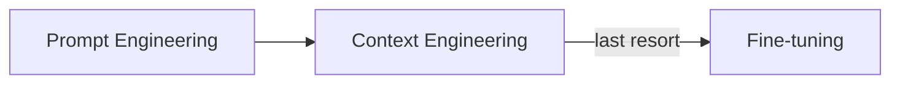
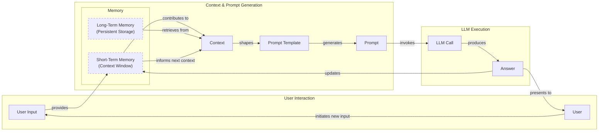
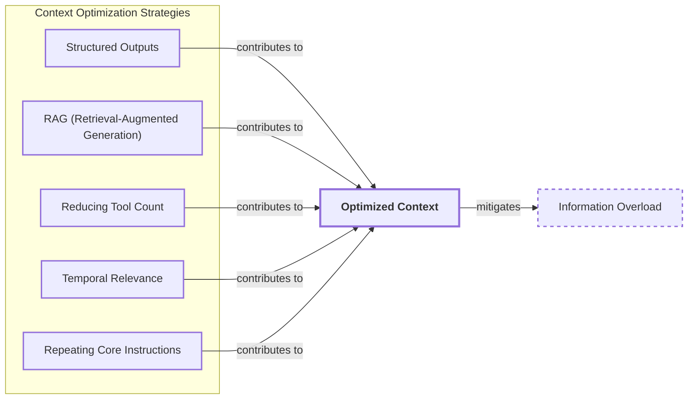
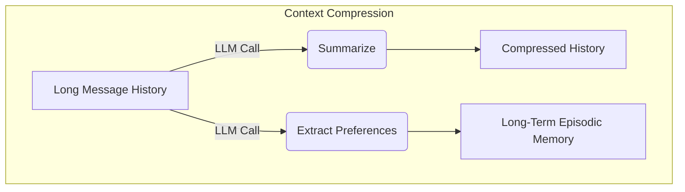
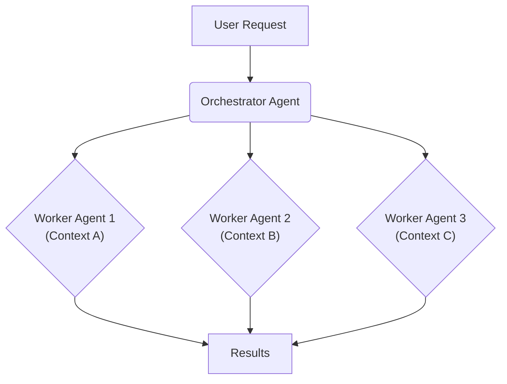

# Lesson 3: Context Engineering

## When prompt engineering breaks

AI applications have evolved rapidly from simple chatbots in 2022 to the memory-enabled agents we build today. In our last lesson, we explored how to choose between AI agents and LLM workflows. As these systems grow more complex, prompt engineering is no longer enough. It optimizes single LLM calls but fails when managing memory, actions, and long interaction histories [[1]](https://www.securityindustry.org/2024/07/16/understanding-the-evolution-from-classic-chatbots-to-rag-chatbots-to-ai-powered-assistants/), [[2]](https://www.linkedin.com/posts/ai-apps-central_most-people-put-all-ai-systems-in-the-same-activity-7438555783077793792-UEUm).

The volume of information an agent might need has grown exponentially. This includes past conversations, user data, and documents. Stuffing this all into a prompt is not a viable strategy. The solution is context engineering, the discipline of orchestrating this information ecosystem to ensure the LLM gets exactly what it needs. This skill is an essential foundation for AI engineering.

## From Prompt to Context Engineering

Prompt engineering is designed for single, stateless interactions, treating each LLM call as an isolated event. This approach fails in stateful applications where context must be managed across multiple turns. As context grows, performance degrades due to context decay, where the model gets confused by noise [[3]](https://packmind.com/context-engineering-ai-coding/what-is-contextops/), [[4]](https://www.sundeepteki.org/blog/from-vibe-coding-to-context-engineering-a-blueprint-for-production-grade-genai-systems).

Even with large context windows, every token adds to cost and latency. We will explore these concepts in more detail in upcoming lessons, including memory and Retrieval-Augmented Generation (RAG). We learned this the hard way on a project where stuffing everything into a million-token context resulted in a 30-minute, low-quality workflow [[5]](https://redis.io/blog/context-window-overflow/), [[6]](https://www.comet.com/site/blog/context-window/).

The solution is context engineering. It shifts the focus from static prompts to dynamic systems that manage information flow. Your job is to select only critical context for each LLM call, making applications accurate, fast, and cost-effective [[7]](https://www.glean.com/blog/context-engineering-ai-the-foundation-of-reliable-high-performing-models), [[8]](https://www.mezmo.com/learn-observability/context-engineering-for-observability-how-to-deliver-the-right-data-to-llms).

## Understanding Context Engineering

Context engineering is an optimization problem: finding the ideal way to arrange information from memory into the context passed to an LLM [[9]](https://arxiv.org/pdf/2507.13334). For example, a cooking agent needs a specific recipe and user allergies, not the entire cookbook. This precision ensures the model receives only essential information.

Andrej Karpathy explains that LLMs are like a new kind of operating system where the model is the CPU and its context window is the RAM. Just as an operating system manages what fits into RAM, context engineering curates what occupies the model’s working memory [[10]](https://www.langchain.com/blog/context-engineering-for-agents/), [[11]](https://www.glean.com/perspectives/context-engineering-vs-prompt-engineering-key-differences-explained), [[12]](https://atlan.com/know/working-memory-llms/).

Prompt engineering is a subset of context engineering. You still write effective prompts, but you also design a system that feeds the right context into them. This means understanding not just *how* to phrase a task, but *what* information the model needs. The key differences are summarized in Table 1.

| Dimension | Prompt Engineering | Context Engineering |
| :--- | :--- | :--- |
| Scope | Single interaction optimization | Entire information ecosystem |
| State Management | Primarily stateless | Inherently stateful, with explicit memory management |
| Focus | How to phrase tasks | What information to provide |

Table 1: A comparison of prompt engineering and context engineering.

Context engineering is the new fine-tuning. While fine-tuning has its place, it is expensive and inflexible. For most enterprise use cases, you get better results faster and more cheaply with context engineering. Your decision-making process should follow the workflow in Image 1 [[13]](https://www.linkedin.com/posts/denis-panjuta_prompt-engineering-vs-context-engineering-activity-7363945251180322816-1q_m), [[14]](https://memgraph.com/blog/prompt-engineering-vs-context-engineering), [[8]](https://www.mezmo.com/learn-observability/context-engineering-for-observability-how-to-deliver-the-right-data-to-llms).


Image 1: A simplified flowchart illustrating the decision-making workflow in AI application development.

For instance, to process internal Slack messages, you do not need to fine-tune a model. It is more effective to use a powerful reasoning model and engineer the context to retrieve specific messages and enable actions. Throughout this course, we will focus on solving problems using context engineering.

## What Makes Up the Context

To master context engineering, you must understand what "context" is. It is everything the LLM sees in a single turn, dynamically assembled from various memory components.

The high-level workflow, shown in Image 2, begins when user input triggers the system to pull information from memory. This information is assembled into the final context, inserted into a prompt template, and sent to the LLM. The LLM’s answer then updates the memory, and the cycle repeats.


Image 2: A high-level workflow diagram showing the cyclical process of context utilization in an LLM application.

These components are grouped into two main categories, which we will explain intuitively.

### Short-Term Working Memory

Short-term working memory is the agent's state for the current task. It is volatile and helps maintain a coherent dialogue. It can include user input, message history, the agent's internal thoughts, and the results from any actions it has performed [[15]](https://www.dailydoseofds.com/llmops-crash-course-part-8/), [[17]](https://www.datacamp.com/blog/how-does-llm-memory-work), [[18]](https://skymod.tech/why-memory-matters-in-llm-agents-short-term-vs-long-term-memory-architectures/).

### Long-Term Memory

Long-term memory stores information across sessions. We divide it into three types, drawing parallels from human memory [[12]](https://atlan.com/know/working-memory-llms/), [[16]](https://www.analyticsvidhya.com/blog/2026/01/how-does-llm-memory-work/).

**Procedural memory** is knowledge encoded directly in the code. It includes the system prompt, action definitions, and schemas for structured outputs. This represents the agent's built-in skills.

**Episodic memory** contains specific past experiences, like user preferences or previous interactions. It allows the agent to personalize its responses and is often stored in vector or graph databases.

**Semantic memory** is the agent’s general knowledge base. It can be internal company documents or external information accessed via APIs. This provides the factual information the agent needs.

We will cover these concepts in-depth in future lessons.

https://substackcdn.com/image/fetch/$s_!hR60!,w_1456,c_limit,f_auto,q_auto:good,fl_progressive:steep/https%3A%2F%2Fsubstack-post-media.s3.amazonaws.com%2Fpublic%2Fimages%2F39dce26a-e51e-4167-ac9e-ca28c45b53a6_1115x708.png 
Image 3: A detailed illustration of how all the context engineering components work together inside an AI agent (Source [Decoding AI Magazine](https://www.decodingai.com/p/context-engineering-2025s-1-skill))

These components are dynamically re-computed for every interaction. Context engineering involves selecting the right pieces from this memory pool to construct the most effective prompt.

## Production Implementation Challenges

Now that we understand what makes up the context, let's look at the core challenges of implementing it in production. These challenges all revolve around a single question: *"How can I keep my context as small as possible while providing enough information to the LLM?"*

Here are four common issues that come up when building AI applications:

1.  **The context window challenge:** Every AI model has a limited context window, the maximum amount of information it can process at once. It is like your computer's RAM. While context windows are getting larger, they are not infinite, and treating them as such leads to other problems due to the quadratic computational overhead of the self-attention mechanism [[5]](https://redis.io/blog/context-window-overflow/), [[9]](https://arxiv.org/pdf/2507.13334).
2.  **Information overload:** Too much context reduces the performance of the LLM by confusing it. This is known as the *"lost-in-the-middle"* problem, where models remember information best at the beginning and end of the context. Information in the middle is often overlooked, and performance can drop long before the physical context limit is reached [[19]](https://www.linkedin.com/pulse/lost-middle-lesson-failing-ai-agents-backwards-anthony-dejohn-01k2e), [[20]](https://dev.to/thousand_miles_ai/the-lost-in-the-middle-problem-why-llms-ignore-the-middle-of-your-context-window-3al2), [[21]](https://www.trychroma.com/research/context-rot).
3.  **Context drift:** This occurs when conflicting views of truth accumulate in the memory over time. For example, if the memory contains two conflicting statements about a user's preference, the model's responses become unreliable [[22]](https://galileo.ai/blog/production-llm-monitoring-strategies), [[23]](https://www.coforge.com/what-we-know/blog/navigating-the-shifting-sands-understanding-and-mitigating-data-drift-in-llms).
4.  **Action confusion:** This challenge arises when an agent has too many actions, especially with poorly written descriptions. The agent gets paralyzed by choice or picks the wrong action, leading to failed tasks [[9]](https://arxiv.org/pdf/2507.13334).

## Key Strategies for Context Optimization

Modern AI solutions must manage complexity across multiple knowledge bases, actions, and conversational histories. Context engineering is about managing this complexity while meeting performance, latency, and cost requirements.

Here are four popular context engineering strategies:

### Selecting the Right Context

Retrieving the right information is an important first step. To solve information overload, you can use several approaches. **Structured outputs** define a clear contract for what the LLM should return, allowing you to pass only necessary information to downstream steps. We will cover this in detail in Lesson 4. Instead of providing entire documents, use **Retrieval-Augmented Generation (RAG)** to fetch only the specific chunks of text needed to answer a user's question, a core topic we will explore in Lesson 10. Rather than giving an agent access to every available action, you can **reduce the number of available actions** by delegating subsets to specialized components, which we will see in Lesson 5. For time-sensitive information, **rank it by date** and filter out anything no longer relevant. Finally, **repeat core instructions** at both the start and the end of the prompt to ensure they are not overlooked [[9]](https://arxiv.org/pdf/2507.13334), [[24]](https://promptmetheus.com/resources/llm-knowledge-base/lost-in-the-middle-effect).


Image 4: A concept map illustrating key strategies for optimizing context selection for LLMs.

### Context Compression

As message history grows, you must manage past interactions to keep your context window in check. You can compress key facts from the past by using an LLM to create **summaries of past interactions**, **moving user preferences to long-term memory**, or using **deduplication** to remove redundant information [[25]](https://oneuptime.com/blog/post/2026-01-30-context-compression/view), [[26]](https://datahub.com/blog/context-window-optimization/).


Image 5: A diagram showing how context can be compressed by summarizing history and extracting preferences to long-term memory.

### Isolating Context

Another powerful strategy is to isolate context by splitting information across multiple agents. Instead of one agent with a massive context, you can have a team of agents, each with a smaller, focused context. We often implement this using an orchestrator-worker pattern, where a central agent assigns sub-tasks to specialized workers, preventing interference and improving performance. We will cover this pattern in more detail in Lesson 5 [[27]](https://beam.ai/agentic-insights/multi-agent-orchestration-patterns-production), [[28]](https://gurusup.com/blog/multi-agent-orchestration-guide).


Image 6: The orchestrator-worker pattern isolates context across multiple specialized agents.

### Format Optimizations

Finally, the way you format the context matters. Using clear delimiters like **XML tags** helps the model distinguish between different types of information. When providing structured data, prefer **YAML over JSON**, as it is often more token-efficient. Understanding what occupies your context window at every step is key, which is why monitoring is so important [[29]](https://www.decodingai.com/p/context-engineering-2025s-1-skill), [[30]](https://www.anthropic.com/engineering/effective-context-engineering-for-ai-agents).

## Here is an Example

Let's connect theory with concrete examples. Context engineering is applied in various domains:

*   **Healthcare:** An AI assistant accesses a patient's history, symptoms, and medical literature to provide personalized diagnostic support [[29]](https://www.decodingai.com/p/context-engineering-2025s-1-skill), [[31]](https://www.mdpi.com/2079-9292/13/15/2961).
*   **Financial Services:** AI systems integrate with CRMs and market data to generate tailored financial advice.
*   **Project Management:** AI systems access enterprise tools like Slack and task managers to automatically update project tasks.

Let's walk through the healthcare assistant scenario. A user asks: `I have a headache. What can I do to stop it? I would prefer not to take any medicine.`

Before answering, a context engineering system performs several steps:

1.  It retrieves the user's patient history and preferences from episodic memory [[32]](https://labelstud.io/learningcenter/episodic-vs-persistent-memory-in-llms/).
2.  It queries a medical database for non-medicinal headache remedies from semantic memory [[17]](https://www.datacamp.com/blog/how-does-llm-memory-work).
3.  It assembles this information into a structured prompt and calls the LLM.
4.  Finally, it presents a personalized, context-aware answer.

Here’s a simplified example showing how the prompt might be structured, using XML tags and YAML for clarity [[29]](https://www.decodingai.com/p/context-engineering-2025s-1-skill).

```
<system_prompt>
You are a helpful AI healthcare assistant. Provide safe, non-medicinal advice based on the provided context.
</system_prompt>

<patient_history>
patient:
  preferences: {medication_avoidance: true}
  habits: {stress_level: high, caffeine_intake: 3-4_cups_daily}
</patient_history>

<medical_knowledge>
articles:
  - {topic: dehydration_headaches, finding: "Dehydration is a common cause of tension headaches."}
  - {topic: caffeine_withdrawal, finding: "Caffeine withdrawal can trigger headaches."}
</medical_knowledge>

<user_query>
I have a headache. What can I do to stop it? I would prefer not to take any medicine.
</user_query>
```

To build such a system, you need a robust tech stack. A potential stack includes an LLM like **Gemini**, an orchestration framework like **LangGraph**, databases like **PostgreSQL** or **Qdrant**, and observability platforms like **Opik** or **LangSmith** [[33]](https://blog.stackademic.com/context-engineering-in-llms-and-ai-agents-eb861f0d3e9b), [[34]](https://atlan.com/know/context-engineering-platforms-comparison/), [[35]](https://www.scalablepath.com/machine-learning/langgraph).

## Connecting Context Engineering to AI Engineering

Mastering context engineering is about building the intuition to craft effective prompts and arrange context for optimal results. It is a multidisciplinary practice that combines several key engineering fields [[8]](https://www.mezmo.com/learn-observability/context-engineering-for-observability-how-to-deliver-the-right-data-to-llms), [[36]](https://sombrainc.com/blog/ai-context-engineering-guide):

1.  **AI Engineering:** Implementing solutions like RAG and AI Agents.
2.  **Software Engineering:** Building scalable and maintainable systems.
3.  **Data Engineering:** Designing reliable data pipelines for memory systems.
4.  **Operations:** Deploying agents on proper infrastructure to ensure they are observable and scalable.

Our goal is to teach you how to combine these skills to build production-ready AI products, shifting your mindset from a developer to an architect. In the next lesson, we will explore structured outputs.

## References

- [1] [https://www.securityindustry.org/2024/07/16/understanding-the-evolution-from-classic-chatbots-to-rag-chatbots-to-ai-powered-assistants/](https://www.securityindustry.org/2024/07/16/understanding-the-evolution-from-classic-chatbots-to-rag-chatbots-to-ai-powered-assistants/)
- [2] [https://www.linkedin.com/posts/ai-apps-central_most-people-put-all-ai-systems-in-the-same-activity-7438555783077793792-UEUm](https://www.linkedin.com/posts/ai-apps-central_most-people-put-all-ai-systems-in-the-same-activity-7438555783077793792-UEUm)
- [3] [https://packmind.com/context-engineering-ai-coding/what-is-contextops/](https://packmind.com/context-engineering-ai-coding/what-is-contextops/)
- [4] [https://www.sundeepteki.org/blog/from-vibe-coding-to-context-engineering-a-blueprint-for-production-grade-genai-systems](https://www.sundeepteki.org/blog/from-vibe-coding-to-context-engineering-a-blueprint-for-production-grade-genai-systems)
- [5] [https://redis.io/blog/context-window-overflow/](https://redis.io/blog/context-window-overflow/)
- [6] [https://www.comet.com/site/blog/context-window/](https://www.comet.com/site/blog/context-window/)
- [7] [https://www.glean.com/blog/context-engineering-ai-the-foundation-of-reliable-high-performing-models](https://www.glean.com/blog/context-engineering-ai-the-foundation-of-reliable-high-performing-models)
- [8] [https://www.mezmo.com/learn-observability/context-engineering-for-observability-how-to-deliver-the-right-data-to-llms](https://www.mezmo.com/learn-observability/context-engineering-for-observability-how-to-deliver-the-right-data-to-llms)
- [9] [https://arxiv.org/pdf/2507.13334](https://arxiv.org/pdf/2507.13334)
- [10] [https://www.langchain.com/blog/context-engineering-for-agents/](https://www.langchain.com/blog/context-engineering-for-agents/)
- [11] [https://www.glean.com/perspectives/context-engineering-vs-prompt-engineering-key-differences-explained](https://www.glean.com/perspectives/context-engineering-vs-prompt-engineering-key-differences-explained)
- [12] [https://atlan.com/know/working-memory-llms/](https://atlan.com/know/working-memory-llms/)
- [13] [https://www.linkedin.com/posts/denis-panjuta_prompt-engineering-vs-context-engineering-activity-7363945251180322816-1q_m](https://www.linkedin.com/posts/denis-panjuta_prompt-engineering-vs-context-engineering-activity-7363945251180322816-1q_m)
- [14] [https://memgraph.com/blog/prompt-engineering-vs-context-engineering](https://memgraph.com/blog/prompt-engineering-vs-context-engineering)
- [15] [https://www.dailydoseofds.com/llmops-crash-course-part-8/](https://www.dailydoseofds.com/llmops-crash-course-part-8/)
- [16] [https://www.analyticsvidhya.com/blog/2026/01/how-does-llm-memory-work/](https://www.analyticsvidhya.com/blog/2026/01/how-does-llm-memory-work/)
- [17] [https://www.datacamp.com/blog/how-does-llm-memory-work](https://www.datacamp.com/blog/how-does-llm-memory-work)
- [18] [https://skymod.tech/why-memory-matters-in-llm-agents-short-term-vs-long-term-memory-architectures/](https://skymod.tech/why-memory-matters-in-llm-agents-short-term-vs-long-term-memory-architectures/)
- [19] [https://www.linkedin.com/pulse/lost-middle-lesson-failing-ai-agents-backwards-anthony-dejohn-01k2e](https://www.linkedin.com/pulse/lost-middle-lesson-failing-ai-agents-backwards-anthony-dejohn-01k2e)
- [20] [https://dev.to/thousand_miles_ai/the-lost-in-the-middle-problem-why-llms-ignore-the-middle-of-your-context-window-3al2](https://dev.to/thousand_miles_ai/the-lost-in-the-middle-problem-why-llms-ignore-the-middle-of-your-context-window-3al2)
- [21] [https://www.trychroma.com/research/context-rot](https://www.trychroma.com/research/context-rot)
- [22] [https://galileo.ai/blog/production-llm-monitoring-strategies](https://galileo.ai/blog/production-llm-monitoring-strategies)
- [23] [https://www.coforge.com/what-we-know/blog/navigating-the-shifting-sands-understanding-and-mitigating-data-drift-in-llms](https://www.coforge.com/what-we-know/blog/navigating-the-shifting-sands-understanding-and-mitigating-data-drift-in-llms)
- [24] [https://promptmetheus.com/resources/llm-knowledge-base/lost-in-the-middle-effect](https://promptmetheus.com/resources/llm-knowledge-base/lost-in-the-middle-effect)
- [25] [https://oneuptime.com/blog/post/2026-01-30-context-compression/view](https://oneuptime.com/blog/post/2026-01-30-context-compression/view)
- [26] [https://datahub.com/blog/context-window-optimization/](https://datahub.com/blog/context-window-optimization/)
- [27] [https://beam.ai/agentic-insights/multi-agent-orchestration-patterns-production](https://beam.ai/agentic-insights/multi-agent-orchestration-patterns-production)
- [28] [https://gurusup.com/blog/multi-agent-orchestration-guide](https://gurusup.com/blog/multi-agent-orchestration-guide)
- [29] [https://www.decodingai.com/p/context-engineering-2025s-1-skill](https://www.decodingai.com/p/context-engineering-2025s-1-skill)
- [30] [https://www.anthropic.com/engineering/effective-context-engineering-for-ai-agents](https://www.anthropic.com/engineering/effective-context-engineering-for-ai-agents)
- [31] [https://www.mdpi.com/2079-9292/13/15/2961](https://www.mdpi.com/2079-9292/13/15/2961)
- [32] [https://labelstud.io/learningcenter/episodic-vs-persistent-memory-in-llms/](https://labelstud.io/learningcenter/episodic-vs-persistent-memory-in-llms/)
- [33] [https://blog.stackademic.com/context-engineering-in-llms-and-ai-agents-eb861f0d3e9b](https://blog.stackademic.com/context-engineering-in-llms-and-ai-agents-eb861f0d3e9b)
- [34] [https://atlan.com/know/context-engineering-platforms-comparison/](https://atlan.com/know/context-engineering-platforms-comparison/)
- [35] [https://www.scalablepath.com/machine-learning/langgraph](https://www.scalablepath.com/machine-learning/langgraph)
- [36] [https://sombrainc.com/blog/ai-context-engineering-guide](https://sombrainc.com/blog/ai-context-engineering-guide)