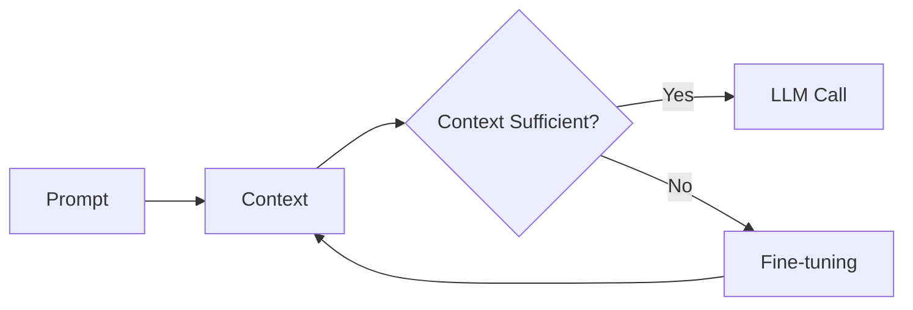
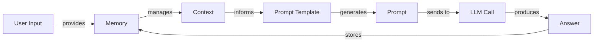
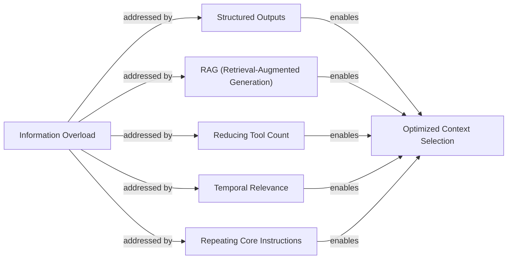
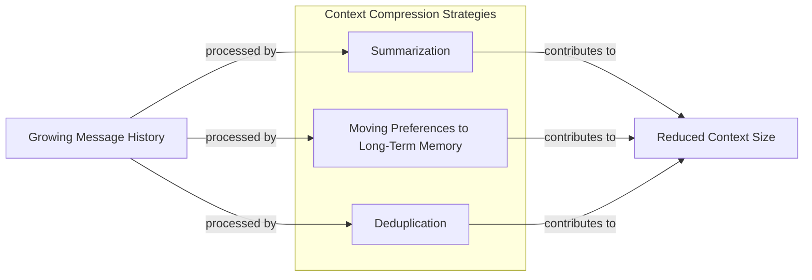
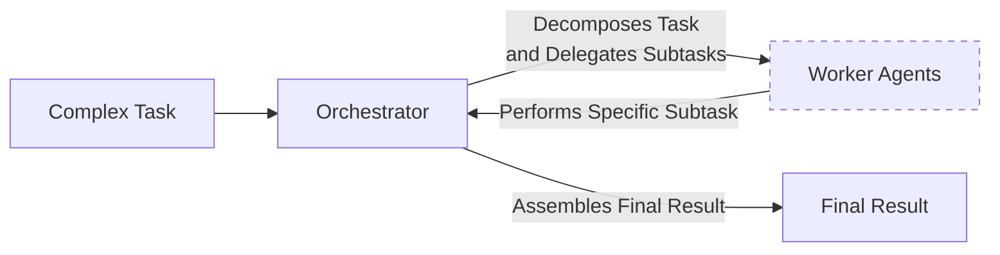

# Context Engineering

AI applications have evolved rapidly. In 2022, we had simple chatbots for question-answering. By 2023, Retrieval-Augmented Generation (RAG) systems connected LLMs to domain-specific knowledge. 2024 brought us tool-using agents that could perform actions. Now, we are building memory-enabled agents that remember past interactions and build relationships over time [[26]](https://www.securityindustry.org/2024/07/16/understanding-the-evolution-from-classic-chatbots-to-rag-chatbots-to-ai-powered-assistants/).

In our last lesson, we explored how to choose between AI agents and LLM workflows when designing a system. As these applications grow more complex, prompt engineering, a practice that once served us well, is showing its limits. It optimizes single LLM calls but fails when managing systems with memory, actions, and long interaction histories [[52]](https://memgraph.com/blog/prompt-engineering-vs-context-engineering). The sheer volume of information an agent might need—past conversations, user data, documents, and action descriptions—has grown exponentially. Simply stuffing all this into a prompt is not a viable strategy. This is where context engineering comes in. It is the discipline of orchestrating this entire information ecosystem to ensure the LLM gets exactly what it needs, when it needs it. This skill is becoming a core foundation for AI engineering.

## From prompt to context engineering

Prompt engineering, while effective for simple tasks, is designed for single, stateless interactions. It treats each call to an LLM as a new, isolated event. This approach breaks down in stateful applications where context must be preserved and managed across multiple turns [[guideline_exploitation file="humanlayer_12-factor-agents.md"]](https://github.com/humanlayer/12-factor-agents/blob/main/content/factor-03-own-your-context-window.md).

As a conversation or task progresses, the context grows. Without a strategy to manage this growth, the LLM’s performance degrades. This is context decay: the model gets confused by the noise of an ever-expanding history. It starts to lose track of the original instructions or key information [[8]](https://thenewstack.io/context-rot-enterprise-ai-llms/).

Even with large context windows, a physical limit exists for what you can include. Also, on the operational side, every token adds to the cost and latency of an LLM call [[1]](https://atlan.com/know/llm-context-window-limitations/). Simply putting everything into the context creates a slow, expensive, and underperforming system. We will explore these concepts in more detail in upcoming lessons.

On a recent project, we learned this the hard way. We were working with a model that supported a million-token context window, so we thought, "*What could go wrong*?" We stuffed everything in: our research, guidelines, examples, and user history. The result was an LLM workflow that took minutes to run and produced low-quality outputs.

This is where context engineering becomes essential. It shifts the focus from crafting static prompts to building dynamic systems that manage information flow. As an AI engineer, your job is to select only the most critical pieces of context for each LLM call. This makes your applications accurate, fast, and cost-effective [[guideline_exploitation file="context-engineering-guide.md"]](https://nlp.elvissaravia.com/p/context-engineering-guide).

## Understanding context engineering

Context engineering involves finding the optimal way to arrange information from your application's memory into the context passed to an LLM [[guideline_exploitation file="context-engineering-what-it-is-and-techniques-to-consider.md"]](https://www.llamaindex.ai/blog/context-engineering-what-it-is-and-techniques-to-consider). It is a solution to an optimization problem where you retrieve the right parts from your memory to solve a specific task without overwhelming the model. For example, when you ask a cooking agent for a recipe, you do not give it the entire cookbook. Instead, you retrieve the specific recipe, along with personal context like allergies or taste preferences. This precise selection ensures the model receives only the essential information.

Andrej Karpathy explains that LLMs are like a new kind of operating system where the model is the CPU and its context window is the RAM [[31]](https://www.langchain.com/blog/context-engineering-for-agents). Just as an operating system manages what fits into your computer’s limited RAM, context engineering manages what information occupies the model’s limited context window.

How does context engineering relate to prompt engineering? It's simple. Prompt engineering is a subset of context engineering [[20]](https://blog.langchain.com/the-rise-of-context-engineering/). You still write effective prompts, but you also design a system that feeds the right context into those prompts. This means understanding not just *how* to phrase a task, but *what* information the model needs to perform optimally.

| Dimension | Prompt Engineering | Context Engineering |
| --- | --- | --- |
| Scope | Single interaction optimization | Entire information ecosystem |
| State Management | Stateless function | Stateful due to memory |
| Focus | How to phrase tasks | What information to provide |

Table 1: A comparison of prompt engineering and context engineering.

Context engineering is the new fine-tuning. While fine-tuning has its place, it is expensive, time-consuming, and inflexible. Data changes constantly, making fine-tuning a last resort [[51]](https://www.linkedin.com/posts/denis-panjuta_prompt-engineering-vs-context-engineering-activity-7363945251180322816-1q_m). For most enterprise use cases, you get better results faster and more cheaply with context engineering. It allows for rapid iteration and adaptation to evolving data without altering the core model.

When you start a new AI project, your decision-making process for guiding the LLM should look like the one presented in Image 1.



Image 1: A simplified flowchart illustrating the decision-making workflow for AI applications.

For instance, if you build an agent to process internal Slack messages, you do not need to fine-tune a model on your company’s communication style. It is more effective to use a powerful reasoning model and engineer the context to retrieve specific messages and enable actions like creating tasks or drafting emails. Throughout this course, we will show you how to solve most industry problems using only context engineering.

## What makes up the context

To master context engineering, you first need to understand what "context" actually is. It is everything the LLM sees in a single turn, dynamically assembled from various memory components before being passed to the model [[guideline_exploitation file="A Survey of Context Engineering for Large Language Models"]](https://arxiv.org/pdf/2507.13334).

The high-level workflow, as presented in Image 2, begins when a user input triggers the system to pull relevant information from memory. This information is assembled into the final context, inserted into a prompt template, and sent to the LLM. The LLM’s answer then updates the memory, and the cycle repeats.



Image 2: A simplified flowchart illustrating the high-level workflow of how context is processed in an LLM application.

These components are grouped into two main categories. We will explain them intuitively for now, as we have future dedicated lessons for all of them.

### Short-Term Working Memory

Short-term working memory is the state of the agent for the current task or conversation. It is volatile and changes with each interaction, helping the agent maintain a coherent dialogue and make immediate decisions. It can include some or all of these components [[37]](https://www.datacamp.com/blog/how-does-llm-memory-work):

-   **User input:** The most recent query or command from the user.
-   **Message history:** The log of the current conversation, allowing the LLM to understand the flow and previous turns.
-   **Agent's internal thoughts:** The reasoning steps the agent takes to decide on its next action.
-   **Action calls and outputs:** The results from any actions the agent has performed, providing information from external systems.

### Long-Term Memory

Long-term memory is more persistent and stores information across sessions, allowing the AI system to remember things beyond a single conversation. We divide it into three types, drawing parallels from human memory [[38]](https://www.analyticsvidhya.com/blog/2026/01/how-does-llm-memory-work/). This parallel is more than an analogy; it inspires active research into LLM architectures that mimic how the human brain organizes and retrieves memories. For instance, some systems are designed to segment information into coherent episodic events, allowing for more natural and efficient recall over long histories [[66]](https://openreview.net/forum?id=BI2int5SAC). An AI system can include some or all of them:

-   **Procedural memory:** Knowledge encoded in the code, like the system prompt, action definitions, and output schemas. This defines the agent's built-in skills.
-   **Episodic memory:** Memory of specific past experiences, like user preferences. It is used for personalization and typically stored in vector or graph databases for efficient retrieval [[40]](https://labelstud.io/learningcenter/episodic-vs-persistent-memory-in-llms/).
-   **Semantic memory:** This is the agent’s general knowledge base. It can be internal, like company documents, or external, accessed via the internet through API calls. This memory provides the factual information the agent needs to answer questions [[39]](https://skymod.tech/why-memory-matters-in-llm-agents-short-term-vs-long-term-memory-architectures/).

If this seems like a lot, bear with us. We will cover all these concepts in-depth in future lessons, including structured outputs, actions, memory, and RAG.

The key takeaway is that these components are not static. They are dynamically re-computed for every single interaction. Context engineering involves knowing how to select the right pieces from this vast memory pool to construct the most effective prompt for the task at hand [[guideline_exploitation file="context-engineering-guide.md"]](https://nlp.elvissaravia.com/p/context-engineering-guide).

## Production implementation challenges

Now that we understand what makes up the context, let's look at the core challenges of implementing it in production. These challenges all revolve around keeping the context small yet informative.

Here are four common issues that come up when building AI applications:

1.  **The context window challenge:** Every AI model has a limited context window, the maximum amount of information (tokens) it can process at once. While context windows are getting larger, they are not infinite, and treating them as such leads to other problems [[1]](https://atlan.com/know/llm-context-window-limitations/).
2.  **Information overload:** Just because you can fit a lot of information into the context does not mean you should. Too much context reduces the LLM's performance. This is known as the "lost-in-the-middle" problem, where models struggle with information in the middle of long inputs. This phenomenon is a direct consequence of the transformer architecture’s inherent positional biases, which give less weight to information in the middle of the sequence [[67]](https://openreview.net/forum?id=YufVk7I6Ii), [[56]](https://www.linkedin.com/pulse/lost-middle-lesson-failing-ai-agents-backwards-anthony-dejohn-01k2e), [[58]](https://dev.to/thousand_miles_ai/the-lost-in-the-middle-problem-why-llms-ignore-the-middle-of-your-context-window-3al2).
3.  **Context drift:** This occurs when conflicting views of truth accumulate in the memory over time. For example, the memory might contain two conflicting statements: "*My cat is white*" and "*My cat is black*." This data conflict confuses the LLM. Without a mechanism to resolve these conflicts, the model's responses become unreliable [[6]](https://galileo.ai/blog/production-llm-monitoring-strategies).
4.  **Tool confusion:** This arises when an agent has too many actions available. Providing a large number of tools can confuse the LLM about which one is best for the job. Confusion can also occur when tool descriptions are poorly written or overlap, making it difficult for the model to choose correctly [[guideline_exploitation file="context-engineering.md"]](https://www.datacamp.com/blog/context-engineering).

## Key strategies for context optimization

Initially, most AI applications were chatbots over single knowledge bases. Today, modern AI solutions must manage multiple knowledge bases, tools, and complex conversational histories. Context engineering is about managing this complexity while meeting performance, latency, and cost requirements.

Here are four popular context engineering strategies used across the industry:

### Selecting the Right Context

Retrieving the right information from memory is a critical first step. A common mistake is to provide everything at once. The "lost-in-the-middle" problem often leads to poor performance, increased latency, and higher costs [[59]](https://atlan.com/know/llm-context-window-limitations/).



Image 3: Strategies for selecting the right context to avoid information overload and achieve optimized context selection.

To solve this, consider these approaches:

-   **Use structured outputs:** Define clear schemas for what the LLM should return. This allows you to pass only the necessary, structured information to downstream steps. We will cover this in detail in the next lesson.
-   **Use RAG:** Instead of providing entire documents, use RAG to fetch only the specific chunks of text needed to answer a user's question. This is a core topic we will explore in a future lesson.
-   **Reduce the number of available actions:** Rather than giving an agent access to every available action, use strategies to delegate action subsets to specialized components. Studies show that limiting the selection to under 30 tools can improve selection accuracy [[guideline_exploitation file="context-engineering.md"]](https://www.datacamp.com/blog/context-engineering).
-   **Rank time-sensitive data:** For time-sensitive information, rank it by date and filter out anything no longer relevant [[12]](https://www.dailydoseofds.com/llmops-crash-course-part-8/).
-   **Repeat core instructions:** Repeat the most important instructions at the start and end of the prompt. This directly leverages the transformer’s positional biases, as models pay more attention to the beginning and end of the context, ensuring core instructions are not lost [[68]](https://dev.to/qvfagundes/positional-encodings-and-context-window-engineering-why-token-order-matters-13h), [[57]](https://promptmetheus.com/resources/llm-knowledge-base/lost-in-the-middle-effect).

### Context Compression

As message history grows, you must manage past interactions to keep your context window in check. You cannot simply drop past conversation turns; instead, you need ways to compress key facts.



Image 4: A simplified diagram illustrating strategies for "Context Compression" to manage growing message history.

You can do this through summarization of past interactions, moving user preferences to long-term memory, and deduplication to remove redundant information [[11]](https://oneuptime.com/blog/post/2026-01-30-context-compression/view).

### Isolating Context

Another powerful strategy is to isolate context by splitting information across multiple agents or LLM workflows. Instead of one agent with a massive, cluttered context window, you can have a team of agents, each with a smaller, focused context.



Image 5: A simplified diagram illustrating the Orchestrator-Worker Pattern for Isolating Context.

We often implement this using an orchestrator-worker pattern, where a central orchestrator agent breaks down a problem and assigns sub-tasks to specialized worker agents [[46]](https://beam.ai/agentic-insights/multi-agent-orchestration-patterns-production). Each worker operates in its own isolated context, improving focus and allowing for parallel processing. We will cover this pattern in more detail in a future lesson.

### Format Optimization

Finally, the way you format the context matters. Models are sensitive to structure, and using clear delimiters can improve performance. Common strategies are to use XML tags to wrap different pieces of context (e.g., `<user_query>`) and prefer YAML over JSON for structured data, as it is often more token-efficient [[41]](https://www.decodingai.com/p/context-engineering-2025s-1-skill).

## Here is an example

Let's connect the theory with a concrete example. Consider these common real-world scenarios:

-   **Healthcare:** An AI assistant accesses a patient's medical history, symptoms, and medical literature to provide diagnostic support [[41]](https://www.decodingai.com/p/context-engineering-2025s-1-skill).
-   **Financial Services:** AI systems integrate with CRMs and calendars, combining market data and client portfolios to generate financial advice.
-   **Project Management:** AI systems access CRMs and task managers to understand project requirements and update tasks.
-   **Content Creator Assistant:** An AI agent uses your research, past content, and personality to create new content.

Let's walk through a query for the healthcare assistant. A user asks: `I have a headache. What can I do to stop it? I would prefer not to take any medicine.`

Before answering, a context engineering system performs several steps: it retrieves the user's patient history, queries a medical database for non-medicinal remedies, assembles this information, formats it into a structured prompt, and calls the LLM to generate a personalized response [[41]](https://www.decodingai.com/p/context-engineering-2025s-1-skill).

Here is a simplified pseudocode snippet showing how you might structure the context using XML and YAML:

```xml
<system_prompt>
You are a helpful AI medical assistant...
</system_prompt>

<patient_history>
patient:
  name: John Doe
  age: 45
  ...
  preferences:
    medication_avoidance: true
</patient_history>

<medical_literature>
articles:
  - topic: dehydration_headaches
    finding: "Dehydration is a common cause..."
    ...
</medical_literature>

<user_query>
I have a headache... I would prefer not to take any medicine.
</user_query>
```

To build such a system, you need a robust tech stack. A potential stack we recommend and will use in this course includes Gemini for the LLM, LangGraph for orchestration, various databases like PostgreSQL or Neo4j, and observability tools like LangSmith [[62]](https://blog.stackademic.com/context-engineering-in-llms-and-ai-agents-eb861f0d3e9b), [[64]](https://atlan.com/know/context-engineering-platforms-comparison/), [[65]](https://www.scalablepath.com/machine-learning/langgraph).

## Connecting context engineering to AI engineering

Context engineering is more of an art than a science. It is about developing the intuition to craft effective prompts, select the right information from memory, and arrange context for optimal results. This discipline helps you determine the minimal yet essential information an LLM needs to perform at its best.

It's important to understand that context engineering cannot be learned in isolation. It is a complex field that combines:

1.  **AI Engineering:** Implement practical solutions such as LLM workflows, RAG, AI Agents, and evaluation pipelines.
2.  **Software Engineering (SWE):** Build your AI product with code that is scalable and maintainable.
3.  **Data Engineering:** Design data pipelines that feed curated and validated data into the memory layer.
4.  **Operations (Ops):** Deploy agents on the proper infrastructure to ensure they are reproducible, maintainable, and observable [[22]](https://www.mezmo.com/learn-observability/context-engineering-for-observability-how-to-deliver-the-right-data-to-llms).

Our goal with this course is to teach you how to combine these skills to build production-ready AI products. We like to say that in the world of AI, we should all think in systems rather than isolated components.

In the next lesson, we will explore structured outputs.

## References

- [1] LLM Context Window Limitations: Impacts, Risks, & Fixes in 2026. (n.d.). Atlan. [https://atlan.com/know/llm-context-window-limitations/](https://atlan.com/know/llm-context-window-limitations/)
- [2] Context window overflow: The silent killer of LLM applications. (n.d.). Redis. [https://redis.io/blog/context-window-overflow/](https://redis.io/blog/context-window-overflow/)
- [3] Hong, K., Troynikov, A., & Huber, J. (2025, July). Context Rot: How Increasing Input Tokens Impacts LLM Performance. Chroma. [https://www.trychroma.com/research/context-rot](https://www.trychroma.com/research/context-rot)
- [4] Sahin, S. (2025, February 21). The Common Failure Points of LLM RAG Systems and How to Overcome Them. Medium. [https://medium.com/@sahin.samia/the-common-failure-points-of-llm-rag-systems-and-how-to-overcome-them-926d9090a88f](https://medium.com/@sahin.samia/the-common-failure-points-of-llm-rag-systems-and-how-to-overcome-them-926d9090a88f)
- [5] Your 1M context window LLM is less powerful than you think. (2025, July 1). Towards Data Science. [https://towardsdatascience.com/your-1m-context-window-llm-is-less-powerful-than-you-think/](https://towardsdatascience.com/your-1m-context-window-llm-is-less-powerful-than-you-think/)
- [6] Production LLM Monitoring Strategies: A Practical Guide. (n.d.). Galileo. [https://galileo.ai/blog/production-llm-monitoring-strategies](https://galileo.ai/blog/production-llm-monitoring-strategies)
- [7] Navigating the Shifting Sands: Understanding and Mitigating Data Drift in LLMs. (n.d.). Coforge. [https://www.coforge.com/what-we-know/blog/navigating-the-shifting-sands-understanding-and-mitigating-data-drift-in-llms](https://www.coforge.com/what-we-know/blog/navigating-the-shifting-sands-understanding-and-mitigating-data-drift-in-llms)
- [8] Context Rot: The Silent Killer of Enterprise AI LLMs. (2025, July 16). The New Stack. [https://thenewstack.io/context-rot-enterprise-ai-llms/](https://thenewstack.io/context-rot-enterprise-ai-llms/)
- [9] The Hidden Cost of LLM Drift Detection. (n.d.). InsightFinder. [https://insightfinder.com/blog/hidden-cost-llm-drift-detection/](https://insightfinder.com/blog/hidden-cost-llm-drift-detection/)
- [10] How to Reduce LLM Hallucination: A Developer’s Guide. (n.d.). Helicone. [https://www.helicone.ai/blog/how-to-reduce-llm-hallucination](https://www.helicone.ai/blog/how-to-reduce-llm-hallucination)
- [11] Context Compression Techniques for LLM Applications. (2026, January 30). OneUptime. [https://oneuptime.com/blog/post/2026-01-30-context-compression/view](https://oneuptime.com/blog/post/2026-01-30-context-compression/view)
- [12] LLMOps Crash Course: Part 8 - Memory and Temporal Context. (n.d.). Daily Dose of DS. [https://www.dailydoseofds.com/llmops-crash-course-part-8/](https://www.dailydoseofds.com/llmops-crash-course-part-8/)
- [13] Efficient Context Compression in SLMs for Semantic Search. (2025, October 22). arXiv. [https://arxiv.org/html/2510.22101v1](https://arxiv.org/html/2510.22101v1)
- [14] Efficient Context Management in LLM Agents. (2025, December 1). JetBrains Research. [https://blog.jetbrains.com/research/2025/12/efficient-context-management/](https://blog.jetbrains.com/research/2025/12/efficient-context-management/)
- [16] How to Monitor and Optimize Your LLM’s Context Window. (n.d.). Comet. [https://www.comet.com/site/blog/context-window/](https://www.comet.com/site/blog/context-window/)
- [17] Mastering Context Window Optimization. (n.d.). DataHub. [https://datahub.com/blog/context-window-optimization/](https://datahub.com/blog/context-window-optimization/)
- [18] Context Window Management Strategies for Long-Context AI Agents and Chatbots. (n.d.). Maxim. [https://www.getmaxim.ai/articles/context-window-management-strategies-for-long-context-ai-agents-and-chatbots/](https://www.getmaxim.ai/articles/context-window-management-strategies-for-long-context-ai-agents-and-chatbots/)
- [20] Efficient Context Management in LLM Agents. (2025, December 1). JetBrains Research. [https://blog.jetbrains.com/research/2025/12/efficient-context-management/](https://blog.jetbrains.com/research/2025/12/efficient-context-management/)
- [21] Why AI coding assistants fail without context : an introduction to ContextOps. (n.d.). Packmind. [https://packmind.com/context-engineering-ai-coding/what-is-contextops/](https://packmind.com/context-engineering-ai-coding/what-is-contextops/)
- [22] Context Engineering for Observability: How to Deliver the Right Data to LLMs. (n.d.). Mezmo. [https://www.mezmo.com/learn-observability/context-engineering-for-observability-how-to-deliver-the-right-data-to-llms](https://www.mezmo.com/learn-observability/context-engineering-for-observability-how-to-deliver-the-right-data-to-llms)
- [23] AI Context Engineering Guide: Build Better AI Agents. (n.d.). Sombra. [https://sombrainc.com/blog/ai-context-engineering-guide](https://sombrainc.com/blog/ai-context-engineering-guide)
- [24] Master Data Pipeline Architecture: Best Practices for Engineers. (n.d.). Decube. [https://www.decube.io/post/master-data-pipeline-architecture-best-practices-for-engineers](https://www.decube.io/post/master-data-pipeline-architecture-best-practices-for-engineers)
- [25] Context Engineering AI: The Foundation of Reliable, High-Performing Models. (n.d.). Glean. [https://www.glean.com/blog/context-engineering-ai-the-foundation-of-reliable-high-performing-models](https://www.glean.com/blog/context-engineering-ai-the-foundation-of-reliable-high-performing-models)
- [26] Understanding the Evolution: From Classic Chatbots to RAG Chatbots to AI-Powered Assistants. (2024, July 16). Security Industry Association. [https://www.securityindustry.org/2024/07/16/understanding-the-evolution-from-classic-chatbots-to-rag-chatbots-to-ai-powered-assistants/](https://www.securityindustry.org/2024/07/16/understanding-the-evolution-from-classic-chatbots-to-rag-chatbots-to-ai-powered-assistants/)
- [27] The Evolution of AI Chatbots: From Generative AI to Autonomous AI Agents. (n.d.). pagergpt.ai. [https://pagergpt.ai/ai-chatbot/evolution-of-ai-chatbots](https://pagergpt.ai/ai-chatbot/evolution-of-ai-chatbots)
- [29] When Did AI Chatbots Start? A Brief History. (n.d.). Dante AI. [https://www.dante-ai.com/news/when-did-ai-chatbots-start](https://www.dante-ai.com/news/when-did-ai-chatbots-start)
- [31] Context Engineering. (2025, July 2). LangChain Blog. [https://blog.langchain.com/context-engineering-for-agents/](https://blog.langchain.com/context-engineering-for-agents/)
- [32] Context Engineering vs. Prompt Engineering: Key Differences Explained. (n.d.). Glean. [https://www.glean.com/perspectives/context-engineering-vs-prompt-engineering-key-differences-explained](https://www.glean.com/perspectives/context-engineering-vs-prompt-engineering-key-differences-explained)
- [33] Working Memory in LLMs: The Engineering View. (n.d.). Atlan. [https://atlan.com/know/working-memory-llms/](https://atlan.com/know/working-memory-llms/)
- [34] From Vibe Coding to Context Engineering: A Blueprint for Production-Grade GenAI Systems. (n.d.). Sundeep Teki. [https://www.sundeepteki.org/blog/from-vibe-coding-to-context-engineering-a-blueprint-for-production-grade-genai-systems](https://www.sundeepteki.org/blog/from-vibe-coding-to-context-engineering-a-blueprint-for-production-grade-genai-systems)
- [35] Roychowdhury, A. (2025, July 1). Context Engineering: The Silent Architecture Behind Every AI Agent. LinkedIn. [https://www.linkedin.com/pulse/context-engineering-silent-architecture-behind-every-ai-roychowdhury-lzcec](https://www.linkedin.com/pulse/context-engineering-silent-architecture-behind-every-ai-roychowdhury-lzcec)
- [36] Working Memory in LLMs: The Engineering View. (n.d.). Atlan. [https://atlan.com/know/working-memory-llms/](https://atlan.com/know/working-memory-llms/)
- [37] How Does LLM Memory Work? (n.d.). DataCamp. [https://www.datacamp.com/blog/how-does-llm-memory-work](https://www.datacamp.com/blog/how-does-llm-memory-work)
- [38] How Does LLM Memory Work? (2026, January 1). Analytics Vidhya. [https://www.analyticsvidhya.com/blog/2026/01/how-does-llm-memory-work/](https://www.analyticsvidhya.com/blog/2026/01/how-does-llm-memory-work/)
- [39] Why Memory Matters in LLM Agents: Short-Term vs. Long-Term Memory Architectures. (n.d.). Sky M.O.D. [https://skymod.tech/why-memory-matters-in-llm-agents-short-term-vs-long-term-memory-architectures/](https://skymod.tech/why-memory-matters-in-llm-agents-short-term-vs-long-term-memory-architectures/)
- [40] Episodic vs. Persistent Memory in LLMs. (n.d.). Label Studio. [https://labelstud.io/learningcenter/episodic-vs-persistent-memory-in-llms/](https://labelstud.io/learningcenter/episodic-vs-persistent-memory-in-llms/)
- [41] Context Engineering: 2025’s #1 Skill. (n.d.). Decoding AI. [https://www.decodingai.com/p/context-engineering-2025s-1-skill](https://www.decodingai.com/p/context-engineering-2025s-1-skill)
- [43] Prompt Engineering in Healthcare: A Comprehensive Review. (2025, July 1). MDPI. [https://www.mdpi.com/2079-9292/13/15/2961](https://www.mdpi.com/2079-9292/13/15/2961)
- [44] Effective Context Engineering for AI Agents. (n.d.). Anthropic. [https://www.anthropic.com/engineering/effective-context-engineering-for-ai-agents](https://www.anthropic.com/engineering/effective-context-engineering-for-ai-agents)
- [46] Multi-Agent Orchestration Patterns for Production. (n.d.). Beam.ai. [https://beam.ai/agentic-insights/multi-agent-orchestration-patterns-production](https://beam.ai/agentic-insights/multi-agent-orchestration-patterns-production)
- [47] The Definitive Guide to Multi-Agent Orchestration. (n.d.). GuruSup. [https://gurusup.com/blog/multi-agent-orchestration-guide](https://gurusup.com/blog/multi-agent-orchestration-guide)
- [48] Multi-Agent Systems: Building with Context Engineering. (n.d.). Vellum. [https://www.vellum.ai/blog/multi-agent-systems-building-with-context-engineering](https://www.vellum.ai/blog/multi-agent-systems-building-with-context-engineering)
- [49] Deterministic AI Orchestration: A Platform Architecture for Autonomous Development. (n.d.). Praetorian. [https://www.praetorian.com/blog/deterministic-ai-orchestration-a-platform-architecture-for-autonomous-development/](https://www.praetorian.com/blog/deterministic-ai-orchestration-a-platform-architecture-for-autonomous-development/)
- [50] A Survey on Large Language Model based Autonomous Agents. (2026, January 1). arXiv. [https://arxiv.org/html/2601.13671v1](https://arxiv.org/html/2601.13671v1)
- [51] Panjuta, D. (2025, July 1). Prompt Engineering vs. Context Engineering. LinkedIn. [https://www.linkedin.com/posts/denis-panjuta_prompt-engineering-vs-context-engineering-activity-7363945251180322816-1q_m](https://www.linkedin.com/posts/denis-panjuta_prompt-engineering-vs-context-engineering-activity-7363945251180322816-1q_m)
- [52] Prompt engineering vs context engineering: a practical guide for AI builders. (2026, March 13). Memgraph. [https://memgraph.com/blog/prompt-engineering-vs-context-engineering](https://memgraph.com/blog/prompt-engineering-vs-context-engineering)
- [53] Context Engineering for Observability: How to Deliver the Right Data to LLMs. (n.d.). Mezmo. [https://www.mezmo.com/learn-observability/context-engineering-for-observability-how-to-deliver-the-right-data-to-llms](https://www.mezmo.com/learn-observability/context-engineering-for-observability-how-to-deliver-the-right-data-to-llms)
- [54] Context Engineering: The Ultimate Guide. (n.d.). Instinctools. [https://www.instinctools.com/blog/context-engineering/](https://www.instinctools.com/blog/context-engineering/)
- [55] Context Engineering vs. Prompt Engineering for Agentic AI. (n.d.). Neo4j. [https://neo4j.com/blog/agentic-ai/context-engineering-vs-prompt-engineering/](https://neo4j.com/blog/agentic-ai/context-engineering-vs-prompt-engineering/)
- [56] DeJohn, A. (2025, July 1). Lost in the Middle: A Lesson in Failing AI Agents (and How to Fix Them) Backwards. LinkedIn. [https://www.linkedin.com/pulse/lost-middle-lesson-failing-ai-agents-backwards-anthony-dejohn-01k2e](https://www.linkedin.com/pulse/lost-middle-lesson-failing-ai-agents-backwards-anthony-dejohn-01k2e)
- [57] Lost-in-the-Middle Effect. (n.d.). Promptmetheus. [https://promptmetheus.com/resources/llm-knowledge-base/lost-in-the-middle-effect](https://promptmetheus.com/resources/llm-knowledge-base/lost-in-the-middle-effect)
- [58] The "Lost in the Middle" Problem: Why LLMs Ignore the Middle of Your Context Window. (n.d.). DEV Community. [https://dev.to/thousand_miles_ai/the-lost-in-the-middle-problem-why-llms-ignore-the-middle-of-your-context-window-3al2](https://dev.to/thousand_miles_ai/the-lost-in-the-middle-problem-why-llms-ignore-the-middle-of-your-context-window-3al2)
- [59] LLM Context Window Limitations: Impacts, Risks, & Fixes in 2026. (n.d.). Atlan. [https://atlan.com/know/llm-context-window-limitations/](https://atlan.com/know/llm-context-window-limitations/)
- [60] Needle in a Haystack: Optimizing Retrieval and RAG over Long Context Windows. (n.d.). Bigdataboutique. [https://bigdataboutique.com/blog/needle-in-haystack-optimizing-retrieval-and-rag-over-long-context-windows-5dfb3c](https://bigdataboutique.com/blog/needle-in-haystack-optimizing-retrieval-and-rag-over-long-context-windows-5dfb3c)
- [61] Context Engineering in AI. (n.d.). Codecademy. [https://www.codecademy.com/article/context-engineering-in-ai](https://www.codecademy.com/article/context-engineering-in-ai)
- [62] Context Engineering in LLMs and AI Agents. (n.d.). Stackademic. [https://blog.stackademic.com/context-engineering-in-llms-and-ai-agents-eb861f0d3e9b](https://blog.stackademic.com/context-engineering-in-llms-and-ai-agents-eb861f0d3e9b)
- [63] How to implement context engineering for AI coding. (n.d.). Packmind. [https://packmind.com/context-engineering-ai-coding/how-to-implement-context-engineering/](https://packmind.com/context-engineering-ai-coding/how-to-implement-context-engineering/)
- [64] Context Engineering Platforms Comparison. (n.d.). Atlan. [https://atlan.com/know/context-engineering-platforms-comparison/](https://atlan.com/know/context-engineering-platforms-comparison/)
- [65] LangGraph: A Comprehensive Guide. (n.d.). Scalable Path. [https://www.scalablepath.com/machine-learning/langgraph](https://www.scalablepath.com/machine-learning/langgraph)
- [66] EM-LLM: A Human-Like Episodic Memory for Large Language Models. (n.d.). OpenReview. [https://openreview.net/forum?id=BI2int5SAC](https://openreview.net/forum?id=BI2int5SAC)
- [67] The Tangle of Position Bias in Multi-Layer Attention. (n.d.). OpenReview. [https://openreview.net/forum?id=YufVk7I6Ii](https://openreview.net/forum?id=YufVk7I6Ii)
- [68] Positional Encodings and Context Window Engineering: Why Token Order Matters. (n.d.). DEV Community. [https://dev.to/qvfagundes/positional-encodings-and-context-window-engineering-why-token-order-matters-13h](https://dev.to/qvfagundes/positional-encodings-and-context-window-engineering-why-token-order-matters-13h)
- [guideline_exploitation file="1-for-context-engineering-over-prompt-engineering.md"](https://x.com/karpathy/status/1937902205765607626)
- [guideline_exploitation file="A Survey of Context Engineering for Large Language Models"](https://arxiv.org/pdf/2507.13334)
- [guideline_exploitation file="context-engineering-101-cheat-sheet.md"](https://x.com/lenadroid/status/1943685060785524824)
- [guideline_exploitation file="context-engineering-guide.md"](https://nlp.elvissaravia.com/p/context-engineering-guide)
- [guideline_exploitation file="context-engineering.md"](https://www.datacamp.com/blog/context-engineering)
- [guideline_exploitation file="context-engineering-what-it-is-and-techniques-to-consider.md"](https://www.llamaindex.ai/blog/context-engineering-what-it-is-and-techniques-to-consider)
- [guideline_exploitation file="humanlayer_12-factor-agents.md"](https://github.com/humanlayer/12-factor-agents/blob/main/content/factor-03-own-your-context-window.md)
- [guideline_exploitation file="what-is-context-engineering.md"](https://www.pinecone.io/learn/context-engineering/)
- [guideline_exploitation file="the-rise-of-context-engineering.md"](https://blog.langchain.com/the-rise-of-context-engineering/)