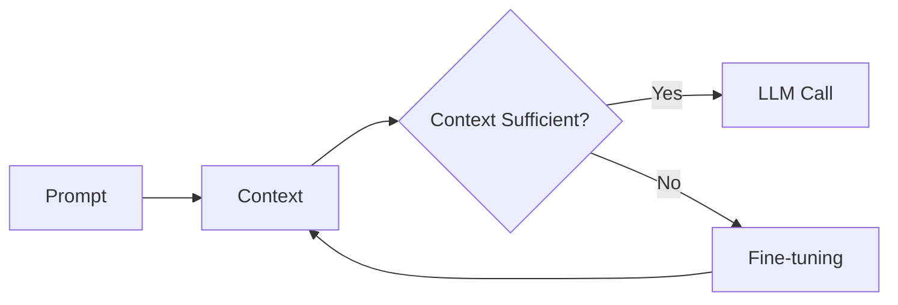
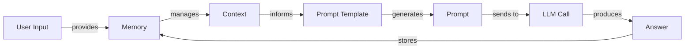
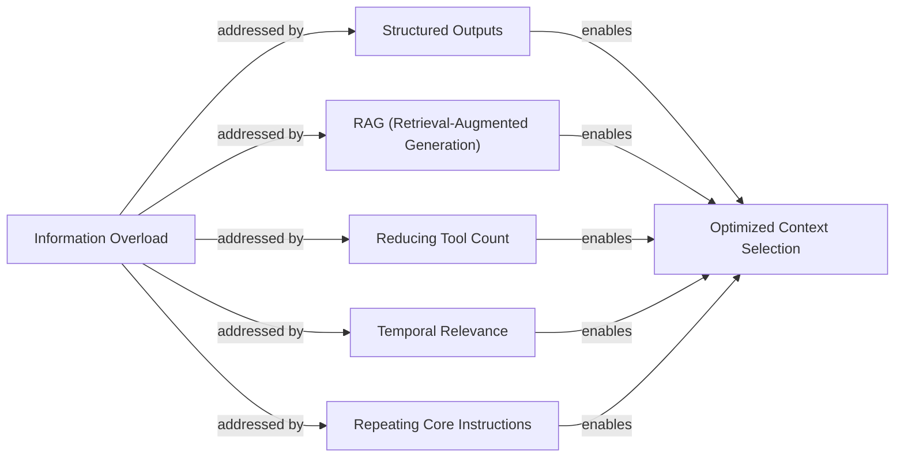
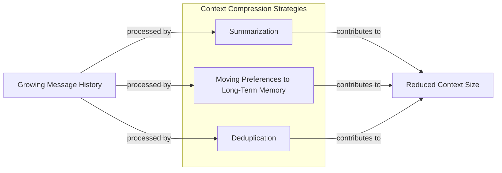
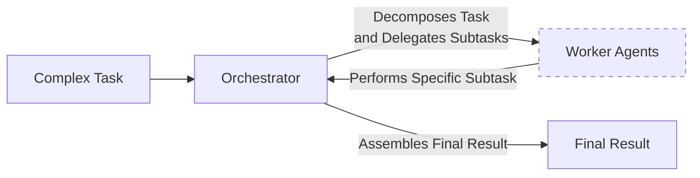

# Context Engineering

## When prompt engineering breaks

AI applications have evolved rapidly. We started with simple chatbots in 2022, moved to RAG systems in 2023, and now build memory-enabled agents that perform actions and remember past interactions [[1]](https://www.securityindustry.org/2024/07/16/understanding-the-evolution-from-classic-chatbots-to-rag-chatbots-to-ai-powered-assistants/).

In our last lesson, we explored how to choose between AI agents and LLM workflows. As these systems grow more complex, prompt engineering is no longer enough. It optimizes single LLM calls but fails when managing memory, actions, and long histories [[2]](https://memgraph.com/blog/prompt-engineering-vs-context-engineering). The amount of information an agent needs has grown exponentially. A new discipline is required to orchestrate this information ecosystem, ensuring the LLM gets exactly what it needs. This is the role of context engineering.

## From prompt to context engineering

Prompt engineering treats each LLM call as an isolated event, which is a poor fit for stateful applications that must manage context across multiple turns [[3]](https://github.com/humanlayer/12-factor-agents/blob/main/content/factor-03-own-your-context-window.md). As a task progresses, the context grows, and performance degrades. This is context decay: the model gets confused by the noise of an expanding history and loses track of key information [[4]](https://thenewstack.io/context-rot-enterprise-ai-llms/). Every token also adds to the cost and latency of an LLM call [[5]](https://atlan.com/know/llm-context-window-limitations/).

We learned this the hard way on a project with a million-token context window. We stuffed everything in, and the result was a slow, expensive workflow with poor outputs. Context engineering solves this by building dynamic systems that manage information flow, making applications accurate, fast, and cost-effective [[6]](https://nlp.elvissaravia.com/p/context-engineering-guide).

## Understanding context engineering

Context engineering is the practice of arranging information from your application's memory into the context passed to an LLM [[7]](https://www.llamaindex.ai/blog/context-engineering-what-it-is-and-techniques-to-consider). It is an optimization problem: you retrieve the right details from memory to solve a task without overwhelming the model. For example, a cooking agent needs a specific recipe and your dietary preferences, not the entire cookbook.

Andrej Karpathy explains that LLMs are like a new kind of operating system where the model is the CPU and its context window is the RAM [[8]](https://www.langchain.com/blog/context-engineering-for-agents/). Just as an OS manages what fits into RAM, context engineering manages what information occupies the model’s limited context window.

Prompt engineering is a subset of context engineering [[9]](https://blog.langchain.com/the-rise-of-context-engineering/). You still write effective prompts, but you also design a system that feeds the right context into them.

| Dimension | Prompt Engineering | Context Engineering |
| --- | --- | --- |
| Scope | Single interaction optimization | Entire information ecosystem |
| State Management | Stateless function | Stateful due to memory |
| Focus | How to phrase tasks | What information to provide |

Table 1: A comparison of prompt engineering and context engineering.

Context engineering is the new fine-tuning. While fine-tuning has its place, it is expensive and inflexible for data that changes constantly, making it a last resort [[10]](https://www.linkedin.com/posts/denis-panjuta_prompt-engineering-vs-context-engineering-activity-7363945251180322816-1q_m). For most enterprise use cases, you get better results faster with context engineering.

When you start a new AI project, your decision-making process for guiding the LLM should look like the one presented in Image 1.



Image 1: A simplified flowchart illustrating the decision-making workflow for AI applications.

For instance, to process internal Slack messages, you do not need to fine-tune a model. It is more effective to use a powerful reasoning model and engineer the context to retrieve specific messages and enable actions. Throughout this course, we will focus on solving problems using context engineering.

## What makes up the context

To master context engineering, you must understand what "context" is. It is everything the LLM sees in a single turn, dynamically assembled from various memory components [[11]](https://arxiv.org/pdf/2507.13334).

The high-level workflow, shown in Image 2, starts when user input triggers the system to pull information from memory. This is assembled into the final context, inserted into a prompt template, and sent to the LLM. The model's answer then updates the memory, and the cycle repeats.



Image 2: A simplified flowchart illustrating the high-level workflow of how context is processed in an LLM application.

These components are grouped into two main categories, which we will explain intuitively.

### Short-Term Working Memory

Short-term working memory is the agent's state for the current task. It is volatile and helps maintain a coherent dialogue. It can include the user's input, message history, the agent's internal thoughts, and the outputs from any actions it has performed [[12]](https://www.datacamp.com/blog/how-does-llm-memory-work).

### Long-Term Memory

Long-term memory stores information across sessions. We divide it into three types, drawing parallels from human memory [[13]](https://www.analyticsvidhya.com/blog/2026/01/how-does-llm-memory-work/). This analogy inspires research into LLM architectures that mimic how the brain organizes and retrieves memories, such as by segmenting information into episodic events for more efficient recall [[14]](https://openreview.net/forum?id=BI2int5SAC).

**Procedural memory** is knowledge encoded in the code, like the system prompt and action definitions. **Episodic memory** stores specific past experiences, like user preferences, for personalization [[15]](https://labelstud.io/learningcenter/episodic-vs-persistent-memory-in-llms/). **Semantic memory** is the agent’s general knowledge base, providing factual information from internal documents or external sources [[16]](https://skymod.tech/why-memory-matters-in-llm-agents-short-term-vs-long-term-memory-architectures/).

We will cover these concepts in-depth in future lessons. The key takeaway is that these components are dynamic, and context engineering involves selecting the right pieces from this memory pool for each task [[6]](https://nlp.elvissaravia.com/p/context-engineering-guide).

## Production implementation challenges

Now that we understand the components of context, let's look at the core challenges of implementing it in production. These all revolve around keeping the context small yet informative.

Here are four common issues:

1.  **The context window challenge:** Every model has a limited context window, the maximum amount of information it can process at once. While windows are getting larger, they are not infinite, and treating them as such creates other problems [[5]](https://atlan.com/know/llm-context-window-limitations/).
2.  **Information overload:** Too much context reduces LLM performance. This is the "lost-in-the-middle" problem, where models struggle with information in the middle of long inputs. This is a direct result of the transformer architecture’s positional biases, which give less weight to information in the middle of a sequence [[17]](https://openreview.net/forum?id=YufVk7I6Ii), [[18]](https://www.linkedin.com/pulse/lost-middle-lesson-failing-ai-agents-backwards-anthony-dejohn-01k2e).
3.  **Context drift:** This occurs when conflicting views of truth accumulate in memory over time. For example, if memory contains both "*My cat is white*" and "*My cat is black*," the model becomes confused and its responses unreliable [[19]](https://galileo.ai/blog/production-llm-monitoring-strategies).
4.  **Tool confusion:** This arises when an agent has too many actions available or when tool descriptions are poorly written. This can confuse the LLM about which one is best for the job [[20]](https://www.datacamp.com/blog/context-engineering).

## Key strategies for context optimization

Modern AI solutions must manage complexity across multiple knowledge bases and tools. Context engineering is about managing this complexity while meeting performance, latency, and cost requirements.

Here are four popular strategies:

### Selecting the Right Context

Retrieving the right information is the first step. Simply providing everything leads to poor performance due to the "lost-in-the-middle" problem [[5]](https://atlan.com/know/llm-context-window-limitations/).



Image 3: Strategies for selecting the right context to avoid information overload and achieve optimized context selection.

Consider these approaches: use structured outputs for clarity; use RAG to fetch specific text chunks; reduce the number of available actions to under 30 to improve selection accuracy [[20]](https://www.datacamp.com/blog/context-engineering); rank time-sensitive data by date [[21]](https://www.dailydoseofds.com/llmops-crash-course-part-8/); and repeat core instructions at the start and end of the prompt to use the model's positional biases [[22]](https://dev.to/qvfagundes/positional-encodings-and-context-window-engineering-why-token-order-matters-13h), [[23]](https://promptmetheus.com/resources/llm-knowledge-base/lost-in-the-middle-effect).

### Context Compression

As message history grows, you must compress past interactions.



Image 4: A simplified diagram illustrating strategies for "Context Compression" to manage growing message history.

You can do this through summarization, moving user preferences to long-term memory, and deduplication [[24]](https://oneuptime.com/blog/post/2026-01-30-context-compression/view). However, compression has its limits, especially for long-horizon agents where aggressive summarization can lose critical information, degrading accuracy over time [[25]](https://liner.com/review/acon-optimizing-context-compression-for-longhorizon-llm-agents).

### Isolating Context

Another strategy is to isolate context by splitting information across multiple agents.



Image 5: A simplified diagram illustrating the Orchestrator-Worker Pattern for Isolating Context.

This is often done with an orchestrator-worker pattern, where a central agent assigns sub-tasks to specialized workers, each with its own focused context [[26]](https://beam.ai/agentic-insights/multi-agent-orchestration-patterns-production).

### Format Optimization

The way you format context matters. Use XML tags to separate information and prefer YAML over JSON for structured data, as it is often more token-efficient [[27]](https://www.decodingai.com/p/context-engineering-2025s-1-skill).

## Here is an example

Let's connect the theory with concrete examples. Context engineering is applied across many domains:

-   **Healthcare:** An AI assistant accesses a patient's medical history, symptoms, and the latest medical literature to provide personalized diagnostic support [[27]](https://www.decodingai.com/p/context-engineering-2025s-1-skill).
-   **Financial Services:** AI systems integrate with CRMs and calendars, combining real-time market data and client portfolios to generate tailored financial advice.
-   **Project Management:** AI systems access enterprise infrastructure like task managers to automatically understand project requirements and update tasks.
-   **Content Creator Assistant:** An AI agent uses your research, past content, and personality traits to create new content.

Let's walk through a query for the healthcare assistant scenario. A user asks: `I have a headache. What can I do to stop it? I would prefer not to take any medicine.`

Before the AI answers, the context engineering system takes several steps. First, it retrieves the user's patient history, allergies, and lifestyle habits from episodic memory. Next, it queries a medical database for non-medicinal headache remedies from semantic memory. The system then assembles the key information from both memory types, formats it into a structured prompt, and calls the LLM to generate a personalized, context-aware answer for the user [[27]](https://www.decodingai.com/p/context-engineering-2025s-1-skill).

Here is a simplified pseudocode snippet showing how the context might be structured using XML and YAML:

```xml
<system_prompt>
You are a helpful AI medical assistant...
</system_prompt>

<patient_history>
patient:
  name: John Doe
  age: 45
  ...
  preferences:
    medication_avoidance: true
</patient_history>

<medical_literature>
articles:
  - topic: dehydration_headaches
    finding: "Dehydration is a common cause..."
    ...
</medical_literature>

<user_query>
I have a headache... I would prefer not to take any medicine.
</user_query>
```

To build such a system, you need a robust tech stack. A potential stack we recommend includes Gemini for the LLM, LangGraph for orchestration, various databases like PostgreSQL or Neo4j, and observability tools like LangSmith [[28]](https://blog.stackademic.com/context-engineering-in-llms-and-ai-agents-eb861f0d3e9b), [[29]](https://atlan.com/know/context-engineering-platforms-comparison/), [[30]](https://www.scalablepath.com/machine-learning/langgraph).

## Connecting context engineering to AI engineering

Context engineering is the practice of developing intuition for crafting effective prompts and arranging context for optimal results. It helps determine the minimal information an LLM needs to perform at its best.

This discipline cannot be learned in isolation. It combines several fields:

1.  **AI Engineering:** Implementing solutions like LLM workflows, RAG, and AI Agents.
2.  **Software Engineering (SWE):** Building scalable and maintainable AI products.
3.  **Data Engineering:** Designing pipelines that feed curated data into the memory layer.
4.  **Operations (Ops):** Deploying agents on proper infrastructure to ensure they are reproducible and observable [[31]](https://www.mezmo.com/learn-observability/context-engineering-for-observability-how-to-deliver-the-right-data-to-llms).

Our goal is to teach you how to combine these skills to build production-ready AI products. In the next lesson, we will explore structured outputs.

## References

- [1] Understanding the Evolution: From Classic Chatbots to RAG Chatbots to AI-Powered Assistants. (2024, July 16). Security Industry Association. [https://www.securityindustry.org/2024/07/16/understanding-the-evolution-from-classic-chatbots-to-rag-chatbots-to-ai-powered-assistants/](https://www.securityindustry.org/2024/07/16/understanding-the-evolution-from-classic-chatbots-to-rag-chatbots-to-ai-powered-assistants/)
- [2] Prompt engineering vs context engineering: a practical guide for AI builders. (2026, March 13). Memgraph. [https://memgraph.com/blog/prompt-engineering-vs-context-engineering](https://memgraph.com/blog/prompt-engineering-vs-context-engineering)
- [3] Own your context window. (n.d.). GitHub. [https://github.com/humanlayer/12-factor-agents/blob/main/content/factor-03-own-your-context-window.md](https://github.com/humanlayer/12-factor-agents/blob/main/content/factor-03-own-your-context-window.md)
- [4] Context Rot: The Silent Killer of Enterprise AI LLMs. (2025, July 16). The New Stack. [https://thenewstack.io/context-rot-enterprise-ai-llms/](https://thenewstack.io/context-rot-enterprise-ai-llms/)
- [5] LLM Context Window Limitations: Impacts, Risks, & Fixes in 2026. (n.d.). Atlan. [https://atlan.com/know/llm-context-window-limitations/](https://atlan.com/know/llm-context-window-limitations/)
- [6] Context Engineering Guide. (2025, July 5). AI Newsletter. [https://nlp.elvissaravia.com/p/context-engineering-guide](https://nlp.elvissaravia.com/p/context-engineering-guide)
- [7] Context Engineering - What it is, and techniques to consider. (n.d.). LlamaIndex. [https://www.llamaindex.ai/blog/context-engineering-what-it-is-and-techniques-to-consider](https://www.llamaindex.ai/blog/context-engineering-what-it-is-and-techniques-to-consider)
- [8] Context Engineering. (2025, July 2). LangChain Blog. [https://blog.langchain.com/context-engineering-for-agents/](https://blog.langchain.com/context-engineering-for-agents/)
- [9] The rise of "context engineering". (2025, June 23). LangChain Blog. [https://blog.langchain.com/the-rise-of-context-engineering/](https://blog.langchain.com/the-rise-of-context-engineering/)
- [10] Panjuta, D. (2025, July 1). Prompt Engineering vs. Context Engineering. LinkedIn. [https://www.linkedin.com/posts/denis-panjuta_prompt-engineering-vs-context-engineering-activity-7363945251180322816-1q_m](https://www.linkedin.com/posts/denis-panjuta_prompt-engineering-vs-context-engineering-activity-7363945251180322816-1q_m)
- [11] A Survey of Context Engineering for Large Language Models. (2025, July 17). arXiv.org. [https://arxiv.org/pdf/2507.13334](https://arxiv.org/pdf/2507.13334)
- [12] How Does LLM Memory Work? (n.d.). DataCamp. [https://www.datacamp.com/blog/how-does-llm-memory-work](https://www.datacamp.com/blog/how-does-llm-memory-work)
- [13] How Does LLM Memory Work? (2026, January 1). Analytics Vidhya. [https://www.analyticsvidhya.com/blog/2026/01/how-does-llm-memory-work/](https://www.analyticsvidhya.com/blog/2026/01/how-does-llm-memory-work/)
- [14] HUMAN-INSPIRED EPISODIC MEMORY FOR INFINITE CONTEXT LLMS. (n.d.). OpenReview. [https://openreview.net/forum?id=BI2int5SAC](https://openreview.net/forum?id=BI2int5SAC)
- [15] Episodic vs. Persistent Memory in LLMs. (n.d.). Label Studio. [https://labelstud.io/learningcenter/episodic-vs-persistent-memory-in-llms/](https://labelstud.io/learningcenter/episodic-vs-persistent-memory-in-llms/)
- [16] Why Memory Matters in LLM Agents: Short-Term vs. Long-Term Memory Architectures. (n.d.). Sky M.O.D. [https://skymod.tech/why-memory-matters-in-llm-agents-short-term-vs-long-term-memory-architectures/](https://skymod.tech/why-memory-matters-in-llm-agents-short-term-vs-long-term-memory-architectures/)
- [17] The Tangle of Position Bias in Multi-Layer Attention. (n.d.). OpenReview. [https://openreview.net/forum?id=YufVk7I6Ii](https://openreview.net/forum?id=YufVk7I6Ii)
- [18] DeJohn, A. (2025, July 1). Lost in the Middle: A Lesson in Failing AI Agents (and How to Fix Them) Backwards. LinkedIn. [https://www.linkedin.com/pulse/lost-middle-lesson-failing-ai-agents-backwards-anthony-dejohn-01k2e](https://www.linkedin.com/pulse/lost-middle-lesson-failing-ai-agents-backwards-anthony-dejohn-01k2e)
- [19] Production LLM Monitoring Strategies: A Practical Guide. (n.d.). Galileo. [https://galileo.ai/blog/production-llm-monitoring-strategies](https://galileo.ai/blog/production-llm-monitoring-strategies)
- [20] Context Engineering: A Guide With Examples. (n.d.). DataCamp. [https://www.datacamp.com/blog/context-engineering](https://www.datacamp.com/blog/context-engineering)
- [21] LLMOps Crash Course: Part 8 - Memory and Temporal Context. (n.d.). Daily Dose of DS. [https://www.dailydoseofds.com/llmops-crash-course-part-8/](https://www.dailydoseofds.com/llmops-crash-course-part-8/)
- [22] Positional Encodings and Context Window Engineering: Why Token Order Matters. (n.d.). DEV Community. [https://dev.to/qvfagundes/positional-encodings-and-context-window-engineering-why-token-order-matters-13h](https://dev.to/qvfagundes/positional-encodings-and-context-window-engineering-why-token-order-matters-13h)
- [23] Lost-in-the-Middle Effect. (n.d.). Promptmetheus. [https://promptmetheus.com/resources/llm-knowledge-base/lost-in-the-middle-effect](https://promptmetheus.com/resources/llm-knowledge-base/lost-in-the-middle-effect)
- [24] Context Compression Techniques for LLM Applications. (2026, January 30). OneUptime. [https://oneuptime.com/blog/post/2026-01-30-context-compression/view](https://oneuptime.com/blog/post/2026-01-30-context-compression/view)
- [25] ACON: Optimizing Context Compression for Long-Horizon LLM Agents. (n.d.). Liner. [https://liner.com/review/acon-optimizing-context-compression-for-longhorizon-llm-agents](https://liner.com/review/acon-optimizing-context-compression-for-longhorizon-llm-agents)
- [26] Multi-Agent Orchestration Patterns for Production. (n.d.). Beam.ai. [https://beam.ai/agentic-insights/multi-agent-orchestration-patterns-production](https://beam.ai/agentic-insights/multi-agent-orchestration-patterns-production)
- [27] Context Engineering: 2025’s #1 Skill. (n.d.). Decoding AI. [https://www.decodingai.com/p/context-engineering-2025s-1-skill](https://www.decodingai.com/p/context-engineering-2025s-1-skill)
- [28] Context Engineering in LLMs and AI Agents. (n.d.). Stackademic. [https://blog.stackademic.com/context-engineering-in-llms-and-ai-agents-eb861f0d3e9b](https://blog.stackademic.com/context-engineering-in-llms-and-ai-agents-eb861f0d3e9b)
- [29] Context Engineering Platforms Comparison. (n.d.). Atlan. [https://atlan.com/know/context-engineering-platforms-comparison/](https://atlan.com/know/context-engineering-platforms-comparison/)
- [30] LangGraph: A Comprehensive Guide. (n.d.). Scalable Path. [https://www.scalablepath.com/machine-learning/langgraph](https://www.scalablepath.com/machine-learning/langgraph)
- [31] Context Engineering for Observability: How to Deliver the Right Data to LLMs. (n.d.). Mezmo. [https://www.mezmo.com/learn-observability/context-engineering-for-observability-how-to-deliver-the-right-data-to-llms](https://www.mezmo.com/learn-observability/context-engineering-for-observability-how-to-deliver-the-right-data-to-llms)
</article>