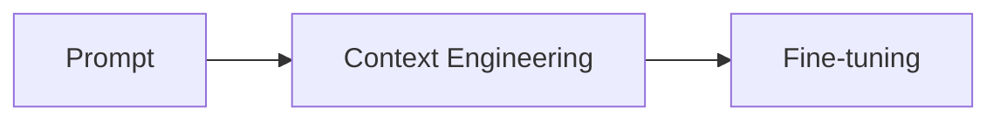
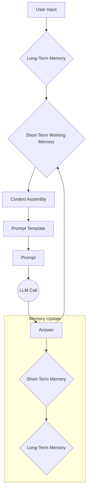
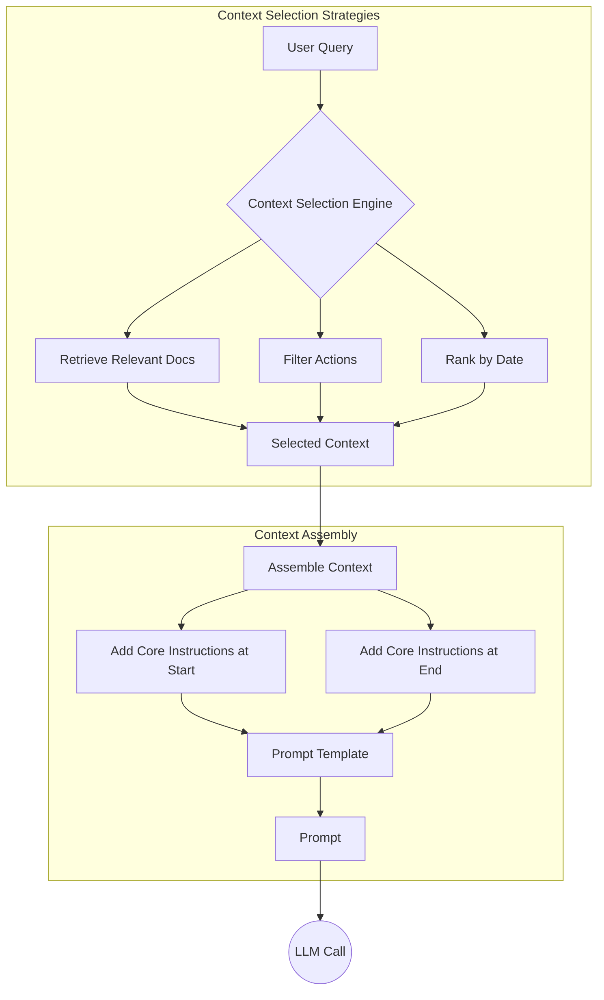
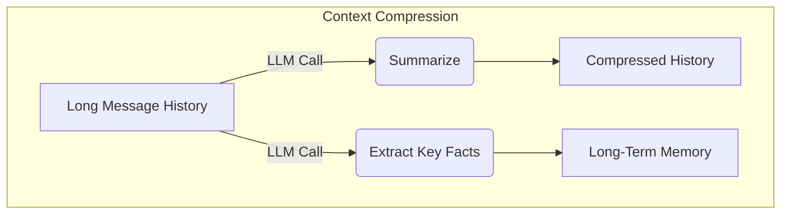
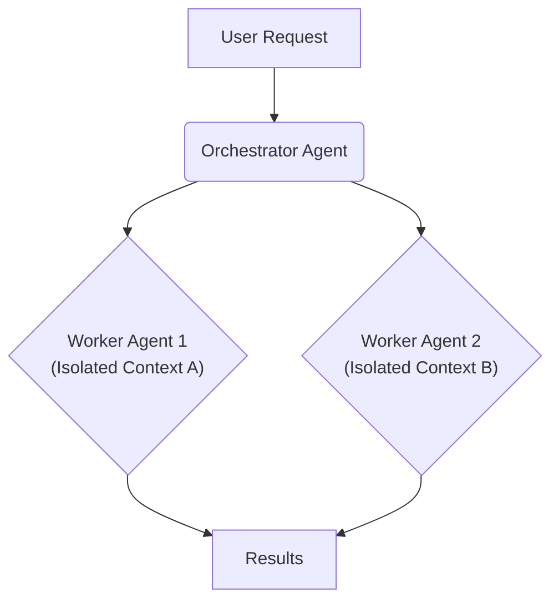

# Lesson 3: Context Engineering

## Section 1 - Introduction: When prompt engineering breaks

AI applications have evolved rapidly. In 2022, we had simple chatbots. By 2023, systems began connecting LLMs to domain-specific knowledge. 2024 brought agents that could perform actions. Now, we are building memory-enabled agents that remember past interactions and build relationships over time [[1]](https://www.securityindustry.org/2024/07/16/understanding-the-evolution-from-classic-chatbots-to-rag-chatbots-to-ai-powered-assistants/), [[2]](https://www.linkedin.com/posts/ai-apps-central_most-people-put-all-ai-systems-in-the-same-activity-7438555783077793792-UEUm).

In our last lesson, we explored how to choose between AI agents and LLM workflows. As these applications grow more complex, prompt engineering is showing its limits. The volume of information an agent might need—past conversations, user data, and documents—has grown exponentially. Simply stuffing all this into a prompt is not a viable strategy. This challenge requires context engineering: orchestrating the information ecosystem to ensure the LLM gets exactly what it needs.

## Section 2: From prompt to context engineering

Prompt engineering is designed for single, stateless interactions. This approach breaks down in stateful applications where context must be managed across multiple turns. As a task progresses, the context grows. Without a strategy, performance degrades. This is context decay: the model gets confused by the noise of an ever-expanding history and loses track of key information [[3]](https://atlan.com/know/llm-context-window-limitations/), [[4]](https://www.trychroma.com/research/context-rot).

Even with large context windows, a physical limit exists, and every token adds to cost and latency. We will explore these concepts in more detail in future lessons. On a recent project, we learned this the hard way by stuffing everything into a million-token context window. The result was a workflow that took 30 minutes to run. Context engineering addresses these limitations by treating AI applications as dynamic systems that manage information flow.

## Section 3: Understanding context engineering

Context engineering is about finding the optimal way to arrange information from memory into the context passed to an LLM. It is an optimization problem where you retrieve the right parts from memory to solve a task without overwhelming the model [[5]](https://arxiv.org/pdf/2507.13334). For example, a cooking agent needs a specific recipe and your allergies, not the entire cookbook.

Andrej Karpathy offered a great analogy: LLMs are like a new kind of operating system, where the model is the CPU and its context window is RAM [[6]](https://www.langchain.com/blog/context-engineering-for-agents/), [[7]](https://atlan.com/know/working-memory-llms/). Context engineering curates what occupies this working memory. Prompt engineering is a subset of context engineering. You still write effective prompts, but you also design a system that feeds the right context into them.

| Dimension | Prompt Engineering | Context Engineering |
| --- | --- | --- |
| Scope | Single interaction optimization | Entire information ecosystem |
| Complexity | Manual string manipulation | System-level, multi-component optimization |
| State Management | Primarily stateless | Inherently stateful, with explicit memory management |
| Focus | How to phrase tasks | What information to provide |
Table 1: A comparison of prompt engineering and context engineering.

Context engineering is the new fine-tuning. Fine-tuning is expensive and inflexible, making it a last resort [[8]](https://www.linkedin.com/posts/denis-panjuta_prompt-engineering-vs-context-engineering-activity-7363945251180322816-1q_m). For most use cases, you get better results more cheaply with context engineering. When starting a new AI project, your decision-making process should follow the workflow in Image 1.


Image 1: A flowchart illustrating the decision-making workflow in AI application development, from prompt to fine-tuning.

For instance, to process internal Slack messages, you do not need to fine-tune a model. It is more effective to use context engineering to retrieve messages and enable actions. This course will focus on solving problems using this approach.

## Section 4: What makes up the context

To master context engineering, you must understand what "context" is. It is everything the LLM sees in a single turn, dynamically assembled from memory. As shown in Image 2, the workflow begins when a user input triggers the system to pull relevant information. This is assembled into the final context, inserted into a prompt template, and sent to the LLM. The LLM’s response then updates the memory, and the cycle repeats.


Image 2: The high-level workflow of how context is assembled and used in an AI system.

These components, illustrated in Image 3, are grouped into two main categories.

**Short-term working memory** is the state for the current task. It is volatile and includes user input, message history, the agent's internal thoughts, and outputs from any actions performed [[7]](https://atlan.com/know/working-memory-llms/), [[9]](https://skymod.tech/why-memory-matters-in-llm-agents-short-term-vs-long-term-memory-architectures/).

**Long-term memory** is persistent and stores information across sessions. We divide it into three types, drawing parallels from human memory [[10]](https://www.datacamp.com/blog/how-does-llm-memory-work), [[11]](https://www.analyticsvidhya.com/blog/2026/01/how-does-llm-memory-work/). **Procedural memory** is knowledge encoded in the code, like the system prompt and action definitions. **Episodic memory** stores specific past experiences, like user preferences, for personalization. **Semantic memory** is the agent’s general knowledge base, like company documents or external information.

We will cover these concepts in-depth in future lessons.
Image 3: A diagram illustrating the different components that make up the context provided to an LLM. (Source [Decoding AI Magazine](https://www.decodingai.com/p/context-engineering-2025s-1-skill) [[12]])

The key takeaway is that these components are dynamic. Context engineering involves selecting the right pieces from this memory pool for each prompt.

## Section 5: Production implementation challenges

Implementing context engineering in production presents several core challenges, all revolving around keeping the context small yet informative.

A primary issue is the **context window challenge**. Every AI model has a maximum input size, but its *effective* usable limit is often much smaller, creating a hard cap on what the agent can "see" [[13]](https://arxiv.org/pdf/2509.21361), [[3]](https://atlan.com/know/llm-context-window-limitations/), [[14]](https://redis.io/blog/context-window-overflow/).

This leads to **information overload**, also known as the "lost-in-the-middle" problem. As you add more information, models lose focus on critical details, and performance drops long before the physical limit is reached. Models recall information best at the start and end of the context [[15]](https://www.alphaxiv.org/overview/2603.10123v1), [[16]](https://www.linkedin.com/pulse/lost-middle-lesson-failing-ai-agents-backwards-anthony-dejohn-01k2e), [[3]](https://atlan.com/know/llm-context-window-limitations/).

Another subtle issue is **context drift**, where conflicting versions of the truth accumulate over time. Without a mechanism to resolve or prune outdated facts, the agent’s knowledge base becomes unreliable. This is also known as context rot [[17]](https://www.anthropic.com/engineering/effective-context-engineering-for-ai-agents), [[18]](https://galileo.ai/blog/production-llm-monitoring-strategies), [[19]](https://thenewstack.io/context-rot-enterprise-ai-llms/).

Finally, there is **tool confusion**. Providing an agent with too many actions, especially with poorly written descriptions, can paralyze it or cause it to pick the wrong one. This "rule saturation" means each instruction is less likely to be followed consistently [[12]](https://www.decodingai.com/p/context-engineering-2025s-1-skill), [[20]](https://centricconsulting.com/blog/building-with-production-ready-ai-agent-systems-the-hidden-constraints_ai/).

## Section 6: Key strategies for context optimization

Modern AI solutions must manage complexity across multiple knowledge bases and actions. Context engineering is about managing this complexity while meeting performance, latency, and cost requirements. Here are four popular strategies.

**Selecting the right context**, as illustrated in Image 4, is your first line of defense. The goal is "just-in-time" retrieval, loading data only when needed [[17]](https://www.anthropic.com/engineering/effective-context-engineering-for-ai-agents). Avoid providing all available context; instead, fetch only the most relevant facts. For time-sensitive data, rank it by date. Also, repeat critical instructions at the start and end of the prompt to leverage the model's attention bias [[21]](https://promptmetheus.com/resources/llm-knowledge-base/lost-in-the-middle-effect), [[22]](https://dev.to/thousand_miles_ai/the-lost-in-the-middle-problem-why-llms-ignore-the-middle-of-your-context-window-3al2). Forcing the model to return consistent, machine-readable data and reducing the number of available actions also helps focus the LLM.


Image 4: A workflow showing how context selection strategies optimize information retrieval and assembly.

**Context compression** is crucial for managing long-running conversations, as shown in Image 5. As message history grows, you can use an LLM to create summaries. A simpler alternative is **observation masking**, where older action outputs are hidden [[23]](https://oneuptime.com/blog/post/2026-01-30-context-compression/view), [[24]](https://www.dailydoseofds.com/llmops-crash-course-part-8/). You can also move key facts like user preferences to long-term memory or use deduplication techniques to remove redundant information [[25]](https://blog.jetbrains.com/research/2025/12/efficient-context-management/).


Image 5: Compressing context by summarizing history and extracting key facts to long-term memory.

**Isolating context** involves splitting a complex problem across multiple specialized agents. This is often done using a pattern, shown in Image 6, where a central agent breaks down a problem and assigns sub-tasks to specialized worker agents [[26]](https://beam.ai/agentic-insights/multi-agent-orchestration-patterns-production), [[27]](https://www.vellum.ai/blog/multi-agent-systems-building-with-context-engineering). While this keeps each agent’s context focused, it can be fragile. If sub-agents cannot see each other’s full context, their work can become inconsistent [[28]](https://cognition.ai/blog/dont-build-multi-agents).


Image 6: A central agent delegates tasks to specialized agents, isolating context for each.

Finally, **format optimization** using structures like XML or YAML makes the context more digestible for the model [[12]](https://www.decodingai.com/p/context-engineering-2025s-1-skill). This clearly delineates different information types and improves reasoning. Understanding exactly what occupies your context window at every step is key to mastering context engineering.

## Section 7: Here is an example

Let's connect these strategies to a real-world scenario. Context engineering is applied in various domains, from healthcare assistants that access patient history to financial agents that integrate with enterprise systems [[12]](https://www.decodingai.com/p/context-engineering-2025s-1-skill).

Suppose a user asks a healthcare assistant: `I have a headache. What can I do to stop it? I would prefer not to take any medicine.`

Before the LLM even sees this query, a context engineering system gets to work:

1.  It retrieves the user's patient history and allergies from episodic memory.
2.  It queries a semantic memory of medical literature for non-medicinal headache remedies.
3.  It assembles this information, along with the query and conversation history, into a structured prompt.
4.  The prompt is sent to the LLM, which generates a personalized, safe, and relevant recommendation.

Here’s a simplified example showing how these components might be assembled into a system prompt. Notice the clear structure and use of XML tags.

```
SYSTEM_PROMPT = """
You are a helpful and cautious AI healthcare assistant.
<INSTRUCTIONS>
1. Analyze the user's query and the provided context.
2. Use the patient history to understand their health profile.
3. Use the retrieved medical knowledge for your recommendation.
4. If you lack information, ask clarifying questions.
5. Always prioritize safety and advise consulting a doctor.
</INSTRUCTIONS>
<PATIENT_HISTORY>
{retrieved_patient_history_in_yaml}
</PATIENT_HISTORY>
<MEDICAL_KNOWLEDGE>
{retrieved_medical_articles_in_yaml}
</MEDICAL_KNOWLEDGE>
<USER_QUERY>
{user_query}
</USER_QUERY>
"""
```

To build such a system, you would use a combination of technologies. An LLM like Gemini provides the reasoning engine. An orchestration framework can manage the workflow. Databases such as PostgreSQL or Neo4j can serve as long-term memory stores, and observability platforms are essential for debugging [[29]](https://blog.stackademic.com/context-engineering-in-llms-and-ai-agents-eb861f0d3e9b), [[30]](https://atlan.com/know/context-engineering-platforms-comparison/). Building such a system requires more than just knowing the components; it requires a new way of thinking about system design.

## Connecting context engineering to AI engineering

Mastering context engineering is less about learning a specific algorithm and more about building intuition for how to structure prompts, what information to include, and how to order it for maximum impact.

This skill does not exist in a vacuum. It is a multidisciplinary practice that combines AI Engineering, Software Engineering, Data Engineering, and Operations [[31]](https://www.mezmo.com/learn-observability/context-engineering-for-observability-how-to-deliver-the-right-data-to-llms), [[32]](https://sombrainc.com/blog/ai-context-engineering-guide). Our goal with this course is to teach you how to combine these skills to build production-ready AI products. In the next lesson, we will explore how to get consistent, machine-readable data from an LLM.

## References

- [1] https://www.securityindustry.org/2024/07/16/understanding-the-evolution-from-classic-chatbots-to-rag-chatbots-to-ai-powered-assistants/
- [2] https://www.linkedin.com/posts/ai-apps-central_most-people-put-all-ai-systems-in-the-same-activity-7438555783077793792-UEUm
- [3] https://atlan.com/know/llm-context-window-limitations/
- [4] https://www.trychroma.com/research/context-rot
- [5] https://arxiv.org/pdf/2507.13334
- [6] https://www.langchain.com/blog/context-engineering-for-agents/
- [7] https://atlan.com/know/working-memory-llms/
- [8] https://www.linkedin.com/posts/denis-panjuta_prompt-engineering-vs-context-engineering-activity-7363945251180322816-1q_m
- [9] https://skymod.tech/why-memory-matters-in-llm-agents-short-term-vs-long-term-memory-architectures/
- [10] https://www.datacamp.com/blog/how-does-llm-memory-work
- [11] https://www.analyticsvidhya.com/blog/2026/01/how-does-llm-memory-work/
- [12] https://www.decodingai.com/p/context-engineering-2025s-1-skill
- [13] https://arxiv.org/pdf/2509.21361
- [14] https://redis.io/blog/context-window-overflow/
- [15] https://www.alphaxiv.org/overview/2603.10123v1
- [16] https://www.linkedin.com/pulse/lost-middle-lesson-failing-ai-agents-backwards-anthony-dejohn-01k2e
- [17] https://www.anthropic.com/engineering/effective-context-engineering-for-ai-agents
- [18] https://galileo.ai/blog/production-llm-monitoring-strategies
- [19] https://thenewstack.io/context-rot-enterprise-ai-llms/
- [20] https://centricconsulting.com/blog/building-with-production-ready-ai-agent-systems-the-hidden-constraints_ai/
- [21] https://promptmetheus.com/resources/llm-knowledge-base/lost-in-the-middle-effect
- [22] https://dev.to/thousand_miles_ai/the-lost-in-the-middle-problem-why-llms-ignore-the-middle-of-your-context-window-3al2
- [23] https://oneuptime.com/blog/post/2026-01-30-context-compression/view
- [24] https://www.dailydoseofds.com/llmops-crash-course-part-8/
- [25] https://blog.jetbrains.com/research/2025/12/efficient-context-management/
- [26] https://beam.ai/agentic-insights/multi-agent-orchestration-patterns-production
- [27] https://www.vellum.ai/blog/multi-agent-systems-building-with-context-engineering
- [28] https://cognition.ai/blog/dont-build-multi-agents
- [29] https://blog.stackademic.com/context-engineering-in-llms-and-ai-agents-eb861f0d3e9b
- [30] https://atlan.com/know/context-engineering-platforms-comparison/
- [31] https://www.mezmo.com/learn-observability/context-engineering-for-observability-how-to-deliver-the-right-data-to-llms
- [32] https://sombrainc.com/blog/ai-context-engineering-guide