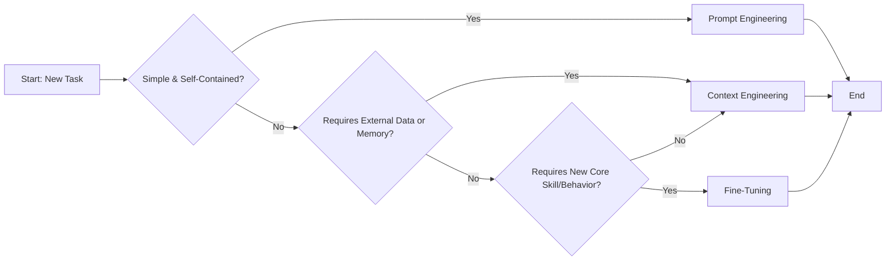
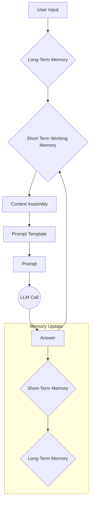
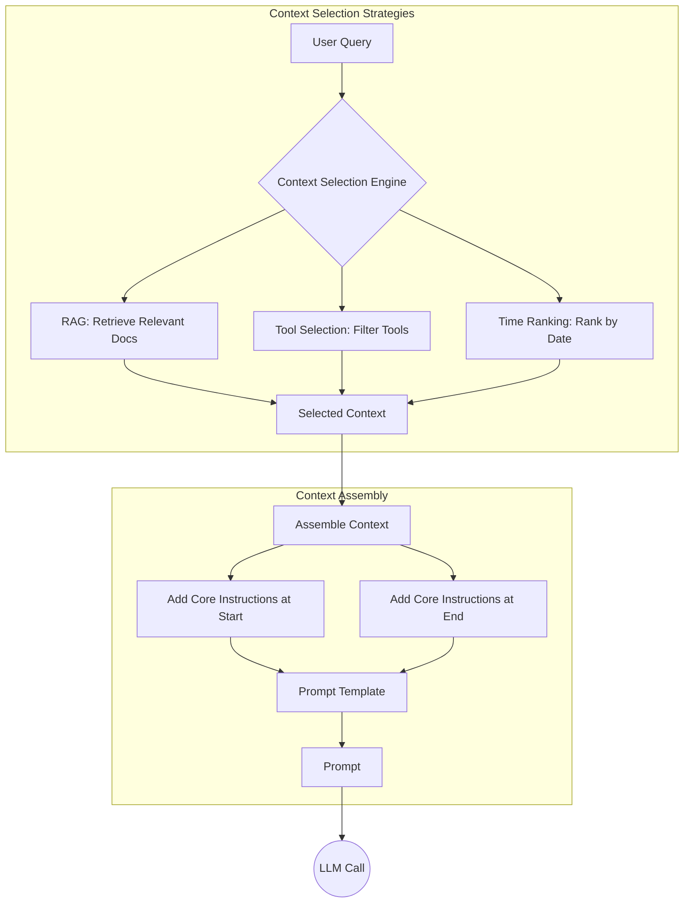
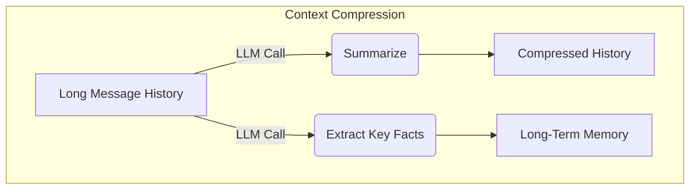
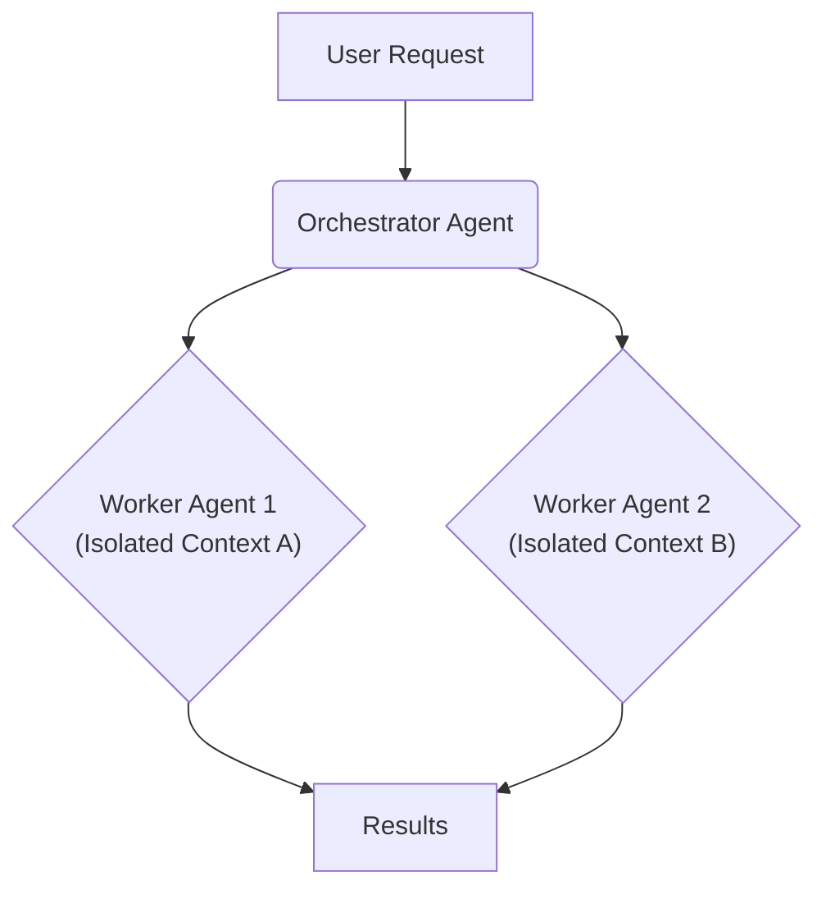

# Lesson 3: Context Engineering

AI applications have evolved rapidly. In 2022, we had simple chatbots for question-answering. By 2023, Retrieval-Augmented Generation (RAG) systems connected LLMs to domain-specific knowledge. 2024 brought us tool-using agents that could perform actions. Now, we are building memory-enabled agents that remember past interactions and build relationships over time [[1]](https://www.securityindustry.org/2024/07/16/understanding-the-evolution-from-classic-chatbots-to-rag-chatbots-to-ai-powered-assistants/), [[2]](https://www.linkedin.com/posts/ai-apps-central_most-people-put-all-ai-systems-in-the-same-activity-7438555783077793792-UEUm).

In our last lesson, we explored how to choose between AI agents and LLM workflows. As these applications grow more complex, prompt engineering is showing its limits. It optimizes single LLM calls but fails when managing systems with memory and long interaction histories. The sheer volume of information an agent might need—past conversations, user data, and documents—has grown exponentially. Simply stuffing all this into a prompt is not a viable strategy. This is where context engineering comes in. It is the discipline of orchestrating this entire information ecosystem to ensure the LLM gets exactly what it needs, when it needs it.

## From prompt to context engineering

Prompt engineering, while effective for simple tasks, is designed for single, stateless interactions. It treats each call to an LLM as a new, isolated event. This approach breaks down in stateful applications where context must be preserved and managed across multiple turns.

As a conversation or task progresses, the context grows. Without a strategy to manage this growth, the LLM’s performance degrades. This is context decay: the model gets confused by the noise of an ever-expanding history and starts to lose track of key information [[3]](https://atlan.com/know/llm-context-window-limitations/), [[4]](https://www.trychroma.com/research/context-rot).

Even with large context windows, a physical limit exists. Operationally, every token adds to the cost and latency of an LLM call. We will explore these concepts in more detail in upcoming lessons, including memory and RAG. On a recent project, we learned this the hard way. We stuffed everything into a million-token context window: research, guidelines, and examples. The result was an LLM workflow that took 30 minutes to run and produced low-quality outputs. Context engineering addresses these limitations by treating AI applications as dynamic systems that manage information flow.

## Understanding context engineering

Context engineering is about finding the optimal way to arrange information from your application's memory into the context passed to an LLM. It is an optimization problem where you retrieve the right parts from your short-term and long-term memory to solve a specific task without overwhelming the model [[5]](https://arxiv.org/pdf/2507.13334). For example, when you ask a cooking agent for a recipe, you do not give it the entire cookbook. Instead, you retrieve the specific recipe, along with personal context like allergies. This precise selection ensures the model receives only essential information.

Andrej Karpathy offered a great analogy: LLMs are like a new kind of operating system, where the model acts as the CPU and its context window functions as the RAM [[6]](https://www.langchain.com/blog/context-engineering-for-agents/), [[7]](https://atlan.com/know/working-memory-llms/). Just as an operating system manages what fits into RAM, context engineering curates what occupies the model’s working memory.

Prompt engineering is a subset of context engineering. You still write effective prompts, but you also design a system that feeds the right context into them.

| Dimension | Prompt Engineering | Context Engineering |
| --- | --- | --- |
| Scope | Single interaction optimization | Entire information ecosystem |
| Complexity | Manual string manipulation | System-level, multi-component optimization |
| State Management | Primarily stateless | Inherently stateful, with explicit memory management |
| Focus | How to phrase tasks | What information to provide |
Table 1: A comparison of prompt engineering and context engineering [[8]](https://www.linkedin.com/posts/denis-panjuta_prompt-engineering-vs-context-engineering-activity-7363945251180322816-1q_m), [[5]](https://arxiv.org/pdf/2507.13334).

Context engineering is the new fine-tuning. While fine-tuning has its place, it is expensive and inflexible in a world where data changes constantly, making it a last resort [[8]](https://www.linkedin.com/posts/denis-panjuta_prompt-engineering-vs-context-engineering-activity-7363945251180322816-1q_m). For most use cases, you get better results more cheaply with context engineering. When you start a new AI project, your decision-making process for guiding the LLM should look like the one presented in Image 1.


Image 1: A flowchart illustrating the decision-making workflow in AI application development, from prompt to fine-tuning.

For instance, to process internal Slack messages, you do not need to fine-tune a model on your company’s communication style. It is more effective to use context engineering to retrieve specific messages and enable actions. Throughout this course, we will show you how to solve most industry problems using only context engineering.

## What makes up the context

To master context engineering, you first need to understand what "context" is. It is everything the LLM sees in a single turn, dynamically assembled from various memory components. The high-level workflow begins when a user input triggers the system to pull relevant information from memory. This information is assembled into the final context, inserted into a prompt template, and sent to the LLM. The LLM’s response then updates the memory, and the cycle repeats.


Image 2: The high-level workflow of how context is assembled and used in an AI system.

These components are grouped into two main categories, which we will explain intuitively for now.

**Short-term working memory** is the state of the agent for the current task. It is volatile and changes with each interaction. It can include user input, message history, the agent's internal thoughts, and the outputs from any actions it has performed [[7]](https://atlan.com/know/working-memory-llms/), [[9]](https://skymod.tech/why-memory-matters-in-llm-agents-short-term-vs-long-term-memory-architectures/).

**Long-term memory** is more persistent and stores information across sessions. We divide it into three types, drawing parallels from human memory [[10]](https://www.datacamp.com/blog/how-does-llm-memory-work), [[11]](https://www.analyticsvidhya.com/blog/2026/01/how-does-llm-memory-work/):
*   **Procedural memory:** This is knowledge encoded in the code, like the system prompt that sets the agent's behavior and the definitions of available actions.
*   **Episodic memory:** This is memory of specific past experiences, like user preferences or previous interactions, often stored in vector or graph databases for personalization.
*   **Semantic memory:** This is the agent’s general knowledge base, which can be internal company documents or external information accessed via APIs. This is the core of RAG.

We will cover all these concepts in-depth in future lessons.
Image 3: A diagram illustrating the different components that make up the context provided to an LLM. (Source [Decoding AI Magazine](https://www.decodingai.com/p/context-engineering-2025s-1-skill) [[12]](https://www.decodingai.com/p/context-engineering-2025s-1-skill))

The key takeaway is that these components are dynamic and re-computed for every interaction. Context engineering involves knowing how to select the right pieces from this vast memory pool to construct the most effective prompt.

## Production implementation challenges

Now that we understand what makes up the context, let's look at the core challenges of implementing it in production. These all revolve around keeping the context as small as possible while providing enough information to the LLM.

Here are four common issues:

1.  **The context window challenge:** Every AI model has a maximum context window, but its *effective* usable limit is often much smaller [[13]](https://arxiv.org/pdf/2509.21361). While context windows are getting larger, they are not infinite [[3]](https://atlan.com/know/llm-context-window-limitations/), [[14]](https://redis.io/blog/context-window-overflow/).
2.  **Information overload:** Too much context can confuse the LLM. This is known as the "lost-in-the-middle" problem, an inherent structural bias in the transformer architecture where models recall information best at the start and end of the context [[15]](https://www.alphaxiv.org/overview/2603.10123v1). Performance can drop long before the physical limit is reached [[16]](https://www.linkedin.com/pulse/lost-middle-lesson-failing-ai-agents-backwards-anthony-dejohn-01k2e), [[3]](https://atlan.com/know/llm-context-window-limitations/).
3.  **Context drift:** Also known as context rot, this occurs when conflicting truths accumulate in memory over time, making responses unreliable [[17]](https://www.anthropic.com/engineering/effective-context-engineering-for-ai-agents), [[18]](https://galileo.ai/blog/production-llm-monitoring-strategies), [[19]](https://thenewstack.io/context-rot-enterprise-ai-llms/). For example, if a user's budget changes from $500 to $1,000, the agent can get confused.
4.  **Tool confusion:** This arises when an agent has too many tools or they are poorly described. This can lead to "rule saturation," where each instruction is less likely to be followed [[20]](https://centricconsulting.com/blog/building-with-production-ready-ai-agent-systems-the-hidden-constraints_ai/). The Gorilla benchmark shows that more tools often paralyze the agent or cause it to pick the wrong one [[12]](https://www.decodingai.com/p/context-engineering-2025s-1-skill).

## Key strategies for context optimization

Modern AI solutions must manage multiple knowledge bases, tools, and complex conversational histories. Context engineering is about managing this complexity while meeting performance, latency, and cost requirements. Here are four popular strategies.

**Selecting the right context** is your first line of defense. The goal is "just-in-time" retrieval, loading data only when needed [[17]](https://www.anthropic.com/engineering/effective-context-engineering-for-ai-agents). Avoid providing all available context; instead, use RAG to retrieve only the most relevant facts. For time-sensitive data, rank it by date. Also, repeat critical instructions at the start and end of the prompt to leverage the model's attention bias [[21]](https://promptmetheus.com/resources/llm-knowledge-base/lost-in-the-middle-effect), [[22]](https://dev.to/thousand_miles_ai/the-lost-in-the-middle-problem-why-llms-ignore-the-middle-of-your-context-window-3al2). Using structured outputs and reducing the number of available tools also helps focus the LLM.


Image 4: A workflow showing how context selection strategies optimize information retrieval and assembly.

**Context compression** is crucial for managing long-running conversations. As message history grows, you can use an LLM to create summaries. A simpler alternative is **observation masking**, where older tool outputs are hidden [[23]](https://oneuptime.com/blog/post/2026-01-30-context-compression/view), [[24]](https://www.dailydoseofds.com/llmops-crash-course-part-8/). You can also move key facts like user preferences to long-term memory or use deduplication techniques to remove redundant information [[25]](https://blog.jetbrains.com/research/2025/12/efficient-context-management/).


Image 5: Compressing context by summarizing history and extracting key facts to long-term memory.

**Isolating context** involves splitting a complex problem across multiple specialized agents using an orchestrator-worker pattern [[26]](https://beam.ai/agentic-insights/multi-agent-orchestration-patterns-production), [[27]](https://www.vellum.ai/blog/multi-agent-systems-building-with-context-engineering). While this keeps each agent’s context focused, it can be fragile. If sub-agents cannot see each other’s full context, their work can become inconsistent [[28]](https://cognition.ai/blog/dont-build-multi-agents).


Image 6: The orchestrator-worker pattern isolates context across multiple specialized agents.

Finally, **format optimization** using structures like XML or YAML makes the context more digestible for the model [[12]](https://www.decodingai.com/p/context-engineering-2025s-1-skill). This clearly delineates different information types and improves reasoning. Understanding exactly what occupies your context window at every step is key to mastering context engineering.

## Here is an example

Let's connect these strategies to a real-world scenario. Context engineering is applied in various domains, from healthcare assistants that access patient history to financial agents that integrate with CRMs [[12]](https://www.decodingai.com/p/context-engineering-2025s-1-skill).

Imagine a user asks a healthcare assistant: `I have a headache. What can I do to stop it? I would prefer not to take any medicine.`

Before the LLM even sees this query, a context engineering system gets to work:

1.  It retrieves the user's patient history and allergies from episodic memory.
2.  It queries a semantic memory of medical literature for non-medicinal headache remedies.
3.  It assembles this information, along with the query and conversation history, into a structured prompt.
4.  The prompt is sent to the LLM, which generates a personalized, safe, and relevant recommendation.

Here’s a simplified example showing how these components might be assembled into a system prompt. Notice the clear structure and use of XML tags.

```
SYSTEM_PROMPT = """
You are a helpful and cautious AI healthcare assistant.
<INSTRUCTIONS>
1. Analyze the user's query and the provided context.
2. Use the patient history to understand their health profile.
3. Use the retrieved medical knowledge for your recommendation.
4. If you lack information, ask clarifying questions.
5. Always prioritize safety and advise consulting a doctor.
</INSTRUCTIONS>
<PATIENT_HISTORY>
{retrieved_patient_history_in_yaml}
</PATIENT_HISTORY>
<MEDICAL_KNOWLEDGE>
{retrieved_medical_articles_in_yaml}
</MEDICAL_KNOWLEDGE>
<USER_QUERY>
{user_query}
</USER_QUERY>
"""
```

To build such a system, you would use a combination of tools. An LLM like Gemini provides the reasoning engine. A framework like LangGraph can orchestrate the workflow. Databases such as PostgreSQL or Neo4j can serve as long-term memory stores, and observability platforms are essential for debugging [[29]](https://blog.stackademic.com/context-engineering-in-llms-and-ai-agents-eb861f0d3e9b), [[30]](https://atlan.com/know/context-engineering-platforms-comparison/). Building such a system requires more than just knowing the tools; it requires a new way of thinking about system design.

## Connecting context engineering to AI engineering

Mastering context engineering is less about learning a specific algorithm and more about building intuition. It’s the art of knowing how to structure prompts, what information to include, and how to order it for maximum impact.

This skill does not exist in a vacuum. It’s a multidisciplinary practice that sits at the intersection of several key engineering fields [[31]](https://www.mezmo.com/learn-observability/context-engineering-for-observability-how-to-deliver-the-right-data-to-llms), [[32]](https://sombrainc.com/blog/ai-context-engineering-guide):
*   **AI Engineering:** Understanding LLMs, RAG, and AI agents is the foundation.
*   **Software Engineering:** You need to build scalable systems to aggregate context and wrap agents in robust APIs.
*   **Data Engineering:** Constructing reliable data pipelines for memory systems is critical.
*   **Operations:** Deploying agents on the right infrastructure makes them reproducible, observable, and scalable.

Our goal with this course is to teach you how to combine these skills to build production-ready AI products. In the next lesson, we will explore structured outputs, a key technique for controlling what an LLM returns.

## References

- [1] https://www.securityindustry.org/2024/07/16/understanding-the-evolution-from-classic-chatbots-to-rag-chatbots-to-ai-powered-assistants/
- [2] https://www.linkedin.com/posts/ai-apps-central_most-people-put-all-ai-systems-in-the-same-activity-7438555783077793792-UEUm
- [3] https://atlan.com/know/llm-context-window-limitations/
- [4] https://www.trychroma.com/research/context-rot
- [5] https://arxiv.org/pdf/2507.13334
- [6] https://www.langchain.com/blog/context-engineering-for-agents/
- [7] https://atlan.com/know/working-memory-llms/
- [8] https://www.linkedin.com/posts/denis-panjuta_prompt-engineering-vs-context-engineering-activity-7363945251180322816-1q_m
- [9] https://skymod.tech/why-memory-matters-in-llm-agents-short-term-vs-long-term-memory-architectures/
- [10] https://www.datacamp.com/blog/how-does-llm-memory-work
- [11] https://www.analyticsvidhya.com/blog/2026/01/how-does-llm-memory-work/
- [12] https://www.decodingai.com/p/context-engineering-2025s-1-skill
- [13] https://arxiv.org/pdf/2509.21361
- [14] https://redis.io/blog/context-window-overflow/
- [15] https://www.alphaxiv.org/overview/2603.10123v1
- [16] https://www.linkedin.com/pulse/lost-middle-lesson-failing-ai-agents-backwards-anthony-dejohn-01k2e
- [17] https://www.anthropic.com/engineering/effective-context-engineering-for-ai-agents
- [18] https://galileo.ai/blog/production-llm-monitoring-strategies
- [19] https://thenewstack.io/context-rot-enterprise-ai-llms/
- [20] https://centricconsulting.com/blog/building-with-production-ready-ai-agent-systems-the-hidden-constraints_ai/
- [21] https://promptmetheus.com/resources/llm-knowledge-base/lost-in-the-middle-effect
- [22] https://dev.to/thousand_miles_ai/the-lost-in-the-middle-problem-why-llms-ignore-the-middle-of-your-context-window-3al2
- [23] https://oneuptime.com/blog/post/2026-01-30-context-compression/view
- [24] https://www.dailydoseofds.com/llmops-crash-course-part-8/
- [25] https://blog.jetbrains.com/research/2025/12/efficient-context-management/
- [26] https://beam.ai/agentic-insights/multi-agent-orchestration-patterns-production
- [27] https://www.vellum.ai/blog/multi-agent-systems-building-with-context-engineering
- [28] https://cognition.ai/blog/dont-build-multi-agents
- [29] https://blog.stackademic.com/context-engineering-in-llms-and-ai-agents-eb861f0d3e9b
- [30] https://atlan.com/know/context-engineering-platforms-comparison/
- [31] https://www.mezmo.com/learn-observability/context-engineering-for-observability-how-to-deliver-the-right-data-to-llms
- [32] https://sombrainc.com/blog/ai-context-engineering-guide
- [4] https://www.decodingai.com/p/context-engineering-2025s-1-skill
- [5] https://www.dbreunig.com/2025/06/22/how-contexts-fail-and-how-to-fix-them.html
- [7] https://www.coforge.com/what-we-know/blog/navigating-the-shifting-sands-understanding-and-mitigating-data-drift-in-llms
- [9] https://insightfinder.com/blog/hidden-cost-llm-drift-detection/
- [10] https://www.helicone.ai/blog/how-to-reduce-llm-hallucination
- [13] https://arxiv.org/html/2510.22101v1
- [14] https://blog.jetbrains.com/research/2025/12/efficient-context-management/
- [15] https://www.comet.com/site/blog/context-window/
- [16] https://datahub.com/blog/context-window-optimization/
- [17] https://www.getmaxim.ai/articles/context-window-management-strategies-for-long-context-ai-agents-and-chatbots/
- [18] https://packmind.com/context-engineering-ai-coding/what-is-contextops/
- [19] https://www.mezmo.com/learn-observability/context-engineering-for-observability-how-to-deliver-the-right-data-to-llms
- [20] https://sombrainc.com/blog/ai-context-engineering-guide
- [24] https://www.glean.com/blog/context-engineering-ai-the-foundation-of-reliable-high-performing-models
- [25] https://www.packmind.com/context-engineering-ai-coding/what-is-contextops/
- [27] https://pagergpt.ai/ai-chatbot/evolution-of-ai-chatbots
- [28] https://www.dante-ai.com/news/when-did-ai-chatbots-start
- [29] https://www.linkedin.com/posts/ai-apps-central_most-people-put-all-ai-systems-in-the-same-activity-7438555783077793792-UEUm
- [32] https://www.glean.com/perspectives/context-engineering-vs-prompt-engineering-key-differences-explained
- [34] https://www.sundeepteki.org/blog/from-vibe-coding-to-context-engineering-a-blueprint-for-production-grade-genai-systems
- [35] https://www.linkedin.com/pulse/context-engineering-silent-architecture-behind-every-ai-roychowdhury-lzcec
- [40] https://labelstud.io/learningcenter/episodic-vs-persistent-memory-in-llms/
- [42] https://www.mdpi.com/2079-9292/13/15/2961
- [44] https://beam.ai/agentic-insights/multi-agent-orchestration-patterns-production
- [45] https://gurusup.com/blog/multi-agent-orchestration-guide
- [47] https://www.vellum.ai/blog/multi-agent-systems-building-with-context-engineering
- [49] https://www.praetorian.com/blog/deterministic-ai-orchestration-a-platform-architecture-for-autonomous-development/
- [50] https://arxiv.org/html/2601.13671v1
- [52] https://memgraph.com/blog/prompt-engineering-vs-context-engineering
- [53] https://www.mezmo.com/learn-observability/context-engineering-for-observability-how-to-deliver-the-right-data-to-llms
- [54] https://www.instinctools.com/blog/context-engineering/
- [55] https://neo4j.com/blog/agentic-ai/context-engineering-vs-prompt-engineering/
- [60] https://bigdataboutique.com/blog/needle-in-haystack-optimizing-retrieval-and-rag-over-long-context-windows-5dfb3c
- [61] https://www.codecademy.com/article/context-engineering-in-ai
- [63] https://packmind.com/context-engineering-ai-coding/how-to-implement-context-engineering/
- [65] https://www.scalablepath.com/machine-learning/langgraph