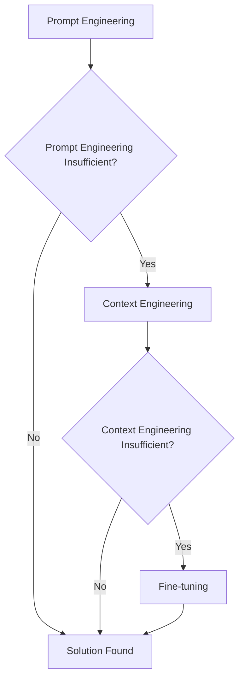
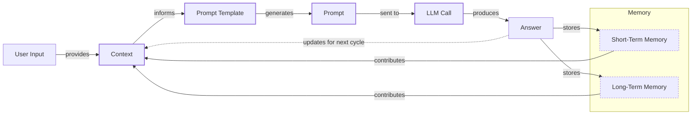
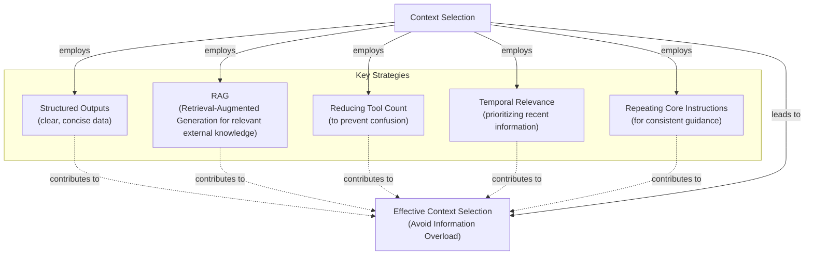
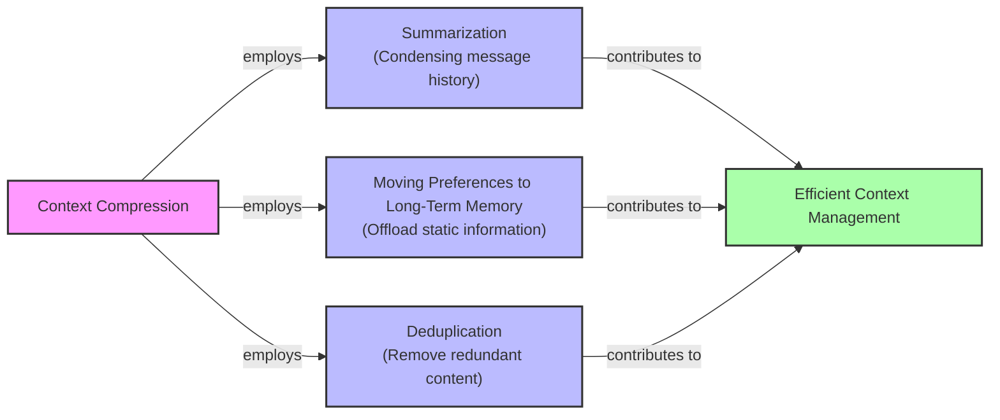
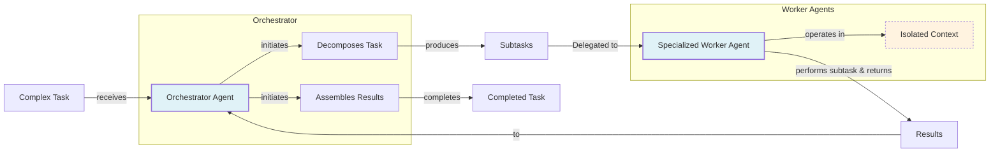

# Lesson 3: Context Engineering

AI applications have evolved rapidly. In 2022, we had simple chatbots for question-answering. By 2023, Retrieval-Augmented Generation (RAG) systems connected LLMs to domain-specific knowledge. 2024 brought us tool-using agents that could perform actions. Now, we are building memory-enabled agents that remember past interactions and build relationships over time [[20]](https://www.securityindustry.org/2024/07/16/understanding-the-evolution-from-classic-chatbots-to-rag-chatbots-to-ai-powered-assistants/).

In our last lesson, we explored how to choose between AI agents and LLM workflows. As these applications grow more complex, prompt engineering is showing its limits. It optimizes single LLM calls but fails when managing systems with memory, actions, and long interaction histories. The sheer volume of information an agent might need—past conversations, user data, documents, and action descriptions—has grown exponentially. This is where context engineering comes in. It is the discipline of orchestrating this entire information ecosystem to ensure the LLM gets exactly what it needs, when it needs it.

## From Prompt to Context Engineering

Prompt engineering is designed for single, stateless interactions. It breaks down in complex applications, creating a "long-horizon gap" where the model cannot connect early actions to long-term outcomes because the entire history does not fit in memory [[23]](https://blog.langchain.com/context-engineering-for-agents/), [[59]](https://langwatch.ai/blog/the-6-context-engineering-challenges-stopping-ai-from-scaling-in-production).

As a conversation progresses, the context grows. Without a strategy, the LLM’s performance degrades. This is context decay: the model gets confused by the noise of an ever-expanding history and starts to lose track of key information. Even with large context windows, there's a physical limit. Operationally, every token adds to the cost and latency of an LLM call [[2]](https://redis.io/blog/context-window-overflow/). Simply stuffing everything into the context creates a slow, expensive, and underperforming system. We will explore these concepts in more detail in upcoming lessons.

On a recent project, we learned this the hard way. We worked with a model supporting a million-token context window and thought, "What could go wrong?" We stuffed everything in: research, guidelines, and user history. The result was an LLM workflow that took 30 minutes to run and produced low-quality outputs. Context engineering shifts the focus from crafting static prompts to building dynamic systems that manage this information flow.

## Understanding Context Engineering

Context engineering is the practice of finding the optimal way to arrange information from your application's memory into the context passed to an LLM. It is an optimization problem where you retrieve the right parts from memory to solve a task without overwhelming the model. For example, when you ask a cooking agent for a recipe, you do not give it the entire cookbook. Instead, you retrieve the specific recipe, along with personal context like allergies or taste preferences.

Andrej Karpathy explains that LLMs are like a new kind of operating system where the model is the CPU and its context window is the RAM [[23]](https://blog.langchain.com/context-engineering-for-agents/), [[25]](https://atlan.com/know/working-memory-llms/). Just as an operating system manages what fits into your computer’s limited RAM, context engineering manages what information occupies the model’s limited context window.

Prompt engineering is a subset of context engineering. You still write effective prompts, but you also design a system that feeds the right context into those prompts. This means understanding not just *how* to phrase a task, but *what* information the model needs to perform optimally.

| Dimension | Prompt Engineering | Context Engineering |
| --- | --- | --- |
| Scope | Single interaction optimization | Entire information ecosystem |
| State Management | Stateless function | Stateful due to memory |
| Focus | How to phrase tasks | What information to provide |

Table 1: A comparison of prompt engineering and context engineering.

Context engineering is the new fine-tuning. While fine-tuning has its place, it is expensive, time-consuming, and inflexible. Data changes constantly, making fine-tuning a last resort. For most enterprise use cases, you get better results faster and more cheaply with context engineering [[40]](https://www.linkedin.com/posts/denis-panjuta_prompt-engineering-vs-context-engineering-activity-7363945251180322816-1q_m). It allows for rapid iteration without altering the core model.

When you start a new AI project, your decision-making process for guiding the LLM should look like the one presented in Image 1.



Image 1: A flowchart illustrating the decision-making workflow for AI application development.

For instance, if you build an agent to process internal Slack messages, you do not need to fine-tune a model on your company’s communication style. It is more effective to use a powerful reasoning model and engineer the context to retrieve specific messages and enable actions. Throughout this course, we will show you how to solve most industry problems using only context engineering.

## What Makes Up the Context

To master context engineering, you first need to understand what "context" is. It is everything the LLM sees in a single turn, dynamically assembled from various memory components. The high-level workflow, shown in Image 2, begins when a user input triggers the system to pull relevant information from memory. This information is assembled into the final context, inserted into a prompt template, and sent to the LLM. The LLM’s answer then updates the memory, and the cycle repeats.



Image 2: A flowchart depicting the high-level workflow of how context is managed and utilized in an LLM application.

These components are grouped into two main categories. We will explain them intuitively, as we have dedicated lessons for all of them.

### Short-Term Working Memory

Short-term working memory is the state of the agent for the current task. It is volatile and changes with each interaction, helping the agent maintain a coherent dialogue. It can include:

*   **User input:** The most recent query from the user.
*   **Message history:** The log of the current conversation.
*   **Agent's internal thoughts:** The reasoning steps the agent takes.
*   **Action calls and outputs:** The results from any actions the agent has performed.

### Long-Term Memory

Long-term memory is more persistent and stores information across sessions. We divide it into three types, drawing parallels from human memory [[28]](https://www.datacamp.com/blog/how-does-llm-memory-work).

*   **Procedural memory:** This is knowledge encoded directly in the code. It includes the system prompt, which sets the agent's overall behavior, and the definitions of available actions [[30]](https://skymod.tech/why-memory-matters-in-llm-agents-short-term-vs-long-term-memory-architectures/).
*   **Episodic memory:** This is memory of specific past experiences, like user preferences. We typically store this in vector or graph databases for efficient retrieval [[31]](https://labelstud.io/learningcenter/episodic-vs-persistent-memory-in-llms/).
*   **Semantic memory:** This is the agent’s general knowledge base, like company documents or external data accessed via the internet [[29]](https://www.analyticsvidhya.com/blog/2026/01/how-does-llm-memory-work/).

https://github.com/user-attachments/assets/0f1f193f-8e94-4044-a276-576bd7764fd0 

Image 3: Context engineering encompasses a variety of techniques and information sources. (Source [humanlayer/12-factor-agents](https://github.com/humanlayer/12-factor-agents/blob/main/content/factor-03-own-your-context-window.md))

The key takeaway is that these components are dynamic. For each new task, the short-term memory grows, or the long-term memory can change. Context engineering involves selecting the right pieces from this vast memory pool to construct the most effective prompt.

## Production Implementation Challenges

Now that we understand what makes up the context, let's look at the core challenges of implementing it in production. These all revolve around a single question: "How can I keep my context small but informative?"

Here are four common issues:

1.  **The context window challenge:** LLMs have a finite "attention budget" that grows quadratically in cost and memory with input size. Treating this as infinite leads to other problems [[17]](https://datahub.com/blog/context-window-optimization/), [[34]](https://www.anthropic.com/engineering/effective-context-engineering-for-ai-agents).
2.  **Information overload:** Too much context can confuse the LLM. This is the "lost-in-the-middle" or "needle in a haystack" problem, where models remember information best at the beginning and end of the context window. Information in the middle is often overlooked, and performance can drop long before the physical limit is reached [[45]](https://dev.to/thousand_miles_ai/the-lost-in-the-middle-problem-why-llms-ignore-the-middle-of-your-context-window-3al2).
3.  **Context rot and pollution:** Performance degrades as the context window fills with irrelevant or conflicting information, a problem known as context rot [[7]](https://thenewstack.io/context-rot-enterprise-ai-llms/), [[34]](https://www.anthropic.com/engineering/effective-context-engineering-for-ai-agents). Without a mechanism to resolve these conflicts, responses become unreliable.
4.  **Tool confusion:** This arises when an agent has too many actions, or their descriptions are unclear. Adding too many actions can confuse the LLM about the best one for the job. A solution is to apply RAG to the tool descriptions, retrieving only the most relevant actions for the task [[37]](https://www.vellum.ai/blog/multi-agent-systems-building-with-context-engineering), [[23]](https://blog.langchain.com/context-engineering-for-agents/).

## Key Strategies for Context Optimization

Modern AI solutions must manage complexity across multiple knowledge bases, tools, and conversational histories. Context engineering is about managing this complexity while meeting performance, latency, and cost requirements. Here are four popular strategies.

### Selecting the Right Context

Retrieving the right information is critical. Instead of providing everything, use RAG to fetch specific text chunks, apply RAG to tool descriptions to reduce the action space, rank time-sensitive data, and repeat core instructions at the start and end of the prompt to ensure they are not lost [[11]](https://www.dailydoseofds.com/llmops-crash-course-part-8/), [[46]](https://promptmetheus.com/resources/llm-knowledge-base/lost-in-the-middle-effect), [[23]](https://blog.langchain.com/context-engineering-for-agents/).



Image 4: Diagram illustrating strategies for selecting the right context to avoid information overload.

### Context Compression

As message history grows, you must manage it to keep the context window in check. Instead of dropping turns, you can compress key facts by summarizing interactions, moving preferences to long-term memory, and removing duplicates [[10]](https://oneuptime.com/blog/post/2026-01-30-context-compression/view). This has a trade-off: compression adds latency, and over-summarizing can cause "context collapse," where key details are lost [[60]](https://www.sitepoint.com/optimizing-token-usage-context-compression-techniques/), [[61]](https://www.linkedin.com/posts/evanahari_context-engineering-can-you-trust-long-context-activity-7353618487744892928-TPNg).



Image 5: A diagram illustrating strategies for context compression.

### Isolating Context

Another strategy is to isolate context across multiple agents. Instead of one agent with a cluttered context, a team of specialized agents can work on sub-tasks. This is often implemented with an orchestrator-worker pattern, enabling agents to discover context incrementally instead of being overwhelmed upfront [[36]](https://gurusup.com/blog/multi-agent-orchestration-guide), [[34]](https://www.anthropic.com/engineering/effective-context-engineering-for-ai-agents).



Image 6: A diagram illustrating the "Orchestrator-Worker" pattern for context isolation.

### Format Optimization

Finally, the way you format the context matters. Models are sensitive to structure, and using clear delimiters can improve performance. Common strategies are to use XML tags to wrap different pieces of context (e.g., `<user_query>`) and prefer YAML over JSON when providing structured data as input, as it is often more token-efficient [[34]](https://www.anthropic.com/engineering/effective-context-engineering-for-ai-agents).

## An Example in Practice

Let's connect theory with a concrete example. Consider these real-world scenarios:

*   **Healthcare:** An AI assistant accesses a patient's medical history, symptoms, and the latest medical literature to provide diagnostic support [[32]](https://www.decodingai.com/p/context-engineering-2025s-1-skill).
*   **Financial Services:** AI systems integrate with CRMs and calendars, combining market data and client portfolios to generate tailored financial advice.
*   **Content Creator Assistant:** An AI agent uses your research, past content, and personality traits to create content.

Let's walk through a query for the healthcare assistant. A user asks: `I have a headache. What can I do to stop it? I would prefer not to take any medicine.`

A context engineering system performs several steps:

1.  It retrieves the user's patient history, allergies, and habits from episodic memory.
2.  It queries a medical database for non-medicinal remedies from semantic memory.
3.  It assembles the key information from both memory types into the final context.
4.  It formats this information into a structured prompt and calls the LLM.

Here is a simplified snippet showing how you might structure the context using XML and YAML:

```python
SYSTEM_PROMPT = """
<system_prompt>
You are a helpful AI medical assistant. Provide safe, personalized health advice based on the provided context.
</system_prompt>

<patient_history>
{patient_history_yaml}
</patient_history>

<medical_literature>
{medical_literature_yaml}
</medical_literature>

<user_query>
{user_query}
</user_query>
"""
```

To build such a system, you need a robust tech stack. Here is a potential stack we recommend:

*   **LLM:** Gemini for its multimodal and reasoning capabilities.
*   **Orchestration:** LangGraph for defining stateful, agentic workflows.
*   **Databases:** PostgreSQL, MongoDB, Qdrant, and Neo4j.
*   **Observability:** Opik or LangSmith for evaluation and trace monitoring.

## Connecting Context Engineering to AI Engineering

Context engineering is about developing the intuition to find the smallest set of high-signal tokens that maximize the chance of a successful outcome. Like a software engineer designing an information architecture, you must arrange context for optimal results, blending the art of prompt design with the science of system optimization [[34]](https://www.anthropic.com/engineering/effective-context-engineering-for-ai-agents), [[62]](https://www.elastic.co/what-is/context-engineering).

It is a complex field that combines AI Engineering, Software Engineering (SWE), Data Engineering, and Operations (Ops). Our goal with this course is to teach you how to combine these skills to build production-ready AI products. In the world of AI, we should all think in systems rather than isolated components.

In the next lesson, we will explore structured outputs.

## References

- [1] [A Survey of Context Engineering for Large Language Models](https://arxiv.org/pdf/2507.13334)
- [2] [Context Window Overflow: Why it Happens and How to Fix it](https://redis.io/blog/context-window-overflow/)
- [3] [Context Rot: How Increasing Input Tokens Impacts LLM Performance](https://www.trychroma.com/research/context-rot)
- [4] [Four Design Patterns for Event-Driven, Multi-Agent Systems](https://www.confluent.io/blog/event-driven-multi-agent-systems/)
- [5] [Production LLM monitoring strategies](https://galileo.ai/blog/production-llm-monitoring-strategies)
- [6] [Navigating the Shifting Sands: Understanding and Mitigating Data Drift in LLMs](https://www.coforge.com/what-we-know/blog/navigating-the-shifting-sands-understanding-and-mitigating-data-drift-in-llms)
- [7] [Context Rot Is the Silent Killer of Enterprise AI LLMs](https://thenewstack.io/context-rot-enterprise-ai-llms/)
- [8] [The Hidden Cost of LLM Drift: Why Detection is Just the Beginning](https://insightfinder.com/blog/hidden-cost-llm-drift-detection/)
- [9] [How to Reduce LLM Hallucination](https://www.helicone.ai/blog/how-to-reduce-llm-hallucination)
- [10] [How to Build Context Compression](https://oneuptime.com/blog/post/2026-01-30-context-compression/view)
- [11] [LLMOps Crash Course Part 8: Memory and Temporal Context](https://www.dailydoseofds.com/llmops-crash-course-part-8/)
- [12] [Context Compression through Item Description Summarization](https://arxiv.org/html/2510.22101v1)
- [13] [Cutting Through the Noise: Smarter Context Management for LLM-Powered Agents](https://blog.jetbrains.com/research/2025/12/efficient-context-management/)
- [14] [Context Window Management: Strategies for Long-Context AI Agents and Chatbots](https://www.getmaxim.ai/articles/context-window-management-strategies-for-long-context-ai-agents-and-chatbots/)
- [15] [+1 for "context engineering" over "prompt engineering".](https://x.com/karpathy/status/1937902205765607626)
- [16] [ContextOps, the DevOps for AI-generated Code](https://packmind.com/context-engineering-ai-coding/what-is-contextops/)
- [17] [Context Engineering for Observability: How to Deliver the Right Data to LLMs](https://www.mezmo.com/learn-observability/context-engineering-for-observability-how-to-deliver-the-right-data-to-llms)
- [18] [AI Context Engineering: A Comprehensive Guide](https://sombrainc.com/blog/ai-context-engineering-guide)
- [19] [Context engineering AI: The foundation of reliable, high-performing models](https://www.glean.com/blog/context-engineering-ai-the-foundation-of-reliable-high-performing-models)
- [20] [Understanding the evolution from classic chatbots to RAG chatbots to AI-powered assistants](https://www.securityindustry.org/2024/07/16/understanding-the-evolution-from-classic-chatbots-to-rag-chatbots-to-ai-powered-assistants/)
- [21] [The Evolution of AI Chatbots: From Generative AI to Autonomous Agents](https://pagergpt.ai/ai-chatbot/evolution-of-ai-chatbots)
- [22] [When Did AI Chatbots Start? The History of AI Chatbots](https://www.dante-ai.com/news/when-did-ai-chatbots-start)
- [23] [Context Engineering for Agents](https://blog.langchain.com/context-engineering-for-agents/)
- [24] [Context Engineering vs Prompt Engineering: Key Differences Explained](https://www.glean.com/perspectives/context-engineering-vs-prompt-engineering-key-differences-explained)
- [25] [Working Memory is the New Bottleneck for LLMs](https://atlan.com/know/working-memory-llms/)
- [26] [From Vibe Coding To Context Engineering: A Blueprint for Production-Grade GenAI Systems](https://www.sundeepteki.org/blog/from-vibe-coding-to-context-engineering-a-blueprint-for-production-grade-genai-systems)
- [27] [Context Engineering: The Silent Architecture Behind Every AI Agent](https://www.linkedin.com/pulse/context-engineering-silent-architecture-behind-every-ai-roychowdhury-lzcec)
- [28] [How Does LLM Memory Work?](https://www.datacamp.com/blog/how-does-llm-memory-work)
- [29] [How Does LLM Memory Work?](https://www.analyticsvidhya.com/blog/2026/01/how-does-llm-memory-work/)
- [30] [Why Memory Matters in LLM Agents: Short-Term vs. Long-Term Memory Architectures](https://skymod.tech/why-memory-matters-in-llm-agents-short-term-vs-long-term-memory-architectures/)
- [31] [Episodic vs. Persistent Memory in LLMs](https://labelstud.io/learningcenter/episodic-vs-persistent-memory-in-llms/)
- [32] [Context Engineering: 2025's #1 Skill](https://www.decodingai.com/p/context-engineering-2025s-1-skill)
- [33] [Prompt Engineering in Healthcare: A Practical Guide with Examples](https://www.mdpi.com/2079-9292/13/15/2961)
- [34] [Effective context engineering for AI agents](https://www.anthropic.com/engineering/effective-context-engineering-for-ai-agents)
- [35] [Multi-Agent Orchestration Patterns for Production](https://beam.ai/agentic-insights/multi-agent-orchestration-patterns-production)
- [36] [Multi-Agent Orchestration: Guide to Building Your Own](https://gurusup.com/blog/multi-agent-orchestration-guide)
- [37] [Multi-Agent Systems: Building with Context Engineering](https://www.vellum.ai/blog/multi-agent-systems-building-with-context-engineering)
- [38] [Deterministic AI Orchestration: A Platform Architecture for Autonomous Development](https://www.praetorian.com/blog/deterministic-ai-orchestration-a-platform-architecture-for-autonomous-development/)
- [39] [Specialized Agents for Building Enterprise-Grade RAG Applications](https://arxiv.org/html/2601.13671v1)
- [40] [Prompt Engineering vs Context Engineering vs Fine-Tuning](https://www.linkedin.com/posts/denis-panjuta_prompt-engineering-vs-context-engineering-activity-7363945251180322816-1q_m)
- [41] [Prompt Engineering vs Context Engineering: What’s the Difference?](https://memgraph.com/blog/prompt-engineering-vs-context-engineering)
- [42] [Context Engineering: An Intro to the Future of AI Agents](https://www.instinctools.com/blog/context-engineering/)
- [43] [Agentic AI: Context Engineering vs Prompt Engineering](https://neo4j.com/blog/agentic-ai/context-engineering-vs-prompt-engineering/)
- [44] [Lost in the Middle: A Lesson in Failing AI Agents… Backwards](https://www.linkedin.com/pulse/lost-middle-lesson-failing-ai-agents-backwards-anthony-dejohn-01k2e)
- [45] [The 'Lost in the Middle' problem: Why LLMs ignore the middle of your context window](https://dev.to/thousand_miles_ai/the-lost-in-the-middle-problem-why-llms-ignore-the-middle-of-your-context-window-3al2)
- [46] [Lost-in-the-Middle Effect](https://promptmetheus.com/resources/llm-knowledge-base/lost-in-the-middle-effect)
- [47] [LLM Context Window Limitations: Impacts, Risks, & Fixes in 2026](https://atlan.com/know/llm-context-window-limitations/)
- [48] [Needle in a Haystack: Optimizing Retrieval and RAG over Long Context Windows](https://bigdataboutique.com/blog/needle-in-haystack-optimizing-retrieval-and-rag-over-long-context-windows-5dfb3c)
- [49] [Context Engineering in AI: Core Techniques, Steps, and Tools](https://www.codecademy.com/article/context-engineering-in-ai)
- [50] [Context Engineering in LLMs and AI Agents](https://blog.stackademic.com/context-engineering-in-llms-and-ai-agents-eb861f0d3e9b)
- [51] [How to Implement Context Engineering for AI Coding](https://packmind.com/context-engineering-ai-coding/how-to-implement-context-engineering/)
- [52] [Context Engineering Platforms Comparison](https://atlan.com/know/context-engineering-platforms-comparison/)
- [53] [LangGraph: The Agentic Powerhouse](https://www.scalablepath.com/machine-learning/langgraph)
- [54] [Context Engineering: A Guide With Examples](https://www.datacamp.com/blog/context-engineering)
- [55] [Context Engineering - What it is, and techniques to consider](https://www.llamaindex.ai/blog/context-engineering-what-it-is-and-techniques-to-consider)
- [56] [The rise of "context engineering"](https://blog.langchain.com/the-rise-of-context-engineering/)
- [57] [Context Engineering 101 cheat sheet](https://x.com/lenadroid/status/1943685060785524824)
- [58] [Context Engineering Guide](https://nlp.elvissaravia.com/p/context-engineering-guide)
- [59] [The 6 context engineering challenges stopping AI from scaling in production](https://langwatch.ai/blog/the-6-context-engineering-challenges-stopping-ai-from-scaling-in-production)
- [60] [Optimizing Token Usage: Context Compression Techniques](https://www.sitepoint.com/optimizing-token-usage-context-compression-techniques/)
- [61] [Context Engineering: Can you trust long-context LLMs?](https://www.linkedin.com/posts/evanahari_context-engineering-can-you-trust-long-context-activity-7353618487744892928-TPNg)
- [62] [What is Context Engineering?](https://www.elastic.co/what-is/context-engineering)
- [63] [What is Context Engineering?](https://www.pinecone.io/learn/context-engineering/)