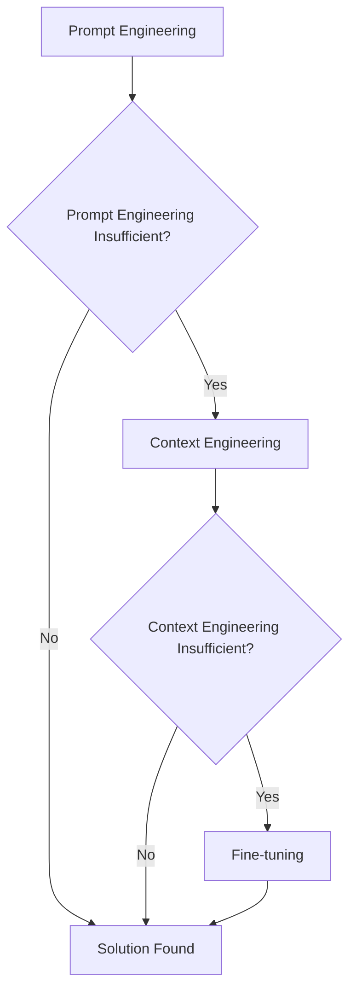
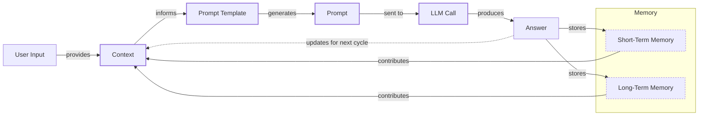
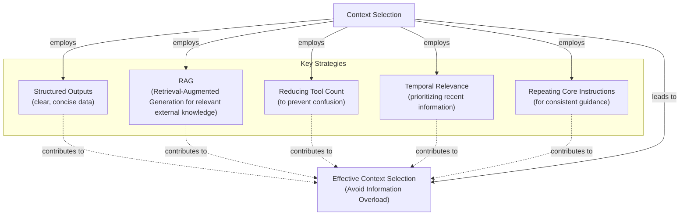
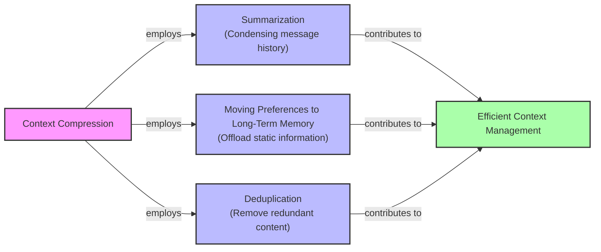
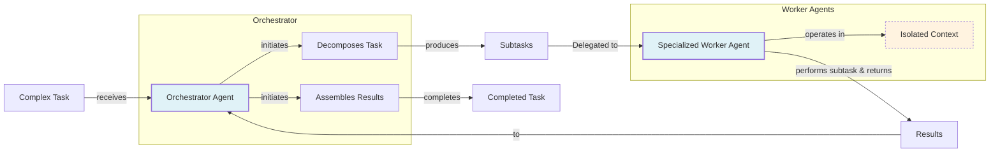

AI applications have evolved rapidly. Simple chatbots in 2022 gave way to Retrieval-Augmented Generation (RAG) systems in 2023. 2024 brought tool-using agents, and now we build memory-enabled agents that learn from past interactions [[1]](https://www.securityindustry.org/2024/07/16/understanding-the-evolution-from-classic-chatbots-to-rag-chatbots-to-ai-powered-assistants/). In our last lesson, we explored choosing between AI agents and LLM workflows. As these systems grow more complex, prompt engineering is no longer enough. It fails to manage the memory, actions, and long histories of modern agents. The need to orchestrate this vast information ecosystem introduces context engineering, a discipline for giving an LLM exactly what it needs.

## From prompt to context engineering

Prompt engineering is designed for single, stateless interactions. This approach fails in complex applications, creating a "long-horizon gap" where the model cannot connect early actions to long-term outcomes because the entire history does not fit in memory [[3]](https://langwatch.ai/blog/the-6-context-engineering-challenges-stopping-ai-from-scaling-in-production). As a conversation progresses, the context grows, and performance degrades. This is context decay: the model gets confused by the noise of an expanding history. Operationally, every token adds to the cost and latency of an LLM call [[4]](https://redis.io/blog/context-window-overflow/). On a recent project, we stuffed everything into a million-token context window. The result was a slow, expensive, and underperforming system. Context engineering solves this by shifting focus from static prompts to dynamic systems that manage information flow.

## Understanding context engineering

Context engineering is the practice of arranging information from your application's memory into the context passed to an LLM. It is an optimization problem where you retrieve the right parts from memory to solve a task without overwhelming the model. For example, a cooking agent retrieves a specific recipe and your allergies, not the entire cookbook.

Andrej Karpathy explains that LLMs are like a new operating system where the model is the CPU and its context window is the RAM [[2]](https://blog.langchain.com/context-engineering-for-agents/), [[5]](https://atlan.com/know/working-memory-llms/). Context engineering manages what information occupies this limited RAM. Prompt engineering is a subset of context engineering. You still write effective prompts, but you also design a system that feeds the right context into them.

| Dimension | Prompt Engineering | Context Engineering |
| --- | --- | --- |
| Scope | Single interaction optimization | Entire information ecosystem |
| State Management | Stateless function | Stateful due to memory |
| Focus | How to phrase tasks | What information to provide |

Table 1: A comparison of prompt engineering and context engineering.

Context engineering is the new fine-tuning. While fine-tuning has its place, it is expensive and inflexible. For most enterprise use cases, you get better results faster and more cheaply with context engineering [[6]](https://www.linkedin.com/posts/denis-panjuta_prompt-engineering-vs-context-engineering-activity-7363945251180322816-1q_m). It allows for rapid iteration without altering the core model. When starting a new AI project, your decision-making process should follow the workflow in Image 1.



Image 1: A flowchart illustrating the decision-making workflow for AI application development.

For instance, an agent processing Slack messages does not need fine-tuning. It is more effective to use a powerful reasoning model and engineer the context to retrieve specific messages and enable actions. Throughout this course, we will focus on solving problems using context engineering.

## What makes up the context

To master context engineering, you must understand what "context" is. It is everything the LLM sees in a single turn, dynamically assembled from memory. The high-level workflow, shown in Image 2, begins when a user input triggers the system to pull information from memory. This is assembled into the final context, inserted into a prompt template, and sent to the LLM. The LLM’s answer then updates the memory, and the cycle repeats.



Image 2: A flowchart depicting the high-level workflow of how context is managed and utilized in an LLM application.

These components are grouped into two main categories, which we will explain intuitively.

**Short-term working memory** is the agent's state for the current task. It is volatile and includes the user's input, the current message history, the agent's internal reasoning steps, and the outputs from any actions it has performed.

**Long-term memory** is more persistent and stores information across sessions. We divide it into three types, drawing parallels from human memory [[7]](https://www.datacamp.com/blog/how-does-llm-memory-work). **Procedural memory** is knowledge encoded in the code, like the system prompt and available action definitions [[8]](https://skymod.tech/why-memory-matters-in-llm-agents-short-term-vs-long-term-memory-architectures/). **Episodic memory** stores specific past experiences, like user preferences, often in vector or graph databases [[9]](https://labelstud.io/learningcenter/episodic-vs-persistent-memory-in-llms/). **Semantic memory** is the agent’s general knowledge base, such as company documents or external data [[10]](https://www.analyticsvidhya.com/blog/2026/01/how-does-llm-memory-work/). We will cover these concepts in depth in future lessons.

Image 3: Context engineering encompasses a variety of techniques and information sources. (Source [humanlayer/12-factor-agents](https://github.com/humanlayer/12-factor-agents/blob/main/content/factor-03-own-your-context-window.md))

The key takeaway is that these components are dynamic. Context engineering involves selecting the right pieces from this memory pool for the task at hand.

## Production implementation challenges

Implementing context engineering in production revolves around one question: "How can I keep my context small but informative?" Here are four common issues.

**The context window challenge** is that LLMs have a finite "attention budget" that grows quadratically in cost and memory with input size [[12]](https://datahub.com/blog/context-window-optimization/), [[13]](https://www.anthropic.com/engineering/effective-context-engineering-for-ai-agents).

**Information overload** occurs when too much context confuses the LLM. This is the "lost-in-the-middle" problem, where models ignore information in the middle of the context, causing performance to drop long before the physical limit is reached [[14]](https://dev.to/thousand_miles_ai/the-lost-in-the-middle-problem-why-llms-ignore-the-middle-of-your-context-window-3al2).

**Context rot and pollution** happen as the context window fills with irrelevant or conflicting information, making responses unreliable [[15]](https://thenewstack.io/context-rot-enterprise-ai-llms/), [[13]](https://www.anthropic.com/engineering/effective-context-engineering-for-ai-agents).

**Tool confusion** arises when an agent has too many actions or their descriptions are unclear. A common solution is to use RAG on tool descriptions to retrieve only the most relevant ones for a given task [[16]](https://www.vellum.ai/blog/multi-agent-systems-building-with-context-engineering), [[2]](https://blog.langchain.com/context-engineering-for-agents/).

## Key strategies for context optimization

Modern AI solutions must manage complexity across multiple knowledge bases, tools, and conversational histories. Context engineering is about managing this complexity while meeting performance, latency, and cost requirements. Here are four popular strategies.

### Selecting the Right Context

Retrieving the right information is critical. Instead of providing everything, use RAG to fetch specific text chunks, apply RAG to tool descriptions to reduce the action space, rank time-sensitive data, and repeat core instructions at the start and end of the prompt to ensure they are not lost [[17]](https://www.dailydoseofds.com/llmops-crash-course-part-8/), [[18]](https://promptmetheus.com/resources/llm-knowledge-base/lost-in-the-middle-effect), [[2]](https://blog.langchain.com/context-engineering-for-agents/).



Image 4: Diagram illustrating strategies for selecting the right context to avoid information overload.

### Context Compression

As message history grows, you must manage it to keep the context window in check. Instead of dropping turns, you can compress key facts by summarizing interactions, moving preferences to long-term memory, and removing duplicates [[19]](https://oneuptime.com/blog/post/2026-01-30-context-compression/view). This has a trade-off: compression adds latency, and over-summarizing can cause "context collapse," where key details are lost [[20]](https://www.sitepoint.com/optimizing-token-usage-context-compression-techniques/), [[21]](https://www.linkedin.com/posts/evanahari_context-engineering-can-you-trust-long-context-activity-7353618487744892928-TPNg).



Image 5: A diagram illustrating strategies for context compression, showing how Summarization, Moving Preferences to Long-Term Memory, and Deduplication contribute to Efficient Context Management.

### Isolating Context

Another strategy is to isolate context across multiple agents. Instead of one agent with a cluttered context, a team of specialized agents can work on sub-tasks. This is often implemented with an orchestrator-worker pattern, enabling agents to discover context incrementally instead of being overwhelmed upfront [[22]](https://gurusup.com/blog/multi-agent-orchestration-guide), [[13]](https://www.anthropic.com/engineering/effective-context-engineering-for-ai-agents).



Image 6: A diagram illustrating the "Orchestrator-Worker" pattern for context isolation.

### Format Optimization

Finally, the way you format the context matters. Models are sensitive to structure, and using clear delimiters can improve performance. Common strategies are to use XML tags to wrap different pieces of context (e.g., `<user_query>`) and prefer YAML over JSON when providing structured data as input, as it is often more token-efficient [[13]](https://www.anthropic.com/engineering/effective-context-engineering-for-ai-agents).

## Here is an example

Let's connect theory with a concrete example. Consider these real-world scenarios:

*   **Healthcare:** An AI assistant accesses a patient's medical history, symptoms, and the latest medical literature to provide diagnostic support [[23]](https://www.decodingai.com/p/context-engineering-2025s-1-skill).
*   **Financial Services:** AI systems integrate with CRMs and calendars, combining market data and client portfolios to generate tailored financial advice.
*   **Content Creator Assistant:** An AI agent uses your research, past content, and personality traits to create content.

Let's walk through a query for the healthcare assistant. A user asks: `I have a headache. What can I do to stop it? I would prefer not to take any medicine.`

A context engineering system performs several steps:

1.  It retrieves the user's patient history, allergies, and habits from episodic memory.
2.  It queries a medical database for non-medicinal remedies from semantic memory.
3.  It assembles the key information from both memory types into the final context.
4.  It formats this information into a structured prompt and calls the LLM.

Here is a simplified snippet showing how you might structure the context using XML and YAML:

```python
SYSTEM_PROMPT = """
<system_prompt>
You are a helpful AI medical assistant. Provide safe, personalized health advice based on the provided context.
</system_prompt>

<patient_history>
{patient_history_yaml}
</patient_history>

<medical_literature>
{medical_literature_yaml}
</medical_literature>

<user_query>
{user_query}
</user_query>
"""
```

To build such a system, you need a robust tech stack. Here is a potential stack we recommend:

*   **LLM:** Gemini for its multimodal and reasoning capabilities.
*   **Orchestration:** LangGraph for defining stateful, agentic workflows.
*   **Databases:** PostgreSQL, MongoDB, Qdrant, and Neo4j.
*   **Observability:** Opik or LangSmith for evaluation and trace monitoring.

## Conclusion - Wrap-up: Connecting context engineering to AI engineering

Context engineering is about developing the intuition to find the smallest set of high-signal tokens that maximize the chance of a successful outcome [[13]](https://www.anthropic.com/engineering/effective-context-engineering-for-ai-agents). It combines AI Engineering, Software Engineering (SWE), Data Engineering, and Operations (Ops). Our goal with this course is to teach you how to integrate these skills to build production-ready AI products, shifting your mindset from a developer to an architect. In the next lesson, we will explore structured outputs, a key technique for creating reliable AI systems.

## References

- [1] [Understanding the evolution from classic chatbots to RAG chatbots to AI-powered assistants](https://www.securityindustry.org/2024/07/16/understanding-the-evolution-from-classic-chatbots-to-rag-chatbots-to-ai-powered-assistants/)
- [2] [Context Engineering for Agents](https://blog.langchain.com/context-engineering-for-agents/)
- [3] [The 6 context engineering challenges stopping AI from scaling in production](https://langwatch.ai/blog/the-6-context-engineering-challenges-stopping-ai-from-scaling-in-production)
- [4] [Context Window Overflow: Why it Happens and How to Fix it](https://redis.io/blog/context-window-overflow/)
- [5] [Working Memory is the New Bottleneck for LLMs](https://atlan.com/know/working-memory-llms/)
- [6] [Prompt Engineering vs Context Engineering vs Fine-Tuning](https://www.linkedin.com/posts/denis-panjuta_prompt-engineering-vs-context-engineering-activity-7363945251180322816-1q_m)
- [7] [How Does LLM Memory Work?](https://www.datacamp.com/blog/how-does-llm-memory-work)
- [8] [Why Memory Matters in LLM Agents: Short-Term vs. Long-Term Memory Architectures](https://skymod.tech/why-memory-matters-in-llm-agents-short-term-vs-long-term-memory-architectures/)
- [9] [Episodic vs. Persistent Memory in LLMs](https://labelstud.io/learningcenter/episodic-vs-persistent-memory-in-llms/)
- [10] [How Does LLM Memory Work?](https://www.analyticsvidhya.com/blog/2026/01/how-does-llm-memory-work/)
- [11] [Own your context window](https://github.com/humanlayer/12-factor-agents/blob/main/content/factor-03-own-your-context-window.md)
- [12] [Context Window Optimization: A Practical Guide for LLM Developers](https://datahub.com/blog/context-window-optimization/)
- [13] [Effective context engineering for AI agents](https://www.anthropic.com/engineering/effective-context-engineering-for-ai-agents)
- [14] [The 'Lost in the Middle' problem: Why LLMs ignore the middle of your context window](https://dev.to/thousand_miles_ai/the-lost-in-the-middle-problem-why-llms-ignore-the-middle-of-your-context-window-3al2)
- [15] [Context Rot Is the Silent Killer of Enterprise AI LLMs](https://thenewstack.io/context-rot-enterprise-ai-llms/)
- [16] [Multi-Agent Systems: Building with Context Engineering](https://www.vellum.ai/blog/multi-agent-systems-building-with-context-engineering)
- [17] [LLMOps Crash Course Part 8: Memory and Temporal Context](https://www.dailydoseofds.com/llmops-crash-course-part-8/)
- [18] [Lost-in-the-Middle Effect](https://promptmetheus.com/resources/llm-knowledge-base/lost-in-the-middle-effect)
- [19] [How to Build Context Compression](https://oneuptime.com/blog/post/2026-01-30-context-compression/view)
- [20] [Optimizing Token Usage: Context Compression Techniques](https://www.sitepoint.com/optimizing-token-usage-context-compression-techniques/)
- [21] [Context Engineering: Can you trust long-context LLMs?](https://www.linkedin.com/posts/evanahari_context-engineering-can-you-trust-long-context-activity-7353618487744892928-TPNg)
- [22] [Multi-Agent Orchestration: Guide to Building Your Own](https://gurusup.com/blog/multi-agent-orchestration-guide)
- [23] [Context Engineering: 2025's #1 Skill](https://www.decodingai.com/p/context-engineering-2025s-1-skill)
</article>