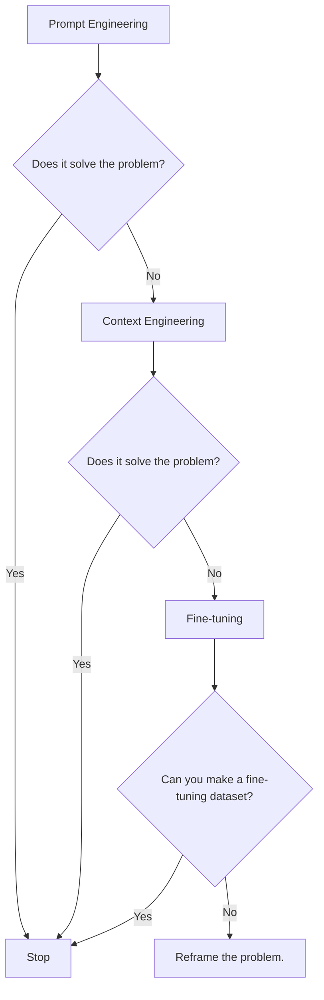
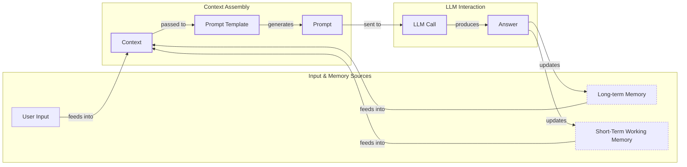
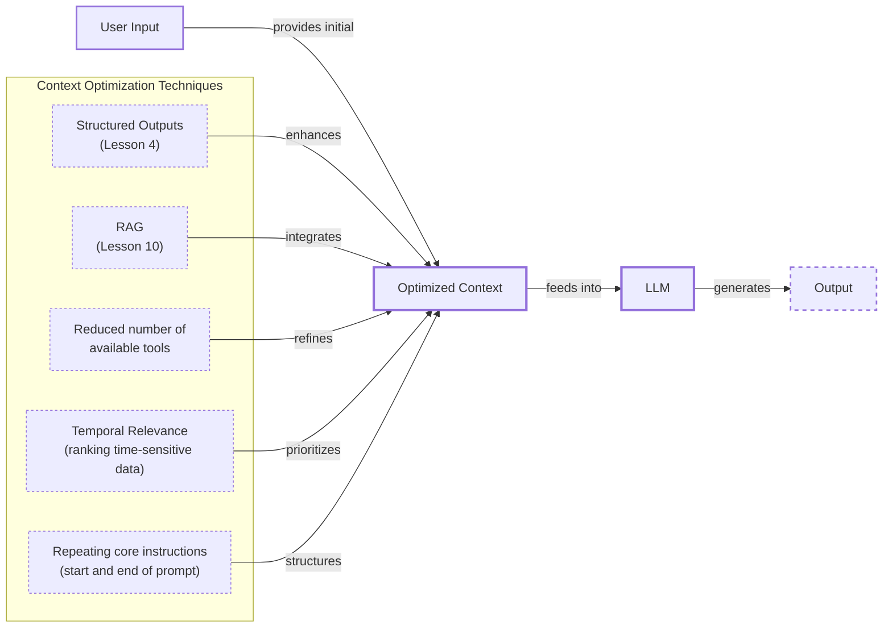
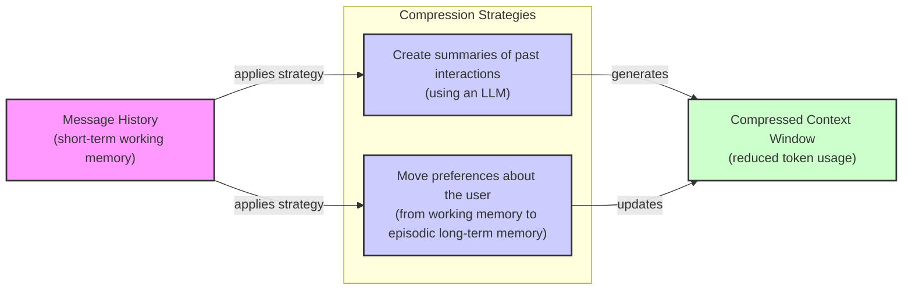
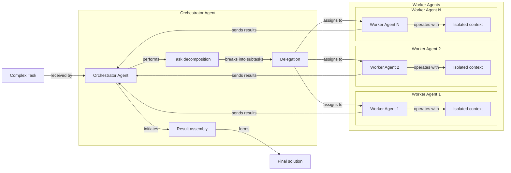

# Lesson 3: Context Engineering

## When prompt engineering breaks

AI applications have evolved rapidly. In 2022, we had simple chatbots for question-answering [[1]](https://www.securityindustry.org/2024/07/16/understanding-the-evolution-from-classic-chatbots-to-rag-chatbots-to-ai-powered-assistants/). By 2023, RAG systems connected LLMs to domain-specific knowledge [[2]](https://www.linkedin.com/posts/ai-apps-central_most-people-put-all-ai-systems-in-the-same-activity-7438555783077793792-UEUm). 2024 brought us tool-using agents that could perform actions [[3]](https://pagergpt.ai/ai-chatbot/evolution-of-ai-chatbots). Now, we are building memory-enabled agents that remember past interactions and build relationships over time [[2]](https://www.linkedin.com/posts/ai-apps-central_most-people-put-all-ai-systems-in-the-same-activity-7438555783077793792-UEUm).

In our last lesson, we explored how to choose between AI agents and LLM workflows when designing a system. As these applications grow more complex, prompt engineering, a practice that once served us well, is showing its limits. It optimizes single LLM calls but fails when managing systems with memory, actions, and long interaction histories [[4]](https://memgraph.com/blog/prompt-engineering-vs-context-engineering). The sheer volume of information an agent might need has grown exponentially. This includes past conversations, user data, documents, and action descriptions [[5]](https://sombrainc.com/blog/ai-context-engineering-guide). Simply stuffing all this into a prompt is not a viable strategy.

The solution is context engineering. It is the discipline of orchestrating this entire information ecosystem to ensure the LLM gets exactly what it needs, when it needs it [[6]](https://www.langchain.com/blog/context-engineering-for-agents/). While fine-tuning is expensive, slow, and inflexible in a world of ever-changing data, context engineering has become the core skill for building successful AI systems that manage memory to achieve the best possible performance [[7]](https://www.linkedin.com/posts/denis-panjuta_prompt-engineering-vs-context-engineering-activity-7363945251180322816-1q_m). This skill is a core foundation for AI engineering.

## From Prompt to Context Engineering

Prompt engineering, while effective for simple tasks, is designed for single, stateless interactions. It treats each call to an LLM as a new, isolated event [[4]](https://memgraph.com/blog/prompt-engineering-vs-context-engineering). This approach breaks down in stateful applications where context must be preserved and managed across multiple turns.

As a conversation or task progresses, the context grows. Without a strategy to manage this growth, the LLM’s performance degrades. This is context decay: the model gets confused by the noise of an ever-expanding history and starts to lose track of the original instructions or key information [[8]](https://www.trychroma.com/research/context-rot).

Even with large context windows, a physical limit exists for what you can include. The Key-Value (KV) cache, which stores intermediate attention computations, often becomes a physical memory bottleneck long before the advertised token limit is reached [[9]](https://atlan.com/know/llm-context-window-limitations/). More importantly, every token adds to the cost and latency of an LLM call [[10]](https://www.dailydoseofds.com/llmops-crash-course-part-8/). Simply putting everything into the context creates a slow, expensive, and underperforming system [[11]](https://redis.io/blog/context-window-overflow/). We will explore these concepts in more detail in upcoming lessons, including memory in Lesson 9 and RAG in Lesson 10.

On a recent project, we learned this the hard way. We were working with a model that supported a million-token context window, so we thought, "*What could go wrong?*" We stuffed everything in: our research, guidelines, examples, and user history. The result was an LLM workflow that took 30 minutes to run and produced low-quality outputs.

For these reasons, context engineering is essential. It shifts the focus from crafting static prompts to building dynamic systems that manage information flow [[12]](https://blog.langchain.com/the-rise-of-context-engineering/). As an AI engineer, your job is to select only the most critical pieces of context for each LLM call. This makes your applications accurate, fast, and cost-effective [[13]](https://datahub.com/blog/context-window-optimization/).

## Understanding Context Engineering

Context engineering is about finding the best way to arrange parts of your memory into the context that's passed to the LLM to squeeze out the best results [[14]](https://www.llamaindex.ai/blog/context-engineering-what-it-is-and-techniques-to-consider). It's a solution to an optimization problem where you retrieve the right parts of both your short-term and long-term memory to solve a specific task without overwhelming the LLM [[5]](https://arxiv.org/pdf/2507.13334). For example, when you ask a cooking agent for a recipe, you do not give it the entire cookbook. Instead, you retrieve the specific recipe, along with personal context like allergies or taste preferences. This precise selection ensures the model receives only the essential information.

Andrej Karpathy explains that LLMs are like a new kind of operating system where the model is the CPU and its context window is the RAM [[6]](https://www.langchain.com/blog/context-engineering-for-agents/). Just as an operating system manages what fits into your computer’s limited RAM, context engineering manages what information occupies the model’s limited context window. This analogy extends further: everything outside the context window, like vector stores or conversation histories, acts as disk storage. This information is vast and passive, requiring an explicit "load" operation (retrieval) before it can influence the model's reasoning [[15]](https://atlan.com/know/working-memory-llms/).

How does context engineering relate to prompt engineering? Prompt engineering is a subset of context engineering [[12]](https://blog.langchain.com/the-rise-of-context-engineering/). You still write effective prompts, but you also design a system that feeds the right context into those prompts. This means understanding not just *how* to phrase a task, but *what* information the model needs to perform optimally [[16]](https://nlp.elvissaravia.com/p/context-engineering-guide).

<table_caption>
Table 1: A comparison of prompt engineering and context engineering.
</table_caption>

| Dimension | Prompt Engineering | Context Engineering |
|---|---|---|
| Scope | Single interaction optimization | Entire information ecosystem |
| State Management | Stateless function | Stateful due to memory |
| Focus | How to phrase tasks | What information to provide |

Context engineering is the new fine-tuning. While fine-tuning has its place, it is expensive, time-consuming, and inflexible [[7]](https://www.linkedin.com/posts/denis-panjuta_prompt-engineering-vs-context-engineering-activity-7363945251180322816-1q_m). For most enterprise use cases, you get better results faster and more cheaply with context engineering. It allows for rapid iteration and adaptation to evolving data without altering the core model, a key advantage in dynamic environments.

When you start a new AI project, your decision-making process for guiding the LLM should look like the one presented in Image 1. You start with simple prompt engineering. If that fails, you move to context engineering, which provides the model with dynamic, task-specific knowledge at inference time. Fine-tuning, which alters the model's core behavior, should always be the last resort if all else fails. It is best reserved for teaching a model a new skill or behavior, like adhering to a specific JSON format, not for providing it with new facts [[7]](https://www.linkedin.com/posts/denis-panjuta_prompt-engineering-vs-context-engineering-activity-7363945251180322816-1q_m).


<diagram_caption>
Image 1: A flowchart illustrating the decision-making process for choosing between Prompt Engineering, Context Engineering, and Fine-tuning when building new AI applications.
</diagram_caption>

For instance, if you build an agent to process internal Slack messages, you do not need to fine-tune a model on your company’s communication style. It is more effective to use a powerful reasoning model and engineer the context to retrieve specific messages and enable actions like creating tasks or drafting emails [[17]](https://www.mezmo.com/learn-observability/context-engineering-for-observability-how-to-deliver-the-right-data-to-llms). Throughout this course, we will show you how to solve most industry problems using only context engineering.

## What Makes Up the Context

To master context engineering, you first need to understand what "context" actually is. It is everything the LLM sees in a single turn, dynamically assembled from various memory components before being passed to the model [[5]](https://sombrainc.com/blog/ai-context-engineering-guide).

The high-level workflow, as presented in Image 2, begins when a user input triggers the system to pull relevant information from both long-term and short-term memory. This information is assembled into the final context, inserted into a prompt template, and sent to the LLM. The LLM’s answer then updates the memory, and the cycle repeats.


<diagram_caption>
Image 2: A flowchart illustrating the high-level workflow of how user input and memory are processed to form the context passed to an LLM.
</diagram_caption>

These components are grouped into two main categories. We will explain them intuitively for now, as we have future dedicated lessons for all of them.

### Short-Term Working Memory

Short-term working memory is the state of the agent for the current task or conversation. It is volatile and changes with each interaction, helping the agent maintain a coherent dialogue and make immediate decisions [[18]](https://www.datacamp.com/blog/how-does-llm-memory-work). It can include some or all of these components:

-   **User input:** The most recent query or command from the user.
-   **Message history:** The log of the current conversation, allowing the LLM to understand the flow and previous turns.
-   **Agent's internal thoughts:** The reasoning steps the agent takes to decide on its next action.
-   **Action calls and outputs:** The results from any actions the agent has performed, providing information from external systems.

### Long-Term Memory

Long-term memory is more persistent and stores information across sessions, allowing the AI system to remember things beyond a single conversation [[19]](https://skymod.tech/why-memory-matters-in-llm-agents-short-term-vs-long-term-memory-architectures/). We divide it into three types, drawing parallels from human memory. An AI system can include some or all of them:

-   **Procedural memory:** This is knowledge encoded directly in the code. It includes the system prompt, which sets the agent's overall behavior. It also includes the definitions of available actions, which tell the agent what it can do, and schemas for structured outputs, which guide the format of its responses. This memory represents the agent's built-in skills [[16]](https://www.analyticsvidhya.com/blog/2026/01/how-does-llm-memory-work/).
-   **Episodic memory:** This is memory of specific past experiences, like user preferences or previous interactions. It's used to help the agent personalize its responses based on individual users. We typically store this in vector or graph databases for efficient retrieval [[20]](https://labelstud.io/learningcenter/episodic-vs-persistent-memory-in-llms/).
-   **Semantic memory:** This is the agent’s general knowledge base. It can be internal, like company documents, or external, accessed via the internet through API calls or web scraping. This memory provides the factual information the agent needs to answer questions [[21]](https://atlan.com/know/working-memory-llms/).

If this seems like a lot, bear with us. We will cover all these concepts in-depth in future lessons, including structured outputs (Lesson 4), actions (Lesson 6), memory (Lesson 9), RAG (Lesson 10), and working with multimodal data (Lesson 11).
<image_caption>Image 3: Context engineering encompasses a variety of techniques and information sources. (Source [humanlayer/12-factor-agents](https://github.com/humanlayer/12-factor-agents/blob/main/content/factor-03-own-your-context-window.md) [[22]](https://github.com/humanlayer/12-factor-agents))</image_caption>

The key takeaway is that these components are not static. They are dynamically re-computed for every single interaction. For each conversation turn or new task, the short-term memory grows, or the long-term memory can change. Context engineering involves knowing how to select the right pieces from this vast memory pool to construct the most effective prompt for the task at hand.

## Production Implementation Challenges

Now that we understand what makes up the context, let's look at the core challenges of implementing it in production. These challenges all revolve around a single question: *"How can I keep my context as small as possible while providing enough information to the LLM?"*

Here are four common issues that come up when building AI applications:

1.  **The context window challenge:** Every AI model has a limited context window, the maximum amount of information (tokens) it can process at once. This is analogous to a computer's RAM; if a machine has only 32GB of RAM, that is all it can use at one time. While context windows are growing, they are not infinite, and treating them as such creates other problems [[23]](https://www.comet.com/site/blog/context-window/). This reality is captured by the **Maximum Effective Context Window (MECW)**, a model’s true performance ceiling, which can be significantly lower than its advertised limit depending on task complexity [[9]](https://atlan.com/know/llm-context-window-limitations/).

2.  **Information overload:** Just because you can fit a lot of information into the context does not mean you should. Too much context reduces the performance of the LLM by confusing it. This is known as the "lost-in-the-middle" or "needle in the haystack" problem, where LLMs are known for remembering information best at the beginning and end of the context window [[24]](https://www.linkedin.com/pulse/lost-middle-lesson-failing-ai-agents-backwards-anthony-dejohn-01k2e), [[25]](https://arxiv.org/abs/2307.03172). This effect is driven by mechanisms like **attention dilution**, where attention spreads thin over more tokens, and **distractor interference**, where irrelevant but similar content actively misleads the model [[9]](https://atlan.com/know/llm-context-window-limitations/). Information in the middle is often overlooked, and performance can drop long before the physical context limit is reached [[26]](https://dev.to/thousand_miles_ai/the-lost-in-the-middle-problem-why-llms-ignore-the-middle-of-your-context-window-3al2).

3.  **Context drift:** This occurs when conflicting views of truth accumulate in the memory over time. For example, the memory might contain two conflicting statements: "*My cat is white*" and "*My cat is black*." This is not Schrodinger's Cat quantum physics experiment; it is a data conflict that confuses the LLM [[27]](https://thenewstack.io/context-rot-enterprise-ai-llms/). Without a mechanism to resolve these conflicts, the model's responses become unreliable [[28]](https://galileo.ai/blog/production-llm-monitoring-strategies).

4.  **Tool confusion:** The final challenge is tool confusion, which arises in two main ways. First, adding too many actions to an agent can confuse the LLM about the best one for the job [[29]](https://www.instinctools.com/blog/context-engineering/). Second, confusion can occur when tool descriptions are poorly written or overlap. If the distinctions between actions are unclear, even a human would struggle to choose the right one [[30]](https://www.helicone.ai/blog/how-to-reduce-llm-hallucination).

## Key Strategies for Context Optimization

Initially, most AI applications were chatbots over single knowledge bases. Today, modern AI solutions must manage multiple knowledge bases, tools, and complex conversational histories. Context engineering is about managing this complexity while meeting performance, latency, and cost requirements.

Here are four popular context engineering strategies used across the industry [[6]](https://www.langchain.com/blog/context-engineering-for-agents/):

### Selecting the Right Context

Retrieving the right information from memory is a critical first step. A common mistake is to provide everything at once, assuming that models with large context windows can handle it. As we've discussed, the "lost-in-the-middle" problem often leads to poor performance, increased latency, and higher costs [[31]](https://atlan.com/know/llm-context-window-limitations/). This is a result of the **Accumulation Fallacy**: the mistaken belief that semantically novel information is always pragmatically useful. A fact can be unique but completely irrelevant to the task, acting as a "Red Herring" that distracts the model [[32]](https://arxiv.org/html/2601.11585v1).

To solve this, consider these approaches:

-   **Use structured outputs:** Define clear schemas for what the LLM should return. This allows you to pass only the necessary, structured information to downstream steps. We will cover this in detail in Lesson 4.
-   **Use RAG:** Instead of providing entire documents, use RAG to fetch only the specific chunks of text needed to answer a user's question. This is a core topic we will explore in Lesson 10.
-   **Reduce the number of available actions:** Rather than giving an agent access to every available action, use various strategies to delegate action subsets to specialized components. Studies show that limiting the selection to under 30 tools can triple the agent's selection accuracy [[33]](https://www.datacamp.com/blog/context-engineering). Still, the ideal number of tools can be highly dependent on your use case, so evaluation is key.
-   **Rank time-sensitive data:** For time-sensitive information, rank it by date and filter out anything no longer relevant [[10]](https://www.dailydoseofds.com/llmops-crash-course-part-8/).
-   **Repeat core instructions:** For the most important instructions, repeat them at both the start and the end of the prompt. This uses the model's tendency to pay more attention to the context edges, ensuring core instructions are not lost [[26]](https://dev.to/thousand_miles_ai/the-lost-in-the-middle-problem-why-llms-ignore-the-middle-of-your-context-window-3al2).


<diagram_caption>
Image 4: An architecture diagram showing how various context optimization techniques for "Selecting the right context" work together in a larger system.
</diagram_caption>

### Context Compression

As message history grows, you must manage past interactions to keep the context window in check. You cannot simply drop turns, as the LLM needs to remember what happened. Instead, you must compress key facts from the past.

You can do this through:

-   **Creating summaries of past interactions:** Use an LLM to replace a long, detailed history with a concise overview. This is a common strategy for managing long-running agent tasks [[34]](https://blog.jetbrains.com/research/2025/12/efficient-context-management/). Some systems create summaries after completing sub-tasks, causing context to grow during exploration and then collapse during consolidation. This creates a 'sawtooth' pattern that mimics human memory consolidation, retaining only essential learnings [[35]](https://arxiv.org/html/2601.07190v1).
-   **Moving user preferences to long-term memory:** Transfer user preferences from working memory to long-term episodic memory. This keeps the working context clean while ensuring preferences are remembered for future sessions [[10]](https://www.dailydoseofds.com/llmops-crash-course-part-8/).
-   **Deduplication:** Remove redundant or near-identical information from the context to avoid repetition and reduce noise. This can be done by computing semantic similarities between chunks of information and clustering them, keeping only a single representative from each cluster [[36]](https://oneuptime.com/blog/post/2026-01-30-context-compression/view).


<diagram_caption>
Image 5: A flowchart illustrating context compression strategies.
</diagram_caption>

### Isolating Context

Another powerful strategy is to isolate context by splitting information across multiple agents or LLM workflows. The key idea is that instead of one agent with a massive, cluttered context window, you can have a team of agents, each with a smaller, focused context [[37]](https://www.vellum.ai/blog/multi-agent-systems-building-with-context-engineering).

We often implement this using an orchestrator-worker pattern, where a central orchestrator agent breaks down a problem and assigns sub-tasks to specialized worker agents [[38]](https://beam.ai/agentic-insights/multi-agent-orchestration-patterns-production). Each worker operates in its own isolated context, which prevents distraction from irrelevant information and allows for parallel processing. This modularity improves focus and overall system reliability. We will cover this pattern in more detail in a future lesson.


<diagram_caption>
Image 6: An architecture diagram illustrating the orchestrator-worker pattern for context isolation in multi-agent systems.
</diagram_caption>

### Format Optimizations

Finally, the way you format the context matters. Models are sensitive to structure, and using clear delimiters can improve performance. Common strategies are to use XML tags to wrap different pieces of context (e.g., `<user_query>`, `<documents>`) [[39]](https://www.anthropic.com/engineering/effective-context-engineering-for-ai-agents). This helps the model distinguish between different types of information. Also, when providing structured data as input, YAML is often more token-efficient than JSON, which helps save space in your context window.

To master context engineering, you must always understand what is passed to the LLM. Seeing exactly what occupies your context window at every step is key. This is typically done by monitoring your traces, tracking what happens at each step, and understanding the inputs and outputs [[40]](https://www.getmaxim.ai/articles/context-window-management-strategies-for-long-context-ai-agents-and-chatbots/). As this is a significant step to go from PoC to production, we will have dedicated lessons on this.

## Here is an Example

Let's connect the theory, challenges, and optimization strategies with a concrete example. Context engineering is not an abstract concept; it is the practical foundation for many real-world AI applications that require statefulness and access to dynamic information.

Consider these common use cases:

-   **Healthcare:** An AI assistant accesses a patient's medical history, current symptoms, and the latest medical literature to provide personalized diagnostic support [[41]](https://www.decodingai.com/p/context-engineering-2025s-1-skill). Here, context engineering is vital for safety and accuracy. The system must retrieve the correct patient file (episodic memory), find relevant medical studies (semantic memory), and follow strict procedural rules to avoid giving harmful advice.
-   **Financial Services:** AI systems integrate with enterprise tools like Customer Relationship Management (CRM) systems, emails, and calendars. They combine real-time market data with client portfolio information to generate tailored financial advice. In this scenario, context engineering orchestrates data from multiple sources, ensuring the advice is timely, personalized, and compliant with regulations.
-   **Project Management:** AI systems access enterprise infrastructure like CRMs and task managers to automatically understand project requirements, then add and update project tasks. Context engineering allows the agent to maintain a consistent understanding of the project's state, even as it changes, by pulling the latest updates from various tools.
-   **Content Creator Assistant:** An AI agent uses your research, past content, and personality traits to understand what and how to create a given piece of content. This requires pulling from a knowledge base of your previous work (semantic memory) and understanding your unique style (episodic memory).

Let's walk through a specific query to see context engineering in action with the healthcare assistant scenario. A user asks: `I have a headache. What can I do to stop it? I would prefer not to take any medicine.`

Before the AI attempts to answer, a context engineering system performs several steps [[41]](https://www.decodingai.com/p/context-engineering-2025s-1-skill):

1.  It retrieves the user's patient history, known allergies, and lifestyle habits from episodic memory. This step personalizes the advice by grounding it in the user's specific health profile.
2.  It queries a medical database for non-pharmacological headache remedies from semantic memory. This ensures the recommendations are based on up-to-date and reliable medical knowledge, rather than the LLM's general training data [[42]](https://www.mdpi.com/2079-9292/13/15/2961).
3.  It assembles the key units of information from both memory types into the final context. This assembly process is crucial; it prioritizes the most relevant facts and structures them for the model.
4.  It formats this information into a structured prompt and calls the LLM. The formatting helps the model differentiate between patient data, medical facts, and the user's direct query.
5.  Finally, it presents a personalized, context-aware answer to the user.

Here is a simplified Python example showing how you might structure the context and prompt for the LLM, using XML tags to format the different context elements and YAML for input data collections.

1.  First, we define the user's query.
    ```python
    import yaml
    
    user_query = "I have a headache. What can I do to stop it? I would prefer not to take any medicine."
    ```

2.  Next, we define the patient's history, which would typically be retrieved from episodic memory.
    ```python
    patient_history = {
        "patient": {
            "name": "John Doe",
            "age": 45,
            "gender": "M",
            "conditions": ["mild_hypertension"],
            "allergies": [],
            "preferences": {
                "medication_avoidance": True,
                "preferred_treatments": "natural_remedies"
            },
            "habits": {
                "stress_level": "high",
                "work_related": True,
                "caffeine_intake": "3-4_cups_daily"
            }
        }
    }
    ```

3.  Then, we include relevant medical literature, which would be retrieved from semantic memory.
    ```python
    medical_literature = {
        "articles": [
            {
                "id": 1,
                "topic": "dehydration_headaches",
                "finding": "Dehydration is a common cause of tension headaches",
                "treatment": "Rehydration can alleviate symptoms within 30 minutes to three hours"
            },
            {
                "id": 2,
                "topic": "cold_compress",
                "finding": "Applying a cold compress to the forehead and temples can constrict blood vessels",
                "treatment": "Reduces inflammation, helping to relieve migraine pain"
            },
            {
                "id": 3,
                "topic": "caffeine_withdrawal",
                "finding": "Caffeine withdrawal can trigger headaches",
                "treatment": "For regular caffeine consumers, a small amount may alleviate withdrawal headaches"
            },
            {
                "id": 4,
                "topic": "stress_relief",
                "finding": "Stress-relief techniques are effective for tension headaches",
                "treatment": "Deep breathing, meditation, or short walks can help"
            }
        ]
    }
    ```

4.  Finally, we assemble the complete prompt, combining all elements into a structured format. Notice how we format the patient history and medical literature as YAML instead of passing them directly as Python dictionaries.
    ```python
    prompt = f"""
    <system_prompt>
    You are a helpful AI medical assistant. Your role is to provide safe, helpful, and personalized health advice based on the provided context. Do not give advice outside of the provided context. Prioritize non-medicinal options as per user preference.
    </system_prompt>
    
    <patient_history>
    {yaml.dump(patient_history)}
    </patient_history>
    
    <medical_literature>
    {yaml.dump(medical_literature)}
    </medical_literature>
    
    <user_query>
    {user_query}
    </user_query>
    
    <instructions>
    Based on all the information above, provide a step-by-step plan for the user to relieve their headache. Structure your response clearly.
    </instructions>
    """
    ```

To build such a system, you need a robust tech stack. Here is a potential stack we recommend and will use throughout this course:

-   **LLM:** Gemini as a multimodal, reasoning, and cost-effective LLM API provider.
-   **Orchestration:** LangGraph for defining stateful, agentic workflows.
-   **Databases:** PostgreSQL, MongoDB, Redis, Qdrant, and Neo4j. Often, it is effective to keep it simple, as you can achieve much with only PostgreSQL or MongoDB.
-   **Observability:** Opik or LangSmith for evaluation and trace monitoring.

With these strategies and tools in mind, it is clear that context engineering is a multifaceted discipline.

## Connecting Context Engineering to AI Engineering

Context engineering is a discipline that blends intuition with systematic design. It's about developing an understanding of how to craft effective prompts, select the right information from memory, and arrange context for optimal results. This practice helps you determine the minimal yet essential information an LLM needs to perform at its best.

It's important to understand that context engineering cannot be learned in isolation. It is a complex field that combines [[43]](https://www.mezmo.com/learn-observability/context-engineering-for-observability-how-to-deliver-the-right-data-to-llms):

1.  **AI Engineering:** Implement practical solutions such as LLM workflows, RAG, AI Agents, and evaluation pipelines. This is the core of building the application's intelligence.
2.  **Software Engineering (SWE):** Build your AI product with code that is not just functional, but also scalable and maintainable. This involves designing architectures that can grow with your product's needs.
3.  **Data Engineering:** Design data pipelines that feed curated and validated data into the memory layer. The quality of your context is only as good as the quality of your data.
4.  **Operations (Ops):** Deploy agents on the proper infrastructure to ensure they are reproducible, maintainable, observable, and scalable. This includes automating processes with CI/CD pipelines to manage the lifecycle of your AI application.

Our goal with this course is to teach you how to combine these skills to build production-ready AI products. In the world of AI, we should all think in systems rather than isolated components, having a mindset shift from developers to architects.

In the next lesson, we will explore structured outputs, a key technique for ensuring the LLM's responses are predictable and machine-readable. After that, we will dive into actions, memory, and RAG, building on the foundational concepts of context engineering we have covered today.

## References

- [1] Security Industry Association. (2024, July 16). Understanding the Evolution From Classic Chatbots to RAG Chatbots to AI-Powered Assistants. https://www.securityindustry.org/2024/07/16/understanding-the-evolution-from-classic-chatbots-to-rag-chatbots-to-ai-powered-assistants/
- [2] AI Apps Central. (n.d.). Most people put all AI systems in the same bucket... LinkedIn. https://www.linkedin.com/posts/ai-apps-central_most-people-put-all-ai-systems-in-the-same-activity-7438555783077793792-UEUm
- [3] PagerGPT. (n.d.). The Evolution of AI Chatbots: From Basic Responses to Autonomous Actions. https://pagergpt.ai/ai-chatbot/evolution-of-ai-chatbots
- [4] Memgraph. (n.d.). Prompt Engineering vs Context Engineering: What’s the Difference? https://memgraph.com/blog/prompt-engineering-vs-context-engineering
- [5] Mei, L., et al. (2025, July 17). A survey of context engineering for large language models. arXiv.org. https://arxiv.org/pdf/2507.13334
- [6] The LangChain Team. (2025, July 2). Context Engineering for Agents. LangChain Blog. https://www.langchain.com/blog/context-engineering-for-agents/
- [7] Panjuta, D. (n.d.). Prompt Engineering vs. Context Engineering. LinkedIn. https://www.linkedin.com/posts/denis-panjuta_prompt-engineering-vs-context-engineering-activity-7363945251180322816-1q_m
- [8] Hong, K., Troynikov, A., & Huber, J. (2025, July). Context Rot: How Increasing Input Tokens Impacts LLM Performance. Chroma. https://www.trychroma.com/research/context-rot
- [9] Atlan. (n.d.). LLM Context Window Limitations: Impacts, Risks, & Fixes in 2026. https://atlan.com/know/llm-context-window-limitations/
- [10] Daily Dose of DS. (n.d.). Context Engineering: Memory and Temporal Context. https://www.dailydoseofds.com/llmops-crash-course-part-8/
- [11] Redis. (n.d.). Context Window Overflow: The Unseen Hurdle in LLM Applications. https://redis.io/blog/context-window-overflow/
- [12] Chase, H. (2025, June 23). The rise of "context engineering". LangChain Blog. https://blog.langchain.com/the-rise-of-context-engineering/
- [13] DataHub. (n.d.). Context Window Optimization: The Unsung Hero of RAG Quality. https://datahub.com/blog/context-window-optimization/
- [14] LlamaIndex. (n.d.). Context Engineering - What it is, and techniques to consider. https://www.llamaindex.ai/blog/context-engineering-what-it-is-and-techniques-to-consider
- [15] Atlan. (n.d.). Working Memory and LLMs: The Engineering View. https://atlan.com/know/working-memory-llms/
- [16] Saravia, E. (2025, July 5). Context Engineering Guide. AI Newsletter. https://nlp.elvissaravia.com/p/context-engineering-guide
- [17] Mezmo. (n.d.). Context Engineering for Observability: How to Deliver the Right Data to LLMs. https://www.mezmo.com/learn-observability/context-engineering-for-observability-how-to-deliver-the-right-data-to-llms
- [18] DataCamp. (n.d.). How Does LLM Memory Work? A Deep Dive into Short-Term and Long-Term Memory. https://www.datacamp.com/blog/how-does-llm-memory-work
- [19] Skymod. (n.d.). Why Memory Matters in LLM Agents: Short-Term vs. Long-Term Memory Architectures. https://skymod.tech/why-memory-matters-in-llm-agents-short-term-vs-long-term-memory-architectures/
- [20] Label Studio. (n.d.). Episodic vs. Persistent Memory in LLMs: A Guide. https://labelstud.io/learningcenter/episodic-vs-persistent-memory-in-llms/
- [21] Atlan. (n.d.). Working Memory and LLMs: The Engineering View. https://atlan.com/know/working-memory-llms/
- [22] humanlayer. (n.d.). 12-factor-agents. GitHub. https://github.com/humanlayer/12-factor-agents
- [23] Comet. (2025, December 23). Context Window: What It Is and Why It Matters for AI Agents. https://www.comet.com/site/blog/context-window/
- [24] DeJohn, A. (n.d.). Lost in the Middle: A Lesson on Failing AI Agents Backwards. LinkedIn. https://www.linkedin.com/pulse/lost-middle-lesson-failing-ai-agents-backwards-anthony-dejohn-01k2e
- [25] Liu, N. F., et al. (2023). Lost in the Middle: How Language Models Use Long Contexts. arXiv. https://arxiv.org/abs/2307.03172
- [26] thousand_miles_ai. (n.d.). The "Lost in the Middle" Problem: Why LLMs ignore the middle of your context window. DEV Community. https://dev.to/thousand_miles_ai/the-lost-in-the-middle-problem-why-llms-ignore-the-middle-of-your-context-window-3al2
- [27] The New Stack. (n.d.). Context Rot Is Corrupting Your Enterprise AI LLMs. https://thenewstack.io/context-rot-enterprise-ai-llms/
- [28] Galileo. (n.d.). A Practical Guide to Production LLM Monitoring Strategies. https://galileo.ai/blog/production-llm-monitoring-strategies
- [29] Instinctools. (n.d.). Context Engineering: The New Frontier in AI Development. https://www.instinctools.com/blog/context-engineering/
- [30] Helicone. (n.d.). How to Reduce LLM Hallucination: A Comprehensive Guide. https://www.helicone.ai/blog/how-to-reduce-llm-hallucination
- [31] Atlan. (n.d.). LLM Context Window Limitations: Why RAG Is Still Your Best Bet. https://atlan.com/know/llm-context-window-limitations/
- [32] Kim, H. (2026, January 1). Entropic Context Shaping: Information-Theoretic Filtering for Context-Aware LLM Agents. arXiv. https://arxiv.org/html/2601.11585v1
- [33] DataCamp. (n.d.). Context Engineering: A Guide With Examples. https://www.datacamp.com/blog/context-engineering
- [34] JetBrains Research. (2025, December 1). Cutting Through the Noise: Smarter Context Management for LLM-Powered Agents. https://blog.jetbrains.com/research/2025/12/efficient-context-management/
- [35] Active Context Compression: Autonomous Memory Management. (2026, January). arXiv. https://arxiv.org/html/2601.07190v1
- [36] OneUptime. (2026, January 30). Mastering Context Compression in LLM Applications. https://oneuptime.com/blog/post/2026-01-30-context-compression/view
- [37] Vellum. (n.d.). Multi-Agent Systems: Building with Context Engineering. https://www.vellum.ai/blog/multi-agent-systems-building-with-context-engineering
- [38] Beam. (n.d.). The 5 Multi-Agent Orchestration Patterns for Production. https://beam.ai/agentic-insights/multi-agent-orchestration-patterns-production
- [39] Anthropic. (n.d.). Effective context engineering for AI agents. https://www.anthropic.com/engineering/effective-context-engineering-for-ai-agents
- [40] Maxim. (n.d.). Context Window Management Strategies for Long-Context AI Agents and Chatbots. https://www.getmaxim.ai/articles/context-window-management-strategies-for-long-context-ai-agents-and-chatbots/
- [41] Iusztin, P. (2025, July 22). Context Engineering: 2025’s #1 Skill for AI Engineers. Decoding AI Magazine. https://www.decodingai.com/p/context-engineering-2025s-1-skill
- [42] MDPI. (2024, July). Prompt Engineering in Healthcare: A Comprehensive Guide. https://www.mdpi.com/2079-9292/13/15/2961
- [43] Mezmo. (n.d.). Context Engineering for Observability: How to Deliver the Right Data to LLMs. https://www.mezmo.com/learn-observability/context-engineering-for-observability-how-to-deliver-the-right-data-to-llms