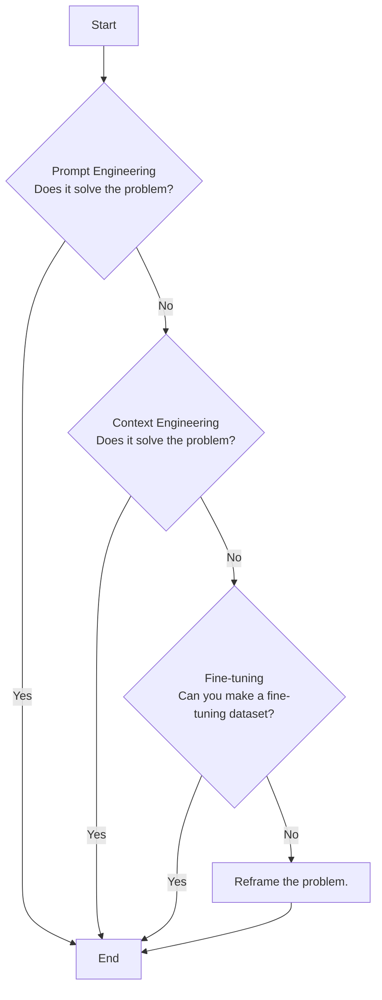
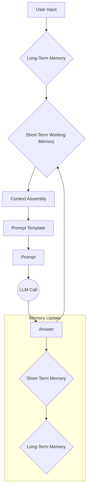
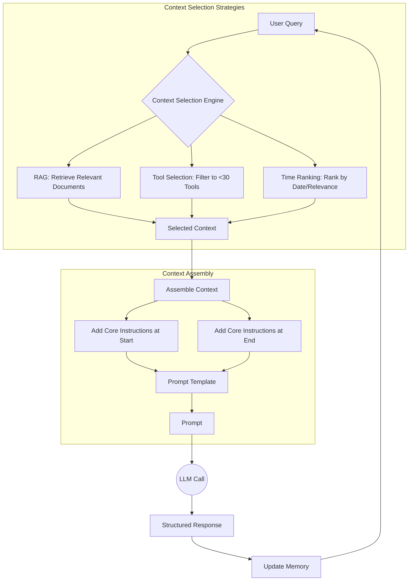
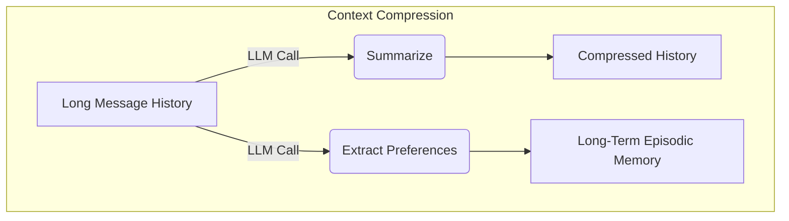
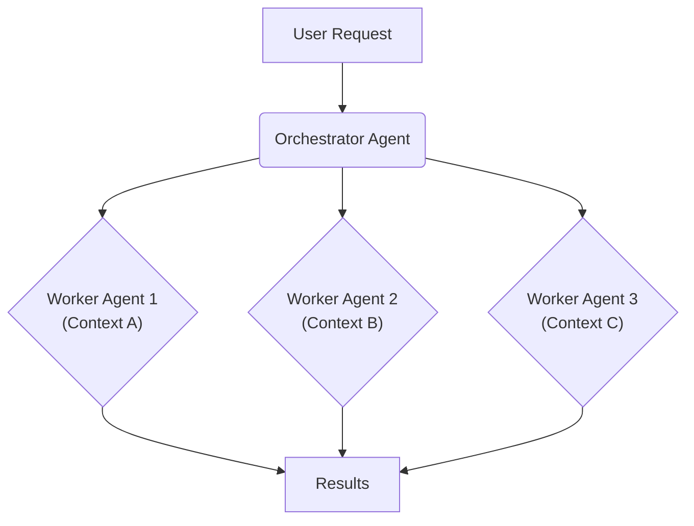

# Lesson 3: Context Engineering

AI applications have evolved rapidly. In 2022, we had simple chatbots for question-answering. By 2023, Retrieval-Augmented Generation (RAG) systems connected LLMs to domain-specific knowledge. 2024 brought us tool-using agents that could perform actions. Now, we are building memory-enabled agents that remember past interactions and build relationships over time.

In our last lesson, we explored how to choose between AI agents and LLM workflows when designing a system. As these applications grow more complex, prompt engineering, a practice that once served us well, is showing its limits. It optimizes single LLM calls but fails when managing systems with memory, actions, and long interaction histories. The sheer volume of information an agent might need—past conversations, user data, documents, and action descriptions—has grown exponentially. Simply stuffing all this into a prompt is not a viable strategy. This is where context engineering comes in. It is the discipline of orchestrating this entire information ecosystem to ensure the LLM gets exactly what it needs, when it needs it. This skill is becoming a core foundation for AI engineering.

## From Prompt to Context Engineering

Prompt engineering, while effective for simple tasks, is designed for single, stateless interactions. It treats each call to an LLM as a new, isolated event. This approach breaks down in stateful applications where context must be preserved and managed across multiple turns.

As a conversation or task progresses, the context grows. Without a strategy to manage this growth, the LLM’s performance degrades. This degradation is sometimes called **context rot**: the model's performance decays as input length increases, even on simple tasks, often falling off a cliff unpredictably [[1]](https://blog.bytebytego.com/p/a-guide-to-context-engineering-for), [[2]](https://www.morphllm.com/context-rot). The model gets confused by the noise of an ever-expanding history, leading to hallucinations and misguided answers [[3]](https://www.decodingai.com/p/context-engineering-2025s-1-skill). It starts to lose track of the original instructions or key information.

Even with large context windows, a physical limit exists for what you can include. Also, on the operational side, every token adds to the cost and latency of an LLM call. This relationship is often worse than linear; for some architectures, a 4x increase in context length can lead to 16x more memory usage, causing latency to rise superlinearly [[4]](https://towardsai.net/p/machine-learning/the-context-window-paradox-engineering-trade-offs-in-modern-llm-architecture). Simply putting everything into the context creates a slow, expensive, and underperforming system. We will explore these concepts in more detail in upcoming lessons, including memory in Lesson 9 and RAG in Lesson 10.

On a recent project, we learned this the hard way. We were working with a model that supported a million-token context window, so we thought, "*What could go wrong?*" We stuffed everything in: our research, guidelines, examples, and user history. The result was an LLM workflow that took 30 minutes to run and produced low-quality outputs [[3]](https://www.decodingai.com/p/context-engineering-2025s-1-skill).

This is where context engineering becomes essential. It shifts the focus from crafting static prompts to building dynamic systems that manage information flow [[5]](https://www.pinecone.io/learn/context-engineering/). As an AI engineer, your job is to select only the most critical pieces of context for each LLM call. This makes your applications accurate, fast, and cost-effective.

## Understanding Context Engineering

Context engineering is about finding the best way to arrange parts of your memory into the context that is passed to the LLM to get the best results. It is an optimization problem where you retrieve the right parts from your short-term and long-term memory to solve a specific task without overwhelming the model [[3]](https://www.decodingai.com/p/context-engineering-2025s-1-skill), [[6]](https://arxiv.org/pdf/2507.13334). For example, when you ask a cooking agent for a recipe, you do not give it the entire cookbook. Instead, you retrieve the specific recipe, along with personal context like allergies or taste preferences. This precise selection ensures the model receives only the essential information.

Andrej Karpathy offered a great analogy for this: LLMs are like a new kind of operating system, where the model acts as the CPU and its context window functions as the RAM [[7]](https://x.com/karpathy/status/1937902205765607626). Just as an operating system manages what fits into RAM, context engineering curates what occupies the model’s working memory.

How does context engineering relate to prompt engineering? Prompt engineering is a subset of context engineering. You still write effective prompts, but you also design a system that feeds the right context into those prompts. In simple terms, prompt engineering is how you ask the question, while context engineering is making sure the model has the right textbook and notes before it starts thinking [[8]](https://weaviate.io/blog/context-engineering). This means understanding not just *how* to phrase a task, but *what* information the model needs to perform optimally [[3]](https://www.decodingai.com/p/context-engineering-2025s-1-skill).

| Dimension | Prompt Engineering | Context Engineering |
| --- | --- | --- |
| Scope | Single interaction optimization | Entire information ecosystem |
| State Management | Stateless function | Stateful due to memory |
| Focus | How to phrase tasks | What information to provide |

Table 1: A comparison of prompt engineering and context engineering.

Context engineering is the new fine-tuning. While fine-tuning has its place, it is expensive, time-consuming, and inflexible. Data changes constantly, making fine-tuning a last resort. For most enterprise use cases, you get better results faster and more cheaply with context engineering. It allows for rapid iteration and adaptation to evolving data without altering the core model, a key advantage in dynamic environments. This approach avoids the computational resources and specialized expertise required for retraining, offering a more agile path to reliable AI applications [[9]](https://www.linkedin.com/posts/denis-panjuta_prompt-engineering-vs-context-engineering-activity-7363945251180322816-1q_m).

When you start a new AI project, your decision-making process for guiding the LLM should look like the one presented in Image 1.


Image 1: A flowchart illustrating the decision-making process for choosing a key strategy to guide an LLM.

For instance, if you build an agent to process internal Slack messages, you do not need to fine-tune a model on your company’s communication style. It is more effective to use a powerful reasoning model and engineer the context to retrieve specific messages and enable actions like creating tasks or drafting emails [[10]](https://www.mezmo.com/learn-observability/context-engineering-for-observability-how-to-deliver-the-right-data-to-llms). Throughout this course, we will show you how to solve most industry problems using only context engineering.

## What Makes Up the Context

To master context engineering, you first need to understand what "context" actually is. It is everything the LLM sees in a single turn, dynamically assembled from various memory components before being passed to the model [[11]](https://www.datacamp.com/blog/context-engineering).

The high-level workflow begins when a user input triggers the system to pull relevant information from both long-term and short-term memory. This information is assembled into the final context, inserted into a prompt template, and sent to the LLM. The LLM’s answer then updates the memory, and the cycle repeats.


Image 2: The high-level workflow of how context is assembled and used in an AI system.

These components are grouped into two main categories. We will explain them intuitively for now, as we have future dedicated lessons for all of them.

### Short-Term Working Memory

Short-term working memory is the state of the agent for the current task or conversation. It is volatile and changes with each interaction, helping the agent maintain a coherent dialogue and make immediate decisions. It can include some or all of these components [[12]](https://www.datacamp.com/blog/how-does-llm-memory-work):

- **User input:** The most recent query or command from the user.
- **Message history:** The log of the current conversation, allowing the LLM to understand the flow and previous turns.
- **Agent's internal thoughts:** The reasoning steps the agent takes to decide on its next action.
- **Action calls and outputs:** The results from any actions the agent has performed, providing information from external systems.

### Long-Term Memory

Long-term memory is more persistent and stores information across sessions, allowing the AI system to remember things beyond a single conversation. We divide it into three types, drawing parallels from human memory. An AI system can include some or all of them:

- **Procedural memory:** This is knowledge encoded directly in the code. It includes the system prompt, which sets the agent's overall behavior. It also includes the definitions of available actions, which tell the agent what it can do, and schemas for structured outputs, which guide the format of its responses. Think of this as the agent's built-in skills [[13]](https://www.analyticsvidhya.com/blog/2026/01/how-does-llm-memory-work/). For example, some code agents use specific files that are always pulled into context, such as a `CLAUDE.md` file, to save instructions or examples [[14]](https://www.langchain.com/blog/context-engineering-for-agents).
- **Episodic memory:** This is memory of specific past experiences, like user preferences or previous interactions. It is used to help the agent personalize its responses based on individual users. We typically store this in vector or graph databases for efficient retrieval [[3]](https://www.decodingai.com/p/context-engineering-2025s-1-skill).
- **Semantic memory:** This is the agent’s general knowledge base. It can be internal, like company documents stored in a data lake, or external, accessed via the internet through API calls. This memory provides the factual information the agent needs to answer questions [[15]](https://skymod.tech/why-memory-matters-in-llm-agents-short-term-vs-long-term-memory-architectures/).

If this seems like a lot, bear with us. We will cover all these concepts in-depth in future lessons, including structured outputs in Lesson 4, actions in Lesson 6, memory in Lesson 9, and RAG in Lesson 10.

https://substackcdn.com/image/fetch/w_1456,c_limit,f_auto,q_auto:good,fl_progressive:steep/https%3A%2F%2Fsubstack-post-media.s3.amazonaws.com%2Fpublic%2Fimages%2F39dce26a-e51e-4167-ac9e-ca28c45b53a6_1115x708.png 
Image 3: A detailed illustration of how all the context engineering components work together inside an AI agent (Source [Decoding AI Magazine [3]](https://www.decodingai.com/p/context-engineering-2025s-1-skill))

The key takeaway is that these components are not static. They are dynamically re-computed for every single interaction. For each conversation turn or new task, the short-term memory grows, or the long-term memory can change. Context engineering involves knowing how to select the right pieces from this vast memory pool to construct the most effective prompt for the task at hand.

## Production Implementation Challenges

Now that we understand what makes up the context, let's look at the core challenges of implementing it in production. These challenges all revolve around a single question: *"How can I keep my context as small as possible while providing enough information to the LLM?"*

Here are four common issues that come up when building AI applications:

1.  **The context window challenge:** Every AI model has a limited context window, the maximum amount of information (tokens) it can process at once [[16]](https://www.comet.com/site/blog/context-window/). Think of it like your computer's RAM. If your machine has only 32GB of RAM, that is all it can use at one time. While context windows are getting larger, they are not infinite, and treating them as such leads to other problems.

2.  **Information overload:** Just because you can fit a lot of information into the context does not mean you should. Too much context reduces the performance of the LLM by confusing it. This is known as the "lost-in-the-middle" or "needle in the haystack" problem, where LLMs are known for remembering information best at the beginning and end of the context window [[17]](https://www.linkedin.com/pulse/lost-middle-lesson-failing-ai-agents-backwards-anthony-dejohn-01k2e). Every token added depletes the model's limited "attention budget" [[18]](https://reinteractive.com/articles/ai-real-world-use-cases/solving-ai-agent-amnesia-context-rot-and-lost-in-the-middle). Counterintuitively, some research shows that logically structured documents can be harder for models to process than randomly ordered text, as the narrative flow creates more plausible-seeming distractors [[2]](https://www.morphllm.com/context-rot). Information in the middle is often overlooked, and performance can drop long before the physical context limit is reached [[19]](https://dev.to/thousand_miles_ai/the-lost-in-the-middle-problem-why-llms-ignore-the-middle-of-your-context-window-3al2).

3.  **Context drift:** This occurs when conflicting versions of truth accumulate in the memory over time [[20]](https://galileo.ai/blog/production-llm-monitoring-strategies). For example, the memory might contain two conflicting statements: "*The user's budget is $500*" and "*The user's budget is $1,000*." This is not a quantum physics experiment; it is a data conflict that confuses the LLM [[3]](https://www.decodingai.com/p/context-engineering-2025s-1-skill). This can also lead to **context poisoning**, where an initial hallucination is fed back into the memory and reused in later turns, compounding the error [[8]](https://weaviate.io/blog/context-engineering). Without a mechanism to resolve these conflicts, the model's responses become unreliable [[21]](https://thenewstack.io/context-rot-enterprise-ai-llms/).

4.  **Tool confusion:** The final challenge is tool confusion, which arises in two main ways. First, adding too many actions to an agent can confuse the LLM about the best one for the job [[3]](https://www.decodingai.com/p/context-engineering-2025s-1-skill). The Gorilla benchmark shows that nearly all models perform worse when given more than one tool [[3]](https://www.decodingai.com/p/context-engineering-2025s-1-skill). Second, confusion can occur when tool descriptions are poorly written or overlap. If the distinctions between actions are unclear, even a human would struggle to choose the right one.

## Key Strategies for Context Optimization

Initially, most AI applications were chatbots over single knowledge bases. Today, modern AI solutions must manage multiple knowledge bases, tools, and complex conversational histories. Context engineering is about managing this complexity while meeting performance, latency, and cost requirements.

Here are four popular context engineering strategies used across the industry:

### Selecting the Right Context

Retrieving the right information from memory is a critical first step. A common mistake is to provide everything at once, assuming that models with large context windows can handle it. As we've discussed, the "lost-in-the-middle" problem often leads to poor performance, increased latency, and higher costs [[22]](https://atlan.com/know/llm-context-window-limitations/).

To solve this, consider these approaches:

-   **Use structured outputs:** Define clear schemas for what the LLM should return. This allows you to pass only the necessary, structured information to downstream steps. We will cover this in detail in Lesson 4.
-   **Use RAG:** Instead of providing entire documents, use RAG to fetch only the specific chunks of text needed to answer a user's question. Advanced techniques like GraphRAG can even leverage knowledge graphs to retrieve interconnected information, providing richer context than simple document chunks [[23]](https://www.moodys.com/web/en/us/creditview/blog/beyond-prompts-why-enterprise-ai-demands-context-engineering.html). This is a core topic we will explore in Lesson 10 [[6]](https://arxiv.org/pdf/2507.13334).
-   **Reduce the number of available actions:** Rather than giving an agent access to every available action, use various strategies to delegate action subsets to specialized components. For example, a typical pattern is to leverage the orchestrator-worker pattern to delegate subtasks to specialized agents. Studies show that keeping tool selections under 30 can improve selection accuracy threefold [[11]](https://www.datacamp.com/blog/context-engineering).
-   **Rank time-sensitive data:** For time-sensitive information, rank it by date and filter out anything no longer relevant [[24]](https://www.dailydoseofds.com/llmops-crash-course-part-8/).
-   **Repeat core instructions:** For the most important instructions, repeat them at both the start and the end of the prompt. This uses the model's tendency to pay more attention to the context edges, ensuring core instructions are not lost [[25]](https://promptmetheus.com/resources/llm-knowledge-base/lost-in-the-middle-effect).


Image 4: A workflow showing how the four context selection strategies work together to optimize information retrieval and assembly.

### Context Compression

As message history grows in short-term working memory, you must manage past interactions to keep your context window in check. You cannot simply drop past conversation turns, as the LLM still needs to remember what happened. Instead, you need ways to compress key facts from the past. This introduces a trade-off: aggressive compression can reduce latency by 20-30% but may also erode the model's ability to recall fine-grained details [[26]](https://www.emergentmind.com/topics/context-compression-framework).

You can do this through:

1.  **Creating summaries of past interactions:** Use an LLM to replace a long, detailed history with a concise overview [[27]](https://oneuptime.com/blog/post/2026-01-30-context-compression/view).
2.  **Moving user preferences to long-term memory:** Transfer user preferences from working memory to long-term episodic memory. This keeps the working context clean while ensuring preferences are remembered for future sessions [[3]](https://www.decodingai.com/p/context-engineering-2025s-1-skill).
3.  **Deduplication:** Remove redundant information from the context to avoid repetition, using techniques like MinHash [[3]](https://www.decodingai.com/p/context-engineering-2025s-1-skill).
4. **Use semantic caching:** Store the results of previous expensive computations or user queries. Before executing a new retrieval step, check the cache for a similar past query to reduce redundant processing and costs [[28]](https://redis.io/blog/context-engineering-best-practices-for-an-emerging-discipline/).


Image 5: Compressing context by summarizing history and extracting preferences to long-term memory.

### Isolating Context

Another powerful strategy is to isolate context by splitting information across multiple agents or LLM workflows. This technique is similar to tool isolation (explained in `Selecting the right context`), but it is more general, referring to the whole context. The key idea is that instead of one agent with a massive, cluttered context window, you can have a team of agents, each with a smaller, focused context [[29]](https://beam.ai/agentic-insights/multi-agent-orchestration-patterns-production).


Image 6: The orchestrator-worker pattern isolates context across multiple specialized agents.

We often implement this using an orchestrator-worker pattern, where a central orchestrator agent breaks down a problem and assigns sub-tasks to specialized worker agents [[30]](https://gurusup.com/blog/multi-agent-orchestration-guide). Each worker operates in its own isolated context, improving focus and allowing for parallel processing. We will cover this pattern in more detail in Lesson 5.

### Format Optimizations

Finally, the way you format the context matters. Models are sensitive to structure, and using clear delimiters can improve performance. Common strategies are to:

-   **Use XML tags:** Wrap different pieces of context in XML-like tags (e.g., `<user_query>`, `<documents>`). This helps the model distinguish between different types of information, while making it easier for the engineer to reference context elements within the system prompt [[31]](https://www.anthropic.com/engineering/effective-context-engineering-for-ai-agents).
-   **Prefer YAML over JSON:** When providing structured data as input, YAML is often more token-efficient than JSON, which helps save space in your context window [[3]](https://www.decodingai.com/p/context-engineering-2025s-1-skill).

You always have to understand what is passed to the LLM. Seeing exactly what occupies your context window at every step is key to mastering context engineering. Usually, this is done by properly monitoring your traces, tracking what happens at each step, and understanding what the inputs and outputs are [[32]](https://www.getmaxim.ai/articles/context-window-management-strategies-for-long-context-ai-agents-and-chatbots/). As this is a significant step to go from PoC to production, we will have dedicated lessons on this.

## Here Is an Example

Let's connect the theory and strategies discussed earlier with concrete examples. Consider several common real-world scenarios:

-   **Healthcare:** An AI assistant accesses a patient's medical history, current symptoms, and the latest medical literature to provide personalized diagnostic support [[3]](https://www.decodingai.com/p/context-engineering-2025s-1-skill).
-   **Financial Services:** AI systems integrate with enterprise tools like Customer Relationship Management (CRM) systems, emails, and calendars, combining real-time market data and client portfolio information to generate tailored financial advice.
-   **Project Management:** AI systems access enterprise infrastructure like CRMs, Slack, and task managers to automatically understand project requirements, then add and update project tasks.
-   **Content Creator Assistant:** An AI agent uses your research, past content, and personality traits to understand what and how to create a given piece of content.
-   **Embodied AI:** Robots in complex environments use context engineering to interpret sensor data, understand situational context, and make informed, real-time decisions [[33]](https://robotics.umd.edu/news/story/new-research-helps-robots-grasp-situational-context).

For a concrete enterprise example, one global insurer integrated its operational data—across 800+ applications and 40,000 batch jobs—into a unified knowledge graph. By engineering context from this graph, their AI system improved IT operations by 50% and achieved 67% accuracy in predicting system incidents hours in advance [[34]](https://www.mphasis.com/home/thought-leadership/blog/context-engineering-and-knowledge-graphs-building-enterprise-ai-that-can-reason-learn-and-scale.html).

Let's walk through a specific query to see context engineering in action with the healthcare assistant scenario. A user asks: `I have a headache. What can I do to stop it? I would prefer not to take any medicine.`

Before the AI attempts to answer, a context engineering system performs several steps:

1.  It retrieves the user's patient history, known allergies, and lifestyle habits from episodic memory.
2.  It queries a medical database for non-pharmacological headache remedies from semantic memory.
3.  It assembles the key units of information from both memory types into the final context.
4.  It formats this information into a structured prompt and calls the LLM.
5.  Finally, it presents a personalized, context-aware answer to the user.

Here is a simplified Python example showing how you might structure the context and prompt for the LLM, using XML tags to format the different context elements.

```python
SYSTEM_PROMPT = """
You are a helpful and cautious AI healthcare assistant. Your goal is to provide safe, non-medicinal advice. Do not provide medical diagnoses.

<INSTRUCTIONS>
1. Analyze the user's query and the provided context.
2. Use the patient history to understand their health profile and preferences.
3. Use the retrieved medical knowledge to form your recommendation.
4. If you lack sufficient information, ask clarifying questions.
5. Always prioritize safety and advise consulting a doctor for serious issues.
</INSTRUCTIONS>

<PATIENT_HISTORY>
{retrieved_patient_history}
</PATIENT_HISTORY>

<MEDICAL_KNOWLEDGE>
{retrieved_medical_articles}
</MEDICAL_KNOWLEDGE>

<CONVERSATION_HISTORY>
{formatted_chat_history}
</CONVERSATION_HISTORY>

<USER_QUERY>
{user_query}
</USER_QUERY>

Based on all the information above, provide a helpful response.
"""
```

To build such a system, you need a robust tech stack. Here is a potential stack we recommend and will use throughout this course:

-   **LLM:** Gemini as a multimodal, reasoning, and cost-effective LLM API provider.
-   **Orchestration:** LangGraph for defining stateful, agentic workflows.
-   **Databases:** PostgreSQL, MongoDB, Redis, Qdrant, and Neo4j. Often, it is effective to keep it simple, as you can achieve much with only PostgreSQL or MongoDB.
-   **Observability:** Opik or LangSmith for evaluation and trace monitoring.

## Connecting Context Engineering to AI Engineering

Context engineering is more of an art than a science. It is about developing the intuition to craft effective prompts, select the right information from memory, and arrange context for optimal results. This discipline helps you determine the minimal yet essential information an LLM needs to perform at its best.

It is important to understand that context engineering, or AI engineering for that matter, cannot be learned in isolation. It is a complex field that combines [[10]](https://www.mezmo.com/learn-observability/context-engineering-for-observability-how-to-deliver-the-right-data-to-llms):

1.  **AI Engineering:** Implement practical solutions such as LLM workflows, RAG, AI Agents, and evaluation pipelines.
2.  **Software Engineering (SWE):** Build your AI product with code that is not just functional, but also scalable and maintainable, and design architectures that can grow with your product's needs.
3.  **Data Engineering:** Design data pipelines that feed curated and validated data into the memory layer.
4.  **Operations (Ops):** Deploy agents on the proper infrastructure to ensure they are reproducible, maintainable, observable, and scalable, including automating processes with CI/CD pipelines.

Our goal with this course is to teach you how to combine these skills to build production-ready AI products. We like to say that in the world of AI, we should all think in systems rather than isolated components, having a mindset shift from developers to architects. In an AI-powered enterprise, a leader's key function becomes architecting the organization's shared context—its mission, data, and processes—so both humans and AI agents can act with a shared worldview [[35]](https://www.ardoq.com/blog/context-engineering-ai).

Looking ahead, a key research challenge is the "comprehension-generation asymmetry." While context engineering helps LLMs understand complex inputs, they still struggle to generate outputs of equal sophistication [[36]](https://alphaxiv.org/overview/2507.13334v2). Bridging this gap is a major focus for developing the next generation of AI systems.

In the next lesson, we will explore structured outputs. We will also revisit context engineering principles when we discuss actions in Lesson 6, memory in Lesson 9, and RAG in Lesson 10.

## References

- [1] A Guide to Context Engineering for LLMs. (n.d.). ByteByteGo. https://blog.bytebytego.com/p/a-guide-to-context-engineering-for
- [2] Context Rot. (n.d.). MorphL. https://www.morphllm.com/context-rot
- [3] Iusztin, P. (2025, July 22). Context Engineering: 2025’s #1 Skill in AI. Decoding AI Magazine. https://www.decodingai.com/p/context-engineering-2025s-1-skill
- [4] The Context Window Paradox: Engineering Trade-Offs in Modern LLM Architecture. (n.d.). Towards AI. https://towardsai.net/p/machine-learning/the-context-window-paradox-engineering-trade-offs-in-modern-llm-architecture
- [5] What is Context Engineering? (n.d.). Pinecone. https://www.pinecone.io/learn/context-engineering/
- [6] Mei, L., Yao, J., Ge, Y., Wang, Y., Bi, B., Cai, Y., Liu, J., Li, M., Li, Z., Zhang, D., Zhou, C., Mao, J., Xia, T., Guo, J., & Liu, S. (2025, July 17). A survey of context engineering for large language models. arXiv.org. https://arxiv.org/pdf/2507.13334
- [7] karpathy, (n.d.). X. https://x.com/karpathy/status/1937902205765607626
- [8] Context Engineering: LLM Memory and Retrieval for AI Agents. (n.d.). Weaviate. https://weaviate.io/blog/context-engineering
- [9] Panjuta, D. (n.d.). Prompt Engineering vs. Context Engineering. LinkedIn. https://www.linkedin.com/posts/denis-panjuta_prompt-engineering-vs-context-engineering-activity-7363945251180322816-1q_m
- [10] Context Engineering for Observability: How to Deliver the Right Data to LLMs. (n.d.). Mezmo. https://www.mezmo.com/learn-observability/context-engineering-for-observability-how-to-deliver-the-right-data-to-llms
- [11] Context Engineering: A Guide With Examples. (n.d.). DataCamp. https://www.datacamp.com/blog/context-engineering
- [12] How Does LLM Memory Work? (n.d.). DataCamp. https://www.datacamp.com/blog/how-does-llm-memory-work
- [13] How Does LLM Memory Work? (2026, January 1). Analytics Vidhya. https://www.analyticsvidhya.com/blog/2026/01/how-does-llm-memory-work/
- [14] Context Engineering for Agents. (n.d.). LangChain Blog. https://www.langchain.com/blog/context-engineering-for-agents
- [15] Why Memory Matters in LLM Agents: Short-Term vs. Long-Term Memory Architectures. (n.d.). Skymod. https://skymod.tech/why-memory-matters-in-llm-agents-short-term-vs-long-term-memory-architectures/
- [16] Context Window: What It Is and Why It Matters for AI Agents. (2025, December 23). Comet. https://www.comet.com/site/blog/context-window/
- [17] DeJohn, A. (n.d.). "Lost in the Middle": A Lesson in Failing AI Agents (and How to Go Backwards to Go Forwards). LinkedIn. https://www.linkedin.com/pulse/lost-middle-lesson-failing-ai-agents-backwards-anthony-dejohn-01k2e
- [18] Solving AI Agent Amnesia: Context Rot and Lost in the Middle. (n.d.). Reinteractive. https://reinteractive.com/articles/ai-real-world-use-cases/solving-ai-agent-amnesia-context-rot-and-lost-in-the-middle
- [19] The "Lost in the Middle" Problem: Why LLMs Ignore the Middle of Your Context Window. (n.d.). dev.to. https://dev.to/thousand_miles_ai/the-lost-in-the-middle-problem-why-llms-ignore-the-middle-of-your-context-window-3al2
- [20] Production LLM Monitoring Strategies to Catch Failures Before They Happen. (n.d.). Galileo. https://galileo.ai/blog/production-llm-monitoring-strategies
- [21] The New Stack. (2025, February 26). Context Rot: Why Enterprise AI LLMs Need a Solid Foundation. https://thenewstack.io/context-rot-enterprise-ai-llms/
- [22] LLM Context Window Limitations: Impacts, Risks, & Fixes in 2026. (n.d.). Atlan. https://atlan.com/know/llm-context-window-limitations/
- [23] Beyond Prompts: Why Enterprise AI Demands Context Engineering. (n.d.). Moody's. https://www.moodys.com/web/en/us/creditview/blog/beyond-prompts-why-enterprise-ai-demands-context-engineering.html
- [24] LLMOps Crash Course Part 8: Memory and Temporal Context. (n.d.). Daily Dose of DS. https://www.dailydoseofds.com/llmops-crash-course-part-8/
- [25] Lost-in-the-Middle Effect. (n.d.). Promptmetheus. https://promptmetheus.com/resources/llm-knowledge-base/lost-in-the-middle-effect
- [26] Context Compression Framework. (n.d.). Emergent Mind. https://www.emergentmind.com/topics/context-compression-framework
- [27] How to Build Context Compression. (n.d.). OneUptime. https://oneuptime.com/blog/post/2026-01-30-context-compression/view
- [28] Context engineering best practices for an emerging discipline. (n.d.). Redis. https://redis.io/blog/context-engineering-best-practices-for-an-emerging-discipline/
- [29] Multi-Agent Orchestration Patterns for Production. (n.d.). Beam.ai. https://beam.ai/agentic-insights/multi-agent-orchestration-patterns-production
- [30] The Definitive Guide to Multi-Agent Orchestration. (n.d.). GuruSup. https://gurusup.com/blog/multi-agent-orchestration-guide
- [31] Effective context engineering for AI agents. (n.d.). Anthropic. https://www.anthropic.com/engineering/effective-context-engineering-for-ai-agents
- [32] Context Window Management Strategies For Long-Context AI Agents And Chatbots. (n.d.). Maxim.ai. https://www.getmaxim.ai/articles/context-window-management-strategies-for-long-context-ai-agents-and-chatbots/
- [33] New research helps robots grasp situational context. (n.d.). UMD. https://robotics.umd.edu/news/story/new-research-helps-robots-grasp-situational-context
- [34] Context Engineering and Knowledge Graphs: Building Enterprise AI That Can Reason, Learn and Scale. (n.d.). Mphasis. https://www.mphasis.com/home/thought-leadership/blog/context-engineering-and-knowledge-graphs-building-enterprise-ai-that-can-reason-learn-and-scale.html
- [35] Context Engineering: The Strategic Advantage in an AI-Driven World. (n.d.). Ardoq. https://www.ardoq.com/blog/context-engineering-ai
- [36] A Survey of Context Engineering for Large Language Models. (n.d.). AlphaXiv. https://alphaxiv.org/overview/2507.13334v2