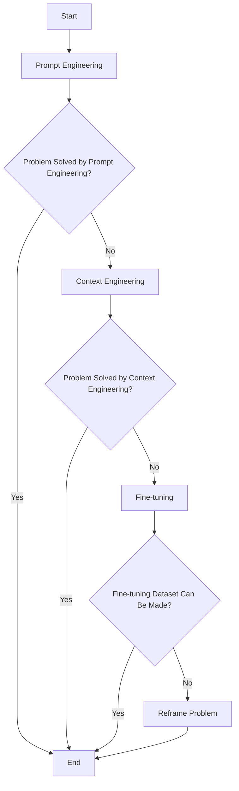
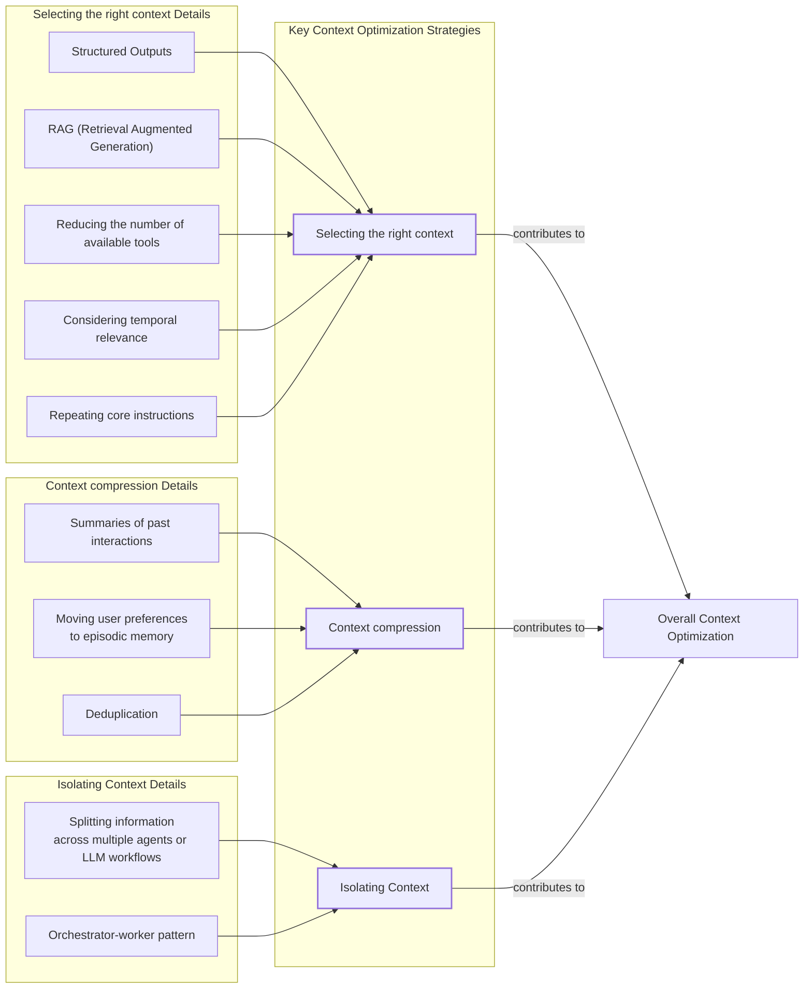
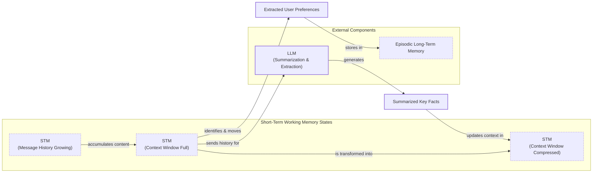
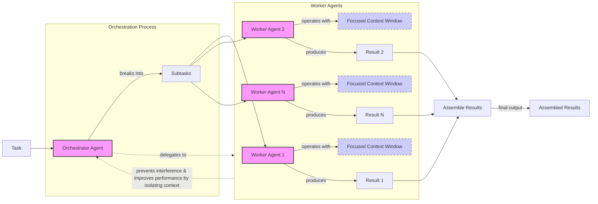

# Title

## Introduction: When prompt engineering breaks

AI applications have evolved rapidly. In 2022, we had simple chatbots for question-and-answering [[26]](https://www.securityindustry.org/2024/07/16/understanding-the-evolution-from-classic-chatbots-to-rag-chatbots-to-ai-powered-assistants/). By 2023, RAG systems connected LLMs to domain-specific knowledge [[26]](https://www.securityindustry.org/2024/07/16/understanding-the-evolution-from-classic-chatbots-to-rag-chatbots-to-ai-powered-assistants/). 2024 brought us tool-using agents that could perform actions [[27]](https://pagergpt.ai/ai-chatbot/evolution-of-ai-chatbots). Now, we are building memory-enabled agents that remember past interactions and build relationships over time [[30]](https://www.linkedin.com/posts/ai-apps-central_most-people-put-all-ai-systems-in-the-same-activity-7438555783077793792-UEUm).

In our last lesson, we explored how to choose between AI agents and LLM workflows when designing a system. As these applications grow more complex, prompt engineering, a practice that once served us well, is showing its limits. It optimizes single LLM calls but fails when managing systems with memory, actions, and long interaction histories [[55]](https://neo4j.com/blog/agentic-ai/context-engineering-vs-prompt-engineering/). The sheer volume of information an agent might need—past conversations, user data, documents, and action descriptions—has grown exponentially. Simply stuffing all this into a prompt is not a viable strategy.

This is where context engineering comes in. It is the discipline of orchestrating this entire information ecosystem to ensure the LLM gets exactly what it needs, when it needs it. This skill is becoming a core foundation for AI engineering, addressing the limitations of prompt engineering by providing a systematic approach to managing the information flow for complex AI systems.

## From prompt to context engineering

Prompt engineering, while effective for simple tasks, is designed for single, stateless interactions [[52]](https://memgraph.com/blog/prompt-engineering-vs-context-engineering). It treats each call to an LLM as a new, isolated event. This approach breaks down in stateful applications where context must be preserved and managed across multiple turns.

As a conversation or task progresses, the context grows. Without a strategy to manage this growth, the LLM’s performance degrades. This is context decay: the model gets confused by the noise of an ever-expanding history [[59]](https://atlan.com/know/llm-context-window-limitations/). It starts to lose track of the original instructions or key information.

Even with large context windows, a physical limit exists for what you can include [[16]](https://www.comet.com/site/blog/context-window/). Also, on the operational side, every token adds to the cost and latency of an LLM call [[16]](https://www.comet.com/site/blog/context-window/). Simply putting everything into the context creates a slow, expensive, and underperforming system. We will explore these concepts in more detail in upcoming lessons, including memory in Lesson 9 and RAG in Lesson 10.

On a recent project, we learned this the hard way. We were working with a model that supported a million-token context window, so we thought, "What could go wrong?" We stuffed everything in: our research, guidelines, examples, and reviews. The result was an LLM workflow that took 30 minutes to run and produced low-quality outputs.

Context engineering provides a solution to these limitations. It addresses these issues by treating AI applications not as a series of isolated prompts, but as systems that operate through dynamic context gathered from past conversations, databases, tools, and other types of memory. Thus, as AI Engineers, our job is to keep only what's essential in the context when we pass it to the LLM, making it accurate, fast, and cost-effective.

## Understanding context engineering

Context engineering is about finding the best way to arrange parts of your memory into the context that's passed to the LLM to squeeze out the best results [[22]](https://arxiv.org/pdf/2507.13334). It's a solution to an optimization problem in which you have to retrieve the right parts of both your short and long-term memory to solve a specific task without overwhelming the LLM. For example, when asking a cooking agent about a recipe, instead of passing the whole cookbook to the agent, we retrieve just the information about that recipe, together with personal preferences, such as allergies or taste preferences.

Andrej Karpathy explains that LLMs are like a new kind of operating system where the model is the CPU and its context window is the RAM [[31]](https://www.langchain.com/blog/context-engineering-for-agents/). Just as an operating system curates what fits into RAM, context engineering manages what information occupies the model's limited context window [[23]](https://x.com/karpathy/status/1937902205765607626).

Context engineering is not replacing prompt engineering. Instead, prompt engineering is a subset of context engineering [[21]](https://www.datacamp.com/blog/context-engineering). You still work with prompts. Thus, learning how to write them effectively is still a critical skill. But on top of that, it's important to know how to incorporate the right context into the prompt without compromising the LLM's performance.

| Dimension | Prompt Engineering | Context Engineering |
| --- | --- | --- |
| Scope | Single interaction optimization | Entire information ecosystem |
| State Management | Stateless function | Stateful due to memory |
| Focus | How to phrase tasks | What information to provide |

Table 1: A comparison of prompt engineering and context engineering.

Context engineering is the new fine-tuning. In most use cases, you can go far just by using context engineering techniques. As modern LLMs generalize really well, and because fine-tuning is time-consuming and costly, fine-tuning should always be the last resort if nothing else works [[51]](https://www.linkedin.com/posts/denis-panjuta_prompt-engineering-vs-context-engineering-activity-7363945251180322816-1q_m). When starting a new AI project and deciding what key strategy to use to guide the LLM, your decision-making should look like this, from easy to hard: prompt engineering, then context engineering, and only then fine-tuning.


Image 1: Flowchart illustrating the decision-making process for choosing a key strategy to guide an LLM.

For example, when processing Slack messages from your company, it's sufficient to use a reasoning LLM as the core of the agent and various mechanisms to retrieve specific Slack messages and take actions based on them, such as creating action points or writing emails [[53]](https://www.mezmo.com/learn-observability/context-engineering-for-observability-how-to-deliver-the-right-data-to-llms). Fine-tuning the LLM on writing emails most of the time would be a waste of resources. Within this course, we will show you how to solve most industry use cases using the power of context engineering.

## What makes up the context

To better understand what context engineering is, let's look at the core elements that build up the context. To anchor the reader in previous techniques such as prompt engineering, it is useful to explain how the context is connected to the prompt template and prompt by walking them through the high-level workflow. A user input triggers the system to pull relevant information from memory, which is then assembled into the final context, inserted into a prompt template, and sent to the LLM. The LLM’s answer then updates the memory, and the cycle repeats.

```mermaid
flowchart LR
  %% Input
  subgraph Input
    UI["User Input"]
  end

  %% Memory Management
  subgraph Memory Management
    LTM["Long-term Memory"]
    STWM["Short-Term Working Memory"]
  end

  %% Prompt Construction & LLM Interaction
  subgraph Prompt & LLM
    C["Context"]
    PT["Prompt Template"]
    P["Prompt"]
    LLMC["LLM Call"]
    A["Answer"]
  end

  %% Flow
  UI -- "provides query" --> LTM
  LTM -- "retrieves relevant info" --> STWM
  STWM -- "assembles" --> C
  C -- "populates" --> PT
  PT -- "generates" --> P
  P -- "sends to" --> LLMC
  LLMC -- "produces" --> A

  %% Feedback Loop
  A -- "informs" --> STWM
  STWM -- "persists updates" --> LTM

  %% Visual grouping
  classDef memory_store stroke-dasharray:3,3
  classDef processing_step stroke-width:2px

  class LTM,STWM memory_store
  class C,PT,P,LLMC processing_step
```


Image 2: A flowchart illustrating the high-level workflow of how context is connected to the prompt template and prompt, including memory management and LLM interaction.

As these concepts haven't been introduced in the course yet, we will present them at an intuitive level. With that in mind, let's present all the core components that can come up when building a single-turn prompt that's passed to the LLM. They can be grouped into two main categories.

**Short-term working memory** is often referred to as the state of the agent or workflow. It is the active, volatile memory for the current task. It can contain the user's most recent input, the ongoing message history to maintain conversational flow, the agent's internal thoughts or reasoning steps, and the outputs from any action calls made to external systems [[37]](https://www.datacamp.com/blog/how-does-llm-memory-work).

**Long-term memory** is more persistent and stores information across sessions. It is usually divided into three types, drawing parallels from human cognition [[39]](https://skymod.tech/why-memory-matters-in-llm-agents-short-term-vs-long-term-memory-architectures/). **Procedural long-term memory** is the "how-to" knowledge encoded directly in the code, such as the system prompt defining the agent's behavior, the definitions of available actions, and schemas for structured outputs [[38]](https://www.analyticsvidhya.com/blog/2026/01/how-does-llm-memory-work/). **Episodic long-term memory** stores specific past events and user-related facts, like preferences or previous requests, allowing for personalization. This is usually persisted in vector or graph databases for efficient retrieval [[40]](https://labelstud.io/learningcenter/episodic-vs-persistent-memory-in-llms/). **Semantic long-term memory** is the agent's factual knowledge base, which can be internal company documents or external information accessed via the internet through API calls or web scraping [[36]](https://atlan.com/know/working-memory-llms/).

If this seems like a lot, bear with us. We will learn all these concepts in depth in future lessons, such as structured outputs in Lesson 4, actions in Lesson 6, memory in Lesson 9, RAG in Lesson 10, and working with multimodal data in Lesson 11.

https://substackcdn.com/image/fetch/w_1456,c_limit,f_auto,q_auto:good,fl_progressive:steep/https%3A%2F%2Fsubstack-post-media.s3.amazonaws.com%2Fpublic%2Fimages%2F39dce26a-e51e-4167-ac9e-ca28c45b53a6_1115x708.png
Image 3: The different components that make up the context passed to an AI agent. (Source [Decoding AI Magazine ([41])](https://www.decodingai.com/p/context-engineering-2025s-1-skill))

Even if we talk about what's passed to the LLM in a single turn, most of the elements, such as the conversation history, are preserved across turns within the memory. These are not static components but are dynamically re-computed on each call or turn. For each conversation turn or new task, the short-term memory grows or the long-term memory can change. A big part of context engineering is knowing how to pick the right components from the memory when building the prompt that's passed to the LLM.

## Production implementation challenges

Now let's look at the core challenges when implementing context engineering in AI agents and LLM workflow solutions. All the challenges revolve around a single question: "How can I keep my context as small as possible, while providing enough information to the LLM?"

Here are four of the most common issues that come up when building AI applications:

**The context window challenge** is a primary concern. Every AI model has a limited context window, which is the maximum amount of information (tokens) it can process simultaneously [[10]](https://atlan.com/know/llm-context-window-limitations/). This is similar to your computer's RAM. If you have only 32GB of RAM on your machine, that's all you can process at a point in time. The self-attention mechanism in transformers imposes a quadratic computational overhead, making long contexts expensive and slow [[22]](https://arxiv.org/pdf/2507.13334).

**Information overload** also reduces the performance of the LLM by confusing it. This is known as the "lost-in-the-middle" or "needle in the haystack" problem, where LLMs are well-known for mostly remembering what is at the beginning and end of the context window [[56]](https://www.linkedin.com/pulse/lost-middle-lesson-failing-ai-agents-backwards-anthony-dejohn-01k2e). Processing what's in the middle is often a lottery, with performance dropping long before the context limit is reached. Studies show accuracy can degrade by over 30% for information in the middle of the context [[59]](https://atlan.com/know/llm-context-window-limitations/).

**Context drift** occurs when conflicting views of truth accumulate over time [[6]](https://galileo.ai/blog/production-llm-monitoring-strategies). For example, your memory might contain conflicting statements like "The user's budget is $500" and later "The user's budget is $1,000." This is not quantum physics or the Schrödinger's Cat experiment; it's a data conflict that confuses the LLM and prevents it from knowing what to pick, eroding user trust as responses become unreliable [[7]](https://www.coforge.com/what-we-know/blog/navigating-the-shifting-sands-understanding-and-mitigating-data-drift-in-llms).

**Tool confusion** can arise in two core scenarios. First, if we add too many tools to an AI agent or workflow, it will start confusing the LLM about what is the best action for the job. This usually starts with 100+ actions. Secondly, it can appear when the tools' descriptions are poorly written or there are unclear separations between them [[54]](https://www.instinctools.com/blog/context-engineering/). The Gorilla benchmark shows that nearly all models perform worse when given more than one tool. If the descriptions are not clearly separated or have overlaps, it's a recipe for disaster. In that case, even a human wouldn't know what to pick.

## Key strategies for context optimization

At the beginning, most AI apps were chatbots over single knowledge bases. But for most AI applications today, this is no longer the case. Modern AI solutions require access to multiple knowledge bases and tools. Context engineering is all about managing this complexity while staying within the desired performance, latency, and cost requirements.

Here are four of the most popular context engineering strategies used across the industry.

### Selecting the right context

The art of retrieving the right information from memory is your first line of defense. A common mistake is providing everything at once, assuming that models with large context windows can handle it. This often results in poor performance, increased latency, and higher costs due to the "lost-in-the-middle" problem [[59]](https://atlan.com/know/llm-context-window-limitations/). To solve this, you can use structured outputs to pass only necessary information downstream, use RAG to fetch specific facts, reduce the number of available actions to avoid confusion, consider temporal relevance by ranking time-sensitive data, and repeat core instructions at the start and end of the prompt to ensure they are not overlooked [[58]](https://dev.to/thousand_miles_ai/the-lost-in-the-middle-problem-why-llms-ignore-the-middle-of-your-context-window-3al2). We will explore structured outputs and RAG in detail in Lessons 4 and 10, respectively.


Image 4: An architecture diagram showing how key context optimization strategies and their sub-components contribute to overall context optimization in an AI system.

### Context compression

As the message history grows in the short-term working memory, you have to carefully manage past interactions to keep your context window in check. You cannot just drop past conversation turns, as the LLM still needs to remember what happened. Thus, we need ways to compress key facts from the past, while shrinking the short-term memory. We can do that through creating summaries of past interactions using an LLM, moving user preferences to long-term episodic memory, or using deduplication to avoid repetition [[11]](https://oneuptime.com/blog/post/2026-01-30-context-compression/view). These techniques can reduce token usage by 50-80% while preserving essential information.


Image 5: A flowchart illustrating the process of context compression within short-term working memory.

### Isolating Context

Another powerful strategy is to isolate context by splitting information across multiple agents or LLM workflows. This technique is similar to tool isolation but is more general, referring to the whole context. The key idea is that instead of one agent with a massive, cluttered context window, you can have a team of agents, each with a smaller, focused context [[48]](https://www.vellum.ai/blog/multi-agent-systems-building-with-context-engineering). We often implement this using an orchestrator-worker pattern, where a central orchestrator agent breaks down a problem and assigns sub-tasks to specialized worker agents [[46]](https://beam.ai/agentic-insights/multi-agent-orchestration-patterns-production). Each worker operates in its own isolated context, improving focus and allowing for parallel processing. We will cover this pattern in more detail in Lesson 5.


Image 6: An architecture diagram illustrating the orchestrator-worker pattern for context isolation.

### Format optimization for model clarity

Finally, the way you format the context matters. Models are sensitive to structure, and using clear delimiters can improve performance. Common strategies are to use XML tags to clearly structure different parts of the prompt [[44]](https://www.anthropic.com/engineering/effective-context-engineering-for-ai-agents). Also, using YAML instead of JSON when inputting structured data to the LLM is recommended, as YAML is more token-efficient than JSON.

You always have to understand what is passed to the LLM. Seeing exactly what occupies your context window at every step is key to mastering context engineering. Usually this is done by properly monitoring your traces, tracking what happens at each step, and understanding what the inputs and outputs are [[18]](https://www.getmaxim.ai/articles/context-window-management-strategies-for-long-context-ai-agents-and-chatbots/). As this is a significant step to go from PoC to production, we will have dedicated lessons on this.

## Here is an example

Let's connect the theory, challenges, and optimization strategies through some concrete examples. Some real-world use cases that often require keeping the context in memory between multiple conversation turns or user sessions include healthcare, financial services, project task managers, and content creator assistants [[41]](https://www.decodingai.com/p/context-engineering-2025s-1-skill). For instance, a financial agent might integrate with a CRM, calendars, and financial data to make decisions based on user preferences, while a project management AI can access tools like Slack and task managers to automatically update project tasks.

Let's walk through a specific query to see context engineering in action with the healthcare assistant scenario. A user asks: `I have a headache. What can I do to stop it? I would prefer not to take any medicine.`

Before the AI sees the customer's question, the system retrieves the customer's patient history from episodic memory, reviews medical literature from semantic memory, extracts key information using various tools, formats this information into a prompt, and calls the LLM to present a personalized answer to the user [[41]](https://www.decodingai.com/p/context-engineering-2025s-1-skill). This process ensures the response is not only accurate but also tailored to the individual's health profile and preferences.

Here is a simplified Python example showing how you might structure the context and prompt for the LLM, using XML tags to format the different context elements. Notice the order of each element and how we used YAML to format input data collections for token efficiency.

```python
SYSTEM_PROMPT = """
You are a helpful and cautious AI healthcare assistant. Your goal is to provide safe, non-medicinal advice. Do not provide medical diagnoses.

<INSTRUCTIONS>
1. Analyze the user's query and the provided context.
2. Use the patient history to understand their health profile and preferences.
3. Use the retrieved medical knowledge to form your recommendation.
4. If you lack sufficient information, ask clarifying questions.
5. Always prioritize safety and advise consulting a doctor for serious issues.
</INSTRUCTIONS>

<PATIENT_HISTORY>
{retrieved_patient_history}
</PATIENT_HISTORY>

<MEDICAL_KNOWLEDGE>
{retrieved_medical_articles}
</MEDICAL_KNOWLEDGE>

<CONVERSATION_HISTORY>
{formatted_chat_history}
</CONVERSATION_HISTORY>

<USER_QUERY>
{user_query}
</USER_QUERY>

Based on all the information above, provide a helpful response.
"""
```

To build such a system, you need a robust tech stack. Here is a potential stack we recommend, which will be used throughout this course: Gemini as a multimodal, reasoning, and cost-effective LLM API provider; LangGraph as the orchestrator and memory virtual layer; databases such as PostgreSQL or MongoDB (keeping it simple is often effective); and Opik or LangSmith for observability, evaluation, and monitoring [[62]](https://blog.stackademic.com/context-engineering-in-llms-and-ai-agents-eb861f0d3e9b), [[65]](https://www.scalablepath.com/machine-learning/langgraph), [[64]](https://atlan.com/know/context-engineering-platforms-comparison/). This combination of tools allows for the creation of sophisticated, stateful AI applications that can manage context effectively and operate reliably in production environments.

## Connecting context engineering to AI engineering

Mastering context engineering involves developing the intuition to craft effective prompts, select the right information from memory, and arrange context for optimal results. This discipline helps you determine the minimal yet essential information an LLM needs to perform at its best.

Context engineering cannot be learned in isolation, as it's a complex field that combines several engineering disciplines. **AI Engineering** provides the foundation with LLM workflows, RAG, AI Agents, and evaluation pipelines. **Software Engineering** is needed to build your AI product with code that is not just functional, but also scalable and maintainable. **Data Engineering** is critical for constructing reliable data pipelines that feed curated and validated data into the memory layer. Finally, **MLOps** ensures that agents are reproducible, maintainable, observable, and scalable through proper deployment and automation with CI/CD pipelines [[23]](https://sombrainc.com/blog/ai-context-engineering-guide).

Our goal with this course is to teach you how to combine these skills to build production-ready AI products. In the world of AI, we should all think in systems rather than isolated components, having a mindset shift from developers to architects.

In our next lesson, we will explore structured outputs, a key technique for ensuring reliable data flow in your AI systems. We will also touch upon actions, memory, and RAG in later lessons, all of which are built upon the foundation of context engineering.

## References

- [1] Humanlayer. (n.d.). Own your context window. GitHub. https://github.com/humanlayer/12-factor-agents/blob/main/content/factor-03-own-your-context-window.md
- [2] Milvus. (n.d.). What modifications might be needed to the LLM's input formatting or architecture to best take advantage of retrieved documents?. https://milvus.io/ai-quick-reference/what-modifications-might-be-needed-to-the-llms-input-formatting-or-architecture-to-best-take-advantage-of-retrieved-documents-for-example-adding-special-tokens-or-segments-to-separate-context
- [3] Baker, G. A., et al. (2024, January 1). Lost in the middle, and In-Between: Enhancing language models' ability to reason over long contexts in Multi-Hop QA. OpenReview. https://openreview.net/forum?id=5sB6cSblDR
- [4] Falconer, S. (n.d.). Four design patterns for Event-Driven, Multi-Agent systems. Confluent. https://www.confluent.io/blog/event-driven-multi-agent-systems/
- [5] From Human Memory to AI Memory: A survey on Memory Mechanisms in the Era of LLMS. (n.d.). arXiv. https://arxiv.org/html/2504.15965v1
- [6] Galileo. (n.d.). Production LLM Monitoring Strategies. https://galileo.ai/blog/production-llm-monitoring-strategies
- [7] Coforge. (n.d.). Navigating the Shifting Sands: Understanding and Mitigating Data Drift in LLMs. https://www.coforge.com/what-we-know/blog/navigating-the-shifting-sands-understanding-and-mitigating-data-drift-in-llms
- [8] Osmani, A. (2025, July 13). Context Engineering: Bringing engineering discipline to prompts. Elevate. https://addyo.substack.com/p/context-engineering-bringing-engineering
- [9] Talkdesk Support. (n.d.). Preview AI Agent Platform Best Practices. https://support.talkdesk.com/hc/en-us/articles/39096730105115--Preview-AI-Agent-Platform-Best-Practices
- [10] Atlan. (n.d.). LLM Context Window Limitations: Impacts, Risks, & Fixes in 2026. https://atlan.com/know/llm-context-window-limitations/
- [11] oneuptime. (n.d.). How to Build Context Compression. https://oneuptime.com/blog/post/2026-01-30-context-compression/view
- [12] Product School. (n.d.). AI Agents for Product Managers: Tools that work for you. https://productschool.com/blog/artificial-intelligence/ai-agents-product-managers
- [13] Forrester. (2025, January 10). The state of AI agents: lots of potential … and confusion. https://www.forrester.com/blogs/the-state-of-ai-agents-lots-of-potential-and-confusion/
- [14] 66degrees. (2025, April 7). Building a business case for AI in financial Services | 66degrees. https://66degrees.com/building-a-business-case-for-ai-in-financial-services/
- [15] Akira AI. (n.d.). Context Engineering: The Complete guide. https://www.akira.ai/blog/context-engineering
- [16] Unite.AI. (2025, July 5). Why large language models forget the middle: Uncovering AI's hidden blind spot. https://www.unite.ai/why-large-language-models-forget-the-middle-uncovering-ais-hidden-blind-spot/
- [17] Promptmetheus. (n.d.). Lost-in-the-Middle effect. https://promptmetheus.com/resources/llm-knowledge-base/lost-in-the-middle-effect
- [18] Maxim. (n.d.). Context Window Management Strategies for Long-Context AI Agents and Chatbots. https://www.getmaxim.ai/articles/context-window-management-strategies-for-long-context-ai-agents-and-chatbots/
- [19] LlamaIndex. (n.d.). Context Engineering - What it is, and techniques to consider. https://www.llamaindex.ai/blog/context-engineering-what-it-is-and-techniques-to-consider
- [20] Chase, H. (2025, June 23). The rise of "context engineering". LangChain Blog. https://blog.langchain.com/the-rise-of-context-engineering/
- [21] DataCamp. (n.d.). Context Engineering. https://www.datacamp.com/blog/context-engineering
- [22] Mei, L., et al. (2025, July 17). A survey of context engineering for large language models. arXiv.org. https://arxiv.org/pdf/2507.13334
- [23] karpathy, A. (n.d.). +1 for "context engineering" over "prompt engineering". X. https://x.com/karpathy/status/1937902205765607626
- [24] lenadroid. (n.d.). Context Engineering 101 cheat sheet. X. https://x.com/lenadroid/status/1943685060785524824
- [25] Saravia, E. (2025, July 5). Context Engineering Guide. AI Newsletter. https://nlp.elvissaravia.com/p/context-engineering-guide
- [26] Security Industry Association. (2024, July 16). Understanding the Evolution: From Classic Chatbots to RAG Chatbots to AI-Powered Assistants. https://www.securityindustry.org/2024/07/16/understanding-the-evolution-from-classic-chatbots-to-rag-chatbots-to-ai-powered-assistants/
- [27] pagergpt.ai. (n.d.). Evolution of AI Chatbots. https://pagergpt.ai/ai-chatbot/evolution-of-ai-chatbots
- [28] Pinecone. (n.d.). What is Context Engineering?. https://www.pinecone.io/learn/context-engineering/
- [29] dante-ai.com. (n.d.). When did AI chatbots start. https://www.dante-ai.com/news/when-did-ai-chatbots-start
- [30] AI Apps Central. (n.d.). Most people put all AI systems in the same... LinkedIn. https://www.linkedin.com/posts/ai-apps-central_most-people-put-all-ai-systems-in-the-same-activity-7438555783077793792-UEUm
- [31] The LangChain Team. (2025, July 2). Context Engineering for Agents. LangChain Blog. https://blog.langchain.com/context-engineering-for-agents/
- [32] Glean. (n.d.). Context Engineering vs. Prompt Engineering: Key Differences Explained. https://www.glean.com/perspectives/context-engineering-vs-prompt-engineering-key-differences-explained
- [33] Atlan. (n.d.). Working Memory in LLMs. https://atlan.com/know/working-memory-llms/
- [34] Sundeep Teki. (n.d.). From Vibe Coding to Context Engineering: A Blueprint for Production-Grade GenAI Systems. https://www.sundeepteki.org/blog/from-vibe-coding-to-context-engineering-a-blueprint-for-production-grade-genai-systems
- [35] Roychowdhury, A. (n.d.). Context Engineering: The Silent Architecture Behind Every AI. LinkedIn. https://www.linkedin.com/pulse/context-engineering-silent-architecture-behind-every-ai-roychowdhury-lzcec
- [36] Atlan. (n.d.). Working Memory LLMs. https://atlan.com/know/working-memory-llms/
- [37] DataCamp. (n.d.). How Does LLM Memory Work. https://www.datacamp.com/blog/how-does-llm-memory-work
- [38] Analytics Vidhya. (2026, January). How Does LLM Memory Work?. https://www.analyticsvidhya.com/blog/2026/01/how-does-llm-memory-work/
- [39] Skymod. (n.d.). Why Memory Matters in LLM Agents: Short-Term vs. Long-Term Memory Architectures. https://skymod.tech/why-memory-matters-in-llm-agents-short-term-vs-long-term-memory-architectures/
- [40] Label Studio. (n.d.). Episodic vs Persistent Memory in LLMs. https://labelstud.io/learningcenter/episodic-vs-persistent-memory-in-llms/
- [41] Iusztin, P. (2025). Context Engineering: 2025’s #1 Skill in AI. Decoding AI. https://www.decodingai.com/p/context-engineering-2025s-1-skill
- [42] Comet. (2025, December 23). Context Window: What It Is and Why It Matters for AI Agents. https://www.comet.com/site/blog/context-window/
- [43] MDPI. (2025). Prompt Engineering in Healthcare. https://www.mdpi.com/2079-9292/13/15/2961
- [44] Anthropic. (n.d.). Effective Context Engineering for AI Agents. https://www.anthropic.com/engineering/effective-context-engineering-for-ai-agents
- [45] JetBrains Research. (2025, December 1). Cutting Through the Noise: Smarter Context Management for LLM-Powered Agents. https://blog.jetbrains.com/research/2025/12/efficient-context-management/
- [46] Beam.ai. (n.d.). Multi-Agent Orchestration Patterns in Production. https://beam.ai/agentic-insights/multi-agent-orchestration-patterns-production
- [47] GuruSup. (n.d.). Multi-Agent Orchestration Guide. https://gurusup.com/blog/multi-agent-orchestration-guide
- [48] Vellum. (n.d.). Multi-Agent Systems: Building with Context Engineering. https://www.vellum.ai/blog/multi-agent-systems-building-with-context-engineering
- [49] Praetorian. (n.d.). Deterministic AI Orchestration: A Platform Architecture for Autonomous Development. https://www.praetorian.com/blog/deterministic-ai-orchestration-a-platform-architecture-for-autonomous-development/
- [50] arXiv. (2026). Specialized Agents. https://arxiv.org/html/2601.13671v1
- [51] Panjuta, D. (n.d.). Prompt Engineering vs. Context Engineering. LinkedIn. https://www.linkedin.com/posts/denis-panjuta_prompt-engineering-vs-context-engineering-activity-7363945251180322816-1q_m
- [52] Memgraph. (n.d.). Prompt Engineering vs. Context Engineering. https://memgraph.com/blog/prompt-engineering-vs-context-engineering
- [53] Mezmo. (n.d.). Context Engineering for Observability: How to Deliver the Right Data to LLMs. https://www.mezmo.com/learn-observability/context-engineering-for-observability-how-to-deliver-the-right-data-to-llms
- [54] Instinctools. (n.d.). Context Engineering. https://www.instinctools.com/blog/context-engineering/
- [55] Neo4j. (2026, January 16). Why AI Teams Are Moving From Prompt Engineering to Context Engineering. https://neo4j.com/blog/agentic-ai/context-engineering-vs-prompt-engineering/
- [56] DeJohn, A. (n.d.). Lost in the Middle: A Lesson in Failing AI Agents Backwards. LinkedIn. https://www.linkedin.com/pulse/lost-middle-lesson-failing-ai-agents-backwards-anthony-dejohn-01k2e
- [57] Redis. (n.d.). Context Window Overflow. https://redis.io/blog/context-window-overflow/
- [58] Thousand Miles AI. (n.d.). The 'Lost in the Middle' Problem: Why LLMs Ignore the Middle of Your Context Window. dev.to. https://dev.to/thousand_miles_ai/the-lost-in-the-middle-problem-why-llms-ignore-the-middle-of-your-context-window-3al2
- [59] Atlan. (n.d.). LLM Context Window Limitations. https://atlan.com/know/llm-context-window-limitations/
- [60] BigData Boutique. (n.d.). Needle in a Haystack: Optimizing Retrieval and RAG Over Long Context Windows. https://bigdataboutique.com/blog/needle-in-haystack-optimizing-retrieval-and-rag-over-long-context-windows-5dfb3c
- [61] Codecademy. (n.d.). Context Engineering in AI. https://www.codecademy.com/article/context-engineering-in-ai
- [62] Stackademic. (n.d.). Context Engineering in LLMs and AI Agents. https://blog.stackademic.com/context-engineering-in-llms-and-ai-agents-eb861f0d3e9b
- [63] Packmind. (n.d.). How to Implement Context Engineering. https://packmind.com/context-engineering-ai-coding/how-to-implement-context-engineering/
- [64] Atlan. (n.d.). Context Engineering Platforms Comparison. https://atlan.com/know/context-engineering-platforms-comparison/
- [65] Scalable Path. (n.d.). LangGraph. https://www.scalablepath.com/machine-learning/langgraph