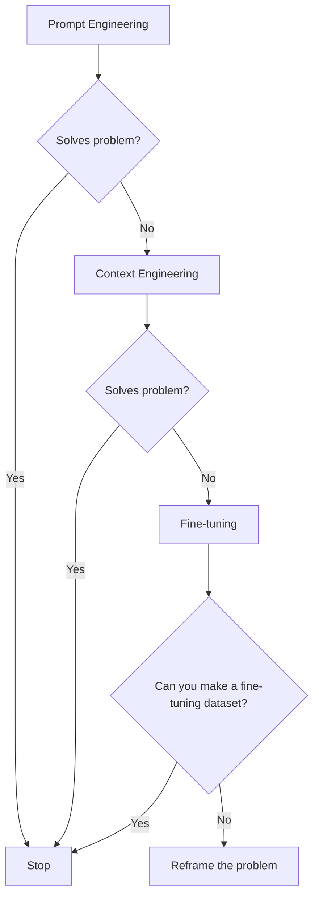
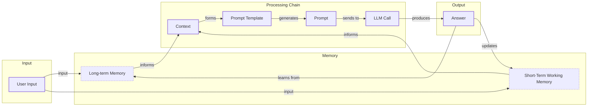
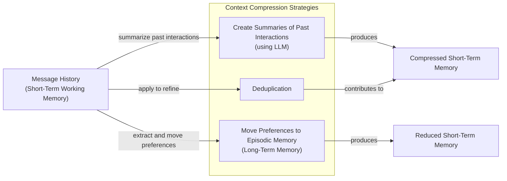
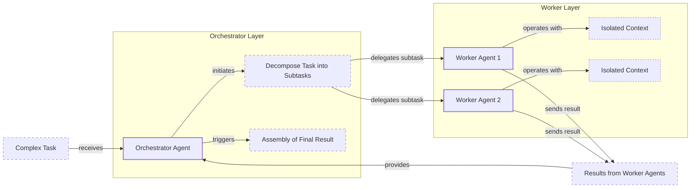

# Lesson 3: Context Engineering

AI applications have evolved rapidly. In 2022, we had simple chatbots for question-answering. By 2023, Retrieval-Augmented Generation (RAG) systems connected LLMs to domain-specific knowledge. 2024 brought us tool-using agents that could perform actions. Now, in 2025, we are building memory-enabled agents that remember past interactions and build relationships over time [[26]](https://www.securityindustry.org/2024/07/16/understanding-the-evolution-from-classic-chatbots-to-rag-chatbots-to-ai-powered-assistants/), [[30]](https://www.linkedin.com/posts/ai-apps-central_most-people-put-all-ai-systems-in-the-same-activity-7438555783077793792-UEUm).

In our last lesson, we explored how to choose between AI agents and LLM workflows when designing a system. As these applications grow more complex, prompt engineering, a practice that once served us well, is showing its limits. It optimizes single LLM calls but fails when managing systems with memory, actions, and long interaction histories. The sheer volume of information an agent might need—past conversations, user data, documents, and action descriptions—has grown exponentially. Simply stuffing all this into a prompt is not a viable strategy.

This is where context engineering comes in. It is the discipline of orchestrating this entire information ecosystem to ensure the LLM gets exactly what it needs, when it needs it. As fine-tuning becomes a last resort due to its cost and inflexibility, context engineering is emerging as a core skill for building successful AI applications [[51]](https://www.linkedin.com/posts/denis-panjuta_prompt-engineering-vs-context-engineering-activity-7363945251180322816-1q_m). This skill is a cornerstone of modern AI engineering.

## From prompt to context engineering

Prompt engineering, while effective for simple tasks, is designed for single, stateless interactions. It treats each call to an LLM as a new, isolated event. This approach breaks down in stateful applications where context must be preserved and managed across multiple turns [[25]](https://www.glean.com/blog/context-engineering-ai-the-foundation-of-reliable-high-performing-models).

As a conversation or task progresses, the context grows. Without a strategy to manage this growth, the LLM’s performance degrades. This is context decay: the model gets confused by the noise of an ever-expanding history, losing track of original instructions or key information [[8]](https://thenewstack.io/context-rot-enterprise-ai-llms/).

Even with large context windows, there is a physical limit to what you can include. Furthermore, every token adds to the cost and latency of an LLM call. Simply putting everything into the context creates a slow, expensive, and underperforming system [[17]](https://datahub.com/blog/context-window-optimization/). We will explore these concepts in more detail in upcoming lessons, including memory in Lesson 9 and RAG in Lesson 10.

On a recent project, we learned this the hard way. We were working with a model that supported a two-million-token context window, so we thought, "*What could go wrong?*" We naively stuffed everything in: our research, extensive guidelines, hundreds of examples, and the full user history. The result was a system that was not only slow, taking 30 minutes to run a single workflow, but also produced low-quality, often irrelevant outputs.

This is where context engineering becomes essential. It shifts the focus from crafting static prompts to building dynamic systems that manage information flow. As an AI engineer, your job is to select only the most critical pieces of context for each LLM call. This makes your applications accurate, fast, and cost-effective.

## Understanding context engineering

Context engineering is about finding the best way to arrange parts of your memory into the context that's passed to an LLM. It's a solution to an optimization problem where you have to retrieve the right parts of both your short- and long-term memory to solve a specific task without overwhelming the LLM [[22]](https://www.mezmo.com/learn-observability/context-engineering-for-observability-how-to-deliver-the-right-data-to-llms). For example, when asking a cooking agent about a recipe, instead of passing the whole cookbook to the agent, we retrieve just the information about that recipe, together with personal preferences like allergies or taste preferences.

Andrej Karpathy explains that LLMs are like a new kind of operating system where the model is the CPU and its context window is the RAM [[31]](https://www.langchain.com/blog/context-engineering-for-agents). Just as an operating system manages what fits into your computer’s limited RAM, context engineering manages what information occupies the model’s limited context window.

Prompt engineering is a subset of context engineering. You still work with prompts, so learning how to write them effectively is a critical skill. But on top of that, it's important to know how to incorporate the right context into the prompt without compromising the LLM's performance [[52]](https://memgraph.com/blog/prompt-engineering-vs-context-engineering).

<table_caption>
Table 1: A comparison of prompt engineering and context engineering.
</table_caption>

| Dimension | Prompt Engineering | Context Engineering |
|-----------|-------------------|---------------------|
| Scope | Single interaction optimization | Entire information ecosystem |
| State Management | Stateless function | Stateful due to memory |
| Focus | How to phrase tasks | What information to provide |

Context engineering is the new fine-tuning. For most use cases, you can get far just by leveraging context engineering techniques. As modern LLMs generalize well, and because fine-tuning is time-consuming and costly, fine-tuning should always be the last resort if nothing else works [[51]](https://www.linkedin.com/posts/denis-panjuta_prompt-engineering-vs-context-engineering-activity-7363945251180322816-1q_m).

When starting a new AI project and deciding what key strategy to use to guide the LLM, your decision-making process should look like the one presented in Image 1. You start with prompt engineering. If that does not solve your problem, you move to context engineering. If that still fails, you can consider fine-tuning, but only if you can create a high-quality dataset. Otherwise, it is better to reframe the problem.


<diagram_caption>
Image 1: A flowchart illustrating the decision-making process for choosing between Prompt Engineering, Context Engineering, and Fine-tuning when solving a problem in AI application development.
</diagram_caption>

For example, when processing Slack messages from your company, it's sufficient to use a reasoning LLM as the core of the agent and various mechanisms to retrieve specific messages and take actions based on them, such as creating action points or writing emails. Fine-tuning the LLM on your company's writing style would likely be a waste of resources. Throughout this course, we will show you how to solve most industry use cases using the power of context engineering.

## What makes up the context

To better understand what context engineering is, let's look at the core elements that build up the context. The high-level workflow begins when a user input triggers the system to pull relevant information from both long-term and short-term memory. This information is assembled into the final context, inserted into a prompt template, and sent to the LLM. The LLM’s answer then updates the memory, and the cycle repeats.


<diagram_caption>
Image 2: A high-level workflow diagram illustrating how user input is processed through various memory components and an LLM to generate an answer.
</diagram_caption>

The components that form the context passed to the LLM can be grouped into two main categories.

**Short-term working memory** is the state of the agent for the current task or conversation. It is volatile and changes with each interaction, helping the agent maintain a coherent dialogue and make immediate decisions. Think of it as the agent's scratchpad for the current job. It can include the user's input, the message history of the current conversation, the agent's internal thoughts, and the results from any actions the agent has performed [[10]](https://www.helicone.ai/blog/how-to-reduce-llm-hallucination), [[39]](https://skymod.tech/why-memory-matters-in-llm-agents-short-term-vs-long-term-memory-architectures/).

**Long-term memory** is more persistent and stores information across sessions, allowing the AI system to remember things beyond a single conversation. This is where the agent's core knowledge and identity reside. We can divide it into three types [[37]](https://www.datacamp.com/blog/how-does-llm-memory-work):
*   **Procedural memory** is knowledge encoded directly in the code, such as the system prompt, available actions (tools), and schemas for structured outputs. Think of this as the agent's built-in skills.
*   **Episodic memory** is the memory of specific past experiences, like user preferences or previous interactions. It's used to help the agent personalize its responses and is typically stored in vector or graph databases for efficient retrieval.
*   **Semantic memory** is the agent’s general knowledge base. It can be internal, like company documents, or external, accessed via the internet through API calls or web scraping. This provides the factual information the agent needs.

If this seems like a lot, bear with us. We will cover all these concepts in-depth in future lessons, including structured outputs in Lesson 4, actions in Lesson 6, memory in Lesson 9, and RAG in Lesson 10.

https://i.imgur.com/h5vYlqA.png 
<image_caption>Image 3: An illustration of how context engineering components work together inside an AI agent (Source [https://i.imgur.com/h5vYlqA.png](https://i.imgur.com/h5vYlqA.png))</image_caption>

These components are not static; they are dynamically re-computed for every single interaction. For each conversation turn or new task, the short-term memory grows, or the long-term memory can change. A big part of context engineering is knowing how to pick the right components from the memory when building the prompt that's passed to the LLM.

## Production implementation challenges

Now that we understand what makes up the context, let's look at the core challenges of implementing it in production. These all revolve around a single question: *"How can I keep my context as small as possible while providing enough information to the LLM?"*

Here are four common issues that come up when building AI applications:

1.  **The context window challenge:** Every AI model has a limited context window, but the advertised number is often misleading. In practice, models have a Maximum Effective Context Window (MECW), which is the actual performance ceiling and can be significantly smaller than the marketed limit [[66]](https://atlan.com/know/llm-context-window-limitations/). Think of it like your computer's RAM. If your machine has only 32GB of RAM, that is all it can use at one time. While context windows are getting larger, they are not infinite, and treating them as such leads to other problems [[16]](https://www.comet.com/site/blog/context-window/).

2.  **Information overload:** Just because you can fit a lot of information into the context does not mean you should. This reflects the "Accumulation Fallacy"—the mistaken assumption that more data is always better, which confuses semantically novel information with pragmatically useful information [[67]](https://arxiv.org/html/2601.11585v1). This overload leads to the "lost-in-the-middle" problem, where accuracy can drop by 30% or more when relevant facts are placed in the middle of the context [[66]](https://atlan.com/know/llm-context-window-limitations/).

3.  **Context drift:** This occurs when conflicting views of truth accumulate in the memory over time. For example, the memory might contain two conflicting statements: "*My cat is white*" and "*My cat is black.*" This is not a quantum physics experiment; it is a data conflict that confuses the LLM and prevents it from knowing what to pick. Without a mechanism to resolve these conflicts, the model's responses become unreliable [[6]](https://galileo.ai/blog/production-llm-monitoring-strategies).

4.  **Tool confusion:** The final challenge is tool confusion, which arises in two main ways. First, adding too many actions to an agent can confuse the LLM about the best one for the job. Secondly, confusion can occur when tool descriptions are poorly written or overlap. If the distinctions between actions are unclear, even a human would struggle to choose the right one [[54]](https://www.instinctools.com/blog/context-engineering/).

## Key strategies for context optimization

Initially, most AI applications were chatbots over single knowledge bases. Today, modern AI solutions must manage multiple knowledge bases, actions, and complex conversational histories. Context engineering is about managing this complexity while meeting performance, latency, and cost requirements.

Here are four popular context engineering strategies used across the industry [[31]](https://www.langchain.com/blog/context-engineering-for-agents):

### Selecting the right context

Retrieving the right information from memory is a critical first step. The goal is to find information with high *pragmatic utility*—content that actually helps answer the question—rather than just being semantically novel [[67]](https://arxiv.org/html/2601.11585v1). A common mistake is to provide everything at once. As we've discussed, the "lost-in-the-middle" problem often leads to poor performance, increased latency, and higher costs [[59]](https://atlan.com/know/llm-context-window-limitations/).

To solve this, you can use structured outputs to pass only necessary information downstream, and use RAG to fetch specific text chunks instead of entire documents. For agents, reducing the number of available actions can significantly improve selection accuracy. Studies have shown that limiting the selection to under 30 tools can triple an agent's accuracy [[53]](https://www.mezmo.com/learn-observability/context-engineering-for-observability-how-to-deliver-the-right-data-to-llms). For time-sensitive information, rank it by date and filter out what is no longer relevant. Finally, repeat core instructions at the start and end of the prompt to leverage the model's attention to the context edges [[58]](https://dev.to/thousand_miles_ai/the-lost-in-the-middle-problem-why-llms-ignore-the-middle-of-your-context-window-3al2).

```mermaid
flowchart LR
  A["User Input"]

  subgraph "Context Selection Module"
    B["Structured Outputs<br/>(Lesson 4)"]
    C["RAG<br/>(Lesson 10)"]
    D["Reduced Number of Tools"]
    E["Temporal Relevance Ranking"]
    F["Repeated Core Instructions"]
  end

  G["Optimized Context for LLM"]

  A -- "provides raw context" --> "Context Selection Module"
  "Context Selection Module" -- "outputs" --> G
```
<diagram_caption>
Image 4: A system diagram illustrating the Context Selection Module and its incorporated context optimization techniques.
</diagram_caption>

### Context compression

As message history grows in short-term working memory, you must manage past interactions to keep your context window in check. You cannot simply drop past conversation turns, as the LLM still needs to remember what happened. Instead, you need ways to compress key facts from the past.

You can do this by creating summaries of past interactions using an LLM, moving user preferences from working memory to long-term episodic memory, and removing redundant information through deduplication [[11]](https://oneuptime.com/blog/post/2026-01-30-context-compression/view), [[12]](https://www.dailydoseofds.com/llmops-crash-course-part-8/). This mimics human memory consolidation, where the brain retains essentials and prunes irrelevant details to form stable long-term memories [[68]](https://arxiv.org/html/2601.07190v1).


<diagram_caption>
Image 5: A process flow diagram illustrating context compression strategies for managing short-term working memory, including summarization, moving preferences, and deduplication.
</diagram_caption>

### Isolating Context

Another powerful strategy is to isolate context by splitting information across multiple agents or LLM workflows. Instead of one agent with a massive, cluttered context window, you can have a team of agents, each with a smaller, focused context.

We often implement this using an orchestrator-worker pattern, where a central orchestrator agent breaks down a problem and assigns sub-tasks to specialized worker agents [[46]](https://beam.ai/agentic-insights/multi-agent-orchestration-patterns-production). Each worker operates in its own isolated context, improving focus and allowing for parallel processing. We will cover this pattern in more detail in a future lesson.


<diagram_caption>
Image 6: An architecture diagram illustrating the orchestrator-worker pattern for context isolation.
</diagram_caption>

### Format optimization

Finally, the way you format the context matters. Models are sensitive to structure, and using clear delimiters can improve performance. Common strategies are to use XML tags to wrap different pieces of context (e.g., `<user_query>`, `<documents>`) and to prefer YAML over JSON when providing structured data as input, as YAML is often more token-efficient [[41]](https://www.decodingai.com/p/context-engineering-2025s-1-skill), [[44]](https://www.anthropic.com/engineering/effective-context-engineering-for-ai-agents).

You always have to understand what is passed to the LLM. Seeing exactly what occupies your context window at every step is key to mastering context engineering. This is usually done by monitoring your traces, tracking what happens at each step, and understanding the inputs and outputs. As this is a significant step to go from a proof of concept to production, we will have dedicated lessons on this topic.

## Here is an example

Let's connect the theory and strategies with a concrete example. Real-world applications that require maintaining context across multiple turns or sessions are common in various fields:

*   **Healthcare:** An AI assistant accesses a patient's medical history, current symptoms, and the latest medical literature to provide personalized diagnostic support [[41]](https://www.decodingai.com/p/context-engineering-2025s-1-skill).
*   **Financial Services:** AI systems integrate with enterprise tools like CRMs and calendars, combining real-time market data and client portfolio information to generate tailored financial advice.
*   **Project Management:** AI systems access enterprise infrastructure like Slack and task managers to automatically understand project requirements, then add and update project tasks.
*   **Content Creator Assistant:** An AI agent uses your research, past content, and personality traits to understand what and how to create a given piece of content.

Let's walk through a specific query to see context engineering in action with the healthcare assistant scenario. A user asks: `I have a headache. What can I do to stop it? I would prefer not to take any medicine.`

Before the AI attempts to answer, a context engineering system performs several steps:
1.  It retrieves the user's patient history, known allergies, and lifestyle habits from episodic memory.
2.  It queries a medical database for non-pharmacological headache remedies from semantic memory.
3.  It assembles the key units of information from both memory types into the final context.
4.  It formats this information into a structured prompt and calls the LLM.
5.  Finally, it presents a personalized, context-aware answer to the user.

Here is a simplified Python example showing how you might structure the prompt for the LLM, using XML tags to format the different context elements [[41]](https://www.decodingai.com/p/context-engineering-2025s-1-skill).

1.  First, we define the user's query and the patient's history, which would typically be retrieved from episodic memory.
    ```python
    import yaml
    
    user_query = "I have a headache. What can I do to stop it? I would prefer not to take any medicine."
    
    patient_history = {
        "patient": {
            "name": "John Doe",
            "age": 45,
            "gender": "M",
            "conditions": ["mild_hypertension"],
            "allergies": [],
            "preferences": {
                "medication_avoidance": True,
                "preferred_treatments": "natural_remedies"
            },
            "habits": {
                "stress_level": "high",
                "work_related": True,
                "caffeine_intake": "3-4_cups_daily"
            }
        }
    }
    ```

2.  Then, we include relevant medical literature, which would be retrieved from semantic memory.
    ```python
    medical_literature = {
        "articles": [
            {
                "id": 1,
                "topic": "dehydration_headaches",
                "finding": "Dehydration is a common cause of tension headaches",
                "treatment": "Rehydration can alleviate symptoms within 30 minutes to three hours"
            },
            {
                "id": 2,
                "topic": "cold_compress",
                "finding": "Applying a cold compress to the forehead and temples can constrict blood vessels",
                "treatment": "Reduces inflammation, helping to relieve migraine pain"
            },
            {
                "id": 3,
                "topic": "caffeine_withdrawal",
                "finding": "Caffeine withdrawal can trigger headaches",
                "treatment": "For regular caffeine consumers, a small amount may alleviate withdrawal headaches"
            },
            {
                "id": 4,
                "topic": "stress_relief",
                "finding": "Stress-relief techniques are effective for tension headaches",
                "treatment": "Deep breathing, meditation, or short walks can help"
            }
        ]
    }
    ```

3.  Finally, we assemble the complete prompt. Notice how we format the patient history and medical literature as YAML, which is more token-efficient than JSON.
    ```python
    prompt = f"""
    <system_prompt>
    You are a helpful AI medical assistant. Your role is to provide safe, helpful, and personalized health advice based on the provided context. Do not give advice outside of the provided context. Prioritize non-medicinal options as per user preference.
    </system_prompt>
    
    <patient_history>
    {yaml.dump(patient_history)}
    </patient_history>
    
    <medical_literature>
    {yaml.dump(medical_literature)}
    </medical_literature>
    
    <user_query>
    {user_query}
    </user_query>
    
    <instructions>
    Based on all the information above, provide a step-by-step plan for the user to relieve their headache. Structure your response clearly.
    </instructions>
    """
    ```

To build such a system, you need a robust tech stack. While the specific tools can vary, the architectural components are consistent. Here is a potential stack we recommend and will use throughout this course:
*   **LLM:** Gemini as a multimodal, reasoning, and cost-effective LLM API provider.
*   **Orchestration:** LangGraph for defining stateful, agentic workflows.
*   **Databases:** PostgreSQL, MongoDB, Redis, Qdrant, and Neo4j. Often, it is effective to keep it simple, as you can achieve much with only PostgreSQL for structured data and vector storage, or MongoDB for unstructured documents. The key is to start with a simple, solid foundation.
*   **Observability:** Opik or LangSmith for evaluation and trace monitoring.

## Connecting context engineering to AI engineering

Context engineering is more of an art than a science. It is about developing the intuition to craft effective prompts, select the right information from memory, and arrange context for optimal results. This discipline helps you determine the minimal yet essential information an LLM needs to perform at its best.

It's important to understand that context engineering cannot be learned in isolation. It is a complex field that combines:

1.  **AI Engineering:** Implement practical solutions such as LLM workflows, RAG, AI Agents, and evaluation pipelines.
2.  **Software Engineering (SWE):** Build your AI product with code that is not just functional, but also scalable and maintainable, and design architectures that can grow with your product's needs.
3.  **Data Engineering:** Design data pipelines that feed curated and validated data into the memory layer [[22]](https://www.mezmo.com/learn-observability/context-engineering-for-observability-how-to-deliver-the-right-data-to-llms).
4.  **Operations (Ops):** Deploy agents on the proper infrastructure to ensure they are reproducible, maintainable, observable, and scalable, including automating processes with CI/CD pipelines [[21]](https://packmind.com/context-engineering-ai-coding/what-is-contextops/).

Our goal with this course is to teach you how to combine these skills to build production-ready AI products. In the world of AI, we should all think in systems rather than isolated components, shifting our mindset from developers to architects.

In the next lesson, we will explore structured outputs, a key technique for controlling what information flows out of an LLM and into the rest of your system. This is the first step in building the reliable, production-grade systems we have discussed, ensuring that the AI's output is predictable and usable.

## References

- [1] Humanlayer. (n.d.). 12-factor-agents/content/factor-03-own-your-context-window.md at main · humanlayer/12-factor-agents. GitHub. [https://github.com/humanlayer/12-factor-agents/blob/main/content/factor-03-own-your-context-window.md](https://github.com/humanlayer/12-factor-agents/blob/main/content/factor-03-own-your-context-window.md)
- [2] What modifications might be needed to the LLM's input formatting or architecture to best take advantage of retrieved documents (for example, adding special tokens or segments to separate context)? (n.d.). Milvus. [https://milvus.io/ai-quick-reference/what-modifications-might-be-needed-to-the-llms-input-formatting-or-architecture-to-best-take-advantage-of-retrieved-documents-for-example-adding-special-tokens-or-segments-to-separate-context](https://milvus.io/ai-quick-reference/what-modifications-might-be-needed-to-the-llms-input-formatting-or-architecture-to-best-take-advantage-of-retrieved-documents-for-example-adding-special-tokens-or-segments-to-separate-context)
- [3] Hong, K., Troynikov, A., & Huber, J. (2025, July). Context Rot: How Increasing Input Tokens Impacts LLM Performance. Chroma. [https://www.trychroma.com/research/context-rot](https://www.trychroma.com/research/context-rot)
- [4] Falconer, S. (n.d.). Four design patterns for Event-Driven, Multi-Agent systems. Confluent. [https://www.confluent.io/blog/event-driven-multi-agent-systems/](https://www.confluent.io/blog/event-driven-multi-agent-systems/)
- [5] From Human Memory to AI Memory: A survey on Memory Mechanisms in the Era of LLMS. (n.d.). arXiv. [https://arxiv.org/html/2504.15965v1](https://arxiv.org/html/2504.15965v1)
- [6] Galileo. (n.d.). Production LLM Monitoring Strategies. Galileo Blog. [https://galileo.ai/blog/production-llm-monitoring-strategies](https://galileo.ai/blog/production-llm-monitoring-strategies)
- [7] Larson, E. J. (2025, July 25). Context, drift, and the illusion of intent. Colligo. [https://erikjlarson.substack.com/p/context-drift-and-the-illusion-of](https://erikjlarson.substack.com/p/context-drift-and-the-illusion-of)
- [8] The New Stack. (n.d.). Context Rot in Enterprise AI LLMs. [https://thenewstack.io/context-rot-enterprise-ai-llms/](https://thenewstack.io/context-rot-enterprise-ai-llms/)
- [9] InsightFinder. (n.d.). The Hidden Cost of LLM Drift and How to Detect It. InsightFinder Blog. [https://insightfinder.com/blog/hidden-cost-llm-drift-detection/](https://insightfinder.com/blog/hidden-cost-llm-drift-detection/)
- [10] Helicone. (n.d.). How to Reduce LLM Hallucination. Helicone Blog. [https://www.helicone.ai/blog/how-to-reduce-llm-hallucination](https://www.helicone.ai/blog/how-to-reduce-llm-hallucination)
- [11] OneUptime. (2026, January 30). Context Compression. OneUptime Blog. [https://oneuptime.com/blog/post/2026-01-30-context-compression/view](https://oneuptime.com/blog/post/2026-01-30-context-compression/view)
- [12] DailyDoseOfDS. (n.d.). LLMOps Crash Course Part 8: Context Engineering. [https://www.dailydoseofds.com/llmops-crash-course-part-8/](https://www.dailydoseofds.com/llmops-crash-course-part-8/)
- [13] Forrester. (2025, January 10). The state of AI agents: lots of potential … and confusion. [https://www.forrester.com/blogs/the-state-of-ai-agents-lots-of-potential-and-confusion/](https://www.forrester.com/blogs/the-state-of-ai-agents-lots-of-potential-and-confusion/)
- [14] 66degrees. (2025, April 7). Building a business case for AI in financial Services. [https://66degrees.com/building-a-business-case-for-ai-in-financial-services/](https://66degrees.com/building-a-business-case-for-ai-in-financial-services/)
- [15] Akira AI. (n.d.). Context Engineering: The Complete guide. [https://www.akira.ai/blog/context-engineering](https://www.akira.ai/blog/context-engineering)
- [16] Comet. (2025, December 23). Context Window: What It Is and Why It Matters for AI Agents. [https://www.comet.com/site/blog/context-window/](https://www.comet.com/site/blog/context-window/)
- [17] DataHub. (n.d.). Context Window Optimization. DataHub Blog. [https://datahub.com/blog/context-window-optimization/](https://datahub.com/blog/context-window-optimization/)
- [18] LangChain. (2025, July 2). Context Engineering for Agents. LangChain Blog. [https://blog.langchain.com/context-engineering-for-agents/](https://blog.langchain.com/context-engineering-for-agents/)
- [19] LlamaIndex. (n.d.). Context Engineering - What it is, and techniques to consider. LlamaIndex Blog. [https://www.llamaindex.ai/blog/context-engineering-what-it-is-and-techniques-to-consider](https://www.llamaindex.ai/blog/context-engineering-what-it-is-and-techniques-to-consider)
- [20] Chase, H. (2025, June 23). The rise of "context engineering". LangChain Blog. [https://blog.langchain.com/the-rise-of-context-engineering/](https://blog.langchain.com/the-rise-of-context-engineering/)
- [21] Packmind. (n.d.). Why AI coding assistants fail without context: an introduction to ContextOps. [https://packmind.com/context-engineering-ai-coding/what-is-contextops/](https://packmind.com/context-engineering-ai-coding/what-is-contextops/)
- [22] Mezmo. (n.d.). Context Engineering for Observability: How to Deliver the Right Data to LLMs. [https://www.mezmo.com/learn-observability/context-engineering-for-observability-how-to-deliver-the-right-data-to-llms](https://www.mezmo.com/learn-observability/context-engineering-for-observability-how-to-deliver-the-right-data-to-llms)
- [23] Mei, L., Yao, J., Ge, Y., Wang, Y., Bi, B., Cai, Y., Liu, J., Li, M., Li, Z., Zhang, D., Zhou, C., Mao, J., Xia, T., Guo, J., & Liu, S. (2025, July 17). A survey of context engineering for large language models. arXiv.org. [https://arxiv.org/pdf/2507.13334](https://arxiv.org/pdf/2507.13334)
- [24] karpathy, A. (n.d.). X. [https://x.com/karpathy/status/1937902205765607626](https://x.com/karpathy/status/1937902205765607626)
- [25] Glean. (n.d.). Context Engineering: The Foundation of Reliable, High-Performing Models. Glean Blog. [https://www.glean.com/blog/context-engineering-ai-the-foundation-of-reliable-high-performing-models](https://www.glean.com/blog/context-engineering-ai-the-foundation-of-reliable-high-performing-models)
- [26] Security Industry Association. (2024, July 16). Understanding the Evolution from Classic Chatbots to RAG Chatbots to AI-Powered Assistants. [https://www.securityindustry.org/2024/07/16/understanding-the-evolution-from-classic-chatbots-to-rag-chatbots-to-ai-powered-assistants/](https://www.securityindustry.org/2024/07/16/understanding-the-evolution-from-classic-chatbots-to-rag-chatbots-to-ai-powered-assistants/)
- [27] PagerGPT. (n.d.). The Evolution of AI Chatbots. [https://pagergpt.ai/ai-chatbot/evolution-of-ai-chatbots](https://pagergpt.ai/ai-chatbot/evolution-of-ai-chatbots)
- [28] DataCamp. (n.d.). Context Engineering: A Guide With Examples. [https://www.datacamp.com/blog/context-engineering](https://www.datacamp.com/blog/context-engineering)
- [29] Dante AI. (n.d.). When Did AI Chatbots Start? A Brief History. [https://www.dante-ai.com/news/when-did-ai-chatbots-start](https://www.dante-ai.com/news/when-did-ai-chatbots-start)
- [30] AI Apps Central. (n.d.). Most people put all AI systems in the same bucket. LinkedIn. [https://www.linkedin.com/posts/ai-apps-central_most-people-put-all-ai-systems-in-the-same-activity-7438555783077793792-UEUm](https://www.linkedin.com/posts/ai-apps-central_most-people-put-all-ai-systems-in-the-same-activity-7438555783077793792-UEUm)
- [31] LangChain. (2025, July 2). Context Engineering for Agents. LangChain Blog. [https://www.langchain.com/blog/context-engineering-for-agents/](https://www.langchain.com/blog/context-engineering-for-agents/)
- [32] Glean. (n.d.). Context Engineering vs. Prompt Engineering: Key Differences Explained. Glean Perspectives. [https://www.glean.com/perspectives/context-engineering-vs-prompt-engineering-key-differences-explained](https://www.glean.com/perspectives/context-engineering-vs-prompt-engineering-key-differences-explained)
- [33] Atlan. (n.d.). Working Memory in LLMs. Atlan. [https://atlan.com/know/working-memory-llms/](https://atlan.com/know/working-memory-llms/)
- [34] Teki, S. (n.d.). From Vibe Coding to Context Engineering. [https://www.sundeepteki.org/blog/from-vibe-coding-to-context-engineering-a-blueprint-for-production-grade-genai-systems](https://www.sundeepteki.org/blog/from-vibe-coding-to-context-engineering-a-blueprint-for-production-grade-genai-systems)
- [35] Roychowdhury, A. (n.d.). Context Engineering: The Silent Architecture Behind Every AI. LinkedIn. [https://www.linkedin.com/pulse/context-engineering-silent-architecture-behind-every-ai-roychowdhury-lzcec](https://www.linkedin.com/pulse/context-engineering-silent-architecture-behind-every-ai-roychowdhury-lzcec)
- [36] Atlan. (n.d.). Working Memory in LLMs. Atlan. [https://atlan.com/know/working-memory-llms/](https://atlan.com/know/working-memory-llms/)
- [37] DataCamp. (n.d.). How Does LLM Memory Work? DataCamp Blog. [https://www.datacamp.com/blog/how-does-llm-memory-work](https://www.datacamp.com/blog/how-does-llm-memory-work)
- [38] Analytics Vidhya. (2026, January). How Does LLM Memory Work? [https://www.analyticsvidhya.com/blog/2026/01/how-does-llm-memory-work/](https://www.analyticsvidhya.com/blog/2026/01/how-does-llm-memory-work/)
- [39] Skymod. (n.d.). Why Memory Matters in LLM Agents. [https://skymod.tech/why-memory-matters-in-llm-agents-short-term-vs-long-term-memory-architectures/](https://skymod.tech/why-memory-matters-in-llm-agents-short-term-vs-long-term-memory-architectures/)
- [40] Label Studio. (n.d.). Episodic vs. Persistent Memory in LLMs. [https://labelstud.io/learningcenter/episodic-vs-persistent-memory-in-llms/](https://labelstud.io/learningcenter/episodic-vs-persistent-memory-in-llms/)
- [41] Iusztin, P. (2025, July 22). Context Engineering is 2025's #1 Skill for AI Engineers. Decoding AI Magazine. [https://www.decodingai.com/p/context-engineering-2025s-1-skill](https://www.decodingai.com/p/context-engineering-2025s-1-skill)
- [42] Pinecone. (n.d.). What is Context Engineering? [https://www.pinecone.io/learn/context-engineering/](https://www.pinecone.io/learn/context-engineering/)
- [43] MDPI. (n.d.). Prompt Engineering in Healthcare. [https://www.mdpi.com/2079-9292/13/15/2961](https://www.mdpi.com/2079-9292/13/15/2961)
- [44] Anthropic. (n.d.). Effective Context Engineering for AI Agents. [https://www.anthropic.com/engineering/effective-context-engineering-for-ai-agents](https://www.anthropic.com/engineering/effective-context-engineering-for-ai-agents)
- [45] Saravia, E. (2025, July 5). Context Engineering Guide. AI Newsletter. [https://nlp.elvissaravia.com/p/context-engineering-guide](https://nlp.elvissaravia.com/p/context-engineering-guide)
- [46] Beam.ai. (n.d.). Multi-Agent Orchestration Patterns in Production. [https://beam.ai/agentic-insights/multi-agent-orchestration-patterns-production](https://beam.ai/agentic-insights/multi-agent-orchestration-patterns-production)
- [47] GuruSup. (n.d.). Multi-Agent Orchestration Guide. [https://gurusup.com/blog/multi-agent-orchestration-guide](https://gurusup.com/blog/multi-agent-orchestration-guide)
- [48] Vellum.ai. (n.d.). Multi-Agent Systems: Building with Context Engineering. [https://www.vellum.ai/blog/multi-agent-systems-building-with-context-engineering](https://www.vellum.ai/blog/multi-agent-systems-building-with-context-engineering)
- [49] Praetorian. (n.d.). Deterministic AI Orchestration. [https://www.praetorian.com/blog/deterministic-ai-orchestration-a-platform-architecture-for-autonomous-development/](https://www.praetorian.com/blog/deterministic-ai-orchestration-a-platform-architecture-for-autonomous-development/)
- [50] Specialized agents. (n.d.). arXiv. [https://arxiv.org/html/2601.13671v1](https://arxiv.org/html/2601.13671v1)
- [51] Panjuta, D. (n.d.). Prompt Engineering vs. Context Engineering. LinkedIn. [https://www.linkedin.com/posts/denis-panjuta_prompt-engineering-vs-context-engineering-activity-7363945251180322816-1q_m](https://www.linkedin.com/posts/denis-panjuta_prompt-engineering-vs-context-engineering-activity-7363945251180322816-1q_m)
- [52] Memgraph. (n.d.). Prompt Engineering vs. Context Engineering. [https://memgraph.com/blog/prompt-engineering-vs-context-engineering](https://memgraph.com/blog/prompt-engineering-vs-context-engineering)
- [53] Mezmo. (n.d.). Context Engineering for Observability. [https://www.mezmo.com/learn-observability/context-engineering-for-observability-how-to-deliver-the-right-data-to-llms](https://www.mezmo.com/learn-observability/context-engineering-for-observability-how-to-deliver-the-right-data-to-llms)
- [54] Instinctools. (n.d.). Context Engineering. [https://www.instinctools.com/blog/context-engineering/](https://www.instinctools.com/blog/context-engineering/)
- [55] Neo4j. (n.d.). Agentic AI: Context Engineering vs. Prompt Engineering. [https://neo4j.com/blog/agentic-ai/context-engineering-vs-prompt-engineering/](https://neo4j.com/blog/agentic-ai/context-engineering-vs-prompt-engineering/)
- [56] DeJohn, A. (n.d.). Lost in the Middle: A Lesson in Failing AI Agents Backwards. LinkedIn. [https://www.linkedin.com/pulse/lost-middle-lesson-failing-ai-agents-backwards-anthony-dejohn-01k2e](https://www.linkedin.com/pulse/lost-middle-lesson-failing-ai-agents-backwards-anthony-dejohn-01k2e)
- [57] Atlan. (n.d.). LLM Context Window Limitations. [https://atlan.com/know/llm-context-window-limitations/](https://atlan.com/know/llm-context-window-limitations/)
- [58] Thousand Miles AI. (n.d.). The Lost in the Middle Problem. dev.to. [https://dev.to/thousand_miles_ai/the-lost-in-the-middle-problem-why-llms-ignore-the-middle-of-your-context-window-3al2](https://dev.to/thousand_miles_ai/the-lost-in-the-middle-problem-why-llms-ignore-the-middle-of-your-context-window-3al2)
- [59] Atlan. (n.d.). LLM Context Window Limitations. [https://atlan.com/know/llm-context-window-limitations/](https://atlan.com/know/llm-context-window-limitations/)
- [60] BigDataBoutique. (n.d.). Needle in a Haystack: Optimizing Retrieval and RAG. [https://bigdataboutique.com/blog/needle-in-haystack-optimizing-retrieval-and-rag-over-long-context-windows-5dfb3c](https://bigdataboutique.com/blog/needle-in-haystack-optimizing-retrieval-and-rag-over-long-context-windows-5dfb3c)
- [61] Codecademy. (n.d.). Context Engineering in AI. [https://www.codecademy.com/article/context-engineering-in-ai](https://www.codecademy.com/article/context-engineering-in-ai)
- [62] Stackademic. (n.d.). Context Engineering in LLMs and AI Agents. [https://blog.stackademic.com/context-engineering-in-llms-and-ai-agents-eb861f0d3e9b](https://blog.stackademic.com/context-engineering-in-llms-and-ai-agents-eb861f0d3e9b)
- [63] Packmind. (n.d.). How to Implement Context Engineering. [https://packmind.com/context-engineering-ai-coding/how-to-implement-context-engineering/](https://packmind.com/context-engineering-ai-coding/how-to-implement-context-engineering/)
- [64] Atlan. (n.d.). Context Engineering Platforms Comparison. [https://atlan.com/know/context-engineering-platforms-comparison/](https://atlan.com/know/context-engineering-platforms-comparison/)
- [65] Scalable Path. (n.d.). LangGraph. [https://www.scalablepath.com/machine-learning/langgraph](https://www.scalablepath.com/machine-learning/langgraph)
- [66] Atlan. (n.d.). LLM Context Window Limitations: Impacts, Risks, & Fixes in 2026. [https://atlan.com/know/llm-context-window-limitations/](https://atlan.com/know/llm-context-window-limitations/)
- [67] Kim, H. (2026, January 1). Entropic Context Shaping: Information-Theoretic Filtering for Context-Aware LLM Agents. arXiv. [https://arxiv.org/html/2601.11585v1](https://arxiv.org/html/2601.11585v1)
- [68] Active Context Compression: Autonomous Memory Management. (2026, January). arXiv. [https://arxiv.org/html/2601.07190v1](https://arxiv.org/html/2601.07190v1)