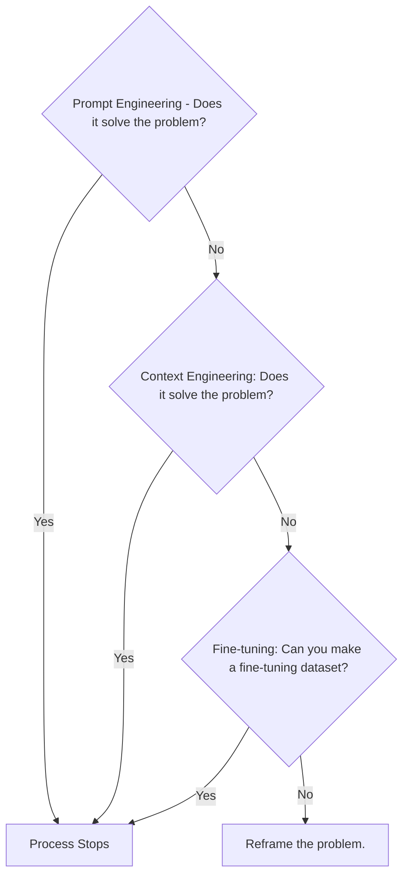
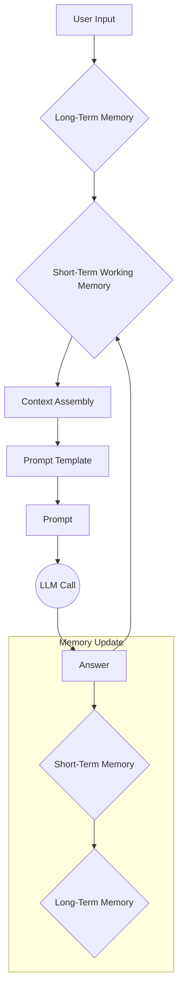
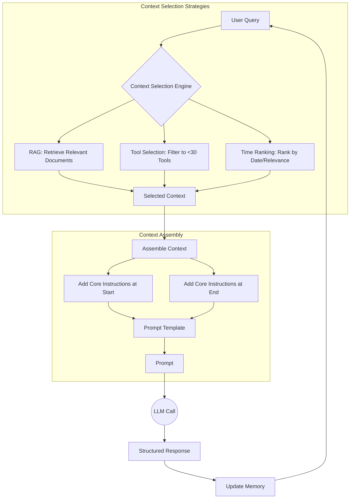
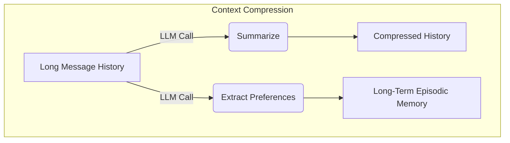
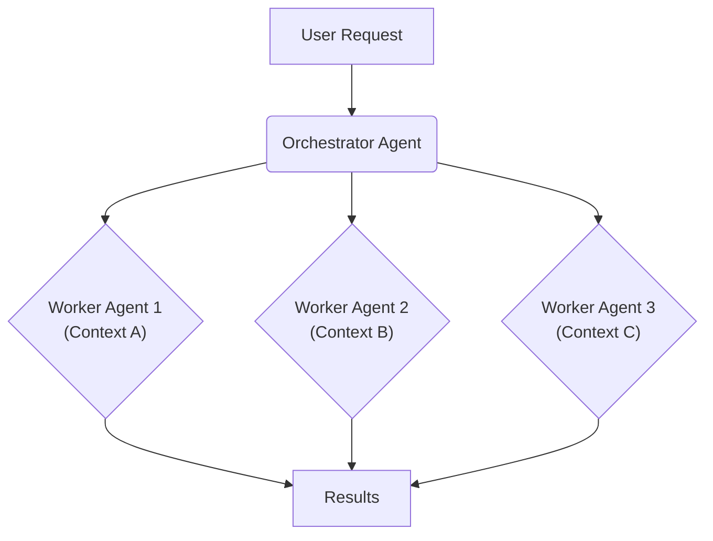

# Context Engineering: 2025’s #1 Skill in AI

AI applications have evolved rapidly. In 2022, we had simple chatbots for question-answering, confined to their pre-trained knowledge. By 2023, Retrieval-Augmented Generation (RAG) systems connected LLMs to domain-specific knowledge, allowing them to answer questions about private data. 2024 brought us tool-using agents that could perform actions and interact with external APIs. Now, we are building memory-enabled agents that remember past interactions and build relationships over time, creating stateful and personalized experiences [[20]](https://www.securityindustry.org/2024/07/16/understanding-the-evolution-from-classic-chatbots-to-rag-chatbots-to-ai-powered-assistants/).

In our last lesson, we explored how to choose between AI agents and LLM workflows when designing a system. As these applications grow more complex, prompt engineering, a practice that once served us well, is showing its limits. It optimizes single LLM calls but fails when managing systems with memory, actions, and long interaction histories. The sheer volume of information an agent might need has grown exponentially. This includes past conversations, user data, documents, and action descriptions. Simply stuffing all this into a prompt is not a viable strategy.

The discipline of orchestrating this entire information ecosystem to ensure the LLM gets exactly what it needs, when it needs it, is context engineering. This skill is becoming a core foundation for AI engineering.

## From prompt to context engineering

Prompt engineering, while effective for simple tasks, is designed for single, stateless interactions. It treats each call to an LLM as a new, isolated event. This approach breaks down in stateful applications where context must be preserved and managed across multiple turns.

As a conversation or task progresses, the context grows. Without a strategy to manage this growth, the LLM’s performance degrades. This is context decay: the model gets confused by the noise of an ever-expanding history, leading to hallucinations and misguided answers [[1]](https://www.decodingai.com/p/context-engineering-2025s-1-skill). It starts to lose track of the original instructions or key information. This decay manifests in several ways: the agent can be distracted by too much history, confused by irrelevant tools or documents, or misled by contradictory information accumulating in the context [[12]](https://weaviate.io/blog/context-engineering).

Even with large context windows, a physical limit exists for what you can include. Also, on the operational side, every token adds to the cost and latency of an LLM call [[2]](https://www.comet.com/site/blog/context-window/). Simply putting everything into the context creates a slow, expensive, and underperforming system. We will explore these concepts in more detail in upcoming lessons, including memory in Lesson 9 and RAG in Lesson 10.

On a recent project, we learned this the hard way. We were working with a model that supported a million-token context window, so we thought, "*What could go wrong*?" We stuffed everything in: our research, guidelines, examples, and user history. The result was an LLM workflow that took 30 minutes to run and produced low-quality outputs [[1]](https://www.decodingai.com/p/context-engineering-2025s-1-skill).

Context engineering addresses these limitations by treating AI applications not as a series of isolated prompts, but as systems that operate through dynamic context. As AI Engineers, our job is to keep only what's essential in the context when we pass it to the LLM, making it accurate, fast, and cost-effective.

## Understanding context engineering

Context engineering is about finding the best way to arrange parts of your memory into the context that's passed to the LLM to squeeze out the best results. It's a solution to an optimization problem in which you have to retrieve the right parts of both your short and long-term memory to solve a specific task without overwhelming the LLM [[3]](https://arxiv.org/pdf/2507.13334). For example, when asking a cooking agent about a recipe, instead of passing the whole cookbook to the agent, we retrieve just the information about that recipe, together with personal preferences, such as allergies or taste preferences.

Andrej Karpathy offered a great analogy for this: LLMs are like a new kind of operating system, where the model acts as the CPU and its context window functions as the RAM [[4]](https://x.com/karpathy/status/1937902205765607626). Just as an operating system manages what fits into RAM, context engineering curates what occupies the model’s working memory. This is often framed as managing the model's 'attention budget.' Like humans, who have a limited working memory, LLMs can only focus on so much information at once. Every piece of context consumes part of this budget, making careful curation essential [[13]](https://www.anthropic.com/engineering/effective-context-engineering-for-ai-agents).

Context engineering is not replacing prompt engineering. Instead, you can intuitively see prompt engineering as a part of context engineering. You still need to learn how to write good prompts while gathering the right context and stuffing it into your prompt without breaking the LLM. That’s what context engineering is all about [[1]](https://www.decodingai.com/p/context-engineering-2025s-1-skill). Prompt engineering is about how you ask the question, while context engineering ensures the model has the right information—like a textbook or notes from a previous conversation—before it starts to think [[12]](https://weaviate.io/blog/context-engineering).

| Dimension | Prompt Engineering | Context Engineering |
| --- | --- | --- |
| Scope | Single interaction optimization | Entire information ecosystem |
| State Management | Stateless function | Stateful due to memory |
| Focus | How to phrase tasks | What information to provide |

Table 1: A comparison of prompt engineering and context engineering.

Context engineering is the new fine-tuning. For most enterprise use cases, you get better results faster and more cheaply with context engineering [[5]](https://memgraph.com/blog/prompt-engineering-vs-context-engineering). As modern LLMs generalize really well, and because fine-tuning is time-consuming and costly, fine-tuning should always be the last resort if nothing else works.

When starting a new AI project and deciding what key strategy to use to guide the LLM to answer correctly, your decision-making should look like this, from easy to hard:


Image 1: A flowchart illustrating the decision-making process for choosing a key strategy to guide an LLM.

For instance, when processing Slack messages from your company, it's sufficient to use a reasoning LLM as the core of the agent and various mechanisms to retrieve specific Slack messages and take actions based on them, such as creating action points or writing emails. Fine-tuning the LLM on writing emails most of the time would be a waste of resources. Within this course, we will show you how to solve most industry use cases using the power of context engineering.

## What makes up the context

To better understand what context engineering is, let's look at the core elements that build up the context. The high-level workflow begins when a user input triggers the system to pull relevant information from both long-term and short-term memory. This information is assembled into the final context, inserted into a prompt template, and sent to the LLM. The LLM’s answer then updates the memory, and the cycle repeats.


Image 2: The high-level workflow of how context is assembled and used in an AI system.

These components are grouped into two main categories. We will explain them intuitively, as we have future dedicated lessons for all of them.

### Short-Term Working Memory

Short-term working memory is the state of the agent for the current task or conversation. It is volatile and changes with each interaction, helping the agent maintain a coherent dialogue and make immediate decisions. It can include some or all of these components [[6]](https://blog.langchain.com/context-engineering-for-agents/):

*   **User input:** The most recent query or command from the user.
*   **Message history:** The log of the current conversation, including user inputs and the agent's internal monologue (thoughts, actions, and observations from tool use) [[1]](https://www.decodingai.com/p/context-engineering-2025s-1-skill).
*   **Agent's internal thoughts:** The reasoning steps the agent takes to decide on its next action. This is often part of a "scratchpad" or working memory where the agent can take notes or plan its next steps without cluttering the main conversation history [[21]](https://www.anthropic.com/engineering/claude-think-tool).
*   **Tool calls and outputs:** The results from any actions the agent has performed, providing information from external systems. These outputs can be large, and managing them is a key part of context engineering.

### Long-Term Memory

Long-term memory is more persistent and stores information across sessions, allowing the AI system to remember things beyond a single conversation. Just as context helps humans recall information more effectively, the context provided in a prompt guides an LLM's response [[14]](https://arxiv.org/html/2504.02441v1). We divide it into three types, drawing parallels from human memory [[1]](https://www.decodingai.com/p/context-engineering-2025s-1-skill). An AI system can include some or all of them:

*   **Procedural memory:** This is knowledge encoded directly in the code. It includes the system prompt, which sets the agent's overall behavior. It also includes the definitions of available tools and schemas for structured outputs, which guide the format of its responses. This is the agent's set of built-in skills.
*   **Episodic memory:** This is memory of specific past experiences, like user preferences or previous interactions. It's used to help the agent personalize its responses based on individual users. We typically store this in vector or graph databases for efficient retrieval.
*   **Semantic memory:** This is the agent’s general knowledge base. It can be internal, like company documents, or external, accessed via the internet through API calls or web scraping. This memory provides the factual information the agent needs to answer questions and is the core of RAG.

If this seems like a lot, bear with us. We will learn all these concepts in depth in future lessons, such as structured outputs in Lesson 4, tools in Lesson 6, memory in Lesson 9, RAG in Lesson 10, and working with multimodal data in Lesson 11.

https://substackcdn.com/image/fetch/f_auto,q_auto:good,fl_progressive:steep/https%3A%2F%2Fsubstack-post-media.s3.amazonaws.com%2Fpublic%2Fimages%2F39dce26a-e51e-4167-ac9e-ca28c45b53a6_1115x708.png
Image 3: A detailed illustration of how all the context engineering components work together inside an AI agent (Source [Decoding AI Magazine [1]](https://www.decodingai.com/p/context-engineering-2025s-1-skill))

These components are not static; they are dynamically re-computed for every single interaction. For each conversation turn or new task, the short-term memory grows, or the long-term memory can change. A big part of context engineering is knowing how to pick the right components from the memory when building the prompt that's passed to the LLM.

## Production implementation challenges

Now that we understand what makes up the context, let's look at the core challenges of implementing it in production. These challenges all revolve around a single question: *"How can I keep my context as small as possible while providing enough information to the LLM?"*

Here are four common issues that come up when building AI applications:

1.  **The context window challenge:** Every AI model has a limited context window, the maximum amount of information (tokens) it can process at once. This functions as your computer's RAM. If your machine has only 32GB of RAM, that is all it can use at one time. While context windows are getting larger, they are not infinite, and treating them as such leads to other problems [[1]](https://www.decodingai.com/p/context-engineering-2025s-1-skill). The computational cost of the self-attention mechanism scales quadratically with sequence length, making long contexts expensive and slow [[3]](https://arxiv.org/pdf/2507.13334).
2.  **Information overload:** Too much context degrades performance, a phenomenon formalized as **context rot**. Research in 2025 by Chroma Labs testing 18 frontier models found that performance does not degrade gracefully. Instead, it can drop off a cliff unpredictably as context length grows, even when the window is far from full [[15]](https://www.trychroma.com/research/context-rot). This extends the "lost-in-the-middle" problem, showing it is an architectural property of transformers. Counter-intuitively, models sometimes perform worse on logically coherent documents than on shuffled text, as the narrative flow can create more plausible-seeming distractors [[16]](https://www.morphllm.com/context-rot).
3.  **Context drift:** This occurs when conflicting versions of truth accumulate in the memory over time. For example, the memory might contain two conflicting statements: "The user's budget is $500" and later "The user's budget is $1,000" [[1]](https://www.decodingai.com/p/context-engineering-2025s-1-skill). This is not a quantum physics experiment; it is a data conflict that confuses the LLM and prevents it from knowing what to pick. Without a mechanism to resolve or prune outdated facts, the agent's knowledge base becomes unreliable [[8]](https://galileo.ai/blog/production-llm-monitoring-strategies). This can also happen when the real-world data your AI uses changes over time, a problem known as data drift, which erodes response accuracy and user trust [[22]](https://www.coforge.com/what-we-know/blog/navigating-the-shifting-sands-understanding-and-mitigating-data-drift-in-llms).
4.  **Tool confusion:** The final challenge is tool confusion, which arises in two main ways. First, adding too many tools to an agent can confuse the LLM about the best one for the job, a problem that often appears with over 100 tools. Second, confusion can occur when tool descriptions are poorly written or overlap. If the distinctions between tools are unclear, even a human would struggle to choose the right one [[1]](https://www.decodingai.com/p/context-engineering-2025s-1-skill).

Solving these challenges requires a deliberate set of strategies for optimizing what goes into the context window.

## Key strategies for context optimization

Initially, most AI applications were chatbots over single knowledge bases. Today, modern AI solutions must manage multiple knowledge bases, tools, and complex conversational histories. Context engineering is about managing this complexity while meeting performance, latency, and cost requirements.

Here are four popular context engineering strategies used across the industry:

### Selecting the right context

Retrieving the right information from memory is a critical first step. A common mistake is to provide everything at once, assuming that models with large context windows can handle it. As we've discussed, the "lost-in-the-middle" problem often leads to poor performance, increased latency, and higher costs.

To solve this, consider these approaches:

*   **Use structured outputs:** Define clear schemas for what the LLM should return. This allows you to pass only the necessary, structured information to downstream steps. We will cover this in detail in Lesson 4.
*   **Use RAG:** Instead of providing entire documents, use RAG to fetch only the specific chunks of text needed to answer a user's question. This is a core topic we will explore in Lesson 10.
*   **Reduce the number of available tools:** Rather than giving an agent access to every available tool, use various strategies to delegate tool subsets to specialized components. Studies show that limiting the selection to under 30 tools can triple the agent's selection accuracy [[9]](https://www.datacamp.com/blog/context-engineering). The ideal number of tools an agent can use depends on the tools, the LLM, and how well the tools are defined. Evaluating your AI system on core business metrics is a mandatory step that will help you pick the right number.
*   **Rank time-sensitive data:** For time-sensitive information, rank it by date and filter out anything no longer relevant [[3]](https://arxiv.org/pdf/2507.13334).
*   **Repeat core instructions:** For the most important instructions, repeat them at both the start and the end of the prompt. This uses the model's tendency to pay more attention to the context edges, ensuring core instructions are not lost [[10]](https://promptmetheus.com/resources/llm-knowledge-base/lost-in-the-middle-effect).


Image 4: A workflow showing how context selection strategies work together to optimize information retrieval and assembly.

### Context compression

As message history grows in short-term working memory, you must manage past interactions to keep your context window in check. You cannot simply drop past conversation turns, as the LLM still needs to remember what happened. Instead, you need ways to compress key facts from the past. The trade-off is between latency and fidelity. While compression reduces costs and speeds up inference, extreme compression can erode the fine-grained details needed for high-recall tasks. Frameworks have shown it is possible to achieve 3-4x compression with minimal quality loss, but this always requires careful evaluation [[17]](https://www.emergentmind.com/topics/context-compression-framework).

You can do this through:

1.  **Creating summaries of past interactions:** Use an LLM to replace a long, detailed history with a concise overview [[11]](https://oneuptime.com/blog/post/2026-01-30-context-compression/view).
2.  **Moving user preferences to long-term memory:** Transfer user preferences from working memory to long-term episodic memory. This keeps the working context clean while ensuring preferences are remembered for future sessions [[1]](https://www.decodingai.com/p/context-engineering-2025s-1-skill).
3.  **Deduplication:** Remove redundant information from the context to avoid repetition, for instance by using MinHash [[1]](https://www.decodingai.com/p/context-engineering-2025s-1-skill).


Image 5: Compressing context by summarizing history and extracting preferences to long-term memory.

### Isolating Context

Another powerful strategy is to isolate context by splitting information across multiple agents or LLM workflows. This technique is similar to tool isolation but is more general, referring to the whole context. The key idea is that instead of one agent with a massive, cluttered context window, you can have a team of agents, each with a smaller, focused context.

We often implement this using an orchestrator-worker pattern, where a central orchestrator agent breaks down a problem and assigns sub-tasks to specialized worker agents [[1]](https://www.decodingai.com/p/context-engineering-2025s-1-skill). Each worker operates in its own isolated context, improving focus and allowing for parallel processing. This modularity prevents cross-domain hallucinations and can reduce token consumption by 60-70% compared to a monolithic agent [[23]](https://gurusup.com/blog/multi-agent-orchestration-guide). We will cover this pattern in more detail in Lesson 5.


Image 6: The orchestrator-worker pattern isolates context across multiple specialized agents.

### Format optimization

Finally, the way you format the context matters. Models are sensitive to structure, and using clear delimiters can improve performance. Common strategies are to:

*   **Use XML tags:** Wrap different pieces of context in XML-like tags (e.g., `<user_query>`, `<documents>`). This helps the model distinguish between different types of information, while making it easier for the engineer to reference context elements within the system prompt [[1]](https://www.decodingai.com/p/context-engineering-2025s-1-skill).
*   **Prefer YAML over JSON:** When providing structured data as input, YAML is often more token-efficient than JSON, which helps save space in your context window [[1]](https://www.decodingai.com/p/context-engineering-2025s-1-skill).

You always have to understand what is passed to the LLM. Seeing exactly what occupies your context window at every step is key to mastering context engineering. Usually, this is done by properly monitoring your traces, tracking what happens at each step, and understanding what the inputs and outputs are. As this is a significant step to go from PoC to production, we will have dedicated lessons on this.

## Here is an example

Let's connect the theory and strategies discussed earlier with concrete examples. Consider several common real-world scenarios:

*   **Healthcare:** An AI assistant accesses a patient's medical history, current symptoms, and the latest medical literature to provide personalized diagnostic support [[1]](https://www.decodingai.com/p/context-engineering-2025s-1-skill).
*   **Financial Services:** AI systems integrate with enterprise tools like Customer Relationship Management (CRM) systems, emails, and calendars. To turn this unstructured data into reliable context, many enterprises use knowledge graphs to map relationships between entities like clients, assets, and market events. This structured layer allows the AI to reason over connections, combining real-time data and client history to generate tailored financial advice [[18]](https://www.moodys.com/web/en/us/creditview/blog/beyond-prompts-why-enterprise-ai-demands-context-engineering.html).
*   **Project Management:** AI systems access enterprise infrastructure like CRMs, Slack, and task managers. By maintaining context about ongoing projects, team members, and deadlines, they can automatically understand new requirements, draft task descriptions, and update project boards.
*   **Content Creator Assistant:** An AI agent uses your research notes, past content, and established personality traits as long-term memory. This allows it to understand not just *what* to write about, but *how* to write it in your unique voice, maintaining consistency across dozens of articles or scripts.

Let's walk through a specific query to see context engineering in action with the healthcare assistant scenario. A user asks: `I have a headache. What can I do to stop it? I would prefer not to take any medicine.`

Before the AI attempts to answer, a context engineering system performs several steps:

1.  It retrieves the user's patient history, known allergies, and lifestyle habits from episodic memory.
2.  It queries a medical database for non-pharmacological headache remedies from semantic memory.
3.  It assembles the key units of information from both memory types into the final context.
4.  It formats this information into a structured prompt and calls the LLM.
5.  Finally, it presents a personalized, context-aware answer to the user.

Here is a simplified Python example showing how you might structure the context and prompt for the LLM, using XML tags to format the different context elements and YAML to format all input data collections:

1.  First, we define the user's query.
    ```python
    import yaml
    
    user_query = "I have a headache. What can I do to stop it? I would prefer not to take any medicine."
    ```
2.  Next, we define the patient's history, which would typically be retrieved from episodic memory.
    ```python
    patient_history = {
        "patient": {
            "name": "John Doe",
            "age": 45,
            "gender": "M",
            "conditions": ["mild_hypertension"],
            "allergies": [],
            "preferences": {
                "medication_avoidance": True,
                "preferred_treatments": "natural_remedies"
            },
            "habits": {
                "stress_level": "high",
                "work_related": True,
                "caffeine_intake": "3-4_cups_daily"
            }
        }
    }
    ```
3.  Then, we include relevant medical literature, which would be retrieved from semantic memory.
    ```python
    medical_literature = {
        "articles": [
            {
                "id": 1,
                "topic": "dehydration_headaches",
                "finding": "Dehydration is a common cause of tension headaches",
                "treatment": "Rehydration can alleviate symptoms within 30 minutes to three hours"
            },
            {
                "id": 2,
                "topic": "cold_compress",
                "finding": "Applying a cold compress to the forehead and temples can constrict blood vessels",
                "treatment": "Reduces inflammation, helping to relieve migraine pain"
            },
            {
                "id": 3,
                "topic": "caffeine_withdrawal",
                "finding": "Caffeine withdrawal can trigger headaches",
                "treatment": "For regular caffeine consumers, a small amount may alleviate withdrawal headaches"
            },
            {
                "id": 4,
                "topic": "stress_relief",
                "finding": "Stress-relief techniques are effective for tension headaches",
                "treatment": "Deep breathing, meditation, or short walks can help"
            }
        ]
    }
    ```
4.  Finally, we assemble the complete prompt, combining all elements into a structured format. Notice how we format the patient history and medical literature as YAML, instead of passing them directly as plain Python dictionaries, which are equivalent to JSON.
    ```python
    prompt = f"""
    <system_prompt>
    You are a helpful AI medical assistant. Your role is to provide safe, helpful, and personalized health advice based on the provided context. Do not give advice outside of the provided context. Prioritize non-medicinal options as per user preference.
    </system_prompt>
    
    <patient_history>
    {yaml.dump(patient_history)}
    </patient_history>
    
    <medical_literature>
    {yaml.dump(medical_literature)}
    </medical_literature>
    
    <user_query>
    {user_query}
    </user_query>
    
    <instructions>
    Based on all the information above, provide a step-by-step plan for the user to relieve their headache. Structure your response clearly.
    </instructions>
    """
    ```
    The final input sent to the LLM would look like this:
    ```xml
    <system_prompt>
    You are a helpful AI medical assistant. Your role is to provide safe, helpful, and personalized health advice based on the provided context. Do not give advice outside of the provided context. Prioritize non-medicinal options as per user preference.
    </system_prompt>
    
    <patient_history>
    patient:
      age: 45
      allergies: []
      conditions:
      - mild_hypertension
      gender: M
      habits:
        caffeine_intake: 3-4_cups_daily
        stress_level: high
        work_related: true
      name: John Doe
      preferences:
        medication_avoidance: true
        preferred_treatments: natural_remedies
    </patient_history>
    
    <medical_literature>
    articles:
    - finding: Dehydration is a common cause of tension headaches
      id: 1
      topic: dehydration_headaches
      treatment: Rehydration can alleviate symptoms within 30 minutes to three hours
    - finding: Applying a cold compress to the forehead and temples can constrict blood
        vessels
      id: 2
      topic: cold_compress
      treatment: Reduces inflammation, helping to relieve migraine pain
    - finding: Caffeine withdrawal can trigger headaches
      id: 3
      topic: caffeine_withdrawal
      treatment: For regular caffeine consumers, a small amount may alleviate withdrawal
        headaches
    - finding: Stress-relief techniques are effective for tension headaches
      id: 4
      topic: stress_relief
      treatment: Deep breathing, meditation, or short walks can help
    </medical_literature>
    
    <user_query>
    I have a headache. What can I do to stop it? I would prefer not to take any medicine.
    </user_query>
    
    <instructions>
    Based on all the information above, provide a step-by-step plan for the user to relieve their headache. Structure your response clearly.
    </instructions>
    ```

To build such a system, you need a robust tech stack. Here is a potential stack we recommend and will use throughout this course:

*   **LLM:** Gemini as a multimodal, reasoning, and cost-effective LLM API provider.
*   **Orchestration:** LangGraph for defining stateful, agentic workflows.
*   **Databases:** PostgreSQL, MongoDB, Redis, Qdrant, and Neo4j. Often, it is effective to keep it simple, as you can achieve much with only PostgreSQL or MongoDB.
*   **Observability:** Opik or LangSmith for evaluation and trace monitoring.

Building systems like this requires more than just knowing the tools; it demands a holistic approach to engineering.

## Connecting context engineering to AI engineering

Context engineering involves developing the intuition to craft effective prompts, select the right information from memory, and arrange context for optimal results. This discipline helps you determine the minimal yet essential information an LLM needs to perform at its best.

It's important to understand that context engineering, or AI engineering for that matter, cannot be learned in isolation. It is a complex field that combines:

1.  **AI Engineering:** Implement practical solutions such as LLM workflows, RAG, AI Agents, and evaluation pipelines.
2.  **Software Engineering (SWE):** Build your AI product with code that is not just functional, but also scalable and maintainable, and design architectures that can grow with your product's needs.
3.  **Data Engineering:** Design data pipelines that feed curated and validated data into the memory layer. In an enterprise setting, this often involves building a semantic knowledge layer, such as a knowledge graph, that connects disparate data sources and provides the AI with a structured understanding of business entities and their relationships [[19]](https://www.mphasis.com/home/thought-leadership/blog/context-engineering-and-knowledge-graphs-building-enterprise-ai-that-can-reason-learn-and-scale.html).
4.  **Operations (Ops):** Deploy agents on the proper infrastructure to ensure they are reproducible, maintainable, observable, and scalable, including automating processes with CI/CD pipelines.

Our goal with this course is to teach you how to combine these skills to build production-ready AI products. In the world of AI, you should think in systems rather than isolated components, having a mindset shift from developers to architects.

In the next lesson, we will explore structured outputs. Later, we will build on these concepts when we cover tools in Lesson 6, memory in Lesson 9, and RAG in Lesson 10.

## References

*   [1] Paul Iusztin. (2025, July). Context Engineering: 2025’s #1 Skill in AI. Decoding AI Magazine. [https://www.decodingai.com/p/context-engineering-2025s-1-skill](https://www.decodingai.com/p/context-engineering-2025s-1-skill)
*   [2] Kelsey Kinzer. (2025, December). Context Window: What It Is and Why It Matters for AI Agents. Comet. [https://www.comet.com/site/blog/context-window/](https://www.comet.com/site/blog/context-window/)
*   [3] Mei, L., Yao, J., et al. (2025, July). A Survey of Context Engineering for Large Language Models. arXiv. [https://arxiv.org/pdf/2507.13334](https://arxiv.org/pdf/2507.13334)
*   [4] Andrej Karpathy. (2025, May). X. [https://x.com/karpathy/status/1937902205765607626](https://x.com/karpathy/status/1937902205765607626)
*   [5] Memgraph Team. (2025). Prompt Engineering vs. Context Engineering. Memgraph Blog. [https://memgraph.com/blog/prompt-engineering-vs-context-engineering](https://memgraph.com/blog/prompt-engineering-vs-context-engineering)
*   [6] LangChain Team. (2025, July). Context Engineering for Agents. LangChain Blog. [https://blog.langchain.com/context-engineering-for-agents/](https://blog.langchain.com/context-engineering-for-agents/)
*   [7] Anthony Dejohn. (2025). Lost in the Middle: A Lesson in Failing AI Agents Backwards. LinkedIn. [https://www.linkedin.com/pulse/lost-middle-lesson-failing-ai-agents-backwards-anthony-dejohn-01k2e](https://www.linkedin.com/pulse/lost-middle-lesson-failing-ai-agents-backwards-anthony-dejohn-01k2e)
*   [8] Galileo Team. (2025). Production LLM Monitoring Strategies. Galileo Blog. [https://galileo.ai/blog/production-llm-monitoring-strategies](https://galileo.ai/blog/production-llm-monitoring-strategies)
*   [9] DataCamp. (2025). Context Engineering: A Guide With Examples. DataCamp Blog. [https://www.datacamp.com/blog/context-engineering](https://www.datacamp.com/blog/context-engineering)
*   [10] Promptmetheus. (n.d.). Lost-in-the-Middle Effect. [https://promptmetheus.com/resources/llm-knowledge-base/lost-in-the-middle-effect](https://promptmetheus.com/resources/llm-knowledge-base/lost-in-the-middle-effect)
*   [11] OneUptime. (2026, January). How to Build Context Compression. OneUptime Blog. [https://oneuptime.com/blog/post/2026-01-30-context-compression/view](https://oneuptime.com/blog/post/2026-01-30-context-compression/view)
*   [12] Weaviate Team. (2025). Context Engineering: LLM Memory and Retrieval for AI Agents. Weaviate Blog. [https://weaviate.io/blog/context-engineering](https://weaviate.io/blog/context-engineering)
*   [13] Anthropic Team. (2025). Effective context engineering for AI agents. Anthropic Engineering Blog. [https://www.anthropic.com/engineering/effective-context-engineering-for-ai-agents](https://www.anthropic.com/engineering/effective-context-engineering-for-ai-agents)
*   [14] Zhang, Y., et al. (2025, April). Cognitive Architectures for Language Agents. arXiv. [https://arxiv.org/html/2504.02441v1](https://arxiv.org/html/2504.02441v1)
*   [15] Hong, K., Troynikov, A., & Huber, J. (2025, July). Context Rot: How Increasing Input Tokens Impacts LLM Performance. Chroma. [https://www.trychroma.com/research/context-rot](https://www.trychroma.com/research/context-rot)
*   [16] MorphLlama Team. (2025). What is Context Rot? [https://www.morphllm.com/context-rot](https://www.morphllm.com/context-rot)
*   [17] Emergent Mind. (2025). Context Compression Framework. [https://www.emergentmind.com/topics/context-compression-framework](https://www.emergentmind.com/topics/context-compression-framework)
*   [18] Moody's. (2025). Beyond Prompts: Why Enterprise AI Demands Context Engineering. [https://www.moodys.com/web/en/us/creditview/blog/beyond-prompts-why-enterprise-ai-demands-context-engineering.html](https://www.moodys.com/web/en/us/creditview/blog/beyond-prompts-why-enterprise-ai-demands-context-engineering.html)
*   [19] Mphasis. (2025). Context Engineering and Knowledge Graphs: Building Enterprise AI That Can Reason, Learn, and Scale. [https://www.mphasis.com/home/thought-leadership/blog/context-engineering-and-knowledge-graphs-building-enterprise-ai-that-can-reason-learn-and-scale.html](https://www.mphasis.com/home/thought-leadership/blog/context-engineering-and-knowledge-graphs-building-enterprise-ai-that-can-reason-learn-and-scale.html)
*   [20] Security Industry Association. (2024, July). Understanding the Evolution from Classic Chatbots to RAG Chatbots to AI-Powered Assistants. [https://www.securityindustry.org/2024/07/16/understanding-the-evolution-from-classic-chatbots-to-rag-chatbots-to-ai-powered-assistants/](https://www.securityindustry.org/2024/07/16/understanding-the-evolution-from-classic-chatbots-to-rag-chatbots-to-ai-powered-assistants/)
*   [21] Anthropic Team. (2025). Claude can now think. Anthropic Engineering Blog. [https://www.anthropic.com/engineering/claude-think-tool](https://www.anthropic.com/engineering/claude-think-tool)
*   [22] Coforge. (2025). Navigating the Shifting Sands: Understanding and Mitigating Data Drift in LLMs. [https://www.coforge.com/what-we-know/blog/navigating-the-shifting-sands-understanding-and-mitigating-data-drift-in-llms](https://www.coforge.com/what-we-know/blog/navigating-the-shifting-sands-understanding-and-mitigating-data-drift-in-llms)
*   [23] GuruSup. (2025). Multi-Agent Orchestration Guide. [https://gurusup.com/blog/multi-agent-orchestration-guide](https://gurusup.com/blog/multi-agent-orchestration-guide)