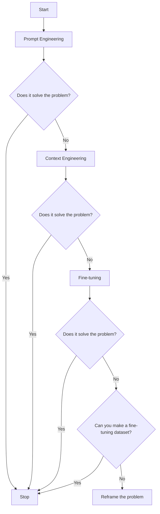
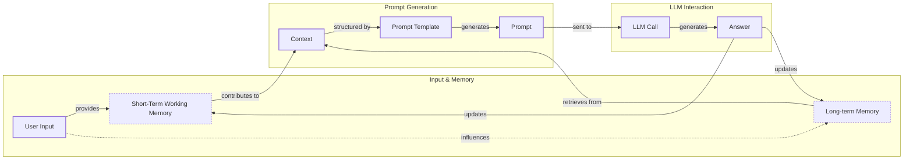
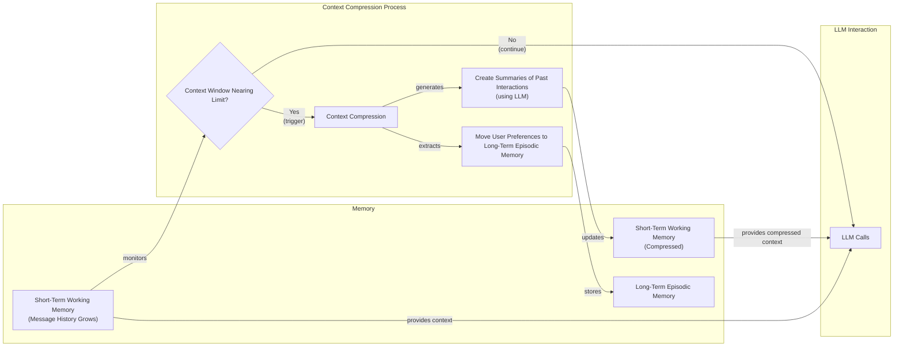

# Lesson 3: Context Engineering

## Introduction: When prompt engineering breaks

AI applications have evolved rapidly. In 2022, we had classic chatbots that operated on predefined scripts and keywords [[26]](https://www.securityindustry.org/2024/07/16/understanding-the-evolution-from-classic-chatbots-to-rag-chatbots-to-ai-powered-assistants/). By 2023, Retrieval-Augmented Generation (RAG) systems emerged, combining search with generative models to connect LLMs to domain-specific knowledge [[26]](https://www.securityindustry.org/2024/07/16/understanding-the-evolution-from-classic-chatbots-to-rag-chatbots-to-ai-powered-assistants/). 2024 brought us tool-using agents that could perform actions and interact with external applications [[27]](https://pagergpt.ai/ai-chatbot/evolution-of-ai-chatbots). Now, we are building memory-enabled agents that remember past interactions and build relationships over time, often by coordinating multiple specialized agents [[30]](https://www.linkedin.com/posts/ai-apps-central_most-people-put-all-ai-systems-in-the-same-activity-7438555783077793792-UEUm).

In our last lesson, we explored how to choose between AI agents and LLM workflows when designing a system. As these applications grow more complex, prompt engineering, a practice that once served us well, is showing its limits. It optimizes single LLM calls but fails when managing systems with memory, actions, and long interaction histories. The sheer volume of information an agent might need has grown exponentially. This includes past conversations, user data, documents, and action descriptions. Simply stuffing all this into a prompt is not a viable strategy.

The discipline of context engineering addresses these challenges by orchestrating this entire information ecosystem to ensure the LLM gets exactly what it needs, when it needs it. This skill is becoming a core foundation for AI engineering, allowing you to build robust applications that are accurate, fast, and cost-effective.

## From prompt to context engineering

Prompt engineering, while effective for simple tasks, is designed for single, stateless interactions. It treats each call to an LLM as a new, isolated event. This approach breaks down in stateful applications where context must be preserved and managed across multiple turns. As a conversation or task progresses, the context grows, leading to several problems.

First, performance degrades due to **context decay**. The model gets confused by the noise of an ever-expanding history and starts to lose track of the original instructions or key information, leading to hallucinations and misguided answers [[23]](https://sombrainc.com/blog/ai-context-engineering-guide).

Second, you face the **context window challenge**. Every model has a finite working memory, and even with massive windows, every token adds to the **cost and latency** of an LLM call. This is because the model's key-value (KV) cache, which stores attention data for past tokens, grows with the context, consuming more GPU memory and slowing down inference [[66]](https://www.digitalocean.com/community/conceptual-articles/bottlenecks-llm-inference-optimization). Simply dumping everything into the context creates a slow, expensive, and underperforming system [[16]](https://www.comet.com/site/blog/context-window/). We will explore these concepts in more detail in upcoming lessons, including memory in Lesson 9 and RAG in Lesson 10.

We learned this the hard way on a recent project. We were working with a model that supported a two-million-token context window, so we thought, "What could go wrong?" We stuffed everything in: our research, guidelines, examples, and user history. The result was an LLM workflow that took 30 minutes to run and produced low-quality outputs.

The solution is context engineering, which shifts the focus from crafting static prompts to building dynamic systems that manage information flow. As an AI engineer, your job is to select only the most critical pieces of context for each LLM call. This makes your applications accurate, fast, and cost-effective [[41]](https://www.decodingai.com/p/context-engineering-2025s-1-skill).

## Understanding context engineering

Context engineering is about finding the best way to arrange parts of your application's memory into the context that is passed to an LLM to get the best results. It is a solution to an optimization problem: retrieving the right parts from both short-term and long-term memory to solve a specific task without overwhelming the model [[22]](https://arxiv.org/pdf/2507.13334). For example, when you ask a cooking agent for a recipe, you do not give it the entire cookbook. Instead, you retrieve the specific recipe, along with personal context like allergies or taste preferences. This precise selection ensures the model receives only essential information.

Andrej Karpathy offered a great analogy for this: LLMs are like a new kind of operating system, where the model acts as the CPU and its context window functions as the RAM [[31]](https://blog.langchain.com/context-engineering-for-agents/). Just as an operating system manages what fits into RAM, context engineering curates what occupies the model’s working memory. This framing elevates context management from a simple workaround to a core engineering discipline, where everything outside the context window—vector stores, documents, conversation history—is like disk storage, requiring an explicit load operation to influence reasoning [[33]](https://atlan.com/know/working-memory-llms/).

So, how does context engineering relate to prompt engineering? It's simple: prompt engineering is a subset of context engineering. You still need to write effective prompts, but you also design a system that feeds the right context into those prompts. This means understanding not just *how* to phrase a task, but *what* information the model needs to perform optimally [[51]](https://www.linkedin.com/posts/denis-panjuta_prompt-engineering-vs-context-engineering-activity-7363945251180322816-1q_m).

| Dimension | Prompt Engineering | Context Engineering |
| --- | --- | --- |
| Scope | Single interaction optimization | Entire information ecosystem |
| State Management | Stateless function | Stateful due to memory |
| Focus | How to phrase tasks | What information to provide |

Table 1: A comparison of prompt engineering and context engineering.

Context engineering is also becoming the new fine-tuning. While fine-tuning has its place, it is expensive, time-consuming, and inflexible. Data changes constantly, making fine-tuning a last resort [[51]](https://www.linkedin.com/posts/denis-panjuta_prompt-engineering-vs-context-engineering-activity-7363945251180322816-1q_m). For most use cases, you get better results faster and more cheaply with context engineering. It allows for rapid iteration and adaptation to evolving data without altering the core model.

When you start a new AI project and need to decide on a strategy to guide the LLM, your decision-making process should follow a simple-to-complex progression, as shown in Image 1. You start with the simplest approach, prompt engineering, and only move to more complex methods like context engineering or fine-tuning if the initial approach fails to solve the problem.


Image 1: Flowchart illustrating the decision-making process for selecting a key strategy (Prompt Engineering, Context Engineering, Fine-tuning) to guide an LLM in a new AI project.

For example, to process internal Slack messages, you do not need to fine-tune a model on your company’s communication style. It is more effective to use a powerful reasoning model and engineer the context to retrieve specific messages and enable actions like creating tasks or drafting emails. Throughout this course, we will show you how to solve most industry problems using only context engineering.

## What makes up the context

To master context engineering, you first need to understand what "context" actually is. It is everything the LLM sees in a single turn, dynamically assembled from various memory components before being passed to the model.

The high-level workflow, as presented in Image 2, begins when user input triggers the system to pull relevant information from both long-term and short-term memory. This information is assembled into the final context, inserted into a prompt template, and sent to the LLM. The LLM’s answer then updates the memory, and the cycle repeats.


Image 2: A flowchart illustrating the high-level workflow of how user input is processed through various memory components to form the context for an LLM call, leading to an LLM call and answer generation, with feedback loops to memory.

These components are grouped into two main categories. We will explain them intuitively for now, as we have future dedicated lessons for all of them.

### Short-Term Working Memory

Short-term working memory is the state of the agent for the current task or conversation. It is volatile and changes with each interaction, helping the agent maintain a coherent dialogue and make immediate decisions. It can include some or all of these components [[31]](https://blog.langchain.com/context-engineering-for-agents/):

-   **User input:** The most recent query or command from the user.
-   **Message history:** The log of the current conversation, allowing the LLM to understand the flow and previous turns. This is often implemented as a conversation buffer that stores recent messages.
-   **Agent's internal thoughts:** The reasoning steps the agent takes to decide on its next action, often kept in a "scratchpad" outside the main context to save space.
-   **Action calls and outputs:** The results from any actions the agent has performed, providing information from external systems. These can be verbose and require careful management.

### Long-Term Memory

Long-term memory is more persistent and stores information across sessions, allowing the AI system to remember things beyond a single conversation. We divide it into three types, drawing parallels from human memory [[38]](https://www.analyticsvidhya.com/blog/2026/01/how-does-llm-memory-work/):

-   **Procedural memory:** This is knowledge encoded directly in the code. It includes the system prompt, which sets the agent's overall behavior and persona. It also includes the definitions of available actions, which tell the agent what it can do, and schemas for structured outputs, which guide the format of its responses. This functions as the agent's built-in skills [[39]](https://skymod.tech/why-memory-matters-in-llm-agents-short-term-vs-long-term-memory-architectures/).
-   **Episodic memory:** This is memory of specific past experiences, like user preferences or previous interactions. It is used to help the agent personalize its responses based on individual users. We typically store this in vector or graph databases for efficient retrieval, allowing the agent to recall specific events or facts from past conversations [[40]](https://labelstud.io/learningcenter/episodic-vs-persistent-memory-in-llms/).
-   **Semantic memory:** This is the agent’s general knowledge base. It can be internal, like company documents stored in a database, or external, accessed via the internet through API calls or web scraping. This memory provides the factual information the agent needs to answer questions and is the core of RAG systems [[37]](https://www.datacamp.com/blog/how-does-llm-memory-work).

Within this framework, it is useful to distinguish between **knowledge context** (facts, documents, user preferences) and **tool context** (action descriptions, API outputs, error messages). The challenge lies in selecting the right knowledge without causing information overload, while providing clear tool context so the agent can act effectively [[67]](https://galileo.ai/blog/context-engineering-for-agents).

<https://substackcdn.com/image/fetch/f_auto,q_auto:good,fl_progressive:steep/https%3A%2F%2Fsubstack-post-media.s3.amazonaws.com%2Fpublic%2Fimages%2F39dce26a-e51e-4167-ac9e-ca28c45b53a6_1115x708.png>
Image 3: A detailed illustration of how all the context engineering components work together inside an AI agent. (Source [Decoding AI Magazine [[41]](https://www.decodingai.com/p/context-engineering-2025s-1-skill)])

If this seems like a lot, bear with us. We will cover all these concepts in-depth in future lessons, including structured outputs in Lesson 4, actions in Lesson 6, memory in Lesson 9, and RAG in Lesson 10. The key takeaway is that these components are not static; they are dynamically re-computed for every interaction. A big part of context engineering is knowing how to pick the right pieces from this vast memory pool to construct the most effective prompt for the task at hand.

## Production implementation challenges

Now that we understand what makes up the context, let's look at the core challenges of implementing it in production. These challenges all revolve around a single question: *"How can I keep my context as small as possible while providing enough information to the LLM?"*

Here are four common issues that come up when building AI applications:

1.  **The context window challenge:** Every AI model has a limited context window, the maximum amount of information (tokens) it can process at once. This is similar to your computer's RAM. If your machine has only 32GB of RAM, that is all it can use at one time. While context windows are getting larger, they are not infinite, and treating them as such leads to other problems [[17]](https://datahub.com/blog/context-window-optimization/). For long-running agents, context from conversation history and tool calls accumulates, quickly approaching these limits [[18]](https://www.getmaxim.ai/articles/context-window-management-strategies-for-long-context-ai-agents-and-chatbots/).
2.  **Information overload:** Just because you can fit a lot of information into the context does not mean you should. Too much context reduces the performance of the LLM by confusing it. This is known as the "lost-in-the-middle" problem, where LLMs exhibit a U-shaped attention pattern. Due to an "attention sink" bias, they recall information best at the beginning and end of the context, while content in the middle is often overlooked [[68]](https://agentpatterns.ai/context-engineering/attention-sinks/), [[56]](https://www.linkedin.com/pulse/lost-middle-lesson-failing-ai-agents-backwards-anthony-dejohn-01k2e), [[58]](https://dev.to/thousand_miles_ai/the-lost-in-the-middle-problem-why-llms-ignore-the-middle-of-your-context-window-3al2). Performance can drop long before the physical context limit is reached.
3.  **Context drift:** This occurs when conflicting views of truth accumulate in the memory over time [[6]](https://galileo.ai/blog/production-llm-monitoring-strategies). For example, the memory might contain two conflicting statements: "My cat is white" and "My cat is black." This is not a quantum physics experiment; it is a data conflict that confuses the LLM and prevents it from knowing what to pick [[7]](https://www.coforge.com/what-we-know/blog/navigating-the-shifting-sands-understanding-and-mitigating-data-drift-in-llms). Without a mechanism to resolve these conflicts, the model's responses become unreliable.
4.  **Tool confusion:** The final challenge is tool confusion, which arises in two main ways. First, adding too many tools to an agent can confuse the LLM about the best one for the job, a problem that often appears with over 100 actions. Second, confusion can occur when tool descriptions are poorly written or overlap. If the distinctions between actions are unclear, even a human would struggle to choose the right one [[41]](https://www.decodingai.com/p/context-engineering-2025s-1-skill). The Gorilla benchmark shows that nearly all models perform worse when given more than one tool.

## Key strategies for context optimization

Initially, most AI applications were chatbots over single knowledge bases. Today, modern AI solutions must manage multiple knowledge bases, tools, and complex conversational histories. Context engineering is about managing this complexity while meeting performance, latency, and cost requirements.

Here are four popular context engineering strategies used across the industry.

### Selecting the right context

Retrieving the right information from memory is a critical first step. This process is analogous to database query optimization, where the goal is to fetch only the required data with minimal overhead. It involves controlling the **breadth** (number of documents) and **depth** (how much of each document) of the retrieved information [[71]](https://www.elastic.co/search-labs/blog/database-retrieval-tools-context-engineering). A common mistake is to provide everything at once, assuming that models with large context windows can handle it. As we have discussed, the "lost-in-the-middle" problem often leads to poor performance, increased latency, and higher costs [[59]](https://atlan.com/know/llm-context-window-limitations/).

To solve this, consider these approaches:
-   **Use structured outputs:** Define clear schemas for what the LLM should return. This allows you to pass only the necessary, structured information to downstream steps. We will cover this in detail in Lesson 4.
-   **Use RAG:** Instead of providing entire documents, use RAG to fetch only the specific chunks of text needed to answer a user's question. This is a core topic we will explore in Lesson 10 [[12]](https://www.dailydoseofds.com/llmops-crash-course-part-8/).
-   **Reduce the number of available tools:** Rather than giving an agent access to every available action, use various strategies to delegate action subsets to specialized components. For example, a typical pattern is to use the orchestrator-worker pattern to delegate subtasks to specialized agents.
-   **Rank time-sensitive data:** For time-sensitive information, rank it by date and filter out anything no longer relevant [[12]](https://www.dailydoseofds.com/llmops-crash-course-part-8/).
-   **Repeat core instructions:** For the most important instructions, repeat them at both the start and the end of the prompt. This uses the model's tendency to pay more attention to the context edges, ensuring core instructions are not lost [[57]](https://promptmetheus.com/resources/llm-knowledge-base/lost-in-the-middle-effect).

```mermaid
flowchart LR
  %% Start of the process
  A["Incoming Request/User Query"]

  %% Context Selection Phase
  subgraph "Context Selection"
    B["Selecting the right context"]
    C["Structured Outputs"]
    D["RAG"]
  end

  %% Context Optimization Phase
  subgraph "Context Optimization Techniques"
    E["Temporal Relevance"]
    F["Context Compression"]
    G["Summarization of past interactions"]
    H["Moving preferences to episodic memory"]
    I["Isolating Context"]
    J["Splitting information across multiple agents/LLM workflows<br/>(Orchestrator-Worker pattern)"]
  end

  %% Core LLM Interaction
  K["LLM Call"]

  %% End of the process
  L["Refined Response"]

  %% Overarching Principle
  M["Repeating core instructions at both the start and the end<br/>(Prompt Construction Principle)"]

  %% Connections
  A -- "initiates" --> B
  B -- "informs" --> E

  C -. "provides" .-> B
  D -. "enhances" .-> B

  E -- "optimizes" --> F
  G -. "part of" .-> F
  H -. "part of" .-> F

  F -- "prepares" --> I
  J -. "achieves" .-> I

  I -- "feeds optimized context" --> K
  M -. "guides" .-> K

  K -- "generates" --> L

  %% Visual grouping
  classDef start_end
  classDef process
  classDef technique
  classDef principle

  class A,L start_end
  class B,E,F,I,K process
  class C,D,G,H,J technique
  class M principle
```
Image 4: A system architecture diagram illustrating context optimization techniques in an AI system.

### Context compression

As message history grows in short-term working memory, you must manage past interactions to keep your context window in check. You cannot simply drop past conversation turns, as the LLM still needs to remember what happened. Instead, you need ways to compress key facts from the past.

You can do this through [[11]](https://oneuptime.com/blog/post/2026-01-30-context-compression/view):
1.  **Creating summaries of past interactions:** Use an LLM to replace a long, detailed history with a concise overview. However, this process is not without risk. Repeated summarization can lead to **summarization drift**, where key details are gradually lost with each compression cycle, causing the agent's memory to no longer match reality [[72]](https://towardsdatascience.com/a-practical-guide-to-memory-for-autonomous-llm-agents/).
2.  **Moving user preferences to long-term memory:** Transfer user preferences from working memory to long-term episodic memory. This keeps the working context clean while ensuring preferences are remembered for future sessions.
3.  **Deduplication:** Use techniques like semantic clustering to identify and remove redundant information from the context, ensuring that every token provides unique value.
4.  **Using reversible compression:** Instead of summarizing, store a pointer to the original information. For example, save a URL instead of the full webpage text, or a file path instead of a log's content. This is a form of lossless compression that avoids information loss while still saving tokens [[73]](https://fp8.co/articles/Context-Engineering-for-AI-Agents).


Image 5: A flowchart detailing the process of context compression within an AI agent's memory management.

### Isolating Context

Another powerful strategy is to isolate context by splitting information across multiple agents or LLM workflows. Instead of one agent with a massive, cluttered context window, you can have a team of agents, each with a smaller, focused context.

We often implement this using an orchestrator-worker pattern, where a central orchestrator agent breaks down a problem and assigns sub-tasks to specialized worker agents. Each worker operates in its own isolated context, improving focus and allowing for parallel processing [[46]](https://beam.ai/agentic-insights/multi-agent-orchestration-patterns-production). This modularity prevents cross-domain hallucinations and can reduce token consumption by 60-70% compared to a monolithic agent [[47]](https://gurusup.com/blog/multi-agent-orchestration-guide). We will cover this pattern in more detail in Lesson 5.

```mermaid
flowchart LR
  %% Initial Task
  CT["Complex Task"]

  %% Orchestrator Agent
  subgraph "Orchestrator"
    OA["Orchestrator Agent"]
    DTS["Decomposes Task<br/>into Subtasks"]
    DS["Delegates Subtasks"]
    AR["Aggregates Results"]
  end

  %% Worker Agents
  subgraph "Worker A"
    WA["Specialized Worker Agent A"]
    CW_A["Own Scoped Context Window"]
  end
  subgraph "Worker B"
    WB["Specialized Worker Agent B"]
    CW_B["Own Scoped Context Window"]
  end
  subgraph "Worker C"
    WC["Specialized Worker Agent C"]
    CW_C["Own Scoped Context Window"]
  end

  %% Final Output
  FR["Final Response"]

  %% Flow
  CT -- "receives" --> OA
  OA -- "triggers" --> DTS
  DTS -- "generates" --> DS
  DS -- "to" --> WA
  DS -- "to" --> WB
  DS -- "to" --> WC

  WA -- "uses" .-> CW_A
  WB -- "uses" .-> CW_B
  WC -- "uses" .-> CW_C

  WA -- "returns" --> OA
  WB -- "returns" --> OA
  WC -- "returns" --> OA

  OA -- "collects" --> AR
  AR -- "produces" --> FR
```
Image 6: An architecture diagram illustrating the Orchestrator-Worker pattern for isolating context in a multi-agent system.

### Format optimization for model clarity

Finally, the way you format the context matters. Models are sensitive to structure, and using clear delimiters can improve performance. Common strategies are to use XML tags to wrap different pieces of context (e.g., `<user_query>`, `<documents>`). This helps the model distinguish between different types of information. Also, when providing structured data as input, YAML is often more token-efficient than JSON, which helps save space in your context window [[41]](https://www.decodingai.com/p/context-engineering-2025s-1-skill).

Ultimately, you must always understand what is passed to the LLM. Seeing exactly what occupies your context window at every step is key to mastering context engineering. This is usually done by properly monitoring your traces, tracking what happens at each step, and understanding the inputs and outputs. As this is a significant step to go from proof-of-concept to production, we will have dedicated lessons on this topic.

## Here is an example

Let's connect the theory with a concrete example. Context engineering is applied to build powerful AI systems in various domains, such as:

-   **Healthcare:** An AI assistant accesses a patient's medical history, current symptoms, and relevant medical literature to suggest personalized diagnoses [[43]](https://www.mdpi.com/2079-9292/13/15/2961). This requires careful handling of sensitive data and ensuring recommendations are grounded in verified medical knowledge.
-   **Financial Services:** An agent might integrate with a company's Customer Relationship Management (CRM) system, calendars, and financial data to make decisions based on user preferences. This allows for personalized advice that considers a client's entire financial picture.
-   **Project Management:** An AI system can access enterprise tools like CRMs, Slack, and task managers to automatically understand project requirements and update tasks. This automates administrative work and keeps projects on track.
-   **Content Creator Assistant:** An AI agent uses your research, past content, and personality traits to understand what and how to create a given piece of content, ensuring brand consistency and saving creative time.

Let's walk through a specific query to see context engineering in action with the healthcare assistant scenario. A user asks: `I have a headache. What can I do to stop it? I would prefer not to take any medicine.`

Before the LLM even sees this query, a context engineering system gets to work [[41]](https://www.decodingai.com/p/context-engineering-2025s-1-skill):

1.  It retrieves the user's patient history, known allergies, and lifestyle habits from an **episodic memory** store. This step ensures the advice is personalized and safe for the individual.
2.  It queries a **semantic memory** of up-to-date medical literature for non-medicinal headache remedies. This grounds the recommendation in factual, reliable information.
3.  It assembles this information, along with the user's query and the conversation history, into a structured prompt. This is where the different pieces of context are carefully ordered and formatted.
4.  The prompt is sent to the LLM, which generates a personalized, safe, and relevant recommendation.
5.  The interaction is logged, and any new preferences are saved back to the user's episodic memory, improving the system for future interactions.

Here’s a simplified Python example showing how these components might be assembled into a complete system prompt. Notice the clear structure and ordering, with XML tags used to delineate different context types.

1.  First, we define the system prompt, which contains the core instructions and rules for the agent. This is a form of procedural memory.

    ```python
    SYSTEM_PROMPT = """
    You are a helpful and cautious AI healthcare assistant. Your goal is to provide safe, non-medicinal advice. Do not provide medical diagnoses.

    <INSTRUCTIONS>
    1. Analyze the user's query and the provided context.
    2. Use the patient history to understand their health profile and preferences.
    3. Use the retrieved medical knowledge to form your recommendation.
    4. If you lack sufficient information, ask clarifying questions.
    5. Always prioritize safety and advise consulting a doctor for serious issues.
    </INSTRUCTIONS>

    <PATIENT_HISTORY>
    {retrieved_patient_history}
    </PATIENT_HISTORY>

    <MEDICAL_KNOWLEDGE>
    {retrieved_medical_articles}
    </MEDICAL_KNOWLEDGE>

    <CONVERSATION_HISTORY>
    {formatted_chat_history}
    </CONVERSATION_HISTORY>

    <USER_QUERY>
    {user_query}
    </USER_QUERY>

    Based on all the information above, provide a helpful response.
    """
    ```

2.  Next, we would have functions to retrieve the patient history (episodic memory), medical articles (semantic memory), and format the chat history (short-term memory). For brevity, we will omit the implementation details of these functions. The key is that a system around the prompt brings in the proper context to populate it.

To build such a system, you need a robust tech stack. Here is a potential stack we recommend and will use throughout this course:

-   **LLM:** Gemini for its multimodal capabilities, reasoning, and cost-effectiveness.
-   **Orchestration:** LangGraph for defining stateful, agentic workflows.
-   **Databases:** PostgreSQL, MongoDB, Redis, Qdrant, and Neo4j. It is often effective to keep it simple, as you can achieve much with only PostgreSQL or MongoDB.
-   **Observability:** Opik or LangSmith for evaluation and trace monitoring.

## Conclusion - Wrap-up: Connecting context engineering to AI engineering

Context engineering combines both art and science. It is about developing the intuition to craft effective prompts, select the right information from memory, and arrange context for optimal results. This discipline helps you determine the minimal yet essential information an LLM needs to perform at its best [[41]](https://www.decodingai.com/p/context-engineering-2025s-1-skill).

In many ways, context engineering is what Enterprise Architects have always done: curating and structuring complex business information for intelligent action [[74]](https://www.ardoq.com/blog/context-engineering-ai). It is fundamentally a knowledge management challenge, requiring you to handle different layers of information: general **world knowledge**, specific **company knowledge** from databases, and undocumented **tribal knowledge** from institutional memory [[75]](https://medium.com/data-agents-dojo/context-engineering-for-system-of-record-agents-why-enterprise-ai-needs-a-different-playbook-6a52a50a92f0). This skill does not exist in a vacuum and sits at the intersection of several key fields:

1.  **AI Engineering:** Understanding LLMs, RAG, and AI agents is the foundation.
2.  **Software Engineering:** You need to build scalable and maintainable systems to aggregate context and wrap agents in robust APIs.
3.  **Data Engineering:** Constructing reliable data pipelines for RAG and other memory systems is critical.
4.  **Operations (Ops):** Deploying agents on the right infrastructure and automating processes with Continuous Integration/Continuous Deployment (CI/CD) pipelines makes them reproducible, observable, and scalable.

Our goal with this course is to teach you how to combine these skills to build production-ready AI products. In the world of AI, we should all think in systems rather than isolated components, having a mindset shift from developers to architects.

In the next lesson, we will explore structured outputs, a key technique for controlling what information comes *out* of an LLM. This is just as important as managing what goes in, and it is a critical step toward building predictable AI systems. We will also continue to build on these ideas in future lessons on actions, memory, and RAG.

## References

- [1] Context Rot: How Increasing Input Tokens Impacts LLM Performance. [https://www.trychroma.com/research/context-rot](https://www.trychroma.com/research/context-rot)
- [2] What modifications might be needed to the LLM's input formatting or architecture to best take advantage of retrieved documents. [https://milvus.io/ai-quick-reference/what-modifications-might-be-needed-to-the-llms-input-formatting-or-architecture-to-best-take-advantage-of-retrieved-documents-for-example-adding-special-tokens-or-segments-to-separate-context](https://milvus.io/ai-quick-reference/what-modifications-might-be-needed-to-the-llms-input-formatting-or-architecture-to-best-take-advantage-of-retrieved-documents-for-example-adding-special-tokens-or-segments-to-separate-context)
- [3] Lost in the middle, and In-Between: Enhancing language models' ability to reason over long contexts in Multi-Hop QA. [https://openreview.net/forum?id=5sB6cSblDR](https://openreview.net/forum?id=5sB6cSblDR)
- [4] Four design patterns for Event-Driven, Multi-Agent systems. [https://www.confluent.io/blog/event-driven-multi-agent-systems/](https://www.confluent.io/blog/event-driven-multi-agent-systems/)
- [5] BAPO-Hard Problems: The Working Memory Limits of Large Language Models. [https://towardsdatascience.com/your-1m-context-window-llm-is-less-powerful-than-you-think-5a557b25ad3c](https://towardsdatascience.com/your-1m-context-window-llm-is-less-powerful-than-you-think-5a557b25ad3c)
- [6] Production LLM Monitoring Strategies. [https://galileo.ai/blog/production-llm-monitoring-strategies](https://galileo.ai/blog/production-llm-monitoring-strategies)
- [7] Navigating the Shifting Sands: Understanding and Mitigating Data Drift in LLMs. [https://www.coforge.com/what-we-know/blog/navigating-the-shifting-sands-understanding-and-mitigating-data-drift-in-llms](https://www.coforge.com/what-we-know/blog/navigating-the-shifting-sands-understanding-and-mitigating-data-drift-in-llms)
- [8] Context Rot: The Silent Killer of Enterprise AI LLMs. [https://thenewstack.io/context-rot-enterprise-ai-llms/](https://thenewstack.io/context-rot-enterprise-ai-llms/)
- [9] The Hidden Cost of LLM Drift and How to Detect It Early. [https://insightfinder.com/blog/hidden-cost-llm-drift-detection/](https://insightfinder.com/blog/hidden-cost-llm-drift-detection/)
- [10] How to Reduce LLM Hallucination. [https://www.helicone.ai/blog/how-to-reduce-llm-hallucination](https://www.helicone.ai/blog/how-to-reduce-llm-hallucination)
- [11] Context Compression in LLM Applications. [https://oneuptime.com/blog/post/2026-01-30-context-compression/view](https://oneuptime.com/blog/post/2026-01-30-context-compression/view)
- [12] LLMOps Crash Course Part 8: Memory and Temporal Context. [https://www.dailydoseofds.com/llmops-crash-course-part-8/](https://www.dailydoseofds.com/llmops-crash-course-part-8/)
- [13] Context Compression via Item Description Summarization for SLM Relevance Ranking. [https://arxiv.org/html/2510.22101v1](https://arxiv.org/html/2510.22101v1)
- [14] Cutting Through the Noise: Smarter Context Management for LLM-Powered Agents. [https://blog.jetbrains.com/research/2025/12/efficient-context-management/](https://blog.jetbrains.com/research/2025/12/efficient-context-management/)
- [15] The LLM Context Window: Limitations and Solutions. [https://atlan.com/know/llm-context-window-limitations/](https://atlan.com/know/llm-context-window-limitations/)
- [16] Context Window: What It Is and Why It Matters for AI Agents. [https://www.comet.com/site/blog/context-window/](https://www.comet.com/site/blog/context-window/)
- [17] Context Window Optimization. [https://datahub.com/blog/context-window-optimization/](https://datahub.com/blog/context-window-optimization/)
- [18] Context Window Management Strategies for Long-Context AI Agents and Chatbots. [https://www.getmaxim.ai/articles/context-window-management-strategies-for-long-context-ai-agents-and-chatbots/](https://www.getmaxim.ai/articles/context-window-management-strategies-for-long-context-ai-agents-and-chatbots/)
- [19] Your LLM hits the token limit. [https://www.linkedin.com/posts/aditya-santhanam_your-llm-hits-the-token-limit-conversation-activity-7425863566190260224-Pz6v](https://www.linkedin.com/posts/aditya-santhanam_your-llm-hits-the-token-limit-conversation-activity-7425863566190260224-Pz6v)
- [20] Efficient Context Management for LLM Agents. [https://blog.jetbrains.com/research/2025/12/efficient-context-management/](https://blog.jetbrains.com/research/2025/12/efficient-context-management/)
- [21] ContextOps: The DevOps for AI-Generated Code. [https://packmind.com/context-engineering-ai-coding/what-is-contextops/](https://packmind.com/context-engineering-ai-coding/what-is-contextops/)
- [22] A survey of context engineering for large language models. [https://arxiv.org/pdf/2507.13334](https://arxiv.org/pdf/2507.13334)
- [23] AI Context Engineering: A Comprehensive Guide. [https://sombrainc.com/blog/ai-context-engineering-guide](https://sombrainc.com/blog/ai-context-engineering-guide)
- [24] Context Engineering for Observability: How to Deliver the Right Data to LLMs. [https://www.mezmo.com/learn-observability/context-engineering-for-observability-how-to-deliver-the-right-data-to-llms](https://www.mezmo.com/learn-observability/context-engineering-for-observability-how-to-deliver-the-right-data-to-llms)
- [25] Context Engineering for AI: The Foundation of Reliable, High-Performing Models. [https://www.glean.com/blog/context-engineering-ai-the-foundation-of-reliable-high-performing-models](https://www.glean.com/blog/context-engineering-ai-the-foundation-of-reliable-high-performing-models)
- [26] Understanding the Evolution: From Classic Chatbots to RAG Chatbots to AI-Powered Assistants. [https://www.securityindustry.org/2024/07/16/understanding-the-evolution-from-classic-chatbots-to-rag-chatbots-to-ai-powered-assistants/](https://www.securityindustry.org/2024/07/16/understanding-the-evolution-from-classic-chatbots-to-rag-chatbots-to-ai-powered-assistants/)
- [27] The Evolution of AI Chatbots: From Generative AI to Autonomous Agents. [https://pagergpt.ai/ai-chatbot/evolution-of-ai-chatbots](https://pagergpt.ai/ai-chatbot/evolution-of-ai-chatbots)
- [28] Context Engineering Platforms: A Comparative Guide. [https://atlan.com/know/context-engineering-platforms-comparison/](https://atlan.com/know/context-engineering-platforms-comparison/)
- [29] When Did AI Chatbots Start? A History. [https://www.dante-ai.com/news/when-did-ai-chatbots-start](https://www.dante-ai.com/news/when-did-ai-chatbots-start)
- [30] Most people put all AI systems in the same bucket. [https://www.linkedin.com/posts/ai-apps-central_most-people-put-all-ai-systems-in-the-same-activity-7438555783077793792-UEUm](https://www.linkedin.com/posts/ai-apps-central_most-people-put-all-ai-systems-in-the-same-activity-7438555783077793792-UEUm)
- [31] Context Engineering for Agents. [https://blog.langchain.com/context-engineering-for-agents/](https://blog.langchain.com/context-engineering-for-agents/)
- [32] Context Engineering vs. Prompt Engineering: Key Differences Explained. [https://www.glean.com/perspectives/context-engineering-vs-prompt-engineering-key-differences-explained](https://www.glean.com/perspectives/context-engineering-vs-prompt-engineering-key-differences-explained)
- [33] Working Memory in LLMs: The Context Window as Cognitive Architecture. [https://atlan.com/know/working-memory-llms/](https://atlan.com/know/working-memory-llms/)
- [34] From Vibe Coding to Context Engineering: A Blueprint for Production-Grade GenAI Systems. [https://www.sundeepteki.org/blog/from-vibe-coding-to-context-engineering-a-blueprint-for-production-grade-genai-systems](https://www.sundeepteki.org/blog/from-vibe-coding-to-context-engineering-a-blueprint-for-production-grade-genai-systems)
- [35] Context Engineering: The Silent Architecture Behind Every AI Agent. [https://www.linkedin.com/pulse/context-engineering-silent-architecture-behind-every-ai-roychowdhury-lzcec](https://www.linkedin.com/pulse/context-engineering-silent-architecture-behind-every-ai-roychowdhury-lzcec)
- [36] Working Memory in LLMs: Context Window Deep Dive. [https://atlan.com/know/working-memory-llms/](https://atlan.com/know/working-memory-llms/)
- [37] How Does LLM Memory Work? [https://www.datacamp.com/blog/how-does-llm-memory-work](https://www.datacamp.com/blog/how-does-llm-memory-work)
- [38] How Does LLM Memory Work? [https://www.analyticsvidhya.com/blog/2026/01/how-does-llm-memory-work/](https://www.analyticsvidhya.com/blog/2026/01/how-does-llm-memory-work/)
- [39] Why Memory Matters in LLM Agents: Short-Term vs. Long-Term Memory Architectures. [https://skymod.tech/why-memory-matters-in-llm-agents-short-term-vs-long-term-memory-architectures/](https://skymod.tech/why-memory-matters-in-llm-agents-short-term-vs-long-term-memory-architectures/)
- [40] Episodic vs. Persistent Memory in LLMs. [https://labelstud.io/learningcenter/episodic-vs-persistent-memory-in-llms/](https://labelstud.io/learningcenter/episodic-vs-persistent-memory-in-llms/)
- [41] Context Engineering: 2025’s #1 Skill in AI. [https://www.decodingai.com/p/context-engineering-2025s-1-skill](https://www.decodingai.com/p/context-engineering-2025s-1-skill)
- [42] Context Engineering in AI. [https://www.codecademy.com/article/context-engineering-in-ai](https://www.codecademy.com/article/context-engineering-in-ai)
- [43] Prompt Engineering in Healthcare. [https://www.mdpi.com/2079-9292/13/15/2961](https://www.mdpi.com/2079-9292/13/15/2961)
- [44] Effective Context Engineering for AI Agents. [https://www.anthropic.com/engineering/effective-context-engineering-for-ai-agents](https://www.anthropic.com/engineering/effective-context-engineering-for-ai-agents)
- [45] Why AI coding assistants fail without context: an introduction to ContextOps. [https://packmind.com/context-engineering-ai-coding/what-is-contextops/](https://packmind.com/context-engineering-ai-coding/what-is-contextops/)
- [46] Multi-Agent Orchestration Patterns for Production. [https://beam.ai/agentic-insights/multi-agent-orchestration-patterns-production](https://beam.ai/agentic-insights/multi-agent-orchestration-patterns-production)
- [47] Multi-Agent Orchestration Guide. [https://gurusup.com/blog/multi-agent-orchestration-guide](https://gurusup.com/blog/multi-agent-orchestration-guide)
- [48] Multi-Agent Systems: Building with Context Engineering. [https://www.vellum.ai/blog/multi-agent-systems-building-with-context-engineering](https://www.vellum.ai/blog/multi-agent-systems-building-with-context-engineering)
- [49] Deterministic AI Orchestration: A Platform Architecture for Autonomous Development. [https://www.praetorian.com/blog/deterministic-ai-orchestration-a-platform-architecture-for-autonomous-development/](https://www.praetorian.com/blog/deterministic-ai-orchestration-a-platform-architecture-for-autonomous-development/)
- [50] Specialized Agents. [https://arxiv.org/html/2601.13671v1](https://arxiv.org/html/2601.13671v1)
- [51] Prompt Engineering vs. Context Engineering. [https://www.linkedin.com/posts/denis-panjuta_prompt-engineering-vs-context-engineering-activity-7363945251180322816-1q_m](https://www.linkedin.com/posts/denis-panjuta_prompt-engineering-vs-context-engineering-activity-7363945251180322816-1q_m)
- [52] Prompt Engineering vs. Context Engineering. [https://memgraph.com/blog/prompt-engineering-vs-context-engineering](https://memgraph.com/blog/prompt-engineering-vs-context-engineering)
- [53] Context Engineering for Observability. [https://www.mezmo.com/learn-observability/context-engineering-for-observability-how-to-deliver-the-right-data-to-llms](https://www.mezmo.com/learn-observability/context-engineering-for-observability-how-to-deliver-the-right-data-to-llms)
- [54] Context Engineering. [https://www.instinctools.com/blog/context-engineering/](https://www.instinctools.com/blog/context-engineering/)
- [55] Agentic AI: Context Engineering vs. Prompt Engineering. [https://neo4j.com/blog/agentic-ai/context-engineering-vs-prompt-engineering/](https://neo4j.com/blog/agentic-ai/context-engineering-vs-prompt-engineering/)
- [56] Lost in the Middle: A Lesson on Failing AI Agents (and How to Fix Them Backwards). [https://www.linkedin.com/pulse/lost-middle-lesson-failing-ai-agents-backwards-anthony-dejohn-01k2e](https://www.linkedin.com/pulse/lost-middle-lesson-failing-ai-agents-backwards-anthony-dejohn-01k2e)
- [57] Lost-in-the-Middle Effect. [https://promptmetheus.com/resources/llm-knowledge-base/lost-in-the-middle-effect](https://promptmetheus.com/resources/llm-knowledge-base/lost-in-the-middle-effect)
- [58] The Lost in the Middle Problem: Why LLMs Ignore the Middle of Your Context Window. [https://dev.to/thousand_miles_ai/the-lost-in-the-middle-problem-why-llms-ignore-the-middle-of-your-context-window-3al2](https://dev.to/thousand_miles_ai/the-lost-in-the-middle-problem-why-llms-ignore-the-middle-of-your-context-window-3al2)
- [59] LLM Context Window Limitations. [https://atlan.com/know/llm-context-window-limitations/](https://atlan.com/know/llm-context-window-limitations/)
- [60] Needle in a Haystack: Optimizing Retrieval and RAG over Long Context Windows. [https://bigdataboutique.com/blog/needle-in-haystack-optimizing-retrieval-and-rag-over-long-context-windows-5dfb3c](https://bigdataboutique.com/blog/needle-in-haystack-optimizing-retrieval-and-rag-over-long-context-windows-5dfb3c)
- [61] Context Engineering in AI. [https://www.codecademy.com/article/context-engineering-in-ai](https://www.codecademy.com/article/context-engineering-in-ai)
- [62] Context Engineering in LLMs and AI Agents. [https://blog.stackademic.com/context-engineering-in-llms-and-ai-agents-eb861f0d3e9b](https://blog.stackademic.com/context-engineering-in-llms-and-ai-agents-eb861f0d3e9b)
- [63] How to Implement Context Engineering. [https://packmind.com/context-engineering-ai-coding/how-to-implement-context-engineering/](https://packmind.com/context-engineering-ai-coding/how-to-implement-context-engineering/)
- [64] Context Engineering Platforms Comparison. [https://atlan.com/know/context-engineering-platforms-comparison/](https://atlan.com/know/context-engineering-platforms-comparison/)
- [65] LangGraph. [https://www.scalablepath.com/machine-learning/langgraph](https://www.scalablepath.com/machine-learning/langgraph)
- [66] Bottlenecks in LLM Inference and How to Optimize Them. [https://www.digitalocean.com/community/conceptual-articles/bottlenecks-llm-inference-optimization](https://www.digitalocean.com/community/conceptual-articles/bottlenecks-llm-inference-optimization)
- [67] Context Engineering for Agents. [https://galileo.ai/blog/context-engineering-for-agents](https://galileo.ai/blog/context-engineering-for-agents)
- [68] Attention Sinks. [https://agentpatterns.ai/context-engineering/attention-sinks/](https://agentpatterns.ai/context-engineering/attention-sinks/)
- [69] Why Multi-Agent Systems Need Memory Engineering. [https://www.mongodb.com/company/blog/technical/why-multi-agent-systems-need-memory-engineering](https://www.mongodb.com/company/blog/technical/why-multi-agent-systems-need-memory-engineering)
- [70] Why Multi-Agent Systems Fail in Production (and How to Fix Them). [https://galileo.ai/blog/why-multi-agent-systems-fail](https://galileo.ai/blog/why-multi-agent-systems-fail)
- [71] Database Retrieval Tools: Context Engineering for LLM Agents. [https://www.elastic.co/search-labs/blog/database-retrieval-tools-context-engineering](https://www.elastic.co/search-labs/blog/database-retrieval-tools-context-engineering)
- [72] A Practical Guide to Memory for Autonomous LLM Agents. [https://towardsdatascience.com/a-practical-guide-to-memory-for-autonomous-llm-agents/](https://towardsdatascience.com/a-practical-guide-to-memory-for-autonomous-llm-agents/)
- [73] Context Engineering for AI Agents. [https://fp8.co/articles/Context-Engineering-for-AI-Agents](https://fp8.co/articles/Context-Engineering-for-AI-Agents)
- [74] Context Engineering is What Enterprise Architects Have Always Done. [https://www.ardoq.com/blog/context-engineering-ai](https://www.ardoq.com/blog/context-engineering-ai)
- [75] Context Engineering for System of Record Agents: Why Enterprise AI Needs a Different Playbook. [https://medium.com/data-agents-dojo/context-engineering-for-system-of-record-agents-why-enterprise-ai-needs-a-different-playbook-6a52a50a92f0](https://medium.com/data-agents-dojo/context-engineering-for-system-of-record-agents-why-enterprise-ai-needs-a-different-playbook-6a52a50a92f0)