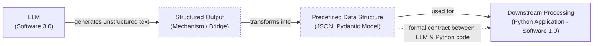

# Lesson 4: Structured Outputs

In our previous lessons, we laid the groundwork for AI Engineering. We explored the AI agent landscape, looked at the difference between rule-based LLM workflows and autonomous AI agents, and covered context engineering: the art of feeding the right information to an LLM. In this lesson, we will tackle a fundamental challenge: getting structured and reliable information *out* of an LLM.

LLMs operate in a world of unstructured data and probabilities, where we input instructions in plain English and get results as plain text. This subdomain of engineering is often called "Software 3.0". Our applications, however, rely on deterministic code and predictable data structures, which is known as "Software 1.0". Structured outputs are the bridge between these two worlds, a fundamental technique for forcing LLMs to return consistent, machine-readable data. Mastering this is essential for any AI engineer building production-grade systems.

## Understanding why structured outputs are critical

Before we start coding, it is important to understand why structured outputs are foundational to building reliable AI applications. When an LLM returns a free-form string, you face the messy task of parsing it. This often involves fragile regular expressions or string-splitting logic that can easily break if the model changes its phrasing even slightly. If there is one phrasing change, one missing comma, or an unexpected newline, everything breaks. This is not a scalable way to build production AI systems. Structured outputs solve this by forcing the model’s response into a predictable format like JSON, eliminating the need for fragile, after-the-fact parsing [[1]](https://pmc.ncbi.nlm.nih.gov/articles/PMC11751965/), [[2]](https://arxiv.org/html/2506.21585v1), [[3]](https://www.linkedin.com/posts/pauliusztin_if-you-use-regex-and-string-splits-to-parse-activity-7386740617294282752-QHgP).

This approach offers several key benefits. First, structured outputs are easy to parse and manipulate. Instead of wrestling with raw text, you work with clean Python objects like dictionaries or, even better, Pydantic models. This makes your code more predictable and easier to debug. Second, using libraries like Pydantic adds a layer of data and type validation. If the LLM returns a string where an integer is expected, your application raises a clear validation error immediately, preventing bad data from propagating. This "fail-fast" behavior is essential for building reliable systems, as it catches inconsistencies early and makes your entire workflow more debuggable and safe for production. By confining the model to a specific format, you also minimize the risk of including irrelevant or inconsistent information, leading to more reliable results [[4]](https://www.speakeasy.com/blog/pydantic-vs-dataclasses), [[5]](https://codetain.com/blog/validators-approach-in-python-pydantic-vs-dataclasses/).

Structured outputs create a formal contract between the LLM and your application code, making it easier to pass data around the system. This machine-readability is a key advantage; while humans can interpret free-form text, computers work much better with structured data. Engineers use this pattern everywhere. We leverage structured outputs to pass the right subset of information to the next LLM step or other downstream systems like databases, user interfaces, or APIs. For example, a popular use case is to extract properties like names, tags, and dates to build knowledge graphs for advanced information retrieval systems or to create natural language filters for querying databases. This control also reduces costs by ensuring the LLM generates only the necessary data without useless artifacts, which reduces the number of output tokens [[6]](https://www.decodingai.com/p/llm-structured-outputs-the-only-way), [[7]](https://www.prompts.ai/en/blog-details/automating-knowledge-graphs-with-llm-outputs), [[8]](https://humanloop.com/blog/structured-outputs).


Image 1: Flowchart illustrating the process of formatting LLM output into a predefined data structure for downstream processing, highlighting the role of structured outputs as a formal contract.

To understand how this works in practice, we will explore three implementation methods: from scratch using JSON, from scratch using Pydantic, and natively with the Gemini API.

## Implementing structured outputs from scratch using JSON

To build an intuition of what modern LLM APIs offer, we will first implement structured outputs from scratch by guiding an LLM to generate a JSON object. Our goal is to prompt the model to return a JSON and then parse it into a Python dictionary. We will demonstrate this by extracting key details from a financial document.

<aside>
💡

You can find the code of this lesson in the notebook of Lesson 4, in the GitHub repository of the course.

</aside>

1.  We begin by setting up our environment. This involves initializing the Gemini client and defining the model we will use. For our examples, we will use `gemini-3.5-flash`, which is fast and cost-effective. While `pro` models are bigger and more costly, they are more useful for intensive reasoning tasks.
    ```python
    import json
    
    from google import genai
    from utils import env
    
    env.load(required_env_vars=["GOOGLE_API_KEY"])
    
    client = genai.Client()
    
    MODEL_ID = "gemini-3.5-flash"
    ```

2.  Next, we define a sample financial document for analysis. This will serve as the unstructured text from which we want to extract information.
    ```python
    DOCUMENT = """
    # Q3 2023 Financial Performance Analysis
    
    The Q3 earnings report shows a 20% increase in revenue and a 15% growth in user engagement, 
    beating market expectations. These impressive results reflect our successful product strategy 
    and strong market positioning.
    
    Our core business segments demonstrated remarkable resilience, with digital services leading 
    the growth at 25% year-over-year. The expansion into new markets has proven particularly 
    successful, contributing to 30% of the total revenue increase.
    
    Customer acquisition costs decreased by 10% while retention rates improved to 92%, 
    marking our best performance to date. These metrics, combined with our healthy cash flow 
    position, provide a strong foundation for continued growth into Q4 and beyond.
    """
    ```

3.  We craft a prompt that instructs the LLM to extract metadata and format it as JSON. This prompt engineering technique is effective because it provides a clear, concrete example. The use of XML tags like `<document>` and `<json>` helps the model distinguish between the input data and the instructional formatting, a best practice for guiding model output. However, even with a well-crafted prompt, you are still relying on the model's ability to follow instructions perfectly, which is not guaranteed [[9]](https://aws.amazon.com/blogs/machine-learning/structured-data-response-with-amazon-bedrock-prompt-engineering-and-tool-use/), [[10]](https://help.openai.com/en/articles/6654000-best-practices-for-prompt-engineering-with-the-openai-api).
    ```python
    prompt = f"""
    Analyze the following document and extract metadata from it. 
    The output must be a single, valid JSON object with the following structure:
    <json>
    {{ 
        "summary": "A concise summary of the article.", 
        "tags": ["list", "of", "relevant", "tags"], 
        "keywords": ["list", "of", "key", "concepts"],
        "quarter": "Q...",
        "growth_rate": "...%",
    }}
    </json>
    
    Here is the document:
    <document>
    {DOCUMENT}
    </document>
    """
    ```

4.  We send the prompt to the model and inspect the raw response. As expected, the model returns a JSON object, but it is often wrapped in Markdown code blocks, a common artifact when requesting structured data.
    ```python
    response = client.models.generate_content(model=MODEL_ID, contents=prompt)
    ```
    It outputs:
    ```
    ```json
    { 
        "summary": "The Q3 2023 financial report highlights a strong performance with a 20% increase in revenue and 15% growth in user engagement, surpassing market expectations. This success is attributed to a robust product strategy, effective market positioning, and successful expansion into new markets, leading to improved customer retention and reduced acquisition costs.",
        "tags": [
            "financials",
            "earnings report",
            "business performance",
            "revenue growth",
            "market expansion",
            "Q3 2023"
        ],
        "keywords": [
            "Q3 2023",
            "revenue",
            "user engagement",
            "market expectations",
            "product strategy",
            "market positioning",
            "digital services",
            "new markets",
            "customer acquisition costs",
            "retention rates",
            "cash flow"
        ],
        "quarter": "Q3 2023",
        "growth_rate": "20%"
    }
    ```
    ```

5.  To handle this, we create a helper function to strip the Markdown tags, leaving a clean JSON string that can be safely parsed.
    ```python
    def extract_json_from_response(response: str) -> dict:
        """
        Extracts JSON from a response string that is wrapped in <json> or ```json tags.
        """
    
        response = response.replace("<json>", "").replace("</json>", "")
        response = response.replace("```json", "").replace("```", "")
    
        return json.loads(response)
    ```
    While this function handles the common case of Markdown fences, production systems need to be more robust. LLMs can sometimes add explanatory text, disclaimers, or other conversational fluff outside the expected format. A more resilient approach uses regular expressions to find the first valid JSON object within the response string, combined with a `try-except` block to gracefully handle `json.JSONDecodeError` if parsing fails. This prevents your application from crashing due to minor formatting inconsistencies [[11]](https://python.plainenglish.io/getting-structured-json-responses-from-llms-a-simple-solution-f819fc389ebc), [[12]](https://machinelearningmastery.com/the-complete-guide-to-using-pydantic-for-validating-llm-outputs).

6.  Finally, we parse the string into a Python dictionary. We now have a structured Python dictionary, which is a significant improvement over raw text, as we can access data programmatically using keys like `parsed_response['summary']`. However, this manual method still has limitations. It relies on post-processing and lacks any form of data validation. If the LLM makes a mistake—like outputting a string instead of a list for `tags`, or omitting the `growth_rate` key entirely—our application will fail with a `TypeError` or `KeyError` at runtime. This fragility is why we need a more robust solution, which we will explore next with Pydantic.
    ```python
    parsed_response = extract_json_from_response(response.text)
    ```
    It outputs:
    ```json
    {
      "summary": "The Q3 2023 financial report highlights a strong performance with a 20% increase in revenue and 15% growth in user engagement, surpassing market expectations. This success is attributed to a robust product strategy, effective market positioning, and successful expansion into new markets, leading to improved customer retention and reduced acquisition costs.",
      "tags": [
        "financials",
        "earnings report",
        "business performance",
        "revenue growth",
        "market expansion",
        "Q3 2023"
      ],
      "keywords": [
        "Q3 2023",
        "revenue",
        "user engagement",
        "market expectations",
        "product strategy",
        "market positioning",
        "digital services",
        "new markets",
        "customer acquisition costs",
        "retention rates",
        "cash flow"
      ],
      "quarter": "Q3 2023",
      "growth_rate": "20%"
    }
    ```

## Implementing structured outputs from scratch using Pydantic

Forcing JSON output is an improvement, but it still leaves you with a plain Python dictionary. You cannot be sure what is inside it, whether the keys are correct, or if the values have the right type. This uncertainty can lead to bugs and make your code difficult to maintain.

Pydantic solves this problem. It is a data validation library that enforces structure and type hints at runtime, ensuring data integrity from the moment it enters your application [[4]](https://www.speakeasy.com/blog/pydantic-vs-dataclasses). It provides a single, clear definition for your data structure and can automatically generate a JSON Schema from your Python class. When an LLM produces output that does not match your Pydantic model, the library raises a `ValidationError` that clearly explains what went wrong. This “fail-fast” behavior is essential for building reliable systems, preventing bad data from causing hard-to-debug errors later.

Let's refactor our previous example to use Pydantic.

1.  We define our desired data structure as a Pydantic class. Pydantic works with Python’s `typing` module, but since Python 3.10 (and more commonly adopted in 3.11+), you can use built-in types like `list` directly. For example, `tags: list[str]` is now preferred over importing `List` from `typing`.
    ```python
    from pydantic import BaseModel, Field
    
    class DocumentMetadata(BaseModel):
        """A class to hold structured metadata for a document."""
    
        summary: str = Field(description="A concise, 1-2 sentence summary of the document.")
        tags: list[str] = Field(description="A list of 3-5 high-level tags relevant to the document.")
        keywords: list[str] = Field(description="A list of specific keywords or concepts mentioned.")
        quarter: str = Field(description="The quarter of the financial year described in the document (e.g, Q3 2023).")
        growth_rate: str = Field(description="The growth rate of the company described in the document (e.g, 10%).")
    ```
    You can also nest Pydantic models to represent more complex, hierarchical data. This allows you to define intricate relationships between different pieces of information. However, it is good practice to keep schemas as simple as possible, as complex nested structures can confuse the LLM and lead to validation failures from syntax errors, incorrect delimiters, or unescaped characters [[13]](https://dev.to/klement_gunndu/stop-parsing-json-by-hand-structured-llm-outputs-with-pydantic-1pg0).
    ```python
    class Summary(BaseModel):
        text: str
        sentiment: float
    
    class Tag(BaseModel):
        label: str
        relevance: float
    
    class ComplexDocumentMetadata(BaseModel):
        summary: Summary
        tags: list[Tag]
    ```

2.  With our Pydantic model defined, we can automatically generate a JSON Schema from it. A **schema** is the standard term for defining the structure and constraints of your data. Think of it as a formal **contract** between your application and the LLM. This contract dictates the expected fields, their types, and any validation rules. This is similar to the technique used internally by APIs like Gemini and OpenAI to enforce a specific output format. These internal techniques often rely on grammar-based decoding. Instead of letting the model generate tokens freely, they constrain the generation process at each step, allowing only tokens that conform to the specified schema. This is sometimes implemented using formalisms like Context-Free Grammars (CFGs) or Finite State Machines (FSMs), providing a mathematical guarantee that the output will be syntactically correct [[14]](https://ai.google.dev/gemini-api/docs/structured-output), [[15]](https://tetrate.io/learn/ai/llm-output-parsing-structured-generation), [[16]](https://humanloop.com/blog/structured-outputs).
    ```python
    schema = DocumentMetadata.model_json_schema()
    ```
    The generated schema is detailed and includes descriptions from the `Field` definitions to guide the generation process.
    ```json
    {
        "description": "A class to hold structured metadata for a document.",
        "properties": {
            "summary": {
                "description": "A concise, 1-2 sentence summary of the document.",
                "title": "Summary",
                "type": "string"
            },
            "tags": {
                "description": "A list of 3-5 high-level tags relevant to the document.",
                "items": {"type": "string"},
                "title": "Tags",
                "type": "array"
            },
            "keywords": {
                "description": "A list of specific keywords or concepts mentioned.",
                "items": {"type": "string"},
                "title": "Keywords",
                "type": "array"
            },
            "quarter": {
                "description": "The quarter of the financial year described in the document (e.g, Q3 2023).",
                "title": "Quarter",
                "type": "string"
            },
            "growth_rate": {
                "description": "The growth rate of the company described in the document (e.g, 10%).",
                "title": "Growth Rate",
                "type": "string"
            }
        },
        "required": ["summary", "tags", "keywords", "quarter", "growth_rate"],
        "title": "DocumentMetadata",
        "type": "object"
    }
    ```

3.  We update our prompt to include this JSON Schema, giving the model a more precise set of instructions.
    ```python
    prompt = f"""
    Please analyze the following document and extract metadata from it. 
    The output must be a single, valid JSON object that conforms to the following JSON Schema:
    <json>
    {json.dumps(schema, indent=2)}
    </json>
    
    Here is the document:
    <document>
    {DOCUMENT}
    </document>
    """
    ```

4.  We call the model and extract the JSON string as before.
    ```python
    response = client.models.generate_content(model=MODEL_ID, contents=prompt)
    parsed_response = extract_json_from_response(response.text)
    ```
    It outputs:
    ```json
    {
      "summary": "The Q3 2023 earnings report indicates strong financial performance with a 20% increase in revenue and 15% growth in user engagement, driven by successful product strategy, market expansion, and improved customer retention.",
      "tags": [
        "Financial Performance",
        "Earnings Report",
        "Business Growth",
        "Market Expansion",
        "Customer Metrics"
      ],
      "keywords": [
        "Q3 2023",
        "revenue increase",
        "user engagement",
        "digital services",
        "new markets",
        "customer acquisition costs",
        "retention rates",
        "cash flow"
      ],
      "quarter": "Q3 2023",
      "growth_rate": "20%"
    }
    ```

5.  But now, the biggest difference, is that we can load the output dictionary into our Pydantic model and validate it.
    ```python
    try:
        document_metadata = DocumentMetadata.model_validate(parsed_response)
        print("\nValidation successful!")
    except Exception as e:
        print(f"\nValidation failed: {e}")
    ```
    It outputs:
    ```
    Validation successful!
    ```
    The `document_metadata` Pydantic object can now be safely used throughout your application. This is the main advantage: you move from unclear dictionaries to clean, predictable Python objects. If the LLM had returned an incorrect type, like an integer for `growth_rate`, Pydantic would have raised a `ValidationError`. In a production system, a common pattern is to catch this error, feed the message back to the LLM, and ask it to correct its output, making the system more resilient [[12]](https://machinelearningmastery.com/the-complete-guide-to-using-pydantic-for-validating-llm-outputs).

While Python’s built-in `dataclasses` or `TypedDict` can define structure, they only provide type hints for static analysis and do not perform runtime validation [[4]](https://www.speakeasy.com/blog/pydantic-vs-dataclasses), [[5]](https://codetain.com/blog/validators-approach-in-python-pydantic-vs-dataclasses/). If the LLM returns a string where an integer is expected, these tools will not catch the error. `TypedDict` is best for lightweight type hints during development, especially for data from external JSON contracts, but offers no runtime protection. `Dataclasses` are fast and great for internal data models where data is trusted, but they also lack validation. Pydantic's strength is this runtime enforcement, which is critical when dealing with unpredictable LLM outputs, making it the superior choice for API boundaries and handling untrusted data [[19]](https://dev.to/hevalhazalkurt/dataclasses-vs-pydantic-vs-typeddict-vs-namedtuple-in-python-41gg), [[20]](https://www.packetcoders.io/typeddict-vs-pydantic).

## Implementing structured outputs using Gemini and Pydantic

While the "from scratch" method provides a great understanding of the underlying mechanics, it's not the recommended approach for production systems when a native API feature is available. When working with modern APIs such as Gemini and OpenAI, the recommended way to generate structured outputs is by using their native features. This approach is simpler, more accurate, and often more cost-effective than manual prompt engineering, as the vendor handles the complex prompt engineering and constrained decoding internally, optimizing it for their specific models. This offloads the complexity from you, the developer, and leads to more reliable results [[14]](https://ai.google.dev/gemini-api/docs/structured-output), [[17]](https://www.vellum.ai/blog/when-should-i-use-function-calling-structured-outputs-or-json-mode), [[18]](https://www.googlecloudcommunity.com/gc/AI-ML/Structured-Output-in-vertexAI-BatchPredictionJob/m-p/866640).

Let’s see how to achieve the same result for our example using the Gemini API's native capabilities. The process becomes much simpler.

1.  We define a `GenerateContentConfig` object, instructing the Gemini API to set the `response_mime_type` to `"application/json"` and the `response_schema` to our `DocumentMetadata` Pydantic model. This single configuration object replaces all the manual prompt engineering we did before. We no longer need to generate a JSON schema and inject it into the prompt; the SDK handles this conversion from the Pydantic model automatically.
    ```python
    from google.genai import types
    
    config = types.GenerateContentConfig(response_mime_type="application/json", response_schema=DocumentMetadata)
    ```

2.  This configuration makes our prompt significantly shorter and cleaner. It focuses purely on the task ("Analyze the document") rather than on formatting instructions. This separation of concerns makes prompts easier to write and maintain.
    ```python
    prompt = f"""
    Analyze the following document and extract its metadata.
    
    Here is the document:
    <document>
    {DOCUMENT}
    </document>
    """
    ```

3.  Now, we call the model, passing our simplified prompt and the new configuration object. The API handles the rest, ensuring the output adheres to the schema.
    ```python
    response = client.models.generate_content(model=MODEL_ID, contents=prompt, config=config)
    ```

4.  The most significant simplification comes at the end. The Gemini client automatically parses and validates the output for us. By accessing the `response.parsed` attribute, we receive a ready-to-use instance of our `DocumentMetadata` Pydantic model. This eliminates the need for our custom `extract_json_from_response` function and the manual `try-except` validation block. The entire process, from LLM response to a type-safe Python object, is handled in a single API call. This robust, efficient pattern is not unique to Gemini; similar native structured output features are available in other modern LLM APIs and frameworks like LangChain, making it a standard practice in AI engineering [[21]](https://platform.openai.com/docs/guides/structured-outputs), [[22]](https://pydantic.dev/articles/llm-intro).
    ```python
    document_metadata = response.parsed
    print(f"Type of the response: `{type(document_metadata)}`")
    ```
    It outputs:
    ```
    Type of the response: `<class '__main__.DocumentMetadata'>`
    ```
This native approach is the recommended way to generate structured outputs. It is robust, efficient, and requires less code, allowing you to focus on your application's logic instead of data wrangling.

## Structured Outputs Are Everywhere

We have covered the why and how of structured outputs, from manual prompting to native API integration. This technique is a fundamental pattern in AI engineering. It is the essential bridge connecting the probabilistic, free-form nature of LLMs with the deterministic, structured world of software applications. Whether you are building a simple workflow to summarize articles, a research agent that extracts data from papers, or a coding agent that writes functions, you will use structured outputs. This ensures reliability, control, and predictability in every AI system you build.

This pattern will be a recurring theme throughout this course. In our next lesson, we will explore the basic ingredients of LLM workflows, where we will see how structured data flows between different components. Later, when we build agents that can take action using tools in Lesson 6 or reason about the world in Lesson 7, structured outputs will be how they parse information and decide what to do next. Even complex topics like agent memory (Lesson 9) rely on structured data to function effectively. Mastering this technique is a key step toward building powerful and predictable AI systems.

## References

- [1] https://pmc.ncbi.nlm.nih.gov/articles/PMC11751965/
- [2] https://arxiv.org/html/2506.21585v1
- [3] https://www.linkedin.com/posts/pauliusztin_if-you-use-regex-and-string-splits-to-parse-activity-7386740617294282752-QHgP
- [4] https://www.speakeasy.com/blog/pydantic-vs-dataclasses
- [5] https://codetain.com/blog/validators-approach-in-python-pydantic-vs-dataclasses/
- [6] https://www.decodingai.com/p/llm-structured-outputs-the-only-way
- [7] https://www.prompts.ai/en/blog-details/automating-knowledge-graphs-with-llm-outputs
- [8] https://humanloop.com/blog/structured-outputs
- [9] https://aws.amazon.com/blogs/machine-learning/structured-data-response-with-amazon-bedrock-prompt-engineering-and-tool-use/
- [10] https://help.openai.com/en/articles/6654000-best-practices-for-prompt-engineering-with-the-openai-api
- [11] https://python.plainenglish.io/getting-structured-json-responses-from-llms-a-simple-solution-f819fc389ebc
- [12] https://machinelearningmastery.com/the-complete-guide-to-using-pydantic-for-validating-llm-outputs
- [13] https://dev.to/klement_gunndu/stop-parsing-json-by-hand-structured-llm-outputs-with-pydantic-1pg0
- [14] https://ai.google.dev/gemini-api/docs/structured-output
- [15] https://tetrate.io/learn/ai/llm-output-parsing-structured-generation
- [16] https://humanloop.com/blog/structured-outputs
- [17] https://www.vellum.ai/blog/when-should-i-use-function-calling-structured-outputs-or-json-mode
- [18] https://www.googlecloudcommunity.com/gc/AI-ML/Structured-Output-in-vertexAI-BatchPredictionJob/m-p/866640
- [19] https://dev.to/hevalhazalkurt/dataclasses-vs-pydantic-vs-typeddict-vs-namedtuple-in-python-41gg
- [20] https://www.packetcoders.io/typeddict-vs-pydantic
- [21] https://platform.openai.com/docs/guides/structured-outputs
- [22] https://pydantic.dev/articles/llm-intro