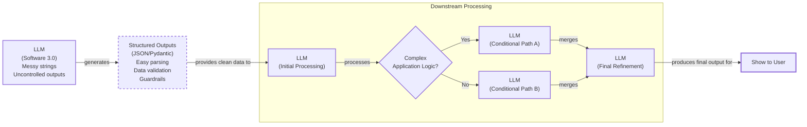

# Lesson 4: Structured Outputs

In our previous lessons, we laid the groundwork for AI Engineering. We explored the AI agent landscape, looked at the difference between rule-based LLM workflows and autonomous AI agents, and covered context engineering: the art of feeding the right information to an LLM. In this lesson, we will tackle a fundamental challenge: getting structured and reliable information *out* of an LLM.

LLMs operate in a world of unstructured data and probabilities, where we input instructions in plain English and get results as plain text. This subdomain of engineering is often called "Software 3.0". Our application, however, relies on deterministic code and predictable data structures, which is known as "Software 1.0". Structured outputs are the bridge between these two worlds, a fundamental technique for forcing LLMs to return consistent, machine-readable data. Mastering this is essential for any AI engineer building production-grade systems.

## Understanding why structured outputs are critical

Before we start coding, it is important to understand why structured outputs are foundational to building reliable AI applications. When an LLM returns a free-form string, you face the messy task of parsing it. This often involves fragile regular expressions or string-splitting logic, a problem reminiscent of brittle web scrapers that break with minor layout changes [[11]](https://bytetunnels.com/posts/llm-powered-data-extraction-schema-driven-scraping-with-structured-output). These methods easily break if the model changes its phrasing even slightly [[1]](https://www.decodingai.com/p/llm-structured-outputs-the-only-way), [[2]](https://dev.to/pockit_tools/llm-structured-output-in-2026-stop-parsing-json-with-regex-and-do-it-right-34pk). Structured outputs solve this by forcing the model’s response into a predictable format like JSON.

This approach offers several key benefits. First, structured outputs are easy to parse, manipulate, and debug. Instead of wrestling with raw text, you work with clean Python objects like dictionaries or, even better, Pydantic models. This allows you to programmatically access the data you need without guesswork.

Second, using libraries like Pydantic adds a layer of data and type validation [[3]](https://shazaali.substack.com/p/type-safety-in-langgraph-when-to), [[4]](https://pydantic.dev/articles/llm-intro). If the LLM returns a string where an integer is expected, your application will not crash silently. Instead, it will raise a clear validation error immediately. This "fail-fast" behavior is essential for building reliable systems and preventing bad data from propagating.

Structured outputs create a formal contract between the LLM and your application code. This makes it easier to pass data to downstream systems like databases, user interfaces, or other LLM calls [[5]](https://www.decodingai.com/p/llm-structured-outputs-the-only-way). For example, a popular use case is to extract properties like names, tags, and dates to build knowledge graphs for advanced RAG, or to ensure compliance in financial reporting systems [[6]](https://www.decodingai.com/p/llm-structured-outputs-the-only-way), [[12]](https://www.leewayhertz.com/structured-outputs-in-llms).


Image 1: A flowchart illustrating how structured outputs act as a bridge between Large Language Models (Software 3.0) and traditional Python applications (Software 1.0) for reliable data processing.

To understand how structured outputs work in practice, we will explore three ways to implement them: from scratch with JSON, from scratch with Pydantic, and natively with the Gemini API.

## Implementing structured outputs from scratch using JSON

To understand what happens behind the scenes in modern LLM APIs, we will first implement structured outputs from scratch. Our goal is to prompt the model to return a JSON object and then parse it into a Python dictionary. We will demonstrate this by extracting key details from a financial document.

<aside>
💡

You can find the code of this lesson in the notebook of Lesson 4, in the GitHub repository of the course.

</aside>

1.  We begin by setting up our environment. This involves initializing the Gemini client and defining the model we will use, `gemini-3.5-flash`, which is fast and cost-effective.

    ```python
    import json
    
    from google import genai
    from utils import env
    
    env.load(required_env_vars=["GOOGLE_API_KEY"])
    
    client = genai.Client()
    
    MODEL_ID = "gemini-3.5-flash"
    ```

2.  Next, we define a sample document for analysis.

    ```python
    DOCUMENT = """
    # Q3 2023 Financial Performance Analysis
    
    The Q3 earnings report shows a 20% increase in revenue and a 15% growth in user engagement, 
    beating market expectations. These impressive results reflect our successful product strategy 
    and strong market positioning.
    
    Our core business segments demonstrated remarkable resilience, with digital services leading 
    the growth at 25% year-over-year. The expansion into new markets has proven particularly 
    successful, contributing to 30% of the total revenue increase.
    
    Customer acquisition costs decreased by 10% while retention rates improved to 92%, 
    marking our best performance to date. These metrics, combined with our healthy cash flow 
    position, provide a strong foundation for continued growth into Q4 and beyond.
    """
    ```

3.  Now, we craft a prompt that instructs the LLM to extract metadata and format it as JSON. We provide a clear example of the desired structure and use XML tags like `<document>` and `<json>` to separate the input from the instructions. This is an effective prompt engineering technique for improving clarity [[7]](https://www.decodingai.com/p/llm-structured-outputs-the-only-way).

    ```python
    prompt = f"""
    Analyze the following document and extract metadata from it. 
    The output must be a single, valid JSON object with the following structure:
    <json>
    {{ 
        "summary": "A concise summary of the article.", 
        "tags": ["list", "of", "relevant", "tags"], 
        "keywords": ["list", "of", "key", "concepts"],
        "quarter": "Q...",
        "growth_rate": "...%",
    }}
    </json>
    
    Here is the document:
    <document>
    {DOCUMENT}
    </document>
    """
    ```

4.  We send the prompt to the model and inspect the raw response. As expected, the model returns a JSON object, often wrapped in Markdown code blocks.

    ```python
    response = client.models.generate_content(model=MODEL_ID, contents=prompt)
    ```

    It outputs:

    ```text
    ```json
    {
        "summary": "The Q3 2023 financial report highlights a strong performance with a 20% increase in revenue and 15% growth in user engagement, surpassing market expectations. This success is attributed to a robust product strategy, effective market positioning, and successful expansion into new markets, leading to improved customer retention and reduced acquisition costs.",
        "tags": [
            "financials",
            "earnings report",
            "business performance",
            "revenue growth",
            "market expansion",
            "Q3 2023"
        ],
        "keywords": [
            "Q3 2023",
            "revenue",
            "user engagement",
            "market expectations",
            "product strategy",
            "market positioning",
            "digital services",
            "new markets",
            "customer acquisition costs",
            "retention rates",
            "cash flow"
        ],
        "quarter": "Q3 2023",
        "growth_rate": "20%"
    }
    ```
    ```

5.  To handle this, we create a helper function to strip the Markdown tags, leaving a clean JSON string.

    ```python
    def extract_json_from_response(response: str) -> dict:
        """
        Extracts JSON from a response string that is wrapped in <json> or ```json tags.
        """
    
        response = response.replace("<json>", "").replace("</json>", "")
        response = response.replace("```json", "").replace("```", "")
    
        return json.loads(response)
    ```

6.  Finally, we parse the string into a Python dictionary, which can now be used in our application.

    ```python
    parsed_response = extract_json_from_response(response.text)
    ```

    It outputs a dictionary that can be used programmatically:

    ```text
    {
    "summary": "The Q3 2023 financial report highlights a strong performance with a 20% increase in revenue and 15% growth in user engagement, surpassing market expectations. This success is attributed to a robust product strategy, effective market positioning, and successful expansion into new markets, leading to improved customer retention and reduced acquisition costs.",
    "tags": [
      "financials",
      "earnings report",
      "business performance",
      "revenue growth",
      "market expansion",
      "Q3 2023"
    ],
    ...
    }
    ```

This manual method works, but it is brittle. Beyond simple formatting errors, it is vulnerable to schema drift, where the model adds unexpected fields, or type inconsistency, where it returns a string instead of a number [[13]](https://tetrate.io/learn/ai/llm-output-parsing-structured-generation). If the LLM makes a mistake, our application will fail. Next, we will see how Pydantic provides a more robust solution.

## Implementing structured outputs from scratch using Pydantic

Forcing JSON output is an improvement, but it still leaves you with a plain Python dictionary. You cannot be sure what is inside it, whether the keys are correct, or if the values have the right type. Pydantic solves this problem. It is a data validation library that enforces structure and type hints at runtime, ensuring data integrity from the moment it enters your application [[3]](https://shazaali.substack.com/p/type-safety-in-langgraph-when-to).

When an LLM produces output that does not match your Pydantic model, the library raises a `ValidationError` that clearly explains what went wrong. For example, if the model returns a string instead of an integer or misses a required field, Pydantic will catch the error immediately. This "fail-fast" behavior is essential for building reliable systems.

Let's refactor our previous example to use Pydantic.

1.  We define our desired data structure as a Pydantic class. This class acts as a single source of truth for your output format. It works with Python’s standard `typing` library to define the expected type for each attribute. Since Python 3.9, you can use built-in types like `list` directly, so `tags: list[str]` is now preferred over importing `List` from `typing`.

    ```python
    from pydantic import BaseModel, Field
    
    class DocumentMetadata(BaseModel):
        """A class to hold structured metadata for a document."""
    
        summary: str = Field(description="A concise, 1-2 sentence summary of the document.")
        tags: list[str] = Field(description="A list of 3-5 high-level tags relevant to the document.")
        keywords: list[str] = Field(description="A list of specific keywords or concepts mentioned.")
        quarter: str = Field(description="The quarter of the financial year described in the document (e.g, Q3 2023).")
        growth_rate: str = Field(description="The growth rate of the company described in the document (e.g, 10%).")
    ```

    It is important to note that the `description` parameter in `Field` is not just for documentation; it is injected into the prompt to guide the model, making specific descriptions a key part of the prompt engineering process [[14]](https://mlpills.substack.com/p/issue-128-structured-llm-outputs).

2.  You can also nest Pydantic models to represent more complex, hierarchical data. This allows you to define intricate relationships between different pieces of information. However, it is good practice to keep schemas from becoming overly complex, as this can confuse the LLM and lead to errors [[8]](https://dev.to/mechcloud_academy/going-deeper-with-pydantic-nested-models-and-data-structures-4e24).

    ```python
    class Summary(BaseModel):
        text: str
        sentiment: float

    class Tag(BaseModel):
        label: str
        relevance: float

    class ComplexDocumentMetadata(BaseModel):
        summary: Summary
        tags: list[Tag]
    ```

    Even with a well-defined schema, LLMs can exhibit subtle failure modes. A common issue is the “empty array trap,” where models may hallucinate an entry rather than return a truly empty list if no relevant information is found in the text. Explicitly instructing the model in the prompt to return an empty list `[]` if no items are found can help mitigate this [[15]](https://dev.to/pockit_tools/llm-structured-output-in-2026-stop-parsing-json-with-regex-and-do-it-right-34pk).

3.  With our Pydantic model defined, we can automatically generate a JSON Schema from it. A schema is the standard term for defining the structure and constraints of your data, acting as a formal contract between your application and the LLM. We provide this schema to the LLM to guide its output. This is similar to the technique used internally by APIs like Gemini and OpenAI to enforce a specific output format [[9]](https://ai.google.dev/gemini-api/docs/structured-output).

    ```python
    schema = DocumentMetadata.model_json_schema()
    ```

    The generated schema is detailed and includes descriptions from the `Field` definitions to guide the generation process.

    ```text
    {'description': 'A class to hold structured metadata for a document.',
     'properties': {'summary': {'description': 'A concise, 1-2 sentence summary of the document.',
       'title': 'Summary',
       'type': 'string'},
      'tags': {'description': 'A list of 3-5 high-level tags relevant to the document.',
       'items': {'type': 'string'},
       'title': 'Tags',
       'type': 'array'},
      'keywords': {'description': 'A list of specific keywords or concepts mentioned.',
       'items': {'type': 'string'},
       'title': 'Keywords',
       'type': 'array'},
      'quarter': {'description': 'The quarter of the financial year described in the document (e.g, Q3 2023).',
       'title': 'Quarter',
       'type': 'string'},
      'growth_rate': {'description': 'The growth rate of the company described in the document (e.g, 10%).',
       'title': 'Growth Rate',
       'type': 'string'}},
     'required': ['summary', 'tags', 'keywords', 'quarter', 'growth_rate'],
     'title': 'DocumentMetadata',
     'type': 'object'}
    ```

4.  We update our prompt to include this JSON Schema, giving the model a much more precise set of instructions.

    ```python
    prompt = f"""
    Please analyze the following document and extract metadata from it. 
    The output must be a single, valid JSON object that conforms to the following JSON Schema:
    <json>
    {json.dumps(schema, indent=2)}
    </json>
    
    Here is the document:
    <document>
    {DOCUMENT}
    </document>
    """
    ```

5.  We call the model and extract the JSON string as before.

    ```python
    response = client.models.generate_content(model=MODEL_ID, contents=prompt)
    
    parsed_response = extract_json_from_response(response.text)
    ```

    It outputs:

    ```text
    {
    "summary": "The Q3 2023 earnings report indicates strong financial performance with a 20% increase in revenue and 15% growth in user engagement, driven by successful product strategy, market expansion, and improved customer retention.",
    "tags": [
      "Financial Performance",
      "Earnings Report",
      "Business Growth",
      "Market Expansion",
      "Customer Metrics"
    ],
    "keywords": [
      "Q3 2023",
      "revenue increase",
      "user engagement",
      "digital services",
      "new markets",
      "customer acquisition costs",
      "retention rates",
      "cash flow"
    ],
    "quarter": "Q3 2023",
    "growth_rate": "20%"
    }
    ```

6.  Now, the biggest difference is that we can load the output dictionary into our Pydantic model and validate it.

    ```python
    try:
        document_metadata = DocumentMetadata.model_validate(parsed_response)
        print("\nValidation successful!")
    except Exception as e:
        print(f"\nValidation failed: {e}")
    ```

    It outputs:

    ```text
    Validation successful!
    ```

The `document_metadata` Pydantic object can now be safely used throughout your application. This is the main advantage: you move from obscure dictionaries to clean, predictable Python objects. You no longer need to pollute your code with checks for missing keys or incorrect types.

For production systems, you can build even more resilience by implementing a retry mechanism. If Pydantic validation fails, the `ValidationError` can be captured, and its message can be fed back to the LLM in a subsequent call. This allows the model to self-correct based on the specific error, progressively improving its output until it conforms to the schema [[16]](https://machinelearningmastery.com/the-complete-guide-to-using-pydantic-for-validating-llm-outputs).

While Python’s built-in `dataclasses` or `TypedDict` can define structure, they only provide type hints for static analysis and do not perform runtime validation [[3]](https://shazaali.substack.com/p/type-safety-in-langgraph-when-to). If the LLM returns a string where an integer is expected, these tools will not catch the error. Pydantic's runtime validation, type constraints, and clear schema definitions make it our favorite way for structuring and validating domain data structures in our AI apps.

## Implementing structured outputs using Gemini and Pydantic

While Pydantic brings structure and validation, we still had to construct the prompts and handle responses manually. When working with modern APIs like Gemini, the recommended way to generate structured outputs is by using their native features. This approach is simpler, more accurate, and often more cost-effective, with some providers claiming a jump in reliability from ~36% to nearly 100% compared to prompt engineering alone [[9]](https://ai.google.dev/gemini-api/docs/structured-output), [[10]](https://www.decodingai.com/p/llm-structured-outputs-the-only-way), [[17]](https://humanloop.com/blog/structured-outputs).

Let’s see how to achieve the same result using the Gemini API’s native capabilities.

1.  We define a `GenerateContentConfig` object, instructing the Gemini API to set the `response_mime_type` to `"application/json"` and the `response_schema` to our `DocumentMetadata` Pydantic model. This single configuration step replaces the manual schema injection and parsing we did earlier.

    ```python
    from google.genai import types
    
    config = types.GenerateContentConfig(response_mime_type="application/json", response_schema=DocumentMetadata)
    ```

2.  This configuration makes our prompt significantly shorter and cleaner. We simply ask the model to perform the task, as the output format is guided directly by the config.

    ```python
    prompt = f"""
    Analyze the following document and extract its metadata.
    
    Here is the document:
    <document>
    {DOCUMENT}
    </document>
    """
    ```

3.  Now, we call the model, passing our simplified prompt and the new configuration object. The API handles the rest.

    ```python
    response = client.models.generate_content(model=MODEL_ID, contents=prompt, config=config)
    ```

4.  The Gemini client automatically parses the output for us. By accessing the `response.parsed` attribute, we receive a ready-to-use instance of our `DocumentMetadata` Pydantic model.

    ```python
    document_metadata = response.parsed
    print(f"Type of the response: `{type(response.parsed)}`")
    ```

    It outputs:

    ```text
    Type of the response: `<class '__main__.DocumentMetadata'>`
    ```

This native approach is robust, efficient, and requires less code. While it is the recommended way for most modern LLM APIs, the “from scratch” method remains useful for open-source models that may not have this built-in functionality.

## Structured Outputs Are Everywhere

We have covered the why and how of structured outputs, from manual prompting to native API integration. This technique is a fundamental pattern in AI engineering, connecting the probabilistic nature of LLMs with the deterministic world of software. Whether you are building a simple summarization workflow or a complex research agent, you will use structured outputs to ensure reliability and control.

This pattern will be a recurring theme. In our next lesson, we will explore the basic ingredients of LLM workflows, where structured data flows between components. Later, as we build agents, structured outputs will be how they parse information and decide what to do next. This principle is even shaping multi-agent systems, where protocols use structured data to allow agents to collaborate reliably [[18]](https://arxiv.org/html/2504.16736v2). Mastering this technique is a key step toward building powerful and predictable AI systems.

## References

- [1] Structured Outputs: The Silent Hero of Production AI. (n.d.). Decoding AI. https://www.decodingai.com/p/llm-structured-outputs-the-only-way
- [2] LLM Structured Output in 2026: Stop Parsing JSON with Regex and Do It Right. (n.d.). DEV Community. https://dev.to/pockit_tools/llm-structured-output-in-2026-stop-parsing-json-with-regex-and-do-it-right-34pk
- [3] Type safety in LangGraph: When to use Pydantic vs. TypedDict vs. Dataclasses. (n.d.). Substack. https://shazaali.substack.com/p/type-safety-in-langgraph-when-to
- [4] Steering Large Language Models with Pydantic. (n.d.). Pydantic. https://pydantic.dev/articles/llm-intro
- [5] Structured Outputs: The Silent Hero of Production AI. (n.d.). Decoding AI. https://www.decodingai.com/p/llm-structured-outputs-the-only-way
- [6] Structured Outputs: The Silent Hero of Production AI. (n.d.). Decoding AI. https://www.decodingai.com/p/llm-structured-outputs-the-only-way
- [7] Structured Outputs: The Silent Hero of Production AI. (n.d.). Decoding AI. https://www.decodingai.com/p/llm-structured-outputs-the-only-way
- [8] Going Deeper with Pydantic: Nested Models and Data Structures. (n.d.). DEV Community. https://dev.to/mechcloud_academy/going-deeper-with-pydantic-nested-models-and-data-structures-4e24
- [9] Structured output. (n.d.). Google AI for Developers. https://ai.google.dev/gemini-api/docs/structured-output
- [10] Structured Outputs: The Silent Hero of Production AI. (n.d.). Decoding AI. https://www.decodingai.com/p/llm-structured-outputs-the-only-way
- [11] Schema-Driven LLM Data Extraction. (n.d.). Byte Tunnels. https://bytetunnels.com/posts/llm-powered-data-extraction-schema-driven-scraping-with-structured-output
- [12] Structured Outputs in LLMs. (n.d.). LeewayHertz. https://www.leewayhertz.com/structured-outputs-in-llms
- [13] LLM Output Parsing and Structured Generation. (n.d.). Tetrate. https://tetrate.io/learn/ai/llm-output-parsing-structured-generation
- [14] Issue #128 - Structured LLM Outputs with Pydantic. (n.d.). ML Pills. https://mlpills.substack.com/p/issue-128-structured-llm-outputs
- [15] LLM Structured Output in 2026: Stop Parsing JSON with Regex and Do It Right. (n.d.). DEV Community. https://dev.to/pockit_tools/llm-structured-output-in-2026-stop-parsing-json-with-regex-and-do-it-right-34pk
- [16] The Complete Guide to Using Pydantic for Validating LLM Outputs. (n.d.). MachineLearningMastery.com. https://machinelearningmastery.com/the-complete-guide-to-using-pydantic-for-validating-llm-outputs
- [17] How to use Structured Outputs with LLMs. (n.d.). Humanloop. https://humanloop.com/blog/structured-outputs
- [18] Agora: A Protocol for LLM-based Agent Communication. (n.d.). arXiv. https://arxiv.org/html/2504.16736v2