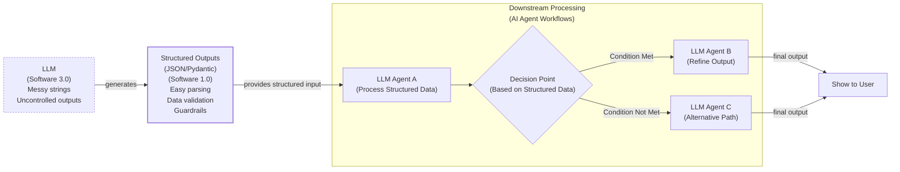

# Lesson 4: Structured Outputs

In our previous lessons, we laid the groundwork for AI Engineering. We explored the AI agent landscape, looked at the difference between rule-based LLM workflows and autonomous AI agents, and covered context engineering: the art of feeding the right information to an LLM. In this lesson, we will tackle a fundamental challenge: getting structured and reliable information *out* of an LLM.

LLMs operate in a world of unstructured data and probabilities, where we input instructions in plain English and get results as plain text. This subdomain of engineering is often called "Software 3.0". Our applications, however, rely on deterministic code and predictable data structures, which is known as "Software 1.0". Structured outputs are the bridge between these two worlds, a fundamental technique for forcing LLMs to return consistent, machine-readable data. Mastering this is essential for any AI engineer building production-grade systems. We will cover how to implement them from scratch with JSON, then with Pydantic, and finally with the native Gemini API.

## Understanding why structured outputs are critical

Before we start coding, it is crucial to understand why structured outputs are foundational to building reliable AI applications. When an LLM returns a free-form string, you face the messy task of parsing it. This often involves fragile regular expressions or string-splitting logic. These methods easily break if the model changes its phrasing even slightly [[1]](https://pmc.ncbi.nlm.nih.gov/articles/PMC11751965/), [[2]](https://arxiv.org/html/2506.21585v1). Structured outputs solve this by forcing the model’s response into a predictable format like JSON.

This approach offers several key benefits. First, structured outputs are easy to parse and manipulate. Instead of wrestling with raw text, you work with clean Python objects like dictionaries or Pydantic models. This allows you to programmatically access the data you need, making your code cleaner and more predictable. Second, using libraries like Pydantic adds a layer of data and type validation [[3]](https://www.speakeasy.com/blog/pydantic-vs-dataclasses), [[4]](https://codetain.com/blog/validators-approach-in-python-pydantic-vs-dataclasses/). If the LLM returns a string where an integer is expected, your application raises a clear validation error immediately. This "fail-fast" behavior is essential for building reliable systems.

Structured outputs create a formal contract between the LLM and your application code. This makes it easier to pass data to the next LLM step or other downstream systems like databases, user interfaces, or APIs [[5]](https://www.prompts.ai/en/blog-details/automating-knowledge-graphs-with-llm-outputs), [[6]](https://humanloop.com/blog/structured-outputs), [[7]](https://developer.hpe.com/blog/using-structured-outputs-in-vllm). For example, a popular use case is extracting entities like names, dates, or tags to build knowledge graphs for advanced RAG systems.


Image 1: A flowchart illustrating how structured outputs bridge Large Language Models (Software 3.0) and traditional Python applications (Software 1.0) for reliable downstream processing and AI agent workflows.

To understand how structured outputs work in practice, we will explore three ways to implement them: from scratch with JSON, from scratch with Pydantic, and natively with the Gemini API.

## Implementing structured outputs from scratch using JSON

To build an intuition of what modern LLM APIs offer, we will first implement structured outputs from scratch. Our goal is to prompt the model to return a JSON object and then parse it into a Python dictionary. We will use a simple example where we extract key details, such as a summary, tags, and keywords, from a financial document.

<aside>
💡

You can find the code for this lesson in the notebook of Lesson 4, in the GitHub repository of the course.

</aside>

1.  First, we set up our environment by initializing the Gemini client and defining the model we will use. We will use `gemini-2.5-flash`, which is fast and cost-effective for simple tasks.

    ```python
    import json
    from google import genai
    
    # Assumes GOOGLE_API_KEY is set in the environment
    client = genai.Client()
    MODEL_ID = "gemini-3.5-flash"
    ```

2.  Next, we define a sample document for analysis.

    ```python
    DOCUMENT = """
    # Q3 2023 Financial Performance Analysis
    
    The Q3 earnings report shows a 20% increase in revenue and a 15% growth in user engagement, 
    beating market expectations. These impressive results reflect our successful product strategy 
    and strong market positioning.
    
    Our core business segments demonstrated remarkable resilience, with digital services leading 
    the growth at 25% year-over-year. The expansion into new markets has proven particularly 
    successful, contributing to 30% of the total revenue increase.
    
    Customer acquisition costs decreased by 10% while retention rates improved to 92%, 
    marking our best performance to date. These metrics, combined with our healthy cash flow 
    position, provide a strong foundation for continued growth into Q4 and beyond.
    """
    ```

3.  We then craft a prompt that instructs the LLM to extract metadata and format it as JSON. We provide a clear example of the desired structure and use XML tags like `<document>` and `<json>` to separate the input data from the formatting instructions. This is a common and effective prompt engineering technique for improving clarity and guiding the model’s output [[8]](https://help.openai.com/en/articles/6654000-best-practices-for-prompt-engineering-with-the-openai-api), [[9]](https://aws.amazon.com/blogs/machine-learning/structured-data-response-with-amazon-bedrock-prompt-engineering-and-tool-use/).

    ```python
    prompt = f"""
    Analyze the following document and extract metadata from it. 
    The output must be a single, valid JSON object with the following structure:
    <json>
    {{ 
        "summary": "A concise summary of the article.", 
        "tags": ["list", "of", "relevant", "tags"], 
        "keywords": ["list", "of", "key", "concepts"],
        "quarter": "Q...",
        "growth_rate": "...%",
    }}
    </json>
    
    Here is the document:
    <document>
    {DOCUMENT}
    </document>
    """
    ```

4.  We send the prompt to the model and inspect the raw response.

    ```python
    response = client.models.generate_content(model=MODEL_ID, contents=prompt)
    ```

    It outputs a JSON object, often wrapped in Markdown code blocks:

    ```text
    ```json
    {
        "summary": "The Q3 2023 financial report highlights a strong performance with a 20% increase in revenue and 15% growth in user engagement, surpassing market expectations. This success is attributed to a robust product strategy, effective market positioning, and successful expansion into new markets, leading to improved customer retention and reduced acquisition costs.",
        "tags": [
            "financials",
            "earnings report",
            "business performance",
            "revenue growth",
            "market expansion",
            "Q3 2023"
        ],
        "keywords": [
            "Q3 2023",
            "revenue",
            "user engagement",
            "market expectations",
            "product strategy",
            "market positioning",
            "digital services",
            "new markets",
            "customer acquisition costs",
            "retention rates",
            "cash flow"
        ],
        "quarter": "Q3 2023",
        "growth_rate": "20%"
    }
    ```
    ```

5.  To handle this, we create a helper function to strip the Markdown tags, leaving a clean JSON string.

    ```python
    def extract_json_from_response(response: str) -> dict:
        """
        Extracts JSON from a response string that is wrapped in <json> or ```json tags.
        """
    
        response = response.replace("<json>", "").replace("</json>", "")
        response = response.replace("```json", "").replace("```", "")
    
        return json.loads(response)
    ```

6.  Finally, we parse the string into a Python dictionary, which can now be used in our application.

    ```python
    parsed_response = extract_json_from_response(response.text)
    ```

    It outputs:

    ```json
    {
      "summary": "The Q3 2023 financial report highlights a strong performance with a 20% increase in revenue and 15% growth in user engagement, surpassing market expectations. This success is attributed to a robust product strategy, effective market positioning, and successful expansion into new markets, leading to improved customer retention and reduced acquisition costs.",
      "tags": [
        "financials",
        "earnings report",
        "business performance",
        "revenue growth",
        "market expansion",
        "Q3 2023"
      ],
      "keywords": [
        "Q3 2023",
        "revenue",
        "user engagement",
        "market expectations",
        "product strategy",
        "market positioning",
        "digital services",
        "new markets",
        "customer acquisition costs",
        "retention rates",
        "cash flow"
      ],
      "quarter": "Q3 2023",
      "growth_rate": "20%"
    }
    ```

This manual method works, but it relies on post-processing and lacks data validation. If the LLM makes a mistake, like outputting a string instead of a list or missing a key, our application will fail. Next, we will see how Pydantic provides a much more robust solution.

## Implementing structured outputs from scratch using Pydantic

While forcing JSON output is an improvement, it still leaves you with a plain Python dictionary. You cannot be sure what is inside it, if the keys are correct, or if the values have the right type. This uncertainty can lead to bugs and make your code difficult to maintain. Pydantic solves this problem by enforcing structure and type hints at runtime, ensuring data integrity from the moment it enters your application [[3]](https://www.speakeasy.com/blog/pydantic-vs-dataclasses). It provides a single source of truth for your data structure and can automatically generate a JSON Schema from your Python class.

When an LLM produces output that does not match your Pydantic model, the library raises a `ValidationError` that clearly explains what went wrong. This "fail-fast" behavior is essential for building reliable systems, preventing bad data from causing hard-to-debug errors later.

Let's refactor our previous example to use Pydantic.

1.  We define our desired data structure as a Pydantic class. This class acts as a single source of truth for the output format. Pydantic works with Python’s `typing` module, but since Python 3.9, you can use built-in types like `list` directly. For example, `tags: list[str]` is now preferred over importing `List` from `typing`.

    ```python
    from pydantic import BaseModel, Field
    
    class DocumentMetadata(BaseModel):
        """A class to hold structured metadata for a document."""
    
        summary: str = Field(description="A concise, 1-2 sentence summary of the document.")
        tags: list[str] = Field(description="A list of 3-5 high-level tags relevant to the document.")
        keywords: list[str] = Field(description="A list of specific keywords or concepts mentioned.")
        quarter: str = Field(description="The quarter of the financial year described in the document (e.g, Q3 2023).")
        growth_rate: str = Field(description="The growth rate of the company described in the document (e.g, 10%).")
    ```

2.  You can also nest Pydantic models to represent more complex, hierarchical data. This allows you to define intricate relationships between different pieces of information. However, it is good practice to keep schemas as simple as possible, as complex nested structures can confuse the LLM and lead to errors.

    ```python
    class Summary(BaseModel):
        text: str
        sentiment: float
    
    class Tag(BaseModel):
        label: str
        relevance: float
    
    class ComplexDocumentMetadata(BaseModel):
        summary: Summary
        tags: list[Tag]
    ```

3.  With our Pydantic model defined, we can automatically generate a JSON Schema. A schema is the standard for defining the structure and constraints of your data, acting as a formal contract between your application and the LLM. We provide this schema to the LLM to guide its output. This is similar to the technique used internally by APIs like Gemini and OpenAI to enforce a specific output format [[10]](https://ai.google.dev/gemini-api/docs/structured-output).

    ```python
    schema = DocumentMetadata.model_json_schema()
    ```

    The generated schema is detailed and includes descriptions from the `Field` definitions to guide the generation process.

    ```json
    {
        "description": "A class to hold structured metadata for a document.",
        "properties": {
            "summary": {
                "description": "A concise, 1-2 sentence summary of the document.",
                "title": "Summary",
                "type": "string"
            },
            "tags": {
                "description": "A list of 3-5 high-level tags relevant to the document.",
                "items": {"type": "string"},
                "title": "Tags",
                "type": "array"
            },
            "keywords": {
                "description": "A list of specific keywords or concepts mentioned.",
                "items": {"type": "string"},
                "title": "Keywords",
                "type": "array"
            },
            "quarter": {
                "description": "The quarter of the financial year described in the document (e.g, Q3 2023).",
                "title": "Quarter",
                "type": "string"
            },
            "growth_rate": {
                "description": "The growth rate of the company described in the document (e.g, 10%).",
                "title": "Growth Rate",
                "type": "string"
            }
        },
        "required": ["summary", "tags", "keywords", "quarter", "growth_rate"],
        "title": "DocumentMetadata",
        "type": "object"
    }
    ```

4.  We update our prompt to include this JSON Schema.

    ```python
    prompt = f"""
    Please analyze the following document and extract metadata from it. 
    The output must be a single, valid JSON object that conforms to the following JSON Schema:
    <json>
    {json.dumps(schema, indent=2)}
    </json>
    
    Here is the document:
    <document>
    {DOCUMENT}
    </document>
    """
    ```

5.  We call the model and extract the JSON string as before.

    ```python
    response = client.models.generate_content(model=MODEL_ID, contents=prompt)
    parsed_response = extract_json_from_response(response.text)
    ```

    It outputs:

    ```json
    {
        "summary": "The Q3 2023 earnings report indicates strong financial performance with a 20% increase in revenue and 15% growth in user engagement, driven by successful product strategy, market expansion, and improved customer retention.",
        "tags": [
            "Financial Performance",
            "Earnings Report",
            "Business Growth",
            "Market Expansion",
            "Customer Metrics"
        ],
        "keywords": [
            "Q3 2023",
            "revenue increase",
            "user engagement",
            "digital services",
            "new markets",
            "customer acquisition costs",
            "retention rates",
            "cash flow"
        ],
        "quarter": "Q3 2023",
        "growth_rate": "20%"
    }
    ```

6.  The biggest difference is that we can now load the output dictionary into our Pydantic model and validate it.

    ```python
    try:
        document_metadata = DocumentMetadata.model_validate(parsed_response)
        print("\nValidation successful!")
    except Exception as e:
        print(f"\nValidation failed: {e}")
    ```

    It outputs:

    ```text
    Validation successful!
    ```

The `document_metadata` Pydantic object can now be safely used throughout your application. This is the main advantage: you move from unclear dictionaries to clean, predictable Python objects. For instance, if the LLM returned a simple string for the `tags` attribute instead of a list of strings, Pydantic would have raised a validation error.

While Python’s built-in `dataclasses` or `TypedDict` can define structure, they only provide type hints for static analysis and do not perform runtime validation [[3]](https://www.speakeasy.com/blog/pydantic-vs-dataclasses), [[4]](https://codetain.com/blog/validators-approach-in-python-pydantic-vs-dataclasses/). If the LLM returns a string where an integer is expected, these tools will not catch the error. Pydantic’s runtime validation, type constraints, and clear schema definitions make it our favorite way for structuring and validating all our domain data structures.

## Implementing structured outputs using Gemini and Pydantic

While Pydantic brings structure and validation, we still had to construct the prompts and handle responses manually. When working with modern APIs such as Gemini and OpenAI, the recommended way to generate structured outputs is by using their native features. This approach is simpler, more accurate, and often more cost-effective than manual prompt engineering, as the vendor will always handle the optimization on top of their models better than your manual prompting [[10]](https://ai.google.dev/gemini-api/docs/structured-output).

Let’s see how to achieve the same result for our example using the Gemini API’s native capabilities. The process becomes much simpler.

1.  We define a `GenerateContentConfig` object, instructing the Gemini API to set the `response_mime_type` to `"application/json"` and the `response_schema` to our `DocumentMetadata` Pydantic model. This configures the model to output JSON that is then automatically converted to the given Pydantic model.

    ```python
    from google.genai import types
    
    config = types.GenerateContentConfig(
        response_mime_type="application/json", 
        response_schema=DocumentMetadata
    )
    ```

2.  This configuration makes our prompt significantly shorter and cleaner, eliminating the need to manually inject any schema. We simply ask the model to perform the task, as the output format is guided directly by the config.

    ```python
    prompt = f"""
    Analyze the following document and extract its metadata.
    
    Here is the document:
    <document>
    {DOCUMENT}
    </document>
    """
    ```

3.  Now, we call the model, passing our simplified prompt and the new configuration object. The API handles the rest, ensuring the output adheres to the schema.

    ```python
    response = client.models.generate_content(
        model=MODEL_ID, 
        contents=prompt, 
        config=config
    )
    ```

4.  The Gemini client automatically parses the output for us. By accessing the `response.parsed` attribute, we receive a ready-to-use instance of our `DocumentMetadata` Pydantic model.

    ```python
    document_metadata = response.parsed
    print(f"Type of the response: `{type(document_metadata)}`")
    ```

    It outputs:

    ```text
    Type of the response: `<class '__main__.DocumentMetadata'>`
    ```

This native approach is robust, efficient, and requires less code. While it is the recommended way for most modern LLM APIs, the “from scratch” method remains useful for open-source models that may not have this built-in functionality.

## Structured Outputs Are Everywhere

Structured outputs are a fundamental pattern in AI engineering, connecting the probabilistic nature of LLMs with the deterministic world of software. Whether you are building a simple summarization workflow or a complex research agent, you will use structured outputs to ensure reliability and control.

This pattern will be a recurring theme throughout this course. In our next lesson, we will explore the basic ingredients of LLM workflows, where we will see how structured data flows between different components. Later, when we build agents that can take action (Lesson 6) or reason about the world (Lesson 7), structured outputs will be how they parse information and decide what to do next. Mastering this technique is a key step toward building powerful and predictable AI systems.

## References

- [1] Ntinopoulos, V., Biefer, H. R. C., Tudorache, I., Papadopoulos, N., Odavic, D., Risteski, P., Haeussler, A., & Dzemali, O. (2024). Large language models for data extraction from unstructured and semi-structured electronic health records: a multiple model performance evaluation. *BMJ Health & Care Informatics*, 32(1), e101139. [https://pmc.ncbi.nlm.nih.gov/articles/PMC11751965/](https://pmc.ncbi.nlm.nih.gov/articles/PMC11751965/)
- [2] Evaluation of LLM-based Strategies for the Extraction of Food Product Information from Online Shops. (n.d.). *arXiv*. [https://arxiv.org/html/2506.21585v1](https://arxiv.org/html/2506.21585v1)
- [3] Speakeasy Team. (2024, August 29). Type Safety in Python: Pydantic vs. Data Classes vs. Annotations vs. TypedDicts. *Speakeasy*. [https://www.speakeasy.com/blog/pydantic-vs-dataclasses](https://www.speakeasy.com/blog/pydantic-vs-dataclasses)
- [4] Validators approach in Python - Pydantic vs. Dataclasses. (n.d.). *Codetain*. [https://codetain.com/blog/validators-approach-in-python-pydantic-vs-dataclasses/](https://codetain.com/blog/validators-approach-in-python-pydantic-vs-dataclasses/)
- [5] Automating Knowledge Graphs with LLM Outputs. (n.d.). *Prompts.ai*. [https://www.prompts.ai/en/blog-details/automating-knowledge-graphs-with-llm-outputs](https://www.prompts.ai/en/blog-details/automating-knowledge-graphs-with-llm-outputs)
- [6] Kelly, C. (2024, February 13). Structured Outputs: everything you should know. *Humanloop*. [https://humanloop.com/blog/structured-outputs](https://humanloop.com/blog/structured-outputs)
- [7] Using structured outputs in vLLM. (n.d.). *HPE Developer Community*. [https://developer.hpe.com/blog/using-structured-outputs-in-vllm](https://developer.hpe.com/blog/using-structured-outputs-in-vllm)
- [8] Best practices for prompt engineering with the OpenAI API. (n.d.). *OpenAI Help Center*. [https://help.openai.com/en/articles/6654000-best-practices-for-prompt-engineering-with-the-openai-api](https://help.openai.com/en/articles/6654000-best-practices-for-prompt-engineering-with-the-openai-api)
- [9] Structured data response with Amazon Bedrock: Prompt Engineering and Tool Use. (2024, June 26). *Amazon Web Services*. [https://aws.amazon.com/blogs/machine-learning/structured-data-response-with-amazon-bedrock-prompt-engineering-and-tool-use/](https://aws.amazon.com/blogs/machine-learning/structured-data-response-with-amazon-bedrock-prompt-engineering-and-tool-use/)
- [10] Structured output. (n.d.). *Google AI for Developers*. [https://ai.google.dev/gemini-api/docs/structured-output](https://ai.google.dev/gemini-api/docs/structured-output)
- [11] Kurt, H. H. (2023, April 20). Dataclasses vs Pydantic vs TypedDict vs NamedTuple in Python. *DEV Community*. [https://dev.to/hevalhazalkurt/dataclasses-vs-pydantic-vs-typeddict-vs-namedtuple-in-python-41gg](https://dev.to/hevalhazalkurt/dataclasses-vs-pydantic-vs-typeddict-vs-namedtuple-in-python-41gg)
- [12] Structured Outputs with Pydantic & OpenAI Function Calling [Video]. (2024, May 16). *YouTube*. [https://www.youtube.com/watch?v=NGEZsqEUpC0](https://www.youtube.com/watch?v=NGEZsqEUpC0)
- [13] Performance. (n.d.). *Pydantic*. [https://pydantic.dev/docs/validation/latest/concepts/performance/](https://pydantic.dev/docs/validation/latest/concepts/performance/)
- [14] When should I use function calling, structured outputs or JSON mode?. (2024, October 10). *Vellum AI Blog*. [https://www.vellum.ai/blog/when-should-i-use-function-calling-structured-outputs-or-json-mode](https://www.vellum.ai/blog/when-should-i-use-function-calling-structured-outputs-or-json-mode)
- [15] Structured Output in vertexAI BatchPredictionJob. (n.d.). *Google Cloud Community*. [https://www.googlecloudcommunity.com/gc/AI-ML/Structured-Output-in-vertexAI-BatchPredictionJob/m-p/866640](https://www.googlecloudcommunity.com/gc/AI-ML/Structured-Output-in-vertexAI-BatchPredictionJob/m-p/866640)
- [16] Structured Outputs with OpenAI. (n.d.). *OpenAI Platform*. [https://platform.openai.com/docs/guides/structured-outputs](https://platform.openai.com/docs/guides/structured-outputs)
- [17] Liu, J. (2024, January 4). Steering Large Language Models with Pydantic. *Pydantic*. [https://pydantic.dev/articles/llm-intro](https://pydantic.dev/articles/llm-intro)
- [18] How to return structured data from a model. (n.d.). *LangChain*. [https://python.langchain.com/docs/how_to/structured_output/](https://python.langchain.com/docs/how_to/structured_output/)
- [19] Livshitz, A. (2023, July 17). YAML vs. JSON: Which Is More Efficient for Language Models?. *Better Programming*. [https://betterprogramming.pub/yaml-vs-json-which-is-more-efficient-for-language-models-5bc11dd0f6df](https://betterprogramming.pub/yaml-vs-json-which-is-more-efficient-for-language-models-5bc11dd0f6df)
- [20] Type Safety in LangGraph: When to Use TypedDict vs. Pydantic. (2024, June 25). *Substack*. [https://shazaali.substack.com/p/type-safety-in-langgraph-when-to](https://shazaali.substack.com/p/type-safety-in-langgraph-when-to)
- [21] Iusztin, P. (n.d.). Structured Outputs: The Silent Hero of Production AI. *Decoding AI*. [https://www.decodingai.com/p/llm-structured-outputs-the-only-way](https://www.decodingai.com/p/llm-structured-outputs-the-only-way)
- [22] The complete guide to using Pydantic for validating LLM outputs. (2025, December 1). *MachineLearningMastery.com*. [https://machinelearningmastery.com/the-complete-guide-to-using-pydantic-for-validating-llm-outputs](https://machinelearningmastery.com/the-complete-guide-to-using-pydantic-for-validating-llm-outputs)
- [23] Structured Output with Gemini Models: Begging, Threatening, and JSON-ing. (2025, April 8). *Medium*. [https://medium.com/google-cloud/structured-output-with-gemini-models-begging-borrowing-and-json-ing-f70ffd60eae6](https://medium.com/google-cloud/structured-output-with-gemini-models-begging-borrowing-and-json-ing-f70ffd60eae6)
- [24] LLM Structured Output in 2026: Stop parsing JSON with regex and do it right. (2026, June 1). *DEV Community*. [https://dev.to/pockit_tools/llm-structured-output-in-2026-stop-parsing-json-with-regex-and-do-it-right-34pk](https://dev.to/pockit_tools/llm-structured-output-in-2026-stop-parsing-json-with-regex-and-do-it-right-34pk)
- [25] Going Deeper with Pydantic: Nested Models and Data Structures. (2025, May 5). *DEV Community*. [https://dev.to/mechcloud_academy/going-deeper-with-pydantic-nested-models-and-data-structures-4e24](https://dev.to/mechcloud_academy/going-deeper-with-pydantic-nested-models-and-data-structures-4e24)
- [26] The guide to structured outputs and function calling with LLMs. (2025, September 10). *Agenta*. [https://agenta.ai/blog/the-guide-to-structured-outputs-and-function-calling-with-llms](https://agenta.ai/blog/the-guide-to-structured-outputs-and-function-calling-with-llms)