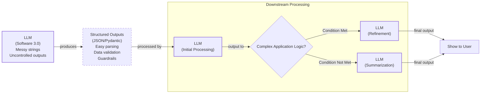

# Lesson 4: Structured Outputs

In our previous lessons, we laid the groundwork for AI Engineering. We explored the AI agent landscape, looked at the difference between rule-based LLM workflows and autonomous AI agents, and covered context engineering: the art of feeding the right information to an LLM. In this lesson, we will tackle a fundamental challenge: getting structured and reliable information *out* of an LLM.

LLMs operate in a world of unstructured data and probabilities, where we input instructions in plain English and get results as plain text. This subdomain of engineering is often called "Software 3.0". Our application, however, relies on deterministic code and predictable data structures, which is known as "Software 1.0". Structured outputs are the bridge between these two worlds, a fundamental technique for forcing LLMs to return consistent, machine-readable data. Mastering this is essential for any AI engineer building production-grade systems.

## Understanding why structured outputs are critical

Before we start coding, it is important to understand why structured outputs are foundational to building reliable AI applications. When an LLM returns a free-form string, you face the messy task of parsing it. This often involves fragile regular expressions or string-splitting logic. This is a modern parallel to the brittle CSS selectors of traditional web scraping, and these methods can easily break if the model changes its phrasing even slightly. Structured outputs solve this by forcing the model’s response into a predictable format like JSON, often via constrained decoding, a process that guides the model at the token level to ensure its output is always syntactically correct. The reliability gain is substantial; OpenAI reported accuracy jumping from around 36% with prompt engineering to 100% with native support [[1]](https://pmc.ncbi.nlm.nih.gov/articles/PMC11751965/), [[2]](https://arxiv.org/html/2506.21585v1), [[12]](https://bytetunnels.com/posts/llm-powered-data-extraction-schema-driven-scraping-with-structured-output), [[13]](https://dev.to/pockit_tools/llm-structured-output-in-2026-stop-parsing-json-with-regex-and-do-it-right-34pk), [[14]](https://humanloop.com/blog/structured-outputs).

This approach offers several key benefits. First, structured outputs are easy to parse and manipulate. Instead of dealing with raw text, you work with clean Python objects, making your code more predictable and easier to debug. Using libraries like Pydantic adds a layer of data and type validation. If the LLM returns a string where an integer is expected, your application raises a clear validation error immediately, preventing bad data from propagating [[3]](https://www.speakeasy.com/blog/pydantic-vs-dataclasses), [[4]](https://codetain.com/blog/validators-approach-in-python-pydantic-vs-dataclasses/).

Structured outputs create a formal contract between the LLM and your application code. This makes it easier to pass data between steps in a workflow or to downstream systems like a database or API. For example, you can extract entities like names and dates to build knowledge graphs for advanced knowledge retrieval systems. This precision is especially important in regulated fields like finance, healthcare, and legal services, where consistency and auditability are non-negotiable [[5]](https://www.prompts.ai/en/blog-details/automating-knowledge-graphs-with-llm-outputs), [[6]](https://humanloop.com/blog/structured-outputs), [[15]](https://www.leewayhertz.com/structured-outputs-in-llms).


Image 1: A flowchart illustrating how structured outputs act as a bridge between Large Language Models (Software 3.0) and traditional Python applications (Software 1.0) for reliable data processing, including a downstream processing workflow.

To understand how structured outputs work in practice, we will explore three ways to implement them: from scratch with JSON, from scratch with Pydantic, and natively with the Gemini API.

## Implementing structured outputs from scratch using JSON

To understand how modern LLM APIs work under the hood, we will first implement structured outputs from scratch. This often feels like a negotiation with the model, where we find ourselves politely asking, or even demanding, that it return data in the correct format. Our goal is to prompt a model to return a JSON object and then parse it into a Python dictionary. We will use a simple example of extracting metadata from a financial document [[16]](https://medium.com/google-cloud/structured-output-with-gemini-models-begging-borrowing-and-json-ing-f70ffd60eae6).

<aside>
💡

You can find the code for this lesson in the notebook for Lesson 4, in the GitHub repository of the course.

</aside>

1.  First, we set up our environment. We initialize the Gemini client from the `google-genai` Python package and define the model we will use. For this example, we will use `gemini-3.5-flash`, which is a fast and cost-effective choice for tasks like simple data extraction.

    ```python
    import json
    
    from google import genai
    from utils import env
    
    env.load(required_env_vars=["GOOGLE_API_KEY"])
    
    client = genai.Client()
    
    MODEL_ID = "gemini-3.5-flash"
    ```

2.  Next, we define a sample document for analysis. This financial report contains the kind of semi-structured text that is a perfect candidate for metadata extraction.

    ```python
    DOCUMENT = """
    # Q3 2023 Financial Performance Analysis
    
    The Q3 earnings report shows a 20% increase in revenue and a 15% growth in user engagement, 
    beating market expectations. These impressive results reflect our successful product strategy 
    and strong market positioning.
    
    Our core business segments demonstrated remarkable resilience, with digital services leading 
    the growth at 25% year-over-year. The expansion into new markets has proven particularly 
    successful, contributing to 30% of the total revenue increase.
    
    Customer acquisition costs decreased by 10% while retention rates improved to 92%, 
    marking our best performance to date. These metrics, combined with our healthy cash flow 
    position, provide a strong foundation for continued growth into Q4 and beyond.
    """
    ```

3.  Now, we craft a prompt that instructs the LLM to extract metadata and format it as JSON. The prompt explicitly defines the desired JSON structure, including keys and example value types. We also wrap the input document and the JSON example in XML tags like `<document>` and `<json>`. This technique helps the model clearly distinguish between instructions, examples, and the content to be processed, which improves the reliability of the output [[7]](https://help.openai.com/en/articles/6654000-best-practices-for-prompt-engineering-with-the-openai-api), [[8]](https://aws.amazon.com/blogs/machine-learning/structured-data-response-with-amazon-bedrock-prompt-engineering-and-tool-use/).

    ```python
    prompt = f"""
    Analyze the following document and extract metadata from it. 
    The output must be a single, valid JSON object with the following structure:
    <json>
    {{ 
        "summary": "A concise summary of the article.", 
        "tags": ["list", "of", "relevant", "tags"], 
        "keywords": ["list", "of", "key", "concepts"],
        "quarter": "Q...",
        "growth_rate": "...%",
    }}
    </json>
    
    Here is the document:
    <document>
    {DOCUMENT}
    </document>
    """
    ```

4.  We send the prompt to the model using the `generate_content` method. The model processes the input and returns a response object. The actual text generated by the LLM is contained in the `text` attribute of this object.

    ```python
    response = client.models.generate_content(model=MODEL_ID, contents=prompt)
    ```

    It outputs:

    ```text
        ```json
      {
          "summary": "The Q3 2023 financial report highlights a strong performance with a 20% increase in revenue and 15% growth in user engagement, surpassing market expectations. This success is attributed to a robust product strategy, effective market positioning, and successful expansion into new markets, leading to improved customer retention and reduced acquisition costs.",
          "tags": [
              "financials",
              "earnings report",
              "business performance",
              "revenue growth",
              "market expansion",
              "Q3 2023"
          ],
          "keywords": [
              "Q3 2023",
              "revenue",
              "user engagement",
              "market expectations",
              "product strategy",
              "market positioning",
              "digital services",
              "new markets",
              "customer acquisition costs",
              "retention rates",
              "cash flow"
          ],
          "quarter": "Q3 2023",
          "growth_rate": "20%"
      }
      ```
    ```

5.  The raw output is a string that includes Markdown formatting (` ```json` and ````). To parse this, we create a helper function that uses simple string replacement to remove these artifacts, as well as the XML tags we used in the prompt, leaving a clean JSON string.

    ```python
    def extract_json_from_response(response: str) -> dict:
        """
        Extracts JSON from a response string that is wrapped in <json> or ```json tags.
        """
    
        response = response.replace("<json>", "").replace("</json>", "")
        response = response.replace("```json", "").replace("```", "")
    
        return json.loads(response)
    ```

6.  Finally, we call our helper function to parse the cleaned string into a standard Python dictionary. This dictionary can now be used by other parts of our application, for example, to populate a database or display information in a user interface.

    ```python
    parsed_response = extract_json_from_response(response.text)
    ```

    It outputs:

    ```json
    {
        "summary": "The Q3 2023 financial report highlights a strong performance with a 20% increase in revenue and 15% growth in user engagement, surpassing market expectations. This success is attributed to a robust product strategy, effective market positioning, and successful expansion into new markets, leading to improved customer retention and reduced acquisition costs.",
        "tags": [
          "financials",
          "earnings report",
          "business performance",
          "revenue growth",
          "market expansion",
          "Q3 2023"
        ],
        "keywords": [
          "Q3 2023",
          "revenue",
          "user engagement",
          "market expectations",
          "product strategy",
          "market positioning",
          "digital services",
          "new markets",
          "customer acquisition costs",
          "retention rates",
          "cash flow"
        ],
        "quarter": "Q3 2023",
        "growth_rate": "20%"
      }
    ```

This manual method works, but it is brittle. It relies on post-processing and lacks data validation. The model can still suffer from schema drift (adding or renaming keys) or type inconsistency (returning a string for a number). If the LLM makes a mistake, our application will fail, potentially with a `JSONDecodeError` for malformed syntax or, more subtly, with bad data that passes the parser but violates our expectations. Next, we will see how Pydantic provides a much more robust solution [[17]](https://tetrate.io/learn/ai/llm-output-parsing-structured-generation), [[18]](https://machinelearningmastery.com/the-complete-guide-to-using-pydantic-for-validating-llm-outputs).

## Implementing structured outputs from scratch using Pydantic

Forcing JSON output is an improvement, but it still leaves you with a plain Python dictionary. You cannot be sure what is inside it, whether the keys are correct, or if the values have the right type. This uncertainty can lead to bugs and make your code difficult to maintain.

Pydantic solves this problem. It is a data validation library that enforces structure and type hints at runtime, ensuring data integrity from the moment it enters your application. Pydantic also performs automatic type coercion where possible; for instance, it can convert a string like "123" into an integer 123, which is helpful when dealing with LLM outputs that might confuse types. It provides a single, clear definition for your data structure and can automatically generate a JSON Schema from your Python class. The standard term for defining the structure and constraints of your data is a **schema**. Think of it as a formal **contract** between your application and the LLM. This contract dictates the expected fields, their types, and any validation rules. When an LLM produces output that does not match your Pydantic model, the library raises a `ValidationError` that clearly explains what went wrong. This “fail-fast” behavior is essential for building reliable systems, preventing bad data from moving through your application and causing hard-to-debug errors later [[3]](https://www.speakeasy.com/blog/pydantic-vs-dataclasses), [[19]](https://zenvanriel.com/ai-engineer-blog/pydantic-ai-validation).

1.  We define our desired data structure as a Pydantic class, using standard Python type hints to define the expected type for each field. Pydantic works with Python’s `typing` module, but starting with Python 11, you can use built-in types like `list` directly. For example, `tags: list[str]` can be used instead of importing `List` from `typing` and writing `tags: List[str]`.

    ```python
    from pydantic import BaseModel, Field
    
    class DocumentMetadata(BaseModel):
        """A class to hold structured metadata for a document."""
    
        summary: str = Field(description="A concise, 1-2 sentence summary of the document.")
        tags: list[str] = Field(description="A list of 3-5 high-level tags relevant to the document.")
        keywords: list[str] = Field(description="A list of specific keywords or concepts mentioned.")
        quarter: str = Field(description="The quarter of the financial year described in the document (e.g, Q3 2023).")
        growth_rate: str = Field(description="The growth rate of the company described in the document (e.g, 10%).")
    ```

    You can also nest Pydantic models to represent more complex, hierarchical data. However, it is good practice to keep schemas as simple as possible, as complex nested structures can confuse the LLM, lead to errors, and increase latency. This is sometimes called the "schema complexity tax" [[13]](https://dev.to/pockit_tools/llm-structured-output-in-2026-stop-parsing-json-with-regex-and-do-it-right-34pk). Here is an example:

    ```python
    class Summary(BaseModel):
        text: str
        sentiment: float
    
    class Tag(BaseModel):
        label: str
        relevance: float
    
    class ComplexDocumentMetadata(BaseModel):
        summary: Summary
        tags: list[Tag]
    ```

2.  With our Pydantic model defined, we can automatically generate a JSON Schema from it. This is similar to the technique used internally by APIs like Gemini and OpenAI to enforce a specific output format [[9]](https://ai.google.dev/gemini-api/docs/structured-output).

    ```python
    schema = DocumentMetadata.model_json_schema()
    ```

    The generated schema is detailed and includes descriptions from the `Field` definitions to guide the generation process.

    ```json
    {'description': 'A class to hold structured metadata for a document.',
     'properties': {'summary': {'description': 'A concise, 1-2 sentence summary of the document.',
       'title': 'Summary',
       'type': 'string'},
      'tags': {'description': 'A list of 3-5 high-level tags relevant to the document.',
       'items': {'type': 'string'},
       'title': 'Tags',
       'type': 'array'},
      'keywords': {'description': 'A list of specific keywords or concepts mentioned.',
       'items': {'type': 'string'},
       'title': 'Keywords',
       'type': 'array'},
      'quarter': {'description': 'The quarter of the financial year described in the document (e.g, Q3 2023).',
       'title': 'Quarter',
       'type': 'string'},
      'growth_rate': {'description': 'The growth rate of the company described in the document (e.g, 10%).',
       'title': 'Growth Rate',
       'type': 'string'}},
     'required': ['summary', 'tags', 'keywords', 'quarter', 'growth_rate'],
     'title': 'DocumentMetadata',
     'type': 'object'}
    ```

3.  We update our prompt to include this JSON Schema.

    ```python
    prompt = f"""
    Please analyze the following document and extract metadata from it. 
    The output must be a single, valid JSON object that conforms to the following JSON Schema:
    <json>
    {json.dumps(schema, indent=2)}
    </json>
    
    Here is the document:
    <document>
    {DOCUMENT}
    </document>
    """
    ```

4.  We call the model and extract the JSON string as before.

    ```python
    response = client.models.generate_content(model=MODEL_ID, contents=prompt)
    
    parsed_response = extract_json_from_response(response.text)
    ```

    It outputs:

    ```json
    {
        "summary": "The Q3 2023 earnings report indicates strong financial performance with a 20% increase in revenue and 15% growth in user engagement, driven by successful product strategy, market expansion, and improved customer retention.",
        "tags": [
          "Financial Performance",
          "Earnings Report",
          "Business Growth",
          "Market Expansion",
          "Customer Metrics"
        ],
        "keywords": [
          "Q3 2023",
          "revenue increase",
          "user engagement",
          "digital services",
          "new markets",
          "customer acquisition costs",
          "retention rates",
          "cash flow"
        ],
        "quarter": "Q3 2023",
        "growth_rate": "20%"
      }
    ```

5.  But now, the biggest difference, is that we can load the output dictionary into our Pydantic model and validate it.

    ```python
    try:
        document_metadata = DocumentMetadata.model_validate(parsed_response)
        print("\nValidation successful!")
    
    except Exception as e:
        print(f"\nValidation failed: {e}")
    ```

    It outputs:

    ```text
    
    Validation successful!
    ```

This approach is powerful, but be aware of common pitfalls. LLMs sometimes struggle to return empty lists, often hallucinating data to avoid it; explicitly instructing the model in the field description to return an empty list if no data is found can help mitigate this "empty array trap". Also, be mindful that structured output does not bypass token limits. If the model's output is truncated, it will result in invalid JSON [[13]](https://dev.to/pockit_tools/llm-structured-output-in-2026-stop-parsing-json-with-regex-and-do-it-right-34pk).

The `document_metadata` Pydantic object can now be safely used throughout your application. This is the main advantage: you move from unclear dictionaries to clean, predictable Python objects. While Python’s built-in `dataclasses` or `TypedDict` can define structure, they only provide type hints for static analysis. They do not perform runtime validation. For example, a dataclass would accept a string for an integer field at runtime, leading to errors later. Pydantic’s runtime validation, type constraints, and clear schema definitions make it a strong option for structuring and validating data in LLM workflows and AI agent systems [[3]](https://www.speakeasy.com/blog/pydantic-vs-dataclasses), [[4]](https://codetain.com/blog/validators-approach-in-python-pydantic-vs-dataclasses/), [[20]](https://pydantic.dev/articles/llm-intro).

## Implementing structured outputs using Gemini and Pydantic

While Pydantic brings structure and validation, we still had to construct the prompts and handle responses manually. When working with modern APIs such as Gemini and OpenAI, the recommended way to generate structured outputs is by using their native features. This approach is simpler, more accurate, and often more cost-effective than manual prompt engineering, as the vendor will always handle the optimization on top of their models better than your manual prompting [[9]](https://ai.google.dev/gemini-api/docs/structured-output), [[10]](https://www.vellum.ai/blog/when-should-i-use-function-calling-structured-outputs-or-json-mode), [[11]](https://www.googlecloudcommunity.com/gc/AI-ML/Structured-Output-in-vertexAI-BatchPredictionJob/m-p/866640).

Let’s see how to achieve the same result using the Gemini API's native capabilities. The process becomes much simpler.

1.  We define a `GenerateContentConfig` object, instructing the Gemini API to set the `response_mime_type` to `"application/json"` and the `response_schema` to our `DocumentMetadata` Pydantic model. This configures the model to output JSON that is then automatically converted to the given Pydantic model.

    ```python
    from google.genai import types
    
    config = types.GenerateContentConfig(response_mime_type="application/json", response_schema=DocumentMetadata)
    ```

2.  This configuration makes our prompt significantly shorter and cleaner, eliminating the need to manually inject any type of schema. We simply ask the model to perform the task, as the output format is guided directly by the config.

    ```python
    prompt = f"""
    Analyze the following document and extract its metadata.
    
    Here is the document:
    <document>
    {DOCUMENT}
    </document>
    """
    ```

3.  Now, we call the model, passing our simplified prompt and the new configuration object. The API handles the rest, ensuring the output adheres to the schema.

    ```python
    response = client.models.generate_content(model=MODEL_ID, contents=prompt, config=config)
    ```

4.  The Gemini client automatically parses the output for us. By accessing the `response.parsed` attribute, we receive a ready-to-use instance of our `DocumentMetadata` Pydantic model.

    ```python
    document_metadata = response.parsed
    print(f"Type of the response: `{type(document_metadata)}`")
    ```

    It outputs:

    ```text
    Type of the response: `<class '__main__.DocumentMetadata'>`
    ```

This native approach is robust, efficient, and requires less code. While it is the recommended way for closed-source APIs or AI frameworks, the “from scratch” method remains useful for open-source models that may not have this built-in functionality.

## Structured Outputs Are Everywhere

Structured outputs are a fundamental pattern in AI engineering, connecting the probabilistic nature of LLMs with the deterministic world of software. Whether you are building a simple summarization workflow or a complex research agent, you will use structured outputs to ensure reliability and control.

This pattern will be a recurring theme throughout this course. In our next lesson, we will explore the basic ingredients of LLM workflows, where we will see how structured data flows between different components. Later, when we build agents that can take action or reason about the world, structured outputs will be how they parse information and decide what to do next. This is distinct from, but related to, function calling, which we will cover in Lesson 6. This pattern is so fundamental that it is becoming the basis for standardized agent communication protocols, enabling different AI systems to interact reliably. Mastering this technique is a key step toward building powerful and predictable AI systems [[9]](https://ai.google.dev/gemini-api/docs/structured-output), [[23]](https://arxiv.org/html/2504.16736v2).

## References

- [1] https://pmc.ncbi.nlm.nih.gov/articles/PMC11751965/
- [2] https://arxiv.org/html/2506.21585v1
- [3] https://www.speakeasy.com/blog/pydantic-vs-dataclasses
- [4] https://codetain.com/blog/validators-approach-in-python-pydantic-vs-dataclasses/
- [5] https://www.prompts.ai/en/blog-details/automating-knowledge-graphs-with-llm-outputs
- [6] https://humanloop.com/blog/structured-outputs
- [7] https://help.openai.com/en/articles/6654000-best-practices-for-prompt-engineering-with-the-openai-api
- [8] https://aws.amazon.com/blogs/machine-learning/structured-data-response-with-amazon-bedrock-prompt-engineering-and-tool-use/
- [9] https://ai.google.dev/gemini-api/docs/structured-output
- [10] https://www.vellum.ai/blog/when-should-i-use-function-calling-structured-outputs-or-json-mode
- [11] https://www.googlecloudcommunity.com/gc/AI-ML/Structured-Output-in-vertexAI-BatchPredictionJob/m-p/866640
- [12] https://bytetunnels.com/posts/llm-powered-data-extraction-schema-driven-scraping-with-structured-output
- [13] https://dev.to/pockit_tools/llm-structured-output-in-2026-stop-parsing-json-with-regex-and-do-it-right-34pk
- [14] https://humanloop.com/blog/structured-outputs
- [15] https://www.leewayhertz.com/structured-outputs-in-llms
- [16] https://medium.com/google-cloud/structured-output-with-gemini-models-begging-borrowing-and-json-ing-f70ffd60eae6
- [17] https://tetrate.io/learn/ai/llm-output-parsing-structured-generation
- [18] https://machinelearningmastery.com/the-complete-guide-to-using-pydantic-for-validating-llm-outputs/
- [19] https://zenvanriel.com/ai-engineer-blog/pydantic-ai-validation
- [20] https://pydantic.dev/articles/llm-intro
- [21] https://blog.google/innovation-and-ai/technology/developers-tools/gemini-api-structured-outputs/
- [22] https://dylancastillo.co/posts/gemini-structured-outputs.html
- [23] https://arxiv.org/html/2504.16736v2