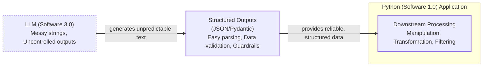

# Lesson 4: Structured Outputs

In our previous lessons, we laid the groundwork for AI Engineering. We explored the AI agent landscape, looked at the difference between rule-based LLM workflows and autonomous AI agents, and covered context engineering: the art of feeding the right information to an LLM. In this lesson, we will tackle a fundamental challenge: getting structured and reliable information *out* of an LLM.

LLMs operate in a world of unstructured data and probabilities, where we input instructions in plain English and get results as plain text. This subdomain of engineering is often called "Software 3.0". Our application, however, relies on deterministic code and predictable data structures, which is known as "Software 1.0". Structured outputs are the bridge between these two worlds, a fundamental technique for forcing LLMs to return consistent, machine-readable data. Mastering this is essential for any AI engineer building production-grade systems.

## Understanding why structured outputs are critical

Before we start coding, it is important to understand why structured outputs are foundational to building reliable AI applications. When an LLM returns a free-form string, you face the messy task of parsing it. This often involves fragile regular expressions or string-splitting logic that can easily break if the model changes its phrasing even slightly [[1]](https://pmc.ncbi.nlm.nih.gov/articles/PMC11751965/), [[2]](https://dev.to/pockit_tools/llm-structured-output-in-2026-stop-parsing-json-with-regex-and-do-it-right-34pk). Structured outputs solve this by forcing the model’s response into a predictable format like JSON.

This approach offers several key benefits. First, structured outputs are easy to parse and manipulate. Instead of wrestling with raw text, you work with clean Python objects, making your code more predictable and easier to debug. Second, using libraries like Pydantic adds a layer of data and type validation [[3]](https://machinelearningmastery.com/the-complete-guide-to-using-pydantic-for-validating-llm-outputs). If the LLM returns a string where an integer is expected, your application raises a clear validation error immediately, preventing bad data from propagating. This "fail-fast" behavior is essential for building reliable systems.

However, this reliability can come with a trade-off. Research suggests that forcing LLMs into strict formats like JSON or XML can degrade their reasoning abilities compared to free-form text [[4]](https://arxiv.org/abs/2408.02442v1). This is a key consideration: while structured outputs give you control, they might constrain performance on complex tasks.

Structured outputs create a formal contract between the LLM and your application code, much like an OpenAPI specification defines a contract for a traditional web API [[5]](https://tianpan.co/blog/2026-04-12-llm-output-as-api-contract-versioning-structured-responses). This makes the entire system more verifiable and auditable [[6]](https://www.leewayhertz.com/structured-outputs-in-llms). This makes it easier to orchestrate steps in a workflow, passing data to the next LLM call or a downstream system like a database or API [[7]](https://www.decodingai.com/p/llm-structured-outputs-the-only-way). For example, a common use case is extracting entities like names, tags, and dates from text to build knowledge graphs for advanced RAG.


Image 1: A flowchart illustrating the critical role of structured outputs in formatting LLM output for downstream processing.

To see how this works in practice, we will explore three methods for implementing structured outputs: from scratch with JSON, from scratch with Pydantic, and natively with the Gemini API.

## Implementing structured outputs from scratch using JSON

To understand what modern LLM APIs offer, we will first implement structured outputs from scratch by guiding an LLM to generate a JSON object. This hands-on approach builds intuition about the underlying mechanics.

While JSON is common, formats like YAML are often more token-efficient. JSON’s syntax (braces, quotes, commas) is verbose for tokenizers. YAML, using indentation, eliminates much of this, saving 15-50% on tokens [[8]](https://tashif.codes/blog/JSON-YAML-LLM). This can lead to significant cost savings at scale. We will start with JSON as it is universally supported and a great foundation for the core concepts.

<aside>
💡

You can find the code for this lesson in the notebook for Lesson 4 in the course's GitHub repository.

</aside>

Our goal is to prompt the model to return a JSON object containing metadata extracted from a financial document, then parse it into a Python dictionary.

1.  First, we set up our environment by initializing the Gemini client from the `google-genai` package and defining the model we will use. For this example, we will use `gemini-3.5-flash`, which is fast and cost-effective.
    ```python
    import json
    
    from google import genai
    from utils import env
    
    env.load(required_env_vars=["GOOGLE_API_KEY"])
    
    client = genai.Client()
    
    MODEL_ID = "gemini-3.5-flash"
    ```

2.  Next, we define a sample document for the LLM to analyze.
    ```python
    DOCUMENT = """
    # Q3 2023 Financial Performance Analysis
    
    The Q3 earnings report shows a 20% increase in revenue and a 15% growth in user engagement, 
    beating market expectations. These impressive results reflect our successful product strategy 
    and strong market positioning.
    
    Our core business segments demonstrated remarkable resilience, with digital services leading 
    the growth at 25% year-over-year. The expansion into new markets has proven particularly 
    successful, contributing to 30% of the total revenue increase.
    
    Customer acquisition costs decreased by 10% while retention rates improved to 92%, 
    marking our best performance to date. These metrics, combined with our healthy cash flow 
    position, provide a strong foundation for continued growth into Q4 and beyond.
    """
    ```

3.  We craft a prompt that instructs the LLM to extract metadata and format it as JSON. We provide a clear example of the desired structure and use XML tags like `<document>` and `<json>` to separate the input data from the formatting instructions. This is an effective prompt engineering technique because the tags create clear boundaries that the model can easily distinguish, reducing ambiguity between instructions and raw data [[9]](https://aws.amazon.com/blogs/machine-learning/structured-data-response-with-amazon-bedrock-prompt-engineering-and-tool-use/). Providing a concrete example of the JSON structure also acts as a one-shot example, guiding the model to replicate the format precisely.
    ```python
    prompt = f"""
    Analyze the following document and extract metadata from it. 
    The output must be a single, valid JSON object with the following structure:
    <json>
    {{ 
        "summary": "A concise summary of the article.", 
        "tags": ["list", "of", "relevant", "tags"], 
        "keywords": ["list", "of", "key", "concepts"],
        "quarter": "Q...",
        "growth_rate": "...%",
    }}
    </json>
    
    Here is the document:
    <document>
    {DOCUMENT}
    </document>
    """
    ```

4.  We send the prompt to the model using the `generate_content` method and inspect the raw response.
    ```python
    response = client.models.generate_content(model=MODEL_ID, contents=prompt)
    ```
    As expected, the model returns a JSON object. It is often wrapped in Markdown code blocks because models are trained to present code and structured data in a human-readable format.
    ```
    ```json
    {
        "summary": "The Q3 2023 financial report highlights a strong performance with a 20% increase in revenue and 15% growth in user engagement, surpassing market expectations. This success is attributed to a robust product strategy, effective market positioning, and successful expansion into new markets, leading to improved customer retention and reduced acquisition costs.",
        "tags": [
            "financials",
            "earnings report",
            "business performance",
            "revenue growth",
            "market expansion",
            "Q3 2023"
        ],
        "keywords": [
            "Q3 2023",
            "revenue",
            "user engagement",
            "market expectations",
            "product strategy",
            "market positioning",
            "digital services",
            "new markets",
            "customer acquisition costs",
            "retention rates",
            "cash flow"
        ],
        "quarter": "Q3 2023",
        "growth_rate": "20%"
    }
    ```
    ```

5.  To handle this, we create a helper function to strip the Markdown tags and XML wrappers. This function uses simple string replacement to clean the output, leaving a pure JSON string that can be safely parsed.
    ```python
    def extract_json_from_response(response: str) -> dict:
        """
        Extracts JSON from a response string that is wrapped in <json> or ```json tags.
        """
    
        response = response.replace("<json>", "").replace("</json>", "")
        response = response.replace("```json", "").replace("```", "")
    
        return json.loads(response)
    ```

6.  Finally, we parse the string into a Python dictionary. This `parsed_response` object can now be used in our application, allowing us to access data programmatically, for example, `parsed_response['summary']`.
    ```python
    parsed_response = extract_json_from_response(response.text)
    ```
    The `parsed_response` object now holds the structured data:
    ```json
    {
      "summary": "The Q3 2023 financial report highlights a strong performance with a 20% increase in revenue and 15% growth in user engagement, surpassing market expectations. This success is attributed to a robust product strategy, effective market positioning, and successful expansion into new markets, leading to improved customer retention and reduced acquisition costs.",
      "tags": [
        "financials",
        "earnings report",
        "business performance",
        "revenue growth",
        "market expansion",
        "Q3 2023"
      ],
      "keywords": [
        "Q3 2023",
        "revenue",
        "user engagement",
        "market expectations",
        "product strategy",
        "market positioning",
        "digital services",
        "new markets",
        "customer acquisition costs",
        "retention rates",
        "cash flow"
      ],
      "quarter": "Q3 2023",
      "growth_rate": "20%"
    }
    ```

This manual method works, but it relies on post-processing and lacks data validation. The `extract_json_from_response` function is fragile; if the LLM changes its output format even slightly (e.g., adds a preamble like "Here is the JSON you requested:"), our string replacement logic will fail. Furthermore, if the model makes a mistake inside the JSON, such as outputting a string instead of an integer, our application will not catch the error until it causes a problem downstream. Next, we will see how Pydantic provides a much more robust solution.

## Implementing structured outputs from scratch using Pydantic

Forcing JSON output is an improvement, but it still leaves you with a plain Python dictionary. You cannot be sure what is inside it, whether the keys are correct, or if the values have the right type. Pydantic is a data validation library that solves this by enforcing structure and type hints at runtime, ensuring data integrity from the moment data enters your application [[10]](https://www.freecodecamp.org/news/how-to-keep-llm-outputs-predictable-using-pydantic-validation). It provides a single source of truth for your data structure and can automatically generate a JSON Schema from your Python class.

When an LLM produces output that does not match your Pydantic model, the library raises a `ValidationError` that clearly explains what went wrong. This "fail-fast" behavior is essential for building reliable systems, preventing bad data from moving through your application and causing hard-to-debug errors later. This is a major improvement over simple JSON parsing, as it introduces a validation layer that catches errors early.

Let's refactor our previous example to use Pydantic.

1.  We define our desired data structure as a Pydantic class. Pydantic works with Python’s `typing` module, but starting with Python 11, you can use built-in types like `list` directly. For example, `tags: list[str]` is now preferred over importing `List` from `typing`. We have modified the `DocumentMetadata` model to showcase more of Pydantic’s power. We changed `growth_rate` to `growth_rate_percent` and its type to `int`, adding constraints using `Field` to ensure the value is between 0 and 1000 [[3]](https://machinelearningmastery.com/the-complete-guide-to-using-pydantic-for-validating-llm-outputs). We also added a `sentiment` field using `Literal` from Python's `typing` module, which restricts the output to one of the predefined string values [[11]](https://dev.to/klement_gunndu/stop-parsing-json-by-hand-structured-llm-outputs-with-pydantic-1pg0).
    ```python
    from pydantic import BaseModel, Field
    from typing import Literal
    
    class DocumentMetadata(BaseModel):
        """A class to hold structured metadata for a document."""
    
        summary: str = Field(description="A concise, 1-2 sentence summary of the document.")
        tags: list[str] = Field(description="A list of 3-5 high-level tags relevant to the document.")
        keywords: list[str] = Field(description="A list of specific keywords or concepts mentioned.")
        quarter: str = Field(description="The quarter of the financial year described in the document (e.g, Q3 2023).")
        sentiment: Literal["positive", "neutral", "negative"] = Field(description="The overall sentiment of the document.")
        growth_rate_percent: int = Field(
            description="The growth rate of the company as an integer (e.g., 20 for 20%).",
            ge=0, # greater than or equal to 0
            le=1000, # less than or equal to 1000
        )
    ```
    You can also nest Pydantic models to represent more complex, hierarchical data [[12]](https://dev.to/mechcloud_academy/going-deeper-with-pydantic-nested-models-and-data-structures-4e24). This allows you to define intricate relationships between different pieces of information. However, it is good practice to keep schemas as simple as possible, as complex nested structures can confuse the LLM and lead to errors. Here is how you could define a more complex structure:
    ```python
    class Summary(BaseModel):
        text: str
        sentiment: float
    
    class Tag(BaseModel):
        label: str
        relevance: float
    
    class ComplexDocumentMetadata(BaseModel):
        summary: Summary
        tags: list[Tag]
    ```
    When this `ComplexDocumentMetadata` model is converted to a JSON Schema, Pydantic automatically handles the nested structure by creating definitions for `Summary` and `Tag` and referencing them using `$ref`. This creates a clean, modular schema that is easy for both humans and machines to understand.

2.  With our Pydantic model defined, we can automatically generate a JSON Schema from it. A schema is the standard for defining the structure and constraints of your data, acting as a formal contract between your application and the LLM [[7]](https://www.decodingai.com/p/llm-structured-outputs-the-only-way). This technique is similar to what APIs like Gemini and OpenAI use internally to enforce a specific output format [[13]](https://pydantic.dev/articles/llm-intro), [[14]](https://ai.google.dev/gemini-api/docs/structured-output). Internally, this is often done via constrained decoding. At each step, the model calculates probabilities (logits) for every possible next token. To enforce a schema, a logit mask is applied, setting the probability of any invalid token to zero [[15]](https://www.bentoml.com/blog/structured-decoding-in-vllm-a-gentle-introduction). This forces the model to only generate tokens that are valid at that point in the structure, ensuring compliance.
    ```python
    schema = DocumentMetadata.model_json_schema()
    ```
    The generated schema is detailed and includes descriptions from the `Field` definitions to guide the generation process:
    ```json
    {'description': 'A class to hold structured metadata for a document.',
     'properties': {'summary': {'description': 'A concise, 1-2 sentence summary of the document.',
       'title': 'Summary',
       'type': 'string'},
      'tags': {'description': 'A list of 3-5 high-level tags relevant to the document.',
       'items': {'type': 'string'},
       'title': 'Tags',
       'type': 'array'},
      'keywords': {'description': 'A list of specific keywords or concepts mentioned.',
       'items': {'type': 'string'},
       'title': 'Keywords',
       'type': 'array'},
      'quarter': {'description': 'The quarter of the financial year described in the document (e.g, Q3 2023).',
       'title': 'Quarter',
       'type': 'string'},
      'sentiment': {'description': 'The overall sentiment of the document.',
       'enum': ['positive', 'neutral', 'negative'],
       'title': 'Sentiment',
       'type': 'string'},
      'growth_rate_percent': {'description': 'The growth rate of the company as an integer (e.g., 20 for 20%).',
       'le': 1000,
       'ge': 0,
       'title': 'Growth Rate Percent',
       'type': 'integer'}},
     'required': ['summary',
      'tags',
      'keywords',
      'quarter',
      'sentiment',
      'growth_rate_percent'],
     'title': 'DocumentMetadata',
     'type': 'object'}
    ```

3.  We update our prompt to include this JSON Schema.
    ```python
    prompt = f"""
    Please analyze the following document and extract metadata from it. 
    The output must be a single, valid JSON object that conforms to the following JSON Schema:
    <json>
    {json.dumps(schema, indent=2)}
    </json>
    
    Here is the document:
    <document>
    {DOCUMENT}
    </document>
    """
    ```

4.  We call the model and extract the JSON string as before.
    ```python
    response = client.models.generate_content(model=MODEL_ID, contents=prompt)
    
    parsed_response = extract_json_from_response(response.text)
    ```
    It outputs:
    ```json
    {
      "summary": "The Q3 2023 earnings report indicates strong financial performance with a 20% increase in revenue and 15% growth in user engagement, driven by successful product strategy, market expansion, and improved customer retention.",
      "tags": [
        "Financial Performance",
        "Earnings Report",
        "Business Growth",
        "Revenue Growth",
        "Market Expansion"
      ],
      "keywords": [
        "Q3 2023",
        "revenue increase",
        "user engagement",
        "digital services",
        "new markets",
        "customer acquisition costs",
        "retention rates",
        "cash flow"
      ],
      "quarter": "Q3 2023",
      "sentiment": "positive",
      "growth_rate_percent": 20
    }
    ```

5.  Now, we can load the output dictionary into our Pydantic model and validate it.
    ```python
    try:
        document_metadata = DocumentMetadata.model_validate(parsed_response)
        print("\nValidation successful!")
    except Exception as e:
        print(f"\nValidation failed: {e}")
    ```
    It outputs:
    ```
    Validation successful!
    ```
    The `document_metadata` object can now be safely used throughout your application. The core idea is to use these predictable Pydantic objects in downstream components, not obscure Python dictionaries. With dictionaries, you constantly have to write defensive code, checking for missing keys or incorrect types, which pollutes your logic with `if-else` statements and `try-except` blocks. Pydantic objects eliminate this, providing clean, type-safe attribute access and better IDE support like autocompletion.

### Pydantic vs. TypedDict and Dataclasses

While Pydantic is a powerful tool, it is worth knowing about other options in Python for defining data structures. Python’s built-in `dataclasses` and `TypedDict` also help define structure, but they serve different purposes [[16]](https://shazaali.substack.com/p/type-safety-in-langgraph-when-to), [[17]](https://dev.to/hevalhazalkurt/dataclasses-vs-pydantic-vs-typeddict-vs-namedtuple-in-python-41gg).

**TypedDict** is a feature from the `typing` module that provides static type checking for dictionary keys and values. It is lightweight and fast because it does not perform any validation at runtime. This makes it suitable for internal type hints where you trust the data source, but it offers no protection against invalid data from an external source like an LLM [[18]](https://www.packetcoders.io/typeddict-vs-pydantic).

**Dataclasses** are a convenient way to create classes for storing data. They automatically generate methods like `__init__` and `__repr__`, reducing boilerplate code. However, like `TypedDict`, they do not perform runtime validation by default. If an LLM returns a string where an integer is expected, a dataclass will not catch the error upon instantiation [[19]](https://softwarelogic.co/en/blog/pydantic-vs-dataclasses-which-excels-at-python-data-validation).

Pydantic, on the other hand, is built specifically for runtime data validation and parsing. While this adds a small performance overhead compared to dataclasses, the safety it provides is invaluable when dealing with unpredictable LLM outputs [[20]](https://www.speakeasy.com/blog/pydantic-vs-dataclasses). For this reason, Pydantic has become the standard for modeling data in AI applications.

## Implementing structured outputs using Gemini and Pydantic

While our manual approach with Pydantic adds validation, modern APIs like Gemini and OpenAI offer native features for structured outputs. This method is simpler, more accurate, and often more cost-effective, as the vendor handles optimizations better than manual prompting [[14]](https://ai.google.dev/gemini-api/docs/structured-output), [[21]](https://medium.com/google-cloud/structured-output-with-gemini-models-begging-borrowing-and-json-ing-f70ffd60eae6).

However, there are trade-offs to consider. The first API call with a new schema may have higher latency as the service processes and caches it for future use [[22]](https://community.openai.com/t/introducing-structured-outputs/896022). More importantly, some studies show that this constrained decoding can degrade performance on complex reasoning tasks [[23]](https://dylancastillo.co/posts/gemini-structured-outputs.html). Be aware that Gemini's SDK has also been observed to reorder keys in the output schema alphabetically, which can break chain-of-thought logic if your schema relies on a specific field order (e.g., `reasoning` before `answer`).

Let’s see how to achieve the same result using the Gemini API’s native capabilities.

1.  We define a `GenerateContentConfig` object, instructing the Gemini API to set the `response_mime_type` to `"application/json"` and the `response_schema` to our `DocumentMetadata` Pydantic model. This configures the model to output JSON that is then automatically converted to the given Pydantic model.
    ```python
    from google.genai import types
    
    config = types.GenerateContentConfig(response_mime_type="application/json", response_schema=DocumentMetadata)
    ```

2.  This configuration makes our prompt significantly shorter and cleaner, as the output format is guided directly by the config.
    ```python
    prompt = f"""
    Analyze the following document and extract its metadata.
    
    Here is the document:
    <document>
    {DOCUMENT}
    </document>
    """
    ```

3.  Now, we call the model, passing our simplified prompt and the new configuration object. The API handles the rest.
    ```python
    response = client.models.generate_content(model=MODEL_ID, contents=prompt, config=config)
    ```

4.  The Gemini client automatically parses the output. By accessing the `response.parsed` attribute, we receive a ready-to-use instance of our `DocumentMetadata` Pydantic model.
    ```python
    document_metadata = response.parsed
    print(f"Type of the response: `{type(response.parsed)}`")
    ```
    It outputs:
    ```
    Type of the response: `<class '__main__.DocumentMetadata'>`
    ```
This native approach is robust, efficient, and requires less code. While it is the recommended way for most modern APIs, the "from scratch" method remains useful for open-source models. For those, libraries like `Instructor` or `Outlines` can provide similar schema-enforcing capabilities [[24]](https://agenta.ai/blog/the-guide-to-structured-outputs-and-function-calling-with-llms).

## Structured Outputs Are Everywhere

We have covered the why and how of structured outputs, from manual prompting to native API integration. This technique is a fundamental pattern in AI engineering, connecting the probabilistic nature of LLMs with deterministic software. In high-stakes fields like healthcare, it is used to extract clinical data from notes or ensure regulatory compliance documents adhere to a strict format [[25]](https://ebiquity.umbc.edu/get/a/publication/1476.pdf). Whether you are building a simple summarization workflow or a complex research agent, you will use structured outputs to ensure reliability and control.

This pattern will be a recurring theme throughout this course. In our next lesson, we will explore the basic ingredients of LLM workflows, where we will see how structured data flows between different components. Later, when we build agents that can take action or reason about the world, structured outputs will be how they parse information and decide what to do next. Mastering this technique is a key step toward building powerful and predictable AI systems.

## References

- [1] Ntinopoulos, V., Biefer, H. R. C., Tudorache, I., Papadopoulos, N., Odavic, D., Risteski, P., Haeussler, A., & Dzemali, O. (2024). Large language models for data extraction from unstructured and semi-structured electronic health records: a multiple model performance evaluation. BMJ Health & Care Informatics, 32(1), e101139. https://pmc.ncbi.nlm.nih.gov/articles/PMC11751965/
- [2] LLM structured output in 2026 - stop parsing JSON with regex and do it right. (n.d.). DEV Community. https://dev.to/pockit_tools/llm-structured-output-in-2026-stop-parsing-json-with-regex-and-do-it-right-34pk
- [3] The Complete Guide to Using Pydantic for Validating LLM Outputs. (n.d.). Machine Learning Mastery. https://machinelearningmastery.com/the-complete-guide-to-using-pydantic-for-validating-llm-outputs
- [4] Let Me Speak Freely? A Study on the Impact of Format Restrictions on Performance of Large Language Models. (2024). arXiv. https://arxiv.org/abs/2408.02442v1
- [5] Tian, P. (2026, April 12). LLM Output as API Contract: Versioning Structured Responses. Tianpan.co. https://tianpan.co/blog/2026-04-12-llm-output-as-api-contract-versioning-structured-responses
- [6] Structured outputs in LLMs: Definition, techniques, applications, benefits. (n.d.). LeewayHertz. https://www.leewayhertz.com/structured-outputs-in-llms
- [7] Structured Outputs: The Silent Hero of Production AI. (n.d.). Decoding AI. https://www.decodingai.com/p/llm-structured-outputs-the-only-way
- [8] Khan, T. A. (2025, October 15). YAML Over JSON in Large Language Model Applications. Tashif.codes. https://tashif.codes/blog/JSON-YAML-LLM
- [9] (2024, June 26). Structured data response with Amazon Bedrock: Prompt Engineering and Tool Use. Amazon Web Services. https://aws.amazon.com/blogs/machine-learning/structured-data-response-with-amazon-bedrock-prompt-engineering-and-tool-use/
- [10] How to Keep LLM Outputs Predictable Using Pydantic Validation. (n.d.). freeCodeCamp.org. https://www.freecodecamp.org/news/how-to-keep-llm-outputs-predictable-using-pydantic-validation
- [11] Stop Parsing JSON By Hand: Structured LLM Outputs with Pydantic. (n.d.). DEV Community. https://dev.to/klement_gunndu/stop-parsing-json-by-hand-structured-llm-outputs-with-pydantic-1pg0
- [12] Going Deeper with Pydantic: Nested Models and Data Structures. (n.d.). DEV Community. https://dev.to/mechcloud_academy/going-deeper-with-pydantic-nested-models-and-data-structures-4e24
- [13] Liu, J. (2024, January 4). Steering Large Language Models with Pydantic. Pydantic. https://pydantic.dev/articles/llm-intro
- [14] Structured output. (n.d.). Google AI for Developers. https://ai.google.dev/gemini-api/docs/structured-output
- [15] Structured Decoding in vLLM: A Gentle Introduction. (n.d.). BentoML. https://www.bentoml.com/blog/structured-decoding-in-vllm-a-gentle-introduction
- [16] Type Safety in LangGraph: When to Use Pydantic vs TypedDict. (n.d.). shazaali.substack.com. https://shazaali.substack.com/p/type-safety-in-langgraph-when-to
- [17] Dataclasses vs Pydantic vs TypedDict vs NamedTuple in Python. (n.d.). DEV Community. https://dev.to/hevalhazalkurt/dataclasses-vs-pydantic-vs-typeddict-vs-namedtuple-in-python-41gg
- [18] TypedDict vs Pydantic. (n.d.). Packet Coders. https://www.packetcoders.io/typeddict-vs-pydantic
- [19] Pydantic vs Dataclasses: Which Excels at Python Data Validation? (n.d.). Software Logic. https://softwarelogic.co/en/blog/pydantic-vs-dataclasses-which-excels-at-python-data-validation
- [20] Pydantic vs. Data Classes vs. Annotations vs. TypedDicts. (n.d.). Speakeasy. https://www.speakeasy.com/blog/pydantic-vs-dataclasses
- [21] Structured Output with Gemini Models: Begging, Borrowing, and JSON-ing. (n.d.). Medium. https://medium.com/google-cloud/structured-output-with-gemini-models-begging-borrowing-and-json-ing-f70ffd60eae6
- [22] Introducing Structured Outputs. (2024). OpenAI Community. https://community.openai.com/t/introducing-structured-outputs/896022
- [23] Castillo, D. (n.d.). The good, the bad, and the ugly of Gemini’s structured outputs. Dylan Castillo. https://dylancastillo.co/posts/gemini-structured-outputs.html
- [24] The guide to structured outputs and function calling with LLMs. (2025, September 10). Agenta. https://agenta.ai/blog/the-guide-to-structured-outputs-and-function-calling-with-llms
- [25] An LLM-based Knowledge Graph approach for Automated Medical Device Regulatory Compliance. (n.d.). UMBC. https://ebiquity.umbc.edu/get/a/publication/1476.pdf