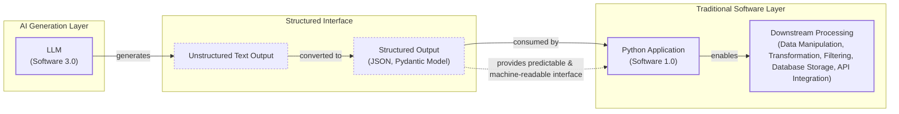

# Lesson 4: Structured Outputs

In our previous lessons, we laid the groundwork for AI Engineering. We explored the AI agent landscape, looked at the difference between rule-based LLM workflows and autonomous AI agents, and covered context engineering: the art of feeding the right information to an LLM. In this lesson, we will tackle a fundamental challenge: getting structured and reliable information *out* of an LLM.

LLMs operate in a world of unstructured data and probabilities, where we input instructions in plain English and get results as plain text. This subdomain of engineering is often called "Software 3.0". Our application, however, relies on deterministic code and predictable data structures, which is known as "Software 1.0". Structured outputs are the bridge between these two worlds, a fundamental technique for forcing LLMs to return consistent, machine-readable data. Mastering this is essential for any AI engineer building production-grade systems.

## Understanding why structured outputs are critical

Before you start coding, it is important to understand why structured outputs are foundational to building reliable AI applications. When an LLM returns a free-form string, you face the messy task of parsing it. This often involves fragile regular expressions or string-splitting logic. These methods easily break if the model changes its phrasing even slightly, a common problem in production systems where inputs can be unpredictable [[1]](https://pmc.ncbi.nlm.nih.gov/articles/PMC11751965/), [[2]](https://arxiv.org/html/2506.21585v1). Structured outputs solve this by forcing the model’s response into a predictable format like JSON.

This approach offers several key benefits. First, structured outputs are easy to parse, manipulate, and debug. Instead of wrestling with raw text, you work with clean Python objects, making your code more predictable. Using libraries like Pydantic adds a layer of data and type validation [[3]](https://www.speakeasy.com/blog/pydantic-vs-dataclasses), [[4]](https://codetain.com/blog/validators-approach-in-python-pydantic-vs-dataclasses/). If the LLM returns a string where an integer is expected, your application raises a clear validation error immediately. This "fail-fast" behavior prevents bad data from propagating and causing hard-to-debug issues downstream.

Structured outputs create a formal contract between the LLM and your application code. This makes it easier to orchestrate data between steps in a workflow or pass it to downstream systems like databases, user interfaces, or APIs [[5]](https://www.prompts.ai/en/blog-details/automating-knowledge-graphs-with-llm-outputs), [[6]](https://humanloop.com/blog/structured-outputs). For example, a popular use case is extracting entities like names and dates to build knowledge graphs for advanced RAG systems. By enforcing a schema, you ensure the data is clean and ready for immediate use, without the need for extensive post-processing.


Image 1: A flowchart illustrating the process of formatting LLM output into a predefined data structure for downstream processing.

To understand how structured outputs work in practice, we will explore three ways to implement them: from scratch using JSON, from scratch using Pydantic, and natively with the Gemini API.

## Implementing structured outputs from scratch using JSON

To understand what happens behind the scenes, we will first implement structured outputs from scratch by prompting the model to output JSON structures. This manual method builds intuition for the automated features that modern LLM APIs provide.

<aside>
💡
You can find the code of this lesson in the notebook of Lesson 4, in the GitHub repository of the course.
</aside>

Our goal is to prompt the model to return a JSON object and then parse it into a Python dictionary. We will demonstrate this with a simple example where we extract key details from a financial document. This is a common real-world task where consistency and accuracy are critical.

1.  First, we define our Gemini client and set the model ID. We will use `gemini-3.5-flash` for these examples, which is fast and cost-effective. This setup is the foundation for all our interactions with the model.
    ```python
    import json
    
    from google import genai
    from utils import env
    
    env.load(required_env_vars=["GOOGLE_API_KEY"])
    
    client = genai.Client()
    
    MODEL_ID = "gemini-3.5-flash"
    ```

2.  Next, we define a sample document for analysis. This text serves as the unstructured input that we want to convert into a structured format.
    ```python
    DOCUMENT = """
    # Q3 2023 Financial Performance Analysis
    
    The Q3 earnings report shows a 20% increase in revenue and a 15% growth in user engagement, 
    beating market expectations. These impressive results reflect our successful product strategy 
    and strong market positioning.
    
    Our core business segments demonstrated remarkable resilience, with digital services leading 
    the growth at 25% year-over-year. The expansion into new markets has proven particularly 
    successful, contributing to 30% of the total revenue increase.
    
    Customer acquisition costs decreased by 10% while retention rates improved to 92%, 
    marking our best performance to date. These metrics, combined with our healthy cash flow 
    position, provide a strong foundation for continued growth into Q4 and beyond.
    """
    ```

3.  Now, we craft a prompt that instructs the LLM to extract metadata and format it as JSON. We provide a clear example of the desired structure and use XML tags like `<document>` and `<json>` to separate the input from the instructions. This is an effective prompt engineering technique for improving clarity and guiding the model’s output, as it helps the model distinguish between content and commands [[7]](https://aws.amazon.com/blogs/machine-learning/structured-data-response-with-amazon-bedrock-prompt-engineering-and-tool-use/), [[8]](https://help.openai.com/en/articles/6654000-best-practices-for-prompt-engineering-with-the-openai-api).
    ```python
    prompt = f"""
    Analyze the following document and extract metadata from it. 
    The output must be a single, valid JSON object with the following structure:
    <json>
    {{ 
        "summary": "A concise summary of the article.", 
        "tags": ["list", "of", "relevant", "tags"], 
        "keywords": ["list", "of", "key", "concepts"],
        "quarter": "Q...",
        "growth_rate": "...%",
    }}
    </json>
    
    Here is the document:
    <document>
    {DOCUMENT}
    </document>
    """
    ```

4.  We send the prompt to the model, which processes our request and generates a response.
    ```python
    response = client.models.generate_content(model=MODEL_ID, contents=prompt)
    ```

5.  The model returns a JSON object, but it is often wrapped in Markdown code blocks or other extraneous text. This is a common behavior that we need to account for in our parsing logic.
    ```text
      ```json
      {
          "summary": "The Q3 2023 financial report highlights a strong performance with a 20% increase in revenue and 15% growth in user engagement, surpassing market expectations. This success is attributed to a robust product strategy, effective market positioning, and successful expansion into new markets, leading to improved customer retention and reduced acquisition costs.",
          "tags": [
              "financials",
              "earnings report",
              "business performance",
              "revenue growth",
              "market expansion",
              "Q3 2023"
          ],
          "keywords": [
              "Q3 2023",
              "revenue",
              "user engagement",
              "market expectations",
              "product strategy",
              "market positioning",
              "digital services",
              "new markets",
              "customer acquisition costs",
              "retention rates",
              "cash flow"
          ],
          "quarter": "Q3 2023",
          "growth_rate": "20%"
      }
      ```
    ```

6.  To handle this, we create a helper function to strip the Markdown tags and other non-JSON text, leaving a clean JSON string that can be safely parsed. This function makes our system more resilient to variations in the LLM's output format.
    ```python
    def extract_json_from_response(response: str) -> dict:
        """
        Extracts JSON from a response string that is wrapped in <json> or ```json tags.
        """
    
        response = response.replace("<json>", "").replace("</json>", "")
        response = response.replace("```json", "").replace("```", "")
    
        return json.loads(response)
    ```

7.  Finally, we parse the cleaned string into a Python dictionary.
    ```python
    parsed_response = extract_json_from_response(response.text)
    ```

8.  The dictionary can now be used in our application, allowing us to programmatically access the extracted data.
    ```json
    {
        "summary": "The Q3 2023 financial report highlights a strong performance with a 20% increase in revenue and 15% growth in user engagement, surpassing market expectations. This success is attributed to a robust product strategy, effective market positioning, and successful expansion into new markets, leading to improved customer retention and reduced acquisition costs.",
        "tags": [
            "financials",
            "earnings report",
            "business performance",
            "revenue growth",
            "market expansion",
            "Q3 2023"
        ],
        "keywords": [
            "Q3 2023",
            "revenue",
            "user engagement",
            "market expectations",
            "product strategy",
            "market positioning",
            "digital services",
            "new markets",
            "customer acquisition costs",
            "retention rates",
            "cash flow"
        ],
        "quarter": "Q3 2023",
        "growth_rate": "20%"
    }
    ```

This "from scratch" method works, but it relies on manual parsing and lacks data validation. If the LLM makes a mistake like outputting a string instead of an integer or missing a key, our application will fail. Next, we will see how Pydantic provides a much more robust solution.

## Implementing structured outputs from scratch using Pydantic

Forcing JSON output is an improvement, but it still leaves you with a plain Python dictionary. You cannot be sure what is inside it, if the keys are correct, or if the values have the right type. This uncertainty can lead to bugs and make your code difficult to maintain. Pydantic solves this problem. It is a data validation library that enforces structure and type hints at runtime, ensuring data integrity from the moment data enters your application [[3]](https://www.speakeasy.com/blog/pydantic-vs-dataclasses).

When an LLM produces output that does not match your Pydantic model, the library raises a `ValidationError`. This error clearly explains what went wrong, allowing you to quickly identify and fix issues. For example, if the LLM returns a string instead of an integer for a field, Pydantic will catch it immediately. This "fail-fast" behavior is essential for building reliable systems, preventing bad data from moving through your application and causing hard-to-debug errors later.

1.  We define our desired data structure as a Pydantic class. This class acts as a single source of truth for your output format. We use standard Python type hints to define the expected type for each field. Pydantic works with Python’s `typing` module. Still, starting with Python 11, you can use built-in types like `list` directly, making the code cleaner. For example, `tags: list[str]` is now preferred over importing `List` from `typing`.
    ```python
    from pydantic import BaseModel, Field
    
    class DocumentMetadata(BaseModel):
        """A class to hold structured metadata for a document."""
    
        summary: str = Field(description="A concise, 1-2 sentence summary of the document.")
        tags: list[str] = Field(description="A list of 3-5 high-level tags relevant to the document.")
        keywords: list[str] = Field(description="A list of specific keywords or concepts mentioned.")
        quarter: str = Field(description="The quarter of the financial year described in the document (e.g, Q3 2023).")
        growth_rate: str = Field(description="The growth rate of the company described in the document (e.g, 10%).")
    ```

2.  You can also nest Pydantic models to represent more complex, hierarchical data. This allows you to define intricate relationships between different pieces of information, such as a `DocumentMetadata` model containing a `Summary` object and a list of `Tag` objects. Pydantic recursively validates these nested structures, ensuring data integrity at every level. However, it is a good practice to keep schemas from becoming overly complex, as it can confuse the LLM and lead to errors.
    ```python
    class Summary(BaseModel):
        text: str
        sentiment: float
    
    class Tag(BaseModel):
        label: str
        relevance: float
    
    class ComplexDocumentMetadata(BaseModel):
        summary: Summary
        tags: list[Tag]
    ```

3.  With our Pydantic model defined, we can automatically generate a JSON Schema from it. A schema is the standard term for defining the structure and constraints of your data. It is a formal contract between your application and the LLM. This contract precisely dictates the expected fields, their types, and any validation rules. We provide this generated schema to the LLM to guide its output, giving the model a clear blueprint for its response. This is similar to the technique used internally by APIs like Gemini and OpenAI to enforce a specific output format, ensuring their models adhere to predefined structures [[9]](https://ai.google.dev/gemini-api/docs/structured-output).
    ```python
    schema = DocumentMetadata.model_json_schema()
    ```

4.  The generated schema is detailed and includes descriptions from the `Field` definitions to guide the generation process. This makes Pydantic the perfect tool for defining your schemas, as the documentation for your data structure also serves as instructions for the LLM.
    ```json
    {'description': 'A class to hold structured metadata for a document.',
     'properties': {'summary': {'description': 'A concise, 1-2 sentence summary of the document.',
       'title': 'Summary',
       'type': 'string'},
      'tags': {'description': 'A list of 3-5 high-level tags relevant to the document.',
       'items': {'type': 'string'},
       'title': 'Tags',
       'type': 'array'},
      'keywords': {'description': 'A list of specific keywords or concepts mentioned.',
       'items': {'type': 'string'},
       'title': 'Keywords',
       'type': 'array'},
      'quarter': {'description': 'The quarter of the financial year described in the document (e.g, Q3 2023).',
       'title': 'Quarter',
       'type': 'string'},
      'growth_rate': {'description': 'The growth rate of the company described in the document (e.g, 10%).',
       'title': 'Growth Rate',
       'type': 'string'}},
     'required': ['summary', 'tags', 'keywords', 'quarter', 'growth_rate'],
     'title': 'DocumentMetadata',
     'type': 'object'}
    ```

5.  We update our prompt to include this JSON Schema. This gives the model a much more precise set of instructions than our previous plain-text example, reducing ambiguity and improving the reliability of the output.
    ```python
    prompt = f"""
    Please analyze the following document and extract metadata from it. 
    The output must be a single, valid JSON object that conforms to the following JSON Schema:
    <json>
    {json.dumps(schema, indent=2)}
    </json>
    
    Here is the document:
    <document>
    {DOCUMENT}
    </document>
    """
    ```

6.  Now we call the model and extract the JSON string, as in the previous example. The process is the same, but the underlying instruction to the model is far more robust.
    ```python
    response = client.models.generate_content(model=MODEL_ID, contents=prompt)
    
    parsed_response = extract_json_from_response(response.text)
    ```
    It outputs:
    ```json
    {
        "summary": "The Q3 2023 earnings report indicates strong financial performance with a 20% increase in revenue and 15% growth in user engagement, driven by successful product strategy, market expansion, and improved customer retention.",
        "tags": [
            "Financial Performance",
            "Earnings Report",
            "Business Growth",
            "Market Expansion",
            "Customer Metrics"
        ],
        "keywords": [
            "Q3 2023",
            "revenue increase",
            "user engagement",
            "digital services",
            "new markets",
            "customer acquisition costs",
            "retention rates",
            "cash flow"
        ],
        "quarter": "Q3 2023",
        "growth_rate": "20%"
    }
    ```

7.  Ultimately, we validate and parse it directly into our `DocumentMetadata` object. This step highlights the power of Pydantic. The `model_validate` method checks the dictionary against our class definition, ensuring all fields are present and have the correct types.
    ```python
    try:
        document_metadata = DocumentMetadata.model_validate(parsed_response)
        print("\nValidation successful!")
    
    except Exception as e:
        print(f"\nValidation failed: {e}")
    ```
    It outputs:
    ```text
    Validation successful!
    ```
    For example, if the LLM returned `"tags": "Financial Performance"` (a string) instead of a list, Pydantic would raise a `ValidationError` that pinpoints the error: `loc` would indicate the `tags` field, and `msg` would state that the input should be a valid list. This level of detail makes debugging significantly easier than handling a generic `TypeError` later in your code.

The `document_metadata` Pydantic object can now be safely used throughout your application, with full type-hinting and attribute access. This is the main advantage: you move away from unclear dictionaries, where you constantly check for missing keys or incorrect types, to clean, predictable Python objects.

Python’s built-in alternatives, `TypedDict` and `dataclasses`, are not suited for this task. `TypedDict` only provides hints for static analysis tools like `mypy`; it offers no runtime protection against incorrect data types from an LLM [[3]](https://www.speakeasy.com/blog/pydantic-vs-dataclasses), [[4]](https://codetain.com/blog/validators-approach-in-python-pydantic-vs-dataclasses/). Similarly, `dataclasses` are useful for reducing boilerplate code but do not perform runtime validation. They assume the input data is already correct, a risky assumption when dealing with probabilistic LLM outputs. Pydantic, in contrast, is designed for runtime validation. It enforces type hints when an object is created, catching errors at the boundary before they can propagate through your system. While `TypedDict` might be slightly faster in scenarios where validation is not needed, Pydantic's performance overhead is minimal compared to the data integrity it guarantees [[12]](https://docs.pydantic.dev/latest/concepts/performance/).

To conclude, Pydantic’s runtime validation, type constraints, and clear schema definitions make it the most popular and powerful way for structuring and validating all our domain data structures from our AI apps.

## Implementing structured outputs using Gemini and Pydantic

While Pydantic brings structure and validation, we still had to construct prompts and handle responses manually. When working with modern APIs such as Gemini and OpenAI, the recommended way to generate structured outputs is by leveraging their native features. As the prompt engineering is done directly by the vendor, it ensures that the most suitable method is used for their models. After all, they know best what the model was trained on.

Using their native configuration is simpler, more accurate, and often more cost-effective than manual prompt engineering. This allows you to focus on your application's logic instead of data wrangling [[9]](https://ai.google.dev/gemini-api/docs/structured-output), [[10]](https://www.vellum.ai/blog/when-should-i-use-function-calling-structured-outputs-or-json-mode), [[11]](https://www.googlecloudcommunity.com/gc/AI-ML/Structured-Output-in-vertexAI-BatchPredictionJob/m-p/866640).

Let’s see how to achieve the same result using the Gemini API's native capabilities. The process becomes much simpler.

1.  We define a `GenerateContentConfig` object, instructing the Gemini API to set the `response_mime_type` to `"application/json"` and the `response_schema` to our `DocumentMetadata` Pydantic model. This single configuration step replaces the manual schema injection and parsing we did earlier.
    ```python
    from google.genai import types
    
    config = types.GenerateContentConfig(response_mime_type="application/json", response_schema=DocumentMetadata)
    ```

2.  This configuration makes our prompt significantly shorter and cleaner, eliminating the need to manually inject JSON examples or full schemas. We simply ask the model to perform the task, as the instruction comes directly from the config.
    ```python
    prompt = f"""
    Analyze the following document and extract its metadata.
    
    Here is the document:
    <document>
    {DOCUMENT}
    </document>
    """
    ```

3.  Now, we call the model, passing our simplified prompt and the new configuration object. The API handles the rest, ensuring the output adheres to the schema.
    ```python
    response = client.models.generate_content(model=MODEL_ID, contents=prompt, config=config)
    ```

4.  The Gemini client automatically parses the output for us. By accessing the `response.parsed` attribute, we receive a ready-to-use instance of our `DocumentMetadata` Pydantic model. This eliminates the need for custom parsing functions or manual validation steps.
    ```python
    document_metadata = response.parsed
    print(f"Type of the response: `{type(document_metadata)}`")
    ```
    It outputs:
    ```text
    Type of the response: `<class '__main__.DocumentMetadata'>`
    ```
This native approach is the recommended way to generate structured outputs. It is robust, efficient, and requires less code, allowing you to focus on your application's logic instead of data wrangling.

## Structured Outputs Are Everywhere

We have covered the why and how of structured outputs, from manual prompting to native API integration. This technique is a fundamental pattern in AI engineering. It is the essential bridge connecting the probabilistic, free-form nature of LLMs with the deterministic, structured world of software applications. Whether you are building a simple workflow to summarize articles or a complex agent that analyzes financial data, you will use structured outputs. This ensures reliability and control.

This pattern will be a recurring theme throughout this course. In our next lesson, we will explore the basic ingredients of LLM workflows, where we will see how structured data flows between different components. Later, when we build agents that can take action (Lesson 6) or reason about the world (Lesson 7), structured outputs will be how they parse information and decide what to do next. Mastering this technique is a key step toward building powerful and predictable AI systems.

## References

- [1] [Large language models for data extraction from unstructured and semi-structured electronic health records: a multiple model performance evaluation](https://pmc.ncbi.nlm.nih.gov/articles/PMC11751965/)
- [2] [Evaluation of LLM-based Strategies for the Extraction of Food Product Information from Online Shops](https://arxiv.org/html/2506.21585v1)
- [3] [Type Safety in Python: Pydantic vs. Data Classes vs. Annotations vs. TypedDicts](https://www.speakeasy.com/blog/pydantic-vs-dataclasses)
- [4] [Validators approach in Python - Pydantic vs. Dataclasses](https://codetain.com/blog/validators-approach-in-python-pydantic-vs-dataclasses/)
- [5] [Automating Knowledge Graphs with LLM Outputs](https://www.prompts.ai/en/blog-details/automating-knowledge-graphs-with-llm-outputs)
- [6] [Structured Outputs: everything you should know](https://humanloop.com/blog/structured-outputs)
- [7] [Structured data response with Amazon Bedrock: Prompt Engineering and Tool Use](https://aws.amazon.com/blogs/machine-learning/structured-data-response-with-amazon-bedrock-prompt-engineering-and-tool-use/)
- [8] [Best practices for prompt engineering with the OpenAI API](https://help.openai.com/en/articles/6654000-best-practices-for-prompt-engineering-with-the-openai-api)
- [9] [Structured output](https://ai.google.dev/gemini-api/docs/structured-output)
- [10] [When should I use function calling, structured outputs or JSON mode?](https://www.vellum.ai/blog/when-should-i-use-function-calling-structured-outputs-or-json-mode)
- [11] [Structured Output in vertexAI BatchPredictionJob](https://www.googlecloudcommunity.com/gc/AI-ML/Structured-Output-in-vertexAI-BatchPredictionJob/m-p/866640)
- [12] [Performance](https://docs.pydantic.dev/latest/concepts/performance/)