# Lesson 4: Structured Outputs

In our previous lessons, we laid the groundwork for AI Engineering. We explored the AI agent landscape, looked at the difference between rule-based LLM workflows and autonomous AI agents, and covered context engineering: the art of feeding the right information to an LLM. In this lesson, we will tackle a fundamental challenge: getting structured and reliable information *out* of an LLM.

LLMs operate in a world of unstructured data and probabilities, where we input instructions in plain English and get results as plain text. This subdomain of engineering is often called "Software 3.0". Our application, however, relies on deterministic code and predictable data structures, which is known as "Software 1.0". Structured outputs are the bridge between these two worlds, a fundamental technique for forcing LLMs to return consistent, machine-readable data. Mastering this is essential for any AI engineer building production-grade systems.

## Understanding why structured outputs are critical

Before we start coding, it is crucial to understand why structured outputs are foundational to building reliable AI applications. When an LLM returns a free-form string, you face the messy task of parsing it. This often involves fragile regular expressions or string-splitting logic that can easily break if the model outputs change slightly [[1]](https://pmc.ncbi.nlm.nih.gov/articles/PMC11751965/), [[2]](https://arxiv.org/html/2506.21585v1). Structured outputs solve this by forcing the model’s response into a predictable format like JSON.

This approach offers several key benefits. First, structured outputs are easy to parse, manipulate, and debug. Instead of wrestling with raw text, you work with clean Python objects like dictionaries or, even better, Pydantic models. This allows you to programmatically access the data you need without guesswork. Using libraries like Pydantic adds a layer of data and type validation [[3]](https://www.speakeasy.com/blog/pydantic-vs-dataclasses). If the LLM returns a string where an integer is expected, your application will raise a clear validation error immediately, preventing bad data from propagating [[4]](https://codetain.com/blog/validators-approach-in-python-pydantic-vs-dataclasses/). This "fail-fast" behavior is essential for building reliable systems.

Ultimately, structured outputs create a formal contract between the LLM and your application code, connecting the probabilistic nature of LLMs with deterministic code. This makes it easier to pass data to downstream systems like databases, user interfaces, or other APIs. A common use case is extracting entities like names, dates, and tags to build knowledge graphs for advanced information retrieval systems. By ensuring the LLM generates only necessary data, you also reduce output tokens and control costs.

```mermaid
flowchart LR
  %% Start: Unstructured LLM Output
  LLM_Output["LLM Output<br/>(Messy Strings, Uncontrolled Outputs from Software 3.0)"]

  %% Bridge: Structured Outputs (JSON/Pydantic)
  subgraph "Structured Outputs (JSON/Pydantic)"
    subgraph "Pydantic Validation Layer"
      JSON_Extract["JSON Extraction"]
      Schema_Validate["Schema Validation<br/>(Validation errors for incorrect types or missing fields)"]
      Custom_Validate["Custom Validators"]

      JSON_Extract -- "validates against schema" --> Schema_Validate
      Schema_Validate -- "applies custom logic" --> Custom_Validate
    end
  end

  %% Output of the Bridge
  Reliable_Data["Reliable Structured Data<br/>(Safe, Typed, Schema-Validated)"]

  %% End: Application Integration
  Application_Integration["Application Integration / Downstream Processing<br/>(Software 1.0)"]

  %% Primary Data Flow
  LLM_Output -- "transforms into" --> JSON_Extract
  Custom_Validate -- "produces" --> Reliable_Data
  Reliable_Data -- "consumed by" --> Application_Integration

  %% Visual Grouping
  classDef source_node stroke-dasharray:3,3
  classDef process_node stroke-width:2px
  classDef data_artifact stroke-dasharray:5,5

  class LLM_Output source_node
  class JSON_Extract,Schema_Validate,Custom_Validate process_node
  class Reliable_Data data_artifact
  class Application_Integration process_node
```


Image 1: A flowchart illustrating the process of transforming unstructured LLM output into reliable, structured data for seamless integration with Python applications.

To understand how this works in practice, we will explore three implementation methods: from scratch using JSON, from scratch with Pydantic, and natively with the Gemini API.

## Implementing Structured Outputs From Scratch Using JSON

To understand what happens behind the scenes in modern LLM APIs, we will first implement structured outputs from scratch by prompting the model to return a JSON object. This hands-on approach helps build intuition for how these systems work. We will demonstrate this by extracting key metadata from a financial document, a common task in many business applications where structured data is needed for reports and analysis.

<aside>
💡

You can find the code for this lesson in the notebook for Lesson 4 in the course's GitHub repository.

</aside>

1.  First, we set up our environment by initializing the Gemini client and defining the model ID. We will use `gemini-3.5-flash`, which is fast and cost-effective for this task.
    ```python
    import json
    from google import genai
    from utils import env

    env.load(required_env_vars=["GOOGLE_API_KEY"])
    
    client = genai.Client()
    MODEL_ID = "gemini-3.5-flash"
    ```
2.  Next, we define a sample document for our extraction task. This represents the unstructured text we want to process.
    ```python
    DOCUMENT = """
    # Q3 2023 Financial Performance Analysis

    The Q3 earnings report shows a 20% increase in revenue and a 15% growth in user engagement, 
    beating market expectations. These impressive results reflect our successful product strategy 
    and strong market positioning.

    Our core business segments demonstrated remarkable resilience, with digital services leading 
    the growth at 25% year-over-year. The expansion into new markets has proven particularly 
    successful, contributing to 30% of the total revenue increase.

    Customer acquisition costs decreased by 10% while retention rates improved to 92%, 
    marking our best performance to date. These metrics, combined with our healthy cash flow 
    position, provide a strong foundation for continued growth into Q4 and beyond.
    """
    ```
3.  We craft a prompt instructing the LLM to extract metadata and format it as JSON. The prompt explicitly defines the desired JSON structure, including keys and example value types. We also use XML tags like `<document>` and `<json>` to clearly separate the input data from the formatting instructions. This technique, known as using delimiters, is a best practice in prompt engineering that helps the model distinguish between different parts of the input and improves the reliability of its output [[5]](https://help.openai.com/en/articles/6654000-best-practices-for-prompt-engineering-with-the-openai-api), [[6]](https://aws.amazon.com/blogs/machine-learning/structured-data-response-with-amazon-bedrock-prompt-engineering-and-tool-use/). Providing a concrete example is one of the most effective ways to guide the model, as it reduces ambiguity and constrains the output to the desired format [[7]](https://python.plainenglish.io/getting-structured-json-responses-from-llms-a-simple-solution-f819fc389ebc).
    ```python
    prompt = f"""
    Analyze the following document and extract metadata from it. 
    The output must be a single, valid JSON object with the following structure:
    <json>
    {{ 
        "summary": "A concise summary of the article.", 
        "tags": ["list", "of", "relevant", "tags"], 
        "keywords": ["list", "of", "key", "concepts"],
        "quarter": "Q...",
        "growth_rate": "...%",
    }}
    </json>

    Here is the document:
    <document>
    {DOCUMENT}
    </document>
    """
    ```
4.  We send the prompt to the model. The raw response often includes the JSON object wrapped in Markdown code blocks, a common conversational habit of LLMs.
    ```python
    response = client.models.generate_content(model=MODEL_ID, contents=prompt)
    ```
    It outputs:
    ```text
    ```json
    {
        "summary": "The Q3 2023 financial report highlights a strong performance with a 20% increase in revenue and 15% growth in user engagement, surpassing market expectations. This success is attributed to a robust product strategy, effective market positioning, and successful expansion into new markets, leading to improved customer retention and reduced acquisition costs.",
        "tags": [
            "financials",
            "earnings report",
            "business performance",
            "revenue growth",
            "market expansion",
            "Q3 2023"
        ],
        "keywords": [
            "Q3 2023",
            "revenue",
            "user engagement",
            "market expectations",
            "product strategy",
            "market positioning",
            "digital services",
            "new markets",
            "customer acquisition costs",
            "retention rates",
            "cash flow"
        ],
        "quarter": "Q3 2023",
        "growth_rate": "20%"
    }
    ```
    ```
5.  To handle this, we create a helper function to strip the Markdown and XML tags. This function is a necessary but potentially fragile part of the manual process. Because LLMs are probabilistic text generators, not deterministic data structure creators, their output can vary unexpectedly. A slight change in phrasing, an extra newline, or a missing comma can cause manual parsing logic like this to fail. This is why relying on string manipulation and regex is not a scalable way to build production AI systems [[8]](https://dev.to/pockit_tools/llm-structured-output-in-2026-stop-parsing-json-with-regex-and-do-it-right-34pk).
    ```python
    def extract_json_from_response(response: str) -> dict:
        """
        Extracts JSON from a response string that is wrapped in <json> or ```json tags.
        """
    
        response = response.replace("<json>", "").replace("</json>", "")
        response = response.replace("```json", "").replace("```", "")
    
        return json.loads(response)
    ```
6.  Finally, we parse the cleaned string into a Python dictionary. This dictionary can now be used in our application, but without any guarantees about its structure or data types. If a key is missing or a value has the wrong type, our downstream code is likely to break.
    ```python
    parsed_response = extract_json_from_response(response.text)
    ```
    It outputs:
    ```json
    {
      "summary": "The Q3 2023 financial report highlights a strong performance with a 20% increase in revenue and 15% growth in user engagement, surpassing market expectations. This success is attributed to a robust product strategy, effective market positioning, and successful expansion into new markets, leading to improved customer retention and reduced acquisition costs.",
      "tags": [
        "financials",
        "earnings report",
        "business performance",
        "revenue growth",
        "market expansion",
        "Q3 2023"
      ],
      "keywords": [
        "Q3 2023",
        "revenue",
        "user engagement",
        "market expectations",
        "product strategy",
        "market positioning",
        "digital services",
        "new markets",
        "customer acquisition costs",
        "retention rates",
        "cash flow"
      ],
      "quarter": "Q3 2023",
      "growth_rate": "20%"
    }
    ```

This manual method works for simple cases, but its reliance on post-processing and lack of data validation makes it unsuitable for production. Next, we will see how Pydantic provides a much more robust solution to this problem.

## Implementing Structured Outputs From Scratch Using Pydantic

Forcing JSON output is an improvement, but it still leaves you with a plain Python dictionary. You cannot be sure what is inside it, whether the keys are correct, or if the values have the right type. This uncertainty can lead to bugs and make your code difficult to maintain.

Pydantic solves this problem. It is a data validation library that enforces structure and type hints at runtime, ensuring data integrity from the moment it enters your application [[3]](https://www.speakeasy.com/blog/pydantic-vs-dataclasses). When an LLM produces output that does not match your Pydantic model, the library raises a `ValidationError` that clearly explains what went wrong. This "fail-fast" behavior is essential for building reliable systems.

1.  We define our desired data structure as a Pydantic class, using standard Python type hints. This class acts as a single source of truth for the output format. Pydantic works with Python’s `typing` module, but starting with Python 11, you can use built-in types like `list` directly. For example, `tags: list[str]` is now preferred over importing `List` from `typing`.
    ```python
    from pydantic import BaseModel, Field

    class DocumentMetadata(BaseModel):
        """A class to hold structured metadata for a document."""
    
        summary: str = Field(description="A concise, 1-2 sentence summary of the document.")
        tags: list[str] = Field(description="A list of 3-5 high-level tags relevant to the document.")
        keywords: list[str] = Field(description="A list of specific keywords or concepts mentioned.")
        quarter: str = Field(description="The quarter of the financial year described in the document (e.g, Q3 2023).")
        growth_rate: str = Field(description="The growth rate of the company described in the document (e.g, 10%).")
    ```
2.  You can also nest Pydantic models to represent more complex, hierarchical data. However, it is good practice to keep schemas as simple as possible, as complex nested structures can confuse the LLM and lead to errors. These errors often manifest as syntax issues like incorrect delimiters, structural problems where nesting is wrong, or value errors from unescaped characters [[10]](https://dev.to/klement_gunndu/stop-parsing-json-by-hand-structured-llm-outputs-with-pydantic-1pg0).
    ```python
    class Summary(BaseModel):
        text: str
        sentiment: float
    
    class Tag(BaseModel):
        label: str
        relevance: float
    
    class ComplexDocumentMetadata(BaseModel):
        summary: Summary
        tags: list[Tag]
    ```
3.  With our Pydantic model defined, we can automatically generate a JSON Schema from it. A schema is the standard for defining the structure and constraints of your data, acting as a formal contract between your application and the LLM. This is similar to the technique used internally by APIs like Gemini and OpenAI to enforce a specific output format [[9]](https://ai.google.dev/gemini-api/docs/structured-output).
    ```python
    schema = DocumentMetadata.model_json_schema()
    ```
    The generated schema is detailed and includes descriptions from the `Field` definitions to guide the LLM.
    ```json
    {
       "description": "A class to hold structured metadata for a document.",
       "properties": {
          "summary": {
             "description": "A concise, 1-2 sentence summary of the document.",
             "title": "Summary",
             "type": "string"
          },
          "tags": {
             "description": "A list of 3-5 high-level tags relevant to the document.",
             "items": {
                "type": "string"
             },
             "title": "Tags",
             "type": "array"
          },
          "keywords": {
             "description": "A list of specific keywords or concepts mentioned.",
             "items": {
                "type": "string"
             },
             "title": "Keywords",
             "type": "array"
          },
          "quarter": {
             "description": "The quarter of the financial year described in the document (e.g, Q3 2023).",
             "title": "Quarter",
             "type": "string"
          },
          "growth_rate": {
             "description": "The growth rate of the company described in the document (e.g, 10%).",
             "title": "Growth Rate",
             "type": "string"
          }
       },
       "required": [
          "summary",
          "tags",
          "keywords",
          "quarter",
          "growth_rate"
       ],
       "title": "DocumentMetadata",
       "type": "object"
    }
    ```
4.  We update our prompt to include this JSON Schema, giving the model a much more precise set of instructions.
    ```python
    prompt = f"""
    Please analyze the following document and extract metadata from it. 
    The output must be a single, valid JSON object that conforms to the following JSON Schema:
    <json>
    {json.dumps(schema, indent=2)}
    </json>

    Here is the document:
    <document>
    {DOCUMENT}
    </document>
    """
    ```
5.  We call the model and extract the JSON string as before.
    ```python
    response = client.models.generate_content(model=MODEL_ID, contents=prompt)
    parsed_response = extract_json_from_response(response.text)
    ```
    It outputs:
    ```json
    {
      "summary": "The Q3 2023 earnings report indicates strong financial performance with a 20% increase in revenue and 15% growth in user engagement, driven by successful product strategy, market expansion, and improved customer retention.",
      "tags": [
        "Financial Performance",
        "Earnings Report",
        "Business Growth",
        "Market Expansion",
        "Customer Metrics"
      ],
      "keywords": [
        "Q3 2023",
        "revenue increase",
        "user engagement",
        "digital services",
        "new markets",
        "customer acquisition costs",
        "retention rates",
        "cash flow"
      ],
      "quarter": "Q3 2023",
      "growth_rate": "20%"
    }
    ```
6.  The biggest difference is that we can now load the output dictionary into our Pydantic model and validate it.
    ```python
    try:
        document_metadata = DocumentMetadata.model_validate(parsed_response)
        print("\nValidation successful!")
    except Exception as e:
        print(f"\nValidation failed: {e}")
    ```
    It outputs:
    ```text
    Validation successful!
    ```
The `document_metadata` Pydantic object can now be safely used throughout your application. This is the main advantage: you move from unclear dictionaries to clean, predictable Python objects with full type-hinting and attribute access. When validation fails, a powerful pattern is to catch the `ValidationError`, extract the error message, and feed it back to the LLM in a subsequent call. This gives the model explicit feedback on its mistake, allowing it to self-correct on the next attempt [[11]](https://machinelearningmastery.com/the-complete-guide-to-using-pydantic-for-validating-llm-outputs).

While Pydantic is our preferred tool, it is worth knowing about other options like Python’s built-in `dataclasses` and `TypedDict`. `TypedDict` is useful for providing static type hints for dictionaries, which helps catch errors during development with tools like `mypy`, but it offers no runtime validation [[12]](https://dev.to/hevalhazalkurt/dataclasses-vs-pydantic-vs-typeddict-vs-namedtuple-in-python-41gg), [[13]](https://shazaali.substack.com/p/type-safety-in-langgraph-when-to). `dataclasses` are excellent for creating simple, lightweight classes for internal data storage, but they also lack built-in validation capabilities. If the LLM returns a string where an integer is expected, neither of these tools will catch the error at runtime [[14]](https://www.packetcoders.io/typeddict-vs-pydantic).

Pydantic stands out because it provides robust runtime validation and type coercion, making it the ideal choice for handling data from external, untrusted sources like LLMs. The small performance overhead is a worthwhile trade-off for the data integrity and safety it guarantees, which is why it has become the standard for modeling data in AI applications [[15]](https://softwarelogic.co/en/blog/pydantic-vs-dataclasses-which-excels-at-python-data-validation).

## Implementing Structured Outputs Using Gemini and Pydantic

While Pydantic brings structure and validation, we still had to construct the prompts and handle responses manually. When working with modern APIs such as Gemini and OpenAI, the recommended way to generate structured outputs is by using their native features. This approach is simpler, more accurate, and often more cost-effective than manual prompt engineering [[9]](https://ai.google.dev/gemini-api/docs/structured-output). This is because the vendor will always handle the optimization on top of their models better than you can [[16]](https://www.vellum.ai/blog/when-should-i-use-function-calling-structured-outputs-or-json-mode). This increased accuracy comes from the model applying grammar-based constraints during the token generation process itself, which mathematically ensures that the output is syntactically correct [[17]](https://www.googlecloudcommunity.com/gc/AI-ML/Structured-Output-in-vertexAI-BatchPredictionJob/m-p/866640), [[18]](https://tetrate.io/learn/ai/llm-output-parsing-structured-generation).

Let’s see how to achieve the same result using the Gemini API’s native capabilities.

1.  We define a `GenerateContentConfig` object, instructing the Gemini API to set the `response_mime_type` to `"application/json"` and the `response_schema` to our `DocumentMetadata` Pydantic model. This single configuration step replaces the manual schema injection and parsing we did earlier.
    ```python
    from google.genai import types

    config = types.GenerateContentConfig(response_mime_type="application/json", response_schema=DocumentMetadata)
    ```
2.  This configuration makes our prompt significantly shorter and cleaner. We simply ask the model to perform the task, as the output format is guided directly by the config.
    ```python
    prompt = f"""
    Analyze the following document and extract its metadata.

    Here is the document:
    <document>
    {DOCUMENT}
    </document>
    """
    ```
3.  Now, we call the model, passing our simplified prompt and the new configuration object.
    ```python
    response = client.models.generate_content(model=MODEL_ID, contents=prompt, config=config)
    ```
4.  The Gemini client automatically parses the output for us. By accessing the `response.parsed` attribute, we receive a ready-to-use instance of our `DocumentMetadata` Pydantic model.
    ```python
    document_metadata = response.parsed
    print(f"Type of the response: `{type(document_metadata)}`")
    ```
    It outputs:
    ```text
    Type of the response: `<class '__main__.DocumentMetadata'>`
    ```
This native approach is robust, efficient, and requires less code. It is the recommended way for modern LLM APIs.

## Structured Outputs Are Everywhere

Structured outputs are a fundamental pattern in AI engineering, connecting the probabilistic nature of LLMs with the deterministic world of software. Whether you are building a simple summarization workflow or a complex research agent, you will use structured outputs to ensure reliability and control. This pattern is used everywhere, regardless of the domain—from finance and medicine to education.

This technique will be a recurring theme throughout this course. In our next lesson, we will explore the basic ingredients of LLM workflows, where we will see how structured data flows between different components. Later, when we build agents that can take action (Lesson 6) or reason about the world (Lesson 7), structured outputs will be how they parse information and decide what to do next. Mastering this technique is a key step toward building powerful and predictable AI systems.

## References

- [1] https://pmc.ncbi.nlm.nih.gov/articles/PMC11751965/
- [2] https://arxiv.org/html/2506.21585v1
- [3] https://www.speakeasy.com/blog/pydantic-vs-dataclasses
- [4] https://codetain.com/blog/validators-approach-in-python-pydantic-vs-dataclasses/
- [5] https://help.openai.com/en/articles/6654000-best-practices-for-prompt-engineering-with-the-openai-api
- [6] https://aws.amazon.com/blogs/machine-learning/structured-data-response-with-amazon-bedrock-prompt-engineering-and-tool-use/
- [7] https://python.plainenglish.io/getting-structured-json-responses-from-llms-a-simple-solution-f819fc389ebc
- [8] https://dev.to/pockit_tools/llm-structured-output-in-2026-stop-parsing-json-with-regex-and-do-it-right-34pk
- [9] https://ai.google.dev/gemini-api/docs/structured-output
- [10] https://dev.to/klement_gunndu/stop-parsing-json-by-hand-structured-llm-outputs-with-pydantic-1pg0
- [11] https://machinelearningmastery.com/the-complete-guide-to-using-pydantic-for-validating-llm-outputs
- [12] https://dev.to/hevalhazalkurt/dataclasses-vs-pydantic-vs-typeddict-vs-namedtuple-in-python-41gg
- [13] https://shazaali.substack.com/p/type-safety-in-langgraph-when-to
- [14] https://www.packetcoders.io/typeddict-vs-pydantic
- [15] https://softwarelogic.co/en/blog/pydantic-vs-dataclasses-which-excels-at-python-data-validation
- [16] https://www.vellum.ai/blog/when-should-i-use-function-calling-structured-outputs-or-json-mode
- [17] https://www.googlecloudcommunity.com/gc/AI-ML/Structured-Output-in-vertexAI-BatchPredictionJob/m-p/866640
- [18] https://tetrate.io/learn/ai/llm-output-parsing-structured-generation